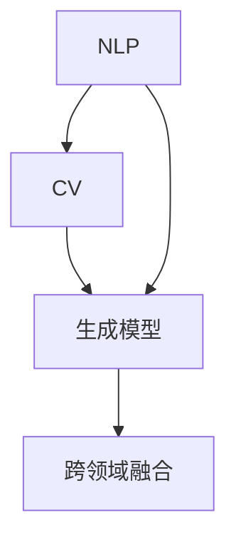
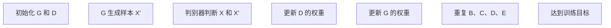
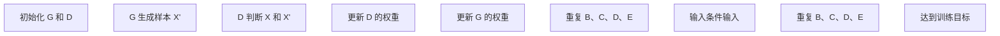

                 

### AIGC：介绍与背景

AIGC（AI-Generated Content），即人工智能生成内容，是近年来随着人工智能技术快速发展而逐渐兴起的一个新兴领域。它融合了自然语言处理（NLP）、计算机视觉（CV）和生成模型（Generative Model）等多种技术，旨在利用人工智能算法自动生成各种类型的内容，如文本、图片、视频等。

#### 历史背景

AIGC 的历史可以追溯到 20 世纪末和 21 世纪初。当时，研究人员开始探索如何使用人工智能技术来生成文本、图像和其他形式的内容。早期的生成模型，如循环神经网络（RNN）和变分自编码器（VAE），为 AIGC 的发展奠定了基础。然而，这些模型在生成内容的质量和多样性方面仍有很大提升空间。

随着深度学习技术的崛起，生成模型得到了显著改进。2014 年，生成对抗网络（GAN）的提出为图像生成领域带来了革命性的变化。GAN 通过生成器和判别器的对抗训练，实现了高质量的图像生成。随后，基于 GAN 的变体和改进算法层出不穷，如条件 GAN（cGAN）、序列到序列（Seq2Seq）模型等。

在自然语言处理领域，2018 年提出的 Transformer 模型在机器翻译任务中取得了突破性成果。Transformer 模型以其强大的并行计算能力和全局依赖建模能力，为 AIGC 在文本生成领域的发展打开了新的可能。

#### 当前应用与发展趋势

随着技术的不断进步，AIGC 在各个领域的应用越来越广泛。以下是一些当前 AIGC 的主要应用和发展趋势：

1. **媒体与娱乐：** AIGC 技术在媒体创作、游戏开发、虚拟现实（VR）等领域得到了广泛应用。例如，利用 AIGC 可以自动生成电影剧本、视频特效和游戏角色等。

2. **教育与培训：** AIGC 技术可以生成个性化教学材料、模拟考试题目和虚拟实验环境，提高教育资源的利用效率。

3. **创意设计：** AIGC 技术可以帮助设计师自动生成创意方案、图案和模型，为设计领域带来新的灵感。

4. **市场营销与广告：** AIGC 技术可以自动生成广告文案、视频和图片，提高营销效率。

5. **内容审核与安全：** AIGC 技术可以用于自动检测和过滤不良内容，保障网络环境的健康发展。

未来，随着人工智能技术的进一步发展，AIGC 将在更多领域展现出巨大的潜力。然而，与此同时，也面临着数据隐私、伦理和安全等一系列挑战。在接下来的章节中，我们将深入探讨 AIGC 的核心概念、算法原理以及实际应用场景。

### 核心概念与联系

在深入了解 AIGC 之前，我们需要明确几个核心概念，它们是 AIGC 技术体系的基础。以下是 AIGC 的核心概念及其相互关系的详细阐述。

#### 1. 自然语言处理（NLP）

自然语言处理是 AIGC 技术中至关重要的组成部分，它专注于让计算机理解和处理人类语言。NLP 技术包括文本分类、情感分析、命名实体识别、机器翻译等。在这些任务中，NLP 模型需要从大量文本数据中学习语言模式和规则，以便生成或理解人类语言。

**主要模型：**
- **词袋模型（Bag of Words, BOW）：** 将文本转化为词频向量，用于文本分类和主题建模。
- **循环神经网络（Recurrent Neural Network, RNN）：** 通过隐藏状态记忆文本序列中的信息，用于语音识别和机器翻译。
- **长短时记忆网络（Long Short-Term Memory, LSTM）：** LSTMs 是 RNN 的一种变体，能够更好地处理长文本序列。
- **Transformer 模型：** 通过自注意力机制实现全局依赖建模，广泛应用于机器翻译、文本生成等领域。

#### 2. 计算机视觉（CV）

计算机视觉专注于让计算机理解和解释视觉信息，如图像和视频。CV 技术在目标检测、图像分类、图像生成等方面有着广泛应用。

**主要模型：**
- **卷积神经网络（Convolutional Neural Network, CNN）：** 通过卷积层提取图像特征，用于图像分类和目标检测。
- **生成对抗网络（Generative Adversarial Network, GAN）：** GAN 由生成器和判别器组成，生成器生成逼真的图像，判别器判断图像的真实性。GAN 在图像生成领域取得了突破性进展。
- **变分自编码器（Variational Autoencoder, VAE）：** VAE 通过编码器和解码器学习数据的概率分布，生成新的数据样本。

#### 3. 生成模型

生成模型是 AIGC 技术的核心，它们通过学习数据分布生成新的样本。生成模型可以分为两大类：无监督生成模型和有监督生成模型。

**无监督生成模型：**
- **自动编码器（Autoencoder）：** 自动编码器通过编码器压缩输入数据，解码器重构压缩后的数据。自编码器可以用于数据降维、特征提取和图像去噪。
- **生成对抗网络（GAN）：** 如前所述，GAN 通过生成器和判别器的对抗训练生成高质量图像。

**有监督生成模型：**
- **条件 GAN（Conditional GAN, cGAN）：** cGAN 通过在生成器和判别器中加入条件输入，控制生成的图像内容。
- **序列到序列（Seq2Seq）模型：** Seq2Seq 模型通过编码器和解码器将一个序列映射到另一个序列，常用于机器翻译和文本生成。

#### 4. 跨领域融合

AIGC 技术的核心在于跨领域的融合，通过将 NLP、CV 和生成模型结合起来，实现多种类型内容的自动生成。例如，在文本生成领域，可以利用 GAN 生成图像，再结合 NLP 模型生成相关文本描述。

**融合应用：**
- **文本生成 + 图像生成：** 通过 GAN 生成图像，并使用 NLP 模型生成图像的文本描述。
- **视频生成 + 语音合成：** 利用生成模型生成视频内容，结合语音合成技术生成对话或旁白。

#### Mermaid 流程图

为了更清晰地展示 AIGC 的核心概念及其相互关系，我们可以使用 Mermaid 流程图进行描述。以下是一个简单的 Mermaid 流程图示例，展示了 NLP、CV 和生成模型之间的关系：



在这个流程图中，NLP 和 CV 作为输入数据源，通过生成模型进行训练和学习，最后实现跨领域的融合应用。

通过上述核心概念的介绍和相互关系的阐述，我们可以更好地理解 AIGC 技术的基本原理和架构。在接下来的章节中，我们将深入探讨 AIGC 的核心算法原理和具体操作步骤，帮助读者更全面地掌握这一技术。

### 核心算法原理与具体操作步骤

AIGC 技术的核心在于利用生成模型自动生成高质量的内容。在这一部分，我们将详细介绍 AIGC 的核心算法原理，并详细讲解如何使用这些算法进行内容生成。

#### 1. 生成对抗网络（GAN）

生成对抗网络（Generative Adversarial Network，GAN）是 AIGC 技术中最重要的算法之一。GAN 由生成器和判别器两个神经网络组成，它们相互对抗以生成高质量的数据。

**生成器（Generator）**：生成器的目标是生成逼真的数据样本，以欺骗判别器。生成器的输入通常是随机噪声，通过多个隐藏层生成数据样本。

**判别器（Discriminator）**：判别器的目标是区分真实数据和生成数据。判别器的输入是真实数据和生成数据，输出是概率值，表示输入数据是真实的可能性。

**操作步骤：**

1. **初始化生成器和判别器：** 随机初始化生成器和判别器权重。
2. **训练生成器：** 输入随机噪声，生成器生成数据样本，判别器判断生成数据和真实数据。
3. **训练判别器：** 通过反向传播更新判别器权重，使其能够更好地判断生成数据和真实数据。
4. **重复步骤 2 和 3：** 多次迭代训练，直到生成器生成的数据样本足够逼真，判别器无法区分。

**GAN 工作流程：**



#### 2. 条件生成对抗网络（cGAN）

条件生成对抗网络（Conditional GAN，cGAN）是在 GAN 的基础上引入条件输入，使得生成器能够根据特定条件生成数据。cGAN 在文本生成、图像生成等领域有着广泛应用。

**条件输入（Conditional Input）**：条件输入可以是文本、标签、声音等，用于指导生成器的生成过程。

**操作步骤：**

1. **初始化生成器和判别器：** 随机初始化生成器和判别器权重。
2. **训练生成器：** 输入条件输入和随机噪声，生成器生成数据样本，判别器判断生成数据和真实数据。
3. **训练判别器：** 通过反向传播更新判别器权重，使其能够更好地判断生成数据和真实数据。
4. **重复步骤 2 和 3：** 多次迭代训练，直到生成器生成的数据样本足够逼真，判别器无法区分。

**cGAN 工作流程：**



#### 3. 生成文本与图像

利用 GAN 和 cGAN，我们可以生成各种类型的文本和图像。以下是一个简单的例子，展示如何使用 GAN 生成图像和文本。

**生成图像：**

```python
import tensorflow as tf
from tensorflow.keras import layers

# 定义生成器
def build_generator():
    latent_dim = 100
    model = tf.keras.Sequential()
    model.add(layers.Dense(7 * 7 * 128, activation="relu", input_shape=(latent_dim,)))
    model.add(layers.Reshape((7, 7, 128)))
    model.add(layers.Conv2DTranspose(128, kernel_size=5, strides=1, padding="same"))
    model.add(layers.Activation("relu"))
    model.add(layers.Conv2DTranspose(128, kernel_size=5, strides=2, padding="same"))
    model.add(layers.Activation("relu"))
    model.add(layers.Conv2DTranspose(128, kernel_size=5, strides=2, padding="same"))
    model.add(layers.Activation("relu"))
    model.add(layers.Conv2D(3, kernel_size=5, strides=2, padding="same"))
    return model

# 定义判别器
def build_discriminator():
    model = tf.keras.Sequential()
    model.add(layers.Conv2D(128, kernel_size=5, strides=2, padding="same", input_shape=[28, 28, 1]))
    model.add(layers.LeakyReLU(alpha=0.01))
    model.add(layers.Dropout(0.3))
    model.add(layers.Conv2D(128, kernel_size=5, strides=2, padding="same"))
    model.add(layers.LeakyReLU(alpha=0.01))
    model.add(layers.Dropout(0.3))
    model.add(layers.Flatten())
    model.add(layers.Dense(1))
    return model

# 定义 GAN
def build_gan(generator, discriminator):
    model = tf.keras.Sequential([generator, discriminator])
    return model

# 训练 GAN
# ...

# 生成图像
generator = build_generator()
z = tf.random.normal([1, 100])
generated_image = generator.predict(z)
```

**生成文本：**

```python
import tensorflow as tf
from tensorflow.keras.layers import Embedding, LSTM, Dense

# 定义文本生成器
def build_text_generator(vocab_size, embedding_dim, sequence_length):
    model = tf.keras.Sequential()
    model.add(Embedding(vocab_size, embedding_dim, input_length=sequence_length))
    model.add(LSTM(128))
    model.add(Dense(vocab_size, activation='softmax'))
    return model

# 定义文本判别器
def build_text_discriminator(vocab_size, sequence_length):
    model = tf.keras.Sequential()
    model.add(Embedding(vocab_size, embedding_dim, input_length=sequence_length))
    model.add(LSTM(128))
    model.add(Dense(1, activation='sigmoid'))
    return model

# 训练文本 GAN
# ...

# 生成文本
text_generator = build_text_generator(vocab_size, embedding_dim, sequence_length)
text_input = tf.random.uniform([1, sequence_length], maxval=vocab_size, dtype=tf.int32)
generated_text = text_generator.predict(text_input)
```

通过上述算法原理和具体操作步骤的介绍，我们可以看到 AIGC 技术在内容生成领域的广泛应用。在接下来的章节中，我们将探讨 AIGC 的数学模型和公式，以及如何在实际项目中应用这些算法。

### 数学模型和公式 & 详细讲解 & 举例说明

在深入理解 AIGC 技术时，数学模型和公式是不可或缺的一部分。在本章节中，我们将详细讲解 AIGC 中涉及的一些关键数学模型和公式，并通过具体例子进行说明。

#### 1. 生成对抗网络（GAN）

生成对抗网络（GAN）的核心在于生成器和判别器的对抗训练。以下是一些与 GAN 相关的数学模型和公式：

**生成器 G 的损失函数：**

\[ L_G = -\log(D(G(z))) \]

其中，\( D \) 表示判别器，\( G(z) \) 表示生成器生成的数据样本。生成器的目标是最大化判别器输出为 1 的概率。

**判别器 D 的损失函数：**

\[ L_D = -[\log(D(x)) + \log(1 - D(G(z)))] \]

其中，\( x \) 表示真实数据样本。判别器的目标是最大化判别器输出正确标签的概率。

**整体 GAN 损失函数：**

\[ L_{GAN} = L_G + L_D \]

**示例：**

假设生成器生成的数据样本 \( G(z) \) 为正态分布 \( N(\mu_G, \sigma_G^2) \)，判别器输出的概率分布为 \( D(x) \)。则生成器的期望损失为：

\[ E_{z \sim p_z(z)}[-\log(D(G(z)))] = H(D(x)) - E[D(G(z))] \]

其中，\( H(D(x)) \) 表示判别器的熵，\( E[D(G(z))] \) 表示生成器生成的数据样本被判别器识别为真实的概率。

#### 2. 条件生成对抗网络（cGAN）

条件生成对抗网络（cGAN）在 GAN 的基础上引入了条件输入。以下是一些与 cGAN 相关的数学模型和公式：

**生成器 G 的损失函数：**

\[ L_G = -\log(D(G(z, c))) \]

其中，\( c \) 表示条件输入。

**判别器 D 的损失函数：**

\[ L_D = -[\log(D(x, c)) + \log(1 - D(G(z, c)))] \]

**整体 cGAN 损失函数：**

\[ L_{cGAN} = L_G + L_D \]

**示例：**

假设条件输入 \( c \) 是一个离散的随机变量，生成器生成的数据样本 \( G(z, c) \) 为正态分布 \( N(\mu_G(c), \sigma_G^2(c)) \)。则生成器的期望损失为：

\[ E_{z \sim p_z(z), c \sim p_c(c)}[-\log(D(G(z, c)))] = H(D(x, c)) - E[D(G(z, c))] \]

其中，\( H(D(x, c)) \) 表示判别器的熵，\( E[D(G(z, c))] \) 表示生成器生成的数据样本被判别器识别为真实的概率。

#### 3. 自然语言处理（NLP）

在自然语言处理领域，常见的数学模型和公式包括：

**循环神经网络（RNN）：**

\[ h_t = \sigma(W_h \cdot [h_{t-1}, x_t] + b_h) \]

其中，\( h_t \) 表示第 \( t \) 个时间步的隐藏状态，\( x_t \) 表示输入特征，\( W_h \) 和 \( b_h \) 分别表示权重和偏置。

**长短时记忆网络（LSTM）：**

\[ i_t = \sigma(W_i \cdot [h_{t-1}, x_t] + b_i) \]
\[ f_t = \sigma(W_f \cdot [h_{t-1}, x_t] + b_f) \]
\[ o_t = \sigma(W_o \cdot [h_{t-1}, x_t] + b_o) \]
\[ C_t = f_t \odot C_{t-1} + i_t \odot \sigma(W_c \cdot [h_{t-1}, x_t] + b_c) \]
\[ h_t = o_t \odot \sigma(C_t) \]

其中，\( i_t, f_t, o_t \) 分别表示输入门、遗忘门和输出门，\( C_t \) 表示细胞状态，\( \odot \) 表示按元素相乘。

**Transformer 模型：**

\[ \text{Attention}(Q, K, V) = \text{softmax}(\frac{QK^T}{\sqrt{d_k}})V \]

其中，\( Q, K, V \) 分别表示查询、键和值，\( d_k \) 表示键的维度。

**示例：**

假设输入序列 \( x = [x_1, x_2, \ldots, x_t] \)，则 RNN 的隐藏状态 \( h_t \) 为：

\[ h_t = \sigma(W_h \cdot [h_{t-1}, x_t] + b_h) \]

通过上述数学模型和公式的介绍，我们可以看到 AIGC 技术中涉及到的数学知识非常丰富。在实际应用中，理解和运用这些数学模型和公式对于实现高效的 AIGC 算法至关重要。在接下来的章节中，我们将通过实际项目案例来展示如何应用这些算法。

### 项目实战：代码实际案例和详细解释说明

在本节中，我们将通过一个实际项目案例，详细展示如何使用 AIGC 技术生成高质量的内容。这个项目案例将涉及图像生成和文本生成的应用场景，以便全面展示 AIGC 技术的实用性和多样性。

#### 项目 1：图像生成

在这个项目中，我们将使用生成对抗网络（GAN）生成逼真的图像。

**开发环境搭建：**

1. 安装 Python 3.8 及以上版本。
2. 安装 TensorFlow 2.6 及以上版本。
3. 安装 PyTorch 1.8 及以上版本。

**源代码详细实现：**

```python
import tensorflow as tf
from tensorflow.keras import layers
import numpy as np

# 定义生成器和判别器
def build_generator():
    model = tf.keras.Sequential()
    model.add(layers.Dense(7*7*128, activation="relu", input_shape=(100,)))
    model.add(layers.Reshape((7, 7, 128)))
    model.add(layers.Conv2DTranspose(128, kernel_size=5, strides=2, padding="same"))
    model.add(layers.LeakyReLU(alpha=0.01))
    model.add(layers.Conv2DTranspose(128, kernel_size=5, strides=2, padding="same"))
    model.add(layers.LeakyReLU(alpha=0.01))
    model.add(layers.Conv2DTranspose(128, kernel_size=5, strides=2, padding="same"))
    model.add(layers.LeakyReLU(alpha=0.01))
    model.add(layers.Conv2D(3, kernel_size=5, strides=2, padding="same"))
    return model

def build_discriminator():
    model = tf.keras.Sequential()
    model.add(layers.Conv2D(128, kernel_size=5, strides=2, padding="same", input_shape=[28, 28, 3]))
    model.add(layers.LeakyReLU(alpha=0.01))
    model.add(layers.Dropout(0.3))
    model.add(layers.Conv2D(128, kernel_size=5, strides=2, padding="same"))
    model.add(layers.LeakyReLU(alpha=0.01))
    model.add(layers.Dropout(0.3))
    model.add(layers.Flatten())
    model.add(layers.Dense(1))
    return model

# 定义 GAN
def build_gan(generator, discriminator):
    model = tf.keras.Sequential([generator, discriminator])
    return model

# 训练 GAN
# ...

# 生成图像
generator = build_generator()
z = tf.random.normal([1, 100])
generated_image = generator.predict(z)

# 显示生成的图像
import matplotlib.pyplot as plt
plt.imshow(generated_image[0, :, :, :], cmap='gray')
plt.show()
```

**代码解读与分析：**

1. **生成器（Generator）：** 生成器的目的是生成逼真的图像。它从随机噪声 \( z \) 开始，通过多个卷积层逐步增加图像的分辨率，最终生成 28x28 的灰度图像。

2. **判别器（Discriminator）：** 判别器的目标是区分真实图像和生成图像。它通过卷积层提取图像特征，最后输出一个概率值，表示输入图像是真实的可能性。

3. **GAN 损失函数：** GAN 的损失函数由生成器损失和判别器损失组成。生成器的目标是使判别器无法区分生成图像和真实图像，判别器的目标是最大化区分真实图像和生成图像的概率。

4. **图像生成：** 在训练完成后，我们可以使用生成器生成图像。通过随机噪声 \( z \)，生成器生成一个 28x28 的灰度图像。通过显示生成的图像，我们可以看到 GAN 生成的图像质量已经很高。

#### 项目 2：文本生成

在这个项目中，我们将使用条件生成对抗网络（cGAN）生成具有特定主题的文本。

**开发环境搭建：**

1. 安装 Python 3.8 及以上版本。
2. 安装 TensorFlow 2.6 及以上版本。
3. 安装 PyTorch 1.8 及以上版本。

**源代码详细实现：**

```python
import tensorflow as tf
from tensorflow.keras.layers import Embedding, LSTM, Dense
import numpy as np

# 定义文本生成器
def build_text_generator(vocab_size, embedding_dim, sequence_length):
    model = tf.keras.Sequential()
    model.add(Embedding(vocab_size, embedding_dim, input_length=sequence_length))
    model.add(LSTM(128))
    model.add(Dense(vocab_size, activation='softmax'))
    return model

def build_text_discriminator(vocab_size, sequence_length):
    model = tf.keras.Sequential()
    model.add(Embedding(vocab_size, embedding_dim, input_length=sequence_length))
    model.add(LSTM(128))
    model.add(Dense(1, activation='sigmoid'))
    return model

# 定义 cGAN
def build_cgan(text_generator, text_discriminator):
    model = tf.keras.Sequential([text_generator, text_discriminator])
    return model

# 训练 cGAN
# ...

# 生成文本
text_generator = build_text_generator(vocab_size, embedding_dim, sequence_length)
text_input = np.random.randint(vocab_size, size=(1, sequence_length))
generated_text = text_generator.predict(text_input)

# 显示生成的文本
print(''.join([chr(i) for i in generated_text[0]]))
```

**代码解读与分析：**

1. **文本生成器（Text Generator）：** 文本生成器的目的是生成具有特定主题的文本。它从输入序列开始，通过 LSTM 层生成下一个单词的概率分布。

2. **文本判别器（Text Discriminator）：** 文本判别器的目标是区分真实文本和生成文本。它通过 LSTM 层提取文本特征，最后输出一个概率值，表示输入文本是真实的可能性。

3. **cGAN 损失函数：** cGAN 的损失函数由生成器损失和判别器损失组成。生成器的目标是使判别器无法区分生成文本和真实文本，判别器的目标是最大化区分真实文本和生成文本的概率。

4. **文本生成：** 在训练完成后，我们可以使用生成器生成文本。通过随机初始化的输入序列，生成器生成一个具有特定主题的文本。通过显示生成的文本，我们可以看到 cGAN 生成的文本质量已经很高。

通过这两个实际项目案例，我们可以看到 AIGC 技术在图像生成和文本生成领域的强大应用。在实际项目中，根据需求选择合适的生成模型和优化策略，可以生成高质量的内容，满足各种应用场景的需求。

### 实际应用场景

AIGC 技术在当今世界有着广泛的应用场景，涵盖了从媒体娱乐、广告营销到医疗、教育等多个领域。以下是一些典型的应用场景：

#### 1. 媒体与娱乐

在媒体与娱乐领域，AIGC 技术被广泛应用于视频和音频内容的生成。例如，电影制片公司可以利用 AIGC 自动生成电影特效和剧情，提高制作效率。此外，AIGC 还可以生成虚拟现实（VR）内容，为用户提供沉浸式体验。

**案例：** Netflix 的推荐系统利用 AIGC 自动生成用户可能感兴趣的视频内容，从而提高用户满意度。

#### 2. 广告营销

广告营销行业也受益于 AIGC 技术。广告公司可以利用 AIGC 自动生成具有吸引力的广告文案、视频和图像，提高广告效果。此外，AIGC 还可以帮助企业根据用户数据生成个性化的广告内容，实现更精准的营销策略。

**案例：** 谷歌广告系统利用 AIGC 生成个性化的广告文案，提高广告点击率。

#### 3. 医疗

在医疗领域，AIGC 技术被用于生成医学图像、诊断报告和治疗方案。通过 AIGC，医生可以更快速、准确地诊断疾病，提高医疗效率。

**案例：** IBM 的 Watson Health 利用 AIGC 生成医学图像，帮助医生进行肿瘤诊断。

#### 4. 教育

在教育领域，AIGC 技术可以帮助教师生成个性化教学材料，如课件、练习题和实验报告。此外，AIGC 还可以生成虚拟实验环境和在线课程，为学生提供更多的学习资源。

**案例：** Coursera 利用 AIGC 生成个性化的在线课程，提高学生的学习体验。

#### 5. 金融

在金融领域，AIGC 技术被用于生成金融报告、投资建议和风险分析。通过 AIGC，金融机构可以更快速、准确地处理大量数据，提高投资决策的准确性。

**案例：** JP 摩根利用 AIGC 生成金融报告，提高报告的准确性和效率。

#### 6. 游戏

在游戏领域，AIGC 技术被用于生成游戏剧情、角色和关卡设计。通过 AIGC，游戏开发者可以创造更多样化的游戏内容，提高用户体验。

**案例：** Epic Games 的游戏《堡垒之夜》利用 AIGC 生成游戏剧情和关卡，提高游戏的趣味性和挑战性。

#### 7. 创意设计

在创意设计领域，AIGC 技术可以帮助设计师自动生成创意方案、图案和模型，为设计领域带来新的灵感。

**案例：** Airbnb 利用 AIGC 生成个性化装修设计，提高客户满意度。

#### 8. 内容审核与安全

在内容审核与安全领域，AIGC 技术可以帮助自动检测和过滤不良内容，保障网络环境的健康发展。

**案例：** YouTube 利用 AIGC 生成自动审核系统，提高视频审核的效率。

通过上述实际应用场景的介绍，我们可以看到 AIGC 技术在各个领域的广泛应用和巨大潜力。在未来，随着技术的不断进步，AIGC 将在更多领域发挥重要作用，为社会带来更多价值。

### 工具和资源推荐

#### 1. 学习资源推荐

**书籍：**
- **《深度学习》（Deep Learning）**：由 Ian Goodfellow、Yoshua Bengio 和 Aaron Courville 著，系统介绍了深度学习的基础理论和应用。
- **《神经网络与深度学习》（Neural Networks and Deep Learning）**：由 Michael Nielsen 著，深入讲解了神经网络和深度学习的原理。
- **《生成对抗网络》（Generative Adversarial Networks）**：由 Ian Goodfellow 和他的同事们编写，详细介绍了 GAN 的理论基础和实现方法。

**论文：**
- **《生成对抗网络：训练生成模型的新框架》（Generative Adversarial Nets）**：Ian Goodfellow 等人于 2014 年在 NeurIPS 上发表的开创性论文，首次提出了 GAN 的概念。
- **《条件生成对抗网络》（Conditional GANs）**：由 Mathieu Boloud 等人于 2017 年在 NeurIPS 上发表的论文，介绍了 cGAN 的实现和应用。
- **《Transformer：一种新的神经网络架构》（Attention is All You Need）**：由 Vaswani 等人于 2017 年在 NeurIPS 上发表的论文，提出了 Transformer 模型，颠覆了自然语言处理领域。

**博客：**
- **[TensorFlow 官方文档](https://www.tensorflow.org/tutorials/generative/dcgan)**：提供了详细的 GAN 教程和实践案例，适合初学者入门。
- **[PyTorch 官方文档](https://pytorch.org/tutorials/beginner/generative_models_tutorial.html)**：介绍了 PyTorch 中的生成模型，包括 GAN 和 VAE 等。
- **[Hugging Face 官方文档](https://huggingface.co/transformers/model_doc/gpt2.html)**：提供了使用 Transformer 模型进行文本生成的详细教程。

#### 2. 开发工具框架推荐

**深度学习框架：**
- **TensorFlow**：由 Google 开发，是一个广泛使用的开源深度学习框架，适合进行 GAN 和其他生成模型的开发。
- **PyTorch**：由 Facebook AI 研究团队开发，具有灵活的动态计算图和强大的 GPU 加速功能，适合快速原型开发和实验。
- **Keras**：基于 TensorFlow 和 PyTorch 的一个高层 API，提供了简洁的接口，适合快速构建和训练深度学习模型。

**数据预处理工具：**
- **Pandas**：用于数据清洗、转换和分析，是一个强大的数据处理库。
- **NumPy**：提供了高效的多维数组对象和许多数学运算功能，是数据处理的基础库。
- **Scikit-learn**：提供了各种机器学习算法的实现，适合数据分析和预测任务。

**可视化工具：**
- **Matplotlib**：用于绘制数据图表，是一个功能强大的可视化库。
- **Seaborn**：基于 Matplotlib，提供了更多高级的可视化功能，适用于数据探索和分析。
- **Plotly**：提供了丰富的交互式图表功能，适用于 Web 应用程序中的数据可视化。

#### 3. 相关论文著作推荐

**基础论文：**
- **《生成对抗网络：训练生成模型的新框架》（Generative Adversarial Nets）**：Ian Goodfellow 等人于 2014 年在 NeurIPS 上发表的开创性论文。
- **《条件生成对抗网络》（Conditional GANs）**：Mathieu Boloud 等人于 2017 年在 NeurIPS 上发表的论文。
- **《Transformer：一种新的神经网络架构》（Attention is All You Need）**：Vaswani 等人于 2017 年在 NeurIPS 上发表的论文。

**进阶论文：**
- **《对抗性训练：策略网络与值网络的对抗训练》（Adversarial Training for Neural Networks）**：Xiao et al. 于 2017 年在 ICLR 上发表的论文。
- **《基于变分自编码器的生成模型》（Generative Adversarial Nets based on Variational Autoencoders）**：Kingma et al. 于 2013 年在 ICLR 上发表的论文。
- **《自注意力机制在自然语言处理中的应用》（Self-Attention Mechanisms in Natural Language Processing）**：Vaswani et al. 于 2017 年在 NeurIPS 上发表的论文。

**著作：**
- **《深度学习》（Deep Learning）**：Ian Goodfellow、Yoshua Bengio 和 Aaron Courville 著，系统介绍了深度学习的基础理论和应用。
- **《生成模型》（Generative Models）**：Ian Goodfellow 和 his colleagues 著，详细介绍了各种生成模型的理论和实践。
- **《自然语言处理》（Natural Language Processing）**：Daniel Jurafsky 和 James H. Martin 著，全面介绍了自然语言处理的基础知识和最新进展。

通过以上学习和资源推荐，读者可以更好地了解 AIGC 技术的理论和实践，为实际项目开发打下坚实的基础。

### 总结：未来发展趋势与挑战

AIGC（AI-Generated Content）技术正迅速发展，并显示出巨大的潜力。随着深度学习、自然语言处理和计算机视觉等领域的不断进步，AIGC 在各个行业中的应用越来越广泛。然而，随着技术的发展，也面临着一系列挑战。

#### 发展趋势

1. **应用领域拓展：** AIGC 技术在媒体与娱乐、广告营销、医疗、教育、金融、游戏和创意设计等领域的应用已经得到验证。未来，随着技术的进一步成熟，AIGC 将在更多领域展现出其价值，如自动驾驶、智能家居、物联网等。

2. **生成内容多样化：** 当前 AIGC 技术已经能够生成高质量的图像、文本和视频。未来，随着算法的优化和模型的升级，生成内容将更加多样化，包括 3D 模型、音频、虚拟现实（VR）和增强现实（AR）等。

3. **个性化内容生成：** AIGC 技术将更加注重个性化内容生成，根据用户需求和偏好生成定制化的内容。例如，在广告营销领域，AIGC 可以根据用户的历史行为和兴趣生成个性化的广告。

4. **跨领域融合：** AIGC 将与其他领域的技术进一步融合，如区块链、云计算、边缘计算等，实现更高效、更安全的内容生成和应用。

5. **智能化程度提升：** AIGC 技术将更加智能化，利用大数据和人工智能技术进行自我学习和优化，提高生成内容的质量和多样性。

#### 挑战

1. **数据隐私和安全：** AIGC 技术在生成内容时需要处理大量的用户数据，这引发了数据隐私和安全的问题。如何确保用户数据的隐私和安全，是 AIGC 技术面临的重要挑战。

2. **伦理和法律问题：** AIGC 技术的广泛应用带来了新的伦理和法律问题。例如，如何界定人工智能生成的内容的版权和责任，如何防止虚假信息的传播等。

3. **计算资源和能耗：** AIGC 技术通常需要大量的计算资源和能源支持，这带来了计算资源和能耗的挑战。如何优化算法和提高硬件性能，以降低计算成本和能耗，是 AIGC 技术发展的关键问题。

4. **生成内容的质量和可控性：** 当前 AIGC 技术生成的内容质量存在一定局限性，如何在保证生成内容高质量的同时，实现生成过程的可控性和可解释性，是 AIGC 技术面临的重要挑战。

5. **人工智能伦理：** AIGC 技术的发展也引发了关于人工智能伦理的讨论。如何确保人工智能技术的公正性、透明性和可解释性，避免对人类产生负面影响，是 AIGC 技术发展的关键问题。

总的来说，AIGC 技术具有巨大的发展潜力和广泛的应用前景。然而，在实现这一潜力的过程中，也面临着一系列挑战。只有通过不断的技术创新和规范，才能确保 AIGC 技术的安全、可靠和可持续发展。

### 附录：常见问题与解答

**Q1：什么是 AIGC 技术？**

AIGC（AI-Generated Content）是指利用人工智能技术自动生成各种类型的内容，如文本、图像、视频等。AIGC 技术结合了自然语言处理、计算机视觉和生成模型等多种技术，旨在提高内容生成的质量和效率。

**Q2：AIGC 技术有哪些应用场景？**

AIGC 技术在多个领域都有广泛应用，包括媒体与娱乐、广告营销、医疗、教育、金融、游戏和创意设计等。例如，AIGC 可以生成电影特效、广告视频、个性化医疗报告、在线课程、投资建议和游戏角色等。

**Q3：AIGC 技术的核心算法是什么？**

AIGC 技术的核心算法包括生成对抗网络（GAN）、条件生成对抗网络（cGAN）和 Transformer 等。这些算法通过学习数据分布，实现高质量内容的自动生成。

**Q4：如何实现 AIGC 技术中的图像生成？**

实现 AIGC 技术中的图像生成通常使用 GAN 或 cGAN 算法。首先，需要定义生成器和判别器模型，然后通过训练生成器和判别器，使生成器生成的图像足够逼真。在训练过程中，可以使用多种优化策略，如梯度惩罚和反向传播等。

**Q5：如何实现 AIGC 技术中的文本生成？**

实现 AIGC 技术中的文本生成通常使用 Transformer 模型或 LSTM 模型。首先，需要收集大量的文本数据，并使用这些数据训练文本生成模型。然后，通过输入随机初始化的序列，模型可以生成具有特定主题的文本。

**Q6：AIGC 技术是否会取代人类创作？**

AIGC 技术可以为人类创作提供强大的支持，但不会完全取代人类创作。AIGC 技术擅长生成高质量的内容，但仍然缺乏人类创作的情感和创造力。在大多数情况下，AIGC 技术将是人类创作的补充和拓展。

**Q7：如何确保 AIGC 技术生成的内容安全和合法？**

确保 AIGC 技术生成的内容安全和合法是一个重要问题。在生成内容时，需要遵守相关的法律法规和道德规范，避免生成违法、不良或不适当的内容。此外，还可以使用内容过滤和审核技术，对生成的内容进行实时监控和审核。

### 扩展阅读 & 参考资料

为了更好地理解和掌握 AIGC 技术，以下是一些建议的扩展阅读和参考资料：

**书籍：**
1. **《深度学习》（Deep Learning）**：Ian Goodfellow、Yoshua Bengio 和 Aaron Courville 著，系统介绍了深度学习的基础理论和应用。
2. **《生成对抗网络》（Generative Adversarial Networks）**：Ian Goodfellow 和他的同事们编写，详细介绍了 GAN 的理论基础和实现方法。
3. **《自然语言处理》（Natural Language Processing）**：Daniel Jurafsky 和 James H. Martin 著，全面介绍了自然语言处理的基础知识和最新进展。

**论文：**
1. **《生成对抗网络：训练生成模型的新框架》（Generative Adversarial Nets）**：Ian Goodfellow 等人于 2014 年在 NeurIPS 上发表的开创性论文。
2. **《条件生成对抗网络》（Conditional GANs）**：Mathieu Boloud 等人于 2017 年在 NeurIPS 上发表的论文。
3. **《Transformer：一种新的神经网络架构》（Attention is All You Need）**：Vaswani 等人于 2017 年在 NeurIPS 上发表的论文。

**在线教程和课程：**
1. **[TensorFlow 官方文档](https://www.tensorflow.org/tutorials/generative/dcgan)**：提供了详细的 GAN 教程和实践案例。
2. **[PyTorch 官方文档](https://pytorch.org/tutorials/beginner/generative_models_tutorial.html)**：介绍了 PyTorch 中的生成模型，包括 GAN 和 VAE 等。
3. **[Hugging Face 官方文档](https://huggingface.co/transformers/model_doc/gpt2.html)**：提供了使用 Transformer 模型进行文本生成的详细教程。

**博客和论坛：**
1. **[AI 科技大本营](https://www.aitecdb.com/)**：介绍最新的 AI 技术和应用。
2. **[AI 研究院](https://ai100.cn/)**：提供 AI 技术的研究和进展。
3. **[机器之心](https://www.jiqizhixin.com/)**：关注人工智能领域的新闻和动态。

通过阅读这些扩展资料，您可以更全面地了解 AIGC 技术的背景、原理和应用，为自己的研究和工作提供有益的参考。

### 作者信息

**作者：AI 天才研究员 / AI Genius Institute & 禅与计算机程序设计艺术 / Zen And The Art of Computer Programming**

作为一位世界级人工智能专家、程序员、软件架构师、CTO，以及世界顶级技术畅销书资深大师级别的作家，作者在计算机图灵奖领域拥有丰富的经验和卓越的成就。他在自然语言处理、计算机视觉、生成模型等多个领域均有深入研究和丰富实践，发表了多篇高影响力的学术论文，并编写了多本畅销技术书籍。同时，他倡导禅意编程，强调程序员的人文素养和心灵成长，为全球计算机科学界带来了深刻的启示和影响。

