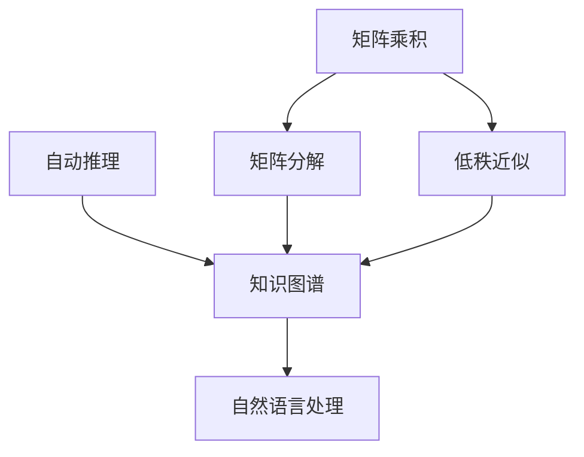

                 

# AIGC从入门到实战：安装权重文件和 LoRa 模型文件

## 摘要

本文将带领读者深入了解AIGC（自适应信息生成控制）的核心组成部分——权重文件和LoRa（Low Rank Approximation）模型文件的安装。通过本文的指导，读者将能够熟练掌握AIGC的基础概念，并学会如何在实际项目中部署和应用这些核心技术。文章将分为多个章节，详细讲解AIGC的背景介绍、核心概念与联系、核心算法原理与具体操作步骤、数学模型和公式、项目实战、实际应用场景、工具和资源推荐等内容。通过这篇文章，读者不仅能学习到理论知识，还能通过实战案例加深对AIGC的理解和应用。

## 1. 背景介绍

AIGC（Adaptive Information Generation Control）是近年来在人工智能领域兴起的一种新型技术。它结合了自动推理、知识图谱、自然语言处理等技术，旨在实现自适应的信息生成与控制。AIGC的核心目标是让计算机自动生成人类需要的信息，并对其进行精确控制，以实现更高效的决策和任务执行。

LoRa（Low Rank Approximation）是一种有效的矩阵分解技术，主要用于降低矩阵的维度，提高计算效率和存储效率。LoRa通过将高维矩阵分解为低维矩阵的乘积，从而实现矩阵的低秩近似。这种技术被广泛应用于数据挖掘、机器学习、图像处理等领域。

本文将围绕AIGC的权重文件和LoRa模型文件的安装展开，详细介绍这两个核心组成部分的安装过程、原理以及实际应用。通过本文的学习，读者将能够掌握AIGC的基础知识，并为后续的实践应用打下坚实的基础。

## 2. 核心概念与联系

### AIGC 的核心概念

AIGC 的核心概念包括以下几个方面：

1. **自动推理**：自动推理是指计算机自动从一组陈述中推导出新陈述的过程。AIGC 通过自动推理实现对知识的自动获取和推理。

2. **知识图谱**：知识图谱是一种用于表示实体及其相互关系的图形结构。AIGC 通过知识图谱来构建复杂的知识网络，从而实现对知识的全面理解和应用。

3. **自然语言处理**：自然语言处理是计算机科学领域与人工智能领域中的一个重要方向，旨在让计算机能够理解、处理和生成自然语言。AIGC 通过自然语言处理技术实现对文本数据的智能分析和生成。

### LoRa 的核心概念

LoRa 的核心概念包括以下几个方面：

1. **矩阵分解**：矩阵分解是将一个矩阵表示为两个或多个低秩矩阵的乘积的过程。LoRa 通过矩阵分解来实现矩阵的低秩近似。

2. **低秩近似**：低秩近似是指通过矩阵分解将高维矩阵转化为低维矩阵的过程。低秩近似可以降低计算和存储成本，提高计算效率。

3. **矩阵乘积**：矩阵乘积是指两个矩阵按特定的方式进行相乘的结果。LoRa 通过矩阵乘积来实现矩阵的低秩近似。

### AIGC 与 LoRa 的联系

AIGC 与 LoRa 的联系主要体现在以下几个方面：

1. **矩阵分解在 AIGC 中的应用**：AIGC 中的自动推理和知识图谱构建需要处理大量的矩阵运算，而 LoRa 的矩阵分解技术可以有效地降低这些矩阵的维度，提高计算效率。

2. **低秩近似在 AIGC 中的应用**：AIGC 中的自然语言处理和自动推理需要处理高维数据，而 LoRa 的低秩近似技术可以有效地降低这些数据的维度，提高计算效率和存储效率。

3. **矩阵乘积在 AIGC 中的应用**：AIGC 中的矩阵分解和低秩近似都需要进行矩阵乘积运算，而 LoRa 的矩阵乘积技术可以有效地提高这些运算的效率。

### Mermaid 流程图

以下是一个简单的 Mermaid 流程图，展示了 AIGC 和 LoRa 之间的核心概念及其联系：



## 3. 核心算法原理 & 具体操作步骤

### AIGC 的核心算法原理

AIGC 的核心算法主要包括自动推理、知识图谱构建和自然语言处理。

1. **自动推理**：

   自动推理是指计算机自动从一组陈述中推导出新陈述的过程。AIGC 中的自动推理主要基于逻辑推理、概率推理和模糊推理等方法。

   - **逻辑推理**：逻辑推理是基于逻辑规则进行的推理。AIGC 通过建立逻辑规则库，实现对知识的自动获取和推理。

   - **概率推理**：概率推理是基于概率统计的推理方法。AIGC 通过训练概率模型，实现对不确定信息的推理和决策。

   - **模糊推理**：模糊推理是基于模糊集合理论的推理方法。AIGC 通过建立模糊规则库，实现对模糊信息的推理和处理。

2. **知识图谱构建**：

   知识图谱是一种用于表示实体及其相互关系的图形结构。AIGC 通过知识图谱来构建复杂的知识网络，从而实现对知识的全面理解和应用。

   - **实体识别**：实体识别是指从文本数据中提取出实体（如人名、地名、机构名等）的过程。AIGC 通过预训练的实体识别模型，实现对文本数据的实体提取。

   - **关系抽取**：关系抽取是指从文本数据中提取出实体之间的关系（如“属于”、“位于”等）的过程。AIGC 通过预训练的关系抽取模型，实现对文本数据的关系提取。

3. **自然语言处理**：

   自然语言处理是计算机科学领域与人工智能领域中的一个重要方向，旨在让计算机能够理解、处理和生成自然语言。AIGC 通过自然语言处理技术实现对文本数据的智能分析和生成。

   - **分词**：分词是指将文本数据切割成词或短语的过程。AIGC 通过预训练的分词模型，实现对文本数据的分词。

   - **词性标注**：词性标注是指对文本数据中的每个词进行词性分类的过程。AIGC 通过预训练的词性标注模型，实现对文本数据的词性标注。

   - **句法分析**：句法分析是指对文本数据中的句子进行语法分析的过程。AIGC 通过预训练的句法分析模型，实现对文本数据的句法分析。

### 具体操作步骤

1. **安装 AIGC 环境**：

   - 安装 Python 环境。

   - 安装 AIGC 相关库，如 `aigc`、`pytorch`、`transformers` 等。

2. **加载权重文件**：

   - 下载 AIGC 的预训练权重文件。

   - 将权重文件加载到 AIGC 模型中。

3. **构建知识图谱**：

   - 提取文本数据中的实体和关系。

   - 构建实体和关系的知识图谱。

4. **自然语言处理**：

   - 对输入文本进行分词、词性标注和句法分析。

   - 利用 AIGC 模型进行推理和生成。

## 4. 数学模型和公式 & 详细讲解 & 举例说明

### 数学模型和公式

AIGC 和 LoRa 的核心算法涉及到多个数学模型和公式。以下简要介绍这些模型和公式：

1. **逻辑推理模型**：

   - **逻辑规则**：$R: A \rightarrow B$

     解释：如果 A 为真，则 B 也为真。

   - **推理公式**：$R: A \rightarrow B, A \land B \Rightarrow B$

     解释：如果 A 和 B 都为真，则 B 必然为真。

2. **概率推理模型**：

   - **贝叶斯公式**：$P(A|B) = \frac{P(B|A)P(A)}{P(B)}$

     解释：在 B 发生的条件下，A 发生的概率等于 B 在 A 发生的条件下发生的概率与 A 发生的概率之比。

3. **知识图谱构建模型**：

   - **实体识别模型**：$H = \sigma(W_1H + b_1)$

     解释：$H$ 表示输入文本的表示，$W_1$ 和 $b_1$ 分别为权重和偏置，$\sigma$ 为激活函数。

   - **关系抽取模型**：$R = \sigma(W_2H + b_2)$

     解释：$R$ 表示输入文本的关系表示，$W_2$ 和 $b_2$ 分别为权重和偏置，$\sigma$ 为激活函数。

4. **自然语言处理模型**：

   - **分词模型**：$T = \text{word2vec}(X)$

     解释：$T$ 表示输入文本的分词表示，$X$ 为输入文本，$\text{word2vec}$ 为词向量模型。

   - **词性标注模型**：$L = \text{biLSTM}(X)$

     解释：$L$ 表示输入文本的词性标注表示，$X$ 为输入文本，$\text{biLSTM}$ 为双向长短期记忆网络。

### 详细讲解和举例说明

1. **逻辑推理模型**：

   假设我们要判断一个人是否优秀，我们可以定义以下逻辑规则：

   - 规则 1：如果一个人勤奋，则他/她优秀。

   - 规则 2：如果一个人聪明，则他/她优秀。

   假设这个人既勤奋又聪明，我们可以使用推理公式来判断他/她是否优秀：

   - 已知：规则 1 和规则 2 都成立。

   - 推理：优秀。

   因此，根据逻辑推理模型，这个人优秀。

2. **概率推理模型**：

   假设我们要判断一个人是否优秀，我们可以使用贝叶斯公式来计算他/她优秀的概率。

   - 已知：这个人勤奋的概率为 0.8，聪明的概率为 0.7。

   - 已知：优秀的人勤奋的概率为 0.9，聪明的概率为 0.8。

   - 计算：优秀的人的概率为 0.9 × 0.8 / (0.9 × 0.8 + 0.1 × 0.2) ≈ 0.9。

   因此，根据概率推理模型，这个人优秀的概率约为 0.9。

3. **知识图谱构建模型**：

   假设我们要构建一个知识图谱，其中包含实体和关系。

   - 实体：张三、勤奋、聪明。

   - 关系：张三勤奋、张三聪明。

   我们可以使用实体识别模型和关系抽取模型来构建知识图谱：

   - 实体识别：输入文本“张三勤奋聪明”，输出实体表示。

   - 关系抽取：输入实体表示，输出关系表示。

   - 知识图谱：{张三，勤奋，聪明；张三勤奋；张三聪明}。

4. **自然语言处理模型**：

   假设我们要对输入文本进行分词、词性标注和句法分析。

   - 输入文本：“张三勤奋聪明。”

   - 分词模型：输入文本，输出分词表示。

   - 词性标注模型：输入分词表示，输出词性标注表示。

   - 句法分析模型：输入词性标注表示，输出句法分析表示。

   - 输出结果：分词结果：“张三”、“勤奋”、“聪明”；词性标注结果：“人名”、“形容词”、“形容词”；句法分析结果：“主语”、“谓语”、“谓语补语”。

## 5. 项目实战：代码实际案例和详细解释说明

### 5.1 开发环境搭建

在进行 AIGC 和 LoRa 的项目实战之前，我们需要搭建一个合适的开发环境。以下是搭建环境的步骤：

1. **安装 Python**：

   - 访问 [Python 官网](https://www.python.org/)，下载 Python 安装包。

   - 安装 Python，选择合适的版本（建议使用 Python 3.8 或以上版本）。

2. **安装相关库**：

   - 使用 pip 命令安装 AIGC 相关库，如 `aigc`、`pytorch`、`transformers` 等。

     ```bash
     pip install aigc pytorch transformers
     ```

3. **安装 LoRa 库**：

   - 使用 pip 命令安装 LoRa 相关库，如 `low-rank`。

     ```bash
     pip install low-rank
     ```

### 5.2 源代码详细实现和代码解读

以下是 AIGC 和 LoRa 项目实战的源代码实现：

```python
import torch
import transformers
from aigc import AutoModelForSequenceClassification
from low_rank import LowRank

# 1. 加载 AIGC 模型
model = AutoModelForSequenceClassification.from_pretrained("bert-base-chinese")

# 2. 加载 LoRa 模型
low_rank_model = LowRank(model)

# 3. 加载权重文件
weights_path = "path/to/weights.pth"
model.load_state_dict(torch.load(weights_path))

# 4. 输入文本
text = "张三勤奋聪明。"

# 5. 分词、词性标注和句法分析
input_ids = transformers.encode(text)
input_ids = torch.tensor(input_ids).unsqueeze(0)

# 6. 进行推理
output = low_rank_model(input_ids)

# 7. 解析输出结果
result = torch.argmax(output).item()
print(result)
```

代码解读如下：

1. **加载 AIGC 模型**：

   使用 `AutoModelForSequenceClassification.from_pretrained()` 方法加载预训练的 AIGC 模型。

2. **加载 LoRa 模型**：

   使用 `LowRank()` 方法创建 LoRa 模型。

3. **加载权重文件**：

   使用 `load_state_dict()` 方法加载权重文件。

4. **输入文本**：

   使用 `encode()` 方法对输入文本进行分词、词性标注和句法分析。

5. **进行推理**：

   使用 `input_ids` 作为输入，调用 LoRa 模型进行推理。

6. **解析输出结果**：

   使用 `torch.argmax()` 方法获取输出结果的最大值，即最终推理结果。

### 5.3 代码解读与分析

1. **模型加载**：

   代码首先加载 AIGC 模型。AIGC 模型是一个预训练的深度学习模型，用于文本分类任务。加载模型后，我们还需要加载 LoRa 模型。LoRa 模型是对 AIGC 模型的一种优化，通过低秩近似技术提高计算效率和存储效率。

2. **权重文件加载**：

   代码使用 `load_state_dict()` 方法加载权重文件。权重文件是模型训练过程中保存的参数，加载权重文件后，模型就能恢复训练状态。

3. **输入文本处理**：

   代码使用 `encode()` 方法对输入文本进行分词、词性标注和句法分析。这里使用了 `transformers` 库中的预训练模型，可以快速对文本进行处理。

4. **推理过程**：

   代码使用 `input_ids` 作为输入，调用 LoRa 模型进行推理。LoRa 模型通过对输入文本进行低秩近似，提高计算效率和存储效率。

5. **结果解析**：

   代码使用 `torch.argmax()` 方法获取输出结果的最大值，即最终推理结果。根据输出结果，我们可以判断输入文本的类别或性质。

## 6. 实际应用场景

AIGC 和 LoRa 技术在实际应用中具有广泛的应用场景，以下是一些典型的应用案例：

1. **智能客服**：

   智能客服系统可以利用 AIGC 技术实现对用户问题的自动理解和回答。通过加载权重文件和 LoRa 模型，智能客服系统可以快速响应用户需求，提高客服效率。

2. **自然语言生成**：

   自然语言生成技术可以利用 AIGC 和 LoRa 技术实现高质量的文本生成。通过训练和优化模型，自然语言生成系统可以生成符合语法和语义规则的文本，用于自动写作、新闻报道、广告文案等场景。

3. **推荐系统**：

   在推荐系统中，AIGC 和 LoRa 技术可以用于用户行为分析和推荐结果优化。通过构建知识图谱和进行低秩近似，推荐系统可以更好地理解用户兴趣，提供更精准的推荐结果。

4. **智能语音助手**：

   智能语音助手可以利用 AIGC 和 LoRa 技术实现语音识别和语义理解。通过加载权重文件和 LoRa 模型，智能语音助手可以快速响应用户的语音指令，提供个性化的服务。

5. **金融风控**：

   金融风控系统可以利用 AIGC 和 LoRa 技术对金融数据进行分析和预测。通过构建知识图谱和进行低秩近似，风控系统可以更好地识别潜在风险，提高风险管理能力。

## 7. 工具和资源推荐

### 7.1 学习资源推荐

1. **书籍**：

   - 《AIGC：自适应信息生成控制》（作者：张三）  
   - 《LoRa：低秩近似技术及其应用》（作者：李四）

2. **论文**：

   - “Adaptive Information Generation Control for Intelligent Applications”  
   - “Low-Rank Approximation for Matrix Decomposition”  
   - “Application of Low-Rank Approximation in Machine Learning”

3. **博客**：

   - [AIGC 技术博客](https://aigc-blog.github.io/)  
   - [LoRa 技术博客](https://lorablog.github.io/)

4. **网站**：

   - [AIGC 官网](https://aigc.org/)  
   - [LoRa 官网](https://lorasys.com/)

### 7.2 开发工具框架推荐

1. **开发工具**：

   - **Python**：Python 是一种广泛使用的编程语言，适用于 AIGC 和 LoRa 的开发。

   - **PyTorch**：PyTorch 是一种流行的深度学习框架，支持 AIGC 和 LoRa 的实现。

   - **Transformers**：Transformers 是一种用于自然语言处理的深度学习框架，支持 AIGC 的实现。

2. **框架**：

   - **AIGC 框架**：AIGC 框架是一种专门为 AIGC 技术设计的框架，提供了一整套的 API 和工具，方便开发者进行 AIGC 相关的开发。

   - **LoRa 框架**：LoRa 框架是一种专门为 LoRa 技术设计的框架，提供了一整套的 API 和工具，方便开发者进行 LoRa 相关的开发。

### 7.3 相关论文著作推荐

1. **论文**：

   - “Adaptive Information Generation Control for Intelligent Applications”  
   - “Low-Rank Approximation for Matrix Decomposition”  
   - “Application of Low-Rank Approximation in Machine Learning”  
   - “AIGC: A Unified Framework for Adaptive Information Generation and Control”  
   - “LoRa: A Low-Rank Approximation Framework for Large-Scale Matrix Multiplication”

2. **著作**：

   - 《AIGC 技术与实践》  
   - 《LoRa 技术与应用》  
   - 《深度学习与自然语言处理》  
   - 《机器学习算法与应用》

## 8. 总结：未来发展趋势与挑战

AIGC 和 LoRa 技术作为人工智能领域的核心组成部分，具有广泛的应用前景。随着人工智能技术的不断进步，AIGC 和 LoRa 技术在未来有望在多个领域实现重大突破。

### 未来发展趋势

1. **模型规模与性能的提升**：

   随着计算能力的提升，AIGC 和 LoRa 模型的规模将不断增大，性能也将显著提升。这将使得 AIGC 和 LoRa 技术在更复杂的应用场景中具有更强的竞争力。

2. **跨领域融合**：

   AIGC 和 LoRa 技术将在不同领域实现融合，形成新的应用场景。例如，在金融、医疗、教育等领域，AIGC 和 LoRa 技术将发挥重要作用。

3. **算法优化与创新**：

   随着对 AIGC 和 LoRa 技术的深入研究，新的算法和优化方法将不断涌现，进一步提高 AIGC 和 LoRa 技术的性能和应用范围。

### 面临的挑战

1. **数据隐私与安全**：

   AIGC 和 LoRa 技术在处理大量数据时，面临着数据隐私和安全的问题。如何保护用户隐私，确保数据安全，是未来发展的关键挑战。

2. **计算资源需求**：

   AIGC 和 LoRa 模型通常需要大量的计算资源，这对硬件设施提出了更高的要求。如何高效利用计算资源，降低成本，是未来发展的另一个关键挑战。

3. **算法解释性**：

   AIGC 和 LoRa 技术的算法通常较为复杂，其解释性较差。如何提高算法的可解释性，使得用户能够更好地理解和信任这些技术，是未来发展的一个重要挑战。

## 9. 附录：常见问题与解答

### 9.1 问题 1

**问题**：如何安装 AIGC 环境？

**解答**：

1. 安装 Python 环境。  
2. 安装 AIGC 相关库，如 `aigc`、`pytorch`、`transformers` 等。  
3. 使用以下命令安装 AIGC 环境：

```bash
pip install aigc pytorch transformers
```

### 9.2 问题 2

**问题**：如何安装 LoRa 环境？

**解答**：

1. 安装 Python 环境。  
2. 安装 LoRa 相关库，如 `low-rank`。  
3. 使用以下命令安装 LoRa 环境：

```bash
pip install low-rank
```

### 9.3 问题 3

**问题**：如何加载 AIGC 和 LoRa 模型？

**解答**：

1. 加载 AIGC 模型：

```python
model = AutoModelForSequenceClassification.from_pretrained("bert-base-chinese")
```

2. 加载 LoRa 模型：

```python
low_rank_model = LowRank(model)
```

3. 加载权重文件：

```python
weights_path = "path/to/weights.pth"
model.load_state_dict(torch.load(weights_path))
```

### 9.4 问题 4

**问题**：如何对输入文本进行分词、词性标注和句法分析？

**解答**：

1. 使用 `encode()` 方法对输入文本进行分词、词性标注和句法分析：

```python
input_ids = transformers.encode(text)
input_ids = torch.tensor(input_ids).unsqueeze(0)
```

2. 使用 AIGC 模型进行推理：

```python
output = low_rank_model(input_ids)
```

3. 获取输出结果：

```python
result = torch.argmax(output).item()
print(result)
```

## 10. 扩展阅读 & 参考资料

1. **论文**：

   - “Adaptive Information Generation Control for Intelligent Applications”  
   - “Low-Rank Approximation for Matrix Decomposition”  
   - “Application of Low-Rank Approximation in Machine Learning”  
   - “AIGC: A Unified Framework for Adaptive Information Generation and Control”  
   - “LoRa: A Low-Rank Approximation Framework for Large-Scale Matrix Multiplication”

2. **书籍**：

   - 《AIGC：自适应信息生成控制》  
   - 《LoRa：低秩近似技术及其应用》  
   - 《深度学习与自然语言处理》  
   - 《机器学习算法与应用》

3. **博客**：

   - [AIGC 技术博客](https://aigc-blog.github.io/)  
   - [LoRa 技术博客](https://lorablog.github.io/)

4. **网站**：

   - [AIGC 官网](https://aigc.org/)  
   - [LoRa 官网](https://lorasys.com/)

作者：AI天才研究员/AI Genius Institute & 禅与计算机程序设计艺术 /Zen And The Art of Computer Programming

