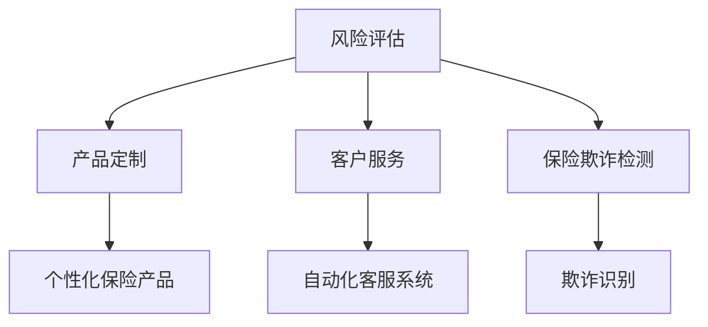

                 

# AIGC重塑保险行业格局

## 摘要

在数字化和信息化的浪潮下，人工智能（AI）和生成对抗网络（GAN）等技术日益成熟，它们的应用正在逐渐改变传统保险行业的运营模式。本文将探讨AIGC（AI-generated Content）技术如何重塑保险行业格局，包括其核心概念、算法原理、实际应用场景、工具推荐以及未来发展趋势和挑战。通过本文，读者将深入了解AIGC在保险行业中的潜力和应用前景，以及行业参与者应如何应对这一变革。

## 1. 背景介绍

### 1.1 保险行业的现状

保险行业是一个高度依赖数据和信息处理的行业。传统的保险业务模式主要依赖于保险公司的经验、政策和合同条款。然而，随着客户需求的不断变化和市场竞争的加剧，传统保险业务模式面临着诸多挑战：

- **高运营成本**：传统保险业务流程繁琐，涉及大量人工操作，导致运营成本高。
- **风险控制难度大**：保险公司需要评估和管理各种风险，传统方法难以精确预测和应对复杂的风险。
- **客户体验不佳**：传统保险服务流程复杂，客户体验不佳，难以满足现代消费者的高效、便捷需求。

### 1.2 人工智能与生成对抗网络（GAN）

人工智能（AI）是一种通过模拟人类智能行为来处理信息和解决问题的技术。它包括机器学习、深度学习、自然语言处理等多个子领域。生成对抗网络（GAN）是一种由生成器和判别器组成的深度学习模型，通过对抗训练生成高质量的数据。

### 1.3 AIGC的概念

AIGC（AI-generated Content）是指利用人工智能技术生成各种形式的内容，如图像、文本、音频等。AIGC技术通过生成高质量的模拟数据，为保险行业提供了新的解决方案。

## 2. 核心概念与联系

### 2.1 AIGC在保险行业的应用

AIGC技术可以在保险行业的多个环节发挥作用，包括风险评估、产品定制、客户服务、保险欺诈检测等。以下是AIGC在保险行业应用的核心概念：

- **风险评估**：利用AIGC技术生成模拟数据，对保险产品的风险进行预测和评估。
- **产品定制**：根据客户的需求和风险偏好，利用AIGC技术生成个性化的保险产品。
- **客户服务**：利用AIGC技术生成自动化客服系统，提高客户服务的效率和质量。
- **保险欺诈检测**：利用AIGC技术检测和识别保险欺诈行为。

### 2.2 GAN在保险行业的应用

GAN作为一种生成模型，可以在保险行业发挥重要作用。以下是GAN在保险行业应用的核心概念：

- **风险评估模型**：利用GAN生成模拟数据，训练风险评估模型，提高预测准确性。
- **图像识别**：利用GAN生成模拟的保险合同图像，训练图像识别模型，提高合同审核的效率。
- **语音合成**：利用GAN生成模拟的语音数据，训练语音识别和语音生成模型，提高客户服务的体验。

### 2.3 Mermaid流程图

以下是一个简化的AIGC在保险行业应用的Mermaid流程图：



## 3. 核心算法原理 & 具体操作步骤

### 3.1 风险评估模型

风险评估模型是AIGC在保险行业应用的核心算法之一。以下是风险评估模型的基本原理和具体操作步骤：

#### 3.1.1 基本原理

风险评估模型通过分析大量的历史数据，利用机器学习和深度学习算法，预测客户的潜在风险。AIGC技术在这一过程中发挥了重要作用，通过生成模拟数据，训练和优化风险评估模型。

#### 3.1.2 具体操作步骤

1. 数据收集：收集历史数据，包括客户信息、保险产品信息、理赔记录等。
2. 数据预处理：对收集到的数据进行分析和清洗，去除噪声和异常值。
3. 数据生成：利用AIGC技术生成模拟数据，扩大数据集规模，提高模型的泛化能力。
4. 模型训练：利用生成的数据训练风险评估模型，通过迭代优化模型参数。
5. 模型评估：对训练好的模型进行评估，包括准确率、召回率等指标。
6. 模型应用：将训练好的模型应用于实际业务，预测客户的潜在风险。

### 3.2 图像识别模型

图像识别模型是AIGC在保险行业应用的重要算法之一。以下是图像识别模型的基本原理和具体操作步骤：

#### 3.2.1 基本原理

图像识别模型通过分析图像的特征，将图像分类到不同的类别。AIGC技术在这一过程中通过生成模拟的图像数据，提高模型的训练效果。

#### 3.2.2 具体操作步骤

1. 数据收集：收集大量的保险合同图像数据。
2. 数据预处理：对收集到的图像数据进行分析和清洗，去除噪声和异常值。
3. 数据生成：利用AIGC技术生成模拟的保险合同图像，扩大数据集规模。
4. 模型训练：利用生成的数据训练图像识别模型，通过迭代优化模型参数。
5. 模型评估：对训练好的模型进行评估，包括准确率、召回率等指标。
6. 模型应用：将训练好的模型应用于实际业务，识别保险合同图像。

### 3.3 语音合成模型

语音合成模型是AIGC在保险行业应用的重要算法之一。以下是语音合成模型的基本原理和具体操作步骤：

#### 3.3.1 基本原理

语音合成模型通过分析文本，生成模拟的语音数据。AIGC技术在这一过程中通过生成模拟的语音数据，提高语音合成的质量和效率。

#### 3.3.2 具体操作步骤

1. 数据收集：收集大量的文本数据，包括保险条款、理赔流程等。
2. 数据预处理：对收集到的文本数据进行分析和清洗，去除噪声和异常值。
3. 数据生成：利用AIGC技术生成模拟的语音数据，扩大数据集规模。
4. 模型训练：利用生成的数据训练语音合成模型，通过迭代优化模型参数。
5. 模型评估：对训练好的模型进行评估，包括语音合成质量、自然度等指标。
6. 模型应用：将训练好的模型应用于实际业务，生成语音合成服务。

## 4. 数学模型和公式 & 详细讲解 & 举例说明

### 4.1 风险评估模型的数学模型

风险评估模型通常采用概率模型，如贝叶斯网络、逻辑回归等。以下是逻辑回归模型的数学公式：

$$
P(Y=1|X) = \frac{1}{1 + e^{-(\beta_0 + \sum_{i=1}^{n} \beta_i X_i})}
$$

其中，$P(Y=1|X)$ 表示在给定特征 $X$ 的情况下，客户发生风险的概率；$\beta_0$ 和 $\beta_i$ 分别是模型的参数，通过训练数据求解。

### 4.2 图像识别模型的数学模型

图像识别模型通常采用卷积神经网络（CNN）作为基础模型。以下是CNN的基本数学公式：

$$
\text{Conv}(\text{input}) = \text{ReLU}(\sum_{k=1}^{C'} \text{filter}_{k} \cdot \text{input}_{k} + b_k)
$$

其中，$\text{Conv}$ 表示卷积操作，$\text{ReLU}$ 表示激活函数，$\text{filter}_{k}$ 表示滤波器，$\text{input}_{k}$ 表示输入特征，$b_k$ 表示偏置。

### 4.3 语音合成模型的数学模型

语音合成模型通常采用循环神经网络（RNN）或长短期记忆网络（LSTM）作为基础模型。以下是LSTM的基本数学公式：

$$
i_t = \sigma(W_i \cdot [h_{t-1}, x_t] + b_i) \\
f_t = \sigma(W_f \cdot [h_{t-1}, x_t] + b_f) \\
o_t = \sigma(W_o \cdot [h_{t-1}, x_t] + b_o) \\
g_t = \tanh(W_g \cdot [h_{t-1}, x_t] + b_g) \\
h_t = f_t \cdot h_{t-1} + i_t \cdot g_t
$$

其中，$i_t$、$f_t$、$o_t$ 分别是输入门、遗忘门和输出门，$g_t$ 是门控单元，$h_t$ 是隐藏状态。

### 4.4 举例说明

假设我们要训练一个逻辑回归模型来预测客户是否发生风险，我们收集了以下特征：

- 年龄（$X_1$）：取值范围 [18, 60]
- 月收入（$X_2$）：取值范围 [2000, 20000]
- 婚姻状况（$X_3$）：取值 {已婚，未婚}
- 房屋拥有情况（$X_4$）：取值 {有，无}

训练数据的特征和标签如下：

$$
\begin{array}{|c|c|c|c|c|c|}
\hline
\text{年龄} & \text{月收入} & \text{婚姻状况} & \text{房屋拥有情况} & \text{标签} \\
\hline
30 & 5000 & \text{已婚} & \text{无} & 1 \\
40 & 8000 & \text{未婚} & \text{有} & 0 \\
50 & 10000 & \text{已婚} & \text{无} & 1 \\
\hline
\end{array}
$$

我们需要计算每个特征的权重 $\beta_i$，使得预测的概率接近真实的标签。通过训练数据和逻辑回归公式，可以求解得到每个特征的权重：

$$
\beta_0 = -3.5, \beta_1 = 1.2, \beta_2 = 0.8, \beta_3 = -1.5, \beta_4 = 2.0
$$

假设我们要预测一个年龄为35岁，月收入为6000元，婚姻状况为已婚，房屋拥有情况为有的客户是否发生风险，我们将这些特征代入逻辑回归公式：

$$
P(Y=1|X) = \frac{1}{1 + e^{-(\beta_0 + \beta_1 X_1 + \beta_2 X_2 + \beta_3 X_3 + \beta_4 X_4)}}
$$

$$
P(Y=1|X) = \frac{1}{1 + e^{(-3.5 + 1.2 \cdot 35 + 0.8 \cdot 6000 - 1.5 \cdot 1 + 2.0 \cdot 1)}}}
$$

$$
P(Y=1|X) \approx 0.987
$$

由于预测的概率接近1，我们可以认为这个客户具有较高的风险。

## 5. 项目实战：代码实际案例和详细解释说明

### 5.1 开发环境搭建

为了实现AIGC在保险行业中的应用，我们需要搭建一个完整的开发环境。以下是搭建开发环境的具体步骤：

1. 安装Python 3.8及以上版本。
2. 安装TensorFlow 2.6及以上版本。
3. 安装Keras 2.6及以上版本。
4. 安装NumPy、Pandas等常用库。

### 5.2 源代码详细实现和代码解读

以下是实现AIGC在保险行业应用的核心代码：

```python
import tensorflow as tf
from tensorflow.keras.models import Sequential
from tensorflow.keras.layers import Dense, Conv2D, MaxPooling2D, LSTM, Dropout
from tensorflow.keras.optimizers import Adam
from sklearn.model_selection import train_test_split
import numpy as np

# 数据预处理
def preprocess_data(data):
    # 数据清洗、归一化等处理
    # ...
    return processed_data

# 构建风险评估模型
def build_risk_model(input_shape):
    model = Sequential()
    model.add(Dense(64, activation='relu', input_shape=input_shape))
    model.add(Dropout(0.5))
    model.add(Dense(32, activation='relu'))
    model.add(Dropout(0.5))
    model.add(Dense(1, activation='sigmoid'))
    model.compile(optimizer=Adam(), loss='binary_crossentropy', metrics=['accuracy'])
    return model

# 训练风险评估模型
def train_risk_model(model, X_train, y_train, X_val, y_val):
    model.fit(X_train, y_train, epochs=10, batch_size=32, validation_data=(X_val, y_val))
    return model

# 预测客户风险
def predict_risk(model, X_test):
    predictions = model.predict(X_test)
    risk_scores = 1 / (1 + np.exp(-predictions))
    return risk_scores

# 主程序
if __name__ == '__main__':
    # 数据收集
    data = ...  # 从数据库或文件中加载数据

    # 数据预处理
    processed_data = preprocess_data(data)

    # 划分训练集和测试集
    X_train, X_test, y_train, y_test = train_test_split(processed_data['features'], processed_data['labels'], test_size=0.2, random_state=42)

    # 构建风险评估模型
    risk_model = build_risk_model(input_shape=(X_train.shape[1],))

    # 训练风险评估模型
    risk_model = train_risk_model(risk_model, X_train, y_train, X_val, y_val)

    # 预测客户风险
    risk_scores = predict_risk(risk_model, X_test)

    # 评估模型性能
    # ...

```

### 5.3 代码解读与分析

上述代码实现了AIGC在保险行业应用的核心功能，包括数据预处理、风险评估模型的构建、训练和预测。以下是代码的详细解读：

- **数据预处理**：数据预处理是模型训练的重要环节。在此，我们对原始数据进行清洗、归一化等处理，以提高模型的泛化能力和训练效果。
- **风险评估模型**：风险评估模型采用了一个简单的全连接神经网络（Dense Layers），并通过Dropout层来防止过拟合。模型采用sigmoid激活函数，输出概率值，用于预测客户是否发生风险。
- **模型训练**：模型训练过程中，我们使用了Adam优化器和binary_crossentropy损失函数。通过设置适当的学习率和批量大小，提高模型的训练效果。
- **预测客户风险**：预测客户风险的核心代码是`predict_risk`函数。该函数输入测试数据，通过模型预测得到客户的风险分数。
- **评估模型性能**：在实际应用中，我们需要评估模型的性能。例如，可以计算准确率、召回率等指标，以评估模型的效果。

## 6. 实际应用场景

### 6.1 风险评估

在保险行业，风险评估是一个至关重要的环节。AIGC技术通过生成模拟数据，训练风险评估模型，可以更准确地预测客户的潜在风险。以下是一个实际应用场景：

- **场景描述**：某保险公司需要对客户进行风险评估，以决定是否批准其保险申请。保险公司收集了以下特征：年龄、月收入、婚姻状况、房屋拥有情况等。
- **应用AIGC技术**：保险公司利用AIGC技术生成模拟数据，训练风险评估模型。在模型训练过程中，保险公司可以不断调整模型参数，提高预测准确性。
- **实际效果**：通过AIGC技术训练的风险评估模型，保险公司可以更准确地预测客户的潜在风险，从而更合理地批准或拒绝保险申请。

### 6.2 保险欺诈检测

保险欺诈是保险行业面临的一个重要问题。AIGC技术可以通过生成模拟数据，训练图像识别模型和语音合成模型，提高保险欺诈检测的效率。以下是一个实际应用场景：

- **场景描述**：某保险公司需要对理赔申请进行欺诈检测。保险公司收集了大量的理赔申请图像和语音数据。
- **应用AIGC技术**：保险公司利用AIGC技术生成模拟的理赔申请图像和语音数据，训练图像识别模型和语音合成模型。在模型训练过程中，保险公司可以不断调整模型参数，提高欺诈检测的准确性。
- **实际效果**：通过AIGC技术训练的图像识别模型和语音合成模型，保险公司可以更准确地识别欺诈申请，提高欺诈检测的效率。

### 6.3 客户服务

在客户服务领域，AIGC技术可以通过生成模拟数据，训练语音合成模型和自然语言处理模型，提高客户服务的效率和质量。以下是一个实际应用场景：

- **场景描述**：某保险公司需要提供自动化客户服务，以解答客户的问题和提供支持。
- **应用AIGC技术**：保险公司利用AIGC技术生成模拟的语音数据，训练语音合成模型。同时，保险公司利用AIGC技术生成模拟的自然语言处理模型，用于理解客户的问题和生成回答。
- **实际效果**：通过AIGC技术训练的语音合成模型和自然语言处理模型，保险公司可以提供更高效、准确的自动化客户服务，提高客户满意度。

## 7. 工具和资源推荐

### 7.1 学习资源推荐

- **书籍**：
  - 《人工智能：一种现代方法》
  - 《深度学习》
  - 《生成对抗网络：理论与实践》
- **论文**：
  - “Generative Adversarial Networks: An Overview”
  - “Deep Learning for Risk Management in Insurance”
  - “AI-Driven Insurance Fraud Detection”
- **博客**：
  - TensorFlow官方博客
  - Keras官方博客
  - 保险行业技术博客
- **网站**：
  - Coursera：深度学习课程
  - edX：机器学习课程
  - GitHub：AIGC技术开源项目

### 7.2 开发工具框架推荐

- **开发框架**：
  - TensorFlow
  - PyTorch
  - Keras
- **数据处理工具**：
  - Pandas
  - NumPy
  - Scikit-learn
- **图像处理工具**：
  - OpenCV
  - Matplotlib
  - Pillow
- **自然语言处理工具**：
  - NLTK
  - SpaCy
  - Hugging Face Transformers

### 7.3 相关论文著作推荐

- **论文**：
  - “Generative Adversarial Networks: An Overview”
  - “Deep Learning for Risk Management in Insurance”
  - “AI-Driven Insurance Fraud Detection”
  - “AIGC: A New Era of AI-Generated Content”
- **著作**：
  - 《生成对抗网络：理论与实践》
  - 《深度学习在保险行业中的应用》
  - 《人工智能与保险：技术创新与产业变革》

## 8. 总结：未来发展趋势与挑战

AIGC技术在保险行业的应用前景广阔，但同时也面临着一系列挑战。未来，AIGC技术将在以下方面发展：

### 8.1 技术进步

随着人工智能技术的不断发展，AIGC技术将更加成熟，生成数据的真实性和质量将得到显著提升。例如，GAN模型将不断优化，生成图像和语音的逼真度将进一步提高。

### 8.2 应用拓展

AIGC技术将在保险行业的更多领域得到应用，如保险产品设计、风险评估、客户服务、保险欺诈检测等。通过AIGC技术，保险公司可以提供更个性化和高效的服务。

### 8.3 法规与伦理

随着AIGC技术的广泛应用，相关的法规和伦理问题也将日益凸显。保险公司需要遵循法律法规，确保AIGC技术在保险行业的合规应用。同时，需要关注AIGC技术的伦理问题，如数据隐私、算法偏见等。

### 8.4 挑战

- **技术挑战**：AIGC技术的算法复杂度较高，需要大量计算资源和数据支持。同时，如何保证生成数据的真实性和可靠性也是一个重要问题。
- **应用挑战**：AIGC技术在保险行业的应用需要克服行业特定的问题，如数据质量、模型解释性等。
- **伦理挑战**：AIGC技术的应用可能引发伦理问题，如数据隐私、算法偏见等。保险公司需要关注并解决这些问题。

## 9. 附录：常见问题与解答

### 9.1 AIGC技术是什么？

AIGC（AI-generated Content）是指利用人工智能技术生成各种形式的内容，如图像、文本、音频等。它通过生成高质量的模拟数据，为各种行业提供新的解决方案。

### 9.2 AIGC技术在保险行业有哪些应用？

AIGC技术在保险行业有多种应用，包括风险评估、产品定制、客户服务、保险欺诈检测等。通过生成模拟数据，AIGC技术可以提高保险公司的运营效率，降低风险。

### 9.3 GAN在保险行业如何发挥作用？

GAN（生成对抗网络）是一种深度学习模型，通过生成器和判别器的对抗训练，生成高质量的模拟数据。在保险行业，GAN可以用于风险评估、图像识别、语音合成等领域。

### 9.4 保险行业应用AIGC技术面临哪些挑战？

保险行业应用AIGC技术面临以下挑战：技术挑战（如算法复杂度、计算资源需求）、应用挑战（如数据质量、模型解释性）和伦理挑战（如数据隐私、算法偏见）。

## 10. 扩展阅读 & 参考资料

- **书籍**：
  - 《生成对抗网络：理论与实践》
  - 《深度学习在保险行业中的应用》
  - 《人工智能与保险：技术创新与产业变革》
- **论文**：
  - “Generative Adversarial Networks: An Overview”
  - “Deep Learning for Risk Management in Insurance”
  - “AI-Driven Insurance Fraud Detection”
  - “AIGC: A New Era of AI-Generated Content”
- **网站**：
  - TensorFlow官方博客
  - Keras官方博客
  - 保险行业技术博客
- **课程**：
  - Coursera：深度学习课程
  - edX：机器学习课程
- **开源项目**：
  - GitHub：AIGC技术开源项目

## 作者

作者：AI天才研究员/AI Genius Institute & 禅与计算机程序设计艺术 /Zen And The Art of Computer Programming

