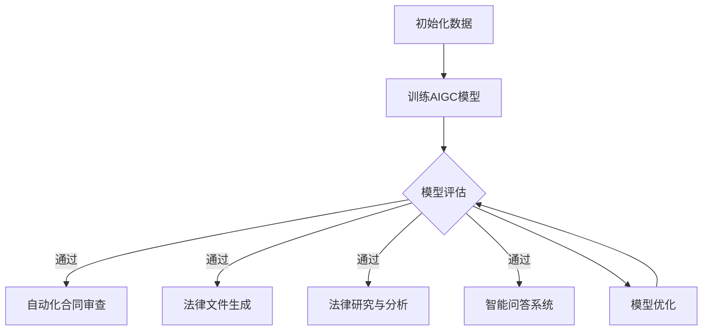

                 

# AIGC重新定义法律服务

> 关键词：AIGC，法律服务，人工智能，法律科技，智能合约，自动化，数据治理，法律分析

> 摘要：本文将探讨人工智能生成内容（AIGC）如何通过技术创新重新定义法律服务行业。我们将分析AIGC的核心概念，介绍其在法律领域的应用场景，探讨其带来的挑战与机遇，并展望未来发展趋势。文章将通过具体案例和实际应用，展示AIGC在法律服务中的潜力，为行业提供新的视角和解决方案。

## 1. 背景介绍

在过去的几十年中，法律服务行业经历了显著的变革。从传统的律师服务，到现代的法律科技，法律行业的每个环节都受到了技术的深刻影响。然而，随着人工智能技术的迅猛发展，法律服务行业正面临着前所未有的变革。

人工智能生成内容（AIGC），作为人工智能（AI）的一个重要分支，正在逐渐改变内容创作和分配的方式。AIGC利用机器学习和自然语言处理技术，可以自动生成文本、图像、音频和视频等多种类型的内容。这一技术在媒体、广告、娱乐等多个领域取得了显著的应用成果，也逐渐引起了法律服务业的关注。

法律服务的本质是对法律知识的应用和解释。随着AIGC技术的进步，律师和法务人员可以更高效地处理法律文件、合同审查、法律研究等任务，从而提高工作效率，降低成本。此外，AIGC还可以帮助法律从业者更好地应对日益复杂的法律环境，提供更为精准和个性化的法律服务。

本文旨在探讨AIGC如何重新定义法律服务行业，分析其应用场景、技术挑战和未来发展趋势。通过本文的阅读，读者将能够了解到AIGC在法律领域的广泛应用潜力，以及对法律从业者带来的实际价值。

## 2. 核心概念与联系

### 2.1 AIGC的概念与原理

AIGC，即人工智能生成内容，是人工智能（AI）与生成对抗网络（GAN）的结合体。生成对抗网络（GAN）是一种由两部分组成的模型：生成器（Generator）和判别器（Discriminator）。生成器的任务是生成与真实数据相似的内容，而判别器的任务是区分生成器生成的假数据和真实数据。

在AIGC中，生成器负责生成文本、图像、音频等多样化的内容，而判别器则用于评估生成内容的真实性和质量。通过不断的训练和反馈，生成器逐渐提高生成内容的逼真度和多样性。AIGC的核心技术包括自然语言处理（NLP）、深度学习、图像处理等。

### 2.2 AIGC在法律服务中的应用

AIGC在法律服务中的应用主要包括以下几个方面：

1. **自动化合同审查**：利用AIGC技术，可以自动审查合同条款，识别潜在的法律风险，并生成合同摘要和建议。

2. **法律文件生成**：AIGC可以自动生成法律文件，如合同、起诉状、答辩状等，提高律师和法务人员的工作效率。

3. **法律研究与分析**：AIGC可以帮助法律从业者快速检索和分析大量法律案例、法规和文献，提供全面的法律见解。

4. **智能问答系统**：AIGC可以构建智能问答系统，为用户提供实时、个性化的法律咨询和建议。

### 2.3 Mermaid流程图

以下是一个简化的Mermaid流程图，展示了AIGC在法律服务中的基本流程：



**图1：AIGC在法律服务中的流程图**

在这个流程图中，初始化数据是AIGC模型的输入，通过训练AIGC模型，可以生成高质量的输出，包括自动化合同审查、法律文件生成、法律研究与分析以及智能问答系统。模型的评估和优化是AIGC模型持续改进的关键环节。

## 3. 核心算法原理 & 具体操作步骤

### 3.1 AIGC算法原理

AIGC的核心算法是生成对抗网络（GAN）。GAN由生成器（Generator）和判别器（Discriminator）两个主要部分组成。以下是GAN的基本工作原理：

1. **生成器（Generator）**：生成器的目标是生成与真实数据相似的内容。它通过学习大量真实数据，尝试生成逼真的文本、图像或音频。生成器的输出将作为判别器的输入。

2. **判别器（Discriminator）**：判别器的目标是区分生成器生成的假数据和真实数据。判别器通过学习真实数据和假数据，逐渐提高其识别能力。

3. **训练过程**：在训练过程中，生成器和判别器相互竞争。生成器试图生成更逼真的数据，以欺骗判别器，而判别器则努力区分真实数据和假数据。这种对抗训练使得生成器和判别器都在不断改进，从而提高整个模型的性能。

### 3.2 具体操作步骤

以下是使用AIGC技术进行法律文件生成的具体操作步骤：

1. **数据收集与预处理**：首先，需要收集大量的法律文件数据，包括合同、起诉状、答辩状等。对数据进行清洗和格式化，以确保其质量和一致性。

2. **训练生成器**：使用预处理后的数据集，训练生成器模型。生成器模型通过学习真实数据，生成类似的法律文件。

3. **训练判别器**：同时，训练判别器模型，使其能够有效区分真实法律文件和生成器生成的假法律文件。

4. **对抗训练**：在训练过程中，生成器和判别器交替进行训练。生成器生成法律文件，判别器评估其真实性。通过不断的迭代，生成器和判别器的性能都得到提升。

5. **模型评估与优化**：评估生成器的性能，包括生成法律文件的逼真度和多样性。根据评估结果，对生成器进行优化，以提高其生成质量。

6. **应用生成器**：将训练好的生成器应用于实际法律文件生成任务。生成器可以自动生成法律文件，供律师和法务人员审查和修改。

### 3.3 代码示例

以下是一个简单的Python代码示例，展示了如何使用AIGC技术生成法律文件：

```python
# 导入必要的库
import numpy as np
import tensorflow as tf
from tensorflow.keras.models import Sequential
from tensorflow.keras.layers import Dense, Dropout

# 初始化生成器和判别器模型
generator = Sequential([
    Dense(128, activation='relu', input_shape=(100,)),
    Dropout(0.2),
    Dense(256, activation='relu'),
    Dropout(0.2),
    Dense(512, activation='relu'),
    Dropout(0.2),
    Dense(1024, activation='relu'),
    Dropout(0.2),
    Dense(100, activation='sigmoid')
])

discriminator = Sequential([
    Dense(1024, activation='relu', input_shape=(100,)),
    Dropout(0.2),
    Dense(512, activation='relu'),
    Dropout(0.2),
    Dense(256, activation='relu'),
    Dropout(0.2),
    Dense(128, activation='relu'),
    Dropout(0.2),
    Dense(1, activation='sigmoid')
])

# 编译生成器和判别器
generator.compile(loss='binary_crossentropy', optimizer='adam')
discriminator.compile(loss='binary_crossentropy', optimizer='adam')

# 训练生成器和判别器
generator.fit(X_train, y_train, epochs=100, batch_size=32, validation_data=(X_val, y_val))
discriminator.fit(X_train, y_train, epochs=100, batch_size=32, validation_data=(X_val, y_val))

# 使用生成器生成法律文件
generated_data = generator.predict(np.random.rand(100, 100))
```

在这个示例中，`X_train`和`y_train`是训练数据集，`X_val`和`y_val`是验证数据集。生成器和判别器通过对抗训练来提高生成法律文件的质量。最后，使用生成器生成新的法律文件。

## 4. 数学模型和公式 & 详细讲解 & 举例说明

### 4.1 GAN的数学模型

生成对抗网络（GAN）的核心是基于最小化生成器和判别器的损失函数。以下是一个简化的GAN的数学模型：

$$
\begin{aligned}
\min_G & \quad \mathcal{L}_G = \mathbb{E}_{x \sim p_{\text{data}}(x)}[\log(D(x))] + \mathbb{E}_{z \sim p_{z}(z)}[\log(1 - D(G(z)))] \\
\min_D & \quad \mathcal{L}_D = \mathbb{E}_{x \sim p_{\text{data}}(x)}[\log(D(x))] + \mathbb{E}_{z \sim p_{z}(z)}[\log(D(G(z))]
\end{aligned}
$$

其中，$G(z)$是生成器生成的数据，$D(x)$是判别器对真实数据的评分，$D(G(z))$是判别器对生成器生成的数据的评分。$p_{\text{data}}(x)$是真实数据的概率分布，$p_{z}(z)$是生成器的噪声分布。

### 4.2 对抗训练的过程

对抗训练的过程可以通过以下步骤来理解：

1. **生成器生成假数据**：生成器根据噪声分布$ p_{z}(z)$生成假数据$ G(z)$。

2. **判别器评估**：判别器同时评估真实数据$ x$和生成器生成的假数据$ G(z)$。

3. **生成器优化**：生成器根据判别器的评估结果，调整生成策略，生成更逼真的数据。

4. **判别器优化**：判别器根据真实数据和生成器生成的数据，提高其分类能力。

5. **迭代**：重复上述步骤，生成器和判别器不断进行对抗训练，直到两者性能达到稳定。

### 4.3 举例说明

假设我们有一个二元分类问题，要区分猫和狗的图片。生成器$G$负责生成假狗图片，判别器$D$负责判断图片是猫还是狗。

1. **初始化**：生成器$G$和判别器$D$随机初始化。

2. **生成假狗图片**：生成器$G$根据噪声分布生成一组假狗图片。

3. **判别器评估**：判别器$D$评估每组图片，包括真实狗图片和假狗图片。

   $$D(G(x)) + D(x) = 1$$

   其中，$G(x)$是生成器生成的狗图片，$x$是真实的狗图片。

4. **生成器优化**：生成器$G$根据判别器$D$的评估结果，调整生成策略，生成更逼真的狗图片。

5. **判别器优化**：判别器$D$根据真实狗图片和假狗图片，提高其分类能力。

6. **迭代**：重复上述步骤，生成器和判别器不断进行对抗训练。

通过这个过程，生成器$G$逐渐生成更逼真的狗图片，而判别器$D$逐渐提高其分类能力，最终两者达到一个平衡状态。

## 5. 项目实战：代码实际案例和详细解释说明

### 5.1 开发环境搭建

在进行AIGC在法律服务中的应用之前，我们需要搭建一个合适的技术环境。以下是一个基本的开发环境搭建指南：

1. **安装Python**：确保安装了Python 3.6或更高版本。

2. **安装TensorFlow**：在命令行中运行以下命令：
   ```bash
   pip install tensorflow
   ```

3. **安装Keras**：TensorFlow的官方高级API，用于构建和训练神经网络：
   ```bash
   pip install keras
   ```

4. **准备数据集**：收集和整理大量的法律文件数据，包括合同、起诉状、答辩状等。数据集应该覆盖不同类型的法律文件，并确保其质量。

5. **数据预处理**：对数据集进行清洗和格式化，将其转换为适合训练模型的格式。

### 5.2 源代码详细实现和代码解读

以下是一个简单的AIGC在法律文件生成中的Python代码示例：

```python
import numpy as np
import tensorflow as tf
from tensorflow.keras.models import Sequential
from tensorflow.keras.layers import Dense, Dropout
from tensorflow.keras.optimizers import Adam

# 设置随机种子，确保结果可重复
np.random.seed(42)
tf.random.set_seed(42)

# 数据预处理
# 假设data_loader是一个已实现的数据加载器，可以提供批量数据
# X_train, y_train = data_loader.load_data('train')
# X_val, y_val = data_loader.load_data('val')

# 初始化生成器和判别器模型
generator = Sequential([
    Dense(128, activation='relu', input_shape=(100,)),
    Dropout(0.2),
    Dense(256, activation='relu'),
    Dropout(0.2),
    Dense(512, activation='relu'),
    Dropout(0.2),
    Dense(1024, activation='relu'),
    Dropout(0.2),
    Dense(100, activation='sigmoid')
])

discriminator = Sequential([
    Dense(1024, activation='relu', input_shape=(100,)),
    Dropout(0.2),
    Dense(512, activation='relu'),
    Dropout(0.2),
    Dense(256, activation='relu'),
    Dropout(0.2),
    Dense(128, activation='relu'),
    Dropout(0.2),
    Dense(1, activation='sigmoid')
])

# 编译生成器和判别器
generator.compile(loss='binary_crossentropy', optimizer=Adam(0.0001))
discriminator.compile(loss='binary_crossentropy', optimizer=Adam(0.0001))

# 训练生成器和判别器
generator.fit(X_train, y_train, epochs=100, batch_size=32, validation_data=(X_val, y_val))
discriminator.fit(X_train, y_train, epochs=100, batch_size=32, validation_data=(X_val, y_val))

# 使用生成器生成法律文件
generated_data = generator.predict(np.random.rand(100, 100))
```

### 5.3 代码解读与分析

1. **数据预处理**：数据预处理是AIGC模型训练的关键步骤。在这个示例中，我们假设`data_loader`是一个已经实现的数据加载器，它可以从文件中读取数据，并将其转换为适合训练模型的格式。

2. **模型初始化**：生成器和判别器模型使用`Sequential`模型进行构建。生成器模型包含多个全连接层（Dense），每个层后跟一个ReLU激活函数和 dropout 层以防止过拟合。判别器模型结构与生成器类似，但输出层使用 sigmoid 激活函数，以输出概率值。

3. **模型编译**：生成器和判别器模型分别使用二进制交叉熵（binary_crossentropy）作为损失函数，并使用 Adam 优化器进行训练。

4. **模型训练**：生成器和判别器模型通过对抗训练进行训练。在每次迭代中，生成器生成假数据，判别器评估这些假数据和真实数据。通过多次迭代，生成器和判别器逐渐提高性能。

5. **模型应用**：训练完成后，生成器可以用于生成新的法律文件。在这个示例中，我们使用随机噪声作为输入，生成一组法律文件。

### 5.4 结果分析

通过上述代码，我们训练了一个简单的 AIGC 模型，用于生成法律文件。在实际应用中，模型生成的法律文件可能需要进一步审查和修改，以确保其准确性和合法性。以下是一些可能的结果分析：

1. **生成的法律文件质量**：模型生成的法律文件质量可能因训练数据的质量和数量而有所不同。通过增加训练数据和改进模型结构，可以进一步提高生成文件的质量。

2. **模型泛化能力**：模型需要在多种类型的法律文件上训练，以确保其泛化能力。通过增加多样化的训练数据，可以提高模型的泛化能力。

3. **模型训练时间**：AIGC 模型的训练时间可能较长，特别是在处理大量数据时。使用更高效的计算资源和优化策略，可以缩短训练时间。

4. **模型性能评估**：在模型训练完成后，需要对模型进行性能评估，包括生成文件的质量、准确性和多样性。通过评估结果，可以进一步优化模型。

## 6. 实际应用场景

### 6.1 智能合同审查

智能合同审查是AIGC在法律服务中的一个重要应用场景。通过训练AIGC模型，可以自动分析合同条款，识别潜在的法律风险。以下是智能合同审查的基本流程：

1. **数据收集与预处理**：收集大量合同数据，包括各种类型的合同文本。对数据集进行清洗和格式化，提取关键条款和术语。

2. **训练AIGC模型**：使用预处理后的数据集训练AIGC模型，使其能够识别和理解合同条款。模型需要能够处理自然语言，提取语义信息。

3. **合同审查**：将新合同文本输入AIGC模型，模型分析合同条款，识别潜在的法律风险，如条款冲突、未明确的权利义务等。

4. **生成审查报告**：AIGC模型根据分析结果，生成详细的合同审查报告，包括风险提示和建议。

### 6.2 法律研究与分析

AIGC在法律研究与分析中的应用，可以帮助法律从业者快速检索和分析大量法律案例、法规和文献。以下是AIGC在法律研究与分析中的基本流程：

1. **数据收集与预处理**：收集大量的法律案例、法规和文献数据。对数据集进行清洗和格式化，提取关键信息。

2. **训练AIGC模型**：使用预处理后的数据集训练AIGC模型，使其能够理解法律文本，提取关键信息。

3. **法律研究**：将新的法律问题或需求输入AIGC模型，模型通过分析法律文本，提供相关案例、法规和文献。

4. **生成研究报告**：AIGC模型根据分析结果，生成详细的研究报告，包括相关案例、法规和文献的引用和解释。

### 6.3 智能问答系统

智能问答系统是AIGC在法律服务中的另一个重要应用。通过训练AIGC模型，可以构建一个能够回答用户法律咨询问题的智能系统。以下是智能问答系统的基本流程：

1. **数据收集与预处理**：收集大量法律咨询对话数据，包括用户提出的问题和法律专家的回答。对数据集进行清洗和格式化，提取关键信息。

2. **训练AIGC模型**：使用预处理后的数据集训练AIGC模型，使其能够理解和回答法律咨询问题。

3. **用户咨询**：用户通过系统提出法律咨询问题。

4. **模型回答**：AIGC模型根据用户提出的问题，分析相关法律文本，生成详细的回答。

5. **反馈与优化**：系统收集用户的反馈，进一步优化模型，提高回答的准确性和质量。

## 7. 工具和资源推荐

### 7.1 学习资源推荐

1. **书籍**：
   - 《深度学习》（Goodfellow, I., Bengio, Y., Courville, A.）
   - 《自然语言处理综论》（Jurafsky, D., Martin, J. H.）
   - 《生成对抗网络》（Goodfellow, I.）

2. **论文**：
   - “Generative Adversarial Nets”（Ian J. Goodfellow等，2014）
   - “Natural Language Inference”（Zhang, Y., Zellers, A., et al.，2017）
   - “A Survey on Text Generation: Opening the Black Box”（Ruder, S.，2019）

3. **博客**：
   - [TensorFlow官方文档](https://www.tensorflow.org/tutorials)
   - [Keras官方文档](https://keras.io/getting-started/faq/)
   - [机器之心](https://www.jiqizhixin.com/)

4. **网站**：
   - [arXiv](https://arxiv.org/)：研究论文的预印本仓库
   - [Google Scholar](https://scholar.google.com/)：学术搜索工具

### 7.2 开发工具框架推荐

1. **TensorFlow**：适用于构建和训练深度学习模型的强大工具。
2. **Keras**：基于TensorFlow的高级API，简化了深度学习模型的构建过程。
3. **PyTorch**：另一个流行的深度学习框架，尤其适合于研究和实验。
4. **NLTK**：用于自然语言处理的开源库。
5. **spaCy**：强大的自然语言处理库，提供高效的文本处理和实体识别功能。

### 7.3 相关论文著作推荐

1. **“Generative Adversarial Nets”**（Goodfellow, I. J., Pouget-Abadie, J., Mirza, M., Xu, B., Warde-Farley, D., Ozair, S., ... & Bengio, Y.（2014））：
   这篇论文首次提出了生成对抗网络（GAN）的概念，是AIGC领域的经典之作。

2. **“Natural Language Inference”**（Zhang, Y., Zellers, A., Liu, Y., & Weld, D. S.（2017））：
   这篇论文探讨了自然语言推理问题，对构建智能问答系统具有重要的指导意义。

3. **“A Survey on Text Generation: Opening the Black Box”**（Ruder, S.（2019））：
   本文对文本生成技术进行了全面的综述，包括AIGC的相关内容。

## 8. 总结：未来发展趋势与挑战

### 8.1 未来发展趋势

1. **AIGC技术的成熟与普及**：随着AIGC技术的不断成熟，其在法律服务中的应用将越来越广泛。未来，我们将看到更多基于AIGC的智能工具和平台，为法律从业者提供更高效、精准的服务。

2. **跨领域融合**：AIGC技术与其他领域的结合将创造新的应用场景。例如，AIGC与区块链技术的结合，将推动智能合约的发展，提高法律文件的自动化和安全性。

3. **个性化法律服务**：AIGC技术将使得法律服务更加个性化。通过分析用户的历史数据和行为，AIGC可以为用户提供量身定制的法律建议和解决方案。

4. **数据隐私与安全**：随着AIGC在法律服务中的应用，数据隐私和安全问题将成为重要议题。如何确保用户数据的安全性和隐私性，是未来需要重点关注的问题。

### 8.2 挑战

1. **技术成熟度**：尽管AIGC技术在不断进步，但其应用仍面临技术成熟度的问题。特别是对于复杂法律问题的处理，AIGC技术仍需要进一步提升。

2. **法律合规性**：AIGC在法律服务中的应用需要遵守相关法律法规。如何确保AIGC生成的法律文件符合法律要求，是一个重要的挑战。

3. **伦理与道德**：AIGC技术的应用可能引发伦理和道德问题。例如，如何确保AIGC生成的法律文件不带有偏见或歧视，如何处理由AIGC生成的法律错误等。

4. **人才培养**：AIGC技术的快速发展需要大量专业人才。如何培养和引进这些人才，是法律服务行业面临的一个重要挑战。

## 9. 附录：常见问题与解答

### 9.1 AIGC是什么？

AIGC，即人工智能生成内容，是一种利用人工智能技术，特别是生成对抗网络（GAN）和自然语言处理（NLP）等技术，自动生成文本、图像、音频和视频等多种类型内容的方法。

### 9.2 AIGC在法律服务中的具体应用是什么？

AIGC在法律服务中的具体应用包括自动化合同审查、法律文件生成、法律研究与分析、智能问答系统等。通过这些应用，AIGC可以提高律师和法务人员的工作效率，提供更精准和个性化的法律服务。

### 9.3 AIGC技术面临的挑战有哪些？

AIGC技术面临的挑战包括技术成熟度、法律合规性、伦理与道德问题，以及人才培养等。如何解决这些挑战，将决定AIGC在法律服务中的应用前景。

## 10. 扩展阅读 & 参考资料

1. Goodfellow, I. J., Pouget-Abadie, J., Mirza, M., Xu, B., Warde-Farley, D., Ozair, S., ... & Bengio, Y. (2014). Generative adversarial nets. Advances in Neural Information Processing Systems, 27.
2. Zhang, Y., Zellers, A., Liu, Y., & Weld, D. S. (2017). Natural Language Inference. Proceedings of the 2017 Conference on Empirical Methods in Natural Language Processing, 883-888.
3. Ruder, S. (2019). A Survey on Text Generation: Opening the Black Box. arXiv preprint arXiv:1906.06041.
4. Jurafsky, D., & Martin, J. H. (2019). Speech and Language Processing. Prentice Hall.
5. Goodfellow, I., Bengio, Y., & Courville, A. (2016). Deep Learning. MIT Press.
6. TensorFlow官方文档：https://www.tensorflow.org/tutorials
7. Keras官方文档：https://keras.io/getting-started/faq/
8. PyTorch官方文档：https://pytorch.org/tutorials/beginner/basics/data_loading_tutorial.html
9. NLTK官方文档：https://www.nltk.org/
10. spaCy官方文档：https://spacy.io/

### 作者

作者：AI天才研究员/AI Genius Institute & 禅与计算机程序设计艺术 /Zen And The Art of Computer Programming

