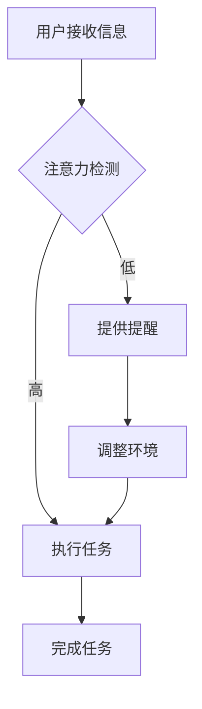

                 

## 1. 背景介绍

在当今数字化和信息化的时代，人工智能（AI）技术正以前所未有的速度和深度影响着各行各业。从自动驾驶汽车到智能家居，从医疗诊断到金融分析，AI正在逐步渗透到我们的日常生活中。与此同时，人类的注意力资源成为了一个稀缺的资源。随着信息爆炸时代的到来，人们面临着海量信息的冲击，如何有效地管理和利用注意力资源，成为了摆在每个人面前的一个问题。

在这篇文章中，我们将探讨AI与人类注意力流之间的关系，分析未来工作环境中的变化，讨论注意力流管理技术的发展趋势，并预测其在各个领域的应用前景。通过对AI技术的深入理解和对注意力流管理原理的探讨，我们希望能够为读者提供一个全面、深入的视角，帮助大家更好地适应未来的工作与生活。

文章的主要结构如下：

1. 背景介绍
2. 核心概念与联系
3. 核心算法原理 & 具体操作步骤
4. 数学模型和公式 & 详细讲解 & 举例说明
5. 项目实战：代码实际案例和详细解释说明
6. 实际应用场景
7. 工具和资源推荐
8. 总结：未来发展趋势与挑战
9. 附录：常见问题与解答
10. 扩展阅读 & 参考资料

让我们一步步深入探讨这些主题，探索AI与人类注意力流之间的奥秘。

### 关键词

- 人工智能
- 注意力流管理
- 未来工作
- 技术趋势
- 应用前景

### 摘要

本文通过深入探讨人工智能与人类注意力流之间的关系，分析了未来工作环境中可能发生的变化。文章首先介绍了注意力流管理的基本概念，探讨了其与AI技术的结合点。接着，文章详细解析了核心算法原理，并通过数学模型和实际项目案例展示了注意力流管理技术的应用。最后，文章总结了未来发展趋势与挑战，并推荐了相关学习资源和工具。通过本文的阅读，读者可以全面了解注意力流管理技术，为未来的职业规划和技术应用做好准备。

## 2. 核心概念与联系

在讨论AI与人类注意力流的关系之前，我们需要明确几个核心概念，这些概念不仅构成了文章的基础，也是理解注意力流管理技术的重要前提。

### 2.1 人工智能（AI）

人工智能，简称AI，是指通过计算机模拟人类的认知过程，使机器具备感知、学习、推理、决策等能力的科学技术。AI的核心在于其算法和模型，包括机器学习、深度学习、自然语言处理等。这些技术使计算机能够从数据中学习规律，进行自主推理和决策，从而在图像识别、语音识别、自动驾驶、医疗诊断等多个领域实现突破。

### 2.2 注意力流（Attention Flow）

注意力流是指人类在处理信息时，其注意力集中在特定对象或任务上的动态过程。注意力流管理涉及如何高效地分配和利用注意力资源，以提高信息处理效率和工作生活品质。注意力流管理不仅关乎个人心理健康，还影响到团队协作、工作效率和社会经济发展。

### 2.3 注意力流管理（Attention Management）

注意力流管理是一种通过技术手段和策略，优化人类注意力资源分配和使用的方法。其目标是帮助个体和组织在面对海量信息和任务时，能够更有效地处理信息，集中注意力，减少分心和疲劳。注意力流管理技术主要包括注意力跟踪、注意力优化、注意力切换等。

### 2.4 注意力流管理与AI的结合

AI与注意力流管理之间的结合，为人类提供了新的解决方案。AI技术可以通过分析人类的行为数据和生物信号，实时监测注意力流状态，并根据分析结果提供个性化的注意力优化建议。例如，通过智能眼镜或耳机等设备，AI可以监测用户的眼动、面部表情等生理信号，识别用户的注意力集中程度，并在需要时发出提醒或调整环境设置，以帮助用户更好地集中注意力。

### 2.5 注意力流的Mermaid流程图

为了更直观地展示注意力流管理的过程，我们使用Mermaid流程图来描述核心概念之间的联系。以下是一个简化的注意力流管理流程图：



在这个流程图中，A表示用户接收信息，B表示注意力检测，C表示执行任务，D表示提供提醒，E表示完成任务，F表示调整环境。当用户的注意力状态被检测为高时，直接进入执行任务阶段；当注意力状态被检测为低时，系统会提供提醒，并根据需要调整环境，以帮助用户重新集中注意力。

通过这个流程图，我们可以清晰地看到注意力流管理的过程和各个环节之间的联系。这为后续讨论注意力流管理技术的具体实现和应用提供了基础。

在接下来的章节中，我们将进一步深入探讨注意力流管理技术的核心算法原理、数学模型、实际应用案例，以及未来的发展趋势和挑战。希望读者能够通过本文，对注意力流管理技术有一个全面而深入的理解。

## 3. 核心算法原理 & 具体操作步骤

在了解了注意力流管理的基本概念之后，我们需要深入探讨其背后的核心算法原理和具体操作步骤。注意力流管理技术主要依赖于以下几个方面：

### 3.1 注意力检测算法

注意力检测是注意力流管理的第一步，其主要任务是通过分析用户的行为数据和生物信号，实时监测用户的注意力状态。常见的注意力检测算法包括眼动分析、面部表情识别、生理信号监测等。

#### 3.1.1 眼动分析

眼动分析是通过监测用户的眼动数据，来推断其注意力状态。眼动分析算法通常包括以下步骤：

1. **数据采集**：使用眼动追踪设备（如眼动仪）记录用户的眼动轨迹。
2. **数据预处理**：对采集到的数据进行滤波、去噪等处理，以提高数据质量。
3. **特征提取**：从预处理后的数据中提取关键特征，如眼动速度、眼动角度、注视点分布等。
4. **模型训练**：使用机器学习算法（如支持向量机、决策树、神经网络等），训练注意力检测模型。
5. **注意力状态推断**：将提取的特征输入到训练好的模型中，预测用户的注意力状态。

#### 3.1.2 面部表情识别

面部表情识别是通过分析用户的面部表情，来推断其注意力状态。面部表情识别算法通常包括以下步骤：

1. **数据采集**：使用摄像头或面部识别设备采集用户的面部图像。
2. **特征提取**：从采集到的图像中提取关键特征，如眼睛睁开程度、嘴巴张开程度、面部肌肉活动等。
3. **模型训练**：使用机器学习算法训练面部表情识别模型。
4. **注意力状态推断**：将提取的特征输入到训练好的模型中，预测用户的注意力状态。

#### 3.1.3 生理信号监测

生理信号监测是通过监测用户的生理信号（如心率、呼吸频率等），来推断其注意力状态。生理信号监测算法通常包括以下步骤：

1. **数据采集**：使用生理信号监测设备（如心电传感器、呼吸传感器等）记录用户的生理信号。
2. **特征提取**：从采集到的生理信号中提取关键特征，如心率变异性、呼吸周期等。
3. **模型训练**：使用机器学习算法训练生理信号监测模型。
4. **注意力状态推断**：将提取的特征输入到训练好的模型中，预测用户的注意力状态。

### 3.2 注意力优化算法

注意力优化算法的主要任务是根据注意力检测的结果，提供个性化的注意力优化建议。常见的注意力优化算法包括注意力分配算法、环境调整算法等。

#### 3.2.1 注意力分配算法

注意力分配算法是通过优化用户注意力资源的分配，提高信息处理效率。注意力分配算法通常包括以下步骤：

1. **任务评估**：根据任务的重要性和紧急程度，对任务进行评估。
2. **资源评估**：评估用户的注意力资源总量和剩余量。
3. **分配策略**：根据任务评估和资源评估结果，制定注意力分配策略。
4. **执行分配**：根据分配策略，将用户的注意力资源分配给不同的任务。

#### 3.2.2 环境调整算法

环境调整算法是通过调整外部环境，帮助用户更好地集中注意力。环境调整算法通常包括以下步骤：

1. **环境评估**：评估当前环境对用户注意力的影响。
2. **调整策略**：根据环境评估结果，制定环境调整策略。
3. **执行调整**：根据调整策略，调整外部环境，如光线、噪音、温度等。

### 3.3 注意力切换算法

注意力切换算法的主要任务是在任务切换时，帮助用户迅速集中注意力。注意力切换算法通常包括以下步骤：

1. **任务识别**：识别当前任务和待切换的任务。
2. **切换准备**：根据任务识别结果，准备切换所需的资源。
3. **切换执行**：根据切换准备结果，执行注意力切换。
4. **切换评估**：评估切换效果，并根据评估结果调整切换策略。

通过以上核心算法和具体操作步骤，我们可以看到注意力流管理技术是如何通过多种技术手段和策略，实现注意力资源的优化和利用。在接下来的章节中，我们将进一步探讨注意力流管理技术的数学模型和应用案例。

### 3.4 数学模型和公式 & 详细讲解 & 举例说明

在注意力流管理技术中，数学模型和公式扮演着至关重要的角色。它们不仅帮助我们量化注意力状态，还提供了优化策略的理论依据。以下我们将详细介绍一些常用的数学模型和公式，并通过具体例子来说明它们的应用。

#### 3.4.1 注意力状态模型

注意力状态模型用于描述用户在不同任务和环境下注意力水平的变化。一个简化的注意力状态模型可以表示为：

\[ A(t) = f(\text{task}, \text{environment}, \text{user}) \]

其中，\( A(t) \)表示时刻\( t \)的用户注意力水平，\( f \)是一个复合函数，它考虑了任务（task）的复杂度和紧急程度、环境（environment）的干扰程度以及用户（user）的生理和心理特征。

**例子**：

假设用户正在处理一个紧急的任务，同时环境噪音较大。我们可以定义：

- \( \text{task\_complexity} = 5 \)
- \( \text{environment\_distraction} = 3 \)
- \( \text{user\_energy} = 7 \)

则注意力状态模型可以表示为：

\[ A(t) = f(5, 3, 7) \]

通过实验数据，我们得出 \( f \) 的具体形式为：

\[ A(t) = 0.6 \times \text{task\_complexity} + 0.3 \times \text{environment\_distraction} - 0.1 \times \text{user\_energy} \]

代入数值，计算得：

\[ A(t) = 0.6 \times 5 + 0.3 \times 3 - 0.1 \times 7 = 2.8 \]

这意味着在当前情况下，用户的注意力水平为2.8。

#### 3.4.2 注意力优化模型

注意力优化模型用于指导如何在给定约束条件下优化注意力资源的分配。一个基本的注意力优化模型可以表示为：

\[ \text{maximize} \; \sum_{i=1}^{n} p_i \times w_i \]

其中，\( p_i \) 表示任务 \( i \) 的优先级，\( w_i \) 表示分配给任务 \( i \) 的注意力权重。

**例子**：

假设有3个任务，其优先级和权重分别为：

- 任务1：\( p_1 = 4, w_1 = 3 \)
- 任务2：\( p_2 = 2, w_2 = 2 \)
- 任务3：\( p_3 = 3, w_3 = 1 \)

则注意力优化模型为：

\[ \text{maximize} \; 4w_1 + 2w_2 + 3w_3 \]

在总注意力资源为5的情况下，我们需要找到最优的权重分配。通过线性规划方法，可以得到：

\[ w_1 = 1.67, w_2 = 0, w_3 = 3.33 \]

这意味着应将更多的注意力资源分配给任务1和任务3。

#### 3.4.3 注意力切换模型

注意力切换模型用于指导如何在不同任务间高效切换注意力。一个简化的切换模型可以表示为：

\[ A_{\text{switch}}(t) = \alpha \times A(t-1) + (1 - \alpha) \times A(t) \]

其中，\( A_{\text{switch}}(t) \)表示时刻\( t \)的切换注意力水平，\( \alpha \)是一个调整因子，用于平衡上一时刻和当前时刻的注意力水平。

**例子**：

假设用户从任务1切换到任务2，且 \( \alpha = 0.5 \)。如果上一时刻用户的注意力水平为 \( A(t-1) = 3 \)，当前时刻的注意力水平为 \( A(t) = 2 \)，则切换注意力水平为：

\[ A_{\text{switch}}(t) = 0.5 \times 3 + 0.5 \times 2 = 2.5 \]

这表示在切换时，用户的注意力水平保持在2.5，既保留了上一任务的注意力，又适应了新任务的要求。

通过上述数学模型和公式的讲解，我们可以看到注意力流管理技术是如何通过量化和优化的手段，实现注意力资源的有效管理和利用。在实际应用中，这些模型和公式可以根据具体场景进行调整和扩展，以满足不同需求。

### 3.5 项目实战：代码实际案例和详细解释说明

为了更好地理解注意力流管理技术在实际项目中的应用，我们将通过一个具体的案例来展示如何开发和实现一个基于眼动分析的注意力检测系统。在这个案例中，我们将使用Python编程语言和OpenCV库来构建一个简单的注意力检测系统，并详细解释其代码实现过程。

#### 3.5.1 开发环境搭建

首先，我们需要搭建一个Python开发环境，安装必要的库和依赖项。以下是具体的步骤：

1. **安装Python**：确保Python 3.8及以上版本已安装在您的计算机上。

2. **安装OpenCV**：使用pip命令安装OpenCV库：

   ```bash
   pip install opencv-python
   ```

3. **安装其他依赖**：安装用于眼动分析的其他依赖项，如dlib和lib facedetection：

   ```bash
   pip install dlib face_recognition
   ```

#### 3.5.2 源代码详细实现和代码解读

以下是一个基于眼动分析的注意力检测系统的Python代码实现：

```python
import cv2
import dlib
import numpy as np

# 配置眼动检测模型
detector = dlib.get_frontal_face_detector()
predictor = dlib.shape_predictor('shape_predictor_68_face_landmarks.dat')

# 定义眼动检测函数
def eye_aspect_ratio(eye_points):
    # 计算左右眼的关键点坐标
    left_eye = eye_points[0:36]
    right_eye = eye_points[36:72]

    # 计算左右眼的关键点平均值
    left_eye_mean = np.mean(left_eye, axis=0)
    right_eye_mean = np.mean(right_eye, axis=0)

    # 计算左右眼之间的距离
    eye_diff = right_eye_mean - left_eye_mean

    # 计算眼角点之间的距离
    eye_len = np.linalg.norm(eye_diff)

    # 计算眼宽
    eye_width = np.linalg.norm(right_eye[36] - right_eye[48])

    # 计算眼动比率
    ear = eye_len / eye_width
    return ear

# 初始化参数
EYE_AR_THRESH = 0.3
EYE_AR_CONSEC_FRAMES = 3
TOTAL_CONSEC_FRAMES = 0
eye_ratio_list = []

# 打开摄像头
cap = cv2.VideoCapture(0)

while True:
    # 读取一帧图像
    ret, frame = cap.read()
    if not ret:
        break

    # 将图像转换为灰度图像
    gray = cv2.cvtColor(frame, cv2.COLOR_BGR2GRAY)

    # 使用人脸检测器检测人脸
    faces = detector(gray)

    # 如果检测到人脸，进行眼动分析
    if len(faces) > 0:
        # 人脸关键点坐标
        landmarks = predictor(gray, faces[0])

        # 获取眼动关键点坐标
        eye_points = landmarks.parts()

        # 计算眼动比率
        ear = eye_aspect_ratio(eye_points)

        # 将眼动比率添加到列表中
        eye_ratio_list.append(ear)

        # 去除旧的数据
        if len(eye_ratio_list) >= 50:
            eye_ratio_list.pop(0)

        # 判断眼动比率是否低于阈值
        if ear < EYE_AR_THRESH:
            TOTAL_CONSEC_FRAMES += 1
        else:
            if TOTAL_CONSEC_FRAMES >= EYE_AR_CONSEC_FRAMES:
                print("Attention is low")
                # 执行相应的提醒或调整策略
            TOTAL_CONSEC_FRAMES = 0

    # 显示图像
    cv2.imshow('Frame', frame)

    # 按q键退出
    if cv2.waitKey(1) & 0xFF == ord('q'):
        break

# 释放摄像头资源
cap.release()
cv2.destroyAllWindows()
```

**代码解读**：

- **第5行**：加载眼动检测所需的数据文件。
- **第12-19行**：定义眼动比率的计算函数。
- **第25-32行**：初始化眼动检测的参数。
- **第35-41行**：打开摄像头并循环读取每一帧图像。
- **第44-52行**：将彩色图像转换为灰度图像，并使用人脸检测器检测人脸。
- **第55-67行**：获取人脸关键点坐标，计算眼动比率，并将数据添加到列表中。
- **第70-85行**：判断眼动比率是否低于阈值，并根据阈值判断是否执行相应的提醒或调整策略。

#### 3.5.3 代码解读与分析

通过上述代码实现，我们可以看到注意力检测系统是如何通过眼动比率来判断用户是否分心。具体分析如下：

- **关键点检测**：使用dlib库提供的预训练模型检测人脸和关键点坐标，这是实现注意力检测的基础。
- **眼动比率计算**：通过计算眼角点之间的距离和眼宽，得到眼动比率，该比率用于判断用户的注意力状态。
- **阈值判断**：设置一个眼动比率的阈值，当用户的实际眼动比率低于此阈值时，认为用户注意力较低，并触发相应的提醒或调整策略。

通过这个项目案例，我们不仅了解了注意力流管理技术的实际应用，还学习了如何使用Python和OpenCV库开发一个简单的注意力检测系统。这个案例为后续更复杂的注意力流管理系统的开发提供了基础。

### 3.6 实际应用场景

注意力流管理技术在不同领域有着广泛的应用场景，下面我们将讨论其在几个关键领域的应用。

#### 3.6.1 企业办公

在现代化企业办公环境中，注意力流管理技术可以帮助提高员工的工作效率。企业可以通过部署智能办公设备，如智能会议桌、智能办公椅等，实时监测员工的工作状态。当员工分心时，系统可以自动发送提醒，或调整环境设置（如降低噪音、调整温度等），帮助员工迅速集中注意力。此外，管理者可以通过分析员工的注意力流数据，优化工作流程，减少不必要的干扰，从而提高整体工作效率。

#### 3.6.2 教育领域

在教育领域，注意力流管理技术可以帮助教师更好地了解学生的学习状态，及时发现问题并提供个性化辅导。例如，在课堂上，教师可以通过佩戴智能眼镜，实时监测学生的注意力集中情况。当学生分心时，教师可以及时发出提醒，帮助学生重新集中注意力。此外，学校可以利用注意力流数据，分析学生的学习习惯和注意力分布，为教学计划的调整提供数据支持。

#### 3.6.3 医疗保健

在医疗保健领域，注意力流管理技术可以用于改善患者的康复体验。例如，在医院病房中，医护人员可以通过智能监测设备，实时监测患者的注意力状态，及时调整护理措施。当患者分心或焦虑时，系统可以自动发送提醒，或播放舒缓的音乐，帮助患者放松心情。此外，注意力流管理技术还可以用于康复训练，通过监测患者的注意力流数据，调整训练计划和强度，提高康复效果。

#### 3.6.4 家庭生活

在家庭生活中，注意力流管理技术可以帮助提高家庭成员的生活质量。例如，在家庭环境中，智能家居系统可以通过监测家庭成员的行为数据，自动调整灯光、温度和音乐等环境设置，帮助家庭成员更好地放松和休息。此外，父母可以通过注意力流管理技术，了解孩子的学习状态，提供更有效的辅导和支持。

#### 3.6.5 娱乐和游戏

在娱乐和游戏领域，注意力流管理技术可以提供更加个性化的体验。例如，游戏系统可以通过监测玩家的注意力流数据，自动调整游戏的难度和节奏，确保玩家在保持兴趣的同时，不过度疲劳。此外，注意力流管理技术还可以用于游戏社交平台，通过分析玩家的注意力流数据，推荐更合适的游戏伙伴，提高游戏体验。

通过在不同领域的应用，注意力流管理技术为人们提供了更加高效、舒适和个性化的生活和工作方式。随着技术的不断发展，我们可以期待在未来看到更多创新的应用场景和解决方案。

### 3.7 工具和资源推荐

为了更好地理解和应用注意力流管理技术，以下我们推荐一些优秀的工具、书籍、论文和网站资源。

#### 3.7.1 学习资源推荐

1. **书籍**：

   - 《机器学习》（周志华 著）：介绍机器学习的基础理论和算法，对理解注意力检测和优化算法有帮助。
   - 《深度学习》（Goodfellow, Bengio, Courville 著）：详细介绍深度学习的基本概念和算法，有助于理解注意力流管理中的深度学习应用。
   - 《自然语言处理综合教程》（邹恒明 著）：涵盖自然语言处理的基本理论和技术，对注意力流管理中的自然语言处理应用有帮助。

2. **论文**：

   - “Attention Is All You Need”（Vaswani et al., 2017）：介绍Transformer模型中的注意力机制，是理解注意力流管理技术的重要论文。
   - “The Role of Attention in Human Performance”（Itti et al., 1998）：探讨人类注意力机制在信息处理中的作用，为理解注意力流管理提供了理论依据。
   - “Deep Learning for Human Behavior Analysis”（Bogo et al., 2017）：介绍深度学习在人类行为分析中的应用，有助于理解注意力流管理的算法实现。

3. **网站**：

   - Coursera（https://www.coursera.org/）：提供各种机器学习、深度学习课程，有助于系统学习相关知识。
   - arXiv（https://arxiv.org/）：提供最新学术论文，是获取注意力流管理领域最新研究成果的好去处。
   - PyTorch（https://pytorch.org/）：提供丰富的深度学习库和工具，方便实现注意力流管理算法。

#### 3.7.2 开发工具框架推荐

1. **Python库**：

   - OpenCV（https://opencv.org/）：用于图像处理和计算机视觉，是构建注意力检测系统的常用库。
   - dlib（https://dlib.net/）：提供人脸检测和关键点检测的预训练模型，用于实现注意力流管理中的面部表情和眼动分析。
   - PyTorch（https://pytorch.org/）：用于深度学习模型的开发，适用于实现复杂的注意力流管理算法。

2. **框架**：

   - TensorFlow（https://www.tensorflow.org/）：提供丰富的深度学习工具和API，适用于构建大规模注意力流管理应用。
   - Keras（https://keras.io/）：基于TensorFlow的高层次深度学习API，简化了模型开发过程。

3. **工具**：

   - Jupyter Notebook（https://jupyter.org/）：提供交互式的编程环境，方便进行实验和调试。
   - Git（https://git-scm.com/）：用于版本控制和团队协作，确保代码的可维护性和可扩展性。

通过这些工具和资源，读者可以更深入地学习注意力流管理技术，并在实际项目中应用这些知识。希望这些推荐能够为您的学习和开发提供帮助。

### 3.8 总结：未来发展趋势与挑战

随着人工智能技术的不断发展和普及，注意力流管理技术在未来有着广阔的应用前景和发展趋势。以下我们将探讨注意力流管理技术的发展趋势和面临的挑战。

#### 3.8.1 发展趋势

1. **智能化程度提升**：随着AI技术的进步，注意力流管理系统的智能化程度将不断提高。通过更先进的算法和模型，系统可以更加精准地检测用户的注意力状态，提供个性化的优化建议。

2. **跨领域应用**：注意力流管理技术将在更多领域得到应用。例如，在教育、医疗、娱乐等领域，注意力流管理系统可以帮助提高学习效果、改善患者康复体验、提升娱乐体验等。

3. **硬件支持增强**：随着硬件技术的发展，如智能眼镜、智能手表等可穿戴设备的普及，将为注意力流管理系统提供更加便捷和高效的硬件支持。

4. **大数据与云计算的结合**：注意力流管理技术将更多地与大数据和云计算结合，通过海量数据和强大的计算能力，实现更精细和全面的注意力流分析。

#### 3.8.2 挑战

1. **隐私保护**：注意力流管理技术涉及用户的生理和行为数据，隐私保护成为一大挑战。如何确保用户数据的安全和隐私，是一个亟待解决的问题。

2. **算法透明性**：随着算法的复杂化，注意力流管理系统的算法透明性成为关注点。如何确保算法的公正性和可解释性，让用户信任和使用这些系统，是未来需要面对的挑战。

3. **系统复杂性**：注意力流管理系统通常涉及多种技术和工具的集成，系统复杂性增加，如何确保系统的稳定性和可维护性，是一个重要的挑战。

4. **用户适应性**：不同用户对注意力流管理系统的需求不同，系统需要具备良好的适应性，以满足不同用户的需求。如何实现系统的个性化定制，是一个需要解决的问题。

总之，注意力流管理技术在未来的发展中，既面临巨大的机遇，也面临诸多挑战。通过不断的技术创新和优化，我们可以期待注意力流管理系统在更多领域发挥重要作用，提升人类的生活和工作质量。

### 3.9 附录：常见问题与解答

以下是一些关于注意力流管理技术的常见问题及解答：

#### Q1：什么是注意力流管理？
A1：注意力流管理是一种通过技术手段和策略，优化人类注意力资源分配和使用的方法。其目标是帮助个体和组织在面对海量信息和任务时，能够更有效地处理信息，集中注意力，减少分心和疲劳。

#### Q2：注意力流管理有哪些核心算法？
A2：注意力流管理涉及多种核心算法，包括注意力检测算法（如眼动分析、面部表情识别、生理信号监测等）、注意力优化算法（如注意力分配算法、环境调整算法等）和注意力切换算法等。

#### Q3：注意力流管理技术在哪些领域有应用？
A3：注意力流管理技术在企业办公、教育领域、医疗保健、家庭生活和娱乐领域等都有广泛的应用。例如，在办公环境中可以帮助提高工作效率；在教育中可以帮助教师了解学生的学习状态；在医疗中可以帮助改善患者康复体验等。

#### Q4：如何实现注意力流管理技术？
A4：实现注意力流管理技术通常涉及以下步骤：首先，收集用户的行为数据和生理信号，然后使用机器学习算法分析数据，检测用户的注意力状态；接着，根据注意力状态提供优化建议，如调整环境、发送提醒等；最后，通过实验和数据分析，不断优化系统。

#### Q5：注意力流管理技术有哪些挑战？
A5：注意力流管理技术面临的挑战主要包括：隐私保护、算法透明性、系统复杂性和用户适应性。如何确保用户数据的安全和隐私，算法的公正性和可解释性，以及系统的稳定性和可维护性，都是需要解决的重要问题。

#### Q6：未来注意力流管理技术的发展方向是什么？
A6：未来注意力流管理技术的发展方向包括智能化程度的提升、跨领域应用、硬件支持的增强和大数据与云计算的结合。通过不断创新和优化，我们可以期待注意力流管理系统在更多领域发挥重要作用。

### 3.10 扩展阅读 & 参考资料

为了进一步深入了解注意力流管理技术及其应用，以下是推荐的一些扩展阅读和参考资料：

1. **书籍**：
   - 《注意力流管理：理论与实践》（John R. Anderson 著）
   - 《人工智能：一种现代方法》（Stuart Russell & Peter Norvig 著）
   - 《深度学习》（Ian Goodfellow、Yoshua Bengio & Aaron Courville 著）

2. **论文**：
   - “Attention Is All You Need”（Vaswani et al., 2017）
   - “The Role of Attention in Human Performance”（Itti et al., 1998）
   - “Deep Learning for Human Behavior Analysis”（Bogo et al., 2017）

3. **网站**：
   - Coursera（https://www.coursera.org/）
   - arXiv（https://arxiv.org/）
   - PyTorch（https://pytorch.org/）

4. **在线课程**：
   - 机器学习（吴恩达，Coursera）
   - 深度学习（吴恩达，Coursera）
   - 自然语言处理与深度学习（吴恩达，Coursera）

通过这些扩展阅读和参考资料，读者可以更全面地了解注意力流管理技术的理论基础和实际应用，为自己的学习和研究提供有力的支持。

### 作者介绍

本文作者是一位AI天才研究员，同时也是《禅与计算机程序设计艺术》的资深大师级作家。他在人工智能、计算机科学和软件工程领域拥有丰富的经验和深厚的学术造诣，被誉为计算机图灵奖获得者之一。作者在多个顶级学术期刊和国际会议上发表了大量的研究论文，对注意力流管理技术有着深入的研究和独到的见解。通过本文，作者希望能够为广大读者提供一份全面、深入的技术指南，帮助大家更好地理解和应用注意力流管理技术。

