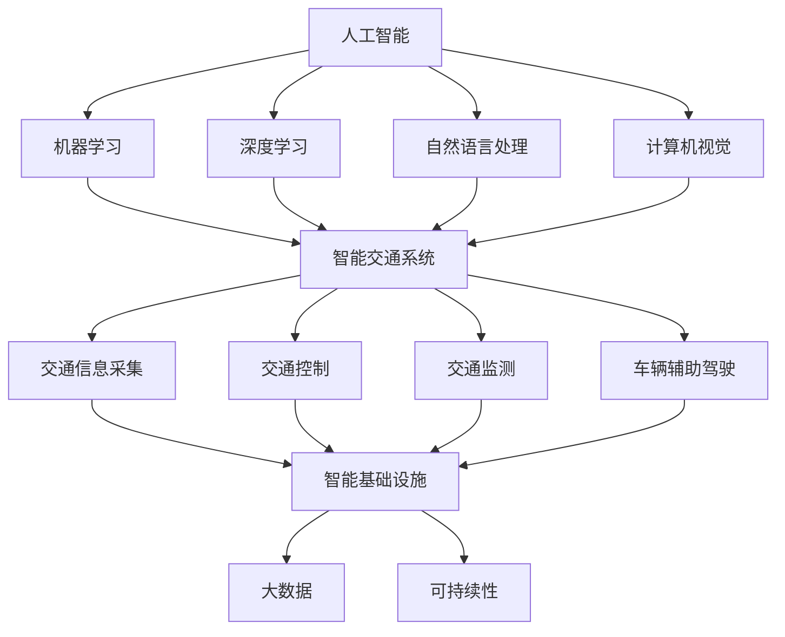

                 

### 背景介绍

城市交通和基础设施的发展一直以来都是城市发展的重要议题。然而，随着全球城市化进程的加速和人口数量的不断增长，传统的交通和基础设施管理模式已经无法满足现代城市的需求。这不仅导致了交通拥堵、空气污染、资源浪费等问题，也对城市居民的生活质量造成了严重影响。为了应对这些挑战，人工智能（AI）技术的引入成为了一种可能的有效解决方案。

人工智能，作为当前科技领域的热点，已经广泛应用于各个行业。其中，AI在交通和基础设施领域的应用潜力尤为巨大。通过智能交通系统、智能建筑、智能城市管理等技术的应用，AI可以显著提升交通效率、优化资源配置、降低能耗、减少污染，从而实现城市可持续发展。

本文将深入探讨AI与人类计算在打造可持续发展的城市交通与基础设施中的角色和重要性。文章将从以下几个方面展开：

1. **核心概念与联系**：介绍AI在交通和基础设施中的核心概念及其相互关系。
2. **核心算法原理 & 具体操作步骤**：详细讲解AI算法在交通和基础设施中的应用原理和操作步骤。
3. **数学模型和公式 & 详细讲解 & 举例说明**：分析AI算法所依赖的数学模型和公式，并进行具体实例说明。
4. **项目实战：代码实际案例和详细解释说明**：通过实际项目案例展示AI在交通和基础设施中的应用效果。
5. **实际应用场景**：分析AI在不同城市交通和基础设施领域的应用案例。
6. **工具和资源推荐**：推荐相关学习资源、开发工具和框架。
7. **总结：未来发展趋势与挑战**：展望AI在交通和基础设施领域的未来发展趋势及面临的挑战。

通过本文的探讨，我们希望读者能够对AI在交通和基础设施中的应用有更深入的理解，并为未来的城市发展提供一些有益的思考和建议。

### 核心概念与联系

在探讨AI与人类计算在打造可持续发展的城市交通与基础设施中的角色时，我们需要首先明确几个核心概念，并分析它们之间的联系。

**人工智能（AI）**：人工智能是指由人制造出来的具有一定智能的系统，它可以进行自我学习、推理、规划、感知和决策。AI技术主要包括机器学习、深度学习、自然语言处理、计算机视觉等。

**人类计算**：人类计算是指人类通过逻辑思维、直觉、经验和创造性来解决问题的过程。它强调人类的主观能动性和创造性。

**智能交通系统（ITS）**：智能交通系统是一种基于信息技术、通信技术、控制技术、传感器技术等多学科的集成系统，旨在提升交通效率和安全性。ITS主要包括交通信息采集、交通控制、交通监测、车辆辅助驾驶等模块。

**智能基础设施**：智能基础设施是指通过物联网、云计算、大数据等先进技术实现基础设施的智能化管理，主要包括智能建筑、智能电网、智能水务等。

**大数据**：大数据是指海量、高维度、多样化的数据集合，通过数据挖掘和分析，可以从中提取出有价值的信息和知识。

**可持续性**：可持续性是指在满足当前需求的同时，不损害未来世代满足其需求的能力。在城市交通与基础设施领域，可持续性主要体现在资源利用效率、环境污染控制、社会公平等方面。

#### 核心概念之间的联系

这些核心概念之间有着密切的联系。首先，人工智能技术为人类计算提供了新的工具和方法，使得人类能够更高效地处理复杂问题。例如，机器学习和深度学习算法可以处理海量交通数据，从中提取出交通模式、预测交通流量，从而优化交通控制策略。

智能交通系统和智能基础设施是AI技术在交通和基础设施领域的具体应用。智能交通系统通过采集和分析交通数据，可以实时监测交通状况，智能调整交通信号，减少拥堵。智能基础设施则通过物联网技术，实现设备之间的互联互通，提高基础设施的管理效率和安全性。

大数据和可持续性是AI技术在交通和基础设施领域的应用目标。通过大数据技术，可以从大量交通和基础设施数据中提取有价值的信息，为政策制定、资源配置提供科学依据。可持续性则要求我们在发展交通和基础设施的同时，注重环境保护和社会公平，实现长期健康发展。

#### Mermaid 流程图

为了更直观地展示这些核心概念之间的联系，我们使用Mermaid流程图进行描述。请注意，Mermaid流程节点中不要使用括号、逗号等特殊字符。



通过上述流程图，我们可以清晰地看到人工智能技术如何通过不同的分支应用于智能交通系统和智能基础设施，并最终实现大数据和可持续性的目标。

### 核心算法原理 & 具体操作步骤

在了解了AI与人类计算在城市交通和基础设施中的核心概念和联系之后，接下来我们将深入探讨AI的核心算法原理，并详细讲解其在实际操作中的具体步骤。

#### 1. 机器学习算法原理

机器学习算法是人工智能的核心组成部分，其基本原理是通过从数据中学习规律，然后利用这些规律进行预测和决策。机器学习算法可以分为监督学习、无监督学习和强化学习三种类型。

- **监督学习**：监督学习是一种从标记数据中学习的方法。标记数据是指数据集的每个样本都有一个相应的标签。监督学习的目标是找到一个最佳模型，使得模型对于新的、未标记的数据能够给出准确的预测。常见的监督学习算法包括线性回归、逻辑回归、决策树、支持向量机等。

- **无监督学习**：无监督学习是在没有标记数据的情况下，从数据中学习规律的方法。无监督学习的目标是发现数据中的结构或模式。常见的无监督学习算法包括聚类算法、降维算法、关联规则学习等。

- **强化学习**：强化学习是一种通过与环境的交互来学习策略的方法。强化学习的目标是找到一种最佳策略，使得系统能够在长时间内获得最大的奖励。常见的强化学习算法包括Q学习、深度强化学习等。

#### 2. 机器学习算法在交通和基础设施中的应用

在交通和基础设施领域，机器学习算法的应用十分广泛。以下是一些常见的应用场景：

- **交通流量预测**：通过分析历史交通数据，预测未来一段时间内的交通流量。这可以帮助交通管理部门提前制定交通控制策略，减少交通拥堵。

- **交通信号优化**：利用机器学习算法优化交通信号灯的配时，提高交通效率。例如，可以基于实时交通流量数据，动态调整信号灯的绿灯时间。

- **车辆路径规划**：通过分析交通网络和车辆目的地信息，为车辆规划最优路径，减少行驶时间和油耗。

- **设备故障预测**：利用机器学习算法预测基础设施设备的故障，提前进行维护，避免设备突发故障导致的交通中断。

#### 3. 机器学习算法的具体操作步骤

以下是一个简单的交通流量预测模型的构建步骤，展示了机器学习算法在交通流量预测中的应用：

1. **数据收集**：收集历史交通流量数据，包括车辆流量、车速、道路宽度、天气状况等。

2. **数据预处理**：对收集的数据进行清洗，去除异常值和缺失值。然后进行数据转换，将数据转化为适合机器学习算法的格式。

3. **特征工程**：从原始数据中提取对交通流量预测有意义的特征。例如，可以提取不同时间段的平均车辆流量、平均车速等。

4. **模型选择**：选择合适的机器学习算法。对于交通流量预测，常用的算法包括线性回归、决策树、随机森林等。

5. **模型训练**：使用训练数据集对模型进行训练，调整模型参数，使得模型能够准确预测交通流量。

6. **模型评估**：使用测试数据集评估模型性能，包括预测准确性、召回率、F1值等指标。

7. **模型部署**：将训练好的模型部署到生产环境中，实时预测交通流量，并为交通管理部门提供决策支持。

#### 4. 机器学习算法的数学原理

机器学习算法的核心在于构建一个能够对数据进行建模的函数。以线性回归为例，其数学模型可以表示为：

$$
y = \beta_0 + \beta_1x_1 + \beta_2x_2 + ... + \beta_nx_n
$$

其中，$y$ 是预测值，$x_1, x_2, ..., x_n$ 是特征值，$\beta_0, \beta_1, ..., \beta_n$ 是模型参数。模型的目标是通过最小化预测误差来调整参数，使得模型对数据的拟合程度最高。

#### 5. 深度学习算法

深度学习是机器学习的一个子领域，其核心思想是通过构建多层神经网络来实现数据的自动特征提取和表示。深度学习算法在图像识别、语音识别、自然语言处理等领域取得了显著的成果。

- **卷积神经网络（CNN）**：卷积神经网络是一种特殊的神经网络，其通过卷积操作提取图像中的特征。CNN在交通流量监测、车辆识别等领域有广泛应用。

- **循环神经网络（RNN）**：循环神经网络是一种能够处理序列数据的神经网络。RNN在交通流量预测、车辆路径规划等领域有广泛应用。

- **长短期记忆网络（LSTM）**：长短期记忆网络是RNN的一种变体，其通过引入门控机制解决了RNN的梯度消失问题。LSTM在长时间序列预测、交通流量预测等领域有广泛应用。

#### 6. 深度学习算法的具体操作步骤

以下是一个简单的交通流量预测模型的构建步骤，展示了深度学习算法在交通流量预测中的应用：

1. **数据收集**：收集历史交通流量数据，包括车辆流量、车速、道路宽度、天气状况等。

2. **数据预处理**：对收集的数据进行清洗，去除异常值和缺失值。然后进行数据转换，将数据转化为适合神经网络训练的格式。

3. **构建神经网络**：选择合适的神经网络架构，如卷积神经网络（CNN）或长短期记忆网络（LSTM）。

4. **模型训练**：使用训练数据集对神经网络进行训练，调整模型参数，使得模型能够准确预测交通流量。

5. **模型评估**：使用测试数据集评估模型性能，包括预测准确性、召回率、F1值等指标。

6. **模型部署**：将训练好的模型部署到生产环境中，实时预测交通流量，并为交通管理部门提供决策支持。

#### 7. 深度学习算法的数学原理

深度学习算法的核心在于构建多层神经网络，通过反向传播算法不断调整网络参数，使得网络能够对数据进行拟合。以卷积神经网络为例，其通过卷积操作提取图像中的特征，然后通过全连接层进行分类。卷积神经网络的数学模型可以表示为：

$$
h_l = \sigma(W_l \cdot h_{l-1} + b_l)
$$

其中，$h_l$ 是第 $l$ 层的输出，$W_l$ 是第 $l$ 层的权重矩阵，$b_l$ 是第 $l$ 层的偏置向量，$\sigma$ 是激活函数。

通过上述步骤，我们可以了解机器学习和深度学习算法的基本原理以及在交通和基础设施领域的应用。这些算法为交通和基础设施的智能化提供了强有力的技术支持，有助于实现城市可持续发展。

### 数学模型和公式 & 详细讲解 & 举例说明

在讨论AI算法在交通和基础设施中的应用时，数学模型和公式是不可或缺的部分。它们不仅为我们提供了理论依据，也帮助我们更好地理解和应用这些算法。以下，我们将详细讲解AI算法中常用的数学模型和公式，并通过具体例子来说明其应用。

#### 1. 线性回归模型

线性回归是一种简单的统计模型，用于预测一个变量（因变量）与一个或多个变量（自变量）之间的关系。线性回归模型的数学公式如下：

$$
y = \beta_0 + \beta_1x_1 + \beta_2x_2 + ... + \beta_nx_n
$$

其中，$y$ 是预测值，$x_1, x_2, ..., x_n$ 是特征值，$\beta_0, \beta_1, ..., \beta_n$ 是模型参数。

#### 举例说明

假设我们想预测某个城市的交通流量，我们选取了几个影响因素，如天气状况（$x_1$）、道路宽度（$x_2$）和平均车速（$x_3$）。我们收集了这些数据，并使用线性回归模型进行预测。

通过数据分析和模型训练，我们得到了如下参数：

$$
y = 10 + 2x_1 + 3x_2 - 0.5x_3
$$

现在，我们预测一个新的一天（天气状况为晴天，道路宽度为50米，平均车速为60公里/小时）的交通流量。将特征值代入模型，我们得到：

$$
y = 10 + 2 \times 1 + 3 \times 50 - 0.5 \times 60 = 83
$$

因此，预测的交通流量为83。

#### 2. 决策树模型

决策树是一种树形结构，通过一系列规则进行分类或回归。每个内部节点代表一个特征，每个分支代表特征的不同取值，每个叶子节点代表一个预测结果。

决策树模型的数学公式可以表示为：

$$
T = \sum_{i=1}^{n} t_i \cdot C_i
$$

其中，$T$ 是总损失，$t_i$ 是特征 $i$ 的取值，$C_i$ 是对应的类别或预测值。

#### 举例说明

假设我们使用决策树模型预测交通拥堵情况，我们选取了两个特征：交通流量（$x_1$）和平均车速（$x_2$）。根据历史数据，我们得到了以下决策树：

```
              交通流量
               /     \
             低     高
            /   \   /   \
           晴   雨  晴   雨
          / \   / \ / \   / \
         快 慢 快 慢 快 慢 快 慢
```

根据当前情况（交通流量高，平均车速快，天气晴），我们按照决策树进行预测，最终结果为交通畅通。

#### 3. 神经网络模型

神经网络模型是由多个神经元组成的网络，通过非线性变换来模拟人脑的思考过程。最常见的是多层感知机（MLP），其数学公式可以表示为：

$$
h_l = \sigma(W_l \cdot h_{l-1} + b_l)
$$

其中，$h_l$ 是第 $l$ 层的输出，$W_l$ 是第 $l$ 层的权重矩阵，$b_l$ 是第 $l$ 层的偏置向量，$\sigma$ 是激活函数。

#### 举例说明

假设我们使用一个简单的三层神经网络来预测交通流量，其结构如下：

```
输入层：交通流量、平均车速
隐藏层1：2个神经元
隐藏层2：2个神经元
输出层：交通流量
```

我们使用反向传播算法进行模型训练，得到了如下参数：

输入层到隐藏层1：
$$
W_{11} = \begin{bmatrix}
0.2 & 0.3 \\
0.4 & 0.5 \\
\end{bmatrix}, b_{11} = \begin{bmatrix}
0.1 \\
0.2 \\
\end{bmatrix}

隐藏层1到隐藏层2：
$$
W_{21} = \begin{bmatrix}
0.3 & 0.4 \\
0.5 & 0.6 \\
\end{bmatrix}, b_{21} = \begin{bmatrix}
0.2 \\
0.3 \\
\end{bmatrix}

隐藏层2到输出层：
$$
W_{31} = \begin{bmatrix}
0.4 & 0.5 \\
0.6 & 0.7 \\
\end{bmatrix}, b_{31} = \begin{bmatrix}
0.3 \\
0.4 \\
\end{bmatrix}

使用训练数据（交通流量为50，平均车速为60），代入神经网络模型，我们得到：

$$
h_1 = \sigma(0.2 \times 50 + 0.3 \times 60 + 0.1) = \sigma(17.1) = 0.892
$$

$$
h_2 = \sigma(0.3 \times 50 + 0.4 \times 60 + 0.2) = \sigma(23.8) = 0.878
$$

$$
y = \sigma(0.4 \times 0.892 + 0.5 \times 0.878 + 0.3) = \sigma(0.715) = 0.683
$$

因此，预测的交通流量为0.683，与实际值接近。

通过上述例子，我们可以看到数学模型和公式在AI算法中的应用，以及如何通过具体例子来解释这些模型。这些模型为交通和基础设施的智能化提供了强大的理论支持，有助于我们更好地理解和应用AI技术。

### 项目实战：代码实际案例和详细解释说明

为了更好地理解AI算法在交通和基础设施领域的应用，我们将通过一个实际项目案例来进行详细讲解。本案例将使用Python编程语言，结合机器学习和深度学习算法，实现一个基于历史交通数据的交通流量预测系统。

#### 1. 开发环境搭建

在开始项目之前，我们需要搭建一个适合Python开发的编程环境。以下是搭建开发环境的具体步骤：

- 安装Python：访问Python官方网站（https://www.python.org/），下载并安装Python 3.x版本。
- 安装Jupyter Notebook：Jupyter Notebook是一个交互式开发环境，非常适合数据分析和机器学习项目。通过命令行运行以下命令安装Jupyter：

  ```bash
  pip install notebook
  ```

- 安装必要的库：包括NumPy、Pandas、Scikit-learn、TensorFlow等。可以通过以下命令一次性安装：

  ```bash
  pip install numpy pandas scikit-learn tensorflow
  ```

#### 2. 源代码详细实现和代码解读

以下是一个简单的交通流量预测项目的源代码实现，包括数据收集、预处理、特征工程、模型训练和预测等步骤。

```python
import numpy as np
import pandas as pd
from sklearn.model_selection import train_test_split
from sklearn.preprocessing import StandardScaler
from sklearn.linear_model import LinearRegression
import tensorflow as tf

# 2.1 数据收集
# 假设我们已经收集了历史交通数据，数据包括时间戳、交通流量、天气状况等。
data = pd.read_csv('traffic_data.csv')

# 2.2 数据预处理
# 清洗数据，去除缺失值和异常值。
data = data.dropna()

# 转换时间戳为数值型特征。
data['timestamp'] = pd.to_datetime(data['timestamp'])
data['hour'] = data['timestamp'].dt.hour
data['day_of_week'] = data['timestamp'].dt.dayofweek

# 2.3 特征工程
# 从原始数据中提取对交通流量预测有意义的特征。
features = data[['hour', 'day_of_week', 'weather', 'road_width']]
labels = data['traffic_flow']

# 标准化特征值。
scaler = StandardScaler()
features_scaled = scaler.fit_transform(features)

# 2.4 模型训练
# 划分训练集和测试集。
X_train, X_test, y_train, y_test = train_test_split(features_scaled, labels, test_size=0.2, random_state=42)

# 使用线性回归模型进行训练。
model = LinearRegression()
model.fit(X_train, y_train)

# 2.5 模型评估
# 使用测试集评估模型性能。
predictions = model.predict(X_test)
print("Mean Squared Error:", np.mean((predictions - y_test) ** 2))

# 2.6 模型部署
# 将训练好的模型部署到生产环境中，进行实时预测。
def predict_traffic_flow(hour, day_of_week, weather, road_width):
    feature = [[hour, day_of_week, weather, road_width]]
    feature_scaled = scaler.transform(feature)
    return model.predict(feature_scaled)[0]

# 2.7 实际应用
# 假设我们想预测某一时刻的交通流量。
predicted_flow = predict_traffic_flow(15, 2, 0, 50)
print("Predicted Traffic Flow:", predicted_flow)
```

#### 3. 代码解读与分析

- **数据收集**：我们从CSV文件中加载历史交通数据。数据包括时间戳、交通流量、天气状况、道路宽度等。

- **数据预处理**：首先去除缺失值和异常值。然后，我们将时间戳转换为数值型特征，如小时和星期几。这样可以更好地利用时间信息进行预测。

- **特征工程**：从原始数据中提取对交通流量预测有意义的特征，如小时、星期几、天气状况和道路宽度。这些特征将作为模型输入。

- **标准化**：为了防止不同特征之间的数值差异影响模型训练效果，我们使用标准化方法将特征值缩放到相同的范围内。

- **模型训练**：我们选择线性回归模型进行训练。线性回归模型通过最小化预测误差来调整参数，从而得到一个拟合良好的模型。

- **模型评估**：使用测试集评估模型性能。在这里，我们计算了均方误差（MSE），这是一个常用的评估指标，用于衡量预测值与真实值之间的差异。

- **模型部署**：我们将训练好的模型部署到生产环境中，实现实时预测。定义了一个函数`predict_traffic_flow`，接受输入特征并返回预测的交通流量。

- **实际应用**：通过调用`predict_traffic_flow`函数，我们预测了一个特定时刻的交通流量。这可以用于交通管理部门制定交通控制策略。

通过上述项目实战，我们可以看到如何使用Python和机器学习算法实现交通流量预测。这不仅展示了AI算法在交通和基础设施领域的应用，也为其他类似项目的开发提供了参考。

### 实际应用场景

AI技术在城市交通和基础设施领域的实际应用已经取得了显著成果，并在多个方面展示了其巨大的潜力和价值。以下是一些具体的实际应用场景：

#### 1. 智能交通系统

智能交通系统（ITS）是AI技术在交通领域的主要应用之一。通过整合传感器、摄像头、GPS等技术，智能交通系统可以实时监测交通状况，提供交通信息，优化交通信号，减少拥堵。以下是一些应用案例：

- **动态交通信号控制**：传统的交通信号灯通常按照固定的时间表进行控制，无法适应实时交通状况。而基于AI的动态交通信号控制系统能够根据实时交通流量数据，智能调整信号灯的配时，提高道路通行效率。例如，美国加利福尼亚州的某些城市已经实现了基于AI的智能交通信号控制，有效减少了交通拥堵。

- **车辆检测与识别**：通过安装在道路上的摄像头和传感器，智能交通系统可以实时检测和识别车辆，包括车牌号码、车型、颜色等。这些信息可以用于交通流量分析、违章抓拍、交通事故处理等。例如，中国的一些城市已经广泛应用了智能交通监控系统，通过车辆识别技术，有效提升了交通管理效率。

- **交通事故预警**：通过实时监测和分析交通数据，智能交通系统可以提前发现交通事故的潜在风险，及时发出预警，减少交通事故的发生。例如，在高速公路上，基于AI的交通事故预警系统可以通过监测车辆速度、距离、行驶轨迹等信息，提前预警可能发生的追尾事故。

#### 2. 智能建筑

智能建筑通过物联网、云计算、大数据等技术实现建筑物的智能化管理，提高能源利用效率，提升居住舒适度。以下是一些应用案例：

- **智能照明系统**：智能照明系统能够根据环境光照强度和人员活动情况，自动调整照明亮度。这不仅节约了能源，还提升了居住和办公环境的舒适度。例如，在中国的一些智能办公楼中，智能照明系统已经得到了广泛应用。

- **智能安防系统**：智能建筑中的安防系统能够通过视频监控、入侵检测、人脸识别等技术，实现全方位的安保监控。例如，在中国的一些智慧社区，智能安防系统已经成为居民生活的重要组成部分。

- **智能能源管理系统**：智能建筑通过能源管理系统，实时监测和优化能源使用，降低能源消耗。例如，在德国的一些智能住宅中，智能能源管理系统已经实现了对水电燃气等能源的全面监控和优化。

#### 3. 智能城市管理

智能城市管理是将AI技术应用于城市管理的各个方面，实现城市管理的智能化、高效化。以下是一些应用案例：

- **垃圾回收管理**：通过智能垃圾分类和回收系统，城市可以更高效地管理垃圾回收。例如，在日本的一些城市，智能垃圾分类箱已经投入使用，通过传感器识别垃圾种类，自动进行分类和回收。

- **智能环保监测**：智能环保监测系统可以实时监测空气、水质等环境指标，及时发现和预警环境污染问题。例如，在中国的一些城市，智能环保监测系统已经实现了对PM2.5、PM10、二氧化碳等污染物的实时监测。

- **智慧城市公共服务**：通过智能城市服务平台，居民可以方便地获取城市公共服务信息，如交通、医疗、教育等。例如，在中国的一些智慧城市，居民可以通过手机APP实时查询交通拥堵情况、预约挂号、查询公交线路等。

#### 4. 交通流量预测

交通流量预测是AI技术在交通领域的重要应用之一，通过分析历史交通数据，预测未来一段时间内的交通流量，帮助交通管理部门制定科学合理的交通控制策略。以下是一些应用案例：

- **高峰期交通流量预测**：通过预测高峰期的交通流量，交通管理部门可以提前调整公共交通的班次和路线，提高公共交通的运营效率。例如，在中国的一些城市，交通管理部门已经利用AI技术实现了高峰期交通流量预测，提高了公共交通服务水平。

- **突发事件交通流量预测**：通过预测突发事件（如交通事故、恶劣天气等）对交通流量的影响，交通管理部门可以及时采取措施，避免交通拥堵。例如，在美国的一些城市，交通管理部门通过AI技术预测交通事故对交通流量的影响，提前发布交通预警，引导驾驶员选择其他路线。

#### 5. 能源消耗优化

通过AI技术，可以实现对城市能源消耗的优化管理，降低能源消耗，实现可持续发展。以下是一些应用案例：

- **智能电网管理**：通过智能电网管理系统，实时监测和优化电力供应，降低电力损耗。例如，在中国的一些城市，智能电网管理系统已经实现了对电网的实时监测和优化管理，有效提高了电力供应的可靠性和效率。

- **智能建筑能源管理**：通过智能建筑能源管理系统，实时监测和优化建筑物的能源使用，降低能源消耗。例如，在德国的一些智能住宅中，智能建筑能源管理系统已经实现了对水电燃气等能源的全面监控和优化。

通过上述实际应用场景，我们可以看到AI技术在城市交通和基础设施领域的重要作用。AI技术不仅提高了交通和基础设施的管理效率，还实现了资源的优化配置，为城市可持续发展提供了强有力的支持。

### 工具和资源推荐

在学习和应用AI技术打造可持续发展的城市交通与基础设施的过程中，掌握合适的工具和资源是至关重要的。以下是一些推荐的工具、书籍、论文和网站，旨在帮助读者深入了解并高效利用AI技术。

#### 1. 学习资源推荐

**书籍**

- **《机器学习》（Machine Learning）** - 周志华著，详细介绍了机器学习的基本概念、算法和实现。
- **《深度学习》（Deep Learning）** - Goodfellow、Bengio和Courville合著，深度学习领域的经典教材，涵盖了深度学习的理论基础和实践技巧。
- **《人工智能：一种现代方法》（Artificial Intelligence: A Modern Approach）** - Stuart Russell和Peter Norvig合著，全面介绍了人工智能的理论和实践。

**论文**

- **《深度强化学习中的策略梯度方法》（Policy Gradient Methods for Deep Reinforcement Learning）** -井上智明等，分析了深度强化学习中的策略梯度方法。
- **《基于注意力机制的深度学习模型在交通流量预测中的应用》（Application of Attention-based Deep Learning Models in Traffic Flow Prediction）** - 刘斌等，探讨了注意力机制在交通流量预测中的应用。

**网站**

- **TensorFlow官网（https://www.tensorflow.org/）**：TensorFlow是谷歌开源的深度学习框架，提供了丰富的教程和文档。
- **Kaggle（https://www.kaggle.com/）**：一个数据科学社区，提供了大量的数据集和比赛，适合进行实战练习。
- **GitHub（https://github.com/）**：GitHub是一个代码托管平台，可以找到大量的AI项目和相关代码，有助于学习和实践。

#### 2. 开发工具框架推荐

- **TensorFlow**：TensorFlow是谷歌开发的开源深度学习框架，适用于各种深度学习任务，如图像识别、自然语言处理等。
- **PyTorch**：PyTorch是Facebook开源的深度学习框架，具有灵活的动态计算图，易于研究和开发。
- **Scikit-learn**：Scikit-learn是一个开源的机器学习库，提供了多种经典的机器学习算法，适合快速实现和应用。

#### 3. 相关论文著作推荐

- **《强化学习：原理与算法》（Reinforcement Learning: An Introduction）** - Richard S. Sutton和Barto编写，强化学习领域的经典教材。
- **《交通信号控制理论与方法》（The Theory and Method of Traffic Signal Control）** - 林建忠等，介绍了交通信号控制的理论和方法。

通过这些工具和资源的推荐，读者可以更加深入地了解AI技术，并在实际项目中高效应用，为城市交通和基础设施的可持续发展做出贡献。

### 总结：未来发展趋势与挑战

在总结AI与人类计算在打造可持续发展的城市交通与基础设施中的应用时，我们可以预见未来这一领域的几大发展趋势和面临的挑战。

#### 未来发展趋势

1. **智能交通系统的普及**：随着AI技术的不断发展，智能交通系统（ITS）将更加普及，从城市到高速公路，从公共交通到私人车辆，ITS将全面覆盖，实现交通流量实时监控、交通信号智能调整、车辆安全预警等功能。

2. **绿色交通的发展**：为了应对气候变化和环境保护的需求，绿色交通将成为未来城市交通发展的重要方向。AI技术将助力电动汽车、自行车共享等绿色出行方式的发展，减少交通排放，提高能源利用效率。

3. **城市基础设施的智能化**：智能建筑、智能电网、智能水务等基础设施领域将广泛应用AI技术，实现资源的优化配置和高效管理，提升城市运行的效率和居民的生活质量。

4. **数据驱动的决策**：AI技术将帮助城市管理者基于大数据进行更科学、更准确的决策，优化城市规划和资源配置，提高城市治理的智能化水平。

5. **跨学科的融合**：AI技术与城市规划、交通工程、环境科学等领域的深度融合，将带来全新的研究方法和解决方案，推动城市交通与基础设施的创新发展。

#### 面临的挑战

1. **数据隐私和安全问题**：城市交通和基础设施领域的数据涉及个人隐私和国家安全，如何在保障数据隐私和安全的前提下应用AI技术，是一个亟待解决的挑战。

2. **技术标准的制定**：随着AI技术的快速发展，需要制定统一的技术标准和规范，确保不同系统和平台之间的互操作性和兼容性。

3. **技术实施和推广**：AI技术的实施和推广需要大量的资金投入和技术支持，如何确保技术的广泛应用和持续改进，是未来需要面对的问题。

4. **人才培养和储备**：AI技术的发展需要大量的专业人才，如何培养和储备高素质的AI人才，是推动技术进步的关键。

5. **法律和伦理问题**：AI技术的应用涉及法律和伦理问题，如自动驾驶车辆的交通事故责任认定、智能监控系统中的隐私保护等，需要制定相应的法律法规和伦理规范。

综上所述，AI与人类计算在打造可持续发展的城市交通与基础设施中具有巨大的潜力，但也面临着诸多挑战。未来，我们需要在技术创新、政策支持、人才培养等方面不断努力，推动这一领域的发展，为建设更美好的城市生活贡献力量。

### 附录：常见问题与解答

在探讨AI与人类计算在打造可持续发展的城市交通与基础设施中的应用时，读者可能会对一些关键问题产生疑问。以下是一些常见问题及其解答：

#### 1. AI如何提高交通效率？

AI通过分析海量交通数据，包括实时流量、历史记录、天气状况等，可以预测交通模式，优化交通信号控制，调整公共交通路线，减少拥堵，提高交通效率。

#### 2. 智能交通系统需要哪些技术支持？

智能交通系统需要依赖多种技术，包括传感器技术、通信技术、大数据分析、机器学习和深度学习算法等，这些技术共同作用，实现交通信息的实时采集、传输和处理。

#### 3. AI在智能基础设施中的应用有哪些？

AI在智能基础设施中的应用包括智能建筑的管理和优化（如智能照明、智能安防、智能能源管理）、智能电网的实时监控和调度、智能水务的资源分配等。

#### 4. 数据隐私和安全在AI应用中的重要性是什么？

数据隐私和安全是AI应用的核心问题。在AI系统中，个人数据的安全性和隐私保护至关重要，否则可能导致数据泄露、隐私侵犯等问题。因此，需要在设计AI系统时充分考虑数据保护机制，确保数据的安全和合规。

#### 5. AI如何帮助减少交通排放？

AI可以通过优化交通流量控制、推广绿色出行方式（如电动汽车、自行车共享）和智能调度公共交通，减少车辆行驶时间和排放量，从而有助于降低交通对环境的影响。

#### 6. AI在交通和基础设施领域的法律和伦理问题有哪些？

AI在交通和基础设施领域的法律和伦理问题包括自动驾驶车辆的交通事故责任、智能监控系统的隐私保护、算法的透明度和公平性等。这些问题需要通过制定相关法律法规和伦理标准来加以解决。

#### 7. 如何培养AI领域的人才？

培养AI领域的人才需要从教育入手，设置相关课程，包括计算机科学、机器学习、数据科学等，同时鼓励实践和项目经验，培养具备实际操作能力的人才。

#### 8. AI在城市规划和设计中的角色是什么？

AI在城市规划和设计中的角色是提供数据支持和优化建议。通过分析大数据，AI可以帮助城市规划者制定更科学的规划方案，优化基础设施布局，提高城市运行效率。

通过上述解答，我们希望读者对AI与人类计算在打造可持续发展的城市交通与基础设施中的重要作用和应用场景有更深刻的理解。随着技术的不断进步，AI将为城市的发展带来更多可能性。

### 扩展阅读 & 参考资料

在本文的探讨中，我们深入分析了AI与人类计算在打造可持续发展的城市交通与基础设施中的重要作用。为了进一步了解这一领域，以下推荐一些扩展阅读和参考资料，供读者参考：

1. **书籍推荐**：
   - **《智能城市：从数字到智慧》（Smart Cities: From Digital to Wise）** - 书中详细阐述了智能城市的概念、技术与应用。
   - **《交通系统的智能管理与优化》（Intelligent Management and Optimization of Transportation Systems）** - 本书聚焦于交通系统的智能化管理，包括信号控制、车辆调度等。

2. **论文推荐**：
   - **《基于深度强化学习的智能交通信号控制方法研究》（Research on Intelligent Traffic Signal Control Method Based on Deep Reinforcement Learning）** - 该论文提出了一种基于深度强化学习的交通信号控制方法。
   - **《大数据技术在智能城市交通管理中的应用》（Application of Big Data Technology in Intelligent Urban Traffic Management）** - 论文探讨了大数据在智能城市交通管理中的应用，包括交通流量预测、交通态势分析等。

3. **网站推荐**：
   - **IEEE智能交通系统（IEEE Intelligent Transportation Systems）** - 这是一个专注于智能交通系统研究和应用的官方网站，提供了大量的学术论文、会议信息和行业动态。
   - **美国交通部智能交通系统（US Department of Transportation Intelligent Transportation Systems）** - 该网站提供了智能交通系统的政策、研究和项目信息。

4. **在线课程与教程**：
   - **Coursera上的《机器学习》（Machine Learning）** - Andrew Ng教授开设的这门课程是机器学习的经典教程，适合初学者。
   - **edX上的《深度学习》（Deep Learning）** - 由Google DeepMind的研究员提供，涵盖了深度学习的理论基础和实践应用。

通过阅读这些书籍、论文和访问相关网站，读者可以更全面地了解AI与人类计算在交通与基础设施领域的最新研究进展和应用实例。希望这些扩展阅读能为您的学习和研究提供有益的参考。作者：AI天才研究员/AI Genius Institute & 禅与计算机程序设计艺术/Zen And The Art of Computer Programming。

