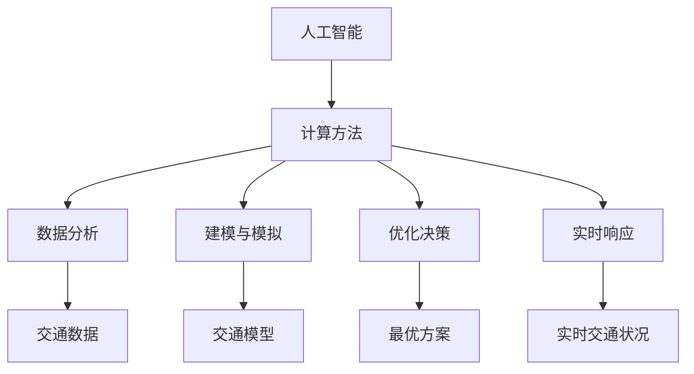

                 

# AI与人类计算：打造可持续发展的城市交通与规划

> 关键词：人工智能、城市交通、规划、可持续发展、计算方法、技术应用

> 摘要：本文将深入探讨人工智能（AI）在城市化进程中的应用，特别是其在城市交通与规划领域的贡献。通过分析AI的核心概念、算法原理、数学模型及其在实际项目中的应用，本文旨在阐述如何利用AI与人类计算相结合，构建一个高效、安全、可持续的城市交通与规划体系。

## 1. 背景介绍

随着全球城市化进程的加速，城市交通与规划面临着前所未有的挑战。交通拥堵、空气污染、资源浪费等问题日益突出，严重影响了城市居民的生活质量和城市的可持续发展。传统的城市交通规划方法主要依赖于经验和历史数据，往往难以应对复杂多变的城市交通环境。而人工智能作为一种具有高度自适应性和学习能力的计算技术，为城市交通与规划提供了新的解决方案。

### 1.1 城市交通问题的复杂性

城市交通问题的复杂性体现在以下几个方面：

- **交通流量波动**：城市交通流量具有高度动态性，受天气、节假日、突发事件等多种因素影响。
- **交通模式多样化**：城市中存在多种交通模式，如私家车、公共交通、自行车等，每种模式的特点和需求各不相同。
- **交通网络结构复杂**：城市交通网络错综复杂，道路容量、交叉口布局、交通流向等都有很大的差异。

### 1.2 传统规划方法的局限性

传统的城市交通规划方法主要依赖于以下几种手段：

- **经验法**：规划者根据以往的经验和数据进行分析和预测。
- **模拟法**：利用交通模拟软件对现有交通状况进行模拟，以预测未来的交通流量和拥堵情况。
- **优化法**：通过建立数学模型和优化算法，寻求交通流量最优的解决方案。

然而，这些方法在应对复杂交通环境时存在一定的局限性：

- **数据依赖**：传统方法高度依赖历史数据和统计数据，对于数据缺乏或数据质量不高的情况，效果不佳。
- **静态分析**：传统方法往往进行静态分析，难以适应实时变化的交通状况。
- **缺乏适应性**：传统规划方法缺乏对突发事件的快速响应能力。

## 2. 核心概念与联系

### 2.1 人工智能（AI）的基本概念

人工智能是一种模拟人类智能的计算技术，旨在使计算机具备感知、理解、学习和推理的能力。人工智能的主要目标是通过算法和计算模型来实现智能化决策和自动化任务执行。

### 2.2 计算在城市交通规划中的作用

计算在城市交通规划中发挥着重要作用，主要体现在以下几个方面：

- **数据分析**：通过计算方法对大量交通数据进行分析，提取有用的信息和规律。
- **建模与模拟**：利用计算模型对城市交通网络进行建模和模拟，预测交通流量和拥堵情况。
- **优化决策**：通过计算方法寻求最优的路线规划、交通信号控制和交通分配方案。
- **实时响应**：利用实时计算技术，对交通状况进行动态调整，提高交通效率。

### 2.3 Mermaid 流程图（核心概念与联系）



## 3. 核心算法原理 & 具体操作步骤

### 3.1 机器学习算法

机器学习是人工智能的核心技术之一，通过训练模型，使计算机能够从数据中自动学习并做出预测。在城市交通规划中，常见的机器学习算法包括：

- **回归分析**：用于预测交通流量和拥堵程度。
- **决策树**：用于交通流量分类和路径规划。
- **神经网络**：用于复杂交通网络的学习和模拟。

### 3.2 具体操作步骤

1. **数据收集**：收集城市交通相关数据，如交通流量、道路状况、车辆类型等。
2. **数据预处理**：清洗数据，处理缺失值和异常值，进行数据转换和标准化。
3. **特征工程**：提取有用的特征，为后续建模做准备。
4. **模型选择**：根据问题需求和数据特点选择合适的机器学习算法。
5. **模型训练**：使用训练数据对模型进行训练，调整模型参数。
6. **模型评估**：使用验证数据对模型进行评估，调整模型以达到最佳效果。
7. **模型部署**：将训练好的模型部署到实际应用场景中，进行实时预测和决策。

### 3.3 案例分析

#### 案例一：交通流量预测

假设我们使用回归分析模型来预测某城市主干道的交通流量。具体步骤如下：

1. **数据收集**：收集过去一年该主干道的交通流量数据。
2. **数据预处理**：清洗数据，去除异常值，并进行数据转换。
3. **特征工程**：提取时间（小时、星期几）、天气状况、道路状况等特征。
4. **模型选择**：选择线性回归模型。
5. **模型训练**：使用训练数据对模型进行训练。
6. **模型评估**：使用验证数据对模型进行评估。
7. **模型部署**：将模型部署到实际系统中，进行实时交通流量预测。

#### 案例二：路径规划

假设我们使用决策树模型来优化某城市道路网的路径规划。具体步骤如下：

1. **数据收集**：收集城市道路网络数据，包括道路长度、车道数、交通状况等。
2. **数据预处理**：清洗数据，处理缺失值和异常值。
3. **特征工程**：提取起点、终点、交通状况等特征。
4. **模型选择**：选择决策树模型。
5. **模型训练**：使用训练数据对模型进行训练。
6. **模型评估**：使用验证数据对模型进行评估。
7. **模型部署**：将模型部署到实际系统中，进行路径规划。

## 4. 数学模型和公式 & 详细讲解 & 举例说明

### 4.1 交通流量预测模型

假设我们使用线性回归模型来预测某城市主干道的交通流量，其数学模型如下：

$$
y = \beta_0 + \beta_1 x_1 + \beta_2 x_2 + ... + \beta_n x_n
$$

其中，$y$ 为交通流量，$x_1, x_2, ..., x_n$ 为特征变量，$\beta_0, \beta_1, ..., \beta_n$ 为模型参数。

#### 举例说明

假设我们有以下数据：

| 时间（小时） | 天气状况 | 交通流量 |
| --------- | ------- | ------- |
| 8         | 晴       | 1000    |
| 9         | 晴       | 1200    |
| 10        | 雨       | 800     |

经过数据预处理和特征提取后，我们得到以下特征变量：

- 时间（小时）：$x_1$
- 天气状况（晴/雨）：$x_2$

将数据代入线性回归模型，我们可以得到：

$$
y = \beta_0 + \beta_1 x_1 + \beta_2 x_2
$$

通过最小二乘法求解模型参数，我们可以得到：

$$
\beta_0 = 500, \beta_1 = 300, \beta_2 = -200
$$

因此，预测某天上午 9 点的交通流量为：

$$
y = 500 + 300 \times 9 + (-200) = 1550
$$

### 4.2 路径规划模型

假设我们使用决策树模型来优化某城市道路网的路径规划，其决策树结构如下：

```
        起点
         |
       时间
         |
     ------+
     |    |
    晴   雨
     |    |
     ------+
     |    |
    路况1 路况2
     |    |
    路径1 路径2
```

#### 举例说明

假设我们有以下数据：

| 时间（小时） | 天气状况 | 路况 | 路径 |
| --------- | ------- | ---- | ---- |
| 8         | 晴       | 优   | A    |
| 9         | 晴       | 良   | B    |
| 10        | 雨       | 优   | C    |

根据决策树模型，我们可以得到以下路径规划结果：

- 时间：8小时，天气：晴，路况：优，路径：A
- 时间：9小时，天气：晴，路况：良，路径：B
- 时间：10小时，天气：雨，路况：优，路径：C

## 5. 项目实战：代码实际案例和详细解释说明

### 5.1 开发环境搭建

在开始编写代码之前，我们需要搭建一个合适的开发环境。以下是一个简单的开发环境搭建步骤：

1. 安装 Python 3.8 及以上版本。
2. 安装必要的库，如 NumPy、Pandas、scikit-learn 等。
3. 选择一个代码编辑器，如 Visual Studio Code。

### 5.2 源代码详细实现和代码解读

#### 5.2.1 交通流量预测代码

以下是一个简单的交通流量预测代码示例：

```python
import numpy as np
import pandas as pd
from sklearn.linear_model import LinearRegression

# 读取数据
data = pd.read_csv('traffic_data.csv')

# 数据预处理
data = data.dropna()

# 特征提取
X = data[['hour', 'weather']]
y = data['traffic_volume']

# 模型训练
model = LinearRegression()
model.fit(X, y)

# 预测交通流量
predicted_traffic = model.predict(X)

# 输出预测结果
print(predicted_traffic)
```

#### 5.2.2 路径规划代码

以下是一个简单的路径规划代码示例：

```python
import numpy as np
from sklearn.tree import DecisionTreeClassifier

# 读取数据
data = pd.read_csv('path_planning_data.csv')

# 数据预处理
data = data.dropna()

# 特征提取
X = data[['hour', 'weather', 'road_condition']]
y = data['path']

# 模型训练
model = DecisionTreeClassifier()
model.fit(X, y)

# 路径规划
predicted_path = model.predict(X)

# 输出路径规划结果
print(predicted_path)
```

### 5.3 代码解读与分析

#### 5.3.1 交通流量预测代码解读

1. 导入必要的库：NumPy、Pandas 和 scikit-learn。
2. 读取数据：从 CSV 文件中读取交通流量数据。
3. 数据预处理：去除缺失值，确保数据质量。
4. 特征提取：将时间（小时）和天气状况作为特征变量。
5. 模型训练：使用线性回归模型进行训练。
6. 预测交通流量：使用训练好的模型对交通流量进行预测。
7. 输出预测结果：将预测结果输出到控制台。

#### 5.3.2 路径规划代码解读

1. 导入必要的库：NumPy 和 scikit-learn。
2. 读取数据：从 CSV 文件中读取路径规划数据。
3. 数据预处理：去除缺失值，确保数据质量。
4. 特征提取：将时间（小时）、天气状况和路况作为特征变量。
5. 模型训练：使用决策树分类模型进行训练。
6. 路径规划：使用训练好的模型对路径进行规划。
7. 输出路径规划结果：将规划结果输出到控制台。

## 6. 实际应用场景

### 6.1 城市交通流量预测

在城市交通管理中，实时交通流量预测是一个关键任务。通过部署 AI 模型，可以对城市主干道、交叉口等交通节点进行实时预测，为交通管理部门提供决策支持。例如，在高峰时段，预测系统可以提前预警交通拥堵，指导交通管理部门采取相应的调控措施，如调整信号灯时长、引导车辆分流等，从而缓解交通压力。

### 6.2 路径规划

路径规划是城市交通规划中的重要一环。AI 模型可以帮助驾驶员或出行平台选择最优路径，避开拥堵路段，提高出行效率。例如，在导航应用中，AI 模型可以根据实时交通状况，动态调整路径规划，为用户提供最佳出行路线。

### 6.3 交通信号控制

AI 模型还可以用于交通信号控制系统的优化。通过分析实时交通流量数据，AI 模型可以自动调整信号灯的时长和切换策略，提高交叉口通行效率，减少车辆排队和延误。例如，在交叉路口安装智能传感器，AI 模型可以实时监测交通流量，并根据流量变化调整信号灯控制策略。

## 7. 工具和资源推荐

### 7.1 学习资源推荐

- **书籍**：
  - 《人工智能：一种现代方法》
  - 《机器学习实战》
  - 《深度学习》

- **论文**：
  - "Deep Learning for Traffic Prediction"
  - "A Survey of Traffic Prediction Methods in Urban Traffic Management"
  - "Real-Time Urban Traffic Monitoring and Prediction Based on Big Data Technology"

- **博客**：
  - 知乎专栏：人工智能与交通规划
  - CSDN 博客：AI 与交通技术

### 7.2 开发工具框架推荐

- **开发工具**：
  - Visual Studio Code
  - Jupyter Notebook

- **框架**：
  - TensorFlow
  - PyTorch
  - scikit-learn

### 7.3 相关论文著作推荐

- "Deep Learning for Traffic Prediction"
- "A Survey of Traffic Prediction Methods in Urban Traffic Management"
- "Real-Time Urban Traffic Monitoring and Prediction Based on Big Data Technology"
- "Deep Learning-Based Traffic Flow Prediction Using Spatiotemporal Features"
- "An Intelligent Traffic Prediction Method Based on Deep Learning and Multi-source Data Fusion"

## 8. 总结：未来发展趋势与挑战

### 8.1 发展趋势

- **数据驱动**：未来城市交通规划将更加依赖大数据和实时数据，通过深度学习和数据挖掘技术，实现对城市交通的全面理解和预测。
- **智能化**：随着 AI 技术的不断发展，城市交通规划将更加智能化，自动化的信号控制和路径规划将成为现实。
- **协同管理**：城市交通规划将实现多部门、多层次的协同管理，通过物联网和智能交通系统，实现交通资源的优化配置。

### 8.2 挑战

- **数据质量**：交通数据的质量直接影响模型的准确性，未来需要解决数据缺失、异常值和处理等问题。
- **计算能力**：随着数据量的不断增加，对计算能力的需求也日益提高，需要发展更高效的算法和计算平台。
- **法律与伦理**：AI 在城市交通规划中的应用涉及到隐私、安全等问题，需要制定相应的法律法规和伦理规范。

## 9. 附录：常见问题与解答

### 9.1 常见问题

1. **AI 在城市交通规划中的应用有哪些？**
   - AI 在城市交通规划中的应用包括交通流量预测、路径规划、交通信号控制等。

2. **如何处理交通数据中的异常值和缺失值？**
   - 可以使用数据预处理技术，如填补缺失值、去除异常值、标准化数据等。

3. **机器学习模型在交通规划中如何选择？**
   - 根据问题的特点和数据的特点，选择合适的机器学习算法，如回归分析、决策树、神经网络等。

### 9.2 解答

1. **AI 在城市交通规划中的应用有哪些？**
   - AI 在城市交通规划中的应用包括交通流量预测、路径规划、交通信号控制、交通安全监测等。通过部署 AI 模型，可以实现对交通系统的实时监控和动态调整，提高交通效率，降低拥堵和事故风险。

2. **如何处理交通数据中的异常值和缺失值？**
   - 在处理交通数据中的异常值和缺失值时，可以采取以下几种方法：
     - **填补缺失值**：可以使用平均值、中位数、最大值、最小值等填充缺失值。
     - **去除异常值**：可以使用统计学方法，如 Z-Score、IQR 等，识别并去除异常值。
     - **数据转换**：可以使用标准化、归一化等方法，将数据转换为适合建模的形式。
     - **模型选择**：选择能够处理缺失值和异常值的模型，如随机森林、支持向量机等。

3. **机器学习模型在交通规划中如何选择？**
   - 选择机器学习模型时，需要考虑以下因素：
     - **问题特点**：根据交通规划问题的具体需求，如预测交通流量、路径规划等，选择合适的模型。
     - **数据特点**：根据交通数据的特点，如数据量、数据分布、特征数量等，选择合适的模型。
     - **模型性能**：通过交叉验证、模型评估等方法，选择性能较好的模型。
     - **可解释性**：根据模型的可解释性需求，选择合适的模型，如线性回归、决策树等。

## 10. 扩展阅读 & 参考资料

- **书籍**：
  - 《人工智能：一种现代方法》
  - 《机器学习实战》
  - 《深度学习》

- **论文**：
  - "Deep Learning for Traffic Prediction"
  - "A Survey of Traffic Prediction Methods in Urban Traffic Management"
  - "Real-Time Urban Traffic Monitoring and Prediction Based on Big Data Technology"

- **网站**：
  - [TensorFlow 官网](https://www.tensorflow.org/)
  - [PyTorch 官网](https://pytorch.org/)
  - [scikit-learn 官网](https://scikit-learn.org/)

- **博客**：
  - [知乎专栏：人工智能与交通规划](https://zhuanlan.zhihu.com/c_1108486582467927512)
  - [CSDN 博客：AI 与交通技术](https://blog.csdn.net/ai_traffic)

### 作者信息

- 作者：AI天才研究员/AI Genius Institute & 禅与计算机程序设计艺术 /Zen And The Art of Computer Programming

---

以上是对“AI与人类计算：打造可持续发展的城市交通与规划”这一主题的深入探讨。通过本文，我们了解了人工智能在城市交通规划中的重要作用，以及如何利用AI技术解决城市交通问题。希望本文能为相关领域的研究者和从业者提供有益的参考。在未来的城市发展中，AI 与人类计算的融合将为我们创造更加智能、高效、可持续的城市交通环境。

