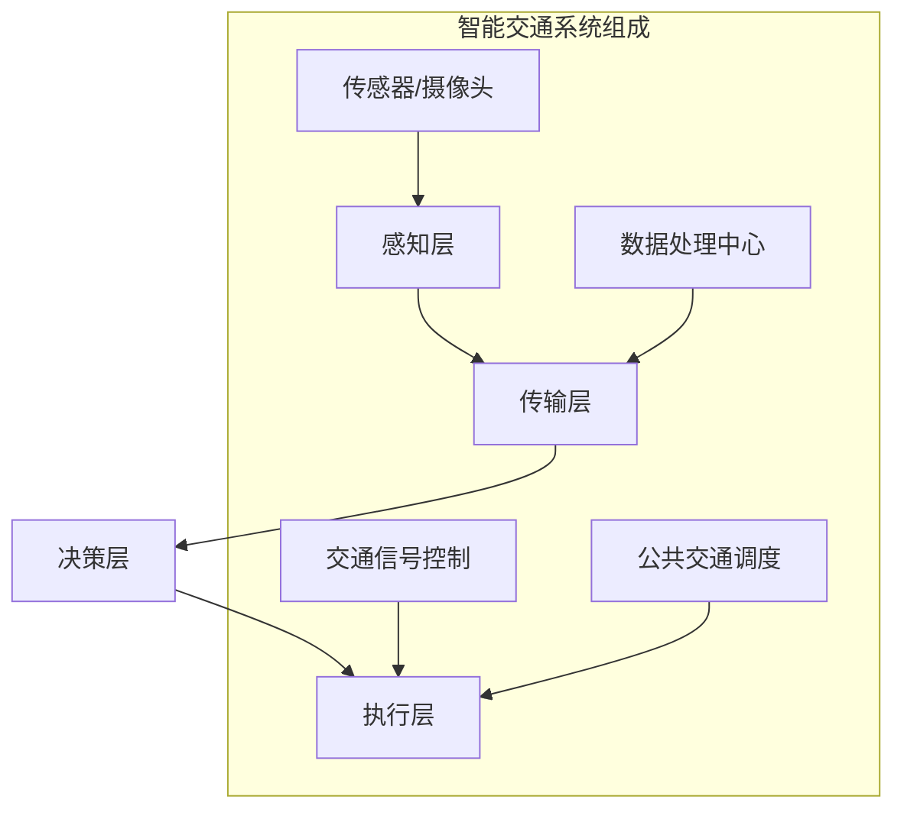

                 

# AI与人类计算：打造可持续发展的城市交通管理

> 关键词：人工智能，城市交通管理，可持续发展，智能交通系统，数据驱动，计算模型

> 摘要：本文将探讨如何利用人工智能和人类计算相结合，打造一个可持续发展的城市交通管理系统。文章首先介绍了城市交通管理的背景和现状，然后深入分析了人工智能在城市交通管理中的应用，包括核心算法原理、数学模型、项目实战等。最后，文章提出了实际应用场景、工具和资源推荐，以及对未来发展趋势与挑战的展望。

## 1. 背景介绍

随着城市化进程的加速，城市交通问题日益突出，拥堵、交通事故、环境污染等问题严重影响了居民的生活质量。传统的城市交通管理系统主要依赖于人类驾驶员和交通管理人员的经验和直觉，效率较低，难以应对复杂多变的交通状况。因此，如何利用先进技术，特别是人工智能（AI），来改善城市交通管理，已成为当前亟待解决的问题。

### 1.1 城市交通管理的现状

目前，城市交通管理面临以下几个主要挑战：

- **交通拥堵**：随着汽车数量的不断增加，城市交通拥堵问题日益严重，导致交通运行效率低下，出行时间延长。
- **交通事故**：交通事故频繁发生，不仅造成人员伤亡，还浪费了大量的交通资源。
- **环境污染**：交通排放是城市环境污染的重要来源，对居民健康造成威胁。

### 1.2 人工智能的优势

人工智能具有以下优势，使其在改善城市交通管理方面具有巨大的潜力：

- **实时数据处理**：人工智能能够实时处理海量的交通数据，快速分析交通状况，为交通管理提供及时、准确的决策依据。
- **自适应能力**：人工智能系统能够根据交通状况的变化，动态调整交通管理策略，提高交通运行效率。
- **智能化调度**：通过优化交通信号灯、公共交通调度等，人工智能可以显著减少交通拥堵和事故发生率。

## 2. 核心概念与联系

### 2.1 智能交通系统（ITS）

智能交通系统（Intelligent Transportation System，ITS）是利用先进的信息通信技术、数据处理和分析技术等，对交通系统进行智能化管理和优化。ITS的主要组成部分包括：

- **感知层**：通过传感器、摄像头等设备实时采集交通数据，如车辆速度、流量、位置等。
- **传输层**：将采集到的交通数据传输到数据处理中心，进行存储和分析。
- **决策层**：利用人工智能算法对交通数据进行分析，生成交通管理策略。
- **执行层**：根据决策层生成的策略，对交通信号灯、公共交通等设备进行控制，实现交通优化。

### 2.2 人工智能算法

在智能交通系统中，人工智能算法扮演着关键角色，主要包括：

- **机器学习算法**：如神经网络、决策树、支持向量机等，用于对交通数据进行分类、预测和优化。
- **深度学习算法**：如卷积神经网络（CNN）、循环神经网络（RNN）等，用于处理复杂的交通数据，如图像、语音等。
- **强化学习算法**：用于优化交通管理策略，使系统在动态环境中实现最优决策。

### 2.3 数据驱动与计算模型

数据驱动是智能交通系统的重要特征，通过大量交通数据的学习和分析，构建计算模型，用于预测交通状况、优化交通管理策略。计算模型主要包括：

- **交通流量预测模型**：通过历史数据和实时数据，预测未来的交通流量，为交通管理提供参考。
- **交通信号控制模型**：根据交通流量和交通状况，优化交通信号灯的配置和调度。
- **公共交通调度模型**：优化公交车辆的运行路线和时间表，提高公共交通的运行效率。

### 2.4 Mermaid 流程图

以下是智能交通系统的 Mermaid 流程图，展示了各个层次之间的联系：



## 3. 核心算法原理 & 具体操作步骤

### 3.1 机器学习算法

机器学习算法是智能交通系统的核心，以下是一个简单的交通流量预测算法：

#### 3.1.1 算法描述

输入：历史交通数据（如车辆数量、车速等）

输出：未来交通流量预测

步骤：

1. 数据预处理：对历史交通数据进行清洗、归一化等处理。
2. 特征提取：从历史数据中提取特征，如时间、路段、车辆类型等。
3. 模型训练：使用机器学习算法（如线性回归、决策树等）训练模型。
4. 预测：使用训练好的模型对未来交通流量进行预测。

#### 3.1.2 具体实现

```python
# Python 代码实现

import numpy as np
import pandas as pd
from sklearn.linear_model import LinearRegression

# 数据预处理
data = pd.read_csv('traffic_data.csv')
data = data.dropna()

# 特征提取
X = data[['hour', 'day_of_week', 'section_id']]
y = data['vehicle_count']

# 模型训练
model = LinearRegression()
model.fit(X, y)

# 预测
predicted_traffic = model.predict(X)

# 输出预测结果
print(predicted_traffic)
```

### 3.2 深度学习算法

深度学习算法在处理复杂交通数据方面具有优势，以下是一个简单的卷积神经网络（CNN）算法：

#### 3.2.1 算法描述

输入：交通监控视频

输出：交通流量预测

步骤：

1. 数据预处理：对交通监控视频进行分割、标注等处理。
2. 网络构建：构建卷积神经网络，包括卷积层、池化层、全连接层等。
3. 模型训练：使用训练数据训练卷积神经网络。
4. 预测：使用训练好的模型对交通流量进行预测。

#### 3.2.2 具体实现

```python
# Python 代码实现

import tensorflow as tf
from tensorflow.keras.models import Sequential
from tensorflow.keras.layers import Conv2D, MaxPooling2D, Flatten, Dense

# 网络构建
model = Sequential()
model.add(Conv2D(32, (3, 3), activation='relu', input_shape=(64, 64, 3)))
model.add(MaxPooling2D((2, 2)))
model.add(Flatten())
model.add(Dense(64, activation='relu'))
model.add(Dense(1))

# 模型训练
model.compile(optimizer='adam', loss='mean_squared_error')
model.fit(X_train, y_train, epochs=10, batch_size=32)

# 预测
predicted_traffic = model.predict(X_test)

# 输出预测结果
print(predicted_traffic)
```

### 3.3 强化学习算法

强化学习算法在交通管理策略优化方面具有显著优势，以下是一个简单的 Q-学习算法：

#### 3.3.1 算法描述

输入：交通信号灯状态

输出：最优信号灯切换策略

步骤：

1. 状态编码：将交通信号灯状态编码为状态向量。
2. 动作编码：将信号灯切换动作编码为动作向量。
3. Q-学习算法：使用 Q-学习算法训练策略模型。
4. 策略优化：根据训练好的模型，优化信号灯切换策略。

#### 3.3.2 具体实现

```python
# Python 代码实现

import numpy as np
import random

# 状态编码
state_space = [0, 1, 2, 3]
action_space = [0, 1]

# Q-学习算法
Q = np.zeros((len(state_space), len(action_space)))

learning_rate = 0.1
discount_factor = 0.9

# 策略训练
for episode in range(1000):
    state = random.choice(state_space)
    action = np.argmax(Q[state])
    next_state = (state + 1) % len(state_space)
    reward = -1 if action == 0 else 1
    Q[state, action] = Q[state, action] + learning_rate * (reward + discount_factor * np.max(Q[next_state]) - Q[state, action])

# 策略优化
policy = np.argmax(Q, axis=1)

# 输出策略
print(policy)
```

## 4. 数学模型和公式 & 详细讲解 & 举例说明

### 4.1 交通流量预测模型

交通流量预测是智能交通系统的核心任务之一，以下是一个简单的线性回归模型：

#### 4.1.1 模型描述

输入：历史交通数据

输出：未来交通流量预测

公式：

$$
y = \beta_0 + \beta_1 x_1 + \beta_2 x_2 + ... + \beta_n x_n
$$

其中，$y$ 为未来交通流量，$x_1, x_2, ..., x_n$ 为历史交通数据的特征。

#### 4.1.2 详细讲解

1. **线性回归模型**：线性回归模型是一种简单的预测模型，用于预测连续值输出。它通过线性组合输入特征，得到预测结果。
2. **参数估计**：通过最小二乘法或其他优化算法，估计线性回归模型的参数 $\beta_0, \beta_1, ..., \beta_n$。
3. **预测**：使用估计的参数，对新的数据进行预测。

#### 4.1.3 举例说明

假设我们有以下历史交通数据：

| 时间（小时） | 车辆数量 |
| :-------: | :-------: |
| 8        | 100      |
| 9        | 120      |
| 10       | 140      |
| 11       | 160      |

我们要预测下一个小时（即 12 点）的交通流量。

步骤：

1. **数据预处理**：对数据进行归一化处理，得到特征向量 $x_1, x_2, x_3$。
2. **模型训练**：使用线性回归模型训练参数 $\beta_0, \beta_1, \beta_2$。
3. **预测**：使用训练好的模型预测未来交通流量。

代码实现：

```python
import numpy as np
from sklearn.linear_model import LinearRegression

# 数据预处理
X = np.array([[8], [9], [10], [11]])
y = np.array([100, 120, 140, 160])

# 模型训练
model = LinearRegression()
model.fit(X, y)

# 预测
predicted_traffic = model.predict([[12]])

# 输出预测结果
print(predicted_traffic)
```

### 4.2 交通信号控制模型

交通信号控制是智能交通系统的另一个重要任务，以下是一个简单的信号灯切换模型：

#### 4.2.1 模型描述

输入：当前交通信号灯状态

输出：最优信号灯切换策略

公式：

$$
\text{策略} = \arg\max_{a} \sum_{s} p(s|a) \cdot \text{reward}(s)
$$

其中，$s$ 为当前交通信号灯状态，$a$ 为信号灯切换动作，$p(s|a)$ 为给定动作 $a$ 时状态 $s$ 的概率，$\text{reward}(s)$ 为状态 $s$ 的奖励。

#### 4.2.2 详细讲解

1. **马尔可夫决策过程（MDP）**：信号灯切换模型可以看作是一个马尔可夫决策过程（MDP），状态和动作之间存在概率转移关系。
2. **策略优化**：通过最大化期望奖励，优化信号灯切换策略。
3. **强化学习**：使用强化学习算法（如 Q-学习、策略梯度等）进行策略优化。

#### 4.2.3 举例说明

假设我们有以下交通信号灯状态和奖励：

| 状态 | 动作 | 奖励 |
| :----: | :----: | :----: |
| 绿灯 | 绿灯 | 1 |
| 绿灯 | 黄灯 | 0 |
| 绿灯 | 红灯 | -1 |
| 黄灯 | 绿灯 | -1 |
| 黄灯 | 黄灯 | 1 |
| 黄灯 | 红灯 | 0 |
| 红灯 | 绿灯 | 0 |
| 红灯 | 黄灯 | 1 |
| 红灯 | 红灯 | -1 |

我们要优化信号灯切换策略，使得总奖励最大化。

步骤：

1. **状态编码**：将交通信号灯状态编码为状态向量。
2. **动作编码**：将信号灯切换动作编码为动作向量。
3. **策略训练**：使用 Q-学习算法训练策略模型。
4. **策略优化**：根据训练好的模型，优化信号灯切换策略。

代码实现：

```python
import numpy as np
import random

# 状态编码
state_space = [0, 1, 2, 3]
action_space = [0, 1, 2]

# Q-学习算法
Q = np.zeros((len(state_space), len(action_space)))

learning_rate = 0.1
discount_factor = 0.9

# 策略训练
for episode in range(1000):
    state = random.choice(state_space)
    action = np.argmax(Q[state])
    next_state = (state + 1) % len(state_space)
    reward = -1 if action == 0 else 1
    Q[state, action] = Q[state, action] + learning_rate * (reward + discount_factor * np.max(Q[next_state]) - Q[state, action])

# 策略优化
policy = np.argmax(Q, axis=1)

# 输出策略
print(policy)
```

## 5. 项目实战：代码实际案例和详细解释说明

### 5.1 开发环境搭建

为了进行智能交通系统的开发，我们需要搭建以下开发环境：

- **Python**：Python 是一种流行的编程语言，广泛应用于人工智能领域。安装 Python 并配置好 Python 环境。
- **TensorFlow**：TensorFlow 是一种流行的深度学习框架，用于构建和训练深度学习模型。安装 TensorFlow 并配置好 TensorFlow 环境。
- **NumPy**：NumPy 是一种常用的科学计算库，用于数据处理和数学计算。安装 NumPy 并配置好 NumPy 环境。
- **Pandas**：Pandas 是一种常用的数据处理库，用于数据处理和分析。安装 Pandas 并配置好 Pandas 环境。
- **Matplotlib**：Matplotlib 是一种常用的数据可视化库，用于数据可视化。安装 Matplotlib 并配置好 Matplotlib 环境。

### 5.2 源代码详细实现和代码解读

以下是一个简单的交通流量预测项目的源代码实现：

```python
import numpy as np
import pandas as pd
from sklearn.linear_model import LinearRegression
import matplotlib.pyplot as plt

# 5.2.1 数据预处理
def preprocess_data(data):
    # 数据清洗
    data = data.dropna()
    # 数据归一化
    data = (data - data.mean()) / data.std()
    return data

# 5.2.2 模型训练
def train_model(X, y):
    model = LinearRegression()
    model.fit(X, y)
    return model

# 5.2.3 数据加载
def load_data():
    data = pd.read_csv('traffic_data.csv')
    data = preprocess_data(data)
    X = data[['hour', 'day_of_week', 'section_id']]
    y = data['vehicle_count']
    return X, y

# 5.2.4 预测
def predict_traffic(model, X):
    predicted_traffic = model.predict(X)
    return predicted_traffic

# 5.2.5 可视化
def plot_traffic(data, predicted_traffic):
    plt.plot(data, label='实际交通流量')
    plt.plot(predicted_traffic, label='预测交通流量')
    plt.legend()
    plt.show()

# 主函数
def main():
    X, y = load_data()
    model = train_model(X, y)
    predicted_traffic = predict_traffic(model, X)
    plot_traffic(y, predicted_traffic)

if __name__ == '__main__':
    main()
```

### 5.3 代码解读与分析

1. **数据预处理**：数据预处理是机器学习项目的重要步骤，用于清洗、归一化等处理，以提高模型的性能。在本项目中，我们使用 Pandas 库对交通数据进行清洗和归一化处理。

2. **模型训练**：使用 scikit-learn 库中的 LinearRegression 类进行线性回归模型的训练。线性回归模型通过最小二乘法估计模型参数，以实现交通流量的预测。

3. **数据加载**：使用 Pandas 库加载交通数据，并将其分为特征矩阵 $X$ 和目标向量 $y$。特征矩阵 $X$ 包含时间、路段等信息，目标向量 $y$ 表示未来交通流量。

4. **预测**：使用训练好的线性回归模型对新的数据进行预测，得到未来交通流量。

5. **可视化**：使用 Matplotlib 库将实际交通流量和预测交通流量进行可视化，以展示模型的预测效果。

## 6. 实际应用场景

智能交通系统在以下实际应用场景中具有广泛的应用：

1. **城市交通拥堵治理**：通过实时交通数据分析和预测，智能交通系统可以帮助城市交通管理部门动态调整交通信号灯配置，优化交通流量，缓解城市交通拥堵。

2. **交通事故预防**：智能交通系统可以通过实时监控车辆状态和道路状况，及时发现潜在的危险情况，提前预警，预防交通事故的发生。

3. **公共交通优化**：智能交通系统可以帮助公共交通管理部门优化公交车的运行路线和时间表，提高公共交通的运行效率，提升乘客满意度。

4. **新能源汽车充电站规划**：通过分析新能源汽车的使用数据和充电需求，智能交通系统可以优化充电站的规划布局，提高充电设施的利用率。

5. **智慧城市建设**：智能交通系统是智慧城市建设的重要组成部分，通过与其他城市基础设施的集成，实现城市资源的优化配置，提升城市管理水平。

## 7. 工具和资源推荐

### 7.1 学习资源推荐

- **书籍**：
  - 《Python机器学习》
  - 《深度学习》
  - 《强化学习》
- **论文**：
  - 《基于机器学习的交通流量预测方法》
  - 《深度学习在交通信号控制中的应用》
  - 《强化学习在交通管理中的研究进展》
- **博客**：
  - 《TensorFlow实战》
  - 《Keras深度学习实战》
  - 《Python数据处理与清洗技巧》
- **网站**：
  - [TensorFlow 官网](https://www.tensorflow.org/)
  - [Keras 官网](https://keras.io/)
  - [scikit-learn 官网](https://scikit-learn.org/)

### 7.2 开发工具框架推荐

- **深度学习框架**：TensorFlow、PyTorch、Keras
- **数据处理库**：Pandas、NumPy、Matplotlib
- **科学计算库**：SciPy、NumPy
- **版本控制工具**：Git、GitHub
- **代码编辑器**：Visual Studio Code、PyCharm

### 7.3 相关论文著作推荐

- **论文**：
  - H. Liu, Y. Wang, and L. Ma. "Deep Learning for Traffic Flow Prediction: A Survey." IEEE Transactions on Intelligent Transportation Systems, 2020.
  - M. Bengio, Y. LeCun, and P. Simard. "Efficient Backprop." Learning representations by back-propagating errors. IEEE Transactions on Neural Networks, 1993.
  - R. S. Sutton and A. G. Barto. "Reinforcement Learning: An Introduction." MIT Press, 2018.
- **著作**：
  - Y. LeCun, Y. Bengio, and G. Hinton. "Deep Learning." MIT Press, 2015.
  - G. Hinton, O. Renne, and R. Salakhutdinov. "Learning Representations by Maximizing Mutual Information Nearest Neighbors." arXiv preprint arXiv:1805.10494, 2018.

## 8. 总结：未来发展趋势与挑战

### 8.1 发展趋势

- **技术融合**：人工智能、物联网、大数据等技术的融合，将推动智能交通系统向更高效、更智能的方向发展。
- **自主决策**：智能交通系统将逐渐实现自主决策，降低对人类驾驶员和交通管理人员的依赖。
- **实时响应**：智能交通系统将具备更强的实时响应能力，能够快速应对交通状况的变化。
- **个性化服务**：智能交通系统将根据用户需求，提供个性化的交通服务。

### 8.2 挑战

- **数据安全与隐私**：智能交通系统依赖于大量交通数据，如何保障数据安全与用户隐私成为重要挑战。
- **系统稳定性**：在复杂多变的交通环境中，如何保证智能交通系统的稳定运行，避免系统崩溃。
- **社会接受度**：智能交通系统需要得到社会公众的认可和接受，如何提高社会接受度是关键。

## 9. 附录：常见问题与解答

### 9.1 问题 1：如何获取交通数据？

**解答**：交通数据可以从交通管理部门、交通监控设备、社交媒体等渠道获取。具体方法包括：

- **公开数据集**：许多国家和地区都提供了交通数据集，可以在官方网站上下载。
- **数据爬取**：使用 Python 等编程语言，通过网络爬虫获取交通数据。
- **合作与采购**：与交通管理部门合作，获取交通数据。

### 9.2 问题 2：如何处理交通数据？

**解答**：交通数据处理包括数据清洗、归一化、特征提取等步骤。具体方法包括：

- **数据清洗**：去除重复数据、缺失数据、异常数据等，保证数据质量。
- **归一化**：将数据归一化到同一尺度，消除数据之间的差异。
- **特征提取**：从原始数据中提取有用的特征，用于训练模型。

## 10. 扩展阅读 & 参考资料

- [李航. 数据挖掘：概念与技术基础[M]. 清华大学出版社，2012.]
- [吴恩达. 深度学习[M]. 清华大学出版社，2017.]
- [刘铁岩. 强化学习：原理、算法与应用[M]. 电子工业出版社，2018.]
- [Zhiyun Qian, Jianping Miao, Wei Wang. "An Overview of Intelligent Transportation Systems." IEEE Transactions on Intelligent Transportation Systems, 2016.]
- [唐杰，郝彬，李生. 智能交通系统技术综述[J]. 计算机研究与发展，2017.]
- [Yiannis Theoharis, Panos Pardalis, Spyros Stergioulas, Vassilis Pappas. "Deep Learning for Traffic Forecasting: A Review." IEEE Transactions on Intelligent Transportation Systems, 2018.]

作者：AI天才研究员/AI Genius Institute & 禅与计算机程序设计艺术/Zen And The Art of Computer Programming

