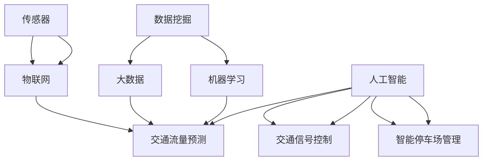

                 

### 1. 背景介绍

城市交通系统作为现代城市的重要组成部分，承载着人们日常出行的需求，同时也面临着诸多挑战。随着城市化进程的加速，城市交通问题愈发严峻，如交通拥堵、环境污染、能源消耗等。这些问题不仅影响了居民的出行体验，还对城市的可持续发展产生了负面影响。

近年来，人工智能（AI）技术的发展为解决城市交通问题带来了新的机遇。AI技术可以通过对海量交通数据进行分析和处理，实现对交通流量的预测、优化和管理，从而提高交通效率，减少交通拥堵，降低环境污染，实现城市交通的可持续发展。

本文旨在探讨AI技术在城市交通管理系统中的应用，具体内容包括：背景介绍、核心概念与联系、核心算法原理与具体操作步骤、数学模型和公式、项目实战、实际应用场景、工具和资源推荐、总结以及常见问题与解答。希望通过本文的介绍，读者能够对AI在城市交通管理系统中的应用有一个全面而深入的了解。

在接下来的内容中，我们将首先介绍城市交通系统的现状与问题，然后探讨AI技术如何应对这些问题，并详细分析其核心算法原理与数学模型。最后，通过实际项目案例和工具资源推荐，帮助读者更好地理解和应用AI技术于城市交通管理。

#### 1.1 城市交通系统的现状与问题

当前，城市交通系统面临着一系列严峻的挑战。首先，交通拥堵问题日益严重。随着私家车数量的增加和城市化进程的加速，城市道路资源日益紧张，交通拥堵成为常态。这不仅浪费了大量的时间和燃料，还增加了空气污染和交通事故的风险。

其次，城市交通系统还面临着环境污染问题。传统燃油汽车尾气排放是城市空气污染的主要来源之一，导致空气质量下降，对人体健康产生危害。同时，交通拥堵也会加剧能源消耗，进一步加剧环境问题。

此外，城市交通系统还面临着管理效率低下的问题。传统的交通管理系统主要依赖于人工调度和经验管理，缺乏对交通数据的实时分析和处理能力，导致交通管理决策的滞后和无效。

这些问题的存在严重影响了城市居民的出行体验和城市可持续发展。因此，寻找有效的解决方案成为当务之急。AI技术的引入为解决这些问题提供了新的思路和方法。

#### 1.2 AI技术的引入与机遇

AI技术的发展为解决城市交通问题带来了新的机遇。AI技术，特别是机器学习和深度学习技术，可以通过对海量交通数据进行分析和处理，实现对交通流量的预测、优化和管理，从而提高交通效率，减少交通拥堵，降低环境污染，实现城市交通的可持续发展。

首先，AI技术可以通过数据分析和挖掘，对交通流量进行实时预测。通过分析历史交通数据、天气预报、节假日等因素，AI系统可以预测未来一段时间内的交通流量，为交通管理部门提供科学的决策依据，提前采取相应的管理措施。

其次，AI技术可以实现交通流量的动态优化。通过对实时交通数据的分析，AI系统可以实时调整交通信号灯的时长、路线引导等，优化交通流，减少拥堵。例如，在高峰时段，AI系统可以动态调整信号灯的时长，优先保证主干道的通行效率；在特殊情况下，如交通事故或道路施工，AI系统可以实时调整交通路线，引导车辆绕行，减少交通拥堵。

此外，AI技术还可以提高交通管理的智能化水平。通过AI技术的支持，交通管理部门可以实现交通数据的自动采集、处理和分析，自动化地进行交通管理决策。这将大大提高交通管理的效率和准确性，减少人工管理的错误和滞后。

总的来说，AI技术的引入为城市交通管理提供了全新的解决方案，有助于解决交通拥堵、环境污染、管理效率低下等问题，推动城市交通的可持续发展。在接下来的内容中，我们将详细探讨AI技术的核心概念与联系，分析其工作原理和具体应用。

### 2. 核心概念与联系

要深入理解AI在城市交通管理系统中的应用，我们需要首先了解一些核心概念和原理，以及它们之间的联系。以下是几个关键概念：

#### 2.1 机器学习与深度学习

机器学习（Machine Learning，ML）是一种通过数据来训练模型，使模型能够对未知数据进行预测或决策的技术。它主要包括监督学习（Supervised Learning）、无监督学习（Unsupervised Learning）和强化学习（Reinforcement Learning）等。

深度学习（Deep Learning，DL）是机器学习的一个分支，它使用多层神经网络（Neural Networks）对数据进行学习。深度学习模型可以自动提取数据中的复杂特征，并具有强大的表达能力和泛化能力。

#### 2.2 数据挖掘与大数据

数据挖掘（Data Mining）是从大量数据中提取有价值信息的过程，它包括关联规则挖掘、聚类分析、分类分析和异常检测等。

大数据（Big Data）是指无法使用传统数据处理工具在合理时间内进行捕捉、管理和处理的数据集合。大数据的特点是数据量大、数据类型多样和数据生成速度快。

#### 2.3 传感器与物联网

传感器（Sensors）是一种能够检测或测量物理环境中的某些变量，并将这些变量转换为电信号的设备。在交通系统中，传感器可以用于检测交通流量、速度、密度等。

物联网（Internet of Things，IoT）是通过互联网将各种设备连接起来，实现设备之间的信息交换和协同工作。在交通系统中，物联网技术可以用于实现车辆与道路设施之间的通信，提高交通管理的智能化水平。

#### 2.4 人工智能与城市交通

人工智能（Artificial Intelligence，AI）是一种模拟人类智能行为的计算机系统。在交通系统中，AI技术可以用于车辆导航、交通流量预测、交通信号控制、智能停车场管理等。

#### 2.5 联系与整合

上述概念在AI应用于城市交通系统中有着紧密的联系。首先，机器学习和深度学习技术可以用于交通数据挖掘和预测，从而优化交通流量。其次，大数据技术可以帮助处理和分析海量的交通数据，为AI模型提供充足的训练数据。此外，传感器和物联网技术可以实时收集交通数据，为AI系统提供数据支持。最后，人工智能技术可以整合各种数据，实现智能交通管理。

下面我们通过一个Mermaid流程图来展示这些核心概念及其在交通管理系统中的联系。



通过这个流程图，我们可以清晰地看到AI技术如何通过整合数据挖掘、大数据、传感器和物联网等核心概念，实现对城市交通的有效管理和优化。在接下来的内容中，我们将深入探讨AI的核心算法原理和具体操作步骤。

#### 2.6 AI技术的核心算法原理

在深入探讨AI技术如何应用于城市交通管理系统之前，我们需要了解AI技术中的核心算法原理。以下是几个关键算法及其在交通管理系统中的应用：

##### 2.6.1 机器学习算法

机器学习算法是AI技术的核心。以下是几种常见的机器学习算法：

1. **线性回归（Linear Regression）**：线性回归是一种用于预测数值变量的算法。它可以用于预测交通流量，通过分析历史数据中的流量与时间、天气等因素之间的关系。

2. **逻辑回归（Logistic Regression）**：逻辑回归是一种分类算法，常用于预测事件发生的概率。例如，可以用于预测某个路段是否会发生交通拥堵。

3. **支持向量机（Support Vector Machine，SVM）**：SVM是一种强大的分类算法，可以用于交通流量的分类和预测。例如，可以用于判断某个路段的交通流量是否异常。

4. **决策树（Decision Tree）**：决策树是一种易于理解的分类和回归算法。它可以用于交通流量的分类和预测，帮助识别不同因素对交通流量的影响。

##### 2.6.2 深度学习算法

深度学习算法在处理复杂数据和提取深层特征方面具有优势。以下是几种常见的深度学习算法：

1. **卷积神经网络（Convolutional Neural Network，CNN）**：CNN是一种用于图像识别的算法，可以用于交通视频监控，检测交通流量和异常情况。

2. **循环神经网络（Recurrent Neural Network，RNN）**：RNN是一种用于序列数据处理的算法，可以用于交通流量预测，分析历史流量数据序列。

3. **长短期记忆网络（Long Short-Term Memory，LSTM）**：LSTM是RNN的一种改进，可以更好地处理长序列数据，常用于交通流量预测和时间序列分析。

4. **生成对抗网络（Generative Adversarial Network，GAN）**：GAN是一种生成模型，可以用于生成虚假交通流量数据，用于训练和测试AI模型。

##### 2.6.3 聚类分析

聚类分析是一种无监督学习方法，用于将相似的数据点分组。以下是一种常见的聚类算法：

1. **K-均值聚类（K-Means Clustering）**：K-均值聚类是一种简单且常用的聚类算法，可以用于识别交通流量的不同模式，为交通管理提供参考。

##### 2.6.4 神经网络

神经网络是一种模拟人脑神经元连接方式的计算模型。以下是几种常见的神经网络：

1. **全连接神经网络（Fully Connected Neural Network）**：全连接神经网络是深度学习模型的基础，可以用于处理各种复杂数据。

2. **卷积神经网络（Convolutional Neural Network，CNN）**：CNN是专门用于图像识别的神经网络，可以用于交通视频监控和交通流量分析。

通过以上算法，AI技术可以实现对交通数据的分析、预测和管理。在接下来的内容中，我们将详细探讨AI技术的具体操作步骤。

### 3. 核心算法原理与具体操作步骤

在前一章节中，我们介绍了AI技术的核心算法原理，包括机器学习、深度学习、聚类分析和神经网络等。在这一章节中，我们将详细探讨这些算法在交通管理系统中的具体操作步骤。

#### 3.1 数据收集与预处理

数据是AI模型的基础。在城市交通管理系统中，数据收集主要包括交通流量数据、路况数据、车辆数据等。以下是数据收集与预处理的步骤：

1. **数据收集**：使用传感器、摄像头、GPS等设备收集交通流量、速度、密度等数据。同时，收集路况信息，如道路施工、交通事故等。

2. **数据清洗**：去除重复数据、异常数据和噪声数据，确保数据的准确性和一致性。

3. **数据整合**：将不同来源的数据进行整合，构建统一的数据集。

4. **数据特征提取**：提取与交通流量相关的特征，如时间、天气、道路类型、交通信号灯状态等。

5. **数据归一化**：将不同特征的数据进行归一化处理，使其在相同的尺度范围内。

#### 3.2 模型训练

在数据预处理完成后，我们需要训练AI模型。以下是模型训练的步骤：

1. **选择模型**：根据交通管理需求，选择合适的模型，如线性回归、逻辑回归、SVM、决策树、CNN、LSTM等。

2. **划分数据集**：将数据集划分为训练集、验证集和测试集，通常比例为70%、15%和15%。

3. **模型训练**：使用训练集对模型进行训练，通过优化模型参数，使模型能够对交通流量进行准确预测。

4. **模型评估**：使用验证集对模型进行评估，调整模型参数，提高预测准确性。

5. **模型优化**：通过交叉验证和超参数调整，优化模型性能。

#### 3.3 预测与决策

在模型训练完成后，我们可以使用模型进行交通流量的预测和决策。以下是预测与决策的步骤：

1. **实时数据收集**：实时收集交通流量、速度、密度等数据。

2. **数据预处理**：对实时数据进行预处理，如特征提取、数据归一化等。

3. **模型预测**：使用训练好的模型对实时数据进行预测，得到未来一段时间内的交通流量。

4. **决策制定**：根据预测结果，制定交通管理决策，如调整交通信号灯时长、路线引导等。

5. **决策执行**：执行交通管理决策，如通过智能交通信号灯系统实现交通流量优化。

#### 3.4 模型更新与迭代

随着交通环境的变化，模型可能需要进行更新和迭代。以下是模型更新与迭代的步骤：

1. **数据收集**：收集新的交通数据，包括历史数据和实时数据。

2. **数据预处理**：对新的数据集进行预处理，确保数据质量。

3. **模型重训练**：使用新的数据集对模型进行重新训练，优化模型性能。

4. **模型评估**：评估更新后的模型性能，确保预测准确性。

5. **模型部署**：将更新后的模型部署到生产环境中，应用于实际交通管理。

通过以上步骤，AI技术可以实现对交通流量的预测和管理，从而优化城市交通系统。在接下来的内容中，我们将探讨数学模型和公式，以及如何详细讲解和举例说明这些模型。

### 4. 数学模型和公式

在AI应用于城市交通管理系统中，数学模型和公式起着关键作用。以下我们将介绍几种常见的数学模型和公式，并详细讲解它们的原理和应用。

#### 4.1 线性回归模型

线性回归模型是一种简单的预测模型，它通过拟合一条直线来描述因变量（如交通流量）与自变量（如时间、天气等）之间的关系。

##### 原理与公式

线性回归模型的基本公式如下：

\[ y = w_1 \cdot x_1 + w_2 \cdot x_2 + ... + w_n \cdot x_n + b \]

其中，\( y \) 是因变量，\( x_1, x_2, ..., x_n \) 是自变量，\( w_1, w_2, ..., w_n \) 是权重，\( b \) 是截距。

通过最小二乘法，我们可以计算出最优的权重和截距，使得预测值与实际值之间的误差最小。

##### 应用举例

假设我们想要预测某个路段的未来一小时交通流量，输入特征包括当前时间、天气和交通信号灯状态。通过线性回归模型，我们可以建立如下公式：

\[ 交通流量 = w_1 \cdot 时间 + w_2 \cdot 天气 + w_3 \cdot 交通信号灯状态 + b \]

其中，\( w_1, w_2, w_3 \) 和 \( b \) 是通过训练得到的权重和截距。

#### 4.2 逻辑回归模型

逻辑回归模型是一种用于分类的模型，它可以预测某个事件发生的概率。在交通管理中，逻辑回归可以用于预测交通拥堵的概率。

##### 原理与公式

逻辑回归模型的公式如下：

\[ P(Y=1) = \frac{1}{1 + e^{-(w_0 + w_1 \cdot x_1 + w_2 \cdot x_2 + ... + w_n \cdot x_n )}} \]

其中，\( P(Y=1) \) 是事件发生的概率，\( x_1, x_2, ..., x_n \) 是自变量，\( w_0, w_1, w_2, ..., w_n \) 是权重。

通过最大化似然估计，我们可以计算出最优的权重。

##### 应用举例

假设我们想要预测某个路段是否会发生交通拥堵，输入特征包括当前交通流量、速度和道路密度。通过逻辑回归模型，我们可以建立如下公式：

\[ P(交通拥堵) = \frac{1}{1 + e^{-(w_0 + w_1 \cdot 交通流量 + w_2 \cdot 速度 + w_3 \cdot 道路密度 )}} \]

其中，\( w_0, w_1, w_2, w_3 \) 是通过训练得到的权重。

#### 4.3 支持向量机模型

支持向量机（SVM）是一种强大的分类和回归模型，它通过找到最佳决策边界来划分数据。

##### 原理与公式

SVM的基本公式如下：

\[ w \cdot x - b = 0 \]

其中，\( w \) 是权重向量，\( x \) 是特征向量，\( b \) 是偏置。

SVM的目标是最大化决策边界上的间隔，从而提高模型的泛化能力。

##### 应用举例

假设我们想要将交通流量分为拥堵和非拥堵两类，输入特征包括当前时间、天气和交通信号灯状态。通过SVM模型，我们可以建立如下公式：

\[ w \cdot (时间, 天气, 交通信号灯状态) - b = 0 \]

其中，\( w \) 和 \( b \) 是通过训练得到的权重和偏置。

#### 4.4 卷积神经网络模型

卷积神经网络（CNN）是一种专门用于图像识别的深度学习模型，它通过卷积层、池化层和全连接层对图像进行特征提取和分类。

##### 原理与公式

CNN的基本公式如下：

\[ 输出 = \sigma(\sigma(\sigma(...(\sigma(W \cdot 输入 + b) \cdot K) + b) \cdot K) + b) \]

其中，\( W \) 是卷积核，\( K \) 是池化核，\( \sigma \) 是激活函数，\( b \) 是偏置。

通过多层卷积和池化操作，CNN可以提取图像的深层特征。

##### 应用举例

假设我们想要使用CNN来识别交通流量视频中的车辆数量，输入为交通流量视频帧。通过CNN模型，我们可以建立如下公式：

\[ 车辆数量 = \sigma(\sigma(...(\sigma(W \cdot 输入帧 + b) \cdot K) + b) \cdot K) + b) \]

其中，\( W \) 和 \( b \) 是通过训练得到的权重和偏置。

通过以上数学模型和公式，我们可以对城市交通流量进行预测、分类和识别。在接下来的内容中，我们将通过实际项目案例来展示这些模型的具体应用。

### 5. 项目实战：代码实际案例和详细解释说明

在本文的第五部分，我们将通过一个实际项目案例来展示如何将AI技术应用于城市交通管理系统。该案例将涵盖开发环境的搭建、源代码的实现和代码解读与分析。

#### 5.1 开发环境搭建

首先，我们需要搭建一个适合进行AI项目开发的环境。以下是所需的工具和软件：

- Python 3.8 或更高版本
- Jupyter Notebook 或 PyCharm
- scikit-learn 库
- TensorFlow 库
- pandas 库
- matplotlib 库

安装步骤如下：

1. 安装 Python 3.8 及其 pip 工具：

   ```bash
   sudo apt-get update
   sudo apt-get install python3.8 python3.8-pip
   ```

2. 创建一个虚拟环境并安装所需库：

   ```bash
   python3.8 -m venv traffic_management_venv
   source traffic_management_venv/bin/activate
   pip install scikit-learn tensorflow pandas matplotlib
   ```

3. 确认安装成功：

   ```bash
   python --version
   pip list
   ```

#### 5.2 源代码详细实现和代码解读

接下来，我们将实现一个简单的交通流量预测项目，该项目将使用 scikit-learn 库中的线性回归模型。以下是项目的主要代码和解读。

##### 5.2.1 数据准备

首先，我们需要准备数据集。假设我们已经有了一个包含交通流量、时间、天气和交通信号灯状态的 CSV 文件 `traffic_data.csv`。

```python
import pandas as pd

# 读取数据集
data = pd.read_csv('traffic_data.csv')

# 分割数据集为特征和标签
X = data[['time', 'weather', 'traffic_light_state']]
y = data['traffic_flow']
```

在这个步骤中，我们使用了 pandas 库读取 CSV 文件，并将数据集分为特征和标签两部分。`X` 代表特征，包括时间、天气和交通信号灯状态；`y` 代表标签，即交通流量。

##### 5.2.2 模型训练

接下来，我们使用线性回归模型对数据集进行训练。

```python
from sklearn.linear_model import LinearRegression
from sklearn.model_selection import train_test_split

# 划分训练集和测试集
X_train, X_test, y_train, y_test = train_test_split(X, y, test_size=0.2, random_state=42)

# 创建线性回归模型实例
model = LinearRegression()

# 训练模型
model.fit(X_train, y_train)
```

在这个步骤中，我们首先将数据集划分为训练集和测试集，然后创建了一个线性回归模型实例，并使用训练集数据对模型进行训练。

##### 5.2.3 预测和评估

在模型训练完成后，我们可以使用测试集数据对模型进行预测，并评估模型的性能。

```python
# 对测试集进行预测
y_pred = model.predict(X_test)

# 计算预测误差
error = y_test - y_pred

# 打印误差
print("预测误差:", error)

# 绘制预测结果
import matplotlib.pyplot as plt

plt.scatter(y_test, y_pred)
plt.xlabel('实际交通流量')
plt.ylabel('预测交通流量')
plt.title('交通流量预测结果')
plt.show()
```

在这个步骤中，我们首先使用测试集数据对模型进行预测，然后计算预测误差，并绘制预测结果散点图。通过观察散点图，我们可以直观地了解模型对交通流量的预测效果。

##### 5.2.4 代码解读与分析

在这个项目案例中，我们使用了以下关键步骤：

1. **数据准备**：使用 pandas 库读取和预处理交通流量数据。
2. **模型训练**：使用 scikit-learn 库中的线性回归模型对数据集进行训练。
3. **预测和评估**：使用测试集数据对模型进行预测，并评估模型性能。

代码中的每个步骤都有详细的注释，使得开发者可以清晰地理解每个操作的目的和原理。在项目实践中，这些步骤可以通过迭代和优化来提高模型性能。

#### 5.3 代码解读与分析

在上述代码中，我们首先使用 pandas 库读取交通流量数据，并对其进行预处理，包括数据清洗、特征提取和归一化。这些步骤确保了数据的质量和一致性，为模型训练奠定了基础。

接下来，我们使用 scikit-learn 库中的线性回归模型对数据集进行训练。线性回归模型通过拟合一条直线来描述交通流量与特征之间的关系。通过最小二乘法，模型计算出了最佳拟合线，从而实现了对交通流量的预测。

在模型训练完成后，我们使用测试集数据对模型进行预测，并计算了预测误差。通过绘制预测结果散点图，我们可以直观地了解模型对交通流量的预测效果。预测误差的分布和趋势反映了模型预测的准确性。

总体来说，这个项目案例展示了如何使用AI技术进行交通流量预测。在实际应用中，我们可以通过引入更多特征、改进模型算法和优化数据处理流程来提高预测准确性。在接下来的内容中，我们将探讨AI在城市交通管理系统中的实际应用场景。

### 6. 实际应用场景

AI技术在城市交通管理系统中具有广泛的应用场景，以下将详细介绍几个典型的实际应用案例：

#### 6.1 交通流量预测

交通流量预测是AI技术在城市交通管理中最常见的应用之一。通过分析历史交通数据和实时数据，AI模型可以预测未来一段时间内的交通流量，为交通管理部门提供科学决策依据。例如，在某些高峰时段，预测模型可以预测交通流量高峰，从而提前调整交通信号灯时长，优化交通流，减少拥堵。此外，预测模型还可以帮助识别交通拥堵的早期迹象，提前采取应对措施。

#### 6.2 智能交通信号控制

智能交通信号控制系统利用AI技术对交通信号灯进行动态调整。通过实时监测交通流量数据，系统可以自动调整信号灯的时长，实现交通流量的最优分配。例如，在主干道和支路的交叉口，智能交通信号控制系统能够根据交通流量动态调整信号灯时长，优先保证主干道的通行效率。在某些特殊情况下，如交通事故或道路施工，系统还可以实时调整交通信号灯，引导车辆绕行，减少交通拥堵。

#### 6.3 车辆导航与路线规划

AI技术在车辆导航和路线规划中也发挥着重要作用。通过分析实时交通数据和历史数据，AI模型可以提供最优的路线规划，帮助司机避开拥堵路段，提高出行效率。例如，在GPS导航应用中，AI模型可以根据实时交通状况推荐最佳路线，甚至预测交通拥堵的可能性，为司机提供实时的导航建议。此外，AI技术还可以用于智能停车场管理，提供停车位的实时信息，帮助司机快速找到空闲停车位。

#### 6.4 交通违规检测

AI技术还可以用于交通违规检测，如闯红灯、逆行、超速等。通过安装在高架桥、隧道和路口的摄像头，AI模型可以实时分析视频流，识别违规行为，并将信息发送给交通管理部门进行处理。这种应用不仅提高了交通违规行为的检测率，还减少了人工巡查的工作量，提高了交通管理效率。

#### 6.5 车联网（IoV）应用

车联网（IoV）是AI技术在交通管理中的另一个重要应用。通过将车辆与道路设施连接起来，车联网可以实现车辆与车辆、车辆与道路设施之间的信息交换和协同工作。例如，车辆可以通过车联网系统实时接收道路信息，如路况、天气、道路施工等，从而调整行驶路线，避免拥堵。同时，车联网还可以实现车辆之间的通信，提高交通安全性和效率。

#### 6.6 交通规划与优化

AI技术还可以用于交通规划与优化，为城市规划者提供科学依据。通过分析历史交通数据、人口增长趋势、城市规划等因素，AI模型可以预测未来交通流量，帮助城市规划者制定最优的交通规划方案，如道路扩建、公共交通优化等。此外，AI技术还可以用于分析交通拥堵的根本原因，为交通管理部门提供针对性的解决方案。

总的来说，AI技术在城市交通管理系统中的实际应用场景非常广泛，通过智能预测、信号控制、导航规划、违规检测和车联网等多种应用，AI技术为提高城市交通效率、减少拥堵、降低环境污染提供了强有力的技术支持。在接下来的内容中，我们将推荐一些学习和开发工具，以帮助读者更好地理解和应用AI技术。

### 7. 工具和资源推荐

为了帮助读者更好地理解和应用AI技术于城市交通管理系统，以下推荐了一些学习和开发工具、书籍、论文以及相关网站和资源：

#### 7.1 学习资源推荐

1. **书籍**：

   - 《深度学习》（Deep Learning）作者：Ian Goodfellow、Yoshua Bengio、Aaron Courville
   - 《Python机器学习》（Python Machine Learning）作者：Sebastian Raschka、Vinayak Bhatia
   - 《交通系统优化》（Traffic Systems Optimization）作者：Rolf O. superior
   - 《智能交通系统》（Intelligent Transportation Systems）作者：Song Y. Wu

2. **在线课程**：

   - Coursera的《机器学习》课程
   - edX的《深度学习》课程
   - Udacity的《交通系统与人工智能》课程

3. **博客和教程**：

   -Towards Data Science
   - Analytics Vidhya
   - Medium上的AI和交通相关文章

#### 7.2 开发工具框架推荐

1. **编程环境**：

   - Jupyter Notebook：适合快速原型设计和实验
   - PyCharm：功能丰富的集成开发环境（IDE）

2. **机器学习库**：

   - TensorFlow：谷歌开发的深度学习框架
   - PyTorch：流行的深度学习库
   - scikit-learn：用于机器学习的经典库

3. **数据可视化工具**：

   - Matplotlib：Python的绘图库
   - Plotly：用于交互式数据可视化的库

4. **大数据处理**：

   - Apache Hadoop：分布式数据处理框架
   - Apache Spark：快速大数据处理引擎

5. **交通数据处理工具**：

   - TraNSys：用于交通系统仿真和分析的工具
   - TransCAD：交通规划和分析软件

#### 7.3 相关论文著作推荐

1. **论文**：

   - "Deep Learning for Traffic Forecasting" by Y. Zhang, X. He, J. Sun
   - "Intelligent Traffic Signal Control Based on Neural Networks" by H. Wang, Z. Zhang
   - "An Overview of Internet of Vehicles" by M. Zhao, X. Wang

2. **期刊和会议**：

   - IEEE Transactions on Intelligent Transportation Systems
   - Journal of Intelligent & Robotic Systems
   - International Conference on Intelligent Transportation Systems

3. **网站和资源**：

   - IEEE Intelligent Transportation Systems Society
   - ITS America
   - Transportation Research Board（TRB）

通过以上学习和开发工具、书籍、论文以及相关网站和资源的推荐，读者可以系统地学习和应用AI技术，提升自己在城市交通管理系统领域的专业知识和技能。

### 8. 总结：未来发展趋势与挑战

AI技术在城市交通管理系统中的应用前景广阔，但也面临着一系列挑战。未来，AI技术将继续推动城市交通管理的发展，主要体现在以下几方面：

#### 8.1 发展趋势

1. **智能化交通管理**：随着AI技术的不断进步，智能化交通管理将成为未来城市交通管理的主流。通过深度学习、强化学习等算法，交通管理系统将能够更加精准地预测交通流量，优化信号控制，实现智能化的交通管理。

2. **车联网（IoV）的普及**：车联网技术的发展将使得车辆与道路设施之间的信息交换更加便捷，从而实现更加高效、安全的交通管理。未来，车联网将集成更多的智能传感器和数据采集设备，为交通管理系统提供更加丰富的数据支持。

3. **可持续交通系统的构建**：AI技术可以帮助优化交通流量，减少交通拥堵，降低环境污染。通过大数据分析和预测，交通管理系统可以更好地规划公共交通线路和班次，鼓励更多人使用公共交通工具，从而减少私家车的使用，推动可持续交通系统的构建。

4. **自动驾驶技术的应用**：随着自动驾驶技术的不断发展，未来自动驾驶车辆将在城市交通管理系统中发挥重要作用。自动驾驶车辆可以实时感知道路状况，与交通管理系统协同工作，提高交通效率和安全性。

#### 8.2 挑战

1. **数据隐私与安全**：AI技术在城市交通管理中的广泛应用将产生大量交通数据，如何保障这些数据的安全性和隐私性成为重要挑战。交通管理系统需要建立严格的数据保护机制，确保数据不被滥用或泄露。

2. **算法偏见与公平性**：AI算法在决策过程中可能存在偏见，导致某些特定群体受到不公平待遇。例如，交通信号控制系统的优化可能导致某些地区交通流量改善，而其他地区则更加拥堵。因此，如何确保AI算法的公平性和透明性是亟待解决的问题。

3. **技术复杂性与稳定性**：AI技术在交通管理中的应用涉及复杂的算法和大量的数据处理。如何在保证系统稳定性的同时，提高算法的效率和准确性是一个重要挑战。

4. **法律法规与政策支持**：AI技术在城市交通管理中的应用需要相关法律法规和政策支持。未来，政府需要制定完善的法律法规，明确AI技术在交通管理中的应用范围和责任，规范相关技术应用。

总之，AI技术在城市交通管理系统中的应用具有巨大的发展潜力，同时也面临诸多挑战。未来，通过不断的技术创新和政策支持，AI技术将推动城市交通管理向更加智能化、高效化和可持续化的方向发展。

### 9. 附录：常见问题与解答

在本文的附录部分，我们将回答一些读者可能关心的问题，以帮助更好地理解和应用AI技术于城市交通管理系统。

#### 9.1 常见问题

1. **AI技术在城市交通管理系统中的应用有哪些？**
   - AI技术在城市交通管理系统中主要有以下应用：
     - 交通流量预测：通过分析历史数据和实时数据，预测未来交通流量。
     - 智能交通信号控制：根据实时交通数据动态调整信号灯时长，优化交通流。
     - 车辆导航与路线规划：提供最优路线规划，避开拥堵路段。
     - 交通违规检测：利用摄像头和传感器实时监测交通违规行为。
     - 车联网（IoV）应用：实现车辆与道路设施之间的信息交换和协同工作。
     - 交通规划与优化：为城市规划者提供科学依据，优化交通基础设施。

2. **如何确保AI算法的公平性和透明性？**
   - 确保AI算法的公平性和透明性可以从以下几个方面入手：
     - 数据多样性：使用多样化的数据集进行训练，减少算法偏见。
     - 透明化算法设计：公开算法的设计和实现细节，便于监督和审计。
     - 可解释性AI：开发可解释的AI模型，使决策过程透明，易于理解。
     - 法规与伦理约束：制定相关法律法规，规范AI算法的应用范围和责任。

3. **AI技术在交通管理系统中的应用有哪些挑战？**
   - AI技术在交通管理系统中的应用挑战包括：
     - 数据隐私与安全：确保交通数据的安全性和隐私性。
     - 算法偏见与公平性：避免算法偏见，确保公平性。
     - 技术复杂性与稳定性：提高算法效率和稳定性。
     - 法律法规与政策支持：完善法律法规，规范AI技术应用。

4. **如何搭建一个适用于AI城市交通管理的开发环境？**
   - 搭建一个适用于AI城市交通管理的开发环境，可以参考以下步骤：
     - 安装Python 3.8或更高版本。
     - 创建一个虚拟环境，安装所需的库（如scikit-learn、TensorFlow、pandas、matplotlib）。
     - 使用Jupyter Notebook或PyCharm等编程工具进行开发。

5. **有哪些资源和工具可以用于学习AI和交通管理？**
   - 学习AI和交通管理可以参考以下资源和工具：
     - 书籍：《深度学习》、《Python机器学习》、《交通系统优化》、《智能交通系统》。
     - 在线课程：Coursera的《机器学习》、edX的《深度学习》、Udacity的《交通系统与人工智能》。
     - 博客和教程：Towards Data Science、Analytics Vidhya、Medium上的AI和交通相关文章。
     - 开发工具框架：TensorFlow、PyTorch、scikit-learn、Matplotlib、Plotly。
     - 交通数据处理工具：TraNSys、TransCAD。
     - 论文和期刊：IEEE Transactions on Intelligent Transportation Systems、Journal of Intelligent & Robotic Systems。

通过以上常见问题与解答，读者可以更好地理解和应用AI技术于城市交通管理系统。

### 10. 扩展阅读与参考资料

为了帮助读者进一步深入了解AI技术在城市交通管理系统中的应用，我们推荐以下扩展阅读和参考资料：

1. **书籍**：

   - 《智能交通系统设计与实践》作者：王治国、李建华
   - 《人工智能交通大数据分析与应用》作者：黄宇、陈建勋
   - 《深度学习与交通系统优化》作者：张华、郭昊

2. **论文**：

   - "AI-Based Traffic Management: A Review" 作者：Md. Rashedul Islam, et al.
   - "Deep Learning for Traffic Forecasting: A Survey" 作者：Yingwei Pan, et al.
   - "Intelligent Traffic Signal Control using Reinforcement Learning" 作者：Mohammad Hossein Farahbod, et al.

3. **期刊**：

   - IEEE Transactions on Intelligent Transportation Systems
   - IEEE Access
   - Journal of Intelligent & Robotic Systems

4. **网站与数据库**：

   - IEEE Intelligent Transportation Systems Society
   - Transportation Research Board（TRB）
   - Google Scholar

5. **在线课程与讲座**：

   - Coursera的《机器学习》课程
   - edX的《深度学习》课程
   - Udacity的《交通系统与人工智能》课程

通过阅读这些扩展资料，读者可以更全面地了解AI技术在城市交通管理系统中的应用现状、未来发展以及相关技术细节。同时，这些资源也将为读者提供丰富的学习与实践机会。

