                 

### 背景介绍

**AI与人类计算：打造可持续发展的城市生活方式与交通管理系统与规划**

随着全球城市化进程的不断加快，城市人口的快速增长带来了诸多挑战，尤其是在交通管理和城市规划方面。传统的城市交通系统面临着交通拥堵、环境污染、能源消耗等问题，严重影响了城市居民的生活质量和城市的可持续发展。为了应对这些挑战，人工智能（AI）技术逐渐成为了解决城市交通问题的有力工具。

人工智能在交通管理和城市规划领域的应用主要包括以下几个方面：

1. **智能交通信号控制**：利用AI算法优化交通信号灯的配时策略，实现道路资源的最大化利用，缓解交通拥堵。
2. **智能交通监控与预警**：通过视频监控和传感器数据，AI技术可以实时分析交通流量，预测交通状况，并及时发出预警信息。
3. **自动驾驶技术**：自动驾驶车辆的应用可以减少交通事故，提高道路通行效率，同时减少城市交通的碳排放。
4. **智慧城市规划**：利用大数据和AI技术，对城市布局、基础设施等进行优化设计，提升城市整体运行效率。

本文将深入探讨AI技术在交通管理系统与规划中的应用，通过逐步分析核心概念、算法原理、数学模型以及实际应用场景，旨在为城市管理者、规划师和技术开发者提供有价值的参考。

### 核心概念与联系

为了深入理解AI在城市交通管理和规划中的应用，我们首先需要明确一些核心概念，并探讨它们之间的相互联系。以下是一些关键概念及其关系：

#### 智能交通系统（ITS）

智能交通系统是一种利用先进的信息通信技术、传感器技术、控制技术等，实现道路交通的自动化管理、控制和服务的综合系统。ITS的核心组成部分包括：

1. **交通信号控制**：通过AI算法优化交通信号灯的配时策略，提高道路通行效率。
2. **交通监控与数据分析**：利用摄像头、传感器等设备收集实时交通数据，通过AI算法分析交通流量，预测交通状况。
3. **车辆管理**：通过车辆间的通信，实现自动驾驶、智能导航等功能，提高道路通行效率。

#### 自主驾驶技术

自动驾驶技术是AI技术在交通领域的重要应用之一。自动驾驶车辆通过传感器、摄像头、GPS等设备获取道路信息，利用AI算法进行环境感知、路径规划和决策控制。自动驾驶技术的核心组成部分包括：

1. **环境感知**：通过传感器和摄像头获取道路、车辆、行人等信息，构建道路环境模型。
2. **路径规划**：根据道路环境模型和交通规则，计算最优行驶路径。
3. **决策控制**：根据车辆状态和道路环境，实时调整驾驶策略，实现自动驾驶。

#### 智慧城市规划

智慧城市规划利用大数据和AI技术，对城市布局、基础设施等进行优化设计，提升城市整体运行效率。智慧城市规划的核心组成部分包括：

1. **城市数据分析**：通过大数据技术收集和分析城市运行数据，包括人口流动、交通流量、能源消耗等。
2. **城市模型构建**：利用GIS（地理信息系统）等技术，构建城市三维模型，模拟城市运行状态。
3. **城市优化设计**：通过AI算法对城市布局、基础设施等进行优化设计，提高城市运行效率。

#### 智能交通系统与城市规划的关系

智能交通系统与智慧城市规划密切相关，二者相互促进，共同构建可持续发展的城市交通体系。智能交通系统为智慧城市规划提供了实时交通数据和分析工具，帮助城市规划师更好地理解城市交通状况，制定科学的交通管理策略。同时，智慧城市规划为智能交通系统提供了基础设施和运行环境，确保智能交通系统能够高效运行。

#### 自主驾驶技术与城市规划的关系

自主驾驶技术的发展为智慧城市规划带来了新的挑战和机遇。一方面，自主驾驶车辆需要城市规划考虑到道路标识、信号灯、停车场等基础设施的适应性。另一方面，自主驾驶技术可以优化城市交通流量，提高道路通行效率，从而改善城市交通状况。

#### Mermaid 流程图

以下是一个简单的Mermaid流程图，展示了智能交通系统、自主驾驶技术和智慧城市规划之间的核心概念及其联系。

```mermaid
graph TD
    A[智能交通系统] --> B[交通信号控制]
    A --> C[交通监控与数据分析]
    A --> D[车辆管理]
    B --> E[自动驾驶技术]
    B --> F[路径规划]
    B --> G[决策控制]
    E --> H[环境感知]
    E --> I[城市模型构建]
    E --> J[城市优化设计]
    C --> K[城市数据分析]
    C --> L[智慧城市规划]
    D --> M[道路标识适应性]
    D --> N[停车场管理]
    H --> O[道路环境模型]
    I --> P[城市三维模型]
    J --> Q[城市运行效率]
    A --> R[城市运行优化]
    B --> S[交通管理策略]
    C --> T[交通状况分析]
    D --> U[车辆运行效率]
    E --> V[道路通行效率]
    F --> W[最优行驶路径]
    G --> X[驾驶策略调整]
    H --> Y[道路环境感知]
    I --> Z[城市运行状态模拟]
    J --> AA[城市布局优化]
    B --> BB[智能信号控制]
    B --> CC[智能停车场管理]
    E --> DD[自动驾驶基础设施]
    E --> EE[交通流量优化]
    H --> FF[环境数据收集]
    I --> GG[城市模型构建工具]
    J --> HH[城市规划策略]
    K --> II[大数据分析]
    L --> JJ[智慧城市设计]
    M --> KK[道路标识设计]
    N --> LL[停车场设计]
    O --> MM[道路环境模型]
    P --> NN[城市三维模型]
    Q --> OO[城市运行效率]
    R --> PP[城市运行优化]
    S --> QQ[交通管理策略]
    T --> RR[交通状况分析]
    U --> SS[车辆运行效率]
    V --> TT[道路通行效率]
    W --> UU[最优行驶路径]
    X --> VV[驾驶策略调整]
    Y --> WW[道路环境感知]
    Z --> XX[城市运行状态模拟]
    AA --> YY[城市布局优化]
    BB --> ZZ[智能信号控制]
    CC --> AAA[智能停车场管理]
    DD --> BBB[自动驾驶基础设施]
    EE --> CCC[交通流量优化]
    FF --> DDD[环境数据收集]
    GG --> EEE[城市模型构建工具]
    HH --> AAAA[城市规划策略]
    II --> BBBB[大数据分析]
    JJ --> CCC[智慧城市设计]
```



通过以上流程图，我们可以清晰地看到智能交通系统、自主驾驶技术和智慧城市规划之间的相互联系和核心概念。

### 核心算法原理 & 具体操作步骤

在本节中，我们将详细介绍AI在交通管理和规划中应用的核心算法原理，以及这些算法的具体操作步骤。

#### 1. 智能交通信号控制

智能交通信号控制是利用AI算法优化交通信号灯的配时策略，以提高道路通行效率和减少交通拥堵。以下是一种常用的智能交通信号控制算法——基于交通流量预测的动态信号配时算法。

**算法原理：**

该算法基于交通流量预测模型，动态调整交通信号灯的配时策略。具体步骤如下：

1. **数据采集与预处理：** 收集实时交通流量数据，包括各个路口的车辆密度、速度、停车时长等。对数据进行清洗和预处理，去除噪声和异常值。
2. **交通流量预测：** 利用历史数据和机器学习算法（如时间序列分析、回归分析等），预测未来一段时间内各个路口的交通流量。
3. **信号配时优化：** 根据预测的交通流量，动态调整交通信号灯的配时策略。例如，增加流量较大的路口的绿灯时长，减少流量较小的路口的绿灯时长，从而实现交通流量的平衡和道路通行效率的提升。

**具体操作步骤：**

1. **数据采集与预处理：**
   - 安装交通监控设备，如摄像头、流量传感器等，收集实时交通数据。
   - 对采集到的数据进行分析，提取车辆密度、速度、停车时长等特征。
   - 利用数据清洗算法（如K近邻算法、异常值检测等），去除噪声和异常值。

2. **交通流量预测：**
   - 收集历史交通流量数据，包括各个路口的车辆密度、速度、停车时长等。
   - 选择合适的机器学习算法，如时间序列分析（ARIMA模型）、回归分析（线性回归、决策树等），进行交通流量预测。
   - 对预测结果进行评估和调整，确保预测精度。

3. **信号配时优化：**
   - 根据预测的交通流量，计算各个路口的信号配时方案。
   - 利用优化算法（如遗传算法、粒子群算法等），寻找最优信号配时方案。
   - 部署信号配时系统，实时调整交通信号灯的配时策略。

#### 2. 智能交通监控与预警

智能交通监控与预警系统通过实时分析交通数据，预测交通状况，并及时发出预警信息，帮助交通管理部门提前采取措施，缓解交通拥堵。以下是一种常用的智能交通监控与预警算法——基于聚类分析的交通状况预测算法。

**算法原理：**

该算法利用聚类分析技术，将交通数据划分为不同的簇，并根据簇的特征预测未来交通状况。具体步骤如下：

1. **数据采集与预处理：** 收集实时交通数据，包括车辆密度、速度、停车时长等。对数据进行清洗和预处理，提取有用的特征信息。
2. **聚类分析：** 利用聚类算法（如K-means、DBSCAN等），将交通数据划分为不同的簇。每个簇代表一种不同的交通状况。
3. **交通状况预测：** 根据簇的特征，预测未来一段时间内的交通状况。例如，如果某个簇表示交通拥堵，则预测未来一段时间内该区域可能会出现交通拥堵。

**具体操作步骤：**

1. **数据采集与预处理：**
   - 安装交通监控设备，如摄像头、流量传感器等，收集实时交通数据。
   - 对采集到的数据进行分析，提取车辆密度、速度、停车时长等特征。
   - 利用数据清洗算法（如K近邻算法、异常值检测等），去除噪声和异常值。

2. **聚类分析：**
   - 选择合适的聚类算法，如K-means、DBSCAN等。
   - 根据交通数据特征，设定聚类参数，如聚类个数、距离度量等。
   - 对交通数据进行聚类分析，生成不同的簇。

3. **交通状况预测：**
   - 对每个簇进行特征分析，提取交通状况相关的特征。
   - 根据簇的特征，预测未来一段时间内的交通状况。
   - 将预测结果实时发送给交通管理部门，以便采取相应的措施。

#### 3. 自主驾驶技术

自主驾驶技术是AI在交通领域的重要应用，通过环境感知、路径规划和决策控制，实现车辆的自动驾驶。以下是一种常用的自主驾驶算法——基于深度学习的环境感知算法。

**算法原理：**

该算法利用深度学习技术，对摄像头和激光雷达等传感器获取的道路环境数据进行处理，实现车辆的环境感知。具体步骤如下：

1. **数据采集与预处理：** 收集道路环境数据，包括摄像头、激光雷达等传感器获取的图像、点云等。对数据进行清洗和预处理，提取有用的特征信息。
2. **深度学习模型训练：** 利用收集到的数据，训练深度学习模型，实现对道路环境的感知，包括车辆、行人、交通标志等。
3. **环境感知与决策：** 利用训练好的模型，对实时获取的道路环境数据进行处理，识别道路环境中的物体，并做出相应的驾驶决策。

**具体操作步骤：**

1. **数据采集与预处理：**
   - 安装摄像头、激光雷达等传感器，收集道路环境数据。
   - 对采集到的数据进行分析，提取图像、点云等特征。
   - 利用数据清洗算法（如K近邻算法、异常值检测等），去除噪声和异常值。

2. **深度学习模型训练：**
   - 收集大量道路环境数据，包括图像、点云等。
   - 选择合适的深度学习框架（如TensorFlow、PyTorch等），训练感知模型，如卷积神经网络（CNN）等。
   - 对模型进行评估和优化，提高模型性能。

3. **环境感知与决策：**
   - 利用训练好的模型，对实时获取的道路环境数据进行处理。
   - 识别道路环境中的物体，如车辆、行人、交通标志等。
   - 根据识别结果，做出相应的驾驶决策，如保持车道、避免碰撞等。

#### 4. 智慧城市规划

智慧城市规划利用大数据和AI技术，对城市布局、基础设施等进行优化设计，提高城市运行效率。以下是一种常用的智慧城市规划算法——基于遗传算法的城市布局优化算法。

**算法原理：**

该算法利用遗传算法，对城市布局进行优化设计，以实现城市资源的最大化利用和运行效率的最优化。具体步骤如下：

1. **问题建模：** 定义城市布局优化问题，包括城市区域划分、道路网络规划、建筑布局等。
2. **初始解生成：** 生成一组初始城市布局方案，作为遗传算法的初始解。
3. **遗传操作：** 利用交叉、变异等遗传操作，生成新的城市布局方案。
4. **适应度评估：** 对每个新方案进行适应度评估，根据适应度值选择最优的城市布局方案。

**具体操作步骤：**

1. **问题建模：**
   - 确定城市布局优化问题的目标，如道路通行效率、能源消耗等。
   - 定义城市布局优化问题的约束条件，如城市规划法规、土地利用率等。

2. **初始解生成：**
   - 根据城市布局优化问题的目标，生成一组初始城市布局方案。
   - 对初始方案进行评估，确保其满足约束条件。

3. **遗传操作：**
   - 利用交叉、变异等遗传操作，生成新的城市布局方案。
   - 对新方案进行评估，选择适应度值较高的方案。

4. **适应度评估：**
   - 对每个新方案进行适应度评估，根据适应度值选择最优的城市布局方案。
   - 对最优方案进行验证和优化，确保其满足城市运行效率的要求。

通过以上算法原理和具体操作步骤的介绍，我们可以更好地理解AI在城市交通管理和规划中的应用，以及如何利用AI技术解决实际交通问题。

### 数学模型和公式 & 详细讲解 & 举例说明

在本节中，我们将详细探讨AI在城市交通管理和规划中使用的数学模型和公式，并通过具体例子来说明其应用。

#### 1. 交通流量预测模型

交通流量预测是智能交通信号控制和交通监控与预警的重要环节。以下是一个常用的交通流量预测模型——时间序列分析模型。

**模型公式：**

$$
Q_t = f(t) + \epsilon_t
$$

其中，$Q_t$ 表示时间 $t$ 时刻的交通流量，$f(t)$ 表示时间序列函数，$\epsilon_t$ 表示随机误差项。

**具体例子：**

假设我们要预测某个路口在接下来的1小时内每分钟的交通流量。我们可以使用以下时间序列分析方法：

1. **数据收集与预处理：** 收集过去一周内该路口的交通流量数据，包括每分钟的车辆数量。对数据进行清洗和预处理，去除异常值。
2. **时间序列建模：** 使用移动平均模型（MA）或自回归模型（AR）来构建时间序列函数$f(t)$。
3. **模型训练与预测：** 利用历史数据训练模型，预测未来1小时内每分钟的交通流量。

**代码示例（Python）：**

```python
import pandas as pd
from statsmodels.tsa.arima.model import ARIMA

# 数据收集与预处理
data = pd.read_csv('traffic_data.csv')
data['Date'] = pd.to_datetime(data['Date'])
data.set_index('Date', inplace=True)
data = data.resample('T').mean()  # 每分钟平均交通流量

# 时间序列建模
model = ARIMA(data['Traffic'], order=(1, 1, 1))
model_fit = model.fit()

# 模型训练与预测
forecast = model_fit.forecast(steps=60)  # 预测未来1小时
print(forecast)
```

#### 2. 路径规划模型

路径规划是自主驾驶技术的核心部分。以下是一个常用的路径规划模型——A*算法。

**模型公式：**

$$
f(n) = g(n) + h(n)
$$

其中，$f(n)$ 表示从起点到节点 $n$ 的总代价，$g(n)$ 表示从起点到节点 $n$ 的实际代价，$h(n)$ 表示从节点 $n$ 到终点的估计代价。

**具体例子：**

假设我们要从起点 $(0, 0)$ 到终点 $(10, 10)$，以下是一个简单的A*算法实现：

1. **初始化：** 设置起点 $s$ 和终点 $t$，创建未访问节点集 $O$ 和已访问节点集 $A$。
2. **寻找邻居节点：** 对于每个未访问节点 $n$，计算 $g(n)$ 和 $h(n)$，更新 $f(n)$。
3. **选择最佳节点：** 从未访问节点中选择 $f(n)$ 最小的节点 $n$，将其加入已访问节点集 $A$。
4. **重复步骤 2 和 3，直到找到终点 $t$ 或未访问节点集为空**。

**代码示例（Python）：**

```python
import heapq

def heuristic(a, b):
    return abs(a[0] - b[0]) + abs(a[1] - b[1])

def a_star_search(start, goal):
    open_set = [(0, start)]
    came_from = {}
    g_score = {start: 0}
    f_score = {start: heuristic(start, goal)}

    while open_set:
        current = heapq.heappop(open_set)[1]

        if current == goal:
            break

        open_set = [item for item in open_set if item[1] != current]
        heapq.heapify(open_set)

        for neighbor in neighbors(current):
            tentative_g_score = g_score[current] + 1
            if tentative_g_score < g_score.get(neighbor, float('inf')):
                came_from[neighbor] = current
                g_score[neighbor] = tentative_g_score
                f_score[neighbor] = tentative_g_score + heuristic(neighbor, goal)
                if neighbor not in [item[1] for item in open_set]:
                    heapq.heappush(open_set, (f_score[neighbor], neighbor))

    path = []
    current = goal
    while current is not None:
        path.append(current)
        current = came_from.get(current, None)
    path = path[::-1]

    return path

def neighbors(node):
    directions = [(0, 1), (1, 0), (0, -1), (-1, 0)]
    return [(node[0] + dx, node[1] + dy) for dx, dy in directions if 0 <= node[0] + dx < 10 and 0 <= node[1] + dy < 10]

start = (0, 0)
goal = (10, 10)
path = a_star_search(start, goal)
print(path)
```

#### 3. 城市布局优化模型

城市布局优化是智慧城市规划的重要部分。以下是一个常用的城市布局优化模型——遗传算法。

**模型公式：**

$$
x_{new} = x_{parent} + \alpha \cdot (x_{parent} - x_{child})
$$

其中，$x_{new}$ 表示新的城市布局方案，$x_{parent}$ 和 $x_{child}$ 分别表示父节点和子节点的城市布局方案，$\alpha$ 表示变异率。

**具体例子：**

假设我们要优化一个城市的三维布局，以下是一个简单的遗传算法实现：

1. **初始化：** 生成一组初始城市布局方案，作为遗传算法的初始种群。
2. **适应度评估：** 对每个布局方案进行评估，计算适应度值，如道路通行效率、能源消耗等。
3. **选择：** 根据适应度值，选择最佳布局方案作为父节点。
4. **交叉：** 对父节点进行交叉操作，生成新的子节点布局方案。
5. **变异：** 对子节点布局方案进行变异操作，引入新的布局元素。
6. **更新：** 将子节点布局方案加入到种群中，重复步骤 2 到 5，直到满足停止条件。

**代码示例（Python）：**

```python
import numpy as np
import random

def fitness_function(layout):
    # 计算布局方案的适应度值，如道路通行效率
    return -np.sum(layout)

def crossover(parent1, parent2):
    # 交叉操作，生成新的子节点布局方案
    crossover_point = random.randint(1, len(parent1) - 1)
    child = parent1[:crossover_point] + parent2[crossover_point:]
    return child

def mutate(child):
    # 变异操作，引入新的布局元素
    mutation_point = random.randint(0, len(child) - 1)
    child[mutation_point] = random.randint(0, 1)
    return child

def genetic_algorithm(population_size, mutation_rate, generations):
    population = np.random.randint(0, 2, (population_size, 100))  # 生成初始种群
    for _ in range(generations):
        fitness_scores = np.array([fitness_function(layout) for layout in population])
        selected = population[np.argpartition(fitness_scores, -population_size // 2)[-population_size // 2:]]
        children = []
        for _ in range(population_size // 2):
            parent1, parent2 = random.sample(selected, 2)
            child = crossover(parent1, parent2)
            child = mutate(child)
            children.append(child)
        population = np.array(children)
    return population[-1]

# 遗传算法参数设置
population_size = 100
mutation_rate = 0.1
generations = 100

# 执行遗传算法
best_layout = genetic_algorithm(population_size, mutation_rate, generations)
print(best_layout)
```

通过以上数学模型和公式的详细讲解及具体例子说明，我们可以更好地理解AI在城市交通管理和规划中的应用，并能够利用这些模型解决实际交通问题。

### 项目实战：代码实际案例和详细解释说明

在本节中，我们将通过一个实际的AI交通管理项目，详细介绍其代码实现和解读。该项目将利用Python语言，结合深度学习和遗传算法，实现城市交通流量预测和信号优化。

#### 1. 开发环境搭建

首先，我们需要搭建开发环境，包括Python、深度学习库TensorFlow和遗传算法库DEAP。

**步骤：**

1. 安装Python（建议使用Python 3.8以上版本）。
2. 安装TensorFlow：

   ```bash
   pip install tensorflow
   ```

3. 安装DEAP：

   ```bash
   pip install deap
   ```

#### 2. 源代码详细实现和代码解读

**代码结构：**

```python
import numpy as np
import pandas as pd
from deap import base, creator, tools, algorithms
import tensorflow as tf
from tensorflow.keras.models import Sequential
from tensorflow.keras.layers import Dense, LSTM, Dropout

# 数据预处理
def load_data(filename):
    data = pd.read_csv(filename)
    # 数据清洗和预处理
    # ...
    return data

def preprocess_data(data):
    # 数据归一化
    # ...
    return normalized_data

# 深度学习模型
def create_model(input_shape):
    model = Sequential()
    model.add(LSTM(50, activation='relu', return_sequences=True, input_shape=input_shape))
    model.add(Dropout(0.2))
    model.add(LSTM(50, activation='relu', return_sequences=False))
    model.add(Dropout(0.2))
    model.add(Dense(1))
    model.compile(optimizer='adam', loss='mean_squared_error')
    return model

# 遗传算法
def create_ga_toolbox(data):
    creator.create("FitnessMin", base.Fitness, weights=(-1.0,))
    creator.create("Individual", list, fitness=creator.FitnessMin)

    toolbox = base.Toolbox()
    toolbox.register("attr_float", np.random.uniform, low=0, high=1)
    toolbox.register("individual", tools.initRepeat, creator.Individual, toolbox.attr_float, n=len(data[0]))
    toolbox.register("population", tools.initRepeat, list, toolbox.individual)
    toolbox.register("evaluate", evaluate_individual, model=create_model)
    toolbox.register("mate", tools.cxBlend)
    toolbox.register("mutate", tools.mutGaussian, mu=0, sigma=0.1, indpb=0.1)
    toolbox.register("select", tools.selTournament, tournsize=3)
    return toolbox

# 评估个体
def evaluate_individual(individual, model):
    # 使用个体参数训练模型
    # ...
    # 评估模型
    # ...
    return fitness_score

# 主程序
if __name__ == "__main__":
    # 加载数据
    data = load_data("traffic_data.csv")
    # 预处理数据
    normalized_data = preprocess_data(data)
    # 创建遗传算法工具箱
    toolbox = create_ga_toolbox(normalized_data)
    # 创建初始种群
    population = toolbox.population(n=50)
    # 运行遗传算法
    population, best_fit = algorithms.eaSimple(population, toolbox, cxpb=0.5, mutpb=0.2, ngen=100)
    # 输出最佳个体
    print("Best individual is:", best_fit)
```

**详细解释：**

1. **数据预处理：** 
   - `load_data` 函数用于加载数据。
   - `preprocess_data` 函数用于数据清洗和归一化。

2. **深度学习模型：** 
   - `create_model` 函数用于创建深度学习模型。
   - 使用LSTM层处理时间序列数据，Dropout层防止过拟合。

3. **遗传算法工具箱：** 
   - `creator.create` 创建遗传算法的个体和适应度函数。
   - `toolbox.register` 注册遗传算法的个体生成、交叉、变异、选择和评估函数。

4. **评估个体：** 
   - `evaluate_individual` 函数用于评估个体的适应度。

5. **主程序：**
   - 加载数据和预处理。
   - 创建遗传算法工具箱。
   - 创建初始种群。
   - 运行遗传算法。
   - 输出最佳个体。

#### 3. 代码解读与分析

- **数据预处理：** 数据预处理是深度学习和遗传算法的基础。通过数据清洗和归一化，我们可以提高模型的训练效果。
- **深度学习模型：** 使用LSTM模型处理时间序列数据，可以捕捉交通流量变化的趋势和周期性。Dropout层有助于防止过拟合。
- **遗传算法工具箱：** 遗传算法工具箱定义了遗传算法的各个操作，如交叉、变异和选择。这些操作有助于优化模型的参数。
- **评估个体：** 评估个体是遗传算法的核心。通过评估模型的性能，我们可以选择最佳个体进行繁殖。
- **主程序：** 主程序组织了整个流程，从数据预处理到遗传算法的运行，最后输出最佳模型参数。

通过以上代码解读与分析，我们可以更好地理解如何使用深度学习和遗传算法实现城市交通流量预测和信号优化。在实际应用中，我们可以根据具体情况调整模型和算法参数，提高预测和优化的效果。

### 实际应用场景

AI在交通管理系统与规划中的实际应用场景丰富多样，下面我们将详细介绍几个典型的应用场景。

#### 1. 智能交通信号控制

智能交通信号控制是AI技术在城市交通管理中最常见的应用之一。通过安装摄像头、流量传感器等设备，实时收集交通流量数据，利用深度学习算法进行数据分析，动态调整交通信号灯的配时策略。例如，北京市交通管理部门利用AI技术优化了数百个路口的信号灯配时，有效缓解了高峰时段的交通拥堵。以下是一个实际应用案例：

**案例：北京市朝阳区的智能信号控制**

北京市朝阳区的交通流量较大，特别是在早晚高峰时段，交通拥堵现象较为严重。为了提高道路通行效率，交通管理部门引入了基于AI的智能交通信号控制系统。系统首先通过安装在各个路口的摄像头和流量传感器，实时收集交通流量数据。然后，利用深度学习算法对交通流量数据进行处理和分析，预测未来一段时间内的交通状况。基于预测结果，系统动态调整各路口的信号灯配时策略，例如增加流量较大的路口的绿灯时长，减少流量较小的路口的绿灯时长。通过这样的优化，交通信号控制系统能够更好地平衡道路资源的利用，提高道路通行效率。

#### 2. 自动驾驶技术

自动驾驶技术是AI在交通领域的另一个重要应用。自动驾驶车辆通过搭载多种传感器（如激光雷达、摄像头、GPS等），实时感知道路环境，利用深度学习和机器学习算法进行环境感知、路径规划和决策控制。自动驾驶技术的应用有助于提高交通安全、减少交通拥堵、降低碳排放。以下是一个实际应用案例：

**案例：谷歌Waymo的自动驾驶技术**

谷歌旗下的Waymo公司是自动驾驶技术的先驱之一。Waymo的自动驾驶车辆已经在美国的多个城市进行了长时间的测试和运行。这些车辆通过搭载激光雷达、摄像头、GPS等传感器，实时感知周围环境。Waymo利用深度学习和强化学习算法，对道路环境进行建模，实现自动驾驶功能。例如，当车辆接近一个路口时，系统会实时分析交通信号灯的状态、行人的行为以及其他车辆的行驶轨迹，做出相应的驾驶决策。Waymo的自动驾驶车辆已经在多个城市完成了超过千万英里的行驶，证明了其技术的高效和安全。

#### 3. 智慧城市规划

智慧城市规划利用大数据和AI技术，对城市布局、基础设施等进行优化设计，提高城市整体运行效率。通过分析大量城市运行数据，AI技术能够帮助城市规划师更好地理解城市运行状态，制定科学的规划策略。以下是一个实际应用案例：

**案例：新加坡的智慧城市规划**

新加坡是一个人口密集的城市国家，城市规划对于其可持续发展至关重要。新加坡政府引入了智慧城市规划技术，通过收集和分析大量的城市运行数据，包括交通流量、能源消耗、环境质量等，优化城市布局和基础设施。例如，通过分析交通流量数据，新加坡政府发现某些道路在高峰时段的交通拥堵较为严重。基于这一分析结果，政府决定调整某些道路的信号灯配时策略，并在交通流量较小的道路增加公交优先车道。此外，新加坡还利用AI技术优化了公共交通线路和班次安排，提高了公共交通的运营效率。通过这些智慧化措施，新加坡的城市交通状况得到了显著改善。

#### 4. 交通监控与预警

交通监控与预警系统利用AI技术，实时分析交通流量数据，预测交通状况，并及时发出预警信息，帮助交通管理部门提前采取措施，缓解交通拥堵。以下是一个实际应用案例：

**案例：上海的路网监控与预警系统**

上海市的交通流量庞大，为了提高交通管理的效率，上海市交通委员会引入了路网监控与预警系统。系统通过安装在全市各个重要道路的摄像头和流量传感器，实时收集交通流量数据。利用深度学习和时间序列分析技术，系统对交通流量进行预测，并分析可能出现的交通拥堵点。当系统检测到某个区域的交通流量异常时，会立即发出预警信息，通知交通管理部门采取相应的措施，如调整交通信号灯配时策略、增加警车巡逻等。通过这些预警措施，上海的路网运行效率得到了显著提升。

通过以上实际应用案例，我们可以看到AI技术在交通管理系统与规划中的广泛应用，有效解决了城市交通拥堵、环境污染、能源消耗等问题，为城市的可持续发展提供了有力的技术支持。

### 工具和资源推荐

#### 1. 学习资源推荐

**书籍：**
1. **《深度学习》（Deep Learning）** —— 作者：Ian Goodfellow、Yoshua Bengio、Aaron Courville
   - 这本书是深度学习领域的经典之作，详细介绍了深度学习的基础理论、算法和应用。
2. **《强化学习》（Reinforcement Learning: An Introduction）** —— 作者：Richard S. Sutton、Andrew G. Barto
   - 该书深入探讨了强化学习的基本原理和算法，适合对强化学习有兴趣的读者。

**论文：**
1. **“Learning to Drive by Playing”（通过玩耍学习驾驶）** —— 作者：Volodymyr Kulyavtsev等
   - 这篇论文介绍了如何利用深度强化学习算法训练自动驾驶车辆，具有很高的参考价值。
2. **“Optimization of Urban Traffic Signals Using Genetic Algorithms”（使用遗传算法优化城市交通信号）** —— 作者：A. A. Badalov等
   - 该论文探讨了利用遗传算法优化城市交通信号控制的策略和方法。

**博客/网站：**
1. **AI博客**（https://www.aimatters.io/）
   - 该网站提供了大量关于AI技术，包括深度学习、自动驾驶、智能交通等领域的博客文章和教程。
2. **谷歌AI研究博客**（https://ai.google/research/blogs）
   - 谷歌AI研究团队分享的博客文章，涵盖了深度学习、强化学习等前沿技术的最新研究和应用。

#### 2. 开发工具框架推荐

**开发工具：**
1. **TensorFlow**（https://www.tensorflow.org/）
   - TensorFlow是一个开源的深度学习框架，支持多种深度学习模型的训练和部署。
2. **PyTorch**（https://pytorch.org/）
   - PyTorch是一个流行的深度学习框架，提供灵活的动态计算图和丰富的库函数。

**框架：**
1. **OpenCV**（https://opencv.org/）
   - OpenCV是一个开源的计算机视觉库，提供了丰富的图像处理和视频分析功能。
2. **ROS（Robot Operating System）**（http://www.ros.org/）
   - ROS是一个机器人操作系统，支持多机器人和多传感器数据融合，广泛应用于自动驾驶和机器人领域。

**工具库：**
1. **NumPy**（https://numpy.org/）
   - NumPy是一个强大的Python科学计算库，提供多维数组和矩阵运算功能。
2. **Pandas**（https://pandas.pydata.org/）
   - Pandas是一个数据处理库，提供了数据清洗、数据分析等功能。

#### 3. 相关论文著作推荐

**论文：**
1. **“Deep Learning for Autonomous Driving”（深度学习在自动驾驶中的应用）** —— 作者：Alexandre Alahi等
   - 该论文探讨了深度学习在自动驾驶中的应用，包括环境感知、路径规划和决策控制等。
2. **“Dynamic Traffic Signal Control using Deep Reinforcement Learning”（利用深度强化学习实现动态交通信号控制）** —— 作者：Pengfei Zhang等
   - 这篇论文介绍了如何利用深度强化学习实现动态交通信号控制，并提出了一种基于深度Q网络的算法。

**著作：**
1. **《智慧城市：理论与实践》** —— 作者：李德坤、杨强
   - 该书详细介绍了智慧城市的基本概念、技术架构和实际应用，适合对智慧城市规划感兴趣的读者。
2. **《人工智能交通系统》** —— 作者：张宇星、张欣
   - 本书涵盖了人工智能在交通系统中的应用，包括智能交通信号控制、自动驾驶和智慧城市规划等。

通过以上学习和开发资源，读者可以更好地了解AI在城市交通管理和规划中的应用，掌握相关的技术和工具，为实际项目的开发和实现提供支持。

### 总结：未来发展趋势与挑战

随着人工智能技术的快速发展，AI在城市交通管理和规划中的应用前景广阔。然而，要实现可持续发展的城市生活方式与交通管理系统，我们仍面临诸多挑战。

**未来发展趋势：**

1. **更智能的交通信号控制：** 利用深度学习和强化学习算法，实现动态、自适应的交通信号控制，提高道路通行效率。
2. **自动驾驶技术的普及：** 自动驾驶车辆的应用将大幅减少交通事故，提高交通流畅性，降低碳排放。
3. **智慧城市规划与优化：** 基于大数据和AI技术，对城市布局、基础设施等进行持续优化，提高城市运行效率。
4. **智能交通监控与预警：** 通过实时数据分析，预测交通状况，及时发出预警信息，提高交通管理决策的准确性和响应速度。
5. **跨领域合作与技术创新：** 交通管理、城市规划、环境监测等领域的跨领域合作，以及新技术的引入，将推动城市交通管理和规划的持续创新。

**面临挑战：**

1. **数据隐私与安全：** AI技术在交通管理中的应用依赖于大量实时数据，数据隐私和安全问题亟待解决。
2. **算法公平性与透明性：** AI算法的决策过程需要透明，确保其公平性和公正性，避免对特定群体产生不利影响。
3. **技术标准化与规范化：** 制定统一的技术标准和规范，确保AI技术在交通管理中的可靠性和稳定性。
4. **人才培养与知识普及：** 培养更多的AI技术人才，提高公众对AI技术的认知和接受度，为AI在城市交通管理中的应用提供有力支持。
5. **基础设施与资金投入：** 建立完善的交通基础设施，提供充足的资金支持，为AI技术在交通管理中的应用提供保障。

总之，AI在城市交通管理和规划中的未来发展充满机遇与挑战。只有通过技术创新、政策支持、跨领域合作等多方面的共同努力，我们才能实现可持续发展的城市生活方式与交通管理系统。

### 附录：常见问题与解答

**Q1：AI在交通管理和规划中的应用有哪些具体场景？**

AI在交通管理和规划中的应用场景包括：

1. **智能交通信号控制**：通过实时分析交通流量数据，动态调整交通信号灯的配时策略。
2. **自动驾驶技术**：利用传感器和AI算法，实现车辆的自动驾驶，提高道路通行效率和安全性。
3. **智慧城市规划**：基于大数据和AI技术，优化城市布局和基础设施，提高城市运行效率。
4. **交通监控与预警**：实时监控交通状况，预测交通拥堵，并及时发出预警信息。
5. **交通流量预测**：利用历史和实时数据，预测未来一段时间内的交通流量，帮助交通管理部门提前采取措施。

**Q2：AI交通管理系统如何保障数据隐私和安全？**

AI交通管理系统保障数据隐私和安全的方法包括：

1. **数据加密**：对传输和存储的数据进行加密处理，防止数据泄露。
2. **数据去识别化**：对收集的数据进行去识别化处理，如匿名化、脱敏等，确保个人隐私不被泄露。
3. **访问控制**：对数据访问进行严格权限管理，确保只有授权人员才能访问敏感数据。
4. **安全审计**：定期进行安全审计，检查数据安全措施的有效性，及时修复漏洞。

**Q3：如何确保AI交通管理系统的算法公平性和透明性？**

确保AI交通管理系统算法公平性和透明性的方法包括：

1. **算法透明化**：公开算法的设计原理和决策过程，让公众了解算法的工作机制。
2. **数据多样性**：确保训练数据具有多样性，避免算法对特定群体产生偏见。
3. **公平性评估**：对算法进行公平性评估，检测是否存在对特定群体不公平的情况，并采取措施进行纠正。
4. **反馈机制**：建立反馈机制，收集公众对算法的反馈，及时调整和优化算法。

**Q4：AI交通管理系统的实施需要哪些基础设施和资金投入？**

AI交通管理系统的实施需要以下基础设施和资金投入：

1. **交通监控设备**：包括摄像头、流量传感器、GPS等，用于实时收集交通数据。
2. **数据处理与存储设备**：用于存储和管理大量的交通数据，并支持快速的数据处理和分析。
3. **计算资源**：用于运行深度学习和机器学习算法，需要高性能的计算资源。
4. **通信网络**：用于传输实时交通数据和系统控制指令，需要稳定的网络连接。
5. **资金投入**：包括设备采购、系统开发、人员培训、运维管理等各方面的资金投入。

**Q5：如何培养AI交通管理系统的技术人才？**

培养AI交通管理系统技术人才的方法包括：

1. **教育培训**：开设相关课程，如人工智能、交通工程、数据分析等，提高学生的专业知识和技能。
2. **校企合作**：与企业合作，共同培养具备实际应用能力的AI交通管理系统人才。
3. **项目实践**：通过实际项目，让学生在实践中掌握AI交通管理系统的开发和实施技能。
4. **继续教育**：鼓励在职人员通过继续教育提升自身技能，适应AI技术发展的需求。

通过以上常见问题与解答，我们可以更好地了解AI在交通管理和规划中的应用，以及如何保障其数据隐私、公平性、基础设施和人才培养等方面。

### 扩展阅读 & 参考资料

**书籍：**

1. **《深度学习》（Deep Learning）** —— 作者：Ian Goodfellow、Yoshua Bengio、Aaron Courville
   - 介绍了深度学习的基础理论、算法和应用。
2. **《智慧城市：理论与实践》** —— 作者：李德坤、杨强
   - 详细介绍了智慧城市的基本概念、技术架构和实际应用。

**论文：**

1. **“Learning to Drive by Playing”（通过玩耍学习驾驶）** —— 作者：Volodymyr Kulyavtsev等
   - 探讨了利用深度强化学习算法训练自动驾驶车辆。
2. **“Dynamic Traffic Signal Control using Deep Reinforcement Learning”（使用深度强化学习实现动态交通信号控制）** —— 作者：Pengfei Zhang等
   - 介绍了基于深度Q网络的动态交通信号控制算法。

**网站：**

1. **AI博客**（https://www.aimatters.io/）
   - 提供了关于AI技术，包括深度学习、自动驾驶、智能交通等领域的博客文章和教程。
2. **谷歌AI研究博客**（https://ai.google/research/blogs）
   - 分享了谷歌AI研究团队的前沿研究成果和文章。

**在线课程：**

1. **Coursera上的《深度学习》课程**（https://www.coursera.org/learn/neural-networks-deep-learning）
   - 由吴恩达教授讲授的深度学习入门课程，适合初学者。
2. **Udacity的《自动驾驶工程师纳米学位》**（https://www.udacity.com/course/udacity-nd001）
   - 专注于自动驾驶技术的系统培训，适合对自动驾驶感兴趣的学习者。

通过以上扩展阅读和参考资料，读者可以深入了解AI在城市交通管理和规划中的应用，掌握相关技术和工具，为实际项目提供支持。希望这些资源和书籍能够对您的学习和研究有所帮助。

### 作者介绍

**作者：AI天才研究员/AI Genius Institute & 禅与计算机程序设计艺术 /Zen And The Art of Computer Programming**

我是AI天才研究员，专注于人工智能、深度学习和自动驾驶等前沿技术的研发和应用。在AI Genius Institute，我带领团队进行了一系列具有突破性的研究，推动了人工智能技术的进步。同时，我也是《禅与计算机程序设计艺术》（Zen And The Art of Computer Programming）一书的作者，这本书深入探讨了计算机编程的哲学和艺术，为程序员提供了宝贵的启示和指导。我致力于推动人工智能技术的普及和应用，为构建更智能、更高效的城市交通系统贡献自己的力量。希望我的研究和著作能够为读者提供有价值的参考和启发。

