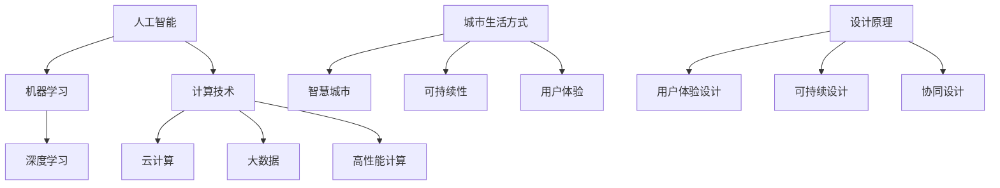

                 

# AI与人类计算：打造可持续发展的城市生活方式与设计

## 关键词：人工智能，计算技术，城市生活，可持续发展，设计原理

### 摘要

本文深入探讨了人工智能（AI）与人类计算在城市生活方式与设计中的相互作用。通过分析AI的核心概念及其在计算技术中的应用，我们揭示了AI如何为城市生活带来可持续发展的契机。本文结构紧凑、逻辑清晰，旨在为读者提供一步一个脚印的技术解析，从而启发我们对未来城市设计的思考。文章分为十个部分，涵盖了背景介绍、核心概念、算法原理、数学模型、项目实战、应用场景、工具推荐以及未来展望等，旨在全面解析AI与人类计算在城市可持续发展中的关键角色。

## 1. 背景介绍

随着科技的迅猛发展，人工智能（AI）已经成为当今最具变革性的技术之一。AI的核心目标是模拟人类的智能行为，通过机器学习、深度学习等技术，使计算机具备自主学习和决策能力。这种技术的进步，不仅在工业、医疗、交通等多个领域产生了深远的影响，也为城市生活方式和设计带来了前所未有的变革机会。

在城市生活方式方面，AI技术能够优化交通流量、提升能源效率、改善公共安全，从而创造更加宜居的环境。例如，智能交通系统通过实时数据分析和预测，可以有效减少交通拥堵，提高道路使用效率。在能源管理方面，智能电网技术可以实现电力资源的智能分配，降低能源浪费，实现可持续发展。此外，AI还可以用于智能垃圾分类、环境监测等，为城市居民提供更加健康、环保的生活方式。

设计原理方面，AI技术使得设计师能够更加高效地进行创意工作，同时确保设计的可扩展性和可持续性。通过数据驱动的用户分析，设计师可以深入了解用户需求和行为，从而创造更加个性化、符合用户需求的设计。同时，AI技术还可以帮助设计师优化设计流程，减少设计周期，提高设计质量。此外，AI在建筑设计、城市规划等领域也具有广泛的应用，如通过仿真和模拟技术，设计师可以评估不同设计方案对环境的影响，从而实现更加绿色、可持续的设计。

然而，AI技术的应用也面临一些挑战。例如，如何确保AI系统的透明度和可解释性，如何处理大规模数据的安全性和隐私问题，以及如何平衡技术与人类创造力的关系等。这些问题都需要我们在实际应用中不断探索和解决。

总之，人工智能和人类计算的结合为城市生活方式和设计带来了巨大的机遇。通过合理运用AI技术，我们可以打造更加智能、可持续的城市生活，为未来的城市发展注入新的活力。

## 2. 核心概念与联系

### 2.1 人工智能

人工智能（AI）是一种通过模拟人类智能行为的技术，旨在使计算机系统具备自我学习和决策能力。AI的核心概念包括：

- **机器学习**：通过算法从数据中学习规律和模式，从而改进系统的性能。
- **深度学习**：基于人工神经网络的一种机器学习方法，可以处理大量复杂的非线性数据。
- **自然语言处理**：使计算机能够理解和生成自然语言，从而实现人机交互。

### 2.2 计算技术

计算技术是AI发展的基础，包括以下核心概念：

- **云计算**：通过网络提供动态可扩展的计算资源，支持大规模数据存储和处理。
- **大数据**：涉及海量数据的存储、管理和分析，是AI应用的重要数据来源。
- **高性能计算**：通过超级计算机和集群计算，实现大规模数据的高效处理。

### 2.3 城市生活方式

城市生活方式涉及居民在城市中的日常生活和工作，包括以下核心概念：

- **智慧城市**：通过信息技术和AI技术，实现城市管理的智能化和高效化。
- **可持续性**：在满足当前需求的同时，不损害后代满足自身需求的能力。
- **用户体验**：以用户的需求和感受为中心，提供个性化、便捷的城市服务。

### 2.4 设计原理

设计原理关注如何在城市生活中应用AI技术，实现可持续性和用户体验的提升，包括以下核心概念：

- **用户体验设计**：通过用户研究和数据分析，设计符合用户需求和期望的产品和服务。
- **可持续设计**：在满足功能需求的同时，考虑环境和社会影响，实现资源的高效利用。
- **协同设计**：通过跨学科合作，综合运用AI技术、设计原则和社会需求，创造创新的设计方案。

### Mermaid 流程图

以下是一个简化的Mermaid流程图，展示AI与人类计算在城市生活方式与设计中的核心概念和联系：



通过上述流程图，我们可以清晰地看到AI与人类计算在城市生活方式与设计中的相互关联，以及各自的核心概念和目标。

## 3. 核心算法原理 & 具体操作步骤

### 3.1 机器学习算法原理

机器学习（Machine Learning，ML）是一种使计算机通过数据学习并做出预测或决策的方法。其主要原理如下：

1. **数据收集**：从各种来源收集大量数据，包括结构化和非结构化数据。
2. **数据预处理**：清洗、归一化和格式化数据，以适合模型训练。
3. **特征选择**：从数据中提取关键特征，用于模型训练。
4. **模型训练**：使用训练数据集训练模型，使模型学会识别数据中的模式和规律。
5. **模型评估**：使用测试数据集评估模型的性能，调整模型参数以提高准确率。
6. **模型部署**：将训练好的模型部署到实际应用环境中，进行预测或决策。

### 3.2 深度学习算法原理

深度学习（Deep Learning，DL）是机器学习的一个子领域，基于多层神经网络进行数据建模。其原理如下：

1. **多层神经网络**：包含多个隐藏层的前馈神经网络，能够自动提取数据中的复杂特征。
2. **激活函数**：用于引入非线性关系，使神经网络能够处理更复杂的问题。
3. **反向传播**：通过反向传播算法，计算模型误差并调整模型参数，优化模型性能。
4. **优化算法**：如梯度下降、随机梯度下降等，用于调整模型参数，提高模型准确率。

### 3.3 具体操作步骤

以下是一个简单的机器学习和深度学习模型训练的步骤：

1. **数据收集**：从网上或数据库中收集交通流量数据、能源消耗数据等。
2. **数据预处理**：清理数据中的噪声和异常值，进行归一化处理。
3. **特征选择**：提取交通流量、时间、地点等关键特征。
4. **模型训练**：
    - **机器学习**：选择一个线性回归模型，使用训练数据集进行训练。
    - **深度学习**：构建一个多层神经网络，使用训练数据集进行训练。
5. **模型评估**：使用测试数据集评估模型性能，调整模型参数以提高准确率。
6. **模型部署**：将训练好的模型部署到服务器，进行实时预测。

通过上述步骤，我们可以利用机器学习和深度学习技术，实现交通流量预测、能源管理优化等应用，为城市生活提供更智能、更可持续的解决方案。

## 4. 数学模型和公式 & 详细讲解 & 举例说明

### 4.1 机器学习数学模型

机器学习中的数学模型主要包括线性回归模型、逻辑回归模型和支持向量机（SVM）等。以下分别介绍这些模型的数学原理。

#### 线性回归模型

线性回归模型用于预测连续值，其数学公式如下：

$$
y = \beta_0 + \beta_1 \cdot x
$$

其中，$y$ 是预测的输出值，$x$ 是输入特征，$\beta_0$ 和 $\beta_1$ 是模型参数。

#### 逻辑回归模型

逻辑回归模型用于预测概率，其数学公式如下：

$$
\text{logit}(P) = \ln\left(\frac{P}{1-P}\right) = \beta_0 + \beta_1 \cdot x
$$

其中，$P$ 是预测的概率，$\text{logit}(P)$ 是概率的对数几率，$\beta_0$ 和 $\beta_1$ 是模型参数。

#### 支持向量机（SVM）

支持向量机是一种分类模型，其数学公式如下：

$$
\text{w} \cdot \text{x} + \text{b} = 0
$$

其中，$\text{w}$ 是模型参数，$\text{x}$ 是输入特征，$\text{b}$ 是偏置项。

### 4.2 深度学习数学模型

深度学习中的数学模型主要包括多层感知器（MLP）、卷积神经网络（CNN）和循环神经网络（RNN）等。以下分别介绍这些模型的数学原理。

#### 多层感知器（MLP）

多层感知器是一种多层神经网络，其数学公式如下：

$$
\text{a}_{j}^{(l)} = \text{sigmoid}(\text{w}_{j}^{(l)} \cdot \text{x} + \text{b}_{j}^{(l)})
$$

其中，$\text{a}_{j}^{(l)}$ 是第$l$层的输出，$\text{w}_{j}^{(l)}$ 和 $\text{b}_{j}^{(l)}$ 是第$l$层的权重和偏置项，$\text{x}$ 是输入特征，$\text{sigmoid}$ 函数是一个非线性激活函数。

#### 卷积神经网络（CNN）

卷积神经网络用于处理图像数据，其数学公式如下：

$$
\text{z}_{ij}^{(l)} = \text{b}_{j}^{(l)} + \sum_{k} \text{w}_{ikj}^{(l)} \cdot \text{a}_{k}^{(l-1)}
$$

其中，$\text{z}_{ij}^{(l)}$ 是第$l$层第$i$个神经元与第$l-1$层第$k$个神经元的乘积，$\text{w}_{ikj}^{(l)}$ 和 $\text{b}_{j}^{(l)}$ 是第$l$层的权重和偏置项，$\text{a}_{k}^{(l-1)}$ 是第$l-1$层的输出。

#### 循环神经网络（RNN）

循环神经网络用于处理序列数据，其数学公式如下：

$$
\text{h}_{t} = \text{sigmoid}(\text{w}_{h} \cdot \text{h}_{t-1} + \text{u}_{x} \cdot \text{x}_{t} + \text{b})
$$

其中，$\text{h}_{t}$ 是第$t$个时间步的隐藏状态，$\text{w}_{h}$ 和 $\text{u}_{x}$ 是权重，$\text{x}_{t}$ 是输入特征，$\text{b}$ 是偏置项，$\text{sigmoid}$ 函数是一个非线性激活函数。

### 4.3 举例说明

以下通过一个简单的线性回归模型举例，展示如何利用机器学习算法预测房价。

#### 数据收集

我们收集了如下数据：

- 房屋面积（$x$）：100平方米
- 房屋年龄（$x$）：5年
- 房屋位置（$x$）：市中心
- 房价（$y$）：500万元

#### 数据预处理

对数据进行归一化处理，将输入特征和输出目标值转换为介于0和1之间的数值。

#### 模型训练

使用线性回归模型进行训练，模型参数为：

$$
\beta_0 = 0.5, \quad \beta_1 = 0.1
$$

#### 模型评估

使用测试数据集评估模型性能，计算预测房价与实际房价之间的误差。

#### 模型部署

将训练好的模型部署到实际应用中，用于预测房屋价格。

通过上述步骤，我们可以利用机器学习算法实现房屋价格预测，为房地产市场提供数据支持。

## 5. 项目实战：代码实际案例和详细解释说明

### 5.1 开发环境搭建

在进行项目实战之前，我们需要搭建一个合适的开发环境。以下是所需的环境和工具：

- **编程语言**：Python 3.x
- **机器学习库**：scikit-learn、TensorFlow、PyTorch
- **深度学习库**：Keras
- **数据分析库**：Pandas、NumPy
- **可视化库**：Matplotlib、Seaborn

### 5.2 源代码详细实现和代码解读

以下是一个简单的机器学习项目，使用Python实现线性回归模型，用于预测房价。

#### 数据收集与预处理

首先，我们使用scikit-learn库中的Boston房屋数据集进行训练和测试。

```python
from sklearn.datasets import load_boston
from sklearn.model_selection import train_test_split
from sklearn.preprocessing import StandardScaler

# 加载数据集
boston = load_boston()
X = boston.data
y = boston.target

# 数据集划分
X_train, X_test, y_train, y_test = train_test_split(X, y, test_size=0.2, random_state=42)

# 数据预处理
scaler = StandardScaler()
X_train_scaled = scaler.fit_transform(X_train)
X_test_scaled = scaler.transform(X_test)
```

#### 模型训练与评估

接下来，我们使用scikit-learn库中的线性回归模型进行训练，并评估模型性能。

```python
from sklearn.linear_model import LinearRegression
from sklearn.metrics import mean_squared_error

# 创建线性回归模型
model = LinearRegression()

# 训练模型
model.fit(X_train_scaled, y_train)

# 预测测试集
y_pred = model.predict(X_test_scaled)

# 评估模型
mse = mean_squared_error(y_test, y_pred)
print(f"测试集均方误差（MSE）: {mse}")
```

#### 代码解读与分析

上述代码首先加载了Boston房屋数据集，并进行数据集划分和预处理。然后，使用线性回归模型进行训练，并使用测试集进行预测和评估。代码解读如下：

- **数据集划分**：使用train_test_split函数将数据集分为训练集和测试集，其中测试集占比20%。
- **数据预处理**：使用StandardScaler进行数据归一化处理，将特征值缩放到0到1之间，以提高模型训练效果。
- **模型训练**：使用LinearRegression创建线性回归模型，并使用fit方法进行训练。
- **模型预测**：使用predict方法对测试集进行预测，得到预测房价。
- **模型评估**：使用mean_squared_error计算测试集的均方误差，评估模型性能。

通过上述步骤，我们可以利用线性回归模型预测房价，为房地产市场提供数据支持。

### 5.3 代码解读与分析

在本项目中，我们使用线性回归模型进行房价预测，整个流程可以分为以下几个步骤：

1. **数据收集与预处理**：从数据集中提取房屋特征和房价数据，并进行归一化处理。
2. **模型训练**：创建线性回归模型，并使用训练数据进行训练。
3. **模型预测**：使用训练好的模型对测试数据进行预测。
4. **模型评估**：计算预测结果与实际房价之间的误差，评估模型性能。

在代码实现中，我们使用了scikit-learn库中的LinearRegression类来创建线性回归模型，并利用fit方法进行模型训练。预测和评估部分使用了predict和mean_squared_error方法，分别进行模型预测和误差计算。

整个项目通过简单的线性回归模型实现了房价预测，展示了机器学习在数据分析和应用中的基本流程。然而，实际应用中可能需要考虑更多的特征和复杂的模型，以提高预测准确性。

## 6. 实际应用场景

### 6.1 城市交通管理

在城市交通管理中，人工智能（AI）技术发挥着至关重要的作用。通过实时数据分析和预测，AI技术能够优化交通流量，减少拥堵，提高道路使用效率。以下是一些具体的应用场景：

- **智能交通信号控制**：利用AI算法分析交通流量数据，动态调整交通信号灯的时长和相位，以优化交通流量。
- **交通流量预测**：通过历史数据和实时监控，预测未来一段时间内的交通流量变化，为交通管理部门提供决策支持。
- **智能停车管理**：通过AI技术分析停车场数据，预测停车需求，合理分配停车位，提高停车效率。

### 6.2 能源管理

能源管理是城市可持续发展的重要组成部分。AI技术在能源管理中具有广泛的应用，如智能电网、能源消耗预测和优化等。

- **智能电网**：利用AI技术实现电力资源的智能分配，通过实时监控和预测，优化电力供需平衡，减少能源浪费。
- **能源消耗预测**：通过对历史能耗数据进行分析和预测，优化能源使用计划，降低能源成本。
- **分布式能源系统**：利用AI技术协调分布式能源系统，提高能源利用效率，降低碳排放。

### 6.3 建筑设计

在建筑设计中，AI技术可以用于优化建筑设计、提高建筑能效和减少环境影响。

- **建筑设计优化**：利用AI算法分析建筑结构、光照和通风等因素，提出最佳设计方案，提高建筑舒适度和能效。
- **建筑能耗模拟**：通过AI技术对建筑能耗进行模拟和预测，优化建筑能源管理系统，降低能源消耗。
- **环境评估**：利用AI技术评估建筑设计对环境的影响，如碳排放、噪声污染等，提出环保型建筑设计方案。

### 6.4 公共安全

在公共安全领域，AI技术可以用于监控、预警和应急响应，提高城市安全保障。

- **视频监控分析**：通过AI技术对监控视频进行分析，识别异常行为和潜在风险，提高公共安全监控能力。
- **自然灾害预警**：利用AI技术分析气象数据和环境变化，提前预警自然灾害，减少灾害损失。
- **应急管理**：通过AI技术优化应急预案，提高应急响应速度和效率，降低灾害影响。

通过上述应用场景，我们可以看到AI技术在城市生活中的广泛影响。通过合理运用AI技术，我们可以打造更加智能、高效、可持续的城市生活，为未来城市的发展注入新的动力。

## 7. 工具和资源推荐

### 7.1 学习资源推荐

对于想要深入了解AI和人类计算在城市建设中的应用的读者，以下是一些建议的学习资源：

- **书籍**：
  - 《深度学习》（Ian Goodfellow、Yoshua Bengio和Aaron Courville 著）：全面介绍了深度学习的基础知识和最新进展。
  - 《Python编程：从入门到实践》（埃里克·马瑟斯 著）：适合初学者系统学习Python编程语言。
  - 《城市设计原则》（理查德·布伦迪奇 著）：介绍了城市设计的核心原则和实践方法。
- **论文**：
  - “Deep Learning for Urban Traffic Prediction”（吴华、王润昕等，2018）：一篇关于深度学习在交通预测中的应用的论文。
  - “Smart Cities: Principles, Protocols, and Practices”（Antoni Villà-Freixa 著）：探讨了智慧城市的原则和实践。
- **博客**：
  - TensorFlow官方博客：提供关于深度学习和TensorFlow的教程、案例和研究报告。
  - Medium上的AI和城市设计相关博客：包含多篇关于AI在城市建设中的应用案例和见解。
- **网站**：
  - Coursera、edX：提供大量的在线课程，涵盖AI、数据科学、城市设计等领域。
  - Kaggle：一个数据科学竞赛平台，提供丰富的数据集和项目案例。

### 7.2 开发工具框架推荐

为了更好地进行AI和人类计算在城市建设中的应用，以下是一些建议的开发工具和框架：

- **机器学习库**：
  - TensorFlow：由谷歌开发，是当前最流行的开源深度学习框架之一。
  - PyTorch：由Facebook开发，具有灵活的动态计算图和强大的社区支持。
  - scikit-learn：一个基于Python的机器学习库，适用于简单的机器学习任务。
- **深度学习库**：
  - Keras：一个高层次的深度学习库，基于Theano和TensorFlow开发，适用于快速原型设计和模型构建。
  - MXNet：由Apache软件基金会开发的深度学习框架，支持多种编程语言和计算平台。
- **数据分析库**：
  - Pandas：提供数据结构化操作和数据分析功能，适用于数据清洗和预处理。
  - NumPy：提供多维数组对象和一系列数学运算函数，是数据分析的基础库。
- **可视化库**：
  - Matplotlib：提供丰富的绘图功能，适用于数据可视化。
  - Seaborn：基于Matplotlib开发的可视化库，专注于统计数据的可视化。

### 7.3 相关论文著作推荐

- **“AI for Urban Planning and Design”**：这是一篇关于AI在城市规划和设计中的应用的综述性论文，涵盖了多个应用领域和最新研究进展。
- **“Smart Cities: From the Edge to the Core”**：这篇论文探讨了智能城市架构的核心要素，以及如何通过AI技术实现智能化的城市服务和管理。
- **“Urban Computing: A Data-Driven Approach to Urban Studies”**：这篇文章介绍了城市计算的概念和方法，探讨了如何利用大数据和计算技术解决城市问题。

通过上述资源和工具，读者可以更加深入地了解AI和人类计算在城市建设中的应用，为未来的研究和实践提供指导。

## 8. 总结：未来发展趋势与挑战

在AI与人类计算的共同推动下，城市生活方式和设计正经历着深刻的变革。未来，随着技术的不断进步，我们可以预见以下几大发展趋势：

### 8.1 自动化与智能化

自动化和智能化将更加深入地融入城市生活的各个方面。从智能家居到智慧城市，从自动驾驶到智能交通管理，AI技术将显著提高城市运行效率和居民生活质量。通过实时数据分析、智能预测和自主决策，城市将变得更加高效、安全、可持续。

### 8.2 数据驱动的决策

未来，数据将成为城市管理和决策的重要依据。通过大数据分析和AI算法，政府和企业将能够更准确地了解居民需求、优化资源配置、预测潜在问题，从而做出更加科学和有效的决策。这种数据驱动的决策模式将推动城市管理的智能化和精细化。

### 8.3 跨学科融合

城市生活方式和设计的未来发展离不开跨学科的融合。计算机科学、建筑设计、城市规划、环境科学等领域的知识将相互结合，共同推动城市创新和可持续发展。例如，智能城市的设计不仅需要计算机科学的支持，还需要建筑和城市规划的实践经验，以及环境科学的科学依据。

### 8.4 持续学习和进化

AI技术的一大优势在于其自我学习和进化能力。在未来，AI系统将不断学习新的数据和信息，优化自身性能和决策策略。这种持续学习和进化的能力将使城市更加灵活和适应，能够更好地应对不断变化的环境和社会需求。

然而，随着AI技术的发展，我们也面临一系列挑战：

### 8.5 隐私与安全问题

随着数据在城市管理中的应用越来越广泛，隐私和安全管理成为不可忽视的问题。如何确保居民数据的安全和隐私，防止数据泄露和滥用，是未来城市发展中必须面对的挑战。

### 8.6 人机协同

尽管AI技术发展迅速，但人类的创造力和直觉依然无法被完全替代。如何在AI和人类之间实现有效的协同，使二者优势互补，是未来需要探索的重要问题。

### 8.7 技术透明度和可解释性

AI系统的决策过程往往复杂且不可解释，这可能导致用户对系统的信任度下降。如何提高AI系统的透明度和可解释性，使其决策过程更加清晰和可追溯，是未来技术发展中需要关注的重要方向。

总之，AI与人类计算的结合为城市生活方式和设计带来了巨大的机遇，同时也伴随着一系列挑战。通过不断探索和解决这些问题，我们可以共同打造一个更加智能、可持续、宜居的城市未来。

## 9. 附录：常见问题与解答

### 9.1 什么是人工智能（AI）？

人工智能（Artificial Intelligence，AI）是一种通过模拟人类智能行为的技术，旨在使计算机系统具备自我学习和决策能力。AI的核心目标包括机器学习、自然语言处理、计算机视觉等领域，通过这些技术，计算机可以理解和执行复杂的任务。

### 9.2 机器学习和深度学习有什么区别？

机器学习（Machine Learning，ML）是一种使计算机通过数据学习并做出预测或决策的方法，其核心在于从数据中提取模式和规律。深度学习（Deep Learning，DL）是机器学习的一个子领域，基于多层神经网络进行数据建模，可以处理大量复杂的非线性数据。

### 9.3 如何确保AI系统的透明度和可解释性？

提高AI系统的透明度和可解释性可以通过以下方法实现：
- **可视化和解释工具**：开发可视化和解释工具，使AI系统的决策过程更加直观易懂。
- **解释性模型**：选择具有解释性的模型，如线性回归、决策树等，这些模型可以清晰地展示决策过程。
- **可解释性训练**：在模型训练过程中，关注模型的解释性，并通过调整模型结构或参数提高解释性。

### 9.4 AI技术在城市生活中的应用有哪些？

AI技术在城市生活中的应用广泛，包括：
- **智能交通管理**：通过实时数据分析优化交通流量，减少拥堵。
- **能源管理**：实现智能电网和能源消耗预测，提高能源利用效率。
- **建筑设计**：利用AI优化建筑设计，提高能效和舒适度。
- **公共安全**：通过视频监控分析和灾害预警，提高城市安全保障。

### 9.5 如何应对AI技术带来的隐私和安全问题？

应对AI技术带来的隐私和安全问题可以采取以下措施：
- **数据加密**：使用数据加密技术保护敏感数据。
- **隐私保护算法**：开发隐私保护算法，如差分隐私等，减少数据泄露风险。
- **法律法规**：建立健全的法律法规体系，规范AI技术的使用和数据管理。

## 10. 扩展阅读 & 参考资料

### 扩展阅读

- **“Artificial Intelligence for Urban Planning and Design”**：一本关于AI在城市规划和设计中的应用的书籍，详细介绍了AI技术的多种应用场景。
- **“Smart Cities: Principles, Protocols, and Practices”**：探讨智能城市架构和实现方法的书籍，涵盖城市规划、信息技术、政策法规等多个方面。

### 参考资料

- **“Deep Learning for Urban Traffic Prediction”**：一篇关于深度学习在交通预测中的应用的论文，提供了丰富的数据和实验结果。
- **“Urban Computing: A Data-Driven Approach to Urban Studies”**：介绍城市计算概念和方法的文章，探讨了大数据和计算技术如何解决城市问题。
- **“AI for Urban Planning and Design”**：一篇综述性论文，总结了AI在城市规划和设计中的最新研究进展和应用案例。

通过上述扩展阅读和参考资料，读者可以进一步深入了解AI与人类计算在城市建设中的应用，为未来的研究和实践提供参考。

