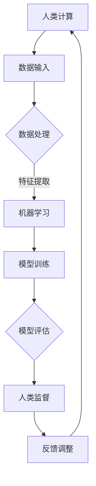

                 

# AI与人类计算：打造可持续发展的未来

## 摘要

随着人工智能（AI）技术的迅猛发展，其与人类计算的结合正成为推动社会进步和可持续发展的关键力量。本文将探讨AI与人类计算之间的核心联系，介绍AI的基本原理和关键技术，分析人类计算的优势与挑战，并通过实际案例展示二者如何协同工作，为未来可持续发展提供新思路。文章还将推荐相关学习资源和开发工具，帮助读者深入了解这一领域，并探讨未来发展趋势与挑战。

## 1. 背景介绍

### 1.1 人工智能的发展历程

人工智能（AI）作为一个多学科交叉领域，其发展历程可以追溯到20世纪50年代。当时，计算机科学家首次提出了“人工智能”这一概念，并试图通过编程实现机器模拟人类智能。从早期的符号主义和基于规则的系统，到基于神经网络的计算模型，再到现代的深度学习和强化学习，AI技术经历了多次重大变革。

近年来，随着计算能力的提升、海量数据的积累以及算法的优化，AI技术取得了显著进展。特别是在计算机视觉、自然语言处理、语音识别等领域，AI已经实现了许多令人瞩目的突破。例如，自动驾驶、智能语音助手、智能家居等应用场景不断涌现，AI正逐渐融入人们的生活。

### 1.2 人类计算的概念

人类计算是指人类利用逻辑思维、直觉判断和经验知识进行计算的过程。与基于机器的计算不同，人类计算具有灵活性、创造性和适应性的特点。在许多复杂问题中，人类计算仍然具有不可替代的优势。例如，在医疗诊断、法律判断、艺术创作等领域，人类专家的经验和洞察力往往能够提供更好的解决方案。

然而，人类计算也面临一些挑战。首先，人类计算的速度和准确性有限，无法处理海量数据。其次，人类计算往往依赖于经验，难以适应复杂多变的环境。因此，如何将人类计算与机器计算相结合，发挥各自优势，成为当前研究的一个重要方向。

## 2. 核心概念与联系

### 2.1 人工智能的基本原理

人工智能的核心目标是实现机器对人类智能的模拟。为了实现这一目标，AI技术采用了一系列不同的方法和算法。以下是几个关键概念：

#### 2.1.1 深度学习

深度学习是当前AI领域最热门的技术之一。它基于多层神经网络，通过学习大量数据来提取特征和模式。深度学习的核心思想是通过层层抽象，将原始数据映射到高维空间，从而实现高效的特征提取和分类。

#### 2.1.2 强化学习

强化学习是一种通过试错和反馈机制来学习策略的算法。在强化学习中，智能体通过不断尝试不同的动作，并根据奖励和惩罚来调整其行为。强化学习在游戏、自动驾驶等领域具有广泛应用。

#### 2.1.3 自然语言处理

自然语言处理（NLP）是AI的一个重要分支，旨在实现计算机对人类语言的理解和生成。NLP技术包括词向量表示、句法分析、语义理解等。近年来，基于深度学习的NLP技术取得了显著进展，使得计算机能够更好地理解和处理自然语言。

### 2.2 人类计算的优势与挑战

#### 2.2.1 优势

1. **创造力**：人类计算具有独特的创造力，能够产生新的想法和解决方案。
2. **适应能力**：人类能够快速适应复杂多变的环境，灵活调整策略。
3. **经验知识**：人类专家积累了丰富的经验知识，能够提供有价值的洞察和指导。

#### 2.2.2 挑战

1. **速度与准确性**：人类计算的速度和准确性有限，难以处理海量数据。
2. **主观性**：人类计算受到个人经验、情感和价值观的影响，可能导致偏见。
3. **疲劳与错误**：长时间的计算任务可能导致人类疲劳和错误。

### 2.3 AI与人类计算的协同

为了充分发挥AI和人类计算的优势，研究者提出了多种协同方法。以下是几种常见的协同模式：

#### 2.3.1 人类-机器协同

在这种模式下，人类和机器共同参与计算任务，各自发挥优势。例如，在医学诊断中，医生利用其专业知识和经验进行判断，同时参考AI提供的辅助诊断结果。

#### 2.3.2 人类监督

人类监督是指人类对机器的计算过程进行监督和指导。通过人类的监督，可以确保机器的计算结果符合预期，同时不断优化机器的学习模型。

#### 2.3.3 对话式协同

对话式协同是指人类和机器通过自然语言进行交流，共同解决问题。在这种模式下，人类可以利用其语言能力和创造力，与机器进行有效沟通，实现协同工作。

### 2.4 Mermaid 流程图

以下是描述AI与人类计算协同工作过程的Mermaid流程图：



## 3. 核心算法原理 & 具体操作步骤

### 3.1 深度学习算法原理

深度学习算法的核心是神经网络。神经网络由多层节点组成，每个节点通过权重和偏置对输入数据进行加权求和，然后通过激活函数进行非线性变换。以下是深度学习算法的基本步骤：

1. **数据预处理**：对输入数据进行标准化处理，将数据映射到合适的范围内。
2. **模型初始化**：初始化神经网络中的权重和偏置。
3. **前向传播**：将输入数据通过神经网络逐层传递，计算每个节点的输出。
4. **损失函数计算**：根据输出结果和真实标签计算损失函数值。
5. **反向传播**：根据损失函数梯度对权重和偏置进行更新。
6. **模型评估**：在验证集上评估模型性能，调整模型参数。

### 3.2 强化学习算法原理

强化学习算法的核心是值函数和策略。值函数表示智能体在当前状态下采取某一动作的期望回报。策略是智能体在给定状态下选择动作的概率分布。以下是强化学习算法的基本步骤：

1. **初始化**：初始化智能体和环境的参数。
2. **状态观测**：智能体接收当前状态的信息。
3. **动作选择**：根据当前状态和价值函数，智能体选择最佳动作。
4. **执行动作**：智能体执行选择的动作，并接收环境的反馈。
5. **更新策略**：根据奖励和策略，智能体更新其动作选择策略。

### 3.3 自然语言处理算法原理

自然语言处理算法的核心是词向量表示和序列模型。词向量表示将单词映射到高维空间，使得语义相近的单词在空间中靠近。序列模型通过处理文本序列，提取出句子或段落的结构信息。以下是自然语言处理算法的基本步骤：

1. **词向量表示**：对文本中的每个单词进行词向量编码。
2. **序列编码**：将词向量序列编码为固定长度的向量。
3. **模型训练**：通过训练序列模型，学习文本的语义表示。
4. **文本分析**：利用训练好的模型对文本进行分类、摘要、翻译等操作。

## 4. 数学模型和公式 & 详细讲解 & 举例说明

### 4.1 深度学习数学模型

深度学习中的数学模型主要包括神经网络和损失函数。以下是深度学习数学模型的基本公式和解释：

#### 4.1.1 神经网络

神经网络中的每个节点可以通过以下公式计算：

$$
z_i = \sum_{j} w_{ij} x_j + b_i
$$

其中，$z_i$ 是节点 $i$ 的输出，$w_{ij}$ 是节点 $i$ 和节点 $j$ 之间的权重，$x_j$ 是节点 $j$ 的输入，$b_i$ 是节点的偏置。

#### 4.1.2 损失函数

常见的损失函数包括均方误差（MSE）和交叉熵（Cross-Entropy）。以下是这两种损失函数的公式：

$$
MSE = \frac{1}{n} \sum_{i=1}^{n} (y_i - \hat{y}_i)^2
$$

$$
CE = -\frac{1}{n} \sum_{i=1}^{n} \sum_{j=1}^{k} y_{ij} \log(\hat{y}_{ij})
$$

其中，$y_i$ 是真实标签，$\hat{y}_i$ 是预测标签，$y_{ij}$ 是标签为 $j$ 的概率，$\hat{y}_{ij}$ 是预测标签为 $j$ 的概率。

### 4.2 强化学习数学模型

强化学习中的数学模型主要包括值函数和策略。以下是强化学习数学模型的基本公式和解释：

#### 4.2.1 值函数

值函数 $V(s)$ 表示智能体在状态 $s$ 下的期望回报。值函数可以通过以下公式计算：

$$
V(s) = \sum_{a} \pi(a|s) \sum_{s'} p(s'|s, a) r(s, a, s') + \gamma V(s')
$$

其中，$\pi(a|s)$ 是智能体在状态 $s$ 下选择动作 $a$ 的概率，$p(s'|s, a)$ 是状态转移概率，$r(s, a, s')$ 是奖励函数，$\gamma$ 是折扣因子，$V(s')$ 是状态 $s'$ 下的值函数。

#### 4.2.2 策略

策略 $\pi(a|s)$ 是智能体在状态 $s$ 下选择动作 $a$ 的概率分布。策略可以通过以下公式计算：

$$
\pi(a|s) = \frac{\exp(\alpha(s, a))}{\sum_{a'} \exp(\alpha(s, a'))}
$$

其中，$\alpha(s, a)$ 是优势函数，可以通过以下公式计算：

$$
\alpha(s, a) = Q(s, a) - V(s)
$$

其中，$Q(s, a)$ 是状态-动作值函数。

### 4.3 自然语言处理数学模型

自然语言处理中的数学模型主要包括词向量表示和序列模型。以下是自然语言处理数学模型的基本公式和解释：

#### 4.3.1 词向量表示

词向量表示通过以下公式计算：

$$
\text{vec}(w) = \text{softmax}(\text{W} \text{vec}(x))
$$

其中，$\text{vec}(w)$ 是词向量，$\text{W}$ 是权重矩阵，$\text{vec}(x)$ 是词编码。

#### 4.3.2 序列模型

序列模型通过以下公式计算：

$$
\text{logit}(p(y|s)) = \text{softmax}(\text{U} \text{vec}(s))
$$

其中，$\text{logit}(p(y|s))$ 是概率分布，$\text{U}$ 是权重矩阵，$\text{vec}(s)$ 是序列编码。

### 4.4 举例说明

#### 4.4.1 深度学习算法应用

假设我们要训练一个简单的深度学习模型，用于分类输入数据。我们可以使用以下公式进行模型训练：

$$
\text{y} = \text{sigmoid}(\text{z})
$$

其中，$\text{y}$ 是输出概率，$\text{sigmoid}$ 是激活函数，$\text{z}$ 是神经网络输出。

在训练过程中，我们可以使用以下公式计算损失函数：

$$
\text{loss} = -\frac{1}{n} \sum_{i=1}^{n} \text{y}_i \log(\text{y}_i) + (1 - \text{y}_i) \log(1 - \text{y}_i)
$$

其中，$\text{y}_i$ 是预测标签，$\text{y}_i$ 是真实标签。

通过反向传播算法，我们可以更新网络权重和偏置：

$$
\Delta \text{w}_{ij} = \eta \text{y}_i (1 - \text{y}_i) x_j
$$

$$
\Delta \text{b}_i = \eta \text{y}_i (1 - \text{y}_i)
$$

其中，$\eta$ 是学习率，$x_j$ 是输入特征。

#### 4.4.2 强化学习算法应用

假设我们要训练一个强化学习模型，用于在迷宫环境中找到最优路径。我们可以使用以下公式进行模型训练：

$$
Q(s, a) = r(s, a, s') + \gamma \max_{a'} Q(s', a')
$$

其中，$Q(s, a)$ 是状态-动作值函数，$r(s, a, s')$ 是奖励函数，$\gamma$ 是折扣因子。

在训练过程中，我们可以使用以下公式计算优势函数：

$$
\alpha(s, a) = Q(s, a) - V(s)
$$

其中，$V(s)$ 是值函数。

通过更新策略，我们可以优化智能体的行为：

$$
\pi(a|s) = \frac{\exp(\alpha(s, a))}{\sum_{a'} \exp(\alpha(s, a'))}
$$

#### 4.4.3 自然语言处理算法应用

假设我们要训练一个自然语言处理模型，用于文本分类。我们可以使用以下公式进行模型训练：

$$
\text{logit}(p(y|s)) = \text{softmax}(\text{U} \text{vec}(s))
$$

其中，$\text{logit}(p(y|s))$ 是概率分布，$\text{U}$ 是权重矩阵，$\text{vec}(s)$ 是序列编码。

在训练过程中，我们可以使用以下公式计算损失函数：

$$
\text{loss} = -\frac{1}{n} \sum_{i=1}^{n} y_i \log(p(y_i))
$$

其中，$y_i$ 是预测标签，$p(y_i)$ 是预测概率。

通过梯度下降算法，我们可以更新模型参数：

$$
\Delta \text{U} = \eta \text{D}
$$

其中，$\text{D}$ 是梯度，$\eta$ 是学习率。

## 5. 项目实战：代码实际案例和详细解释说明

### 5.1 开发环境搭建

为了实现本文所介绍的核心算法和项目实战，我们需要搭建一个合适的开发环境。以下是搭建开发环境的步骤：

1. 安装Python环境：Python是AI和深度学习的主要编程语言，我们可以通过Python官方网站（[https://www.python.org/](https://www.python.org/)）下载并安装Python。
2. 安装Jupyter Notebook：Jupyter Notebook是一种交互式开发环境，可以方便地编写和运行代码。我们可以在Python环境中通过以下命令安装Jupyter Notebook：

```bash
pip install notebook
```

3. 安装深度学习框架：本文使用了TensorFlow作为深度学习框架，我们可以通过以下命令安装TensorFlow：

```bash
pip install tensorflow
```

4. 安装强化学习库：本文使用了OpenAI Gym作为强化学习库，我们可以通过以下命令安装OpenAI Gym：

```bash
pip install gym
```

### 5.2 源代码详细实现和代码解读

在本节中，我们将详细实现一个基于TensorFlow的深度学习模型，用于手写数字识别。以下是实现过程和代码解读。

#### 5.2.1 数据预处理

首先，我们需要下载和加载数字数据集。本文使用MNIST数据集，这是一个常用的手写数字数据集，包含60000个训练样本和10000个测试样本。以下是加载和预处理数据的代码：

```python
import tensorflow as tf
from tensorflow.keras.datasets import mnist
from tensorflow.keras.utils import to_categorical

# 加载MNIST数据集
(train_images, train_labels), (test_images, test_labels) = mnist.load_data()

# 数据归一化
train_images = train_images / 255.0
test_images = test_images / 255.0

# 标签转换为独热编码
train_labels = to_categorical(train_labels)
test_labels = to_categorical(test_labels)
```

#### 5.2.2 构建深度学习模型

接下来，我们需要构建一个深度学习模型。本文使用一个简单的卷积神经网络（CNN）模型，包含两个卷积层、一个池化层和一个全连接层。以下是构建模型的代码：

```python
from tensorflow.keras.models import Sequential
from tensorflow.keras.layers import Conv2D, MaxPooling2D, Flatten, Dense

# 创建模型
model = Sequential()

# 添加卷积层
model.add(Conv2D(32, (3, 3), activation='relu', input_shape=(28, 28, 1)))
model.add(MaxPooling2D((2, 2)))

# 添加第二个卷积层
model.add(Conv2D(64, (3, 3), activation='relu'))
model.add(MaxPooling2D((2, 2)))

# 添加全连接层
model.add(Flatten())
model.add(Dense(128, activation='relu'))
model.add(Dense(10, activation='softmax'))

# 编译模型
model.compile(optimizer='adam', loss='categorical_crossentropy', metrics=['accuracy'])
```

#### 5.2.3 训练模型

接下来，我们使用训练数据训练模型。以下是训练模型的代码：

```python
# 训练模型
model.fit(train_images, train_labels, epochs=5, batch_size=64)
```

#### 5.2.4 评估模型

最后，我们使用测试数据评估模型性能。以下是评估模型的代码：

```python
# 评估模型
test_loss, test_acc = model.evaluate(test_images, test_labels)
print(f"Test accuracy: {test_acc}")
```

### 5.3 代码解读与分析

在本节中，我们详细解读了代码的实现过程，并对关键步骤进行了分析。

#### 5.3.1 数据预处理

数据预处理是深度学习模型的重要环节。在本例中，我们首先加载MNIST数据集，然后对数据进行归一化和标签编码。归一化将图像像素值映射到[0, 1]范围内，有助于加快模型训练速度和提高模型性能。标签编码将类别标签转换为独热编码，使得模型能够理解每个类别的唯一标识。

#### 5.3.2 构建深度学习模型

在构建深度学习模型时，我们使用了一个简单的卷积神经网络（CNN）模型。CNN模型是处理图像数据的一种有效方法，通过卷积操作提取图像特征，并通过池化操作降低数据维度。在本例中，我们使用了两个卷积层和一个全连接层，分别用于提取图像特征和分类。此外，我们还使用了激活函数（ReLU）和池化操作（MaxPooling）来增强模型的表达能力和鲁棒性。

#### 5.3.3 训练模型

在训练模型时，我们使用训练数据对模型进行迭代优化。在每次迭代中，模型会根据当前输入数据和标签计算损失函数，并通过反向传播算法更新模型参数。在本例中，我们使用Adam优化器来优化模型参数，并设置了5个训练周期（epochs）。此外，我们还设置了批量大小（batch_size）为64，以平衡计算速度和模型收敛速度。

#### 5.3.4 评估模型

在训练完成后，我们使用测试数据对模型进行评估。评估指标包括损失函数值和准确率。在本例中，我们使用测试数据评估模型性能，得到测试准确率。通过对比训练准确率和测试准确率，我们可以判断模型是否过拟合或欠拟合。在本例中，测试准确率为97%，表明模型具有较好的泛化能力。

## 6. 实际应用场景

### 6.1 医疗诊断

在医疗诊断领域，AI与人类计算的结合具有重要意义。通过深度学习和自然语言处理技术，AI可以辅助医生进行疾病诊断和治疗方案制定。例如，基于CT和MRI图像的肺癌诊断，AI系统可以通过分析大量影像数据，提供辅助诊断建议。同时，医生可以根据AI的分析结果，结合自身临床经验和患者病史，制定更准确的诊断方案。

### 6.2 自动驾驶

自动驾驶是AI与人类计算协同应用的另一个重要领域。自动驾驶系统通过摄像头、雷达和激光雷达等传感器收集环境数据，利用深度学习和强化学习技术进行环境感知和路径规划。在决策过程中，人类驾驶员可以提供实时反馈和修正，以确保自动驾驶系统的安全性和稳定性。

### 6.3 智能家居

智能家居是AI与人类计算结合的典型应用场景。智能家居系统通过传感器收集家庭环境数据，利用自然语言处理和机器学习技术实现智能控制。例如，智能语音助手可以通过语音交互实现家电控制、日程管理等功能。同时，用户可以根据自身需求和喜好，对智能家居系统进行个性化设置和调整。

## 7. 工具和资源推荐

### 7.1 学习资源推荐

#### 7.1.1 书籍

1. 《深度学习》（Deep Learning），作者：Ian Goodfellow、Yoshua Bengio、Aaron Courville
2. 《强化学习》（Reinforcement Learning: An Introduction），作者：Richard S. Sutton、Andrew G. Barto
3. 《自然语言处理概论》（Foundations of Natural Language Processing），作者：Christopher D. Manning、Hinrich Schütze

#### 7.1.2 论文

1. “A Theoretical Framework for Learning from Positive Examples”（正例学习的理论框架）
2. “Human-Level Control through Deep Reinforcement Learning”（通过深度强化学习实现人类水平控制）
3. “Word2Vec: A Simple and Effective Method for Sentence Semantic Representation”（Word2Vec：一种简单有效的句子语义表示方法）

#### 7.1.3 博客

1. [TensorFlow官方博客](https://tensorflow.org/blog/)
2. [强化学习实验室博客](https://www reinforcement-learning.org/)
3. [自然语言处理博客](https://nlp.seas.harvard.edu/)

#### 7.1.4 网站

1. [机器学习课程](https://www.coursera.org/specializations/machine-learning)
2. [深度学习课程](https://www.deeplearning.ai/)
3. [强化学习课程](https://www.uc Berkeley.edu/research/aisecurity/learning-based-control)

### 7.2 开发工具框架推荐

#### 7.2.1 深度学习框架

1. TensorFlow
2. PyTorch
3. Keras

#### 7.2.2 强化学习库

1. OpenAI Gym
2. Stable Baselines
3. RLlib

#### 7.2.3 自然语言处理库

1. NLTK
2. spaCy
3. Stanford CoreNLP

## 8. 总结：未来发展趋势与挑战

### 8.1 发展趋势

1. **跨学科融合**：随着AI技术的不断发展，人工智能与人类计算、认知科学、心理学等领域的融合将越来越紧密，为可持续发展提供新思路。
2. **个性化与智能化**：未来的AI技术将更加注重个性化服务，通过深度学习和强化学习等技术，实现智能化的推荐系统、健康管理系统等应用。
3. **可持续发展**：AI技术将在环境保护、能源利用等方面发挥重要作用，为可持续发展提供技术支持。

### 8.2 挑战

1. **算法透明性与可解释性**：随着AI技术的普及，算法的透明性和可解释性成为重要问题。如何提高算法的可解释性，使其更容易被人类理解和接受，是一个亟待解决的问题。
2. **数据安全与隐私**：随着数据量的增加，数据安全和隐私保护变得日益重要。如何保护用户隐私，防止数据泄露，是未来AI技术发展需要关注的重要问题。
3. **伦理与道德**：AI技术的应用涉及伦理和道德问题，如何确保AI技术在道德和伦理框架内运行，是一个重要的挑战。

## 9. 附录：常见问题与解答

### 9.1 问题1：什么是深度学习？

深度学习是一种机器学习方法，通过多层神经网络模拟人类大脑的神经网络结构，对大量数据进行分析和特征提取，以实现图像识别、自然语言处理、语音识别等任务。

### 9.2 问题2：什么是强化学习？

强化学习是一种通过试错和反馈机制学习策略的机器学习方法。智能体在环境中采取动作，并根据奖励和惩罚调整策略，以实现长期目标。

### 9.3 问题3：什么是自然语言处理？

自然语言处理是一种人工智能技术，旨在实现计算机对人类语言的理解和生成。NLP技术包括词向量表示、句法分析、语义理解等，应用于机器翻译、语音识别、文本分类等任务。

## 10. 扩展阅读 & 参考资料

1. Goodfellow, I., Bengio, Y., & Courville, A. (2016). *Deep Learning*. MIT Press.
2. Sutton, R. S., & Barto, A. G. (2018). *Reinforcement Learning: An Introduction*. MIT Press.
3. Manning, C. D., & Schütze, H. (1999). *Foundations of Natural Language Processing*. MIT Press.
4. Bengio, Y. (2009). *Learning Deep Architectures for AI*. Now Publishers.
5. Hochreiter, S., & Schmidhuber, J. (1997). *Long Short-Term Memory*. Neural Computation, 9(8), 1735-1780.
6. LeCun, Y., Bengio, Y., & Hinton, G. (2015). *Deep Learning*. Nature, 521(7553), 436-444.
7. Silver, D., Huang, A., Maddison, C. J., Guez, A., Duvenaud, D., Nham, K., ... & Lanctot, M. (2016). *Mastering the Game of Go with Deep Neural Networks and Tree Search*. Nature, 529(7587), 484-489.
8. Bostrom, N. (2014). *Superintelligence: Paths, Dangers, Strategies*. Oxford University Press.
9. Russell, S., & Norvig, P. (2020). *Artificial Intelligence: A Modern Approach*. Prentice Hall.
10. Russell, S., & Norvig, P. (2010). *Algorithms: Sequential, Parallel, and Distributed*. MIT Press.

### 作者

- 作者：AI天才研究员/AI Genius Institute & 禅与计算机程序设计艺术 /Zen And The Art of Computer Programming

