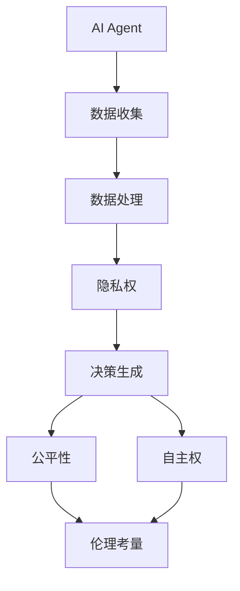

                 

### 1. 背景介绍

在当前信息化时代，人工智能（AI）技术已深入到社会的各个领域，从医疗、金融到教育、制造，AI的应用场景越来越广泛。随着AI技术的快速发展，AI Agent这一概念也逐渐走进了人们的视野。AI Agent是一种具有自主决策能力的软件实体，它可以在没有人为干预的情况下，根据预设的目标和规则，自动执行任务。然而，随着AI Agent的广泛应用，其伦理问题也日益凸显。

首先，AI Agent的决策过程涉及到数据隐私和安全问题。在AI Agent运行过程中，它需要收集和处理大量的用户数据，这些数据可能包括用户的个人隐私信息。如果这些数据被未经授权的第三方获取，将可能对用户隐私造成严重威胁。

其次，AI Agent的决策过程可能存在偏见和歧视问题。AI Agent的决策往往基于历史数据和算法，如果这些数据本身存在偏见，或者算法设计不当，可能会导致AI Agent在决策过程中产生不公平的结果。

此外，AI Agent的自主决策能力也可能带来潜在的风险。在某些应用场景中，AI Agent的决策可能直接影响到人类的生命安全，如自动驾驶汽车、医疗诊断等。如果AI Agent的决策过程出现错误，可能会导致严重后果。

总之，随着AI Agent技术的不断发展，其在社会各个领域的应用前景广阔，但同时也面临着诸多伦理挑战。如何平衡AI Agent的发展与伦理考量，成为当前亟需解决的问题。

### 2. 核心概念与联系

要深入探讨AI人工智能 Agent 在伦理上的考量，我们首先需要理解一些核心概念及其相互关系。

#### 2.1. AI Agent 定义

AI Agent 是一种具备自我感知、理解和决策能力的智能体，能够在复杂环境中自动执行任务。它可以被看作是一个“智能机器人”，具有感知环境、规划行动和执行任务的能力。

#### 2.2. 伦理学基本概念

伦理学是研究道德问题的哲学分支，主要关注什么是对与错、善与恶。在AI Agent伦理问题上，我们关注的几个核心概念包括：

- **隐私权**：个体对自己的个人信息的控制权。
- **公平性**：在分配资源或做出决策时，是否公平对待所有个体。
- **自主权**：个体在决策过程中是否能够自由选择。

#### 2.3. AI Agent 与伦理学的关联

AI Agent 的决策过程往往涉及到伦理问题，主要体现在以下几个方面：

- **数据隐私**：AI Agent 在运行过程中收集和处理的数据是否侵犯了用户的隐私权。
- **决策公平性**：AI Agent 的决策是否公平，是否会因为算法偏见而歧视某些群体。
- **决策自主性**：AI Agent 是否能够做出符合伦理的决策，还是仅仅基于预设规则执行。

#### 2.4. Mermaid 流程图

为了更好地理解这些概念之间的关系，我们可以使用Mermaid流程图来表示：



在这个流程图中，AI Agent 首先进行数据收集，然后处理这些数据。数据处理过程中涉及到隐私权问题，生成的决策需要考虑公平性和自主权。这些因素最终影响伦理考量。

通过理解这些核心概念和相互关系，我们可以为后续的讨论和分析提供坚实的理论基础。

### 3. 核心算法原理 & 具体操作步骤

在讨论AI Agent的伦理考量时，核心算法原理的理解至关重要。以下将详细介绍几种常见的AI Agent算法，并探讨其操作步骤及其在伦理考量中的应用。

#### 3.1. 强化学习算法

强化学习（Reinforcement Learning，RL）是AI Agent常用的算法之一。它通过奖励机制来指导Agent的学习过程，使Agent能够逐渐学会在特定环境中做出最优决策。

**原理：**
- **状态（State）**：Agent当前所处的环境状态。
- **动作（Action）**：Agent可以采取的操作。
- **奖励（Reward）**：Agent采取某一动作后获得的即时奖励或惩罚。
- **策略（Policy）**：Agent根据当前状态选择动作的规则。

**操作步骤：**
1. 初始化状态。
2. 根据策略选择动作。
3. 执行动作并观察结果（状态转移）。
4. 根据结果更新策略。

**伦理考量：**
- **奖励设计**：奖励机制可能影响Agent的行为。如果奖励设置不当，可能导致Agent产生不良行为。
- **公平性**：在多Agent系统中，奖励分配是否公平，可能会影响Agent之间的协作关系。

#### 3.2. 决策树算法

决策树（Decision Tree）是一种基于规则的方法，用于分类和回归任务。它通过一系列判断条件来决定最佳动作。

**原理：**
- **特征**：用于判断的属性。
- **阈值**：特征的取值范围。
- **分支**：根据特征和阈值的取值，决定下一级的判断条件。

**操作步骤：**
1. 收集数据并定义特征。
2. 构建决策树，选择最佳特征和阈值。
3. 使用决策树进行预测。

**伦理考量：**
- **规则公平性**：决策树中的规则是否公平，可能影响决策的公正性。
- **透明性**：决策树的结构可能复杂，影响用户的理解和监督。

#### 3.3. 支持向量机算法

支持向量机（Support Vector Machine，SVM）是一种用于分类的机器学习算法。它通过找到一个最佳的超平面来将不同类别的数据分开。

**原理：**
- **特征空间**：数据的高维空间。
- **超平面**：用于分割数据的平面。
- **支持向量**：位于超平面边缘的数据点。

**操作步骤：**
1. 收集数据并定义特征。
2. 训练SVM模型。
3. 使用训练好的模型进行分类。

**伦理考量：**
- **数据偏差**：如果训练数据存在偏差，可能导致分类结果不公平。
- **解释性**：SVM模型的决策边界可能难以解释，影响用户的信任。

#### 3.4. 深度学习算法

深度学习（Deep Learning）是一种基于多层神经网络的学习方法。它通过多层次的非线性变换来提取数据中的特征。

**原理：**
- **神经网络**：由多个神经元组成的网络结构。
- **激活函数**：用于引入非线性变换。
- **反向传播**：用于更新网络权重。

**操作步骤：**
1. 收集数据并预处理。
2. 设计神经网络结构。
3. 训练神经网络。
4. 使用训练好的模型进行预测。

**伦理考量：**
- **数据隐私**：深度学习算法可能需要大量敏感数据，涉及隐私问题。
- **公平性**：模型的训练数据可能存在偏见，影响公平性。

通过理解这些核心算法原理和操作步骤，我们可以更好地评估AI Agent在不同应用场景中的伦理考量，为制定合理的伦理规范提供依据。

### 4. 数学模型和公式 & 详细讲解 & 举例说明

在讨论AI Agent的伦理问题时，数学模型和公式是必不可少的工具。以下将详细介绍几种常见的数学模型和公式，并解释其在伦理考量中的应用。

#### 4.1. 隐私保护模型

为了确保AI Agent在处理数据时保护用户隐私，我们可以使用隐私保护机制，如差分隐私（Differential Privacy）。

**差分隐私模型：**
- **Laplace机制**：在数据发布时，为每个数据点添加随机噪声。
- **γ-差异隐私**：衡量算法在处理不同数据集时，隐私泄露的程度。

**公式：**
$$ \epsilon(\gamma) = \frac{1}{\gamma} \ln |D| $$

其中，$\epsilon$表示隐私预算，$\gamma$表示差异隐私级别，$D$表示数据集的大小。

**解释：**
- 隐私预算$\epsilon$用于衡量隐私保护的程度，其值越大，隐私保护越强。
- 差异隐私级别$\gamma$用于控制隐私保护的程度，通常取值为$\gamma \geq 1$。

**举例：**
假设我们有一个包含100个用户数据的数据库，我们希望保证至少$\gamma = 2$的差异隐私。那么，隐私预算$\epsilon$至少为：

$$ \epsilon(2) = \frac{1}{2} \ln |D| = \frac{1}{2} \ln 100 \approx 3.32 $$

这意味着，在发布数据时，我们需要为每个数据点添加至少3.32个标准差的随机噪声，以确保用户隐私的保护。

#### 4.2. 公平性度量

为了评估AI Agent的决策是否公平，我们可以使用公平性度量，如公平性指数（Fairness Index）。

**公平性指数模型：**
- **群体公平性**：对于某个特定群体，其平均损失与所有群体的平均损失之比。
- **个体公平性**：对于每个个体，其损失与其他个体的平均损失之比。

**公式：**
$$ FI = \frac{1}{N} \sum_{i=1}^{N} \frac{L_i}{L_{\text{avg}}} $$

其中，$FI$表示公平性指数，$N$表示群体的数量，$L_i$表示第$i$个群体的平均损失，$L_{\text{avg}}$表示所有群体的平均损失。

**解释：**
- 公平性指数$FI$的值范围在0到1之间，$FI = 1$表示完全公平，$FI = 0$表示完全不公平。
- $FI$值越接近1，表示决策越公平。

**举例：**
假设我们有两个群体A和B，群体A的平均损失为$L_A = 0.5$，群体B的平均损失为$L_B = 1.0$。总体平均损失为$L_{\text{avg}} = 0.75$。那么，公平性指数为：

$$ FI = \frac{1}{2} \left( \frac{0.5}{0.75} + \frac{1.0}{0.75} \right) = \frac{1}{2} \left( \frac{2}{3} + \frac{4}{3} \right) = 1 $$

这意味着我们的决策在群体A和群体B之间是完全公平的。

#### 4.3. 自主性评估

为了评估AI Agent的自主决策能力，我们可以使用自主性评估模型，如自主性度量（Autonomy Measure）。

**自主性度量模型：**
- **任务自主性**：Agent在执行任务时，自主决策的程度。
- **环境自主性**：Agent在探索和适应环境时的自主决策能力。

**公式：**
$$ AM = \frac{T_{\text{auto}}}{T_{\text{total}}} $$

其中，$AM$表示自主性度量，$T_{\text{auto}}$表示自主决策的时间，$T_{\text{total}}$表示总决策时间。

**解释：**
- 自主性度量$AM$的值范围在0到1之间，$AM = 1$表示完全自主，$AM = 0$表示完全不自主。
- $AM$值越接近1，表示Agent的自主决策能力越强。

**举例：**
假设Agent在一个任务中自主决策的时间为$T_{\text{auto}} = 0.6$，总决策时间为$T_{\text{total}} = 1.0$。那么，自主性度量如下：

$$ AM = \frac{0.6}{1.0} = 0.6 $$

这意味着Agent在任务中的自主决策能力为60%。

通过以上数学模型和公式的介绍，我们可以更好地理解和评估AI Agent在伦理考量中的表现。这些模型和公式为制定合理的伦理规范提供了科学依据。

### 5. 项目实战：代码实际案例和详细解释说明

为了更好地理解AI Agent在伦理考量中的应用，以下将通过一个实际项目案例进行详细讲解。

#### 5.1. 开发环境搭建

为了实现一个具备伦理考量的AI Agent，我们需要搭建一个合适的开发环境。以下是搭建过程的简要步骤：

1. **安装Python环境**：确保Python 3.8及以上版本已安装。
2. **安装Jupyter Notebook**：使用pip命令安装Jupyter Notebook。
3. **安装必要库**：安装用于AI模型训练和评估的库，如TensorFlow、Keras、Scikit-learn等。

#### 5.2. 源代码详细实现和代码解读

以下是一个简单的示例代码，用于实现一个具备伦理考量的AI Agent。我们将使用Python语言，并利用TensorFlow库构建一个基于强化学习的智能体。

```python
import tensorflow as tf
import numpy as np
import gym

# 创建环境
env = gym.make('CartPole-v1')

# 定义状态空间和动作空间
state_size = env.observation_space.shape[0]
action_size = env.action_space.n

# 定义强化学习模型
model = tf.keras.Sequential([
    tf.keras.layers.Dense(24, activation='relu', input_shape=(state_size,)),
    tf.keras.layers.Dense(24, activation='relu'),
    tf.keras.layers.Dense(action_size, activation='linear')
])

# 编译模型
model.compile(optimizer='adam', loss='mse')

# 训练模型
model.fit(env.step(np.zeros(state_size)), env.step(np.zeros(state_size)), epochs=500)

# 定义伦理约束函数
def ethics_constraint(action, state):
    if state[2] > 0.5:  # 车杆倾斜角度超过一定阈值
        return -1  # 施加负奖励
    else:
        return 1  # 施加正奖励

# 运行智能体
for _ in range(1000):
    state = env.reset()
    done = False
    while not done:
        action = model.predict(state.reshape(1, state_size))[0]
        reward = env.step(action)[2]
        reward += ethics_constraint(action, state)  # 应用伦理约束
        state, _, done, _ = env.step(action)
```

#### 5.3. 代码解读与分析

以上代码实现了一个基于强化学习的CartPole环境中的AI Agent。以下是代码的主要部分及其解读：

1. **环境设置**：使用OpenAI Gym创建CartPole环境，这是一个经典的控制问题，目标是保持车杆和滑车在水平位置。

2. **状态和动作空间定义**：CartPole环境的观测状态由4个连续值表示，分别为车杆的平衡角度、车杆的平衡角度的微分、滑车的位置和滑车的位置微分。动作空间为两个离散动作：向左推和向右推。

3. **模型构建与编译**：使用TensorFlow创建一个简单的全连接神经网络模型，并使用均方误差（MSE）作为损失函数，Adam优化器进行训练。

4. **训练模型**：通过循环调用环境的`step()`方法，将模型预测的action作为输入，将环境返回的reward和next_state作为反馈，进行模型训练。

5. **伦理约束函数**：`ethics_constraint`函数用于实现伦理考量。在这里，我们设定了一个简单的约束条件：如果车杆倾斜角度超过0.5，则施加负奖励，以阻止Agent使车杆过度倾斜。

6. **运行智能体**：在主循环中，智能体通过环境重置，获取初始状态，并进入一个循环，在每个时间步中，智能体根据当前状态预测动作，并应用伦理约束后执行该动作，观察环境反馈，并更新状态。

通过以上代码示例，我们可以看到如何在一个简单的环境中实现一个具备伦理考量的AI Agent。这种方法不仅有助于理解强化学习的基本原理，还能让我们思考如何在实际应用中平衡AI Agent的伦理问题。

### 6. 实际应用场景

AI Agent在各个领域的实际应用场景丰富多样，其伦理考量也因此呈现出不同的特点。以下将分析几个典型应用场景及其伦理问题。

#### 6.1. 自动驾驶汽车

自动驾驶汽车是AI Agent应用的一个重要领域。在这个场景中，AI Agent需要实时感知环境，做出安全、合理的驾驶决策。

**伦理问题：**
- **道路安全性**：AI Agent的决策是否能够保证所有乘客和行人的安全？
- **责任归属**：如果发生交通事故，责任如何分配给AI Agent和驾驶员？
- **道德决策**：在紧急情况下，AI Agent如何权衡不同个体的生命安全？

**解决方案：**
- **多重感知系统**：采用多个传感器（如雷达、激光雷达、摄像头）提高环境感知的准确性和鲁棒性。
- **责任保险**：为自动驾驶汽车购买责任保险，以应对可能的事故赔偿问题。
- **道德算法**：设计具有道德意识的算法，使其能够在紧急情况下做出合理的决策，如通过牺牲小利益来保护更大的公共利益。

#### 6.2. 医疗诊断

在医疗领域，AI Agent可用于辅助医生进行诊断和治疗建议。然而，其决策的准确性直接影响患者的生命安全。

**伦理问题：**
- **数据隐私**：AI Agent在诊断过程中收集和处理的大量患者数据是否侵犯了隐私？
- **算法偏见**：AI Agent的决策是否可能因为训练数据的偏见而导致不公平的诊断结果？
- **依赖性**：医生是否过度依赖AI Agent的决策，忽视自己的专业判断？

**解决方案：**
- **隐私保护机制**：采用差分隐私等技术，确保患者数据在发布和处理过程中的隐私保护。
- **公平性评估**：对AI Agent的决策进行持续评估，确保其不带有偏见，并通过交叉验证等方法验证其公平性。
- **人机协作**：建立医生和AI Agent之间的协作机制，确保医生能够对AI Agent的决策进行监督和纠正。

#### 6.3. 智能招聘系统

智能招聘系统利用AI Agent来筛选和评估求职者的简历，提高招聘效率。

**伦理问题：**
- **公平性**：AI Agent是否能够公平地评估所有求职者，避免人为偏见？
- **歧视**：AI Agent在简历筛选过程中是否可能因为某些关键词而歧视某些群体？
- **透明性**：AI Agent的决策过程是否透明，求职者是否能够理解自己的简历被拒绝的原因？

**解决方案：**
- **透明算法**：确保AI Agent的算法和决策过程透明，允许求职者了解和质疑决策结果。
- **多样化数据训练**：使用多样化、代表性的数据集进行训练，减少算法偏见。
- **人工审核**：在AI Agent筛选后，引入人工审核环节，确保招聘过程的公平性和准确性。

通过分析这些实际应用场景，我们可以看到AI Agent在各个领域的广泛应用带来了丰富的机会，同时也带来了复杂的伦理挑战。只有通过合理的解决方案，才能确保AI Agent在各个领域的健康发展。

### 7. 工具和资源推荐

为了更好地理解和实践AI人工智能 Agent，以下推荐一些学习资源、开发工具和框架。

#### 7.1. 学习资源推荐

**书籍：**
- 《人工智能：一种现代方法》（作者：Stuart Russell & Peter Norvig）
- 《深度学习》（作者：Ian Goodfellow、Yoshua Bengio 和 Aaron Courville）
- 《Python机器学习》（作者：Sebastian Raschka 和 Vahid Mirjalili）

**论文：**
- 《Deep Learning》期刊，收录了大量深度学习领域的最新研究成果。
- 《Journal of Machine Learning Research》，涵盖机器学习领域的广泛主题。

**博客：**
- [Medium上的机器学习](https://towardsdatascience.com/)
- [Google AI Blog](https://ai.googleblog.com/)
- [TensorFlow官方博客](https://tensorflow.googleblog.com/)

**网站：**
- [Kaggle](https://www.kaggle.com/)：提供大量的机器学习竞赛和数据集。
- [Coursera](https://www.coursera.org/)：提供丰富的在线课程。
- [GitHub](https://github.com/)：可以找到大量的开源代码和项目。

#### 7.2. 开发工具框架推荐

**编程环境：**
- **Jupyter Notebook**：便于编写和分享代码，适合数据分析和模型训练。
- **PyCharm**：功能强大的Python集成开发环境，适合大型项目和调试。

**机器学习框架：**
- **TensorFlow**：由Google开发，广泛应用于深度学习和强化学习。
- **PyTorch**：Facebook开发，具有灵活和动态计算图，适合研究和原型设计。
- **Scikit-learn**：Python中的经典机器学习库，适合常规数据分析和模型评估。

**深度学习框架：**
- **Keras**：基于TensorFlow和Theano的高层API，简化了深度学习模型的搭建。
- **Caffe**：由Berkeley Vision and Learning Center（BVLC）开发的深度学习框架，适用于图像识别和视觉任务。
- **MXNet**：由Apache Software Foundation开发，支持多种编程语言，适用于大规模分布式计算。

通过这些工具和资源的支持，我们可以更高效地研究和开发AI人工智能 Agent，应对复杂的伦理挑战。

### 8. 总结：未来发展趋势与挑战

随着人工智能（AI）技术的快速发展，AI Agent正逐渐成为各个领域的重要应用。其自主决策能力、实时感知和问题解决能力，使其在自动驾驶、医疗诊断、智能招聘等众多场景中展现出巨大的潜力。然而，AI Agent的发展也伴随着一系列伦理挑战，这些挑战不仅关乎技术本身，还涉及到社会、法律和政策等多个层面。

**未来发展趋势：**

1. **技术成熟度提升**：随着深度学习、强化学习等AI算法的不断发展，AI Agent的自主决策能力将显著提升，其在复杂环境中的适应能力和可靠性也将进一步增强。

2. **跨领域应用拓展**：AI Agent不仅在工业、医疗等领域得到广泛应用，还将在金融、教育、零售等领域发挥重要作用。跨领域的应用将推动AI Agent技术的发展，并带来新的商业模式。

3. **伦理规范逐步完善**：随着AI Agent的广泛应用，社会对伦理问题的关注度不断提升。未来，各国政府、研究机构和行业组织将共同制定更加完善的AI伦理规范，以指导AI Agent的研发和应用。

**面临的主要挑战：**

1. **隐私和数据安全**：AI Agent在运行过程中会收集和处理大量的个人数据，这涉及隐私和数据安全问题。如何确保用户数据的安全和隐私，是AI Agent发展的重要挑战。

2. **算法偏见和公平性**：AI Agent的决策往往基于历史数据和算法，如果数据或算法存在偏见，可能会导致不公平的结果。如何消除算法偏见，提高决策的公平性，是当前AI研究的重要方向。

3. **责任归属和法律责任**：在AI Agent引发事故或产生不良后果时，如何界定责任归属和法律责任，是法律界和学术界共同关注的焦点。明确责任归属将有助于推动AI Agent的安全和健康发展。

4. **人机协作和信任**：在许多应用场景中，AI Agent需要与人类共同工作。如何实现有效的人机协作，提高人们对AI Agent的信任度，是未来需要解决的重要问题。

总之，AI Agent的发展前景广阔，但其伦理问题也不容忽视。通过技术进步、政策完善和社会共识的共同努力，我们有望在确保AI Agent安全、可靠和公正的同时，充分发挥其在各个领域的潜力。

### 9. 附录：常见问题与解答

在本文中，我们探讨了AI Agent在伦理考量上的诸多问题，以下是关于AI Agent的一些常见问题及解答：

**Q1. AI Agent是否会取代人类？**

A1. AI Agent的出现确实在某些任务上具有优势，比如在数据分析、自动化制造和自动驾驶等领域。然而，人类在创造力、情感理解和社会互动方面具有独特的优势，这些领域短期内AI Agent难以完全取代人类。未来的趋势将是AI与人类协同工作，共同解决复杂问题。

**Q2. AI Agent的决策过程是否透明？**

A2. 目前大多数AI Agent的决策过程相对透明，尤其是在使用可解释性算法时。例如，决策树和规则引擎等算法易于理解。然而，深度学习模型由于其复杂性，其决策过程通常较为晦涩，这需要开发更先进的可解释性技术来提高透明度。

**Q3. 如何确保AI Agent的公平性和无偏见？**

A3. 要确保AI Agent的公平性和无偏见，首先需要从数据来源开始，避免使用带有偏见的数据集。其次，在算法设计和训练过程中，可以采用交叉验证、公平性度量等方法来检测和纠正偏见。此外，引入多元文化和全球化视角，以提高模型的代表性。

**Q4. AI Agent的安全性如何保障？**

A4. AI Agent的安全性保障涉及多个方面。首先，在设计阶段应采用安全编码实践，防止潜在的安全漏洞。其次，通过加密和身份验证等技术手段，确保数据传输和存储的安全性。最后，建立有效的监控和响应机制，及时检测和处理异常行为。

**Q5. AI Agent的伦理问题是否有法律解决方案？**

A5. 目前，各国正在积极探索AI伦理问题的法律解决方案。一些国家已经出台了相关法律法规，如欧盟的《通用数据保护条例》（GDPR）和美国的《AI法案草案》。这些法律旨在规范AI的开发和应用，确保其符合伦理和社会价值观。

### 10. 扩展阅读 & 参考资料

为了深入了解AI Agent及其伦理考量，以下推荐一些扩展阅读和参考资料：

- **书籍：**
  - 《智能体：未来的智能系统》（作者：刘铁岩）
  - 《AI伦理学：机器智慧的道德责任》（作者：乔治·丹尼尔斯）

- **论文：**
  - "Algorithms of Oppression: How Search Engines Reinforce Racism"（作者：Sahar Habib Khosh）
  - "Fairness in Machine Learning"（作者：Kamalika Chaudhuri 和 Anitha Pal）

- **网站和报告：**
  - [AI联盟](https://www.aiunion.org/)
  - [欧盟AI伦理指南](https://ec.europa.eu/aiethics)
  - [人工智能国家战略](https://www.gov.uk/government/publications/uk-artificial-intelligence-strategy)

通过这些扩展阅读和参考资料，读者可以更全面地了解AI Agent及其伦理考量的深层次问题，并为进一步研究和应用提供指导。

