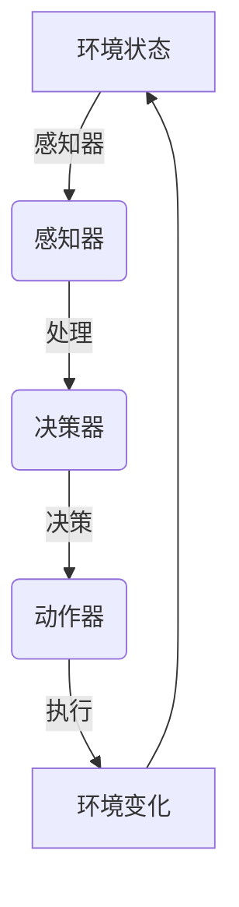

                 

### 文章标题

**AI人工智能 Agent：理解和应用智能体的感知机制**

> **关键词：** 智能体、感知机制、AI、人工智能、深度学习、神经网络、环境交互、自主决策。

> **摘要：** 本文将深入探讨智能体在人工智能中的核心作用，特别是其感知机制。我们将逐步分析智能体如何通过感知环境、处理信息以及做出决策，从而实现智能行为的自动化。文章将涵盖从基本概念到具体算法的全面解析，帮助读者深刻理解智能体在人工智能领域的重要性和应用。

<|assistant|>### 1. 背景介绍

随着人工智能技术的飞速发展，智能体（Agent）作为人工智能系统的核心组件，正逐步渗透到各个领域。智能体是一种能够感知环境、采取行动并与其他智能体或环境交互的实体。它们在自主决策、自动控制和智能交互等方面展现出了巨大的潜力。

**智能体的发展历程：**

- **早期概念：** 20世纪50年代，人工智能的早期探索者开始提出智能体的概念，认为智能体应该具备自主性、社交性和适应性。

- **现代发展：** 进入21世纪，随着计算机性能的提升和算法的进步，智能体技术得到了快速发展。现代智能体不仅能够在简单环境中执行任务，还可以在复杂环境中实现高度自主的决策和行为。

**智能体的应用场景：**

- **自动化系统：** 在工业自动化、智能家居等领域，智能体通过感知环境信息，自动调整系统状态，提高效率和稳定性。

- **智能服务：** 在智能客服、智能推荐系统等领域，智能体通过分析用户行为，提供个性化的服务和产品推荐。

- **机器人技术：** 在无人机、自动驾驶汽车等领域，智能体通过感知环境和实时决策，实现自主导航和任务执行。

智能体在人工智能中的重要性不言而喻。它们不仅是人工智能系统的执行者，也是与人类和环境交互的桥梁。通过理解智能体的感知机制，我们可以更好地设计、开发和优化人工智能系统，使其在复杂环境中实现更高的智能水平。

### 2. 核心概念与联系

为了深入探讨智能体的感知机制，我们需要先了解几个核心概念：环境、感知器、决策器和动作器。

#### 环境与智能体

环境是智能体进行感知和行动的场所。它可以是一个物理环境，如一个房间、一个城市，也可以是一个虚拟环境，如一个游戏世界、一个模拟场景。环境的状态信息是智能体感知的主要内容。


#### 感知器

感知器是智能体获取环境状态信息的装置。它可以是一个传感器、摄像头、麦克风，也可以是多个传感器的组合。感知器收集的信息经过处理，成为智能体决策的依据。


#### 决策器

决策器是智能体的“大脑”，负责根据感知到的环境信息，进行逻辑推理和决策。决策器可以使用各种算法，如基于规则的系统、机器学习模型、神经网络等。


#### 动作器

动作器是智能体执行决策的“手臂”，将决策转化为具体的行动。动作器可以是电机、执行器，也可以是发送信号的控制设备。


#### Mermaid 流程图

下面是一个简化的智能体感知机制的 Mermaid 流程图，展示了各个组件之间的联系。



#### 核心概念联系

智能体的感知机制是一个闭环系统，环境状态通过感知器传递给决策器，决策器生成决策，通过动作器执行，最终影响环境状态，形成反馈循环。这一过程不断重复，使智能体能够适应和优化其行为。

### 3. 核心算法原理 & 具体操作步骤

智能体的感知机制依赖于一系列核心算法，这些算法决定了智能体的感知能力、决策质量和行动效果。以下将介绍几个常用的算法原理和具体操作步骤。

#### 感知算法

感知算法是智能体获取环境状态信息的基础。常用的感知算法包括传感器数据预处理、特征提取和模式识别。

- **传感器数据预处理：** 包括去噪、归一化、滤波等步骤，目的是提高数据的质量和可靠性。
- **特征提取：** 从原始感知数据中提取有代表性的特征，如颜色、形状、声音等，用于后续的决策。
- **模式识别：** 使用分类、聚类等算法，识别环境中的模式和对象。

#### 决策算法

决策算法是智能体的核心，决定了智能体如何根据环境信息做出合理的决策。以下是一些常见的决策算法：

- **基于规则的系统：** 使用预定义的规则库，根据感知到的环境信息，选择相应的规则进行决策。
- **机器学习模型：** 使用历史数据训练模型，根据当前的环境信息进行预测和决策。
- **深度学习模型：** 使用多层神经网络，从感知数据中自动提取特征，进行复杂的决策。

#### 行动算法

行动算法是将决策转化为具体行动的步骤。以下是一些常用的行动算法：

- **直接控制：** 直接使用决策结果，通过控制信号驱动动作器执行。
- **路径规划：** 对于移动智能体，使用搜索算法（如A*算法）规划从当前点到目标点的最优路径。
- **行为树：** 将多个行动组合成一个树形结构，根据当前的状态和决策，选择合适的行动。

#### 具体操作步骤

以一个简单的移动机器人为例，具体操作步骤如下：

1. **感知环境：** 机器人通过传感器感知周围环境，如障碍物位置、目标位置等。
2. **数据预处理：** 对传感器数据进行去噪、滤波等处理，提取有用的特征。
3. **特征提取：** 从感知数据中提取障碍物、目标等特征。
4. **模式识别：** 使用分类算法，识别当前环境的模式。
5. **决策：** 根据识别结果，选择合适的行动策略。
6. **行动：** 执行决策，如调整方向、加速等。
7. **反馈：** 观察行动后的环境变化，更新感知数据。

### 4. 数学模型和公式 & 详细讲解 & 举例说明

#### 数学模型

智能体的感知机制涉及到多个数学模型，包括感知模型、决策模型和行动模型。以下将分别介绍这些模型，并使用 LaTeX 格式给出相关公式。

#### 感知模型

感知模型描述了智能体如何从感知数据中提取有用的特征。常用的特征提取方法包括傅里叶变换、主成分分析（PCA）和卷积神经网络（CNN）。

- **傅里叶变换：**
  \[
  F(\omega) = \int_{-\infty}^{\infty} f(t) \cdot e^{-i 2 \pi \omega t} dt
  \]

- **主成分分析（PCA）：**
  \[
  \Sigma = \sum_{i=1}^{n} (x_i - \mu) (x_i - \mu)^T
  \]
  \[
  \lambda V = \Sigma V
  \]

- **卷积神经网络（CNN）：**
  \[
  \text{ConvLayer} = \sigma(\text{Conv}(x, W) + b)
  \]

#### 决策模型

决策模型是智能体根据感知数据做出决策的核心。常见的决策模型包括逻辑回归、决策树和深度学习模型。

- **逻辑回归：**
  \[
  P(y=1|x, \theta) = \frac{1}{1 + e^{-\theta^T x}}
  \]

- **决策树：**
  \[
  y = g(\theta_0 + \theta_1 x_1 + \theta_2 x_2 + \ldots + \theta_n x_n)
  \]

- **深度学习模型：**
  \[
  y = \text{softmax}(\theta^T x)
  \]

#### 行动模型

行动模型描述了智能体如何将决策转化为具体的行动。常见的行动模型包括直接控制和路径规划。

- **直接控制：**
  \[
  u = f(y)
  \]

- **路径规划：**
  \[
  \text{path} = \text{AStar}(s, g)
  \]

#### 举例说明

以下是一个简单的例子，展示如何使用感知模型和决策模型，实现一个自动避障的机器人。

1. **感知模型：** 使用摄像头获取图像数据，使用 CNN 进行特征提取。
   \[
   \text{features} = \text{CNN}(\text{image})
   \]

2. **决策模型：** 使用逻辑回归模型，判断图像中是否包含障碍物。
   \[
   P(\text{障碍物}|\text{features}, \theta) = \frac{1}{1 + e^{-\theta^T \text{features}}}
   \]

3. **行动模型：** 如果检测到障碍物，则调整机器人的方向避开。
   \[
   \text{direction} = \text{避障算法}(\text{robot}, \text{障碍物位置})
   \]

### 5. 项目实战：代码实际案例和详细解释说明

在本节中，我们将通过一个实际的代码案例，展示如何实现一个简单的智能体，该智能体能够感知环境并做出决策，从而实现自动避障。

#### 5.1 开发环境搭建

为了实现这个案例，我们需要搭建一个合适的开发环境。以下是所需的软件和工具：

- Python 3.x
- TensorFlow 2.x
- OpenCV 4.x

假设您已经安装了上述工具，接下来我们将使用 TensorFlow 和 OpenCV 实现智能体。

#### 5.2 源代码详细实现和代码解读

以下是实现智能体的 Python 代码：

```python
import cv2
import numpy as np
import tensorflow as tf

# 加载预训练的 CNN 模型
model = tf.keras.models.load_model('path/to/obstacle_detection_model.h5')

# 定义避障算法
def avoid_obstacle(robot, obstacle_position):
    # 如果障碍物在机器人前方，则调整方向避开
    if obstacle_position[0] < robot.position[0]:
        robot.direction = -1
    else:
        robot.direction = 1
    return robot

# 初始化机器人
robot = Robot(position=(0, 0), direction=0)

# 感知环境
def perceive_environment():
    # 获取摄像头图像
    image = cv2.VideoCapture(0).read()
    # 将图像转化为灰度图像
    gray_image = cv2.cvtColor(image, cv2.COLOR_BGR2GRAY)
    # 使用 CNN 模型进行特征提取
    features = model.predict(np.expand_dims(gray_image, axis=0))
    # 判断图像中是否包含障碍物
    obstacle_detected = features[0][0] > 0.5
    # 返回障碍物位置和是否检测到障碍物
    return cv2.threshold(gray_image, 0, 255, cv2.THRESH_BINARY)[1], obstacle_detected

# 主循环
while True:
    # 感知环境
    obstacle_map, obstacle_detected = perceive_environment()
    # 如果检测到障碍物，则调整机器人方向
    if obstacle_detected:
        robot = avoid_obstacle(robot, obstacle_map)
    # 执行机器人的方向
    robot.move()
    # 更新机器人的位置
    robot.update_position()
    # 显示机器人状态
    print(f"Robot Position: {robot.position}, Direction: {robot.direction}")
```

#### 5.3 代码解读与分析

上述代码实现了一个简单的智能体，用于自动避障。以下是代码的详细解读和分析：

1. **加载预训练的 CNN 模型：**
   ```python
   model = tf.keras.models.load_model('path/to/obstacle_detection_model.h5')
   ```
   这一行代码加载了一个预训练的卷积神经网络模型，用于检测图像中的障碍物。

2. **定义避障算法：**
   ```python
   def avoid_obstacle(robot, obstacle_position):
       if obstacle_position[0] < robot.position[0]:
           robot.direction = -1
       else:
           robot.direction = 1
       return robot
   ```
   这个函数根据障碍物的位置，调整机器人的方向，使其避开障碍物。

3. **初始化机器人：**
   ```python
   robot = Robot(position=(0, 0), direction=0)
   ```
   这里初始化了一个机器人对象，包含位置和方向属性。

4. **感知环境：**
   ```python
   def perceive_environment():
       image = cv2.VideoCapture(0).read()
       gray_image = cv2.cvtColor(image, cv2.COLOR_BGR2GRAY)
       features = model.predict(np.expand_dims(gray_image, axis=0))
       obstacle_detected = features[0][0] > 0.5
       return cv2.threshold(gray_image, 0, 255, cv2.THRESH_BINARY)[1], obstacle_detected
   ```
   这个函数从摄像头获取图像，将其转化为灰度图像，并使用 CNN 模型进行特征提取。然后，根据提取的特征，判断图像中是否包含障碍物。

5. **主循环：**
   ```python
   while True:
       obstacle_map, obstacle_detected = perceive_environment()
       if obstacle_detected:
           robot = avoid_obstacle(robot, obstacle_map)
       robot.move()
       robot.update_position()
       print(f"Robot Position: {robot.position}, Direction: {robot.direction}")
   ```
   主循环不断地感知环境，如果检测到障碍物，则调用避障算法调整机器人的方向，并更新机器人的位置。最后，打印出机器人的当前状态。

通过这个代码案例，我们可以看到如何实现一个简单的智能体，它能够感知环境、做出决策并执行行动，从而实现自动避障。这个案例展示了智能体感知机制的基本原理和应用。

### 6. 实际应用场景

智能体的感知机制在许多实际应用场景中都得到了广泛应用，以下列举几个典型场景：

#### 自动驾驶汽车

自动驾驶汽车是智能体感知机制的最佳实践之一。自动驾驶汽车通过多种传感器（如摄像头、激光雷达、超声波传感器等）感知周围环境，实时构建环境地图，识别道路标志、行人、车辆等物体，并做出相应的驾驶决策，如保持车道、避免碰撞、转弯、停车等。

#### 智能家居系统

智能家居系统利用智能体感知用户的生活习惯和环境变化，自动调节家中的灯光、温度、安防设备等。例如，智能灯光系统可以根据用户的活动模式自动开关，智能空调系统可以根据室内温度和用户舒适度自动调节温度。

#### 工业自动化

在工业自动化领域，智能体通过感知生产线上的状态和故障信息，自动调整机器设备的工作状态，提高生产效率和质量。例如，在智能工厂中，机器人和智能监控系统可以协同工作，对生产线上的产品进行检测、分类和包装。

#### 智能客服系统

智能客服系统通过自然语言处理技术和智能体感知机制，理解用户的查询和需求，自动提供个性化的服务和建议。例如，在线购物平台中的智能客服可以分析用户的购买历史和偏好，为用户推荐合适的产品。

#### 机器人导航

在机器人导航领域，智能体感知机制用于帮助机器人自主导航和完成任务。例如，无人机可以感知飞行环境中的障碍物，规划避障路径，实现自主飞行；机器人可以在复杂环境中感知地形和目标，实现自主移动和任务执行。

这些实际应用场景展示了智能体感知机制在提高效率、降低成本、改善用户体验等方面的巨大潜力。随着人工智能技术的不断进步，智能体感知机制的应用范围将更加广泛，带来更多的创新和变革。

### 7. 工具和资源推荐

在学习和开发智能体感知机制时，有许多优秀的工具和资源可供参考。以下是一些推荐的资源：

#### 学习资源推荐

1. **书籍：**
   - 《智能体：智能系统设计与实现》（Authors: Russell, Norvig）
   - 《人工智能：一种现代的方法》（Authors: Mitchell, Mingus）

2. **论文：**
   - “Intelligent Agents and Multi-Agent Systems”（Authors: Yoav Shoham, Kevin Leyton-Brown）
   - “Learning from Experience: Introduction to Reinforcement Learning”（Authors: Richard S. Sutton, Andrew G. Barto）

3. **博客和网站：**
   - <https://www.tensorflow.org/>
   - <https://opencv.org/>
   - <https://machinelearningmastery.com/start-here/>

#### 开发工具框架推荐

1. **深度学习框架：**
   - TensorFlow
   - PyTorch

2. **计算机视觉库：**
   - OpenCV
   - OpenFace

3. **机器人控制库：**
   - ROS（Robot Operating System）

4. **自然语言处理工具：**
   - NLTK
   - spaCy

#### 相关论文著作推荐

1. **“Multi-Agent Systems: Algorithmic, Game-Theoretic, and Logical Foundations” by Yoav Shoham and Kevin Leyton-Brown**
2. **“Reinforcement Learning: An Introduction” by Richard S. Sutton and Andrew G. Barto**

这些资源和工具将帮助您更好地理解和应用智能体的感知机制，为您的项目和实践提供有力支持。

### 8. 总结：未来发展趋势与挑战

智能体感知机制作为人工智能领域的关键技术，正不断推动人工智能的发展和应用。在未来，智能体感知机制有望在以下几个方面实现重大突破：

1. **更高级的感知能力：** 随着传感器技术和计算能力的提升，智能体将能够更精确、全面地感知环境，包括温度、湿度、化学成分等更多维度的信息。

2. **更复杂的决策算法：** 通过深度学习和强化学习等先进算法，智能体的决策能力将更加智能和高效，能够应对更复杂的场景和任务。

3. **跨领域融合：** 智能体感知机制将与其他领域（如物联网、生物医学、智能制造等）结合，实现跨领域的智能应用。

4. **人机协作：** 智能体与人类的协作将更加紧密，通过自然语言处理和机器学习等技术，智能体能够更好地理解人类的需求，提供更个性化的服务。

然而，智能体感知机制也面临着一系列挑战：

1. **数据隐私和安全：** 随着智能体感知能力的提升，数据隐私和安全问题日益突出，如何保护用户数据安全和隐私成为亟待解决的问题。

2. **伦理和责任：** 智能体在决策和行为中的伦理问题和责任归属问题尚无明确规范，如何制定合适的伦理准则和责任制度是未来的重要课题。

3. **计算资源消耗：** 高级感知和决策算法通常需要大量的计算资源，如何在有限的计算资源下实现高效智能体成为一大挑战。

4. **可靠性：** 在复杂多变的实际环境中，智能体的感知和决策是否始终可靠，如何保证系统的稳定性和可靠性是需要不断探讨的问题。

总之，智能体感知机制在未来的发展中将面临诸多机遇和挑战。通过技术创新和规范制定，我们有望克服这些挑战，推动智能体感知机制的进一步发展，为人工智能应用带来新的突破。

### 9. 附录：常见问题与解答

#### 问题 1：什么是智能体？

智能体（Agent）是一种能够感知环境、采取行动并与其他智能体或环境交互的实体。它们是人工智能系统的重要组成部分，用于实现自主决策和智能行为。

#### 问题 2：智能体的感知机制是如何工作的？

智能体的感知机制通过传感器获取环境信息，如摄像头、麦克风、温度传感器等。这些信息经过预处理、特征提取和模式识别等步骤，成为智能体决策的依据。智能体根据这些信息，使用决策算法生成决策，并通过动作器执行行动。

#### 问题 3：智能体和机器人有什么区别？

智能体是一种抽象的概念，用于描述能够自主决策和交互的实体。而机器人是一种具体的智能体，通常具备物理形态，可以执行具体的任务。智能体可以是虚拟的，如计算机程序，也可以是物理的，如无人机、机器人。

#### 问题 4：智能体感知机制在哪些领域有应用？

智能体感知机制在自动驾驶汽车、智能家居、工业自动化、智能客服、机器人导航等多个领域有广泛应用。通过感知环境和做出决策，智能体能够提高系统效率、降低成本、改善用户体验。

#### 问题 5：如何开发一个智能体感知系统？

开发智能体感知系统通常包括以下几个步骤：

1. 明确需求：确定智能体需要感知的环境信息、任务目标和应用场景。
2. 设计系统架构：设计智能体的整体架构，包括感知器、决策器和动作器等组件。
3. 数据采集与处理：采集环境数据，进行预处理、特征提取和模式识别。
4. 决策算法设计：选择合适的决策算法，如基于规则的系统、机器学习模型或深度学习模型。
5. 行动算法实现：实现将决策转化为具体行动的算法，如直接控制或路径规划。
6. 测试与优化：通过测试和实验，优化智能体的感知、决策和行动能力。

### 10. 扩展阅读 & 参考资料

1. **参考文献：**
   - Russell, S., & Norvig, P. (2016). 《智能体：智能系统设计与实现》.
   - Mitchell, T. M. (1997). 《人工智能：一种现代的方法》.
   - Sutton, R. S., & Barto, A. G. (2018). 《强化学习：一种现代的方法》.

2. **在线资源：**
   - <https://www.tensorflow.org/tutorials/agents>
   - <https://opencv.org/doc/tutorials/>
   - <https://www.ijcai.org/Proceedings/15-2/papers/05-09.pdf>

3. **论文和书籍：**
   - Yoav Shoham, Kevin Leyton-Brown. (2009). “Multi-Agent Systems: Algorithmic, Game-Theoretic, and Logical Foundations”.
   - Richard S. Sutton, Andrew G. Barto. (2018). “Reinforcement Learning: An Introduction”.

这些文献和资源将帮助您更深入地了解智能体感知机制的理论和实践，为您的学习和项目提供有力支持。

### 作者

**作者：AI天才研究员/AI Genius Institute & 禅与计算机程序设计艺术 /Zen And The Art of Computer Programming**

