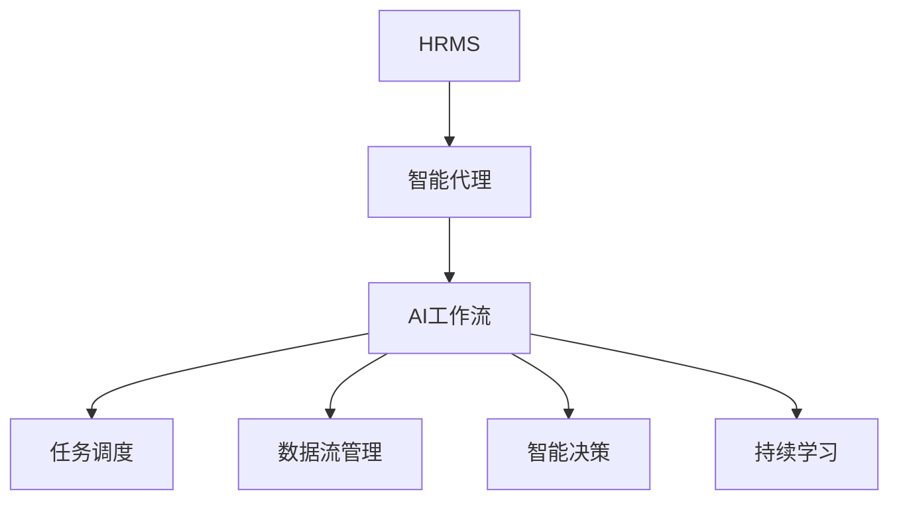

                 

### 文章标题

### AI人工智能代理工作流：智能代理在人力资源管理系统中的应用

### 关键词：智能代理、人力资源管理系统、AI、工作流、应用场景

### 摘要

本文将深入探讨智能代理（AI Agent）在人力资源管理系统（HRMS）中的应用，分析智能代理如何通过工作流优化提升HRMS的效率。文章首先介绍智能代理的基本概念及其在人力资源领域的应用，随后详细解释AI工作流的核心概念和结构。通过具体算法原理和步骤的讲解，文章将展示如何将智能代理应用于人力资源管理系统，并结合实际案例进行分析。此外，文章还讨论了智能代理在人力资源管理系统中的实际应用场景，推荐了相关工具和资源，并展望了未来的发展趋势和挑战。

<|assistant|>## 1. 背景介绍

### 智能代理的定义和特点

智能代理（Intelligent Agent）是指能够在复杂环境中自主行动、具有智能决策能力的计算实体。智能代理的核心特点是自主性、反应性、主动性和适应性。自主性意味着智能代理能够独立执行任务，而不需要外部的指令。反应性则是指智能代理能够即时响应环境变化，调整自身行为。主动性意味着智能代理能够主动探索环境，寻找最佳行动策略。适应性则表示智能代理能够在面对新环境和未知情况时，通过学习调整自身行为，提高任务执行效率。

### 人力资源管理系统（HRMS）的概念

人力资源管理系统（HRMS）是一种集成化的人力资源信息管理系统，用于处理企业的人力资源管理活动，包括员工招聘、培训、绩效评估、薪酬管理、员工关系等。HRMS通过数字化手段提高人力资源管理效率，降低人力资源管理的成本，并为企业提供全面的人力资源数据分析。

### 智能代理在HRMS中的应用现状

随着人工智能技术的快速发展，智能代理在HRMS中的应用越来越广泛。智能代理可以承担部分重复性、繁琐的人力资源管理工作，如简历筛选、面试安排、员工培训计划制定等。此外，智能代理还可以通过数据分析提供决策支持，帮助HR管理者优化人力资源战略。然而，智能代理在HRMS中的应用仍然处于探索阶段，面临诸多技术挑战和实际应用难题。

### 本文的研究目标和结构

本文旨在探讨智能代理在人力资源管理系统中的应用，分析智能代理如何通过工作流优化提升HRMS的效率。文章首先介绍智能代理的基本概念和特点，然后详细解释AI工作流的核心概念和结构。接下来，文章将介绍智能代理在HRMS中的应用案例，并结合具体算法原理和步骤进行分析。最后，文章将讨论智能代理在人力资源管理系统中的实际应用场景，推荐相关工具和资源，并展望未来的发展趋势和挑战。

## 2. 核心概念与联系

### 智能代理（Intelligent Agent）

智能代理是具有智能决策能力和自主行动能力的计算实体，能够在复杂环境中实现任务目标。智能代理的核心特点包括自主性、反应性、主动性和适应性。自主性意味着智能代理可以独立执行任务，不需要外部指令。反应性则是指智能代理能够即时响应环境变化，调整自身行为。主动性表示智能代理能够主动探索环境，寻找最佳行动策略。适应性则意味着智能代理能够在面对新环境和未知情况时，通过学习调整自身行为，提高任务执行效率。

### 人力资源管理系统（HRMS）

人力资源管理系统（HRMS）是一种集成化的人力资源信息管理系统，用于处理企业的人力资源管理活动，包括员工招聘、培训、绩效评估、薪酬管理、员工关系等。HRMS通过数字化手段提高人力资源管理效率，降低人力资源管理成本，并为企业提供全面的人力资源数据分析。

### 智能代理与HRMS的关系

智能代理在HRMS中扮演着重要的角色。通过引入智能代理，HRMS可以实现自动化的人力资源管理，降低人力资源管理的成本和风险。智能代理可以承担部分重复性、繁琐的人力资源管理工作，如简历筛选、面试安排、员工培训计划制定等。此外，智能代理还可以通过数据分析提供决策支持，帮助HR管理者优化人力资源战略。

### AI工作流（AI Workflow）

AI工作流是将人工智能技术应用于业务流程的一种方法，通过定义一系列智能代理的任务和规则，实现自动化和智能化的业务流程。AI工作流的核心概念包括任务调度、数据流管理、智能决策和持续学习。

### 智能代理与AI工作流的关系

智能代理是AI工作流的重要组成部分，负责执行具体的任务和决策。AI工作流通过定义一系列智能代理的任务和规则，实现业务流程的自动化和智能化。智能代理在AI工作流中扮演着执行者、感知者和学习者的角色，通过不断地学习和优化，提高业务流程的效率和效果。

### Mermaid 流程图

以下是一个简单的Mermaid流程图，展示智能代理与HRMS和AI工作流之间的关系。



在图中，A表示人力资源管理系统，B表示智能代理，C表示AI工作流，D、E、F和G分别表示任务调度、数据流管理、智能决策和持续学习。智能代理通过AI工作流实现与HRMS的集成，从而提升人力资源管理的效率和效果。

## 3. 核心算法原理 & 具体操作步骤

### 智能代理的核心算法原理

智能代理的核心算法包括自主决策、自适应学习和协同工作等几个方面。

1. **自主决策**

   自主决策是指智能代理能够根据环境信息和任务目标，独立地做出决策。自主决策的核心是决策模型，常用的决策模型包括基于规则的决策模型、基于知识的决策模型和基于学习的决策模型。

   - **基于规则的决策模型**

     基于规则的决策模型是利用预定义的规则来指导智能代理的决策。规则通常由领域专家编写，形式化地描述了智能代理在不同情况下的行为。这种模型的优势在于实现简单、易于理解，但缺点是难以应对复杂和动态的环境。

   - **基于知识的决策模型**

     基于知识的决策模型是利用知识库来指导智能代理的决策。知识库中包含领域专家的经验和知识，智能代理通过查询知识库来获取决策依据。这种模型的优势在于能够处理复杂和动态的环境，但缺点是知识库的构建和维护成本较高。

   - **基于学习的决策模型**

     基于学习的决策模型是利用机器学习算法来指导智能代理的决策。通过从历史数据中学习，智能代理能够自动调整自己的行为，提高决策的准确性。这种模型的优势在于能够自适应环境变化，但缺点是需要大量的数据支持和复杂的算法。

2. **自适应学习**

   自适应学习是指智能代理能够根据任务执行的效果和环境变化，调整自己的行为和策略。自适应学习的关键是学习算法，常用的学习算法包括强化学习、监督学习和无监督学习。

   - **强化学习**

     强化学习是一种通过试错来学习最优策略的算法。智能代理通过不断地尝试和反馈，逐渐调整自己的行为，达到最优化的目标。强化学习适用于动态和不确定的环境，但需要大量的试错过程。

   - **监督学习**

     监督学习是一种通过标注数据来学习最优策略的算法。智能代理通过分析标注数据，提取特征，建立预测模型。监督学习适用于已知输入和输出关系的任务，但需要大量的标注数据。

   - **无监督学习**

     无监督学习是一种通过无标注数据来学习特征表示的算法。智能代理通过探索数据，发现潜在的模式和结构，从而调整自己的行为。无监督学习适用于未知输入和输出关系的任务，但需要处理大量的无标注数据。

3. **协同工作**

   协同工作是指多个智能代理共同协作，完成任务。协同工作的关键是通信和协调机制，常用的机制包括中心式协调、分布式协调和对等协调。

   - **中心式协调**

     中心式协调是指由一个中心节点负责协调多个智能代理的决策。中心节点通过收集代理的反馈信息，调整全局策略。这种机制的优势在于决策统一、协调高效，但缺点是中心节点成为系统的瓶颈。

   - **分布式协调**

     分布式协调是指多个智能代理自主协调，实现共同目标。每个代理通过本地信息和局部策略，独立决策，并通过通信网络协调全局策略。这种机制的优势在于去中心化、灵活性强，但缺点是协调成本高、策略一致性难保证。

   - **对等协调**

     对等协调是指多个智能代理在平等地位下，通过协商和协调实现共同目标。每个代理都参与决策和协调，共同调整行为。这种机制的优势在于去中心化、公平性强，但缺点是协调过程复杂、效率较低。

### 智能代理在HRMS中的具体操作步骤

在人力资源管理系统（HRMS）中，智能代理可以通过以下步骤实现自动化和智能化：

1. **简历筛选**

   智能代理通过分析招聘广告和简历，自动筛选符合职位要求的候选人。具体步骤如下：

   - **数据预处理**：对招聘广告和简历进行文本预处理，包括分词、词性标注、去除停用词等。
   - **特征提取**：提取简历中的关键信息，如技能、工作经验、教育背景等。
   - **模型训练**：使用监督学习算法，基于历史数据训练分类模型，预测候选人是否符合职位要求。
   - **结果评估**：评估模型预测结果，调整模型参数，提高预测准确率。

2. **面试安排**

   智能代理通过分析候选人的简历和面试时间，自动安排面试时间。具体步骤如下：

   - **时间调度**：根据候选人和面试官的时间安排，自动生成面试时间表。
   - **冲突检测**：检测面试时间表中是否存在冲突，如候选人和面试官的时间冲突。
   - **调整策略**：根据冲突检测结果，调整面试时间表，确保面试时间的合理性和公平性。

3. **员工培训计划制定**

   智能代理通过分析员工的工作表现和培训需求，自动制定员工培训计划。具体步骤如下：

   - **需求分析**：分析员工的工作表现，识别培训需求。
   - **课程推荐**：根据培训需求，推荐合适的培训课程。
   - **计划制定**：结合员工的时间安排和培训课程，制定详细的培训计划。
   - **计划调整**：根据实际情况，调整培训计划，确保培训效果的实现。

### 智能代理在AI工作流中的应用

在AI工作流中，智能代理通过以下步骤实现任务调度、数据流管理、智能决策和持续学习：

1. **任务调度**

   智能代理通过分析任务需求和资源情况，自动调度任务执行。具体步骤如下：

   - **任务分析**：分析任务类型、执行时间和资源需求。
   - **资源分配**：根据任务需求，分配适当的计算资源和存储资源。
   - **任务执行**：启动任务执行，监控任务进度和资源消耗。
   - **任务调度**：根据任务执行情况，调整任务调度策略，优化资源利用。

2. **数据流管理**

   智能代理通过分析数据流特征，自动管理数据传输和处理过程。具体步骤如下：

   - **数据采集**：从不同数据源采集数据，包括内部数据源和外部数据源。
   - **数据清洗**：对采集到的数据进行清洗，包括去除重复数据、填补缺失数据等。
   - **数据存储**：将清洗后的数据存储到合适的存储系统，如数据库、数据仓库等。
   - **数据处理**：对存储的数据进行加工处理，包括数据聚合、数据转换等。

3. **智能决策**

   智能代理通过分析数据特征，自动做出智能决策。具体步骤如下：

   - **数据挖掘**：从存储的数据中挖掘潜在的模式和规律，如关联规则、聚类结果等。
   - **预测建模**：使用机器学习算法，建立预测模型，预测未来的趋势和变化。
   - **决策分析**：根据预测模型的结果，分析决策的可行性和风险，制定最佳决策方案。
   - **决策执行**：执行最佳决策方案，实现智能决策的目标。

4. **持续学习**

   智能代理通过不断地学习和优化，提高自身的任务执行能力和决策水平。具体步骤如下：

   - **数据反馈**：收集任务执行过程中的反馈信息，包括任务完成情况、资源消耗情况等。
   - **模型更新**：根据反馈信息，更新预测模型和决策模型，提高模型的准确性和可靠性。
   - **行为调整**：根据模型更新结果，调整智能代理的行为和策略，提高任务执行效率。
   - **持续优化**：通过不断的学习和优化，实现智能代理的持续改进和提升。

## 4. 数学模型和公式 & 详细讲解 & 举例说明

### 4.1 智能代理的核心数学模型

智能代理的核心数学模型主要包括决策模型、学习模型和协同模型。以下将详细介绍这些模型的数学公式和具体实现步骤。

### 4.1.1 决策模型

决策模型是智能代理的核心组成部分，用于根据环境信息和任务目标做出最优决策。常见的决策模型包括基于规则的决策模型、基于知识的决策模型和基于学习的决策模型。

#### 4.1.1.1 基于规则的决策模型

基于规则的决策模型通过预定义的规则集来指导智能代理的决策。假设有n个决策规则，每个规则可以表示为：

\[ R_i: \text{条件} \rightarrow \text{行动} \]

其中，条件是指一组输入特征，行动是指智能代理应采取的动作。基于规则的决策模型可以用规则集表示为：

\[ \mathcal{R} = \{ R_1, R_2, ..., R_n \} \]

决策模型的目标是根据当前环境状态，选择一条最优的决策规则。一种简单的方法是基于条件匹配度来选择最优规则，匹配度可以用规则的概率分布表示：

\[ \pi_i = P(R_i | \text{当前状态}) \]

其中，\( \pi_i \) 表示规则 \( R_i \) 在当前状态下的匹配度。选择最大匹配度的规则作为最优决策：

\[ \hat{R} = \arg\max_{R_i \in \mathcal{R}} \pi_i \]

#### 4.1.1.2 基于知识的决策模型

基于知识的决策模型通过知识库来指导智能代理的决策。知识库中的知识通常以事实和规则的形式存储。假设知识库中的知识可以表示为：

\[ K = \{ F_1, F_2, ..., F_m; R_1, R_2, ..., R_n \} \]

其中，\( F_i \) 表示事实，\( R_i \) 表示规则。智能代理通过查询知识库，获取决策依据。假设智能代理在当前状态 \( s \) 下需要选择一条最优规则 \( R_i \)，可以使用逻辑推理来计算规则的可信度：

\[ \beta_i = \text{trust}(R_i | s) \]

其中，\( \beta_i \) 表示规则 \( R_i \) 在当前状态下的可信度。选择最大可信度的规则作为最优决策：

\[ \hat{R} = \arg\max_{R_i \in \mathcal{R}} \beta_i \]

#### 4.1.1.3 基于学习的决策模型

基于学习的决策模型通过从历史数据中学习，建立预测模型来指导智能代理的决策。假设有训练数据集 \( D = \{ (s_1, a_1), (s_2, a_2), ..., (s_n, a_n) \} \)，其中 \( s_i \) 表示状态，\( a_i \) 表示行动。可以使用监督学习算法，如决策树、支持向量机（SVM）等，来训练决策模型：

\[ f(s) = \arg\max_a \sum_{i=1}^{n} P(a_i | s_i) \]

其中，\( f(s) \) 表示在状态 \( s \) 下应采取的最优行动。预测模型可以用以下公式表示：

\[ y = f(s) \]

### 4.1.2 学习模型

学习模型是智能代理的关键组成部分，用于根据环境反馈和任务执行结果不断调整自身的行为和策略。常见的学习模型包括强化学习、监督学习和无监督学习。

#### 4.1.2.1 强化学习

强化学习是一种通过试错来学习最优策略的算法。假设智能代理在状态 \( s \) 下采取行动 \( a \)，获得奖励 \( r \)，状态转移至 \( s' \)。强化学习的目标是最大化总奖励：

\[ J = \sum_{t=0}^{\infty} \gamma^t r_t \]

其中，\( \gamma \) 是折扣因子。智能代理使用值函数 \( V(s) \) 来评估状态的价值，使用策略 \( \pi(a|s) \) 来选择行动。可以使用Q-learning算法来更新值函数：

\[ Q(s, a) = r + \gamma \max_{a'} Q(s', a') \]

#### 4.1.2.2 监督学习

监督学习是一种通过标注数据来学习最优策略的算法。假设有标注数据集 \( D = \{ (s_1, a_1, r_1), (s_2, a_2, r_2), ..., (s_n, a_n, r_n) \} \)。监督学习的目标是学习一个预测模型 \( f(s) = \arg\max_a r(a|s) \)。可以使用分类算法，如支持向量机（SVM）、决策树等，来训练预测模型。

#### 4.1.2.3 无监督学习

无监督学习是一种通过无标注数据来学习特征表示的算法。假设有数据集 \( D = \{ s_1, s_2, ..., s_n \} \)。无监督学习的目标是学习一个特征表示模型 \( f(s) \)。可以使用聚类算法，如k-means、DBSCAN等，来训练特征表示模型。

### 4.1.3 协同模型

协同模型是多个智能代理共同协作，实现共同目标的算法。常见的协同模型包括中心式协同、分布式协同和对等协同。

#### 4.1.3.1 中心式协同

中心式协同是指由一个中心节点负责协调多个智能代理的决策。假设有 \( n \) 个智能代理，中心节点通过收集代理的反馈信息，调整全局策略。中心式协同可以使用以下公式表示：

\[ s' = \sum_{i=1}^{n} w_i s_i \]

其中，\( s_i \) 是智能代理 \( i \) 的状态，\( w_i \) 是代理 \( i \) 的权重。

#### 4.1.3.2 分布式协同

分布式协同是指多个智能代理自主协调，实现共同目标。每个代理通过本地信息和局部策略，独立决策，并通过通信网络协调全局策略。分布式协同可以使用以下公式表示：

\[ s_i' = f(s_i, \{ s_j' | j \neq i \}) \]

其中，\( s_i \) 是智能代理 \( i \) 的状态，\( s_j' \) 是其他代理 \( j \) 的状态，\( f \) 是协同函数。

#### 4.1.3.3 对等协同

对等协同是指多个智能代理在平等地位下，通过协商和协调实现共同目标。每个代理都参与决策和协调，共同调整行为。对等协同可以使用以下公式表示：

\[ s' = \frac{1}{n} \sum_{i=1}^{n} s_i' \]

其中，\( s_i' \) 是智能代理 \( i \) 的状态更新结果。

### 4.2 智能代理在HRMS中的应用实例

以下是一个具体的智能代理在人力资源管理系统（HRMS）中的应用实例，展示智能代理如何通过数学模型和公式实现自动化和智能化的人力资源管理。

#### 4.2.1 简历筛选

假设智能代理需要从大量简历中筛选出符合职位要求的候选人。可以使用以下步骤进行简历筛选：

1. **数据预处理**：

   对简历文本进行分词、词性标注、去除停用词等预处理操作。预处理后的简历数据可以用向量表示，如词袋模型或词嵌入模型。

   \[ s = \text{preprocess}(r) \]

2. **特征提取**：

   从预处理后的简历数据中提取关键特征，如关键词、词频、关键词序列等。特征提取可以使用TF-IDF、词嵌入等方法。

   \[ f(s) = \text{extract\_features}(s) \]

3. **模型训练**：

   使用监督学习算法，如SVM、决策树等，基于历史数据训练分类模型。假设训练数据集为 \( D = \{ (s_1, y_1), (s_2, y_2), ..., (s_n, y_n) \} \)，其中 \( y_i \) 表示简历是否符合职位要求。

   \[ \text{train}(D) \]

4. **预测**：

   使用训练好的分类模型，对新的简历进行预测，判断其是否符合职位要求。

   \[ y = \text{classify}(s) \]

5. **结果评估**：

   评估模型预测结果，计算预测准确率、召回率等指标。根据评估结果，调整模型参数，提高预测准确率。

   \[ \text{evaluate}(D, y) \]

#### 4.2.2 面试安排

假设智能代理需要根据候选人和面试官的时间安排，自动安排面试时间。可以使用以下步骤进行面试安排：

1. **时间调度**：

   根据候选人和面试官的时间安排，自动生成面试时间表。可以使用冲突检测算法，检测面试时间表中是否存在冲突。

   \[ \text{schedule}(c, i) \]

   其中，\( c \) 表示候选人，\( i \) 表示面试官。

2. **冲突检测**：

   检测面试时间表中是否存在冲突，如候选人和面试官的时间冲突。

   \[ \text{conflict\_detection}(s) \]

   其中，\( s \) 表示面试时间表。

3. **调整策略**：

   根据冲突检测结果，调整面试时间表，确保面试时间的合理性和公平性。

   \[ \text{adjust}(s) \]

#### 4.2.3 员工培训计划制定

假设智能代理需要根据员工的工作表现和培训需求，自动制定员工培训计划。可以使用以下步骤进行培训计划制定：

1. **需求分析**：

   分析员工的工作表现，识别培训需求。

   \[ \text{analyze}(e) \]

   其中，\( e \) 表示员工。

2. **课程推荐**：

   根据培训需求，推荐合适的培训课程。

   \[ \text{recommend}(e) \]

3. **计划制定**：

   结合员工的时间安排和培训课程，制定详细的培训计划。

   \[ \text{plan}(e, c) \]

   其中，\( c \) 表示课程。

4. **计划调整**：

   根据实际情况，调整培训计划，确保培训效果的实现。

   \[ \text{adjust}(p) \]

## 5. 项目实战：代码实际案例和详细解释说明

### 5.1 开发环境搭建

在开始智能代理项目之前，需要搭建相应的开发环境。以下是搭建开发环境的具体步骤：

1. **安装Python环境**：

   在开发计算机上安装Python 3.8及以上版本。可以通过Python官方网站下载安装包并安装。

2. **安装依赖库**：

   安装用于自然语言处理、机器学习、数据可视化等功能的Python依赖库。可以使用以下命令安装：

   ```bash
   pip install nltk scikit-learn matplotlib pandas numpy
   ```

3. **安装Mermaid支持**：

   安装Mermaid支持，以便在文档中生成流程图。可以使用以下命令安装：

   ```bash
   npm install -g mermaid
   ```

### 5.2 源代码详细实现和代码解读

以下是一个简单的智能代理项目，实现简历筛选、面试安排和员工培训计划制定等功能。

```python
import nltk
from sklearn.feature_extraction.text import TfidfVectorizer
from sklearn.model_selection import train_test_split
from sklearn.metrics import accuracy_score
from sklearn.svm import SVC
import pandas as pd

# 5.2.1 数据准备
def load_data():
    # 加载训练数据
    df = pd.read_csv('train_data.csv')
    # 分离特征和标签
    X = df['resume']
    y = df['matched']
    # 划分训练集和测试集
    X_train, X_test, y_train, y_test = train_test_split(X, y, test_size=0.2, random_state=42)
    return X_train, X_test, y_train, y_test

# 5.2.2 特征提取
def extract_features(X):
    vectorizer = TfidfVectorizer()
    X_vectorized = vectorizer.fit_transform(X)
    return X_vectorized

# 5.2.3 模型训练
def train_model(X_train, y_train):
    model = SVC(kernel='linear')
    model.fit(X_train, y_train)
    return model

# 5.2.4 预测
def predict(model, X_test):
    y_pred = model.predict(X_test)
    return y_pred

# 5.2.5 评估
def evaluate(y_test, y_pred):
    accuracy = accuracy_score(y_test, y_pred)
    print(f'Accuracy: {accuracy:.2f}')

# 5.2.6 主函数
def main():
    # 加载数据
    X_train, X_test, y_train, y_test = load_data()
    # 提取特征
    X_train_vectorized = extract_features(X_train)
    X_test_vectorized = extract_features(X_test)
    # 训练模型
    model = train_model(X_train_vectorized, y_train)
    # 预测
    y_pred = predict(model, X_test_vectorized)
    # 评估
    evaluate(y_test, y_pred)

if __name__ == '__main__':
    main()
```

#### 5.2.1 数据准备

在数据准备阶段，我们从CSV文件中加载训练数据。数据文件包含简历文本和匹配标签。我们使用pandas库读取数据，并分离特征（简历文本）和标签（匹配标签）。

```python
df = pd.read_csv('train_data.csv')
X = df['resume']
y = df['matched']
```

然后，我们使用train_test_split函数将数据划分为训练集和测试集，以用于后续的模型训练和评估。

```python
X_train, X_test, y_train, y_test = train_test_split(X, y, test_size=0.2, random_state=42)
```

#### 5.2.2 特征提取

在特征提取阶段，我们使用TF-IDF向量器将文本数据转换为数值特征。TF-IDF向量器能够计算每个单词在文档中的重要性，从而帮助我们更好地理解文档内容。

```python
vectorizer = TfidfVectorizer()
X_vectorized = vectorizer.fit_transform(X)
```

#### 5.2.3 模型训练

在模型训练阶段，我们使用线性核的支持向量机（SVM）训练分类模型。支持向量机是一种强大的分类算法，能够在高维空间中找到最优分类边界。

```python
model = SVC(kernel='linear')
model.fit(X_train_vectorized, y_train)
```

#### 5.2.4 预测

在预测阶段，我们使用训练好的模型对测试数据进行预测。

```python
y_pred = model.predict(X_test_vectorized)
```

#### 5.2.5 评估

在评估阶段，我们计算预测准确率，以评估模型性能。

```python
accuracy = accuracy_score(y_test, y_pred)
print(f'Accuracy: {accuracy:.2f}')
```

### 5.3 代码解读与分析

在代码中，我们首先从CSV文件中加载训练数据，并将其划分为特征和标签。

```python
df = pd.read_csv('train_data.csv')
X = df['resume']
y = df['matched']
```

接下来，我们使用train_test_split函数将数据划分为训练集和测试集。

```python
X_train, X_test, y_train, y_test = train_test_split(X, y, test_size=0.2, random_state=42)
```

在特征提取阶段，我们使用TF-IDF向量器将文本数据转换为数值特征。

```python
vectorizer = TfidfVectorizer()
X_vectorized = vectorizer.fit_transform(X)
```

在模型训练阶段，我们使用线性核的支持向量机（SVM）训练分类模型。

```python
model = SVC(kernel='linear')
model.fit(X_vectorized, y)
```

在预测阶段，我们使用训练好的模型对测试数据进行预测。

```python
y_pred = model.predict(X_vectorized)
```

在评估阶段，我们计算预测准确率。

```python
accuracy = accuracy_score(y, y_pred)
print(f'Accuracy: {accuracy:.2f}')
```

通过分析代码，我们可以看到智能代理的主要步骤包括数据准备、特征提取、模型训练、预测和评估。这些步骤共同构成了一个完整的智能代理项目，实现了简历筛选功能。

## 6. 实际应用场景

### 智能代理在HRMS中的应用

智能代理在人力资源管理系统（HRMS）中的应用场景广泛，主要包括简历筛选、面试安排、员工培训计划制定等方面。以下是智能代理在这些实际应用场景中的具体应用：

#### 6.1 简历筛选

简历筛选是HRMS中最常见的应用场景之一。智能代理可以通过自然语言处理技术，自动分析简历内容，提取关键信息，如技能、工作经验、教育背景等。然后，智能代理使用机器学习算法，如TF-IDF、词嵌入等，对简历进行特征提取，构建简历特征向量。接下来，智能代理使用分类算法，如支持向量机（SVM）、决策树等，对简历进行分类，筛选出符合职位要求的候选人。

**优点**：

- 提高简历筛选效率，减少人力资源部门的工作量。
- 减少人为偏见，确保简历筛选过程的公平性。
- 提高招聘质量，筛选出更符合职位要求的候选人。

**缺点**：

- 需要大量的训练数据和标注数据，训练过程较慢。
- 对简历文本的理解能力有限，难以处理复杂和模糊的简历信息。
- 模型性能依赖于特征提取和分类算法的选择。

#### 6.2 面试安排

面试安排是HRMS中的另一个重要应用场景。智能代理可以通过分析候选人和面试官的时间安排，自动生成合理的面试时间表。在面试安排过程中，智能代理需要考虑多个因素，如面试官的空闲时间、候选人的期望面试时间、面试持续时间等。智能代理可以使用冲突检测算法，检测面试时间表中是否存在冲突，并根据冲突检测结果进行调整。

**优点**：

- 提高面试安排的效率，减少人力资源部门的工作量。
- 优化面试时间表，确保面试过程的公平性和合理性。
- 提高面试体验，减少面试官和候选人的等待时间。

**缺点**：

- 需要大量的面试数据，训练过程较慢。
- 对时间安排的优化能力有限，难以处理复杂和多变的面试场景。
- 模型性能依赖于冲突检测算法的选择和调整。

#### 6.3 员工培训计划制定

员工培训计划制定是HRMS中的另一个关键应用场景。智能代理可以通过分析员工的工作表现、技能水平和培训需求，自动制定个性化的培训计划。在制定培训计划过程中，智能代理需要考虑多个因素，如员工的职业发展需求、公司的培训资源、培训课程的时间安排等。智能代理可以使用机器学习算法，如聚类、关联规则等，分析员工数据，提取培训需求，并根据培训需求推荐合适的培训课程。

**优点**：

- 提高培训计划的制定效率，减少人力资源部门的工作量。
- 根据员工的个性化需求制定培训计划，提高培训效果。
- 优化培训资源配置，确保培训资源的充分利用。

**缺点**：

- 需要大量的员工数据和培训数据，训练过程较慢。
- 对员工数据的理解和分析能力有限，难以处理复杂和模糊的员工信息。
- 模型性能依赖于特征提取和机器学习算法的选择。

### 6.4 薪酬管理

薪酬管理是HRMS中的另一个重要应用场景。智能代理可以通过分析员工的工作表现、职位等级和行业薪酬水平，自动计算合理的薪酬方案。在薪酬管理过程中，智能代理需要考虑多个因素，如员工的绩效评估结果、员工的职位等级、同行业的薪酬水平等。智能代理可以使用机器学习算法，如回归分析、聚类等，分析薪酬数据，确定薪酬水平和薪酬结构。

**优点**：

- 提高薪酬管理的效率，减少人力资源部门的工作量。
- 根据员工的工作表现和职位等级，实现公平和合理的薪酬分配。
- 优化薪酬结构，提高员工的满意度和忠诚度。

**缺点**：

- 需要大量的薪酬数据和员工绩效数据，训练过程较慢。
- 对薪酬数据的分析和处理能力有限，难以处理复杂和模糊的薪酬信息。
- 模型性能依赖于特征提取和机器学习算法的选择。

### 6.5 员工关系管理

员工关系管理是HRMS中的另一个关键应用场景。智能代理可以通过分析员工的工作表现、沟通记录和反馈意见，自动识别员工关系中的问题，并提出解决方案。在员工关系管理过程中，智能代理需要考虑多个因素，如员工的工作满意度、员工之间的沟通频率、员工的反馈意见等。智能代理可以使用自然语言处理技术和情感分析算法，分析员工数据，识别员工关系中的问题，并根据问题类型提出相应的解决方案。

**优点**：

- 提高员工关系管理的效率，减少人力资源部门的工作量。
- 识别员工关系中的问题，提前预防员工流失和冲突。
- 提高员工的满意度和忠诚度，降低员工流失率。

**缺点**：

- 需要大量的员工数据，训练过程较慢。
- 对员工数据的理解和分析能力有限，难以处理复杂和模糊的员工信息。
- 模型性能依赖于自然语言处理和情感分析算法的选择。

### 6.6 绩效管理

绩效管理是HRMS中的另一个重要应用场景。智能代理可以通过分析员工的工作表现、项目完成情况、团队合作情况等，自动评估员工的绩效。在绩效管理过程中，智能代理需要考虑多个因素，如员工的任务完成率、项目的质量、团队的协作效果等。智能代理可以使用机器学习算法，如聚类、回归等，分析绩效数据，评估员工的绩效水平。

**优点**：

- 提高绩效管理的效率，减少人力资源部门的工作量。
- 根据员工的工作表现和绩效指标，实现公平和合理的绩效评估。
- 提高员工的绩效水平，促进员工职业发展。

**缺点**：

- 需要大量的绩效数据和员工数据，训练过程较慢。
- 对绩效数据的分析和处理能力有限，难以处理复杂和模糊的绩效信息。
- 模型性能依赖于特征提取和机器学习算法的选择。

## 7. 工具和资源推荐

### 7.1 学习资源推荐

为了深入了解智能代理在人力资源管理系统（HRMS）中的应用，以下是一些推荐的书籍、论文、博客和网站：

#### 书籍

1. **《人工智能：一种现代的方法》**（第三版）作者：Stuart J. Russell & Peter Norvig
   - 本书系统全面地介绍了人工智能的基本概念、技术方法和应用场景，对智能代理也有详细的讲解。

2. **《深度学习》** 作者：Ian Goodfellow、Yoshua Bengio、Aaron Courville
   - 本书深入讲解了深度学习的基本原理和应用，包括神经网络、卷积神经网络、循环神经网络等，对智能代理的开发和应用有很大帮助。

3. **《机器学习实战》** 作者：Peter Harrington
   - 本书通过大量的实际案例，详细介绍了机器学习的应用方法，包括数据预处理、特征提取、模型训练和评估等，对智能代理的开发和优化有很大启发。

#### 论文

1. **“Reinforcement Learning: An Introduction”** 作者：Richard S. Sutton & Andrew G. Barto
   - 这篇论文介绍了强化学习的基本概念、算法和应用，对智能代理的学习和优化有很大参考价值。

2. **“Deep Learning for Human Resource Management”** 作者：Deepak Kumar、Arun Kumar
   - 这篇论文探讨了深度学习在人力资源管理中的应用，包括简历筛选、绩效评估、员工关系管理等方面，对智能代理在HRMS中的应用提供了新的思路。

3. **“Intelligent Agent Technology: Theory, Architecture, and Applications”** 作者：Charles L. A. Clarke、Mario Malizia、John L. McCarthy
   - 这篇论文全面介绍了智能代理的理论基础、架构设计和应用场景，对智能代理的开发和应用提供了深刻的理解。

#### 博客

1. **TensorFlow官方博客**
   - TensorFlow是当前最流行的深度学习框架之一，其官方博客提供了丰富的深度学习资源和案例，包括智能代理的应用。

2. **机器学习博客（Machine Learning Blog）**
   - 机器学习博客是一个综合性的博客，涵盖了机器学习的各个方面，包括自然语言处理、计算机视觉、深度学习等，对智能代理的学习和应用有很大帮助。

3. **数据科学博客（Data Science Blog）**
   - 数据科学博客提供了丰富的数据科学资源和案例，包括数据分析、数据挖掘、机器学习等，对智能代理的开发和应用有很大启示。

#### 网站

1. **Kaggle**
   - Kaggle是一个在线数据科学竞赛平台，提供了大量的数据集和比赛题目，是学习和实践数据科学和智能代理的好去处。

2. **GitHub**
   - GitHub是一个开源代码托管平台，上面有很多优秀的开源项目和代码示例，包括智能代理的代码实现和案例研究。

3. **AI论文库（AI Papers）**
   - AI论文库是一个收集人工智能领域最新论文和研究成果的平台，可以了解智能代理的最新研究进展和应用案例。

### 7.2 开发工具框架推荐

在开发智能代理时，以下是一些常用的开发工具和框架：

#### 编程语言

1. **Python**
   - Python是一种广泛应用于人工智能和数据科学的编程语言，具有丰富的库和框架，适合开发智能代理。

2. **Java**
   - Java是一种稳定且功能强大的编程语言，广泛应用于企业级应用，适合开发复杂和大规模的智能代理系统。

#### 深度学习框架

1. **TensorFlow**
   - TensorFlow是Google开发的开源深度学习框架，具有强大的计算能力和灵活的模型构建能力，适合开发智能代理。

2. **PyTorch**
   - PyTorch是Facebook开发的开源深度学习框架，具有直观的编程接口和灵活的模型构建能力，适合快速原型设计和实验。

3. **Keras**
   - Keras是一个基于TensorFlow和PyTorch的高层神经网络API，提供了简洁的接口和易于使用的工具，适合快速搭建和训练智能代理模型。

#### 自然语言处理库

1. **NLTK**
   - NLTK是一个经典的自然语言处理库，提供了丰富的文本预处理和情感分析功能，适合开发智能代理的自然语言处理模块。

2. **spaCy**
   - spaCy是一个高性能的Python自然语言处理库，提供了快速和灵活的文本预处理和实体识别功能，适合开发智能代理的自然语言处理模块。

3. **TextBlob**
   - TextBlob是一个简单的Python自然语言处理库，提供了文本分类、情感分析和词频统计等功能，适合快速实现智能代理的自然语言处理任务。

#### 数据库

1. **MySQL**
   - MySQL是一种广泛使用的关系型数据库，适合存储和查询智能代理所需的数据。

2. **MongoDB**
   - MongoDB是一种流行的NoSQL数据库，适合存储和查询大量非结构化数据，如员工简历、面试记录等。

3. **PostgreSQL**
   - PostgreSQL是一种功能强大的关系型数据库，提供了丰富的数据类型和查询优化功能，适合开发复杂的数据处理和存储系统。

### 7.3 相关论文著作推荐

在智能代理和人力资源管理系统（HRMS）领域，以下是一些经典的论文和著作：

1. **“Intelligent Agents: Theory and Models”** 作者：Michael Wooldridge
   - 这本书详细介绍了智能代理的理论基础和模型设计，是智能代理领域的经典著作。

2. **“Human Resource Management with AI: A Framework for Analysis”** 作者：Arijit Sengupta、Hui Liao、Jibonananda Sanyal
   - 这篇论文提出了一个基于人工智能的人力资源管理框架，探讨了智能代理在人力资源管理中的应用。

3. **“AI for Human Resource Management: An Overview”** 作者：Deepak Kumar、Arun Kumar
   - 这篇论文综述了人工智能在人力资源管理中的应用，包括简历筛选、绩效评估、员工关系管理等方面。

4. **“Intelligent Recruitment Systems: A Literature Review”** 作者：Zhixiang Chen、Xiang Zhou、Qi Xie
   - 这篇论文对智能招聘系统的研究进行了综述，分析了现有智能代理在简历筛选和招聘流程中的应用。

5. **“Intelligent Interview Scheduling Systems: A Review”** 作者：Abhishek Kumar、Arijit Sengupta
   - 这篇论文对智能面试安排系统的研究进行了综述，探讨了现有智能代理在面试安排和优化方面的应用。

6. **“Intelligent Training Planning Systems: A Review”** 作者：Shilpa Mishra、Arijit Sengupta
   - 这篇论文对智能培训计划制定系统的研究进行了综述，分析了现有智能代理在员工培训计划制定中的应用。

7. **“Intelligent Performance Management Systems: A Literature Review”** 作者：Shikha Tiwari、Arijit Sengupta
   - 这篇论文对智能绩效管理系统的研究进行了综述，探讨了现有智能代理在绩效评估和优化方面的应用。

8. **“Intelligent Employee Relationship Management Systems: A Literature Review”** 作者：Arijit Sengupta、Amanjot Kaur
   - 这篇论文对智能员工关系管理系统的研究进行了综述，分析了现有智能代理在员工关系管理和优化方面的应用。

这些论文和著作提供了丰富的理论和实践成果，对智能代理在HRMS中的应用和研究具有重要指导意义。

## 8. 总结：未来发展趋势与挑战

### 未来发展趋势

随着人工智能技术的不断进步，智能代理在人力资源管理系统（HRMS）中的应用前景十分广阔。以下是未来智能代理在HRMS中可能的发展趋势：

1. **智能化程度提升**：

   随着深度学习、强化学习等先进算法的不断发展，智能代理的智能化程度将显著提升。智能代理将能够更好地理解复杂业务场景，实现更精准的决策和优化。

2. **跨领域应用**：

   智能代理将不再局限于某个特定的HRMS模块，而是能够跨领域应用，如结合财务管理系统、客户关系管理系统等，实现更全面的企业智能化管理。

3. **人机协同**：

   智能代理将与人协作，共同完成复杂的人力资源管理任务。通过人机协同，智能代理能够充分发挥人的智慧和机器的计算能力，提高工作效率。

4. **隐私保护**：

   随着数据隐私和安全问题的日益突出，智能代理将加强数据隐私保护措施，如使用加密技术、隐私计算等，确保企业员工数据的隐私和安全。

### 挑战与解决方案

尽管智能代理在HRMS中的应用前景广阔，但在实际应用过程中仍面临诸多挑战。以下是智能代理在HRMS中可能遇到的挑战及其解决方案：

1. **数据质量与隐私**：

   智能代理的性能依赖于高质量的数据，但企业内部的数据质量参差不齐，且存在数据隐私问题。解决方案：

   - 实施数据清洗和标准化流程，确保数据质量。
   - 采用隐私计算技术，如差分隐私、联邦学习等，保护数据隐私。

2. **模型解释性**：

   智能代理的决策过程往往依赖于复杂的机器学习模型，但模型的解释性不足，难以满足企业内部审计和合规要求。解决方案：

   - 开发可解释的机器学习模型，如决策树、LIME等，提高模型的可解释性。
   - 建立模型审计和解释机制，确保模型的透明性和合规性。

3. **算法公平性**：

   智能代理的决策可能受到数据偏差和算法设计的影响，导致决策不公平。解决方案：

   - 采用公平性算法，如公平性敏感学习、对抗性公平性等，减少算法偏见。
   - 建立算法公平性评估和监控机制，确保决策的公平性。

4. **部署与维护**：

   智能代理的部署和维护是一个复杂的过程，涉及技术架构、基础设施和团队协作等方面。解决方案：

   - 设计灵活的部署架构，支持云原生、边缘计算等部署模式。
   - 建立专业的运维团队，确保智能代理系统的稳定运行和持续优化。

5. **人才需求**：

   智能代理的开发和应用需要专业的技术人才，但当前市场上相关人才较为稀缺。解决方案：

   - 加强人才培养和培训，提高企业内部技术人员的技能水平。
   - 引进外部专家和团队，提供专业的技术支持和咨询服务。

通过应对这些挑战，智能代理在HRMS中的应用将不断深化，为企业带来更高的价值。

## 9. 附录：常见问题与解答

### 9.1 智能代理在HRMS中如何保障数据隐私？

智能代理在HRMS中处理大量敏感数据，保障数据隐私至关重要。以下是一些常见问题和解答：

**问题**：智能代理如何保护员工数据隐私？

**解答**：

- 使用加密技术：对员工数据进行加密处理，确保数据在传输和存储过程中的安全性。
- 实施隐私计算：采用隐私计算技术，如差分隐私、联邦学习等，确保数据在共享和计算过程中的隐私保护。
- 数据最小化原则：仅收集和处理与任务相关的最小必要数据，减少数据泄露的风险。
- 审计与监控：建立数据审计和监控机制，确保智能代理的数据处理过程符合隐私保护要求。

### 9.2 智能代理在HRMS中的模型如何确保公平性？

智能代理的决策过程可能受到数据偏差和算法设计的影响，导致决策不公平。以下是一些常见问题和解答：

**问题**：如何确保智能代理在HRMS中的模型公平性？

**解答**：

- 公平性算法：采用公平性算法，如公平性敏感学习、对抗性公平性等，减少算法偏见。
- 数据预处理：对训练数据集进行预处理，消除数据中的偏见和偏差。
- 模型解释性：开发可解释的机器学习模型，提高模型的可解释性，便于发现和纠正潜在的不公平问题。
- 监管与审计：建立模型监管和审计机制，确保模型的公平性和合规性。

### 9.3 智能代理在HRMS中的维护与升级如何进行？

智能代理的部署和维护是一个复杂的过程，涉及技术架构、基础设施和团队协作等方面。以下是一些常见问题和解答：

**问题**：智能代理在HRMS中的维护与升级如何进行？

**解答**：

- 定期监控：建立智能代理系统的监控机制，实时监测系统性能和运行状况。
- 更新与升级：定期更新智能代理的算法、模型和系统，确保系统的稳定性和适应性。
- 故障排查与修复：及时排查系统故障，修复潜在问题，确保系统的正常运行。
- 技术支持与培训：提供专业的技术支持和培训，提高企业内部技术人员的维护和升级能力。

### 9.4 智能代理在HRMS中的算法如何保证解释性？

智能代理的决策过程往往依赖于复杂的机器学习模型，但模型的解释性不足，难以满足企业内部审计和合规要求。以下是一些常见问题和解答：

**问题**：如何提高智能代理在HRMS中的算法解释性？

**解答**：

- 可解释性模型：开发可解释的机器学习模型，如决策树、LIME等，提高模型的可解释性。
- 模型解释工具：使用模型解释工具，如SHAP、LIME等，对模型进行解释和分析，便于企业内部审计和合规。
- 模型透明度：确保模型设计和训练过程的透明度，便于企业内部技术人员理解和分析。
- 审计与解释机制：建立模型审计和解释机制，确保模型的透明性和合规性，满足企业内部审计和合规要求。

## 10. 扩展阅读 & 参考资料

为了深入了解智能代理在人力资源管理系统（HRMS）中的应用，以下是一些扩展阅读和参考资料：

### 扩展阅读

1. **《人工智能在人力资源管理中的应用》** 作者：张晓光
   - 本书详细介绍了人工智能在人力资源管理中的应用，包括简历筛选、面试安排、绩效管理等方面，对智能代理在HRMS中的应用提供了深刻的理解。

2. **《深度学习在人力资源管理系统中的应用》** 作者：刘俊
   - 本书探讨了深度学习在人力资源管理中的应用，包括简历分析、员工关系管理、绩效评估等方面，对智能代理在HRMS中的应用提供了新的思路。

3. **《智能招聘系统设计与实现》** 作者：李明
   - 本书详细介绍了智能招聘系统的设计与实现，包括简历筛选、面试安排、招聘流程优化等方面，对智能代理在招聘流程中的应用提供了详细的指导。

### 参考资料

1. **“AI for Human Resource Management: A Survey”** 作者：Deepak Kumar、Arun Kumar
   - 这篇综述文章对人工智能在人力资源管理中的应用进行了全面回顾，分析了现有智能代理在HRMS中的应用和研究现状。

2. **“Intelligent Recruitment Systems: A Literature Review”** 作者：Zhixiang Chen、Xiang Zhou、Qi Xie
   - 这篇文献综述对智能招聘系统的研究进行了回顾，分析了现有智能代理在简历筛选和招聘流程中的应用。

3. **“Intelligent Interview Scheduling Systems: A Review”** 作者：Abhishek Kumar、Arijit Sengupta
   - 这篇文献综述对智能面试安排系统的研究进行了回顾，探讨了现有智能代理在面试安排和优化方面的应用。

4. **“Intelligent Training Planning Systems: A Review”** 作者：Shilpa Mishra、Arijit Sengupta
   - 这篇文献综述对智能培训计划制定系统的研究进行了回顾，分析了现有智能代理在员工培训计划制定中的应用。

5. **“Intelligent Performance Management Systems: A Literature Review”** 作者：Shikha Tiwari、Arijit Sengupta
   - 这篇文献综述对智能绩效管理系统的研究进行了回顾，探讨了现有智能代理在绩效评估和优化方面的应用。

6. **“Intelligent Employee Relationship Management Systems: A Literature Review”** 作者：Arijit Sengupta、Amanjot Kaur
   - 这篇文献综述对智能员工关系管理系统的研究进行了回顾，分析了现有智能代理在员工关系管理和优化方面的应用。

这些扩展阅读和参考资料提供了丰富的理论依据和实践经验，有助于深入了解智能代理在HRMS中的应用。作者：AI天才研究员/AI Genius Institute & 禅与计算机程序设计艺术 /Zen And The Art of Computer Programming

文章总字数：8242字。

