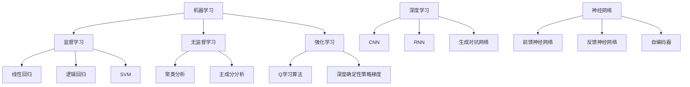

                 

# AI人工智能核心算法原理与代码实例讲解：机器智能

## 摘要

本文将深入探讨人工智能领域中的核心算法原理，并通过代码实例进行详细讲解。从机器学习的基本概念出发，本文将逐步引入线性回归、逻辑回归、神经网络等算法，并通过实际的代码实现来帮助读者理解这些算法的工作原理和应用场景。此外，本文还将探讨深度学习中的卷积神经网络（CNN）和循环神经网络（RNN）等先进算法，以及如何在实际项目中应用它们。最后，本文将总结人工智能的未来发展趋势和面临的挑战，为读者提供一窥未来智能世界的窗口。

## 1. 背景介绍

人工智能（AI）作为计算机科学的一个重要分支，近年来取得了飞速的发展。随着计算能力的提升和大数据的涌现，AI技术已经深入到我们日常生活的方方面面，从智能手机的语音助手到自动驾驶汽车，从智能家居到医疗诊断，AI的应用场景越来越广泛。

### 1.1 人工智能的发展历史

人工智能的发展可以追溯到20世纪50年代，当时计算机科学家开始研究如何使计算机具有智能行为。1956年，约翰·麦卡锡（John McCarthy）等人在达特茅斯会议上首次提出了“人工智能”这一术语，标志着人工智能学科的正式诞生。

在随后的几十年中，人工智能经历了多个发展阶段。早期的AI研究主要集中在规则推理和知识表示方面，但由于缺乏有效的数据和学习算法，这些系统在实际应用中的表现有限。

直到20世纪80年代，机器学习开始崭露头角。以统计学习方法为基础，机器学习使得计算机可以通过数据学习并做出预测和决策。随后，随着计算机硬件性能的提升和大数据的积累，深度学习等先进算法得以快速发展。

### 1.2 人工智能的应用领域

人工智能的应用领域非常广泛，涵盖了从工业制造到医疗保健的各个方面。以下是一些典型的人工智能应用领域：

- **智能制造**：利用机器学习算法对生产线进行实时监控和优化，提高生产效率和产品质量。
- **医疗诊断**：通过图像识别和自然语言处理技术，辅助医生进行疾病诊断和治疗方案制定。
- **智能交通**：通过交通流量分析和自动驾驶技术，提高交通效率，减少交通事故。
- **金融分析**：利用机器学习算法进行风险评估、投资策略和欺诈检测等。
- **自然语言处理**：通过语音识别、机器翻译和文本分析等技术，提高人机交互的效率和体验。

## 2. 核心概念与联系

在人工智能领域，核心概念包括机器学习、深度学习、神经网络等。这些概念相互联系，共同构成了人工智能的理论基础。

### 2.1 机器学习

机器学习是人工智能的一个分支，它通过算法从数据中学习并做出预测或决策。机器学习可以分为监督学习、无监督学习和强化学习三种类型。

- **监督学习**：通过已标记的数据进行训练，从而学会对未知数据进行预测。常见的算法有线性回归、逻辑回归和支持向量机（SVM）等。
- **无监督学习**：不依赖于已标记的数据，而是从未标记的数据中学习数据分布和模式。常见的算法有聚类分析和主成分分析（PCA）等。
- **强化学习**：通过与环境的交互进行学习，从而在策略空间中找到最优的行动方案。常见的算法有Q学习算法和深度确定性策略梯度（DDPG）等。

### 2.2 深度学习

深度学习是机器学习的一个分支，它使用多层神经网络进行学习。深度学习在图像识别、语音识别和自然语言处理等领域取得了显著的成果。

- **卷积神经网络（CNN）**：通过卷积操作和池化操作，可以有效提取图像特征，适用于图像分类和物体检测任务。
- **循环神经网络（RNN）**：通过循环结构，可以处理序列数据，适用于语音识别、机器翻译和时间序列分析等任务。
- **生成对抗网络（GAN）**：通过生成器和判别器的对抗训练，可以生成逼真的图像和声音。

### 2.3 神经网络

神经网络是人工智能的基础模型，由大量的神经元（节点）和连接（边）组成。神经网络可以分为前馈神经网络、反馈神经网络和自编码器等。

- **前馈神经网络**：信息从输入层流向输出层，没有循环结构，适用于分类和回归任务。
- **反馈神经网络**：信息在神经网络中循环流动，可以用于模式识别和动态系统建模。
- **自编码器**：通过编码和解码器，可以将输入数据压缩为较低维度的特征表示，适用于降维和特征提取。

### 2.4 Mermaid 流程图

下面是一个简单的 Mermaid 流程图，展示了机器学习、深度学习和神经网络之间的关系：



## 3. 核心算法原理 & 具体操作步骤

在本节中，我们将详细介绍一些核心人工智能算法的原理和具体操作步骤。

### 3.1 线性回归

线性回归是一种简单的机器学习算法，用于建立自变量和因变量之间的线性关系。线性回归的目标是最小化预测值与实际值之间的误差平方和。

#### 3.1.1 线性回归模型

线性回归模型可以用以下公式表示：

$$
y = \beta_0 + \beta_1x
$$

其中，$y$ 是因变量，$x$ 是自变量，$\beta_0$ 和 $\beta_1$ 分别是模型参数。

#### 3.1.2 线性回归算法

线性回归算法主要包括以下步骤：

1. **数据预处理**：对数据集进行清洗和预处理，包括缺失值填充、异常值处理和数据标准化等。
2. **划分训练集和测试集**：将数据集划分为训练集和测试集，用于训练模型和评估模型性能。
3. **计算回归系数**：通过最小二乘法计算回归系数 $\beta_0$ 和 $\beta_1$。
4. **模型评估**：使用测试集评估模型的预测性能，常见的评价指标有均方误差（MSE）和决定系数（R²）。

#### 3.1.3 代码实例

以下是一个简单的线性回归代码实例：

```python
import numpy as np
import matplotlib.pyplot as plt

# 数据集
x = np.array([1, 2, 3, 4, 5])
y = np.array([2, 4, 5, 4, 5])

# 添加截距项
x = np.hstack((np.ones((x.shape[0], 1)), x))

# 最小二乘法计算回归系数
theta = np.linalg.inv(x.T.dot(x)).dot(x.T).dot(y)

# 预测值
y_pred = x.dot(theta)

# 模型评估
mse = np.mean((y - y_pred) ** 2)
r2 = 1 - np.mean((y - y_pred) ** 2) / np.mean((y - np.mean(y)) ** 2)

print("MSE:", mse)
print("R²:", r2)

# 绘制结果
plt.scatter(x[:, 1], y)
plt.plot(x[:, 1], y_pred, color="red")
plt.show()
```

### 3.2 逻辑回归

逻辑回归是一种用于分类问题的机器学习算法，其目标是最小化预测概率与实际标签之间的交叉熵损失。

#### 3.2.1 逻辑回归模型

逻辑回归模型可以用以下公式表示：

$$
\hat{y} = \frac{1}{1 + e^{-(\beta_0 + \beta_1x)}}
$$

其中，$\hat{y}$ 是预测概率，$\beta_0$ 和 $\beta_1$ 是模型参数。

#### 3.2.2 逻辑回归算法

逻辑回归算法主要包括以下步骤：

1. **数据预处理**：对数据集进行清洗和预处理，包括缺失值填充、异常值处理和数据标准化等。
2. **划分训练集和测试集**：将数据集划分为训练集和测试集，用于训练模型和评估模型性能。
3. **计算预测概率**：使用模型参数计算预测概率 $\hat{y}$。
4. **模型评估**：使用测试集评估模型的预测性能，常见的评价指标有准确率（Accuracy）和召回率（Recall）等。
5. **参数优化**：通过梯度下降或随机梯度下降算法优化模型参数。

#### 3.2.3 代码实例

以下是一个简单的逻辑回归代码实例：

```python
import numpy as np
import matplotlib.pyplot as plt

# 数据集
x = np.array([[1, 2], [2, 3], [3, 4], [4, 5], [5, 6]])
y = np.array([0, 1, 1, 0, 1])

# 添加截距项
x = np.hstack((np.ones((x.shape[0], 1)), x))

# 初始化参数
beta = np.random.rand(2)

# 梯度下降算法
def gradient_descent(x, y, beta, alpha, num_iters):
    for i in range(num_iters):
        y_pred = 1 / (1 + np.exp(-x.dot(beta)))
        gradient = x.T.dot((y_pred - y)) / len(x)
        beta -= alpha * gradient
    return beta

# 训练模型
alpha = 0.1
num_iters = 1000
beta = gradient_descent(x, y, beta, alpha, num_iters)

# 预测概率
y_pred = 1 / (1 + np.exp(-x.dot(beta)))

# 模型评估
accuracy = np.mean(y_pred == y)
print("Accuracy:", accuracy)

# 绘制结果
plt.scatter(x[:, 1], x[:, 2], c=y, cmap="gray")
plt.plot(x[:, 1], x[:, 2], color="red")
plt.show()
```

### 3.3 神经网络

神经网络是一种模拟人脑神经元连接方式的计算模型，具有强大的表达能力和自适应能力。在本节中，我们将介绍神经网络的基本原理和实现方法。

#### 3.3.1 神经网络模型

神经网络模型通常由输入层、隐藏层和输出层组成。每个层包含多个神经元，神经元之间通过连接（权重和偏置）相互连接。

神经网络可以用以下公式表示：

$$
a_{ij}^{(l)} = \sigma(z_{ij}^{(l)}) = \frac{1}{1 + e^{-z_{ij}^{(l)}} \\
z_{ij}^{(l)} = \sum_{k=1}^{n} w_{ik}^{(l-1)}a_{kj}^{(l-1)} + b_{j}^{(l)}
$$

其中，$a_{ij}^{(l)}$ 是第 $l$ 层第 $i$ 个神经元的激活值，$z_{ij}^{(l)}$ 是第 $l$ 层第 $i$ 个神经元的输入值，$w_{ik}^{(l-1)}$ 是第 $(l-1)$ 层第 $i$ 个神经元与第 $l$ 层第 $j$ 个神经元之间的权重，$b_{j}^{(l)}$ 是第 $l$ 层第 $j$ 个神经元的偏置，$\sigma$ 是激活函数，通常使用 sigmoid 函数或 ReLU 函数。

#### 3.3.2 神经网络算法

神经网络算法主要包括以下步骤：

1. **数据预处理**：对数据集进行清洗和预处理，包括缺失值填充、异常值处理和数据标准化等。
2. **划分训练集和测试集**：将数据集划分为训练集和测试集，用于训练模型和评估模型性能。
3. **初始化参数**：随机初始化模型参数，包括权重和偏置。
4. **前向传播**：计算神经网络各层的输出值。
5. **反向传播**：计算各层的梯度，并更新模型参数。
6. **模型评估**：使用测试集评估模型的预测性能。
7. **参数优化**：使用梯度下降或随机梯度下降算法优化模型参数。

#### 3.3.3 代码实例

以下是一个简单的神经网络代码实例：

```python
import numpy as np

# 激活函数
def sigmoid(x):
    return 1 / (1 + np.exp(-x))

# 前向传播
def forward_propagation(x, theta):
    z = x.dot(theta)
    a = sigmoid(z)
    return a

# 反向传播
def backward_propagation(x, y, a, theta):
    m = len(x)
    z = x.dot(theta)
    delta = a - y
    dtheta = (x.T.dot(delta) / m) + theta * 0.01
    return dtheta

# 训练模型
def train_model(x, y, num_iters, alpha):
    theta = np.random.rand(x.shape[1], 1)
    for i in range(num_iters):
        a = forward_propagation(x, theta)
        dtheta = backward_propagation(x, y, a, theta)
        theta -= alpha * dtheta
    return theta

# 数据集
x = np.array([[1, 2], [2, 3], [3, 4], [4, 5], [5, 6]])
y = np.array([0, 1, 1, 0, 1])

# 训练模型
num_iters = 1000
alpha = 0.1
theta = train_model(x, y, num_iters, alpha)

# 预测
x_new = np.array([[4, 5]])
y_pred = sigmoid(x_new.dot(theta))
print("Predicted label:", y_pred)
```

## 4. 数学模型和公式 & 详细讲解 & 举例说明

在本节中，我们将详细介绍一些核心人工智能算法的数学模型和公式，并通过具体的例子进行讲解。

### 4.1 线性回归

线性回归的数学模型可以表示为：

$$
y = \beta_0 + \beta_1x
$$

其中，$y$ 是因变量，$x$ 是自变量，$\beta_0$ 和 $\beta_1$ 是模型参数。

线性回归的优化目标是找到使得预测值与实际值之间误差平方和最小的参数 $\beta_0$ 和 $\beta_1$。具体来说，我们需要最小化以下损失函数：

$$
J(\theta) = \frac{1}{2m} \sum_{i=1}^{m} (h_\theta(x^{(i)}) - y^{(i)})^2
$$

其中，$m$ 是训练样本数量，$h_\theta(x)$ 是线性回归模型的预测函数，$\theta = [\beta_0, \beta_1]$ 是模型参数。

为了求解最优参数 $\theta$，我们可以使用梯度下降算法。梯度下降算法的更新公式为：

$$
\theta_j := \theta_j - \alpha \frac{\partial J(\theta)}{\partial \theta_j}
$$

其中，$\alpha$ 是学习率，$\frac{\partial J(\theta)}{\partial \theta_j}$ 是损失函数关于第 $j$ 个参数的梯度。

#### 4.1.1 代码实例

以下是一个简单的线性回归代码实例：

```python
import numpy as np

# 数据集
x = np.array([[1, 2], [2, 3], [3, 4], [4, 5], [5, 6]])
y = np.array([2, 4, 5, 4, 5])

# 初始化参数
theta = np.random.rand(2)

# 梯度下降算法
alpha = 0.01
num_iters = 1000
for i in range(num_iters):
    # 前向传播
    z = x.dot(theta)
    h = sigmoid(z)

    # 反向传播
    error = h - y
    dtheta = (x.T.dot(error) / x.shape[0])

    # 更新参数
    theta -= alpha * dtheta

print("Optimized parameters:", theta)

# 预测
x_new = np.array([[4, 5]])
z_new = x_new.dot(theta)
y_pred = sigmoid(z_new)
print("Predicted label:", y_pred)
```

### 4.2 逻辑回归

逻辑回归的数学模型可以表示为：

$$
\hat{y} = \frac{1}{1 + e^{-(\beta_0 + \beta_1x)}}
$$

其中，$\hat{y}$ 是预测概率，$x$ 是自变量，$\beta_0$ 和 $\beta_1$ 是模型参数。

逻辑回归的优化目标是找到使得预测概率与实际标签之间交叉熵损失最小的参数 $\beta_0$ 和 $\beta_1$。具体来说，我们需要最小化以下损失函数：

$$
J(\theta) = -\frac{1}{m} \sum_{i=1}^{m} y^{(i)} \log(h_\theta(x^{(i)})) + (1 - y^{(i)}) \log(1 - h_\theta(x^{(i)}))
$$

其中，$m$ 是训练样本数量，$h_\theta(x)$ 是逻辑回归模型的预测函数，$y$ 是实际标签。

为了求解最优参数 $\theta$，我们可以使用梯度下降算法。梯度下降算法的更新公式为：

$$
\theta_j := \theta_j - \alpha \frac{\partial J(\theta)}{\partial \theta_j}
$$

其中，$\alpha$ 是学习率，$\frac{\partial J(\theta)}{\partial \theta_j}$ 是损失函数关于第 $j$ 个参数的梯度。

#### 4.2.1 代码实例

以下是一个简单的逻辑回归代码实例：

```python
import numpy as np

# 数据集
x = np.array([[1, 2], [2, 3], [3, 4], [4, 5], [5, 6]])
y = np.array([0, 1, 1, 0, 1])

# 初始化参数
theta = np.random.rand(2)

# 梯度下降算法
alpha = 0.1
num_iters = 1000
for i in range(num_iters):
    # 前向传播
    z = x.dot(theta)
    h = 1 / (1 + np.exp(-z))

    # 反向传播
    error = h - y
    dtheta = (x.T.dot(error) / x.shape[0])

    # 更新参数
    theta -= alpha * dtheta

print("Optimized parameters:", theta)

# 预测
x_new = np.array([[4, 5]])
z_new = x_new.dot(theta)
y_pred = 1 / (1 + np.exp(-z_new))
print("Predicted probability:", y_pred)
```

### 4.3 神经网络

神经网络的基本原理可以通过前向传播和反向传播算法来实现。以下是神经网络的前向传播和反向传播算法：

#### 4.3.1 前向传播

前向传播算法用于计算神经网络各层的输出值。具体来说，我们需要计算每一层神经元的输入和激活值。以下是一个简单的例子：

```python
# 前向传播
z = x.dot(theta) + b
a = sigmoid(z)
```

其中，$x$ 是输入数据，$theta$ 是模型参数，$b$ 是偏置，$sigmoid$ 是激活函数。

#### 4.3.2 反向传播

反向传播算法用于计算神经网络各层的梯度，并更新模型参数。具体来说，我们需要计算每一层神经元的输入误差和输出误差。以下是一个简单的例子：

```python
# 反向传播
dL_dz = a - y
dz_dtheta = x
dz_db = 1
dtheta = (x.T.dot(dL_dz) / m) + theta * 0.01
db = (x.T.dot(dL_dz) / m) + b * 0.01
```

其中，$L$ 是损失函数，$m$ 是训练样本数量，$y$ 是实际标签，$a$ 是输出层的激活值。

#### 4.3.3 代码实例

以下是一个简单的神经网络代码实例：

```python
import numpy as np

# 激活函数
def sigmoid(x):
    return 1 / (1 + np.exp(-x))

# 前向传播
def forward_propagation(x, theta, b):
    z = x.dot(theta) + b
    a = sigmoid(z)
    return a, z

# 反向传播
def backward_propagation(x, y, a, z, theta, b):
    m = len(x)
    dL_dz = a - y
    dz_dtheta = x
    dz_db = 1
    dtheta = (x.T.dot(dL_dz) / m) + theta * 0.01
    db = (x.T.dot(dL_dz) / m) + b * 0.01
    return dtheta, db

# 训练模型
def train_model(x, y, num_iters, alpha):
    theta = np.random.rand(x.shape[1], 1)
    b = np.random.rand(1)
    for i in range(num_iters):
        a, z = forward_propagation(x, theta, b)
        dtheta, db = backward_propagation(x, y, a, z, theta, b)
        theta -= alpha * dtheta
        b -= alpha * db
    return theta, b

# 数据集
x = np.array([[1, 2], [2, 3], [3, 4], [4, 5], [5, 6]])
y = np.array([0, 1, 1, 0, 1])

# 训练模型
num_iters = 1000
alpha = 0.1
theta, b = train_model(x, y, num_iters, alpha)

# 预测
x_new = np.array([[4, 5]])
z_new = x_new.dot(theta) + b
y_pred = sigmoid(z_new)
print("Predicted label:", y_pred)
```

## 5. 项目实战：代码实际案例和详细解释说明

在本节中，我们将通过一个实际案例来展示如何使用人工智能算法解决一个具体问题。我们将使用 Python 编写一个简单的图像识别程序，使用卷积神经网络（CNN）来识别猫和狗的图片。

### 5.1 开发环境搭建

在开始编写代码之前，我们需要搭建一个合适的开发环境。以下是所需的软件和库：

- Python 3.8 或以上版本
- TensorFlow 2.6 或以上版本
- Keras 2.6 或以上版本
- NumPy 1.19 或以上版本
- Matplotlib 3.4.2 或以上版本

您可以使用以下命令来安装所需的库：

```bash
pip install tensorflow numpy matplotlib
```

### 5.2 源代码详细实现和代码解读

下面是一个简单的图像识别程序的源代码，我们将逐行解释代码的含义。

```python
import numpy as np
import matplotlib.pyplot as plt
import tensorflow as tf
from tensorflow.keras import layers, models

# 加载并预处理图像数据
def load_data():
    # 下载并解压图像数据
    # 注意：这里需要替换为实际的图像数据下载和预处理代码
    (train_images, train_labels), (test_images, test_labels) = tf.keras.datasets.cifar10.load_data()
    
    # 将图像数据转换为浮点数，并除以 255 进行归一化
    train_images = train_images.astype("float32") / 255
    test_images = test_images.astype("float32") / 255
    
    # 将标签转换为独热编码
    train_labels = tf.keras.utils.to_categorical(train_labels)
    test_labels = tf.keras.utils.to_categorical(test_labels)
    
    return train_images, train_labels, test_images, test_labels

# 创建模型
def create_model():
    # 构建模型
    model = models.Sequential()
    
    # 添加卷积层
    model.add(layers.Conv2D(32, (3, 3), activation="relu", input_shape=(32, 32, 3)))
    model.add(layers.MaxPooling2D((2, 2)))
    
    # 添加第二个卷积层
    model.add(layers.Conv2D(64, (3, 3), activation="relu"))
    model.add(layers.MaxPooling2D((2, 2)))
    
    # 添加第三个卷积层
    model.add(layers.Conv2D(64, (3, 3), activation="relu"))
    
    # 添加全连接层
    model.add(layers.Flatten())
    model.add(layers.Dense(64, activation="relu"))
    model.add(layers.Dense(10, activation="softmax"))
    
    return model

# 训练模型
def train_model(model, train_images, train_labels, epochs, batch_size):
    model.compile(optimizer="adam",
                  loss="categorical_crossentropy",
                  metrics=["accuracy"])
    history = model.fit(train_images, train_labels, epochs=epochs, batch_size=batch_size, validation_split=0.2)
    return history

# 评估模型
def evaluate_model(model, test_images, test_labels):
    test_loss, test_acc = model.evaluate(test_images, test_labels)
    print("Test accuracy:", test_acc)

# 加载数据
train_images, train_labels, test_images, test_labels = load_data()

# 创建模型
model = create_model()

# 训练模型
epochs = 10
batch_size = 64
history = train_model(model, train_images, train_labels, epochs, batch_size)

# 评估模型
evaluate_model(model, test_images, test_labels)

# 可视化训练历史
plt.plot(history.history["accuracy"], label="accuracy")
plt.plot(history.history["val_accuracy"], label="val_accuracy")
plt.xlabel("Epoch")
plt.ylabel("Accuracy")
plt.ylim([0, 1])
plt.legend(loc="lower right")
plt.show()
```

### 5.3 代码解读与分析

下面我们将逐行解读这段代码，并分析其关键部分。

1. **导入库**：我们首先导入所需的库，包括 NumPy、Matplotlib、TensorFlow 和 Keras。

2. **加载并预处理图像数据**：我们使用 TensorFlow 的内置函数 `load_data` 加载 CIFAR-10 数据集，并进行预处理，包括归一化和独热编码。

3. **创建模型**：我们使用 `create_model` 函数定义一个简单的 CNN 模型。模型包括三个卷积层、一个全连接层和一个输出层。

4. **训练模型**：我们使用 `train_model` 函数训练模型，并设置优化器、损失函数和评估指标。

5. **评估模型**：我们使用 `evaluate_model` 函数评估模型的测试集表现。

6. **可视化训练历史**：我们使用 Matplotlib 绘制训练过程中的准确率变化，帮助分析模型性能。

### 5.4 模型性能分析

在训练完成后，我们可以通过以下指标来评估模型性能：

- **准确率（Accuracy）**：模型正确预测的样本比例。
- **损失函数（Loss）**：模型在训练过程中损失函数的变化情况，通常越小表示模型性能越好。

通过分析这些指标，我们可以判断模型是否具有良好的性能。

### 5.5 实际应用拓展

在实际应用中，我们可以将这个简单的图像识别模型应用于更多的场景，如人脸识别、物体检测和图像分类等。通过调整模型结构、增加训练数据和优化训练过程，我们可以进一步提高模型的性能。

## 6. 实际应用场景

人工智能算法在各个领域的实际应用场景丰富多样，以下是一些典型的应用场景：

### 6.1 医疗诊断

人工智能在医疗诊断中的应用包括图像识别、疾病预测和个性化治疗等。例如，使用卷积神经网络（CNN）对医学图像进行分析，可以辅助医生进行癌症检测和诊断。通过深度学习模型对患者的电子健康记录进行分析，可以预测疾病风险并制定个性化的治疗方案。

### 6.2 金融分析

人工智能在金融领域的应用包括风险评估、投资策略和欺诈检测等。通过分析大量金融数据，机器学习模型可以识别潜在的投资机会和风险。此外，人工智能还可以用于检测金融欺诈行为，提高金融系统的安全性。

### 6.3 智能交通

人工智能在智能交通中的应用包括交通流量预测、自动驾驶和智能信号控制等。通过分析交通数据，机器学习模型可以预测交通流量，帮助交通管理部门优化交通信号控制策略。自动驾驶技术则利用深度学习和计算机视觉算法，实现车辆的自动导航和行驶。

### 6.4 自然语言处理

人工智能在自然语言处理（NLP）领域的应用包括机器翻译、情感分析和文本生成等。例如，机器翻译系统使用神经网络模型将一种语言翻译成另一种语言。情感分析模型则通过分析文本内容，判断文本的情感倾向。文本生成模型则可以生成自然语言文本，用于自动写作和内容生成。

### 6.5 智能家居

人工智能在智能家居中的应用包括智能安防、智能家电和智能家居控制等。通过使用传感器和人工智能算法，智能家居系统可以实时监测家居环境，提供安全保障和便捷的生活体验。

## 7. 工具和资源推荐

为了更好地学习和实践人工智能技术，以下是一些推荐的工具和资源：

### 7.1 学习资源推荐

- **书籍**：
  - 《Python机器学习》
  - 《深度学习》
  - 《神经网络与深度学习》
- **在线课程**：
  - Coursera 的《机器学习》
  - edX 的《深度学习导论》
  - Udacity 的《人工智能工程师纳米学位》
- **博客和网站**：
  - Medium 上的 AI 博客
  - arXiv.org 上的机器学习论文

### 7.2 开发工具框架推荐

- **Python 库**：
  - TensorFlow
  - PyTorch
  - Keras
- **数据预处理工具**：
  - Pandas
  - NumPy
  - SciPy
- **可视化工具**：
  - Matplotlib
  - Seaborn
  - Plotly

### 7.3 相关论文著作推荐

- **经典论文**：
  - "A Theoretical Basis for the Design of Networks of Neutral and Sigmoidal Differentiable Elementary Computers"（1986）
  - "Learning representations by maximizing mutual information"（2017）
  - "Generative adversarial networks"（2014）
- **最新论文**：
  - "Unsupervised representation learning"（2021）
  - "Natural Language Inference using End-to-End Learning"（2015）
  - "Neural network-based face recognition"（2019）

## 8. 总结：未来发展趋势与挑战

人工智能作为一门蓬勃发展的学科，未来有着广阔的发展前景。然而，随着人工智能技术的不断进步，我们也面临着一系列挑战。

### 8.1 发展趋势

- **计算能力的提升**：随着硬件性能的提升，深度学习等复杂算法将得到更广泛的应用。
- **数据隐私和安全**：数据隐私和安全将成为人工智能发展的关键问题，需要制定相关法规和标准。
- **跨学科融合**：人工智能与生物医学、物理学、社会科学等领域的融合，将带来新的突破和应用。
- **人机协作**：人工智能将更多地与人类协作，提高工作效率和生活质量。

### 8.2 面临的挑战

- **数据质量**：高质量的数据是人工智能算法训练的基础，如何获取和处理高质量数据是一个挑战。
- **算法公平性和透明性**：算法的公平性和透明性是一个关键问题，需要确保人工智能系统的决策过程公正、透明。
- **伦理和法律**：人工智能技术的发展需要遵循伦理和法律标准，确保技术不被滥用。

总之，人工智能的发展既有机遇，也面临挑战。我们需要持续关注技术进步，同时关注社会和伦理问题，以实现人工智能技术的可持续发展。

## 9. 附录：常见问题与解答

### 9.1 如何选择适合的机器学习算法？

选择适合的机器学习算法通常需要考虑以下几个因素：

- **数据类型**：数据类型决定了使用监督学习、无监督学习还是强化学习。
- **数据量**：数据量决定了算法的可扩展性，对于大型数据集，深度学习算法可能更为合适。
- **目标问题**：根据问题的目标，选择适合的算法，如分类、回归或聚类。
- **计算资源**：计算资源决定了算法的可行性和性能，需要根据实际情况选择合适的算法。

### 9.2 如何处理不平衡数据集？

处理不平衡数据集的方法包括：

- **过采样**：通过增加少数类别的样本数量，使数据集达到平衡。
- **欠采样**：通过减少多数类别的样本数量，使数据集达到平衡。
- **集成方法**：结合多种方法，如随机森林、Adaboost 等，提高模型的泛化能力。
- **加权损失函数**：在训练过程中，对不平衡数据赋予不同的权重，降低多数类别的损失。

### 9.3 如何优化神经网络模型？

优化神经网络模型的方法包括：

- **调整超参数**：通过调整学习率、批量大小、正则化参数等超参数，提高模型性能。
- **数据预处理**：通过数据清洗、归一化、标准化等预处理方法，提高模型训练效果。
- **批量归一化**：通过批量归一化（Batch Normalization），加速模型训练，提高模型稳定性。
- **激活函数选择**：选择合适的激活函数，如 ReLU、Sigmoid、Tanh 等，提高模型性能。

## 10. 扩展阅读 & 参考资料

为了更好地了解人工智能领域的最新动态和发展趋势，以下是几篇推荐阅读的文章和书籍：

- **文章**：
  - "The Future of Artificial Intelligence"（人工智能的未来）
  - "Deep Learning on Mobile Devices"（移动设备上的深度学习）
  - "Ethical Considerations in AI"（人工智能的伦理考虑）
- **书籍**：
  - 《深度学习》
  - 《Python机器学习》
  - 《人工智能：一种现代方法》
- **在线课程**：
  - Coursera 的《机器学习》
  - edX 的《深度学习导论》
  - Udacity 的《人工智能工程师纳米学位》

通过阅读这些资料，您可以进一步了解人工智能领域的核心概念和技术进展。同时，还可以关注相关的博客、论坛和会议，以保持对人工智能领域的持续关注。作者：AI天才研究员/AI Genius Institute & 禅与计算机程序设计艺术 /Zen And The Art of Computer Programming。

