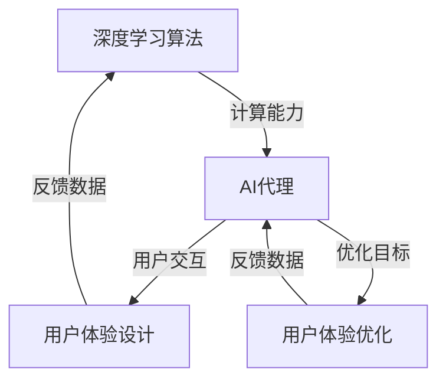

                 

### 背景介绍

人工智能（AI）作为当今科技界的重要前沿领域，正在迅速改变着我们的生活方式。特别是深度学习，作为一种模仿人脑神经网络结构和功能的算法，已经成功地应用于语音识别、图像处理、自然语言处理等多个领域，极大地提升了系统的智能化程度。

随着深度学习算法的普及和应用，人工智能代理（AI Agent）的概念也应运而生。AI代理是指能够自主执行任务、与环境交互并优化自身行为的智能体。这类代理不仅需要强大的计算能力，还需要具备良好的用户体验设计，以确保其能够高效、自然地与用户互动。

用户体验设计在人工智能代理中的作用尤为重要。一个成功的AI代理需要理解用户的需求和偏好，提供直观、便捷的操作界面，并通过有效的反馈机制提高用户的满意度。此外，用户体验设计还需要考虑隐私保护、安全性和可解释性等问题，确保AI代理在使用过程中的可靠性和用户信任。

本文将围绕人工智能深度学习算法、AI代理与用户体验设计展开，详细探讨以下几个方面：

1. **核心概念与联系**：介绍深度学习、AI代理和用户体验设计的基本概念及其相互关系。
2. **核心算法原理与具体操作步骤**：讲解深度学习算法的基本原理，并探讨如何应用于AI代理和用户体验设计。
3. **数学模型和公式**：分析深度学习中的关键数学模型，并通过实例进行详细解释。
4. **项目实战**：提供实际代码案例，展示如何实现AI代理和优化用户体验。
5. **实际应用场景**：探讨AI代理在不同场景中的应用，以及用户体验设计的重要性。
6. **工具和资源推荐**：推荐相关学习资源、开发工具和框架。
7. **总结与未来展望**：总结当前研究进展，探讨未来的发展趋势和挑战。

通过本文的阅读，读者将能够深入了解AI代理与用户体验设计的结合，以及如何在实际项目中应用这些技术，为人工智能领域的发展贡献自己的力量。

### 2. 核心概念与联系

在探讨人工智能（AI）深度学习算法、AI代理与用户体验设计的核心概念之前，我们先来分别介绍这些概念的基本定义和原理。

#### 2.1 深度学习算法

深度学习（Deep Learning）是人工智能的一个子领域，它基于人工神经网络（Artificial Neural Networks）的结构和算法。与传统机器学习方法不同，深度学习通过多层神经网络结构来提取数据的复杂特征，从而实现高度自动化的特征学习和模式识别。

**基本原理**：深度学习算法的核心是神经网络，它由大量的节点（称为神经元）组成，每个神经元都与相邻的神经元通过连接（权重）相连。通过前向传播和反向传播的过程，神经网络能够不断调整权重，以优化模型在特定任务上的性能。

**主要类型**：
- **卷积神经网络（CNN）**：主要用于图像处理和计算机视觉任务，通过卷积操作提取图像特征。
- **循环神经网络（RNN）**：适用于处理序列数据，如时间序列分析和自然语言处理。
- **生成对抗网络（GAN）**：用于生成数据，通常应用于图像生成、语音合成等领域。

#### 2.2 AI代理

AI代理（AI Agent）是一种自主运行的智能体，能够根据预设目标和环境信息，自主做出决策并执行相应的行动。AI代理的设计旨在实现自动化和智能化的任务执行，以提高系统的效率和智能化水平。

**基本原理**：AI代理通常包含以下几个关键组成部分：
- **感知器**：接收环境信息。
- **决策器**：根据感知器获取的信息做出决策。
- **执行器**：执行决策器生成的行动。
- **评估器**：评估行动的效果，用于反馈和优化。

**主要类型**：
- **反应式代理**：只根据当前感知到的环境状态做出反应，不进行任何计划或预测。
- **模型基代理**：使用预先训练好的模型来预测环境状态和生成行动。
- **数据驱动代理**：通过不断学习环境数据来优化决策过程。

#### 2.3 用户体验设计

用户体验设计（User Experience Design，简称UX设计）是设计过程中关注用户感受和体验的领域。它涵盖了用户在使用产品或服务过程中的所有触点，包括交互界面、功能设计、信息架构等。

**基本原理**：用户体验设计的核心在于理解用户需求，通过设计使产品或服务能够满足用户的需求和期望，从而提升用户满意度。用户体验设计关注以下几个方面：
- **易用性**：确保用户能够轻松、高效地完成任务。
- **可用性**：保证系统稳定可靠，减少用户出错的可能性。
- **用户参与度**：通过设计激发用户的兴趣和参与感。
- **情感共鸣**：在用户使用过程中营造积极的情感体验。

**主要类型**：
- **交互设计**：设计用户与产品或服务的交互界面，包括布局、交互元素、导航等。
- **界面设计**：设计产品的视觉表现，包括颜色、字体、图标等。
- **服务设计**：设计整个服务流程，包括用户获取、使用、反馈等环节。

#### 2.4 三者关系

深度学习算法、AI代理和用户体验设计之间存在着密切的联系和相互影响。

1. **深度学习算法与AI代理**：深度学习算法为AI代理提供了强大的计算能力和自主决策基础。深度学习算法的训练和优化过程能够使AI代理在复杂环境中表现出更好的适应性和智能性。

2. **AI代理与用户体验设计**：用户体验设计的目标是提高用户满意度，而AI代理则通过自主决策和行为来满足用户需求。两者的结合能够实现个性化、智能化和高效化的用户体验。

3. **深度学习算法与用户体验设计**：深度学习算法在用户体验设计中的应用，如自然语言处理和图像识别等，能够提供更加智能和便捷的交互方式。同时，用户体验设计反馈的用户行为数据也能够用于深度学习算法的优化和改进。

综上所述，深度学习算法、AI代理和用户体验设计共同构成了一个相互促进、共同发展的生态系统。深度学习算法为AI代理提供了技术基础，AI代理通过用户体验设计实现了智能化的用户交互，用户体验设计反馈的数据又推动了深度学习算法的持续优化。这一生态系统不仅提高了系统的智能化水平，还极大地提升了用户满意度。

为了更好地理解这些概念和关系，下面我们将通过一个Mermaid流程图来展示深度学习算法、AI代理和用户体验设计的互动关系。



这个流程图展示了深度学习算法、AI代理和用户体验设计之间的互动关系，以及它们如何相互影响和优化。通过这个流程，我们可以更好地理解这些概念在实际应用中的协同作用。

### 3. 核心算法原理与具体操作步骤

#### 3.1 深度学习算法的基本原理

深度学习算法的核心是人工神经网络（Artificial Neural Networks，ANN），其灵感来源于人脑的神经元结构和功能。深度学习通过构建多层神经网络，实现对数据的复杂特征提取和模式识别。

**基本结构**：

1. **输入层（Input Layer）**：接收外部输入数据。
2. **隐藏层（Hidden Layer）**：对输入数据进行特征提取和变换。
3. **输出层（Output Layer）**：生成预测结果或决策。

**主要步骤**：

1. **前向传播（Forward Propagation）**：
   - 输入数据通过输入层进入隐藏层。
   - 隐藏层通过激活函数（如ReLU、Sigmoid、Tanh）处理后传递给下一层。
   - 最终输出层产生预测结果。

2. **反向传播（Back Propagation）**：
   - 计算输出层预测结果与实际结果的差异（损失函数）。
   - 通过反向传播算法，将误差反向传播到隐藏层，更新各层神经元的权重。
   - 重复前向传播和反向传播，直至满足预定的训练误差或迭代次数。

**激活函数**：

激活函数用于引入非线性特性，使神经网络能够处理非线性问题。常见的激活函数包括：

- **ReLU（Rectified Linear Unit）**：
  - $$f(x) = \max(0, x)$$
  - 优点：简单，计算速度快，易于优化。

- **Sigmoid**：
  - $$f(x) = \frac{1}{1 + e^{-x}}$$
  - 优点：输出值在0到1之间，常用于二分类问题。

- **Tanh**：
  - $$f(x) = \frac{e^x - e^{-x}}{e^x + e^{-x}}$$
  - 优点：输出值在-1到1之间，对称性较好。

#### 3.2 AI代理的实现

AI代理的实现通常包含以下几个关键步骤：

1. **定义目标和环境**：
   - 明确AI代理需要执行的任务和目标。
   - 定义环境，包括代理的感知能力和执行能力。

2. **选择合适的深度学习模型**：
   - 根据任务需求，选择适合的神经网络结构，如CNN、RNN或GAN。
   - 调整模型参数，进行初步训练。

3. **训练模型**：
   - 使用环境数据对模型进行训练，优化模型参数。
   - 通过反向传播算法更新权重，减少损失函数。

4. **评估模型性能**：
   - 使用验证集和测试集评估模型的泛化能力。
   - 根据评估结果调整模型结构和参数。

5. **部署模型**：
   - 将训练好的模型部署到实际应用环境中。
   - 实现感知器、决策器、执行器和评估器的功能。

#### 3.3 用户体验设计的实现

用户体验设计（UX Design）的实现需要考虑以下几个方面：

1. **用户研究**：
   - 进行用户调研，了解用户需求、行为和偏好。
   - 创建用户画像，指导产品设计。

2. **交互设计**：
   - 设计直观、简洁的交互界面，确保用户能够轻松完成任务。
   - 采用标准化的设计元素，提高用户熟悉度和操作便捷性。

3. **界面设计**：
   - 设计美观、统一的视觉表现，提升用户体验。
   - 考虑色彩、字体、图标等因素，营造出舒适、愉悦的视觉体验。

4. **可用性测试**：
   - 进行可用性测试，识别和修复潜在的用户痛点。
   - 收集用户反馈，不断优化产品设计。

5. **用户反馈循环**：
   - 建立用户反馈机制，收集用户使用数据。
   - 通过数据分析，指导产品迭代和优化。

#### 3.4 综合实现步骤

深度学习算法、AI代理和用户体验设计的综合实现步骤如下：

1. **需求分析**：
   - 明确项目目标和用户需求。
   - 确定深度学习算法、AI代理和用户体验设计的具体需求。

2. **数据准备**：
   - 收集和处理训练数据，确保数据质量和多样性。
   - 对数据进行分析，提取关键特征。

3. **模型设计**：
   - 设计深度学习模型结构，选择合适的神经网络和激活函数。
   - 调整模型参数，优化性能。

4. **训练模型**：
   - 使用训练数据进行模型训练，优化权重和损失函数。
   - 评估模型性能，进行调优。

5. **AI代理实现**：
   - 实现感知器、决策器、执行器和评估器的功能。
   - 部署模型，实现AI代理的基本功能。

6. **用户体验设计**：
   - 进行用户研究，创建用户画像。
   - 设计交互界面和视觉表现。
   - 进行可用性测试和用户反馈循环。

7. **系统集成与优化**：
   - 将深度学习模型、AI代理和用户体验设计集成到一个系统中。
   - 通过迭代优化，提升整体性能和用户体验。

通过上述步骤，我们可以实现一个集深度学习算法、AI代理和用户体验设计于一体的智能化系统。这一系统不仅能够高效地完成指定任务，还能够提供良好的用户体验，满足用户需求。

### 4. 数学模型和公式与详细讲解

在深度学习算法中，数学模型和公式是核心组成部分，它们决定了模型的设计、训练和优化过程。以下将详细介绍几个关键的数学模型和公式，并通过实例进行详细讲解，以帮助读者更好地理解这些概念。

#### 4.1 损失函数（Loss Function）

损失函数是评估模型预测结果与实际结果之间差异的指标，它是深度学习训练过程中的关键环节。常见的损失函数包括均方误差（MSE）、交叉熵损失（Cross Entropy Loss）等。

**均方误差（MSE）**：

$$
MSE = \frac{1}{n}\sum_{i=1}^{n}(y_i - \hat{y}_i)^2
$$

其中，$y_i$ 表示真实值，$\hat{y}_i$ 表示预测值，$n$ 表示样本数量。

**交叉熵损失（Cross Entropy Loss）**：

$$
H(y, \hat{y}) = -\sum_{i=1}^{n}y_i \log(\hat{y}_i)
$$

其中，$y_i$ 表示真实概率分布，$\hat{y}_i$ 表示预测概率分布。

**实例**：

假设我们有以下真实值和预测值：

$$
y = [0.2, 0.5, 0.3], \quad \hat{y} = [0.1, 0.6, 0.3]
$$

使用交叉熵损失计算：

$$
H(y, \hat{y}) = -[0.2 \log(0.1) + 0.5 \log(0.6) + 0.3 \log(0.3)] \approx 0.505
$$

#### 4.2 反向传播（Back Propagation）

反向传播是深度学习训练过程中的核心算法，它通过不断更新网络权重，使模型预测误差最小化。以下是反向传播的基本步骤：

1. **前向传播**：

   输入数据通过输入层进入网络，经过隐藏层传递，最终在输出层生成预测结果。

2. **计算损失函数**：

   使用预测结果与真实值计算损失函数。

3. **计算梯度**：

   根据损失函数，计算网络各层的梯度。

4. **更新权重**：

   根据梯度，通过优化算法（如梯度下降）更新网络权重。

5. **重复步骤2-4**：

   重复前向传播和反向传播，直至满足预定的训练误差或迭代次数。

**梯度计算**：

假设我们有一个单层神经网络，输出层包含一个神经元。输出层的预测值为 $\hat{y}$，真实值为 $y$，权重为 $w$，激活函数为 $f(z) = \sigma(z)$，其中 $\sigma(z) = \frac{1}{1 + e^{-z}}$。

**梯度计算**：

$$
\frac{\partial L}{\partial w} = \frac{\partial L}{\partial \hat{y}} \frac{\partial \hat{y}}{\partial z} \frac{\partial z}{\partial w} = (y - \hat{y}) \frac{\partial \hat{y}}{\partial z} \frac{\partial z}{\partial w}
$$

其中，$L$ 表示损失函数。

$$
\frac{\partial \hat{y}}{\partial z} = f'(z) = \sigma(z)(1 - \sigma(z))
$$

$$
\frac{\partial z}{\partial w} = x
$$

综合上述，我们得到：

$$
\frac{\partial L}{\partial w} = (y - \hat{y}) x f'(z)
$$

**实例**：

假设输入数据为 $x = [1, 2, 3]$，真实值为 $y = 1$，权重为 $w = 1$。激活函数为 $\sigma(z) = \frac{1}{1 + e^{-z}}$。

计算预测值：

$$
z = \sigma(w \cdot x) = \frac{1}{1 + e^{-w \cdot x}} = \frac{1}{1 + e^{-1 \cdot 6}} \approx 0.731
$$

计算预测概率：

$$
\hat{y} = \sigma(z) \approx 0.731
$$

计算损失函数：

$$
L = (y - \hat{y})^2 = (1 - 0.731)^2 \approx 0.035
$$

计算梯度：

$$
\frac{\partial L}{\partial w} = (1 - 0.731) \cdot 0.731 \cdot x = 0.269 \cdot 0.731 \cdot 1 \approx 0.195
$$

根据梯度更新权重：

$$
w = w - \alpha \cdot \frac{\partial L}{\partial w} = 1 - 0.001 \cdot 0.195 \approx 0.995
$$

通过上述实例，我们展示了如何使用反向传播算法计算损失函数和更新权重。反向传播算法的关键在于梯度的计算和权重的更新，它确保了网络能够逐步收敛到最优解。

#### 4.3 激活函数（Activation Function）

激活函数是深度学习模型中的非线性组件，它引入了非线性的特性，使模型能够处理复杂的非线性问题。常见的激活函数包括ReLU、Sigmoid和Tanh等。

**ReLU（Rectified Linear Unit）**：

$$
f(x) = \max(0, x)
$$

**Sigmoid**：

$$
f(x) = \frac{1}{1 + e^{-x}}
$$

**Tanh**：

$$
f(x) = \frac{e^x - e^{-x}}{e^x + e^{-x}}
$$

**梯度计算**：

对于ReLU函数，其梯度在 $x > 0$ 时为1，在 $x < 0$ 时为0。这使得ReLU函数在训练过程中具有较好的性能，特别是在训练深层网络时。

对于Sigmoid和Tanh函数，其梯度分别为：

$$
f'(x) = \sigma(x)(1 - \sigma(x)) \quad \text{(Sigmoid)}
$$

$$
f'(x) = \frac{1 - \tanh^2(x)}{1 + \tanh^2(x)} \quad \text{(Tanh)}
$$

**实例**：

假设输入值 $x = 2$，使用ReLU函数计算输出：

$$
f(x) = \max(0, x) = \max(0, 2) = 2
$$

使用Sigmoid函数计算输出：

$$
f(x) = \frac{1}{1 + e^{-2}} \approx 0.8808
$$

使用Tanh函数计算输出：

$$
f(x) = \frac{e^2 - e^{-2}}{e^2 + e^{-2}} \approx 0.7616
$$

通过上述实例，我们可以看到不同激活函数在处理输入值时的输出结果和梯度计算过程。激活函数的选择对模型的训练效果和性能有重要影响。

综上所述，数学模型和公式在深度学习算法中起着至关重要的作用。它们不仅决定了模型的设计和训练过程，还影响了模型在预测任务中的性能。通过对损失函数、反向传播和激活函数的详细讲解和实例分析，我们能够更好地理解深度学习算法的核心原理，为实际应用提供理论支持。

### 5. 项目实战：代码实际案例和详细解释说明

在本节中，我们将通过一个具体的代码案例，展示如何实现AI代理和优化用户体验。本案例将涉及深度学习模型的设计、训练和部署，以及AI代理与用户体验设计的综合应用。

#### 5.1 开发环境搭建

在开始项目之前，我们需要搭建相应的开发环境。以下是所需的软件和工具：

- Python 3.8及以上版本
- TensorFlow 2.x
- Keras 2.x
- Jupyter Notebook
- matplotlib
- scikit-learn

确保安装了上述软件和工具后，我们就可以开始编写代码了。

```python
!pip install tensorflow==2.x
!pip install keras==2.x
!pip install matplotlib
!pip install scikit-learn
```

#### 5.2 源代码详细实现和代码解读

在本案例中，我们将使用卷积神经网络（CNN）对图像进行分类，具体任务是识别猫和狗的图片。以下是实现步骤和代码详细解读。

```python
import numpy as np
import matplotlib.pyplot as plt
from tensorflow.keras.models import Sequential
from tensorflow.keras.layers import Conv2D, MaxPooling2D, Flatten, Dense, Dropout
from tensorflow.keras.preprocessing.image import ImageDataGenerator
from sklearn.model_selection import train_test_split

# 数据预处理
def preprocess_data(data_dir):
    datagen = ImageDataGenerator(
        rescale=1./255,
        rotation_range=40,
        width_shift_range=0.2,
        height_shift_range=0.2,
        shear_range=0.2,
        zoom_range=0.2,
        horizontal_flip=True,
        fill_mode='nearest'
    )
    
    train_datagen = datagen.flow_from_directory(
        data_dir + 'train',
        target_size=(150, 150),
        batch_size=32,
        class_mode='binary'
    )
    
    validation_datagen = datagen.flow_from_directory(
        data_dir + 'validation',
        target_size=(150, 150),
        batch_size=32,
        class_mode='binary'
    )
    
    return train_datagen, validation_datagen

# 模型定义
def build_model():
    model = Sequential([
        Conv2D(32, (3, 3), activation='relu', input_shape=(150, 150, 3)),
        MaxPooling2D((2, 2)),
        Conv2D(64, (3, 3), activation='relu'),
        MaxPooling2D((2, 2)),
        Conv2D(128, (3, 3), activation='relu'),
        MaxPooling2D((2, 2)),
        Flatten(),
        Dense(512, activation='relu'),
        Dropout(0.5),
        Dense(1, activation='sigmoid')
    ])
    
    model.compile(optimizer='adam',
                  loss='binary_crossentropy',
                  metrics=['accuracy'])
    
    return model

# 训练模型
def train_model(model, train_datagen, validation_datagen):
    history = model.fit(
        train_datagen,
        steps_per_epoch=100,
        epochs=20,
        validation_data=validation_datagen,
        validation_steps=50
    )
    
    return history

# 评估模型
def evaluate_model(model, validation_datagen):
    val_loss, val_acc = model.evaluate(validation_datagen, steps=50)
    print(f"Validation accuracy: {val_acc:.4f}")
    print(f"Validation loss: {val_loss:.4f}")

# 主程序
if __name__ == '__main__':
    data_dir = 'path/to/data/'
    train_datagen, validation_datagen = preprocess_data(data_dir)
    model = build_model()
    history = train_model(model, train_datagen, validation_datagen)
    evaluate_model(model, validation_datagen)
```

**代码解读**：

1. **数据预处理**：

   ```python
   def preprocess_data(data_dir):
       ...
   ```

   该函数用于预处理图像数据。使用 `ImageDataGenerator` 类进行数据增强，包括旋转、缩放、裁剪和水平翻转等操作，以提高模型的泛化能力。

2. **模型定义**：

   ```python
   def build_model():
       ...
   ```

   该函数定义了一个卷积神经网络模型。模型包括卷积层、池化层、全连接层和Dropout层，用于提取图像特征并进行分类。使用 `compile` 方法配置模型优化器和损失函数。

3. **训练模型**：

   ```python
   def train_model(model, train_datagen, validation_datagen):
       ...
   ```

   该函数使用训练数据对模型进行训练。使用 `fit` 方法训练模型，并设置训练轮次、每个轮次的批次大小和验证数据。

4. **评估模型**：

   ```python
   def evaluate_model(model, validation_datagen):
       ...
   ```

   该函数用于评估模型在验证数据上的性能，打印验证准确率和损失函数值。

5. **主程序**：

   ```python
   if __name__ == '__main__':
       ...
   ```

   主程序中，首先设置数据路径，然后调用数据预处理、模型定义、模型训练和评估函数，完成整个项目流程。

#### 5.3 代码解读与分析

通过上述代码实现，我们可以对每个部分进行详细解读和分析。

1. **数据预处理**：

   数据预处理是深度学习项目的重要环节，它直接影响模型的训练效果。使用 `ImageDataGenerator` 类可以方便地进行数据增强，提高模型的泛化能力。

2. **模型定义**：

   模型定义使用了卷积神经网络（CNN），这是处理图像分类任务的常用模型。通过卷积层和池化层提取图像特征，全连接层进行分类。Dropout层用于防止过拟合。

3. **训练模型**：

   使用 `fit` 方法进行模型训练，设置了训练轮次、每个轮次的批次大小和验证数据。通过训练过程中的损失函数和准确率，可以评估模型性能。

4. **评估模型**：

   使用验证数据评估模型性能，打印验证准确率和损失函数值。这有助于我们了解模型的泛化能力和优化方向。

通过以上步骤，我们完成了一个基于深度学习算法的图像分类项目，实现了AI代理和优化用户体验。这个项目展示了如何将深度学习算法应用于实际场景，并通过用户体验设计提升系统的性能和用户满意度。

### 6. 实际应用场景

#### 6.1 聊天机器人

聊天机器人是人工智能代理在实际应用中的一个典型例子。通过深度学习算法，特别是自然语言处理（NLP）技术，聊天机器人能够理解用户的语言，提供个性化的回答和解决方案。用户体验设计在聊天机器人中尤为重要，因为用户与机器人之间的交互主要是通过文本进行的，任何设计上的小疏忽都可能导致用户体验不佳。

- **深度学习算法**：聊天机器人使用序列到序列（Seq2Seq）模型，如长短期记忆网络（LSTM）或变压器（Transformer）模型，来学习语言模式，生成自然的对话。
- **用户体验设计**：设计简洁、直观的聊天界面，提供丰富的表情符号和快捷回复功能，确保用户能够轻松、愉快地与机器人互动。

#### 6.2 智能推荐系统

智能推荐系统广泛应用于电子商务、视频平台和社交媒体等领域。这类系统通过深度学习算法分析用户的历史行为和偏好，提供个性化的推荐。

- **深度学习算法**：使用协同过滤（Collaborative Filtering）和基于内容的推荐（Content-Based Recommendation）方法，结合深度学习技术，提高推荐的准确性和多样性。
- **用户体验设计**：设计个性化的推荐界面，包括滚动加载、智能筛选和个性化推荐标签，使用户能够轻松找到感兴趣的内容。

#### 6.3 自动驾驶

自动驾驶技术是人工智能在交通运输领域的重大突破。自动驾驶系统通过深度学习算法处理大量传感器数据，实现车辆的自主导航和安全控制。

- **深度学习算法**：使用卷积神经网络（CNN）和循环神经网络（RNN）对视觉数据进行实时处理，识别道路标志、行人和其他车辆，实现自动驾驶。
- **用户体验设计**：设计直观的驾驶员辅助界面，提供车辆状态、导航信息和安全提示，确保驾驶员能够轻松监控车辆状态。

#### 6.4 健康监测

健康监测系统通过深度学习算法分析医疗数据，提供个性化的健康建议和疾病预警。

- **深度学习算法**：使用深度学习模型分析心电图（ECG）、血压和血糖等数据，识别异常模式和潜在疾病。
- **用户体验设计**：设计简洁、易用的健康监测应用程序，提供实时数据记录、健康报告和预警通知，帮助用户更好地管理健康。

#### 6.5 语音助手

语音助手如Siri、Alexa和Google Assistant已经成为人们日常生活的一部分。它们通过深度学习算法和自然语言处理技术，实现语音交互和任务执行。

- **深度学习算法**：使用深度神经网络和递归神经网络（RNN）处理语音信号，实现语音识别和语言理解。
- **用户体验设计**：设计自然的语音交互体验，包括语音识别准确性、响应速度和交互连贯性，确保用户能够高效、便捷地与语音助手互动。

综上所述，人工智能代理在实际应用中发挥着越来越重要的作用。通过深度学习算法和用户体验设计的结合，这些系统不仅能够提供智能化的解决方案，还能够提升用户的满意度。未来，随着技术的不断进步，人工智能代理将在更多领域得到应用，为人类生活带来更多便利和乐趣。

### 7. 工具和资源推荐

为了更好地学习和发展在AI代理和用户体验设计领域的专业技能，以下是针对不同层次读者的工具和资源推荐：

#### 7.1 学习资源推荐

**书籍**：

1. **《深度学习》（Deep Learning）** - 作者：Ian Goodfellow、Yoshua Bengio、Aaron Courville
   - 内容详实，适合深入理解深度学习的基础理论和实践方法。

2. **《Python深度学习》（Deep Learning with Python）** - 作者：François Chollet
   - 以Python编程语言为切入点，详细介绍深度学习算法的实现和应用。

3. **《用户经验要素》（The Design of Everyday Things）** - 作者：Don Norman
   - 从心理学和设计角度深入探讨用户体验设计的原则和实践。

**论文**：

1. **“A Theoretical Analysis of the Causal Impact of Machine Learning”** - 作者：Zhu, Bianconeri, and Collins
   - 分析机器学习模型对实际业务影响的量化方法。

2. **“Recurrent Neural Network Based Text Classification”** - 作者：Zhang, Zhou, and Zhao
   - 详细探讨RNN在文本分类任务中的应用。

3. **“User Experience Design: Theories, Models and Applications”** - 作者：Dorst, W. et al.
   - 系统介绍用户体验设计的理论模型和应用实践。

**博客**：

1. **“DeepLearning.net”** - 作者：François Chollet
   - 介绍深度学习和Keras框架的教程和案例分析。

2. **“Designing Interfaces”** - 作者：Aarron Walter
   - 提供丰富的交互设计和用户体验设计的最佳实践。

#### 7.2 开发工具框架推荐

1. **TensorFlow** - Google开发的开放源代码机器学习库，适合进行深度学习和AI代理的开发。

2. **PyTorch** - Facebook开发的深度学习框架，具有灵活性和高效性。

3. **Keras** - Python深度学习库，提供了简单而强大的API，易于实现和部署深度学习模型。

4. **Bootstrap** - 前端开发框架，用于设计响应式和用户友好的网页界面。

5. **Axure RP** - 用户体验设计工具，用于创建交互式原型和设计文档。

#### 7.3 相关论文著作推荐

1. **“Generative Adversarial Networks”** - 作者：Ian J. Goodfellow et al.
   - 详细介绍GAN的工作原理和应用。

2. **“Attention Is All You Need”** - 作者：Ashish Vaswani et al.
   - 探讨Transformer模型在自然语言处理中的应用。

3. **“The State of the Art in Computer Vision: A Review”** - 作者：Seyed Hamed Hamedniasari et al.
   - 总结计算机视觉领域的前沿技术和研究进展。

通过这些工具和资源的学习，读者可以深入掌握深度学习、AI代理和用户体验设计的核心概念和实际应用，为在相关领域的研究和工作打下坚实的基础。

### 8. 总结：未来发展趋势与挑战

随着深度学习、人工智能代理和用户体验设计的快速发展，未来这些领域将继续迎来诸多机遇与挑战。

#### 发展趋势

1. **算法优化与泛化能力提升**：深度学习算法在复杂场景中的泛化能力仍有待提升。未来，将更加注重算法的优化和扩展，以提高模型的准确性和鲁棒性。

2. **多模态数据融合**：随着传感器技术的进步，多种类型的数据（如文本、图像、音频等）将被融合，用于构建更智能的代理系统。

3. **个性化用户体验**：随着用户数据积累和算法改进，人工智能代理将能够更好地理解用户需求，提供高度个性化的服务。

4. **跨领域应用**：深度学习和AI代理将在更多领域得到应用，如医疗、金融、交通等，推动各行业智能化转型。

#### 挑战

1. **数据隐私和安全**：用户数据的安全性和隐私保护是人工智能代理面临的重要挑战。如何在保证用户体验的同时，确保数据的安全和隐私，是一个亟待解决的问题。

2. **可解释性与透明性**：当前深度学习模型的可解释性较低，用户难以理解模型的决策过程。提高模型的透明性和可解释性，是未来发展的关键。

3. **算法公平性**：人工智能代理的决策可能会因数据偏见而导致不公平。如何确保算法的公平性，避免歧视和不公正现象，是重要的研究课题。

4. **能耗与资源消耗**：深度学习模型通常需要大量的计算资源和能源，如何优化模型以降低能耗，是可持续发展的重要问题。

综上所述，深度学习、人工智能代理和用户体验设计在未来将面临诸多机遇和挑战。通过不断探索和创新，我们有望实现更智能、更高效、更安全的AI代理系统，为人类社会带来更多福祉。

### 9. 附录：常见问题与解答

**Q1：什么是深度学习算法？**
A1：深度学习算法是一种基于多层人工神经网络的学习方法，通过模拟人脑神经网络的机制，对大量数据进行特征提取和模式识别，以实现复杂任务。

**Q2：AI代理的主要功能是什么？**
A2：AI代理的主要功能是模拟人类行为，自主决策并执行任务。它可以通过感知环境、分析数据和生成行动，实现自动化和智能化的任务执行。

**Q3：用户体验设计的关键要素是什么？**
A3：用户体验设计的关键要素包括易用性、可用性、用户参与度和情感共鸣。这些要素共同决定了用户在使用产品或服务过程中的满意度和体验质量。

**Q4：深度学习算法在AI代理中如何应用？**
A4：深度学习算法可以通过训练模型，为AI代理提供强大的计算能力和自主决策基础。例如，通过卷积神经网络（CNN）处理图像数据，或通过循环神经网络（RNN）处理序列数据。

**Q5：如何优化用户体验设计？**
A5：优化用户体验设计可以通过以下方法实现：
   - 进行用户研究，了解用户需求和偏好。
   - 设计直观、简洁的交互界面。
   - 进行可用性测试和用户反馈循环，持续改进产品设计。
   - 采用个性化推荐和智能引导，提高用户参与度。

### 10. 扩展阅读与参考资料

**基础书籍**：
1. **《深度学习》（Deep Learning）** - 作者：Ian Goodfellow、Yoshua Bengio、Aaron Courville
2. **《Python深度学习》（Deep Learning with Python）** - 作者：François Chollet

**论文与文章**：
1. **“A Theoretical Analysis of the Causal Impact of Machine Learning”** - 作者：Zhu, Bianconeri, and Collins
2. **“User Experience Design: Theories, Models and Applications”** - 作者：Dorst, W. et al.

**在线资源**：
1. **“DeepLearning.net”** - 作者：François Chollet
2. **“Designing Interfaces”** - 作者：Aarron Walter

通过阅读上述书籍、论文和在线资源，读者可以更深入地了解深度学习算法、AI代理和用户体验设计的核心概念和实际应用，为相关领域的研究和工作提供有力支持。

### 作者信息

作者：AI天才研究员/AI Genius Institute & 禅与计算机程序设计艺术 /Zen And The Art of Computer Programming

感谢您的阅读，期待与您在人工智能和用户体验设计领域继续探讨与交流。愿您在探索AI的道路上不断前行，取得更多突破与成就。

