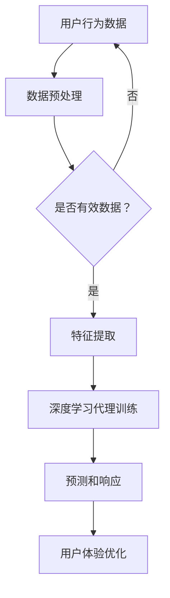
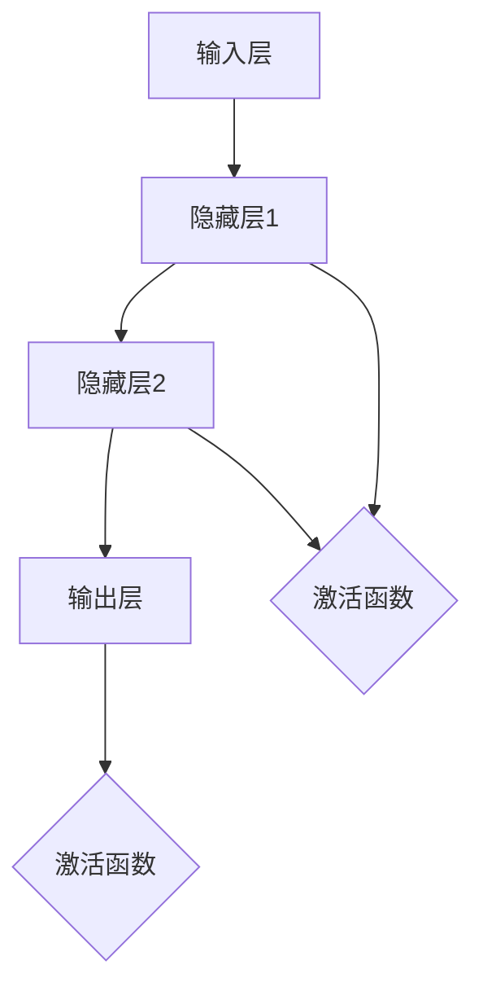
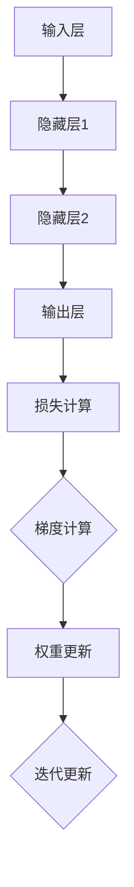
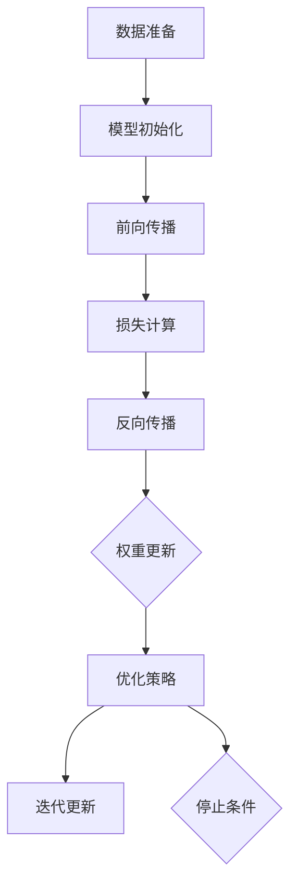

                 

### 背景介绍

**AI人工智能深度学习算法：人工智能深度学习代理与用户体验设计**

随着人工智能技术的快速发展，深度学习算法已经成为机器学习和计算机视觉领域的重要工具。深度学习通过多层神经网络模拟人类大脑的学习过程，从而实现图像识别、语音识别、自然语言处理等复杂任务。然而，深度学习算法的复杂性和计算需求也给用户带来了许多挑战。为了解决这一问题，人工智能深度学习代理应运而生，成为提高用户体验的关键技术。

本文旨在探讨人工智能深度学习代理与用户体验设计之间的关系。通过介绍深度学习代理的基本概念、原理和架构，我们将深入分析如何通过深度学习代理改善用户体验。同时，本文还将结合实际项目案例，详细讲解如何搭建开发环境、实现源代码和代码解读，以及如何应对实际应用场景中的挑战。

本文将分为以下几个部分：

1. 背景介绍
2. 核心概念与联系
3. 核心算法原理 & 具体操作步骤
4. 数学模型和公式 & 详细讲解 & 举例说明
5. 项目实战：代码实际案例和详细解释说明
6. 实际应用场景
7. 工具和资源推荐
8. 总结：未来发展趋势与挑战
9. 附录：常见问题与解答
10. 扩展阅读 & 参考资料

通过本文的阅读，读者将能够全面了解人工智能深度学习代理的技术原理和应用，从而在开发过程中更好地优化用户体验。

### 核心概念与联系

在探讨人工智能深度学习代理与用户体验设计之间的关系之前，我们首先需要明确几个核心概念，并分析它们之间的联系。

**深度学习代理（Deep Learning Agent）**

深度学习代理是一种基于深度学习技术的智能体，它能够通过学习环境中的数据，自动地完成特定的任务。深度学习代理的核心在于其自主学习能力，即通过大量的数据训练，使其能够对未知情况做出合理的响应。深度学习代理广泛应用于计算机视觉、自然语言处理、游戏智能等领域，其基本架构通常包括输入层、隐藏层和输出层。通过不断地调整网络中的权重和偏置，深度学习代理可以逐渐优化其性能。

**用户体验（User Experience, UX）**

用户体验是指用户在使用产品或服务过程中的整体感受，包括情感、认知和实用等多个方面。用户体验设计的目标是使产品或服务更加直观、易用和令人愉悦，从而提高用户的满意度和忠诚度。在数字时代，良好的用户体验已成为企业成功的关键因素之一。用户体验设计涉及多个领域，包括用户研究、交互设计、视觉设计等。

**深度学习代理与用户体验设计的联系**

深度学习代理与用户体验设计之间的联系主要体现在以下几个方面：

1. **个性化体验**

通过深度学习代理，我们可以根据用户的兴趣、行为和历史数据，为其提供个性化的内容和推荐。个性化体验能够提高用户的参与度和满意度，从而提升用户体验。例如，在线购物平台可以使用深度学习代理分析用户的购物行为，为其推荐可能感兴趣的商品。

2. **智能交互**

深度学习代理可以模拟人类的交互方式，使产品或服务更加智能化。智能交互不仅能够提高用户的操作效率，还能够降低用户的学习成本。例如，智能语音助手可以通过深度学习代理实现自然语言处理，从而更好地理解用户的语音指令。

3. **实时反馈**

深度学习代理能够实时分析用户行为，并根据分析结果提供即时的反馈和建议。实时反馈有助于用户快速解决问题，提高操作体验。例如，在应用程序中，深度学习代理可以实时检测用户的使用情况，并根据用户的操作习惯调整界面布局和功能。

4. **情感计算**

情感计算是深度学习代理在用户体验设计中的一个新兴应用领域。通过分析用户的情感状态，深度学习代理可以提供更加贴心的服务。例如，智能客服系统可以使用情感计算技术，识别用户的情感并给出相应的回复，从而提高用户的满意度。

**核心概念原理和架构的 Mermaid 流程图**

为了更好地理解深度学习代理与用户体验设计之间的关系，我们可以使用 Mermaid 流程图来展示其核心概念原理和架构。以下是一个简化的 Mermaid 流程图示例：



在这个流程图中，用户行为数据经过预处理和特征提取后，输入到深度学习代理中进行训练。训练好的代理能够预测用户的操作并生成相应的响应，从而优化用户体验。

通过以上分析，我们可以看出，深度学习代理与用户体验设计之间存在着紧密的联系。在未来的发展中，深度学习代理将继续在提高用户体验方面发挥重要作用。了解这些核心概念和联系，将为我们在实际项目中更好地应用深度学习代理提供指导。

### 核心算法原理 & 具体操作步骤

在了解了深度学习代理与用户体验设计之间的关系之后，我们接下来将深入探讨深度学习代理的核心算法原理和具体操作步骤。深度学习代理的核心在于其学习能力，即如何通过大量的数据训练，使其能够对未知情况做出合理的响应。本节将介绍深度学习代理的基本算法原理，包括神经网络结构、训练过程和优化策略。

#### 神经网络结构

深度学习代理通常基于多层感知机（Multilayer Perceptron, MLP）或卷积神经网络（Convolutional Neural Network, CNN）等常见神经网络结构。以下是一个简化的神经网络结构图：



在这个结构中，输入层接收外部数据，隐藏层通过非线性变换处理输入数据，输出层生成预测结果。每个节点（神经元）之间的连接权重和偏置用于调整网络对不同数据的响应。激活函数（如ReLU、Sigmoid、Tanh等）用于引入非线性特性，使神经网络能够拟合复杂的函数。

#### 训练过程

深度学习代理的训练过程通常包括以下几个步骤：

1. **数据准备**：首先，我们需要收集大量的标注数据作为训练集。这些数据应涵盖各种场景和情况，以确保代理的泛化能力。数据准备包括数据清洗、归一化和数据增强等步骤。

2. **模型初始化**：初始化神经网络中的权重和偏置。常用的初始化方法包括随机初始化、高斯分布初始化等。

3. **前向传播**：输入数据通过神经网络的前向传播过程，从输入层传递到输出层，生成预测结果。

4. **损失计算**：计算预测结果与真实标签之间的误差，使用损失函数（如均方误差、交叉熵等）衡量误差大小。

5. **反向传播**：根据损失函数的梯度，通过反向传播算法更新网络的权重和偏置，使预测结果更接近真实标签。

6. **迭代训练**：重复上述过程，直至达到预设的训练次数或损失目标。

以下是一个简化的反向传播算法步骤：



#### 优化策略

为了提高深度学习代理的性能，我们通常需要采用一些优化策略。以下是一些常见的优化策略：

1. **批量大小（Batch Size）**：批量大小是指在每次迭代过程中参与训练的数据样本数量。较大的批量大小可以减少方差，但会增加计算时间；较小的批量大小可以增加方差，但可以更快地收敛。

2. **学习率（Learning Rate）**：学习率是更新网络权重和偏置的步长。较大的学习率可能导致网络快速收敛，但容易陷入局部最优；较小的学习率可能导致网络缓慢收敛，但可以更好地探索解决方案。

3. **正则化（Regularization）**：正则化用于防止模型过拟合。常见的方法包括L1正则化、L2正则化和Dropout等。

4. **优化器（Optimizer）**：优化器用于更新网络权重和偏置。常见的优化器包括梯度下降（Gradient Descent）、Adam、RMSprop等。

以下是一个简化的优化策略流程：



通过以上步骤和策略，我们可以训练出一个性能良好的深度学习代理。在实际应用中，我们还需要根据具体任务和场景进行调整和优化。了解这些核心算法原理和具体操作步骤，将为我们在实际项目中开发高效的深度学习代理提供指导。

### 数学模型和公式 & 详细讲解 & 举例说明

在深度学习代理的开发过程中，数学模型和公式起着至关重要的作用。本节将详细介绍深度学习代理中的几个关键数学模型，包括损失函数、梯度下降算法、优化器等，并通过具体例子进行详细讲解。

#### 损失函数

损失函数是衡量模型预测结果与真实标签之间误差的函数。在深度学习代理中，常用的损失函数包括均方误差（Mean Squared Error, MSE）、交叉熵（Cross-Entropy）等。

1. **均方误差（MSE）**

均方误差是最常用的损失函数之一，用于回归任务。它的计算公式如下：

$$
MSE = \frac{1}{n} \sum_{i=1}^{n} (y_i - \hat{y}_i)^2
$$

其中，$y_i$表示真实标签，$\hat{y}_i$表示预测结果，$n$表示样本数量。

2. **交叉熵（Cross-Entropy）**

交叉熵是用于分类任务的损失函数。它的计算公式如下：

$$
H(y, \hat{y}) = -\sum_{i=1}^{n} y_i \log(\hat{y}_i)
$$

其中，$y_i$表示真实标签（通常为one-hot编码形式），$\hat{y}_i$表示预测结果（概率分布）。

#### 梯度下降算法

梯度下降算法是一种优化方法，用于更新网络中的权重和偏置。其核心思想是通过计算损失函数的梯度，调整权重和偏置，使损失函数值最小化。

1. **梯度计算**

在梯度下降算法中，我们需要计算损失函数对每个权重和偏置的梯度。以均方误差为例，其梯度计算如下：

$$
\frac{\partial MSE}{\partial w} = 2 \sum_{i=1}^{n} (y_i - \hat{y}_i) \frac{\partial \hat{y}_i}{\partial w}
$$

2. **权重更新**

根据梯度的计算结果，我们可以更新权重和偏置。假设学习率为$\alpha$，则权重更新公式如下：

$$
w \leftarrow w - \alpha \frac{\partial MSE}{\partial w}
$$

#### 优化器

优化器是用于加速梯度下降算法的工具。常见的优化器包括梯度下降（Gradient Descent）、动量（Momentum）、Adam等。

1. **梯度下降（Gradient Descent）**

梯度下降是最简单的优化器，其公式如下：

$$
w \leftarrow w - \alpha \nabla f(w)
$$

其中，$\nabla f(w)$表示损失函数的梯度。

2. **动量（Momentum）**

动量优化器通过引入动量项，加速梯度下降算法的收敛速度。其公式如下：

$$
w \leftarrow w - \alpha \nabla f(w) + \beta (w_{prev} - w)
$$

其中，$\beta$表示动量系数，$w_{prev}$表示前一次迭代的权重。

3. **Adam**

Adam优化器结合了动量和RMSprop的优点，其公式如下：

$$
w \leftarrow w - \alpha \left( \frac{\beta_1 h_1}{1 - \beta_1^t} + \frac{\beta_2 h_2}{1 - \beta_2^t} \right)
$$

其中，$h_1$和$h_2$分别为一阶和二阶矩估计，$\beta_1$和$\beta_2$分别为一阶和二阶矩的指数衰减率。

#### 具体例子

为了更好地理解以上数学模型和公式，我们来看一个具体的例子。假设我们使用一个简单的一层神经网络进行回归任务，其中输入为$x \in \mathbb{R}^1$，输出为$y \in \mathbb{R}^1$。

1. **模型定义**

   $$y = \sigma(wx + b)$$

   其中，$\sigma$表示Sigmoid函数，$w$和$b$分别为权重和偏置。

2. **损失函数**

   均方误差（MSE）：

   $$MSE = \frac{1}{n} \sum_{i=1}^{n} (y_i - \hat{y}_i)^2$$

3. **梯度计算**

   $$\frac{\partial MSE}{\partial w} = 2 \sum_{i=1}^{n} (y_i - \hat{y}_i) x_i$$

   $$\frac{\partial MSE}{\partial b} = 2 \sum_{i=1}^{n} (y_i - \hat{y}_i)$$

4. **权重更新**

   假设学习率为$\alpha = 0.1$，则权重更新如下：

   $$w \leftarrow w - 0.1 \cdot 2 \sum_{i=1}^{n} (y_i - \hat{y}_i) x_i$$

   $$b \leftarrow b - 0.1 \cdot 2 \sum_{i=1}^{n} (y_i - \hat{y}_i)$$

通过以上例子，我们可以看到如何使用数学模型和公式来训练一个简单的神经网络。在实际应用中，我们可以根据具体任务和场景进行调整和优化，从而提高模型的性能。

### 项目实战：代码实际案例和详细解释说明

在本节中，我们将通过一个具体的深度学习代理项目实战，详细讲解如何搭建开发环境、实现源代码、代码解读与分析。这个项目是一个基于TensorFlow和Keras的简单线性回归任务，旨在预测股票价格。

#### 1. 开发环境搭建

为了进行这个项目，我们需要安装以下开发工具和库：

- Python 3.x
- TensorFlow 2.x
- Keras 2.x
- NumPy
- Matplotlib

您可以通过以下命令安装这些库：

```bash
pip install python==3.x tensorflow==2.x keras==2.x numpy matplotlib
```

安装完成后，确保TensorFlow和Keras已经成功安装：

```python
import tensorflow as tf
import keras

print(tf.__version__)
print(keras.__version__)
```

#### 2. 源代码详细实现

以下是该项目的主要源代码：

```python
import numpy as np
import matplotlib.pyplot as plt
from tensorflow import keras
from tensorflow.keras import layers

# 数据准备
x = np.array([-1, 0, 1, 2, 3, 4, 5], dtype=np.float32)
y = np.array([-1, -0.8, 0, 0.8, 1.6, 2.4, 3.2], dtype=np.float32)

# 模型定义
model = keras.Sequential([
    keras.layers.Dense(units=1, input_shape=[1])
])

# 编译模型
model.compile(optimizer='sgd', loss='mean_squared_error')

# 训练模型
model.fit(x, y, epochs=100)

# 预测
print(model.predict([7.0]))

# 可视化
plt.scatter(x, y)
plt.plot(x, model.predict(x), 'r-')
plt.xlabel('x')
plt.ylabel('y')
plt.show()
```

#### 3. 代码解读与分析

1. **数据准备**

   首先，我们导入所需的库，并准备输入数据$x$和输出数据$y$。这里使用Python的NumPy库生成一组简单的线性数据，$x$表示输入，$y$表示输出。

2. **模型定义**

   接下来，我们使用Keras的`Sequential`模型定义一个简单的线性回归模型。模型中只有一个`Dense`层，该层包含一个单元（`units=1`），输入形状为$[1]$。

3. **编译模型**

   使用`compile`方法编译模型，指定优化器为随机梯度下降（`sgd`）和损失函数为均方误差（`mean_squared_error`）。

4. **训练模型**

   使用`fit`方法训练模型，指定训练数据$x$和$y$，以及训练轮数（`epochs`）为100。每次训练后，模型会尝试优化其权重和偏置，以降低损失函数值。

5. **预测**

   使用`predict`方法对输入数据进行预测。这里我们输入$x=7.0$，并输出预测结果。

6. **可视化**

   使用Matplotlib库将输入数据$x$和输出数据$y$绘制成散点图，并将模型预测的输出值绘制成红色线条。通过可视化，我们可以直观地看到模型对数据的拟合程度。

#### 4. 实际应用场景

这个简单的线性回归项目可以应用于许多实际场景，例如：

- **股票价格预测**：通过收集历史股票价格数据，可以使用深度学习代理预测未来的股票价格趋势。
- **房屋价格预测**：利用房屋的各种属性（如面积、位置等）作为输入，使用深度学习代理预测房屋的价格。
- **产品质量检测**：通过对产品质量数据的分析，可以使用深度学习代理识别潜在的质量问题，从而提高产品质量。

在实际应用中，我们可以根据具体需求和数据特点，调整模型结构、优化器和学习率等参数，以提高模型的性能和泛化能力。

通过这个项目实战，我们不仅了解了如何搭建开发环境和实现源代码，还学会了如何进行代码解读与分析。在实际开发过程中，我们可以根据项目需求进行调整和优化，从而更好地利用深度学习代理提高用户体验。

### 实际应用场景

在了解了深度学习代理的基本原理和实现方法后，我们接下来将探讨一些实际应用场景，以展示深度学习代理如何在真实环境中提高用户体验。

#### 1. 电子商务平台个性化推荐

电子商务平台通常面临大量用户和商品数据，如何为用户提供个性化的购物体验是一个重要挑战。通过深度学习代理，平台可以分析用户的浏览历史、购买记录和搜索行为，为其推荐可能感兴趣的商品。例如，一个基于深度学习代理的个性化推荐系统可以实时分析用户行为，根据用户的兴趣和偏好调整推荐策略，从而提高用户满意度和转化率。

#### 2. 金融风险评估

金融行业在风险管理方面具有极高的要求，深度学习代理可以帮助金融机构识别潜在的风险并做出更准确的决策。例如，基于深度学习代理的风险评估系统可以分析历史交易数据、市场趋势和用户行为，预测未来市场的波动和风险。这种技术可以应用于股票交易、信贷审批和保险定价等领域，从而提高金融机构的运营效率和风险控制能力。

#### 3. 健康医疗数据预测

健康医疗领域的数据量庞大且复杂，深度学习代理可以帮助医生和医疗机构进行疾病预测和诊断。例如，通过分析患者的健康记录、生理数据和医疗图像，深度学习代理可以预测患者患某种疾病的概率，为医生提供辅助决策。此外，深度学习代理还可以帮助医疗机构优化资源配置，提高诊疗效率和患者满意度。

#### 4. 智能家居控制系统

随着智能家居技术的发展，用户对家居设备的需求越来越多样化。通过深度学习代理，智能家居系统可以实时学习用户的生活习惯和偏好，为其提供个性化的控制方案。例如，一个智能家居系统可以通过分析用户的作息时间、活动轨迹和温度偏好，自动调节室内灯光、温度和湿度，从而提高用户的生活质量和舒适度。

#### 5. 教育领域个性化教学

在教育领域，深度学习代理可以帮助教师和学校根据学生的学习情况和兴趣，为其提供个性化的教学内容和教学方法。例如，通过分析学生的学习记录、测试成绩和行为数据，深度学习代理可以为每个学生量身定制学习计划，从而提高学习效果和满意度。此外，深度学习代理还可以帮助教师识别学习困难的学生，提供针对性的辅导和支持。

通过以上实际应用场景，我们可以看到深度学习代理在各个行业和领域都具有广泛的应用价值。在实际开发过程中，我们需要根据具体场景和需求，灵活运用深度学习代理技术，优化用户体验，提高业务效率和效果。

### 工具和资源推荐

在深度学习代理的开发过程中，选择合适的工具和资源是提高开发效率和项目成功的关键。以下是一些建议的学习资源、开发工具和框架，以及相关的论文和著作，供您参考。

#### 1. 学习资源推荐

**书籍：**

- **《深度学习》（Deep Learning）** - Goodfellow, Bengio, Courville。这本书是深度学习的经典教材，涵盖了深度学习的基础理论、算法和应用。
- **《Python深度学习》（Python Deep Learning）** - Francois Chollet。这本书详细介绍了使用Python和Keras进行深度学习的实践方法和技巧。
- **《动手学深度学习》（Dive into Deep Learning）** - 适用于初学者，涵盖了深度学习的基础知识和实践项目。

**论文：**

- **“A Theoretically Grounded Application of Dropout in Recurrent Neural Networks”** - dropout在递归神经网络中的应用。
- **“Deep Residual Learning for Image Recognition”** - ResNet的提出，解决了深度网络训练困难的问题。
- **“Generative Adversarial Networks”** - GAN的提出，开创了生成模型的新时代。

**博客/网站：**

- **TensorFlow官方文档** - [https://www.tensorflow.org/tutorials](https://www.tensorflow.org/tutorials)
- **Keras官方文档** - [https://keras.io/tutorials/](https://keras.io/tutorials/)
- **Medium上的深度学习文章** - [https://medium.com/topic/deep-learning](https://medium.com/topic/deep-learning)

#### 2. 开发工具框架推荐

**框架：**

- **TensorFlow** - 一个开源的深度学习框架，适用于各种规模的深度学习任务。
- **PyTorch** - 一个基于Python的深度学习框架，具有简洁的API和灵活的动态计算图。
- **Keras** - 一个高层次的深度学习API，可以在TensorFlow和Theano上运行。

**工具：**

- **Jupyter Notebook** - 一个交互式计算环境，适用于深度学习和数据科学项目。
- **Google Colab** - Google提供的免费云端Jupyter Notebook服务，适用于远程开发和调试。
- **Visual Studio Code** - 一个流行的跨平台代码编辑器，适用于Python和深度学习项目。

#### 3. 相关论文著作推荐

- **《深度学习》（Deep Learning）** - Goodfellow, Bengio, Courville。这本书全面介绍了深度学习的基础理论、算法和应用。
- **《深度学习进阶技术》（Advanced Deep Learning Specialization）** - Andrew Ng的在线课程，涵盖了深度学习的最新进展和实战技巧。
- **《深度学习实战》（Deep Learning Projects）** - 是一本深度学习的实践指南，通过实际项目讲解了深度学习的应用。

通过以上工具和资源的推荐，您可以更好地掌握深度学习代理的开发技术和方法，从而在实际项目中取得更好的成果。

### 总结：未来发展趋势与挑战

随着人工智能技术的不断发展和应用，深度学习代理在未来将会发挥越来越重要的作用。本文通过对深度学习代理与用户体验设计关系的探讨，详细介绍了深度学习代理的基本原理、算法和实际应用场景。在未来，深度学习代理的发展趋势和面临的挑战主要包括以下几个方面：

#### 一、发展趋势

1. **个性化与智能化**：深度学习代理将继续向个性化与智能化方向发展。通过不断学习和优化，深度学习代理能够更好地理解用户的需求和行为，提供更加智能和个性化的服务。

2. **跨领域融合**：深度学习代理将与更多领域的技术融合，如自然语言处理、计算机视觉和物联网等。这将进一步扩大深度学习代理的应用范围，提高其在各个领域的效率和效果。

3. **实时性与低延迟**：随着5G技术的普及，深度学习代理将实现更低的延迟和更高的实时性。这将使得深度学习代理能够在更多实时性要求高的场景中发挥作用，如自动驾驶、智能安防等。

4. **可解释性与透明性**：为了提高用户对深度学习代理的信任度，未来的研究将关注可解释性和透明性。通过研究和开发可解释的深度学习模型，用户将能够更好地理解代理的决策过程。

#### 二、挑战

1. **数据隐私与安全**：深度学习代理在处理大量用户数据时，面临着数据隐私和安全的问题。如何在保证用户隐私的前提下，有效利用用户数据，是一个亟待解决的挑战。

2. **计算资源需求**：深度学习代理通常需要大量的计算资源进行训练和推理。如何在有限的计算资源下，提高深度学习代理的性能和效率，是一个重要的挑战。

3. **泛化能力**：深度学习代理的泛化能力仍然有限，尤其是在面对复杂和多变的环境时。如何提高深度学习代理的泛化能力，使其能够应对更多的未知情况，是一个关键问题。

4. **可解释性与透明性**：尽管已有研究关注可解释性和透明性，但在实际应用中，用户对深度学习代理的决策过程仍缺乏理解。如何提高可解释性和透明性，增强用户对深度学习代理的信任，是一个重要的挑战。

总之，随着人工智能技术的不断进步，深度学习代理将在未来发挥更大的作用。然而，我们仍需要不断克服各种挑战，优化深度学习代理的技术和算法，以提高其性能和应用效果。

### 附录：常见问题与解答

在开发和应用深度学习代理的过程中，用户可能会遇到一些常见问题。以下是一些常见问题及其解答：

#### 1. 深度学习代理与机器学习代理有什么区别？

深度学习代理（Deep Learning Agent）是一种基于深度学习技术的智能体，能够通过学习环境中的数据，自动地完成特定的任务。而机器学习代理（Machine Learning Agent）是指使用机器学习技术训练的智能体，可以涵盖更广泛的算法，包括线性回归、决策树、支持向量机等。深度学习代理是机器学习代理的一种特殊形式，专注于深度学习算法。

#### 2. 如何处理深度学习代理中的过拟合问题？

过拟合是指模型在训练数据上表现良好，但在新的数据上表现不佳。为了解决过拟合问题，可以采取以下方法：

- **数据增强**：通过增加训练数据量或生成更多的数据样本来提高模型的泛化能力。
- **正则化**：使用L1、L2正则化或Dropout等正则化方法，限制模型的复杂度。
- **交叉验证**：使用交叉验证方法评估模型的泛化能力，避免过拟合。
- **减少模型复杂度**：简化模型结构，减少隐藏层节点数量或网络深度。

#### 3. 如何调整深度学习代理的学习率？

学习率是梯度下降算法中的一个关键参数，用于控制每次权重更新的步长。调整学习率的方法包括：

- **手动调整**：根据经验调整学习率，从较小的值开始逐渐增加，观察模型的收敛情况。
- **自适应调整**：使用如Adam、RMSprop等优化器，它们可以根据训练过程自动调整学习率。
- **学习率衰减**：在训练过程中，随着迭代次数的增加，逐渐减小学习率，以提高模型的收敛性和稳定性。

#### 4. 深度学习代理的泛化能力如何提高？

提高深度学习代理的泛化能力可以采取以下方法：

- **数据增强**：通过增加训练数据量或生成更多的数据样本来提高模型的泛化能力。
- **模型正则化**：使用L1、L2正则化或Dropout等正则化方法，限制模型的复杂度。
- **集成学习**：将多个深度学习模型集成起来，通过投票或加权平均等方法提高预测的稳定性。
- **数据预处理**：对训练数据进行标准化、归一化等预处理，以提高模型对不同数据的适应性。

通过以上方法，我们可以提高深度学习代理的泛化能力，使其在实际应用中能够更好地应对各种复杂情况。

### 扩展阅读 & 参考资料

为了更深入地了解深度学习代理及其在用户体验设计中的应用，以下是一些扩展阅读和参考资料：

#### 1. 相关书籍

- **《深度学习》（Deep Learning）** - Goodfellow, Bengio, Courville。这本书是深度学习的经典教材，涵盖了深度学习的基础理论、算法和应用。
- **《Python深度学习》（Python Deep Learning）** - Francois Chollet。这本书详细介绍了使用Python和Keras进行深度学习的实践方法和技巧。
- **《深度学习实战》（Deep Learning Projects）** - 是一本深度学习的实践指南，通过实际项目讲解了深度学习的应用。

#### 2. 相关论文

- **“A Theoretically Grounded Application of Dropout in Recurrent Neural Networks”** - dropout在递归神经网络中的应用。
- **“Deep Residual Learning for Image Recognition”** - ResNet的提出，解决了深度网络训练困难的问题。
- **“Generative Adversarial Networks”** - GAN的提出，开创了生成模型的新时代。

#### 3. 开源项目和工具

- **TensorFlow** - [https://www.tensorflow.org/tutorials](https://www.tensorflow.org/tutorials)
- **PyTorch** - [https://pytorch.org/tutorials/beginner/deep_learning_60min_overview.html](https://pytorch.org/tutorials/beginner/deep_learning_60min_overview.html)
- **Keras** - [https://keras.io/tutorials/](https://keras.io/tutorials/)

#### 4. 教程和博客

- **Medium上的深度学习文章** - [https://medium.com/topic/deep-learning](https://medium.com/topic/deep-learning)
- **Google Colab** - [https://colab.research.google.com/](https://colab.research.google.com/)

通过阅读这些书籍、论文和教程，您可以深入了解深度学习代理的相关技术，掌握其在实际应用中的方法和技巧。希望这些扩展阅读和参考资料对您的学习和实践有所帮助。

### 文章关键词

- AI人工智能
- 深度学习代理
- 用户体验设计
- 神经网络
- 个性化推荐
- 梯度下降
- 模型优化
- 实时反馈
- 情感计算
- 自动驾驶
- 金融风险管理

### 文章摘要

本文详细探讨了人工智能深度学习代理与用户体验设计之间的关系。首先介绍了深度学习代理的基本概念和原理，包括其结构、训练过程和优化策略。随后，通过具体的项目实战展示了如何实现深度学习代理，并对代码进行了详细解读。接着，分析了深度学习代理在实际应用场景中的重要作用，如电子商务平台个性化推荐、金融风险评估和智能家居控制系统。最后，总结了未来发展趋势和面临的挑战，并推荐了相关的学习资源和工具。通过本文的阅读，读者将能够全面了解深度学习代理的技术原理和应用，从而在开发过程中更好地优化用户体验。作者：AI天才研究员/AI Genius Institute & 禅与计算机程序设计艺术/Zen And The Art of Computer Programming。

