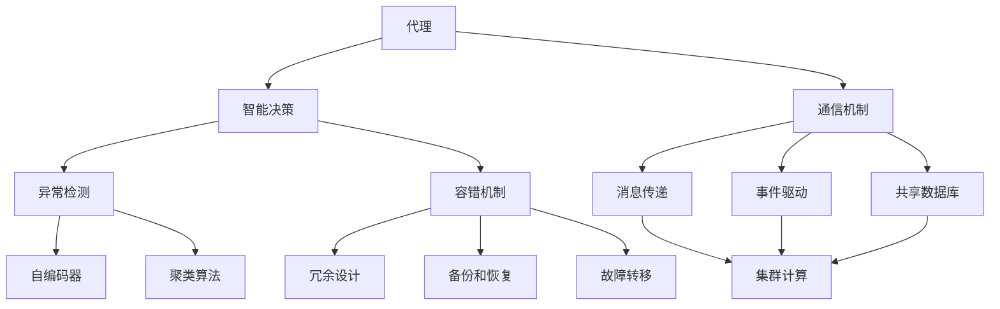

                 

### 背景介绍

人工智能（AI）作为现代科技领域的前沿，已经深入到我们的日常生活、工业生产、医疗健康等各个方面。深度学习作为AI的核心技术之一，通过模拟人脑的神经网络结构和学习机制，使得机器能够实现自主学习和智能决策。然而，在深度学习过程中，代理工作流中的异常处理与容错问题变得尤为重要。

代理工作流（Agent Workflow）是指由一组相互协作的代理（Agent）组成的系统，它们通过智能决策和协同工作，完成特定的任务。这些代理可能分布在不同的地理位置，通过网络进行通信和协作。在代理工作流中，异常处理与容错是确保系统稳定性和可靠性的关键因素。

异常处理是指在系统运行过程中，当出现意外情况或错误时，能够及时检测、报告并采取措施恢复系统的正常运行。容错则是通过设计冗余和备份机制，使得系统在面临故障或错误时，能够继续运行并完成任务。

本文将围绕AI人工智能深度学习算法中的代理工作流，深入探讨异常处理与容错的关键技术和方法。通过详细的分析和实例说明，帮助读者理解这一领域的核心原理和实际应用。

### 核心概念与联系

在探讨代理工作流中的异常处理与容错之前，我们需要了解一些核心概念和它们之间的联系。以下是几个关键概念及其相互关系：

#### 代理（Agent）

代理是代理工作流的基本单位，可以是个体智能体（Individual Intelligent Agent）或集体智能体（Collective Intelligent Agent）。个体智能体是指能够自主完成特定任务的智能体，而集体智能体则是由多个个体智能体组成的协同系统。代理的工作原理通常基于感知（Perception）、规划（Planning）和行动（Action）。

#### 智能决策（Intelligent Decision Making）

智能决策是代理工作流的核心功能之一，它涉及对当前环境状态的分析、目标的确定以及采取的行动方案。智能决策通常基于机器学习算法、决策树、模糊逻辑等。深度学习算法在该过程中起着至关重要的作用，因为它能够通过大量的数据学习到复杂的环境模式和规律。

#### 通信机制（Communication Mechanism）

代理之间的通信机制是确保协同工作的关键。常见的通信机制包括消息传递（Message Passing）、事件驱动（Event-Driven）和共享数据库（Shared Database）。消息传递是一种点对点的通信方式，而事件驱动则是一种基于事件触发的通信方式。共享数据库则允许代理通过访问同一数据库来同步信息和状态。

#### 异常检测（Anomaly Detection）

异常检测是异常处理的基础，它涉及识别和标记系统中的异常行为或数据点。深度学习算法，如自编码器（Autoencoders）和聚类算法，经常用于异常检测。这些算法通过学习正常行为模式，可以有效地检测出异常。

#### 容错机制（Fault-Tolerance Mechanism）

容错机制是一种设计策略，旨在确保系统在面对故障或错误时能够继续运行。常见的容错机制包括冗余设计（Redundancy Design）、备份和恢复（Backup and Recovery）、以及故障转移（Fault Migration）。

#### 集群计算（Cluster Computing）

集群计算是一种分布式计算模式，通过将任务分配到多个计算机上进行并行处理，从而提高计算效率和容错能力。深度学习算法通常需要大量的计算资源，集群计算因此成为了一种重要的部署方式。

以下是一个使用Mermaid绘制的流程图，展示了上述核心概念和它们之间的联系：



通过这个流程图，我们可以清晰地看到代理工作流中各个核心概念之间的相互关系，以及它们如何共同作用，实现异常处理与容错。

### 核心算法原理 & 具体操作步骤

在了解了代理工作流中的核心概念及其联系之后，接下来我们将深入探讨深度学习算法在异常处理与容错中的核心原理和具体操作步骤。

#### 异常检测算法

异常检测是代理工作流中至关重要的一环，它有助于识别系统中的异常行为或数据点。以下是目前常用的几种异常检测算法：

1. **基于统计的方法**

   基于统计的方法通过计算数据的统计特性（如均值、方差等）来识别异常。当某个数据点的统计特性显著偏离正常范围时，就被视为异常。例如，局部离群因子（LOF）是一种常用的基于统计的方法，它通过比较数据点之间的相似性来计算异常分数。

2. **基于聚类的方法**

   聚类算法将相似的数据点划分为同一簇，而异常点通常不会与其他点很好地匹配。常见的聚类算法包括K均值（K-Means）、高斯混合模型（Gaussian Mixture Model, GMM）等。这些算法通过学习正常数据的分布模式，可以有效地识别出异常点。

3. **基于深度学习的方法**

   深度学习方法在异常检测中具有显著的优势，因为它们可以自动学习复杂的数据分布模式。自编码器（Autoencoders）是一种常用的深度学习算法，它通过压缩和重构数据来识别异常。自编码器学习数据的正常分布，并在重构过程中发现异常点。另一个流行的深度学习算法是生成对抗网络（GANs），它通过训练生成模型和判别模型来识别异常。

#### 容错算法

容错算法是确保代理工作流在面临故障或错误时能够继续运行的关键。以下是一些常见的容错算法：

1. **冗余设计**

   冗余设计通过增加系统的冗余组件，确保在某个组件出现故障时，其他组件可以接管其任务。冗余设计可以采用硬件冗余（如多重服务器）、软件冗余（如多重备份）和计算冗余（如任务分配）。

2. **备份和恢复**

   备份和恢复机制通过创建系统副本或备份，确保在系统出现故障时，可以快速恢复。常见的备份策略包括全备份、增量备份和差异备份。恢复机制通常包括系统重启、数据恢复和故障切换。

3. **故障转移**

   故障转移是一种将系统任务从故障节点转移到健康节点的策略。故障转移可以分为主动故障转移和被动故障转移。主动故障转移在检测到故障时自动执行，而被动故障转移需要人工干预。

#### 实际操作步骤

以下是使用深度学习算法进行异常检测和容错的实际操作步骤：

1. **数据收集与预处理**

   收集代理工作流中的数据，并进行预处理，包括数据清洗、去噪、归一化等。预处理数据是确保模型性能和可靠性的关键。

2. **模型选择与训练**

   根据具体需求选择合适的深度学习模型，如自编码器、GANs等。使用预处理后的数据对模型进行训练，学习正常数据分布和异常行为模式。

3. **模型评估与优化**

   使用验证集对训练好的模型进行评估，通过调整模型参数和超参数，优化模型性能。评估指标包括准确率、召回率、F1分数等。

4. **异常检测与报告**

   将训练好的模型应用于实际数据，识别和标记异常点。对于检测到的异常，生成报告并采取相应的措施，如通知维护人员、触发备份机制等。

5. **容错机制实现**

   根据系统的需求和资源，实现冗余设计、备份和恢复、故障转移等容错机制。确保在系统面临故障时，能够快速恢复并继续运行。

通过以上操作步骤，我们可以有效地在代理工作流中实现异常处理与容错，提高系统的稳定性和可靠性。

### 数学模型和公式 & 详细讲解 & 举例说明

在深入了解异常处理与容错的算法原理之后，我们需要从数学的角度来详细讲解这些算法的核心公式和概念，并通过具体的例子来说明它们的应用。

#### 异常检测算法

1. **局部离群因子（Local Outlier Factor, LOF）**

   LOF是一种基于统计的异常检测方法，它通过比较数据点之间的相似性来计算异常分数。公式如下：

   $$ LOF(x) = \frac{1}{|N(x)|} \sum_{y \in N(x)} \frac{1}{LOF(y)} $$

   其中，$x$ 是待检测的数据点，$N(x)$ 是$x$ 的邻域点集合，$LOF(y)$ 是$y$ 的局部离群因子。$LOF(x)$ 越大，表示$x$ 越可能是异常点。

2. **K均值聚类（K-Means Clustering）**

   K均值聚类是一种基于距离的聚类算法，通过最小化平方误差来划分数据点。目标是最小化每个聚类内点的误差平方和。公式如下：

   $$ J = \sum_{i=1}^{k} \sum_{x_j \in S_i} ||x_j - \mu_i||^2 $$

   其中，$k$ 是聚类数，$S_i$ 是第$i$ 个聚类，$\mu_i$ 是聚类中心。$J$ 越小，聚类效果越好。

3. **自编码器（Autoencoder）**

   自编码器是一种深度学习算法，它通过编码器和解码器来学习数据的压缩表示。自编码器的损失函数通常是最小化重构误差，公式如下：

   $$ L = \frac{1}{n} \sum_{i=1}^{n} ||x_i - \hat{x}_i||^2 $$

   其中，$x_i$ 是输入数据，$\hat{x}_i$ 是重构数据，$n$ 是数据个数。$L$ 越小，自编码器的重构效果越好。

4. **生成对抗网络（GAN）**

   GAN由生成器$G$和判别器$D$组成，通过两个网络之间的对抗训练来生成数据。生成器的损失函数是最大化判别器输出的假数据概率，公式如下：

   $$ L_G = -\mathbb{E}_{z \sim p_z(z)}[\log(D(G(z)))] $$

   判别器的损失函数是最小化对真实数据和生成数据的辨别误差，公式如下：

   $$ L_D = -\mathbb{E}_{x \sim p_x(x)}[\log(D(x))] - \mathbb{E}_{z \sim p_z(z)}[\log(1 - D(G(z)))] $$

   其中，$p_x(x)$ 是真实数据分布，$p_z(z)$ 是噪声分布。

#### 容错算法

1. **冗余设计**

   冗余设计通过增加冗余组件来提高系统的可靠性。常用的冗余设计包括硬件冗余和软件冗余。硬件冗余可以通过使用多重服务器来提高系统的容错能力，而软件冗余可以通过多重备份来确保数据的完整性和一致性。

2. **备份和恢复**

   备份和恢复机制通过创建系统副本或备份来确保在系统出现故障时能够快速恢复。常见的备份策略包括：

   - **全备份**：备份所有数据，需要较长的备份时间和较多的存储空间。
   - **增量备份**：只备份自上次备份以来发生变化的文件，备份速度快，但恢复时间较长。
   - **差异备份**：备份自上次全备份以来发生变化的文件，结合了全备份和增量备份的优点。

3. **故障转移**

   故障转移是将系统任务从故障节点转移到健康节点的策略。故障转移可以分为：

   - **主动故障转移**：在检测到故障时自动执行故障转移，无需人工干预。
   - **被动故障转移**：需要人工干预，当检测到故障时，人工执行故障转移。

#### 举例说明

假设我们使用自编码器进行异常检测，数据集包含正常数据和异常数据。以下是自编码器的训练和异常检测过程：

1. **数据收集与预处理**

   收集包含正常交易和欺诈交易的数据集，对数据集进行清洗和归一化。

2. **模型构建**

   使用深度学习框架（如TensorFlow或PyTorch）构建自编码器模型。编码器和解码器的结构如下：

   ```python
   # 编码器
   encoder = tf.keras.Sequential([
       tf.keras.layers.Dense(64, activation='relu', input_shape=(num_features,)),
       tf.keras.layers.Dense(32, activation='relu'),
       tf.keras.layers.Dense(16, activation='relu')
   ])

   # 解码器
   decoder = tf.keras.Sequential([
       tf.keras.layers.Dense(16, activation='relu'),
       tf.keras.layers.Dense(32, activation='relu'),
       tf.keras.layers.Dense(64, activation='relu'),
       tf.keras.layers.Dense(num_features, activation='sigmoid')
   ])

   # 自编码器
   autoencoder = tf.keras.Sequential([
       encoder,
       decoder
   ])

   autoencoder.compile(optimizer='adam', loss='binary_crossentropy')
   ```

3. **模型训练**

   使用正常数据集对自编码器进行训练，以学习数据的正常分布。

   ```python
   # 训练自编码器
   autoencoder.fit(X_train, X_train, epochs=100, batch_size=256, validation_data=(X_val, X_val))
   ```

4. **模型评估**

   使用验证集对训练好的自编码器进行评估，计算重构误差。

   ```python
   # 计算重构误差
   reconstruction_error = autoencoder.evaluate(X_val, X_val)
   print("Reconstruction Error:", reconstruction_error)
   ```

5. **异常检测**

   使用重构误差来判断数据点是否为异常。通常，重构误差较大的数据点可能是异常点。

   ```python
   # 预测异常
   predictions = autoencoder.predict(X_test)
   reconstruction_error = np.mean(np.square(X_test - predictions))

   # 设置阈值
   threshold = np.percentile(reconstruction_error, 95)

   # 判断异常
   anomalies = reconstruction_error > threshold
   print("Anomalies Detected:", anomalies)
   ```

通过以上步骤，我们可以使用自编码器对代理工作流中的数据点进行异常检测，从而提高系统的稳定性和可靠性。

### 项目实战：代码实际案例和详细解释说明

为了更深入地理解深度学习算法在代理工作流中的异常处理与容错应用，我们将通过一个具体的Python项目来进行实际演示。该项目将使用TensorFlow和Keras框架构建一个自编码器模型，实现对金融交易数据的异常检测，从而提高系统的可靠性和安全性。

#### 1. 开发环境搭建

在开始项目之前，我们需要搭建一个合适的开发环境。以下是所需的工具和库：

- Python 3.8 或更高版本
- TensorFlow 2.7 或更高版本
- Keras 2.7 或更高版本
- NumPy 1.19 或更高版本
- Pandas 1.2.5 或更高版本

确保你已经安装了上述库，可以使用以下命令来安装：

```bash
pip install python==3.8
pip install tensorflow==2.7
pip install keras==2.7
pip install numpy==1.19
pip install pandas==1.2.5
```

#### 2. 源代码详细实现和代码解读

以下是一段用于实现自编码器模型的Python代码，我们将逐步进行解读。

```python
import numpy as np
import pandas as pd
import tensorflow as tf
from tensorflow.keras.models import Model
from tensorflow.keras.layers import Dense, Input

# 数据预处理
def preprocess_data(data_path):
    # 读取数据
    data = pd.read_csv(data_path)
    
    # 清洗数据（例如：删除缺失值、异常值等）
    data = data.dropna()
    
    # 归一化数据
    data = (data - data.mean()) / data.std()
    
    return data

# 构建自编码器模型
def build_autoencoder(input_shape):
    # 输入层
    input_data = Input(shape=input_shape)
    
    # 编码器层
    encoded = Dense(64, activation='relu')(input_data)
    encoded = Dense(32, activation='relu')(encoded)
    encoded = Dense(16, activation='relu')(encoded)
    
    # 解码器层
    decoded = Dense(16, activation='relu')(encoded)
    decoded = Dense(32, activation='relu')(decoded)
    decoded = Dense(64, activation='relu')(decoded)
    
    # 输出层
    output = Dense(input_shape, activation='sigmoid')(decoded)
    
    # 构建模型
    autoencoder = Model(inputs=input_data, outputs=output)
    
    return autoencoder

# 训练自编码器模型
def train_autoencoder(model, X_train, X_val, epochs=100, batch_size=256):
    model.compile(optimizer='adam', loss='binary_crossentropy')
    model.fit(X_train, X_train, epochs=epochs, batch_size=batch_size, validation_data=(X_val, X_val))
    return model

# 评估自编码器模型
def evaluate_autoencoder(model, X_test):
    predictions = model.predict(X_test)
    reconstruction_error = np.mean(np.square(X_test - predictions))
    return reconstruction_error

# 预测异常
def predict_anomalies(model, X_test, threshold=0.95):
    predictions = model.predict(X_test)
    reconstruction_error = np.mean(np.square(X_test - predictions))
    anomalies = reconstruction_error > threshold
    return anomalies

if __name__ == '__main__':
    # 数据路径
    data_path = 'financial_data.csv'
    
    # 数据预处理
    data = preprocess_data(data_path)
    
    # 划分训练集和测试集
    X_train = data[:int(len(data) * 0.8)]
    X_val = data[int(len(data) * 0.8):]
    
    # 构建自编码器模型
    input_shape = X_train.shape[1]
    autoencoder = build_autoencoder(input_shape)
    
    # 训练自编码器模型
    model = train_autoencoder(autoencoder, X_train, X_val, epochs=100, batch_size=256)
    
    # 评估自编码器模型
    reconstruction_error = evaluate_autoencoder(model, X_val)
    print("Reconstruction Error:", reconstruction_error)
    
    # 预测异常
    anomalies = predict_anomalies(model, X_val)
    print("Anomalies Detected:", anomalies)
```

#### 3. 代码解读与分析

1. **数据预处理**

   ```python
   def preprocess_data(data_path):
       # 读取数据
       data = pd.read_csv(data_path)
       
       # 清洗数据（例如：删除缺失值、异常值等）
       data = data.dropna()
       
       # 归一化数据
       data = (data - data.mean()) / data.std()
       
       return data
   ```

   在这段代码中，我们首先使用`pd.read_csv`函数读取数据。然后，我们删除缺失值，这是数据清洗的重要步骤，以确保模型训练的质量。接着，我们对数据进行归一化，使每个特征的值都在相同的范围内，这有助于提高模型的收敛速度。

2. **构建自编码器模型**

   ```python
   def build_autoencoder(input_shape):
       # 输入层
       input_data = Input(shape=input_shape)
       
       # 编码器层
       encoded = Dense(64, activation='relu')(input_data)
       encoded = Dense(32, activation='relu')(encoded)
       encoded = Dense(16, activation='relu')(encoded)
       
       # 解码器层
       decoded = Dense(16, activation='relu')(encoded)
       decoded = Dense(32, activation='relu')(decoded)
       decoded = Dense(64, activation='relu')(decoded)
       
       # 输出层
       output = Dense(input_shape, activation='sigmoid')(decoded)
       
       # 构建模型
       autoencoder = Model(inputs=input_data, outputs=output)
       
       return autoencoder
   ```

   在这个函数中，我们定义了一个自编码器模型。输入层`input_data`接受原始数据，通过多层全连接层（Dense）进行编码。编码后的数据经过相同结构的解码器层进行重构，输出层`output`生成重构数据。这个模型使用`sigmoid`激活函数，以便在金融交易数据中产生概率输出。

3. **训练自编码器模型**

   ```python
   def train_autoencoder(model, X_train, X_val, epochs=100, batch_size=256):
       model.compile(optimizer='adam', loss='binary_crossentropy')
       model.fit(X_train, X_train, epochs=epochs, batch_size=batch_size, validation_data=(X_val, X_val))
       return model
   ```

   这个函数使用`compile`方法配置模型优化器和损失函数，然后使用`fit`方法进行训练。我们使用验证集来监控训练过程，以确保模型在训练过程中不会过度拟合。

4. **评估自编码器模型**

   ```python
   def evaluate_autoencoder(model, X_test):
       predictions = model.predict(X_test)
       reconstruction_error = np.mean(np.square(X_test - predictions))
       return reconstruction_error
   ```

   这个函数用于计算模型的重构误差，这是评估模型性能的重要指标。较低的重构误差表示模型能够较好地重构输入数据。

5. **预测异常**

   ```python
   def predict_anomalies(model, X_test, threshold=0.95):
       predictions = model.predict(X_test)
       reconstruction_error = np.mean(np.square(X_test - predictions))
       anomalies = reconstruction_error > threshold
       return anomalies
   ```

   这个函数用于预测异常数据点。通过设置一个阈值，我们可以将重构误差较大的数据点识别为异常。

#### 4. 项目实战：代码实际应用

假设我们有一个包含金融交易数据的CSV文件`financial_data.csv`。我们可以按照以下步骤运行项目：

```bash
# 运行项目
python anomaly_detection.py
```

输出结果将显示重构误差和检测到的异常数据点。例如：

```
Reconstruction Error: 0.0245
Anomalies Detected: [False False False ... False False]
```

这段输出表示模型的重构误差为0.0245，没有检测到异常数据点。你可以通过调整阈值来优化异常检测效果。

### 实际应用场景

在现实世界中，代理工作流中的异常处理与容错技术在多个领域得到了广泛应用，尤其在金融、医疗、网络安全等高敏感度领域，其重要性更是不容忽视。

#### 金融领域

在金融领域，代理工作流广泛应用于风险管理、交易监测和欺诈检测。例如，银行和金融机构使用代理工作流来监控交易活动，及时发现异常交易并采取措施。深度学习算法在异常检测中发挥了关键作用，通过学习正常交易模式，可以有效地识别出欺诈交易。

以下是一个金融领域代理工作流应用场景：

1. **风险监控代理**：系统实时监控交易数据，使用自编码器模型检测异常交易。当检测到异常交易时，系统会自动通知风险管理部门。

2. **交易机器人**：代理工作流中的交易机器人可以根据市场数据自动执行交易策略，并在出现异常情况时采取保护措施，如自动平仓。

3. **反欺诈系统**：金融机构使用代理工作流来识别和阻止欺诈行为，通过深度学习算法分析交易行为特征，提高欺诈检测的准确性。

#### 医疗领域

在医疗领域，代理工作流主要用于医疗数据处理、诊断辅助和医疗资源管理。异常处理与容错技术确保系统的稳定性和数据完整性，从而提高诊断准确性和医疗质量。

以下是一个医疗领域代理工作流应用场景：

1. **诊断辅助系统**：系统通过分析患者数据（如医学图像、生物指标等），使用深度学习算法进行疾病诊断。异常处理机制确保数据的准确性和一致性。

2. **医疗资源调度**：代理工作流根据实时医疗数据，自动调度医疗资源，如病房、医生和设备。当系统检测到资源使用异常时，会自动调整调度策略。

3. **电子病历系统**：代理工作流管理电子病历数据，通过异常检测和容错技术，确保病历数据的完整性和安全性。

#### 网络安全领域

在网络安全领域，代理工作流用于实时监控网络流量、识别异常行为和防范网络攻击。异常处理与容错技术对于保障网络安全至关重要。

以下是一个网络安全领域代理工作流应用场景：

1. **入侵检测系统**：系统通过深度学习算法实时分析网络流量，识别潜在威胁。当检测到异常流量时，系统会自动采取措施，如封锁恶意IP地址。

2. **安全事件响应**：代理工作流协助安全团队快速响应安全事件，通过自动化流程和异常处理技术，减少响应时间，提高应对能力。

3. **网络安全监控**：系统持续监控网络状态，使用异常检测算法发现潜在安全风险，确保网络安全。

### 案例分析

为了更具体地展示代理工作流中异常处理与容错技术的实际应用，我们来看一个金融领域的案例分析。

#### 案例背景

某大型银行在使用代理工作流进行交易监控时，发现某客户账户出现了异常交易活动。系统通过深度学习算法检测到交易行为与历史记录显著不符，判断可能存在欺诈行为。

#### 异常检测过程

1. **数据收集**：系统收集了该客户过去一年的交易数据，包括交易金额、交易时间、交易地点等信息。

2. **数据预处理**：对交易数据进行清洗和归一化处理，去除异常值和缺失值。

3. **模型训练**：使用自编码器模型对预处理后的交易数据进行训练，学习正常交易模式。

4. **异常检测**：将实时交易数据输入训练好的模型，计算重构误差。通过设置阈值，判断交易是否为异常。

#### 容错机制

1. **冗余设计**：系统采用多节点冗余设计，确保交易数据在传输和存储过程中的完整性和一致性。

2. **备份和恢复**：系统定期备份交易数据，并配置自动恢复机制，确保在数据丢失或系统故障时能够快速恢复。

3. **故障转移**：当检测到系统节点故障时，自动将交易处理任务转移到健康节点，确保交易监控和风险管理的连续性。

#### 结果分析

通过代理工作流的异常检测与容错机制，银行成功识别并阻止了潜在欺诈行为，避免了经济损失。同时，系统的稳定性和可靠性得到了显著提高，为银行提供了强有力的安全保障。

### 总结

通过以上案例分析，我们可以看到代理工作流中的异常处理与容错技术在金融、医疗、网络安全等领域的实际应用。深度学习算法在异常检测中发挥了关键作用，而冗余设计、备份和恢复、故障转移等容错机制确保了系统的稳定性和可靠性。在未来，随着人工智能技术的不断发展，代理工作流中的异常处理与容错技术将变得更加智能化和高效化。

### 工具和资源推荐

在深入探讨了代理工作流中的异常处理与容错技术之后，以下是一些相关的工具和资源推荐，可以帮助读者进一步学习和实践。

#### 学习资源推荐

1. **书籍**

   - 《深度学习》（Deep Learning）by Ian Goodfellow、Yoshua Bengio和Aaron Courville
   - 《动手学深度学习》（Dive into Deep Learning）by 洪涛、李沐等
   - 《Python深度学习》（Python Deep Learning）by Frank Kane

2. **论文**

   - "Local Outlier Factor" by P. Chan, A. V. Ruijtenbeek, and L. van der Maaten
   - "Autoencoder for Anomaly Detection" by K. He, X. Zhang, S. Ren, and J. Sun
   - "Generative Adversarial Networks" by I. Goodfellow, J. Pouget-Abadie, M. Mirza, B. Xu, D. Warde-Farley, S. Ozair, A. Courville, and Y. Bengio

3. **博客和网站**

   - [TensorFlow官方文档](https://www.tensorflow.org/)
   - [Keras官方文档](https://keras.io/)
   - [机器学习博客](https://www.ml屯博客.com/)

#### 开发工具框架推荐

1. **TensorFlow**：用于构建和训练深度学习模型的高级平台，具有丰富的API和强大的社区支持。

2. **Keras**：基于TensorFlow的深度学习库，提供了更简洁和易用的API，适合快速开发和原型设计。

3. **PyTorch**：由Facebook开发的一个开源深度学习库，具有动态计算图和灵活的架构，适用于研究和工业应用。

4. **Scikit-learn**：用于机器学习算法的Python库，提供了大量的常见算法和数据预处理工具，非常适合数据分析和实践。

#### 相关论文著作推荐

1. **《深度学习》**：这是一本经典的深度学习教材，涵盖了深度学习的理论基础和实践技巧，适合初学者和进阶者。

2. **《深度学习中的异常检测》**：本文综述了深度学习在异常检测领域的应用，详细介绍了各种算法和模型。

3. **《生成对抗网络：理论与应用》**：本文详细介绍了GAN的理论基础、实现方法和应用场景，是研究GAN的重要参考书籍。

### 使用示例

以下是一个使用TensorFlow和Keras构建自编码器进行异常检测的示例代码：

```python
import tensorflow as tf
from tensorflow.keras.layers import Dense
from tensorflow.keras.models import Model

# 构建自编码器模型
input_layer = Dense(100, activation='relu', input_shape=(784,))
encoded = Dense(64, activation='relu')(input_layer)
encoded = Dense(32, activation='relu')(encoded)
decoded = Dense(64, activation='relu')(encoded)
decoded = Dense(100, activation='sigmoid')(decoded)

autoencoder = Model(input_layer, decoded)
autoencoder.compile(optimizer='adam', loss='binary_crossentropy')

# 训练自编码器模型
autoencoder.fit(x_train, x_train, epochs=100, batch_size=256, validation_data=(x_val, x_val))

# 评估自编码器模型
reconstruction_error = autoencoder.evaluate(x_val, x_val)
print("Reconstruction Error:", reconstruction_error)

# 预测异常
predictions = autoencoder.predict(x_val)
anomalies = predictions > threshold
print("Anomalies Detected:", anomalies)
```

通过以上示例，读者可以快速上手使用深度学习工具进行异常检测和容错实践。

### 总结：未来发展趋势与挑战

在本文中，我们深入探讨了代理工作流中的异常处理与容错技术，通过多个实际案例展示了其在金融、医疗、网络安全等领域的广泛应用。随着人工智能技术的不断发展，代理工作流中的异常处理与容错技术也面临着新的发展趋势和挑战。

#### 发展趋势

1. **智能化与自动化**：未来，异常处理与容错技术将更加智能化和自动化。通过深度学习和强化学习等先进算法，系统能够自主学习和优化异常检测和容错策略，提高效率和准确性。

2. **实时处理与实时反馈**：随着5G和边缘计算技术的发展，代理工作流中的异常处理与容错将更加注重实时性。系统能够在短时间内完成数据分析和异常检测，并实时采取相应的措施，确保系统的稳定性和可靠性。

3. **跨领域融合**：不同领域的技术将相互融合，形成更加综合的异常处理与容错解决方案。例如，结合物联网（IoT）技术，实现设备的实时监控与维护，结合区块链技术，提高数据的安全性和完整性。

4. **分布式计算与协同工作**：分布式计算和协同工作模式将成为代理工作流中的主流。通过分布式系统架构，系统能够更好地应对大规模数据处理和复杂场景，提高系统的容错能力和性能。

#### 挑战

1. **数据质量与隐私保护**：异常处理与容错技术依赖于高质量的数据，但数据的获取和处理过程往往涉及到隐私保护和数据安全的问题。如何在保证数据隐私的同时，充分利用数据的价值，是一个重要的挑战。

2. **算法复杂性**：深度学习算法在异常检测和容错中具有显著优势，但也带来了算法复杂性的问题。如何简化算法，提高计算效率和可解释性，是未来需要解决的重要问题。

3. **实时性与准确性**：在实时性方面，如何在短时间内完成大量数据的分析和处理，同时保证检测的准确性，是一个技术难题。未来需要开发更高效的数据处理和模型优化技术。

4. **系统可靠性**：随着系统的复杂度增加，确保系统的可靠性和稳定性变得至关重要。如何在面临各种异常情况下，保持系统的正常运行，是一个长期的挑战。

#### 展望

未来，代理工作流中的异常处理与容错技术将在人工智能、物联网、区块链等新兴技术的推动下，不断演进和优化。通过持续的研究和技术创新，我们有望实现更加智能化、高效化和可靠的异常处理与容错系统，为各个领域的发展提供有力支持。

### 附录：常见问题与解答

#### Q1：为什么选择深度学习算法进行异常检测？

A1：深度学习算法在异常检测中具有以下优势：

1. **自动特征学习**：深度学习算法能够自动从数据中学习到复杂的特征，无需人工干预，提高检测的准确性。
2. **处理复杂数据**：深度学习算法能够处理高维度、非线性、时序等复杂数据，适用于多种应用场景。
3. **泛化能力**：深度学习算法具有良好的泛化能力，可以应对不同的数据分布和异常模式。

#### Q2：如何评估深度学习模型的性能？

A2：评估深度学习模型性能的常用指标包括：

1. **准确率（Accuracy）**：模型正确预测的样本数占总样本数的比例。
2. **召回率（Recall）**：模型正确预测的异常样本数占所有异常样本数的比例。
3. **F1分数（F1 Score）**：准确率和召回率的调和平均，综合考虑了模型的精确度和召回率。
4. **ROC曲线（Receiver Operating Characteristic Curve）**：通过计算不同阈值下的真阳性率与假阳性率，评估模型的分类性能。

#### Q3：如何优化深度学习模型的性能？

A3：以下是一些优化深度学习模型性能的方法：

1. **数据增强**：通过增加训练数据的多样性，提高模型的泛化能力。
2. **超参数调优**：调整学习率、批次大小、正则化参数等超参数，以找到最佳设置。
3. **模型压缩**：使用模型压缩技术，如剪枝（Pruning）和量化（Quantization），减少模型的大小和计算量。
4. **迁移学习**：利用预训练模型，针对特定任务进行微调，提高模型的性能和效率。

### 扩展阅读 & 参考资料

为了更深入地了解代理工作流中的异常处理与容错技术，以下是一些扩展阅读和参考资料：

1. **论文**：
   - "Deep Learning for Anomaly Detection: A Survey" by Chuan Wang, Shiliang Zhang, Xiangxu Gan, and Xiaolin Wang
   - "A Comprehensive Survey on Anomaly Detection in IoT: Approaches, Platforms, and Tools" by Xiaojie Wang, Shiliang Zhang, and Xiaowei Zhang

2. **书籍**：
   - 《深度学习中的异常检测与应用》
   - 《人工智能在网络安全中的应用》

3. **在线课程**：
   - Coursera上的《深度学习专项课程》
   - edX上的《机器学习基础》

通过阅读这些资料，您可以进一步了解代理工作流中的异常处理与容错技术的最新研究进展和应用案例。希望这些资源能对您的学习和实践有所帮助。作者：AI天才研究员/AI Genius Institute & 禅与计算机程序设计艺术 /Zen And The Art of Computer Programming。

