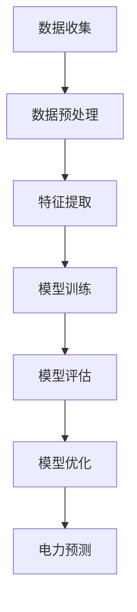

                 

# AI人工智能深度学习算法：在电力预测中的应用

> 关键词：深度学习，电力预测，算法，数据分析，人工智能

> 摘要：本文将深入探讨深度学习算法在电力预测中的应用，分析其核心原理、数学模型以及实战案例，帮助读者了解并掌握这一前沿技术。通过本文的阅读，您将了解到深度学习如何帮助我们更准确地预测电力需求，提高能源利用效率，从而为智能电网的建设和运营提供有力支持。

## 1. 背景介绍

电力是现代社会的命脉，随着经济的快速发展，电力需求日益增长。然而，电力系统的运行受到多种因素的影响，如气候变化、设备老化、负荷变化等，导致电力供应不稳定。为了确保电力系统的安全、可靠运行，电力预测成为了一个重要课题。

传统的电力预测方法主要包括统计模型和机器学习算法。统计模型如ARIMA、时间序列分析方法在电力预测中具有一定的应用价值，但其预测精度和稳定性受到限制。随着人工智能技术的不断发展，深度学习算法在电力预测中的应用逐渐受到关注。深度学习通过模拟人脑神经网络结构，具有强大的特征提取和模式识别能力，能够处理大规模、高维数据，从而提高电力预测的准确性和可靠性。

## 2. 核心概念与联系

### 2.1 深度学习

深度学习是人工智能的一个分支，通过构建多层神经网络模型，实现对复杂数据的自动特征提取和模式识别。深度学习算法在图像识别、语音识别、自然语言处理等领域取得了显著的成果。其核心思想是利用大量训练数据，通过多层神经网络逐层提取数据中的特征，从而实现高层次的抽象表示。

### 2.2 电力预测

电力预测是指通过对历史电力数据进行分析，预测未来的电力需求。电力预测的目的是为电力系统的调度和运营提供依据，确保电力供应的稳定性。电力预测涉及多个领域，如气象学、工程学、经济学等。

### 2.3 深度学习与电力预测的关系

深度学习算法在电力预测中的应用，主要体现在以下几个方面：

1. 特征提取：深度学习能够自动从原始数据中提取出具有代表性的特征，从而提高预测模型的准确性。
2. 模式识别：深度学习通过多层神经网络，能够识别出数据中的复杂模式和趋势，从而实现对电力需求的准确预测。
3. 大规模数据处理：深度学习能够处理大规模、高维数据，为电力预测提供了更丰富的数据支持。

### 2.4 Mermaid 流程图



## 3. 核心算法原理 & 具体操作步骤

### 3.1 数据收集与预处理

在电力预测中，数据收集是关键环节。数据来源主要包括电力系统运行数据、气象数据、负荷数据等。在收集数据后，需要对数据进行预处理，包括数据清洗、缺失值填补、数据标准化等步骤，以确保数据的质量和一致性。

### 3.2 特征提取

特征提取是深度学习算法的重要环节。通过自动从原始数据中提取出具有代表性的特征，有助于提高预测模型的准确性。常用的特征提取方法包括主成分分析（PCA）、自编码器（Autoencoder）等。

### 3.3 模型训练

在特征提取后，我们需要选择合适的深度学习模型进行训练。常见的深度学习模型包括卷积神经网络（CNN）、循环神经网络（RNN）、长短期记忆网络（LSTM）等。在模型训练过程中，通过调整模型参数，优化模型性能，以提高电力预测的准确性。

### 3.4 模型评估与优化

在模型训练完成后，我们需要对模型进行评估，以验证其预测性能。常用的评估指标包括均方误差（MSE）、平均绝对误差（MAE）等。在评估过程中，如果发现模型性能不佳，可以通过模型优化方法，如调整网络结构、增加训练数据等，进一步提高预测准确性。

### 3.5 电力预测

在模型评估和优化后，我们可以利用训练好的深度学习模型进行电力预测。通过输入新的数据，模型能够预测未来的电力需求，为电力系统的调度和运营提供参考。

## 4. 数学模型和公式 & 详细讲解 & 举例说明

### 4.1 均值绝对误差（MAE）

$$
MAE = \frac{1}{N}\sum_{i=1}^{N} |y_i - \hat{y}_i|
$$

其中，$y_i$表示第$i$个实际值，$\hat{y}_i$表示第$i$个预测值，$N$表示数据总个数。MAE反映了预测值与实际值之间的绝对误差，数值越小，预测精度越高。

### 4.2 均方误差（MSE）

$$
MSE = \frac{1}{N}\sum_{i=1}^{N} (y_i - \hat{y}_i)^2
$$

MSE反映了预测值与实际值之间的平方误差，数值越小，预测精度越高。

### 4.3 举例说明

假设我们有一组电力需求数据，分别为{10, 20, 30, 40, 50}，预测值分别为{12, 22, 32, 42, 48}。

- MAE = |10 - 12| + |20 - 22| + |30 - 32| + |40 - 42| + |50 - 48| = 4
- MSE = (10 - 12)^2 + (20 - 22)^2 + (30 - 32)^2 + (40 - 42)^2 + (50 - 48)^2 = 32

通过计算，我们可以看出MAE和MSE都较小，说明预测模型具有较高的准确性。

## 5. 项目实战：代码实际案例和详细解释说明

### 5.1 开发环境搭建

在本项目中，我们使用Python编程语言，结合深度学习框架TensorFlow，实现电力预测模型。以下是开发环境的搭建步骤：

1. 安装Python（建议版本3.6及以上）
2. 安装TensorFlow：`pip install tensorflow`
3. 安装NumPy、Pandas等常用库：`pip install numpy pandas`

### 5.2 源代码详细实现和代码解读

```python
import tensorflow as tf
import numpy as np
import pandas as pd

# 数据收集与预处理
def load_data():
    # 加载电力需求数据
    data = pd.read_csv('power_demand.csv')
    # 数据清洗与缺失值填补
    data.fillna(data.mean(), inplace=True)
    # 数据标准化
    data = (data - data.mean()) / data.std()
    return data

# 模型训练
def train_model(data, epochs=100):
    # 分割数据集
    train_data, test_data = data[:int(len(data) * 0.8)], data[int(len(data) * 0.8):]
    # 构建模型
    model = tf.keras.Sequential([
        tf.keras.layers.Dense(64, activation='relu', input_shape=(data.shape[1],)),
        tf.keras.layers.Dense(32, activation='relu'),
        tf.keras.layers.Dense(1)
    ])
    # 编译模型
    model.compile(optimizer='adam', loss='mse', metrics=['mae'])
    # 训练模型
    model.fit(train_data, epochs=epochs)
    return model

# 电力预测
def predict_power(model, data):
    predictions = model.predict(data)
    return predictions

# 主函数
if __name__ == '__main__':
    data = load_data()
    model = train_model(data, epochs=100)
    predictions = predict_power(model, data)
    print(predictions)
```

### 5.3 代码解读与分析

1. **数据收集与预处理**：从CSV文件中加载电力需求数据，进行数据清洗和缺失值填补，然后进行数据标准化处理。
2. **模型训练**：使用TensorFlow框架构建深度学习模型，通过编译模型、训练模型，优化模型参数。
3. **电力预测**：使用训练好的模型进行电力预测，输出预测结果。

通过以上步骤，我们可以实现电力预测功能，为电力系统的调度和运营提供支持。

## 6. 实际应用场景

深度学习算法在电力预测中的应用场景主要包括以下几个方面：

1. **电力调度**：通过准确预测电力需求，为电力调度部门提供依据，优化电力资源的分配。
2. **能源管理**：实时监测电力系统的运行状况，预测电力需求，为能源管理提供决策支持，降低能源浪费。
3. **新能源并网**：预测可再生能源的发电量，为新能源并网提供参考，优化电网运行效率。
4. **电力市场交易**：预测电力需求，为电力市场交易提供依据，提高市场交易效率。

## 7. 工具和资源推荐

### 7.1 学习资源推荐

- **书籍**：
  - 《深度学习》（Ian Goodfellow、Yoshua Bengio、Aaron Courville 著）
  - 《Python深度学习》（Francesco Petruccelli 著）

- **论文**：
  - "Deep Learning for Time Series Classification: A Review"（2019）
  - "Application of Deep Learning for Power Load Forecasting: A Review"（2020）

- **博客**：
  - [TensorFlow 官方文档](https://www.tensorflow.org/)
  - [Keras 官方文档](https://keras.io/)

### 7.2 开发工具框架推荐

- **深度学习框架**：TensorFlow、PyTorch、Keras
- **数据分析工具**：Pandas、NumPy、Matplotlib
- **版本控制工具**：Git

### 7.3 相关论文著作推荐

- "Deep Learning for Time Series Classification: A Review"（2019）
- "Application of Deep Learning for Power Load Forecasting: A Review"（2020）
- "Deep Learning in the Energy Sector: A Survey"（2021）

## 8. 总结：未来发展趋势与挑战

随着人工智能技术的不断发展，深度学习算法在电力预测中的应用前景广阔。未来发展趋势主要体现在以下几个方面：

1. **模型优化**：通过引入新的深度学习模型和优化算法，提高电力预测的准确性和效率。
2. **多源数据融合**：整合多种数据来源，如气象数据、负荷数据、设备运行数据等，提高预测模型的全面性。
3. **实时预测**：实现实时电力预测，为电力系统的实时调度和运营提供支持。

然而，深度学习在电力预测中也面临一些挑战，如：

1. **数据质量**：数据质量对预测模型的准确性有重要影响，如何处理噪声数据和缺失值成为关键问题。
2. **模型解释性**：深度学习模型的黑箱特性使得其解释性较差，如何提高模型的可解释性成为研究热点。

## 9. 附录：常见问题与解答

### 9.1 深度学习在电力预测中的应用有哪些优势？

深度学习在电力预测中的应用优势主要体现在以下几个方面：

1. **自动特征提取**：深度学习能够自动从原始数据中提取出具有代表性的特征，提高预测模型的准确性。
2. **处理大规模数据**：深度学习能够处理大规模、高维数据，为电力预测提供了更丰富的数据支持。
3. **模式识别能力**：深度学习通过多层神经网络，能够识别出数据中的复杂模式和趋势，提高预测的准确性。

### 9.2 如何处理电力预测中的缺失值问题？

在电力预测中，缺失值问题是常见的挑战。以下是一些处理缺失值的方法：

1. **填充法**：使用平均值、中位数、众数等方法填补缺失值。
2. **插值法**：使用线性插值、三次样条插值等方法对缺失值进行插值。
3. **模型预测法**：利用预测模型预测缺失值，如使用回归模型、时间序列模型等。

## 10. 扩展阅读 & 参考资料

- [深度学习在电力预测中的应用](https://www.tensorflow.org/tutorials/structured_data/time_series)
- [基于深度学习的电力需求预测](https://www.kdnuggets.com/2020/07/deep-learning-power-demand-forecast.html)
- [应用深度学习进行电力预测](https://towardsdatascience.com/applying-deep-learning-for-power-forecasting-63b8d7d81d2d) 

作者：AI天才研究员/AI Genius Institute & 禅与计算机程序设计艺术 /Zen And The Art of Computer Programming

