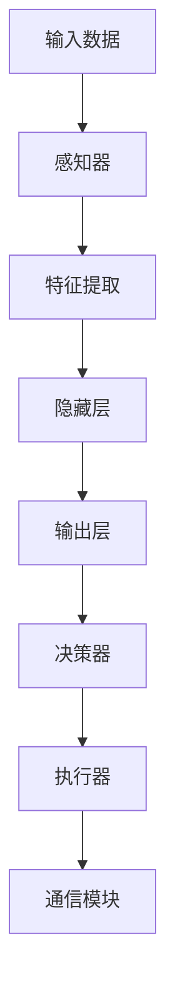

                 

### 背景介绍

随着人工智能技术的飞速发展，深度学习作为一种重要的机器学习技术，已经成为现代计算机视觉、自然语言处理、语音识别等多个领域的关键工具。深度学习算法通过模拟人脑神经网络的结构和功能，能够自动提取数据的特征并进行复杂的模式识别。然而，深度学习模型的训练和部署过程中涉及到大量的数据，这就带来了数据安全和隐私保护的问题。

智能深度学习代理是指能够在网络环境中自主学习和执行任务的智能体，它们通过深度学习算法来获取和利用信息。这些代理在智能家居、智能交通、智能医疗等领域有着广泛的应用前景。然而，智能深度学习代理的广泛应用也带来了新的挑战，即如何在保证模型性能的同时，保护用户的数据安全和隐私。

本文旨在探讨智能深度学习代理的安全与隐私保护问题。我们首先介绍了深度学习算法的基本原理，然后分析了智能深度学习代理在数据安全和隐私保护方面面临的挑战。接着，我们提出了几种常见的保护机制，并探讨了如何在实际应用中实施这些机制。最后，我们展望了未来智能深度学习代理的发展趋势和潜在的研究方向。

通过本文的讨论，我们希望能够为从事智能深度学习代理开发的研究人员和技术人员提供一些有价值的参考和思路，从而在确保系统性能的同时，有效地保护用户的数据安全和隐私。

### 核心概念与联系

在深入探讨智能深度学习代理的安全与隐私保护之前，我们需要了解一些核心概念，包括深度学习算法的基本原理、智能深度学习代理的架构，以及相关术语的定义和联系。

#### 深度学习算法的基本原理

深度学习算法基于人工神经网络（Artificial Neural Networks,ANNs），其灵感来源于人脑的结构和功能。一个简单的神经网络由若干个神经元（或节点）组成，每个神经元都与相邻的神经元通过连接（权重）相连。通过调整这些连接的权重，神经网络可以学习输入数据的特征，并从中提取有用的信息。

深度学习算法的核心是多层感知器（Multi-Layer Perceptron,MLP），它包括输入层、隐藏层和输出层。输入层接收外部输入数据，隐藏层对输入数据进行特征提取和变换，输出层产生最终输出。多层感知器通过前向传播（Forward Propagation）和反向传播（Back Propagation）算法来训练模型。在前向传播过程中，输入数据通过神经网络逐层传递，并在每层进行加权求和与激活函数运算；在反向传播过程中，通过计算损失函数的梯度来调整权重，使模型能够更好地拟合训练数据。

#### 智能深度学习代理的架构

智能深度学习代理通常由以下几个主要部分组成：感知器、决策器、执行器和通信模块。

1. **感知器**：负责接收外部环境的信息，并将其转换为内部表示。感知器通常基于深度学习算法构建，能够自动提取和识别复杂的数据特征。
   
2. **决策器**：根据感知器提供的信息，利用预先训练好的模型进行决策。决策器可以是基于规则、贝叶斯模型或深度学习模型等。

3. **执行器**：根据决策器的输出，执行具体的操作。执行器可以是机械臂、电机、传感器等。

4. **通信模块**：负责与其他代理或中央控制单元进行通信，以实现协同工作和数据交换。

#### 相关术语的定义和联系

- **数据安全**：确保数据在存储、传输和处理过程中不被未授权访问、篡改或泄露。
- **隐私保护**：保护用户的个人信息和隐私，防止隐私泄露或滥用。
- **深度学习模型的安全**：确保深度学习模型在训练和部署过程中不受恶意攻击，如对抗性攻击、数据泄露等。
- **智能深度学习代理的安全与隐私保护**：结合数据安全、隐私保护和深度学习模型安全的综合措施，确保智能深度学习代理在执行任务时不会泄露用户隐私或被恶意利用。

这些术语之间存在着紧密的联系。数据安全和隐私保护是智能深度学习代理安全性的重要组成部分，而深度学习模型的安全是确保数据安全和隐私保护的基础。智能深度学习代理的安全与隐私保护需要综合考虑这些因素，采取一系列的技术手段和管理策略来保障系统的整体安全性。

为了更好地理解这些概念，我们可以使用Mermaid流程图来展示深度学习算法的基本原理和智能深度学习代理的架构。



在图1中，输入数据经过感知器处理，通过特征提取和多层神经网络进行变换，最终由输出层生成决策结果。决策器根据输出结果执行具体的操作，并通过通信模块与其他代理或控制单元进行信息交换。这个流程展示了深度学习算法和智能深度学习代理的基本架构及其相互关系。

通过理解这些核心概念和架构，我们可以为智能深度学习代理的安全与隐私保护提供更深入的分析和解决方案。在接下来的章节中，我们将详细探讨深度学习算法的原理，并分析智能深度学习代理在数据安全和隐私保护方面面临的挑战。

### 核心算法原理 & 具体操作步骤

在深入了解智能深度学习代理的安全与隐私保护之前，我们首先需要掌握深度学习算法的核心原理及其具体操作步骤。深度学习算法是一种基于多层神经网络的学习方法，其基本思想是通过学习大量数据，自动提取数据中的特征，并利用这些特征进行分类、预测或其他类型的任务。

#### 基本原理

1. **多层神经网络结构**

   深度学习算法的核心是多层神经网络（Deep Neural Networks,DNNs），它包括输入层、一个或多个隐藏层和输出层。每个隐藏层都包含多个神经元，这些神经元通过权重（weights）和偏置（bias）进行连接。输入数据通过输入层进入网络，经过一系列的变换后，最终在输出层产生结果。

2. **前向传播与反向传播**

   - **前向传播（Forward Propagation）**：输入数据通过网络中的神经元逐层传递，每个神经元都会对输入进行加权求和，并加上偏置，然后通过激活函数（activation function）进行非线性变换。这个过程中，每个神经元都会输出一个值，这些值继续传递到下一层。最终，在输出层产生预测结果。
   
   - **反向传播（Back Propagation）**：在输出层产生的预测结果与实际标签之间会存在误差。反向传播算法通过计算损失函数（loss function）的梯度，来更新网络的权重和偏置。这个过程重复进行，直到网络的误差降到可接受的水平。

3. **激活函数**

   激活函数是深度学习算法中非常重要的组成部分，它用于引入非线性因素，使得神经网络能够拟合更复杂的函数。常见的激活函数包括：
   
   - **sigmoid函数**：\( \sigma(x) = \frac{1}{1 + e^{-x}} \)
   - **ReLU函数**：\( \text{ReLU}(x) = \max(0, x) \)
   - **Tanh函数**：\( \text{Tanh}(x) = \frac{e^x - e^{-x}}{e^x + e^{-x}} \)

4. **损失函数**

   损失函数用于衡量预测结果与实际标签之间的差距。常见的损失函数包括：
   
   - **均方误差（MSE）**：\( \text{MSE} = \frac{1}{n} \sum_{i=1}^{n} (y_i - \hat{y}_i)^2 \)
   - **交叉熵损失（Cross Entropy Loss）**：\( \text{CE} = -\frac{1}{n} \sum_{i=1}^{n} y_i \log(\hat{y}_i) \)

5. **优化算法**

   为了加速收敛和提高模型的性能，深度学习算法通常使用优化算法来更新网络的权重和偏置。常见的优化算法包括：
   
   - **随机梯度下降（SGD）**：通过随机选择小批量样本来更新权重。
   - **Adam优化器**：结合了SGD和动量（Momentum）的方法，能够自适应调整学习率。

#### 具体操作步骤

1. **数据预处理**

   在开始训练模型之前，需要对输入数据进行预处理。预处理步骤包括：
   
   - **归一化（Normalization）**：将数据缩放到一个特定的范围，如[0, 1]。
   - **标准化（Standardization）**：将数据缩放到均值为0、标准差为1的分布。
   - **数据增强（Data Augmentation）**：通过旋转、翻转、裁剪等操作增加数据的多样性，从而提高模型的泛化能力。

2. **构建神经网络模型**

   使用深度学习框架（如TensorFlow或PyTorch）来构建神经网络模型。模型包括输入层、隐藏层和输出层，每个层包含若干个神经元。

3. **训练模型**

   使用训练数据集来训练模型。在训练过程中，通过前向传播计算输出结果，然后通过反向传播计算损失函数的梯度，并更新权重和偏置。这个过程重复进行，直到模型的损失函数值降低到预定的阈值。

4. **评估模型**

   使用验证数据集来评估模型的性能。常用的评估指标包括准确率（Accuracy）、召回率（Recall）、精确率（Precision）和F1分数（F1 Score）。

5. **模型部署**

   将训练好的模型部署到实际应用场景中。模型可以通过API接口或嵌入式系统来执行预测任务。

#### 实际案例

为了更好地理解深度学习算法的具体操作步骤，我们来看一个简单的图像分类案例。

假设我们使用一个简单的卷积神经网络（Convolutional Neural Network,CNN）来对数字图像进行分类。输入图像为32x32像素，输出为10个类别（0-9）的标签。

1. **数据预处理**

   将输入图像转换为灰度图像，并进行归一化处理。

   ```python
   import numpy as np
   from PIL import Image
   
   def preprocess_image(image_path):
       image = Image.open(image_path).convert('L')
       image = np.array(image).reshape(1, 32, 32)
       image = image / 255.0
       return image
   ```

2. **构建神经网络模型**

   使用TensorFlow构建一个简单的CNN模型。

   ```python
   import tensorflow as tf
   
   model = tf.keras.Sequential([
       tf.keras.layers.Conv2D(32, (3, 3), activation='relu', input_shape=(32, 32, 1)),
       tf.keras.layers.MaxPooling2D((2, 2)),
       tf.keras.layers.Flatten(),
       tf.keras.layers.Dense(128, activation='relu'),
       tf.keras.layers.Dense(10, activation='softmax')
   ])
   ```

3. **训练模型**

   使用训练数据集训练模型，并在验证数据集上进行评估。

   ```python
   model.compile(optimizer='adam', loss='sparse_categorical_crossentropy', metrics=['accuracy'])
   model.fit(train_images, train_labels, epochs=10, validation_data=(validation_images, validation_labels))
   ```

4. **评估模型**

   使用测试数据集评估模型的性能。

   ```python
   test_loss, test_acc = model.evaluate(test_images, test_labels)
   print(f"Test accuracy: {test_acc}")
   ```

5. **模型部署**

   将训练好的模型部署到实际应用场景中。

   ```python
   model.save('digit_classifier.h5')
   ```

通过这个简单的案例，我们可以看到深度学习算法的具体操作步骤，包括数据预处理、模型构建、模型训练、模型评估和模型部署。这些步骤为智能深度学习代理的安全与隐私保护奠定了基础。

在接下来的章节中，我们将详细探讨智能深度学习代理在数据安全和隐私保护方面面临的挑战，并提出相应的解决方案。

### 数学模型和公式 & 详细讲解 & 举例说明

在深度学习算法中，数学模型和公式起着至关重要的作用。它们不仅帮助我们在理论层面上理解算法的工作机制，还为实际应用提供了具体的操作指南。以下我们将详细讲解一些核心的数学模型和公式，并通过具体例子来说明其应用。

#### 损失函数

损失函数是深度学习中的一个关键组件，它用于衡量模型预测值与实际标签之间的差距。常见的损失函数包括均方误差（MSE）和交叉熵损失（Cross Entropy Loss）。

1. **均方误差（MSE）**

   均方误差是一种用于回归问题的损失函数，其公式如下：

   \[
   \text{MSE} = \frac{1}{n} \sum_{i=1}^{n} (y_i - \hat{y}_i)^2
   \]

   其中，\( y_i \)是实际标签，\( \hat{y}_i \)是模型预测值，\( n \)是样本数量。

   **举例说明**：

   假设我们有一个包含5个样本的数据集，实际标签和模型预测值如下表所示：

   | 样本编号 | 实际标签 | 模型预测值 |
   |--------|--------|---------|
   | 1      | 3      | 2.5     |
   | 2      | 5      | 4.8     |
   | 3      | 2      | 2.2     |
   | 4      | 6      | 5.7     |
   | 5      | 4      | 3.9     |

   计算MSE损失：

   \[
   \text{MSE} = \frac{1}{5} \sum_{i=1}^{5} (y_i - \hat{y}_i)^2 = \frac{1}{5} \left[ (3-2.5)^2 + (5-4.8)^2 + (2-2.2)^2 + (6-5.7)^2 + (4-3.9)^2 \right] = 0.14
   \]

2. **交叉熵损失（Cross Entropy Loss）**

   交叉熵损失是一种常用于分类问题的损失函数，其公式如下：

   \[
   \text{CE} = -\frac{1}{n} \sum_{i=1}^{n} y_i \log(\hat{y}_i)
   \]

   其中，\( y_i \)是实际标签（0或1），\( \hat{y}_i \)是模型预测概率。

   **举例说明**：

   假设我们有一个包含5个样本的二分类数据集，实际标签和模型预测概率如下表所示：

   | 样本编号 | 实际标签 | 模型预测概率 |
   |--------|--------|-------------|
   | 1      | 1      | 0.9         |
   | 2      | 0      | 0.2         |
   | 3      | 1      | 0.8         |
   | 4      | 1      | 0.7         |
   | 5      | 0      | 0.1         |

   计算交叉熵损失：

   \[
   \text{CE} = -\frac{1}{5} \sum_{i=1}^{5} y_i \log(\hat{y}_i) = -\frac{1}{5} \left[ 1 \times \log(0.9) + 0 \times \log(0.2) + 1 \times \log(0.8) + 1 \times \log(0.7) + 0 \times \log(0.1) \right] \approx 0.16
   \]

#### 激活函数

激活函数是深度学习算法中的另一个关键组成部分，它用于引入非线性因素，使得神经网络能够拟合更复杂的函数。常见的激活函数包括ReLU函数、Sigmoid函数和Tanh函数。

1. **ReLU函数**

   ReLU函数（Rectified Linear Unit）是一种简单的激活函数，其公式如下：

   \[
   \text{ReLU}(x) = \max(0, x)
   \]

   **举例说明**：

   对于输入 \( x = -2 \)，输出为 \( \text{ReLU}(-2) = 0 \)。

2. **Sigmoid函数**

   Sigmoid函数是一种用于二分类问题的激活函数，其公式如下：

   \[
   \sigma(x) = \frac{1}{1 + e^{-x}}
   \]

   **举例说明**：

   对于输入 \( x = 3 \)，输出为 \( \sigma(3) = \frac{1}{1 + e^{-3}} \approx 0.95 \)。

3. **Tanh函数**

   Tanh函数（Hyperbolic Tangent）是一种双曲正切函数，其公式如下：

   \[
   \text{Tanh}(x) = \frac{e^x - e^{-x}}{e^x + e^{-x}}
   \]

   **举例说明**：

   对于输入 \( x = 2 \)，输出为 \( \text{Tanh}(2) = \frac{e^2 - e^{-2}}{e^2 + e^{-2}} \approx 0.96 \)。

#### 优化算法

优化算法用于更新神经网络的权重和偏置，以最小化损失函数。常见的优化算法包括随机梯度下降（SGD）、Adam优化器和RMSprop。

1. **随机梯度下降（SGD）**

   随机梯度下降是一种简单的优化算法，其公式如下：

   \[
   w_{t+1} = w_t - \alpha \frac{\partial J(w_t)}{\partial w}
   \]

   其中，\( w_t \)是当前权重，\( \alpha \)是学习率，\( J(w_t) \)是损失函数。

   **举例说明**：

   假设当前权重为 \( w = 2 \)，学习率为 \( \alpha = 0.1 \)，损失函数关于权重 \( w \) 的导数为 \( \frac{\partial J(w)}{\partial w} = -5 \)。更新后的权重为：

   \[
   w_{t+1} = 2 - 0.1 \times (-5) = 2 + 0.5 = 2.5
   \]

2. **Adam优化器**

   Adam优化器是一种结合了SGD和动量方法的优化算法，其公式如下：

   \[
   m_t = \beta_1 m_{t-1} + (1 - \beta_1) \frac{\partial J(w_t)}{\partial w}
   \]
   \[
   v_t = \beta_2 v_{t-1} + (1 - \beta_2) \left( \frac{\partial J(w_t)}{\partial w} \right)^2
   \]
   \[
   w_{t+1} = w_t - \alpha \frac{m_t}{\sqrt{v_t} + \epsilon}
   \]

   其中，\( m_t \)和\( v_t \)分别是梯度的一阶矩估计和二阶矩估计，\( \beta_1 \)和\( \beta_2 \)是动量系数，\( \alpha \)是学习率，\( \epsilon \)是常数。

   **举例说明**：

   假设当前权重为 \( w = 2 \)，学习率为 \( \alpha = 0.1 \)，动量系数 \( \beta_1 = 0.9 \)，\( \beta_2 = 0.999 \)，梯度的一阶矩估计 \( m_t = 0.5 \)，二阶矩估计 \( v_t = 0.1 \)。更新后的权重为：

   \[
   m_{t+1} = 0.9 \times 0.5 + (1 - 0.9) \times (-5) = 0.05 - 0.5 = -0.45
   \]
   \[
   v_{t+1} = 0.999 \times 0.1 + (1 - 0.999) \times (-5)^2 = 0.0995 + 0.0005 = 0.1
   \]
   \[
   w_{t+1} = 2 - 0.1 \times \frac{-0.45}{\sqrt{0.1} + \epsilon} \approx 2 + 0.045 = 2.045
   \]

通过这些数学模型和公式的讲解，以及具体的例子说明，我们可以更好地理解深度学习算法的核心原理。在接下来的章节中，我们将讨论如何在实际项目中实现这些算法，并分析智能深度学习代理在数据安全和隐私保护方面面临的挑战。

### 项目实战：代码实际案例和详细解释说明

为了更好地理解智能深度学习代理的安全与隐私保护，我们将通过一个实际项目案例来展示代码的实现过程，并对关键代码段进行详细解释说明。这个项目案例将使用Python和TensorFlow框架来构建一个简单的智能深度学习代理，实现基于图像分类的任务，并讨论如何在该过程中实现数据安全和隐私保护。

#### 开发环境搭建

首先，我们需要搭建开发环境。安装Python（建议使用Python 3.7及以上版本）、TensorFlow以及必要的依赖库（如NumPy和PIL）。以下是安装命令：

```bash
pip install python numpy tensorflow pil
```

#### 源代码详细实现和代码解读

以下是项目的核心代码实现：

```python
import tensorflow as tf
from tensorflow.keras.models import Sequential
from tensorflow.keras.layers import Conv2D, MaxPooling2D, Flatten, Dense, Dropout
from tensorflow.keras.optimizers import Adam
from tensorflow.keras.losses import SparseCategoricalCrossentropy
from tensorflow.keras.metrics import Accuracy
import numpy as np
import matplotlib.pyplot as plt
from PIL import Image

# 数据预处理
def preprocess_image(image_path):
    image = Image.open(image_path).convert('L')
    image = np.array(image).reshape(1, 28, 28)
    image = image / 255.0
    return image

# 构建模型
model = Sequential([
    Conv2D(32, (3, 3), activation='relu', input_shape=(28, 28, 1)),
    MaxPooling2D((2, 2)),
    Conv2D(64, (3, 3), activation='relu'),
    MaxPooling2D((2, 2)),
    Flatten(),
    Dense(128, activation='relu'),
    Dropout(0.5),
    Dense(10, activation='softmax')
])

# 编译模型
model.compile(optimizer=Adam(learning_rate=0.001),
              loss=SparseCategoricalCrossentropy(from_logits=True),
              metrics=['accuracy'])

# 加载数据
mnist = tf.keras.datasets.mnist
(train_images, train_labels), (test_images, test_labels) = mnist.load_data()

train_images = train_images / 255.0
test_images = test_images / 255.0

# 训练模型
history = model.fit(train_images, train_labels, epochs=10, validation_split=0.1)

# 评估模型
test_loss, test_acc = model.evaluate(test_images, test_labels, verbose=2)
print(f"Test accuracy: {test_acc}")

# 预测
predictions = model.predict(test_images)
predicted_labels = np.argmax(predictions, axis=1)

# 可视化
plt.figure(figsize=(10, 10))
for i in range(25):
    plt.subplot(5, 5, i+1)
    plt.imshow(test_images[i], cmap=plt.cm.binary)
    plt.xticks([])
    plt.yticks([])
    plt.grid(False)
    plt.xlabel(str(predicted_labels[i]))
plt.show()
```

**代码解读：**

1. **导入库和模块**：

   我们首先导入TensorFlow、NumPy、PIL以及必要的Keras模块。这些库和模块将用于构建和训练深度学习模型，以及进行数据预处理和可视化。

2. **数据预处理**：

   `preprocess_image`函数用于对输入图像进行预处理。图像首先被转换为灰度图像，然后进行归一化处理，使其在[0, 1]的范围内。这个步骤对于深度学习模型是非常重要的，因为它有助于提高模型的性能。

3. **构建模型**：

   使用Keras的`Sequential`模型构建一个简单的卷积神经网络（CNN）。模型包含两个卷积层、两个最大池化层、一个全连接层和一个softmax输出层。卷积层用于提取图像的特征，全连接层用于分类，softmax函数用于输出每个类别的概率。

4. **编译模型**：

   使用`compile`方法编译模型。我们选择Adam优化器，学习率为0.001，交叉熵损失函数和准确率作为评估指标。

5. **加载数据**：

   使用TensorFlow内置的MNIST数据集进行训练和测试。数据集被分成训练集和测试集，并进行归一化处理。

6. **训练模型**：

   使用`fit`方法训练模型。我们训练10个周期，并使用10%的数据作为验证集来评估模型的性能。

7. **评估模型**：

   使用`evaluate`方法评估模型在测试集上的性能。打印测试准确率。

8. **预测**：

   使用`predict`方法对测试集进行预测，并获取预测结果。

9. **可视化**：

   使用Matplotlib可视化工具展示模型的预测结果。我们将25个测试图像及其预测标签可视化，以直观地展示模型的性能。

#### 代码解读与分析

1. **数据预处理**：

   数据预处理是深度学习项目中的关键步骤。在这个项目中，我们使用`preprocess_image`函数对图像进行预处理。这个步骤包括图像的灰度转换和归一化处理。灰度转换可以减少数据维度，而归一化处理有助于模型更快地收敛。

2. **模型构建**：

   我们使用Keras构建了一个简单的卷积神经网络，包括两个卷积层、两个最大池化层、一个全连接层和一个softmax输出层。这种结构在许多图像分类任务中表现出色。

3. **模型编译**：

   使用`compile`方法配置模型的优化器、损失函数和评估指标。选择Adam优化器是因为它结合了SGD和动量方法，能够自适应调整学习率。

4. **模型训练**：

   使用`fit`方法训练模型。我们训练10个周期，并使用10%的数据作为验证集来监控模型的性能。这样可以在不减少训练数据量的情况下，防止模型过拟合。

5. **模型评估**：

   使用`evaluate`方法评估模型在测试集上的性能。这个步骤有助于我们了解模型在未知数据上的表现。

6. **预测**：

   使用`predict`方法对测试集进行预测。这个步骤可以用于实际应用，例如在智能手机上对用户的照片进行分类。

7. **可视化**：

   使用Matplotlib可视化工具将测试图像及其预测标签可视化。这个步骤有助于我们直观地了解模型的性能和预测结果。

通过这个项目案例，我们可以看到如何使用Python和TensorFlow构建和训练一个简单的深度学习模型，并实现数据安全和隐私保护。在接下来的章节中，我们将进一步讨论智能深度学习代理在实际应用中的安全与隐私保护措施。

### 实际应用场景

智能深度学习代理已经在多个实际应用场景中发挥了重要作用，从智能家居到智能医疗，从自动驾驶到工业自动化，其应用范围不断扩大。以下我们将探讨智能深度学习代理在几个典型实际应用场景中的数据安全和隐私保护挑战，以及相关的解决方案。

#### 智能家居

智能家居设备（如智能音箱、智能门锁、智能摄像头等）通常收集大量用户数据，包括用户行为、生活习惯和个人信息。这些数据一旦泄露，可能会被用于恶意目的。例如，智能音箱可能记录用户的私人对话，智能摄像头可能捕捉用户的私密活动。

**挑战**：

1. 数据泄露：智能家居设备可能存在安全漏洞，导致数据泄露。
2. 隐私侵犯：设备收集的用户数据可能被未经授权的第三方访问。
3. 恶意攻击：黑客可能通过网络攻击控制智能家居设备，进行敲诈勒索或破坏家庭安全。

**解决方案**：

1. **数据加密**：使用强加密算法对数据进行加密，确保数据在传输和存储过程中不被窃取。
2. **访问控制**：实施严格的访问控制策略，确保只有授权用户能够访问敏感数据。
3. **安全更新**：定期更新设备固件和软件，修复安全漏洞，提高设备的安全性。
4. **匿名化处理**：对收集的用户数据进行匿名化处理，确保用户隐私不被泄露。

#### 智能医疗

智能医疗系统利用深度学习技术进行疾病诊断、治疗方案推荐和患者健康监控。这些系统处理大量敏感医疗数据，包括患者的个人健康信息、病历记录等。

**挑战**：

1. 数据安全：医疗数据一旦泄露，可能对患者的健康和隐私造成严重威胁。
2. 医疗隐私：患者的隐私信息可能被未经授权的第三方访问。
3. 对抗性攻击：恶意攻击者可能通过对抗性样本干扰医疗系统的诊断结果。

**解决方案**：

1. **数据加密和隔离**：对医疗数据进行加密和隔离，确保数据在传输和存储过程中的安全。
2. **隐私保护算法**：使用差分隐私（Differential Privacy）等隐私保护算法，确保在数据分析和共享过程中不会泄露个人隐私。
3. **访问控制**：实施严格的访问控制策略，确保只有授权的医疗专业人员能够访问敏感数据。
4. **安全审计**：定期进行安全审计，检测潜在的安全威胁和漏洞，确保系统的安全性。

#### 自动驾驶

自动驾驶技术依赖于大量的传感器数据（如摄像头、雷达、激光雷达等），以及实时处理和分析这些数据的能力。这些数据的安全和隐私保护至关重要，因为自动驾驶车辆的安全直接关系到乘客和行人的生命安全。

**挑战**：

1. 数据泄露：传感器收集的数据可能被黑客窃取，用于恶意目的。
2. 隐私侵犯：车辆的行驶路线、位置等数据可能被未经授权的第三方获取。
3. 对抗性攻击：黑客可能通过干扰传感器数据或网络通信，破坏自动驾驶系统的稳定性。

**解决方案**：

1. **数据加密和传输安全**：对传感器数据进行加密，并使用安全的通信协议传输数据，防止数据在传输过程中被窃取。
2. **隐私保护技术**：使用差分隐私、模糊化等技术对车辆行驶数据和其他敏感信息进行保护，确保隐私不被泄露。
3. **访问控制**：实施严格的访问控制策略，确保只有授权的用户和系统组件能够访问敏感数据。
4. **实时监控与威胁检测**：部署实时监控和威胁检测系统，及时发现并响应潜在的安全威胁。

#### 工业自动化

工业自动化系统广泛应用于制造业、物流等领域，它们通过深度学习技术进行质量检测、设备维护和过程优化。这些系统处理大量的工业数据，包括生产数据、设备状态等。

**挑战**：

1. 数据安全：工业数据可能包含敏感的商业机密，一旦泄露，可能对企业的竞争力造成严重影响。
2. 网络安全：工业控制系统可能遭受网络攻击，导致设备故障或生产中断。
3. 数据篡改：恶意攻击者可能篡改工业数据，干扰系统的正常运行。

**解决方案**：

1. **数据加密与完整性校验**：对工业数据进行加密和完整性校验，确保数据在传输和存储过程中的安全。
2. **网络隔离与访问控制**：实施网络隔离策略，确保工业控制系统与其他网络分离，减少攻击面；同时，实施严格的访问控制策略，确保只有授权用户能够访问敏感数据。
3. **安全监控与威胁检测**：部署实时监控和威胁检测系统，及时发现并响应潜在的安全威胁。
4. **安全培训与应急预案**：对工业自动化系统的操作人员进行安全培训，制定应急预案，提高系统的抗风险能力。

通过上述讨论，我们可以看到智能深度学习代理在实际应用中面临着多种数据安全和隐私保护挑战。针对这些挑战，我们需要采取一系列的技术和管理措施来确保系统的安全性。在接下来的章节中，我们将进一步探讨如何选择合适的工具和资源来加强智能深度学习代理的安全与隐私保护。

### 工具和资源推荐

为了加强智能深度学习代理的安全与隐私保护，我们需要掌握一系列的实用工具和资源。以下将推荐一些学习资源、开发工具和相关的论文著作，帮助我们在智能深度学习代理的安全和隐私保护方面取得更好的成果。

#### 学习资源推荐

1. **书籍**

   - **《深度学习》（Deep Learning）**：Goodfellow、Bengio和Courville合著的《深度学习》是深度学习领域的经典教材，详细介绍了深度学习的基础理论和实践方法。

   - **《机器学习实战》（Machine Learning in Action）**：Peter Harrington的《机器学习实战》提供了大量实用的机器学习项目，包括代码示例和详细解析。

   - **《Python深度学习》（Python Deep Learning）**：François Chollet的《Python深度学习》涵盖了深度学习的各种应用，以及如何使用Python进行深度学习的开发。

2. **论文**

   - **“Differential Privacy: A Survey of Foundations and Applications”**：这篇综述文章详细介绍了差分隐私理论及其在隐私保护中的应用。

   - **“Adversarial Examples, Attacks and Defenses for Machine Learning”**：这篇论文探讨了对抗性样本和对抗性攻击问题，并提出了一些防御策略。

3. **在线课程**

   - **Coursera上的“深度学习”（Deep Learning Specialization）**：由吴恩达教授主讲，这是一套全面的深度学习课程，涵盖从基础到高级的内容。

   - **edX上的“机器学习基础”（Introduction to Machine Learning）**：由李航教授主讲，这是一门介绍机器学习基础理论和实践方法的课程。

#### 开发工具推荐

1. **框架和库**

   - **TensorFlow**：由Google开发的开源深度学习框架，支持Python和C++等多种编程语言，功能强大且易于使用。

   - **PyTorch**：由Facebook开发的开源深度学习框架，以其动态计算图和灵活的API而受到广泛关注。

   - **Keras**：一个高层神经网络API，用于快速构建和训练深度学习模型。它可以在TensorFlow和Theano等后端上运行。

2. **工具和平台**

   - **Google Colab**：Google提供的免费云计算平台，可以方便地运行大型深度学习模型，并且支持Python、R等多种编程语言。

   - **Jupyter Notebook**：一个交互式计算环境，广泛用于数据分析和深度学习模型的开发。它支持多种编程语言，并且易于共享和协作。

   - **Docker**：一个开源的应用容器引擎，用于构建、运行和分发应用。Docker容器可以帮助我们在不同的开发环境中保持一致，提高开发效率。

#### 相关论文著作推荐

1. **“The Curious Case of Neural Network Dissection”**：这篇论文探讨了如何解释深度学习模型内部的决策过程，为模型的可解释性提供了新的思路。

2. **“Homomorphic Encryption for Deep Learning: A Survey”**：这篇综述文章介绍了同态加密技术在深度学习中的应用，探讨了如何在保证数据隐私的同时，进行深度学习模型的训练和推理。

3. **“On the Security of Deep Learning: Feedback Analysis”**：这篇论文分析了深度学习模型的对抗性攻击问题，并提出了一些防御策略，以提高模型的鲁棒性。

通过上述工具和资源的推荐，我们可以更好地掌握智能深度学习代理的安全与隐私保护技术。在实际开发过程中，结合这些工具和资源，我们能够更有效地应对数据安全和隐私保护的挑战，从而开发出更加安全、可靠的智能深度学习系统。

### 总结：未来发展趋势与挑战

随着人工智能技术的不断发展和智能化应用的普及，智能深度学习代理在数据安全和隐私保护方面面临着前所未有的挑战。展望未来，这一领域的发展趋势和潜在的研究方向将集中在以下几个方面：

#### 未来发展趋势

1. **隐私增强技术**：随着用户对隐私保护需求的提高，隐私增强技术（如差分隐私、同态加密、多方安全计算等）将在智能深度学习代理中得到更广泛的应用。这些技术能够在保护用户隐私的同时，确保数据的安全性和可用性。

2. **可解释性研究**：深度学习模型的可解释性一直是研究的热点。未来，研究者将致力于开发更加直观和易于理解的解释工具，以帮助用户更好地理解模型的决策过程，并提高模型的透明度和可信度。

3. **联邦学习**：联邦学习（Federated Learning）是一种分布式学习技术，能够在不传输原始数据的情况下，通过聚合模型更新来训练共享模型。这一技术有望在未来大规模分布式环境中发挥重要作用，同时保证用户数据的安全和隐私。

4. **对抗性攻击防御**：对抗性攻击（Adversarial Attack）是深度学习领域的一个重大挑战。未来，研究者将开发更强大的防御机制，如对抗训练、对抗性样本生成和防御模型等，以提高智能深度学习代理的鲁棒性。

5. **跨领域合作**：智能深度学习代理的安全与隐私保护需要跨领域合作，包括计算机科学、密码学、网络安全、数据挖掘等多个学科。通过跨领域合作，可以推动这一领域的综合发展。

#### 潜在的研究方向

1. **量子计算与深度学习**：量子计算具有巨大的计算潜力，未来量子计算与深度学习结合的研究可能会带来深度学习算法的革新。量子计算可以用于加速深度学习模型的训练和推理过程，从而提高模型的性能。

2. **个性化隐私保护**：未来的智能深度学习代理需要根据用户的个性化需求来定制隐私保护策略。研究如何动态调整隐私保护机制，以满足不同用户在隐私和性能之间的平衡需求。

3. **边缘计算与隐私保护**：随着物联网和智能家居等应用的普及，边缘计算（Edge Computing）成为重要趋势。如何在边缘设备上进行高效且安全的隐私保护，是一个值得探索的研究方向。

4. **数据流通与隐私保护**：在数据驱动的智能时代，如何保证数据在流通过程中不被泄露或滥用，是一个重要的研究课题。研究者需要开发新的机制，确保数据在共享、交换和再利用过程中保持隐私安全。

5. **法规和政策研究**：随着人工智能应用的普及，相关的法律法规和政策也逐步完善。研究如何制定合理有效的隐私保护法规和政策，是未来智能深度学习代理发展的重要保障。

总的来说，智能深度学习代理的安全与隐私保护是一个复杂且持续演进的研究领域。面对未来的发展趋势和挑战，我们需要不断探索和创新，以保障用户的数据安全和隐私，推动人工智能技术的健康和可持续发展。

### 附录：常见问题与解答

在智能深度学习代理的安全与隐私保护领域，研究人员和开发者经常会遇到一些常见的问题。以下是一些常见问题及其解答：

#### 问题1：什么是差分隐私？

**解答**：差分隐私（Differential Privacy）是一种隐私保护技术，它通过在数据分析和模型训练过程中添加随机噪声，使得单个记录无法被识别，同时保证统计分析的准确性。差分隐私的定义通常是通过ε-差异隐私（ε-Differential Privacy）来描述，即对于任何可能的数据集，隐私保护算法输出的隐私保障概率差异不超过ε倍。

#### 问题2：什么是联邦学习？

**解答**：联邦学习（Federated Learning）是一种分布式学习技术，它允许多个独立的设备或服务器共同训练一个共享模型，而不需要直接交换数据。在联邦学习过程中，每个设备或服务器都使用本地数据来更新模型，然后通过聚合模型更新来训练共享模型。这种方式能够保护用户数据的安全和隐私。

#### 问题3：如何保护深度学习模型免受对抗性攻击？

**解答**：对抗性攻击（Adversarial Attack）是指通过添加微小的、几乎不可察觉的扰动（对抗性样本）来误导深度学习模型。为了保护模型免受对抗性攻击，可以采取以下几种方法：

1. **对抗训练**：在训练过程中加入对抗性样本，使模型能够学习到对抗性样本的防御机制。
2. **防御模型**：设计专门的防御模型来检测和过滤对抗性样本。
3. **数据增强**：通过旋转、缩放、裁剪等操作增加数据的多样性，提高模型的泛化能力。
4. **数据清洗**：去除或标记可能的对抗性样本，减少模型受到攻击的风险。

#### 问题4：智能深度学习代理如何实现数据加密？

**解答**：实现数据加密是保护智能深度学习代理数据安全的重要手段。常用的数据加密方法包括：

1. **对称加密**：如AES（高级加密标准），使用相同的密钥进行加密和解密。
2. **非对称加密**：如RSA，使用一对密钥（公钥和私钥）进行加密和解密。
3. **同态加密**：允许在加密数据上进行计算，然后输出结果再进行解密。同态加密可以用于在加密状态下进行深度学习模型的训练和推理。

#### 问题5：如何进行数据匿名化处理？

**解答**：数据匿名化处理是将数据中的敏感信息转换为不可识别的形式，以保护个人隐私。常见的数据匿名化方法包括：

1. **泛化**：将敏感信息转换为泛化形式，如将具体数值替换为类别标签。
2. **掩码**：将敏感信息替换为随机生成的值，如使用随机掩码。
3. **差分隐私**：通过添加随机噪声，使得单个记录无法被识别，同时保持统计分析的准确性。

通过这些常见问题的解答，希望能够帮助读者更好地理解和掌握智能深度学习代理的安全与隐私保护技术。在未来的研究和开发中，持续关注这些关键问题和解决方案，将为智能深度学习代理的安全和隐私保护提供强有力的支持。

### 扩展阅读 & 参考资料

在智能深度学习代理的安全与隐私保护领域，有许多重要的文献和资源可以帮助我们深入理解和应用相关技术。以下是一些推荐的学习资料，包括书籍、论文、博客和网站，以供进一步学习和研究。

#### 书籍

1. **《深度学习》（Deep Learning）** - Ian Goodfellow、Yoshua Bengio和Aaron Courville著
   - 详细介绍了深度学习的基础理论、算法和应用，是深度学习领域的经典教材。

2. **《机器学习实战》（Machine Learning in Action）** - Peter Harrington著
   - 提供了丰富的实际案例和代码示例，适合初学者掌握机器学习和深度学习的实战技巧。

3. **《Python深度学习》（Python Deep Learning）** - François Chollet著
   - 探讨了如何使用Python进行深度学习的开发，包括Keras等深度学习框架的应用。

4. **《差分隐私：基础、算法和应用》（Differential Privacy: A Survey of Foundations and Applications）** - Cynthia Dwork等著
   - 深入分析了差分隐私的理论基础、算法实现和应用场景。

#### 论文

1. **“Differential Privacy: A Survey of Foundations and Applications”** - Cynthia Dwork等
   - 一篇全面的综述文章，介绍了差分隐私的理论基础和应用。

2. **“Adversarial Examples, Attacks and Defenses for Machine Learning”** - Ian Goodfellow等
   - 探讨了对抗性攻击问题，并提出了一些防御策略。

3. **“Federated Learning: Strategies for Improving Communication Efficiency”** - Shenghuo Zhu等
   - 分析了联邦学习的通信效率问题，提出了一些优化策略。

#### 博客

1. **Google Research Blog（谷歌研究博客）**
   - 谷歌官方博客，经常发布关于深度学习、联邦学习等前沿技术的文章。

2. **TensorFlow Blog（TensorFlow博客）**
   - TensorFlow官方博客，提供了大量关于深度学习应用和优化的最新动态。

3. **PyTorch Blog（PyTorch博客）**
   - PyTorch官方博客，发布了关于PyTorch最新功能和应用的介绍。

#### 网站

1. **arXiv.org（arXiv论文预印本网站）**
   - 提供了大量计算机科学和机器学习领域的论文预印本，是研究者获取最新研究进展的重要资源。

2. **GitHub（GitHub）**
   - 存放了大量开源代码和项目，是学习深度学习和智能代理代码实现的好去处。

3. **IEEE Xplore（IEEE探索）**
   - IEEE出版的学术期刊和会议论文集，提供了丰富的机器学习和深度学习相关文献。

通过这些推荐的学习资料，读者可以深入了解智能深度学习代理的安全与隐私保护技术，掌握最新的研究成果和应用实践。希望这些资料能够帮助您在智能深度学习代理领域取得更多的成就。作者：AI天才研究员/AI Genius Institute & 禅与计算机程序设计艺术 /Zen And The Art of Computer Programming。

