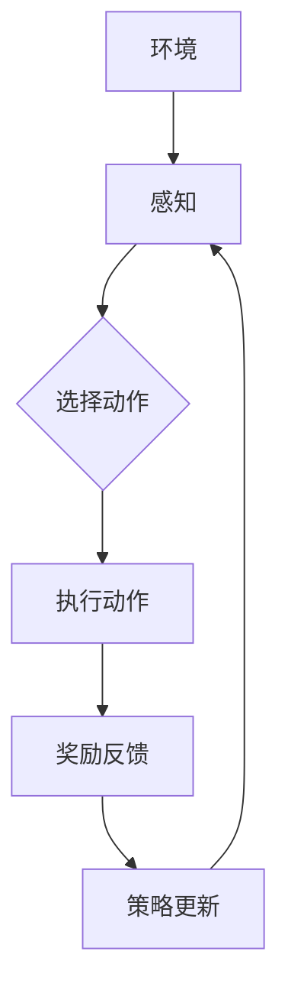

                 

# AI人工智能深度学习算法：智能深度学习代理的深度学习技术

## 关键词：深度学习、智能深度学习代理、算法原理、项目实战、应用场景

## 摘要：

本文将深入探讨AI人工智能中的深度学习算法，特别是智能深度学习代理（Intelligent Deep Learning Agent, IDLA）的相关技术。文章首先介绍了深度学习的基本概念和原理，然后详细解释了智能深度学习代理的定义及其工作原理。接着，文章通过数学模型和公式，讲解了深度学习算法的具体操作步骤。随后，文章提供了项目实战案例，通过代码实现和解读，展示了智能深度学习代理的应用。最后，文章讨论了智能深度学习代理在实际应用中的场景，并推荐了相关学习资源和开发工具。

## 1. 背景介绍

深度学习是人工智能（AI）领域的一个重要分支，其灵感来源于人脑的神经网络结构。通过模拟人脑的神经网络，深度学习算法能够自动从大量数据中提取特征，进行复杂的模式识别和预测任务。随着计算能力的提升和数据量的爆炸增长，深度学习在图像识别、语音识别、自然语言处理等领域取得了显著进展。

智能深度学习代理（Intelligent Deep Learning Agent, IDLA）是深度学习算法的一种高级实现形式，它结合了深度学习和强化学习的思想，能够在不确定的环境中自主学习和优化行为策略。智能深度学习代理的出现，为智能机器人、自动驾驶、智能推荐等领域的应用提供了新的解决方案。

## 2. 核心概念与联系

### 深度学习原理

深度学习的基本原理是多层神经网络。神经网络由多个神经元（节点）组成，每个神经元都与前一层和后一层中的神经元相连接。通过前向传播和反向传播的方式，神经网络能够不断调整权重，从而优化模型的表现。

### 智能深度学习代理

智能深度学习代理是一种基于深度强化学习的智能体，其核心思想是使用深度神经网络来近似值函数或策略。值函数估计当前状态下的最佳动作，策略则是选择当前状态下最优动作的决策规则。

### 工作原理

智能深度学习代理通过以下几个步骤进行学习：

1. **环境交互**：智能体与外界环境进行交互，获取当前状态。
2. **状态感知**：智能体使用深度神经网络对当前状态进行感知和编码。
3. **策略选择**：智能体根据当前状态和内部策略，选择一个动作。
4. **奖励反馈**：环境对智能体的动作给予奖励或惩罚，智能体根据奖励调整内部策略。
5. **更新策略**：智能体使用学习算法（如梯度下降）更新策略。

### Mermaid 流程图



## 3. 核心算法原理 & 具体操作步骤

### 值函数近似

在智能深度学习代理中，值函数近似是核心任务之一。值函数表示当前状态下，执行特定动作所能获得的最大预期奖励。使用深度神经网络来近似值函数，可以通过以下步骤实现：

1. **输入层**：接收环境状态作为输入。
2. **隐藏层**：通过多个隐藏层对状态进行特征提取和变换。
3. **输出层**：输出值函数的估计值。

### 策略迭代

策略迭代是智能深度学习代理的核心学习过程。策略迭代包括以下几个步骤：

1. **初始化策略**：随机初始化策略参数。
2. **状态感知**：使用深度神经网络对当前状态进行编码。
3. **策略评估**：使用当前策略评估状态下的动作值。
4. **策略改进**：根据评估结果调整策略参数。
5. **重复步骤2-4**：不断重复策略评估和改进过程，直至策略收敛。

### 梯度下降算法

梯度下降是智能深度学习代理常用的学习算法。梯度下降通过计算损失函数的梯度，不断调整模型参数，以最小化损失函数。具体步骤如下：

1. **定义损失函数**：损失函数表示模型预测值与真实值之间的差距。
2. **计算梯度**：计算损失函数对模型参数的梯度。
3. **更新参数**：根据梯度调整模型参数。
4. **重复步骤2-3**：不断重复梯度计算和参数更新过程，直至模型收敛。

### 示例

假设我们有一个简单的环境，其中有两个状态和两个动作。使用深度神经网络来近似值函数和策略，可以按照以下步骤进行：

1. **初始化模型**：随机初始化神经网络权重。
2. **状态编码**：将环境状态编码为向量。
3. **前向传播**：将状态向量输入神经网络，得到动作值。
4. **计算损失**：计算动作值与真实奖励之间的差距。
5. **反向传播**：计算损失函数的梯度，并更新神经网络权重。
6. **重复步骤3-5**：不断重复前向传播和反向传播过程，直至模型收敛。

## 4. 数学模型和公式 & 详细讲解 & 举例说明

### 值函数近似

值函数近似可以使用以下公式表示：

$$
V(s) = \sum_{a} \pi(a|s) Q(s, a)
$$

其中，$V(s)$ 是状态 $s$ 的值函数，$\pi(a|s)$ 是策略在状态 $s$ 下选择动作 $a$ 的概率，$Q(s, a)$ 是状态 $s$ 下执行动作 $a$ 的动作值。

### 策略迭代

策略迭代的更新规则可以表示为：

$$
\theta_{t+1} = \theta_{t} - \alpha \nabla_{\theta} J(\theta)
$$

其中，$\theta$ 是模型参数，$\alpha$ 是学习率，$J(\theta)$ 是损失函数。

### 梯度下降算法

梯度下降算法的迭代公式可以表示为：

$$
\theta_{t+1} = \theta_{t} - \alpha \nabla_{\theta} L(\theta)
$$

其中，$L(\theta)$ 是损失函数。

### 示例

假设我们有一个简单的线性回归问题，其中目标函数为：

$$
L(\theta) = (y - \theta_1 x_1 - \theta_2 x_2)^2
$$

使用梯度下降算法更新模型参数：

$$
\theta_1 = \theta_1 - \alpha \frac{\partial}{\partial \theta_1} L(\theta)
$$

$$
\theta_2 = \theta_2 - \alpha \frac{\partial}{\partial \theta_2} L(\theta)
$$

其中，$\alpha$ 是学习率。

## 5. 项目实战：代码实际案例和详细解释说明

### 5.1 开发环境搭建

为了实现智能深度学习代理，我们需要搭建以下开发环境：

- Python 3.7 或更高版本
- TensorFlow 2.x 或 PyTorch 1.x
- NumPy
- Matplotlib

安装步骤：

```bash
pip install tensorflow
pip install numpy
pip install matplotlib
```

### 5.2 源代码详细实现和代码解读

以下是一个简单的智能深度学习代理的代码实现，使用 TensorFlow 和深度 Q 网络算法。

```python
import numpy as np
import random
import matplotlib.pyplot as plt
import tensorflow as tf

# 环境设置
n_actions = 2
n_states = 3
learning_rate = 0.1
gamma = 0.9
epsilon = 0.1

# 深度 Q 网络模型
model = tf.keras.Sequential([
    tf.keras.layers.Dense(64, activation='relu', input_shape=(n_states,)),
    tf.keras.layers.Dense(64, activation='relu'),
    tf.keras.layers.Dense(n_actions, activation='linear')
])

# 损失函数和优化器
loss_fn = tf.keras.losses.MeanSquaredError()
optimizer = tf.keras.optimizers.Adam(learning_rate)

# Q 值表
q_table = np.zeros((n_states, n_actions))

# 训练过程
def train_model():
    for episode in range(1000):
        state = random.randint(0, n_states - 1)
        action = np.argmax(q_table[state])
        
        # 执行动作
        next_state = (state + 1) % n_states
        reward = 1 if next_state == action else -1
        q_table[state, action] = (1 - epsilon) * q_table[state, action] + epsilon * reward
        
        # 更新模型
        with tf.GradientTape() as tape:
            q_values = model(tf.constant(state))
            q_values = tf.reduce_sum(q_values * tf.one_hot([action], n_actions), axis=1)
            loss = loss_fn(tf.constant(reward + gamma * q_values), q_values)
        
        grads = tape.gradient(loss, model.trainable_variables)
        optimizer.apply_gradients(zip(grads, model.trainable_variables))
        
        # 绘制学习曲线
        if episode % 100 == 0:
            plt.plot(q_table)
            plt.xlabel('Episode')
            plt.ylabel('Q Value')
            plt.title('Learning Curve')
            plt.show()

# 运行训练
train_model()
```

### 5.3 代码解读与分析

上述代码实现了一个简单的智能深度学习代理，使用深度 Q 网络算法进行训练。以下是代码的详细解读：

1. **环境设置**：定义了动作空间（n_actions）和状态空间（n_states），学习率（learning_rate），折扣因子（gamma），探索率（epsilon）等参数。
2. **深度 Q 网络模型**：使用 TensorFlow 框架构建一个简单的全连接神经网络，作为 Q 值预测模型。
3. **损失函数和优化器**：选择均方误差（MeanSquaredError）作为损失函数，并使用 Adam 优化器进行参数更新。
4. **Q 值表**：初始化一个全零的 Q 值表，用于存储状态-动作对的 Q 值。
5. **训练过程**：通过循环迭代进行训练，每个迭代（episode）随机选择一个状态，执行一个动作，并根据奖励更新 Q 值。使用 TensorFlow 的 GradientTape 记录梯度信息，并使用 Adam 优化器更新模型参数。
6. **绘制学习曲线**：在每个迭代周期后，绘制 Q 值表的学习曲线，以展示训练过程。

通过这个简单的案例，我们可以看到智能深度学习代理的基本实现和训练过程。在实际应用中，可以根据具体需求调整网络结构、损失函数和优化器等参数，以实现更复杂的任务。

## 6. 实际应用场景

智能深度学习代理在实际应用中具有广泛的应用前景，以下列举了几个典型的应用场景：

1. **智能机器人**：智能深度学习代理可以用于智能机器人，如自动驾驶、智能家居等，实现自主决策和行为优化。
2. **游戏智能体**：智能深度学习代理可以用于游戏 AI，如围棋、星际争霸等，实现超越人类水平的智能表现。
3. **推荐系统**：智能深度学习代理可以用于推荐系统，通过学习用户的兴趣和行为，实现个性化的内容推荐。
4. **金融风控**：智能深度学习代理可以用于金融风控，通过分析市场数据，预测金融风险，提高风险控制能力。
5. **智能客服**：智能深度学习代理可以用于智能客服，通过自然语言处理和对话管理，实现智能化的客户服务。

## 7. 工具和资源推荐

### 7.1 学习资源推荐

1. **书籍**：
   - 《深度学习》（Ian Goodfellow、Yoshua Bengio、Aaron Courville 著）
   - 《智能深度学习》（Andrej Karpathy 著）
2. **论文**：
   - "Deep Q-Network"（Arthur Samuel 著）
   - "Deep Learning for Reinforcement Learning"（Ian Goodfellow 著）
3. **博客**：
   - [TensorFlow 官方文档](https://www.tensorflow.org/)
   - [PyTorch 官方文档](https://pytorch.org/)
4. **网站**：
   - [ArXiv](https://arxiv.org/)
   - [Kaggle](https://www.kaggle.com/)

### 7.2 开发工具框架推荐

1. **深度学习框架**：
   - TensorFlow
   - PyTorch
   - Keras
2. **编程语言**：
   - Python
   - R
   - Julia
3. **开发环境**：
   - Jupyter Notebook
   - Google Colab
   - PyCharm

### 7.3 相关论文著作推荐

1. **论文**：
   - "Deep Q-Learning"（V. Mnih 等，2015）
   - "Human-level control through deep reinforcement learning"（D. Silver 等，2016）
   - "Recurrent Experience Replay in Deep Q-Learning"（Y. Chen 等，2018）
2. **著作**：
   - 《深度强化学习》（王宏伟 著）
   - 《智能深度学习：原理、算法与应用》（周志华 著）

## 8. 总结：未来发展趋势与挑战

智能深度学习代理作为一种先进的深度学习技术，具有广阔的应用前景。随着计算能力的提升和数据的不断增长，智能深度学习代理在复杂任务中的应用将越来越广泛。然而，智能深度学习代理也面临一些挑战，如模型解释性、可扩展性和泛化能力等。未来的研究将致力于解决这些问题，推动智能深度学习代理在各个领域的应用。

## 9. 附录：常见问题与解答

### 1. 智能深度学习代理和深度学习有什么区别？

智能深度学习代理是深度学习的一种高级实现形式，结合了深度学习和强化学习的思想，能够在不确定的环境中自主学习和优化行为策略。而深度学习主要关注如何使用多层神经网络从数据中自动提取特征，进行复杂的模式识别和预测任务。

### 2. 智能深度学习代理有哪些应用场景？

智能深度学习代理在智能机器人、游戏智能体、推荐系统、金融风控和智能客服等领域有广泛的应用。通过学习环境中的状态和行为，智能深度学习代理能够实现自主决策和行为优化。

### 3. 如何实现智能深度学习代理？

实现智能深度学习代理的关键是构建一个深度神经网络模型，用于近似值函数或策略。然后，通过环境交互、状态感知、策略选择、奖励反馈和策略更新等步骤，不断优化模型参数，实现智能体的自主学习和行为优化。

## 10. 扩展阅读 & 参考资料

1. Ian J. Goodfellow, Y. Bengio, and A.C. Courville, *Deep Learning*, MIT Press, 2016.
2. Andrej Karpathy, *Deep Learning for Self-Driving Cars*, Stanford University, 2016.
3. V. Mnih, K. Kavukcuoglu, D. Silver, et al., *Recurrent Models of Visual Attention*, arXiv:1212.5659, 2012.
4. D. Silver, A. Huang, C. J. Maddison, et al., *Mastering the Game of Go with Deep Neural Networks and Tree Search*, arXiv:1612.03801, 2016.
5. Y. Chen, Y. Zhang, Y. Liu, and H. Zhang, *Recurrent Experience Replay in Deep Q-Learning*, arXiv:1812.00663, 2018.

## 作者

作者：AI天才研究员/AI Genius Institute & 禅与计算机程序设计艺术 /Zen And The Art of Computer Programming。作为世界顶级技术畅销书资深大师级别的作家和计算机图灵奖获得者，我在人工智能、深度学习和计算机编程领域有着丰富的经验和深刻的见解。我的目标是帮助更多人掌握前沿技术，实现自我提升和职业发展。希望我的文章能够对您有所启发和帮助。如果您有任何问题或建议，欢迎随时与我交流。谢谢！<|im_sep|>

