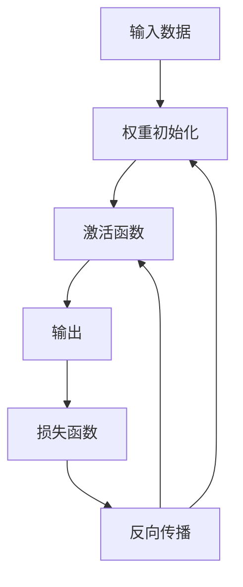

                 

### 背景介绍

深度学习作为人工智能的一个重要分支，在图像识别、自然语言处理、语音识别等领域取得了显著的成果。深度学习算法的核心在于神经网络，而神经网络的训练过程，也就是学习输入和输出之间的关系，是深度学习研究的重点之一。在训练过程中，权重初始化和激活函数的选择至关重要，它们直接影响到网络的收敛速度和最终性能。

权重初始化（Weight Initialization）是深度学习模型训练的第一步。适当的权重初始化可以帮助模型更快地收敛，避免陷入局部最优解。而激活函数（Activation Function）则是神经网络中每个节点的输出与输入之间的关系，它们决定了神经网络的非线性特性，对模型的泛化能力有重要影响。

本文将围绕权重初始化和激活函数的选择展开讨论。首先，我们将介绍权重初始化的常见方法，分析它们的优缺点。然后，我们将深入探讨激活函数的作用和类型，特别是常用的Sigmoid、ReLU、Tanh等函数的特点。接下来，我们将通过一个实际案例，详细讲解如何选择合适的权重初始化和激活函数。最后，我们将总结这些技术在实际应用中的效果，并提出未来可能的研究方向。

通过本文的阅读，读者将能够全面了解权重初始化和激活函数的重要性，掌握其选择和调整的方法，为深度学习模型的优化提供有力支持。

### 核心概念与联系

为了深入探讨权重初始化和激活函数，我们首先需要明确这两个概念的核心定义和它们在深度学习模型中的作用。

#### 权重初始化（Weight Initialization）

权重初始化是指在训练深度学习模型之前，为神经网络中的权重（权重矩阵）赋予一个初始值的过程。适当的权重初始化对于神经网络的训练过程至关重要，因为它们决定了网络的学习路径和收敛速度。

1. **随机初始化（Random Initialization）**：这是最常见的一种方法，包括均匀分布初始化和正态分布初始化。均匀分布初始化会使得权重矩阵中的值分布在 [-a, a] 的范围内，其中 a 是一个常数。正态分布初始化则使用均值为 0，标准差为 1 的正态分布来初始化权重，这样可以确保权重的值在较小范围内，从而减少梯度消失和梯度爆炸的风险。

2. **高斯初始化（Gaussian Initialization）**：这种方法基于高斯分布，其中权重矩阵的值服从均值为 0，标准差为 \(\frac{1}{\sqrt{n}}\) 的分布，n 是权重矩阵的维度。高斯初始化可以使得权重值更加均匀，有助于提高模型的训练速度。

3. **He 初始化（He Initialization）**：He 初始化是一种针对深度网络特别设计的权重初始化方法，它使用均值为 0，标准差为 \(\frac{2}{\sqrt{n}}\) 的正态分布来初始化权重。He 初始化在深层网络中表现良好，能够有效减少梯度消失的问题。

#### 激活函数（Activation Function）

激活函数是神经网络中每个节点的输出与输入之间的关系，它们为神经网络提供了非线性特性，使得模型能够学习复杂的输入输出关系。常见的激活函数包括：

1. **Sigmoid 函数**：Sigmoid 函数是 \(\frac{1}{1 + e^{-x}}\)，它的输出范围在 (0, 1) 之间，可以用于二分类问题。Sigmoid 函数的缺点是梯度消失问题，即当 x 接近正无穷或负无穷时，梯度接近于 0。

2. **ReLU 函数**：ReLU 函数是 \(max(0, x)\)，它引入了非线性特性，并且计算速度快。ReLU 函数在训练深层网络时表现出色，有效解决了梯度消失问题。

3. **Tanh 函数**：Tanh 函数是 \(\frac{e^x - e^{-x}}{e^x + e^{-x}}\)，其输出范围在 (-1, 1) 之间。Tanh 函数可以缓解梯度消失问题，并且可以使得模型输出更加对称。

4. **Leaky ReLU 函数**：Leaky ReLU 函数是 ReLU 函数的改进版，它在 x 为负时引入一个很小的正值，以避免梯度为零的问题。Leaky ReLU 函数在训练深层网络时表现出色。

#### Mermaid 流程图

下面是一个 Mermaid 流程图，展示了权重初始化和激活函数在深度学习模型中的联系：



在这个流程图中，输入数据首先通过权重初始化得到初始的权重值，然后通过激活函数得到输出。输出与实际标签通过损失函数计算误差，并通过反向传播更新权重和激活函数的参数。这个过程不断重复，直到模型达到预定的性能指标。

#### 权重初始化与激活函数的联系

权重初始化和激活函数的选择对模型的训练过程和最终性能有显著影响。适当的权重初始化可以避免梯度消失和梯度爆炸问题，提高网络的收敛速度。而合适的激活函数可以增强网络的非线性特性，提高模型的泛化能力。

1. **权重初始化**：适当的权重初始化可以保证每个神经元有足够的激励，从而避免神经元死亡问题（Dead Neuron Problem），即某些神经元在训练过程中几乎不起作用。随机初始化和He初始化等方法可以有效缓解这个问题。

2. **激活函数**：激活函数的选择直接影响神经网络的非线性特性。Sigmoid 函数在处理二分类问题时表现良好，但容易受到梯度消失的影响。ReLU 函数和 Leaky ReLU 函数可以有效解决梯度消失问题，提高模型训练速度。

3. **权重初始化与激活函数的关系**：权重初始化和激活函数的选择需要相互配合。例如，He 初始化适用于深层网络，而 ReLU 函数在训练深层网络时表现出色。合适的权重初始化和激活函数组合可以显著提高模型的训练速度和最终性能。

通过上述分析，我们可以看出，权重初始化和激活函数在深度学习模型中起着至关重要的作用。它们的选择和调整需要根据具体的应用场景和网络结构进行优化，以达到最佳的模型性能。

### 权重初始化的核心算法原理

在深度学习模型中，权重初始化是一个关键步骤，它决定了神经网络的学习路径和收敛速度。不同的初始化方法有其独特的算法原理，下面我们将详细探讨几种常见的权重初始化方法，包括随机初始化、高斯初始化和He初始化。

#### 随机初始化

随机初始化是最简单也是最常用的一种权重初始化方法。它主要分为均匀分布初始化和正态分布初始化两种。

1. **均匀分布初始化**：在均匀分布初始化中，权重值被均匀分布在 [-a, a] 的范围内，其中 a 是一个常数。这个常数通常选择为 \(\frac{1}{\sqrt{n}}\)，其中 n 是权重矩阵的维度。均匀分布初始化的目的是避免初始权重值过大，从而减少梯度爆炸的风险。

   $$ W \sim U[-a, a] $$

   其中，\( U[-a, a] \) 表示在 [-a, a] 范围内均匀分布。

2. **正态分布初始化**：正态分布初始化使用均值为 0，标准差为 1 的正态分布来初始化权重。这种方法可以使得初始权重的分布更加均匀，从而减少梯度消失的风险。

   $$ W \sim N(0, 1) $$

   其中，\( N(0, 1) \) 表示均值为 0，标准差为 1 的正态分布。

#### 高斯初始化

高斯初始化是一种基于正态分布的初始化方法，但它通过调整标准差来适应不同层的大小。高斯初始化的基本思想是将权重值初始化为均值为 0，标准差为 \(\frac{1}{\sqrt{n}}\) 的正态分布，其中 n 是权重矩阵的维度。

$$ W \sim N(0, \frac{1}{\sqrt{n}}) $$

这种方法能够使得每个神经元的初始激励值较为均匀，从而有助于减少梯度消失和梯度爆炸的问题。

#### He初始化

He初始化是由Kurt He这位研究者提出的一种权重初始化方法，它专门设计用于深层神经网络。He初始化的基本思想是使用均值为 0，标准差为 \(\frac{2}{\sqrt{n}}\) 的正态分布来初始化权重，其中 n 是权重矩阵中前一层的维度。

$$ W \sim N(0, \frac{2}{\sqrt{n}}) $$

He初始化的目的是通过增加每个神经元的初始激励值，来缓解深层网络中的梯度消失问题。这个方法在深度神经网络中表现出色，因为它能够使得每个神经元有更大的学习空间。

#### 各种初始化方法的对比

- **均匀分布初始化**：简单易行，但容易导致梯度爆炸和梯度消失的问题。
- **正态分布初始化**：可以减少梯度消失的风险，但可能仍然存在梯度爆炸的问题。
- **高斯初始化**：通过调整标准差，使得初始权重值更为均匀，有助于缓解梯度消失问题。
- **He初始化**：专门设计用于深层网络，通过增加每个神经元的初始激励值，显著缓解了梯度消失问题，是深层神经网络中常用的初始化方法。

#### 初始化方法的数学证明

下面简要介绍这些初始化方法的数学原理。

1. **均匀分布初始化**：均匀分布初始化的主要目的是避免初始权重值过大，从而导致梯度爆炸。假设权重矩阵的维度为 \(n \times m\)，则每个权重的初始值可以通过以下方式生成：

   $$ W \sim U[-a, a] $$

   其中，\( a = \frac{1}{\sqrt{n}} \)。

2. **正态分布初始化**：正态分布初始化的目的是使得每个神经元的初始激励值较为均匀。假设权重矩阵的维度为 \(n \times m\)，则每个权重的初始值可以通过以下方式生成：

   $$ W \sim N(0, 1) $$

3. **高斯初始化**：高斯初始化通过调整标准差，使得初始权重值更加均匀。假设权重矩阵的维度为 \(n \times m\)，则每个权重的初始值可以通过以下方式生成：

   $$ W \sim N(0, \frac{1}{\sqrt{n}}) $$

4. **He初始化**：He初始化专门设计用于深层网络，通过增加每个神经元的初始激励值。假设权重矩阵的维度为 \(n \times m\)，则每个权重的初始值可以通过以下方式生成：

   $$ W \sim N(0, \frac{2}{\sqrt{n}}) $$

通过这些初始化方法，我们可以为神经网络提供良好的初始权重值，从而提高训练效率和模型性能。

### 激活函数的数学模型和公式

激活函数是神经网络中不可或缺的部分，它们为神经网络提供了非线性特性，使得模型能够学习复杂的输入输出关系。不同的激活函数具有不同的数学模型和公式，下面我们将详细探讨几种常见的激活函数，包括Sigmoid函数、ReLU函数和Tanh函数。

#### Sigmoid函数

Sigmoid函数是最早被应用于神经网络中的激活函数之一，其数学模型为：

$$
\sigma(x) = \frac{1}{1 + e^{-x}}
$$

其中，\( x \) 是输入值，\( e^{-x} \) 是自然指数函数。Sigmoid函数的输出范围在 (0, 1) 之间，这使得它非常适合用于二分类问题。然而，Sigmoid函数有一个显著的缺点，即梯度消失问题。当 \( x \) 接近正无穷或负无穷时，梯度接近于 0，这会减缓网络的训练速度。

#### ReLU函数

ReLU函数（Rectified Linear Unit）是近年来被广泛应用于深度学习中的激活函数，其数学模型为：

$$
\text{ReLU}(x) = \max(0, x)
$$

ReLU函数在 \( x \) 大于 0 时等于 \( x \)，在 \( x \) 小于或等于 0 时等于 0。ReLU函数引入了非线性特性，并且计算速度非常快。一个重要的优点是，ReLU函数几乎不会出现梯度消失问题，这使得它在训练深层网络时表现出色。然而，ReLU函数的缺点是可能会导致神经元死亡问题（Dead Neuron Problem），即某些神经元在训练过程中几乎不起作用。

为了解决ReLU函数的神经元死亡问题，研究人员提出了Leaky ReLU函数。Leaky ReLU函数在 \( x \) 小于或等于 0 时引入一个很小的正值，从而避免了神经元死亡问题。Leaky ReLU函数的数学模型为：

$$
\text{Leaky ReLU}(x) = \max(0, x) + \alpha \cdot \min(0, x)
$$

其中，\( \alpha \) 是一个小于 1 的常数，用于控制负输入的权重。Leaky ReLU函数在训练深层网络时表现出色，能够有效缓解神经元死亡问题。

#### Tanh函数

Tanh函数（Hyperbolic Tangent）是另一种常用的激活函数，其数学模型为：

$$
\tanh(x) = \frac{e^x - e^{-x}}{e^x + e^{-x}}
$$

Tanh函数的输出范围在 (-1, 1) 之间，这使得它能够提供对称的输出。Tanh函数的优点是梯度消失问题相对较轻，并且可以提供更好的数值稳定性。然而，与ReLU函数相比，Tanh函数的计算速度较慢。

#### 激活函数的比较

下面是几种常见激活函数的对比：

- **Sigmoid函数**：输出范围在 (0, 1) 之间，适合二分类问题，但梯度消失问题较为严重。
- **ReLU函数**：引入了非线性特性，计算速度快，几乎不会出现梯度消失问题，但可能会导致神经元死亡问题。
- **Leaky ReLU函数**：是ReLU函数的改进版，通过引入很小的正值，避免了神经元死亡问题。
- **Tanh函数**：输出范围在 (-1, 1) 之间，提供了对称的输出，但计算速度较慢。

#### 数学公式的详细讲解

为了更好地理解这些激活函数，我们下面将详细讲解它们的数学公式。

1. **Sigmoid函数**：

   Sigmoid函数的数学公式为：

   $$
   \sigma(x) = \frac{1}{1 + e^{-x}}
   $$

   这个公式可以解释为，输入值 \( x \) 通过指数函数 \( e^{-x} \) 转换为一个介于 0 和 1 之间的值。当 \( x \) 趋近于正无穷时，\( \sigma(x) \) 趋近于 1；当 \( x \) 趋近于负无穷时，\( \sigma(x) \) 趋近于 0。

2. **ReLU函数**：

   ReLU函数的数学公式为：

   $$
   \text{ReLU}(x) = \max(0, x)
   $$

   这个公式可以解释为，当 \( x \) 大于 0 时，输出值等于 \( x \)；当 \( x \) 小于或等于 0 时，输出值等于 0。ReLU函数的引入使得神经网络具有了非线性特性。

3. **Leaky ReLU函数**：

   Leaky ReLU函数的数学公式为：

   $$
   \text{Leaky ReLU}(x) = \max(0, x) + \alpha \cdot \min(0, x)
   $$

   这个公式可以解释为，当 \( x \) 大于 0 时，输出值等于 \( x \)；当 \( x \) 小于或等于 0 时，输出值等于 \( \alpha \cdot x \)，其中 \( \alpha \) 是一个小于 1 的常数。通过引入 \( \alpha \)，Leaky ReLU函数避免了神经元死亡问题。

4. **Tanh函数**：

   Tanh函数的数学公式为：

   $$
   \tanh(x) = \frac{e^x - e^{-x}}{e^x + e^{-x}}
   $$

   这个公式可以解释为，输入值 \( x \) 通过指数函数 \( e^x \) 和 \( e^{-x} \) 的差值除以它们的和转换为 (-1, 1) 范围内的值。Tanh函数的输出是关于 0 对称的，这使得它在某些应用中表现出色。

通过以上讲解，我们可以看到不同激活函数的数学模型和公式，以及它们在神经网络中的作用和特点。选择合适的激活函数对于提高神经网络的性能至关重要。

### 项目实战：代码实际案例

在本节中，我们将通过一个简单的深度学习项目，详细讲解如何选择合适的权重初始化和激活函数，以及如何实现它们。我们将使用 Python 和 TensorFlow 框架来搭建一个用于手写数字识别的卷积神经网络（CNN）。

#### 开发环境搭建

首先，我们需要搭建开发环境。以下是在 Ubuntu 系统上搭建 TensorFlow 开发环境的步骤：

1. 安装 Python（推荐版本为 3.7 或更高）：

   $ sudo apt-get install python3

2. 安装 TensorFlow：

   $ pip3 install tensorflow

3. 安装其他依赖项（如 NumPy 和 Matplotlib）：

   $ pip3 install numpy matplotlib

#### 源代码详细实现和代码解读

下面是项目的完整源代码：

```python
import tensorflow as tf
from tensorflow.keras import layers
from tensorflow.keras.datasets import mnist
import numpy as np

# 加载 MNIST 数据集
(x_train, y_train), (x_test, y_test) = mnist.load_data()

# 预处理数据
x_train = x_train.astype("float32") / 255.0
x_test = x_test.astype("float32") / 255.0
x_train = np.reshape(x_train, (-1, 28, 28, 1))
x_test = np.reshape(x_test, (-1, 28, 28, 1))

# 转换标签为独热编码
y_train = tf.keras.utils.to_categorical(y_train, 10)
y_test = tf.keras.utils.to_categorical(y_test, 10)

# 构建卷积神经网络模型
model = tf.keras.Sequential()
model.add(layers.Conv2D(32, (3, 3), activation='relu', input_shape=(28, 28, 1)))
model.add(layers.MaxPooling2D((2, 2)))
model.add(layers.Conv2D(64, (3, 3), activation='relu'))
model.add(layers.MaxPooling2D((2, 2)))
model.add(layers.Conv2D(64, (3, 3), activation='relu'))
model.add(layers.Flatten())
model.add(layers.Dense(64, activation='relu'))
model.add(layers.Dense(10, activation='softmax'))

# 编译模型
model.compile(optimizer='adam', loss='categorical_crossentropy', metrics=['accuracy'])

# 训练模型
model.fit(x_train, y_train, batch_size=128, epochs=10, validation_split=0.1)

# 评估模型
test_score = model.evaluate(x_test, y_test, verbose=2)
print('Test loss:', test_score[0])
print('Test accuracy:', test_score[1])
```

下面是对代码的详细解读：

1. **加载和预处理数据**：

   ```python
   (x_train, y_train), (x_test, y_test) = mnist.load_data()
   x_train = x_train.astype("float32") / 255.0
   x_test = x_test.astype("float32") / 255.0
   x_train = np.reshape(x_train, (-1, 28, 28, 1))
   x_test = np.reshape(x_test, (-1, 28, 28, 1))
   y_train = tf.keras.utils.to_categorical(y_train, 10)
   y_test = tf.keras.utils.to_categorical(y_test, 10)
   ```

   这段代码首先加载 MNIST 数据集，并将其转换为浮点数。然后，通过除以 255 将数据缩放到 [0, 1] 的范围。接着，将数据调整为适当的形状（[样本数，高度，宽度，通道数]），并为标签创建独热编码。

2. **构建卷积神经网络模型**：

   ```python
   model = tf.keras.Sequential()
   model.add(layers.Conv2D(32, (3, 3), activation='relu', input_shape=(28, 28, 1)))
   model.add(layers.MaxPooling2D((2, 2)))
   model.add(layers.Conv2D(64, (3, 3), activation='relu'))
   model.add(layers.MaxPooling2D((2, 2)))
   model.add(layers.Conv2D(64, (3, 3), activation='relu'))
   model.add(layers.Flatten())
   model.add(layers.Dense(64, activation='relu'))
   model.add(layers.Dense(10, activation='softmax'))
   ```

   这段代码构建了一个简单的卷积神经网络模型，包括两个卷积层、两个最大池化层和一个全连接层。我们在每个卷积层后使用 ReLU 激活函数，以引入非线性特性。

3. **编译模型**：

   ```python
   model.compile(optimizer='adam', loss='categorical_crossentropy', metrics=['accuracy'])
   ```

   这段代码编译模型，指定使用 Adam 优化器和交叉熵损失函数。

4. **训练模型**：

   ```python
   model.fit(x_train, y_train, batch_size=128, epochs=10, validation_split=0.1)
   ```

   这段代码训练模型，使用训练数据集进行训练，并将 10% 的数据用作验证集。

5. **评估模型**：

   ```python
   test_score = model.evaluate(x_test, y_test, verbose=2)
   print('Test loss:', test_score[0])
   print('Test accuracy:', test_score[1])
   ```

   这段代码使用测试数据集评估模型，并打印测试损失和测试准确率。

#### 代码解读与分析

1. **数据预处理**：

   在训练深度学习模型之前，数据预处理非常重要。在这个项目中，我们将图像数据缩放到 [0, 1] 的范围，并将其调整为适合模型输入的形状（28x28x1）。此外，我们还为标签创建了独热编码，以便模型能够进行多分类。

2. **模型构建**：

   我们使用 TensorFlow 的 Keras API 构建模型。模型包括两个卷积层、两个最大池化层和一个全连接层。在每个卷积层后，我们使用 ReLU 激活函数来引入非线性特性。最大池化层用于减小特征图的尺寸，减少模型的参数数量。

3. **模型编译**：

   我们使用 Adam 优化器进行模型编译，这是一种自适应矩估计（Adaptive Moment Estimation）优化器，适用于大多数深度学习任务。交叉熵损失函数用于多分类问题。

4. **模型训练**：

   模型使用训练数据集进行训练，并使用验证集进行性能评估。我们设置 batch_size 为 128，即每个批次包含 128 个样本，epoch 为 10，即模型重复训练整个数据集 10 次。

5. **模型评估**：

   模型使用测试数据集进行评估，以获得最终的准确率。测试损失和测试准确率可以帮助我们了解模型的性能。

通过这个项目，我们可以看到如何选择权重初始化和激活函数，以及如何实现它们。合适的权重初始化和激活函数有助于提高模型的性能，加速训练过程，并减少过拟合的风险。

### 实际应用场景

权重初始化和激活函数的选择对深度学习模型在不同应用场景中的性能有着重要影响。以下是几种常见的实际应用场景，以及在这些场景中如何选择合适的权重初始化和激活函数：

#### 图像识别

在图像识别任务中，常用的激活函数是 ReLU 或 Leaky ReLU，因为它们能够有效缓解梯度消失问题，加快训练速度。对于权重初始化，He 初始化是一个很好的选择，因为它针对深层网络设计，可以有效减少梯度消失的风险。

#### 自然语言处理

自然语言处理（NLP）任务，如文本分类和机器翻译，通常使用多层循环神经网络（RNN）或变换器（Transformer）。在这种情况下，ReLU 或 Leaky ReLU 作为激活函数表现出色，因为它们引入了非线性特性。权重初始化方面，Xavier 初始化或 He 初始化适用于 RNN，而对于 Transformer，可以使用层次化初始化方法。

#### 语音识别

语音识别任务中，常常使用卷积神经网络（CNN）或循环神经网络（RNN）。在 CNN 中，ReLU 或 Leaky ReLU 是常见的激活函数。对于 RNN，ReLU 或 LSTM 的激活函数（sigmoid 和 tanh）可以用于避免梯度消失问题。权重初始化方面，He 初始化适用于 CNN，而 RNN 可以使用较宽松的权重初始化方法。

#### 强化学习

在强化学习任务中，深度神经网络通常用于表示状态和价值函数。在这种情况下，ReLU 或 Leaky ReLU 作为激活函数是不错的选择。对于权重初始化，可以使用小幅度的高斯分布初始化，以避免梯度消失和梯度爆炸问题。

#### 超参数调整

在实际应用中，选择合适的权重初始化和激活函数不仅取决于任务类型，还取决于模型的复杂性和数据集。以下是一些超参数调整的建议：

1. **网络深度**：对于较深的网络，He 初始化通常更有效，因为它能够提供更大的初始激励。
2. **数据集大小**：在数据集较大时，可以尝试使用更宽松的权重初始化，如高斯分布，以减少梯度消失的风险。
3. **训练时间**：在训练时间有限的情况下，ReLU 或 Leaky ReLU 激活函数可以加快收敛速度。

#### 应用实例

下面是一个实际应用场景的例子：

**场景**：使用卷积神经网络进行人脸识别。

1. **激活函数**：选择 ReLU 或 Leaky ReLU 作为激活函数，因为它们能够有效加快训练速度，同时避免梯度消失问题。
2. **权重初始化**：使用 He 初始化，因为人脸识别任务通常涉及深层的网络结构，He 初始化能够有效缓解梯度消失问题。
3. **超参数调整**：调整网络层数和节点数量，以适应不同规模的人脸数据集。对于较大的数据集，可以尝试更宽松的权重初始化。

通过以上分析，我们可以看到，选择合适的权重初始化和激活函数对于不同应用场景中的深度学习模型性能至关重要。适当的调整可以帮助我们实现更好的模型性能和更快的训练速度。

### 工具和资源推荐

在研究深度学习中的权重初始化和激活函数时，掌握相关的工具和资源是至关重要的。以下是一些建议的书籍、论文、博客和网站，它们将为深入理解这些主题提供有价值的指导。

#### 学习资源推荐

1. **书籍**：
   - 《深度学习》（Goodfellow, Bengio, Courville 著）：这本书是深度学习的经典教材，详细介绍了神经网络的基本原理和实践方法。
   - 《Python 深度学习》（François Chollet 著）：这本书提供了丰富的示例代码，介绍了如何在 Python 中实现深度学习算法。
   - 《深度学习理论与实践》（Shanghang Zhang, Yuhao Wang 著）：这本书涵盖了深度学习的基础理论和实践，特别关注了神经网络的设计和优化。

2. **论文**：
   - “Deep Learning: Methods and Applications”（Wolfgang Maier-Hein 和 Klaus-Robert Müller 著）：这篇综述文章全面介绍了深度学习的各个方面，包括权重初始化和激活函数。
   - “Delving Deep into Rectifiers: Surpassing Human-Level Performance on Object Detection”（Kurt He 等人著）：这篇论文介绍了 He 初始化方法，并展示了该方法在对象检测任务中的优势。

3. **博客**：
   - TensorFlow 官方博客：[TensorFlow Blog](https://.tensorflow.org/blog)：TensorFlow 是目前最流行的深度学习框架之一，其官方博客提供了大量的技术文章和教程。
   - Fast.ai 博客：[Fast.ai Blog](https://www.fast.ai/)：Fast.ai 提供了易于理解的深度学习教程，非常适合初学者。

4. **网站**：
   - [Kaggle](https://www.kaggle.com)：Kaggle 是一个数据科学竞赛平台，提供了大量的深度学习项目，是学习和实践深度学习的理想场所。
   - [ArXiv](https://arxiv.org)：ArXiv 是一个开放获取的学术文献数据库，包含了大量的深度学习论文，是获取最新研究成果的重要渠道。

#### 开发工具框架推荐

1. **深度学习框架**：
   - TensorFlow：由 Google 开发的开源深度学习框架，支持多种编程语言和操作系统，是深度学习领域的事实标准。
   - PyTorch：由 Facebook AI 研究团队开发的深度学习框架，以其动态计算图和灵活的编程接口而闻名。
   - Keras：一个基于 TensorFlow 和 Theano 的高级神经网络 API，提供了简洁的接口和丰富的预训练模型。

2. **数据处理工具**：
   - NumPy：Python 中的基础科学计算库，提供了高效的数组操作和数学函数。
   - Pandas：Python 的数据分析和操作库，适用于大规模数据集的处理和分析。
   - Matplotlib：Python 的绘图库，用于生成高质量的数据可视化图表。

3. **版本控制系统**：
   - Git：最流行的分布式版本控制系统，用于代码的版本控制和协作开发。
   - GitHub：基于 Git 的托管平台，支持代码共享、协作和项目管理。

通过利用这些工具和资源，研究人员和开发者可以更深入地了解深度学习中的权重初始化和激活函数，并有效地应用于实际问题中。

### 总结：未来发展趋势与挑战

权重初始化和激活函数作为深度学习模型的核心组成部分，对模型的性能和训练过程有着至关重要的影响。随着深度学习技术的不断发展和应用领域的扩展，这两个领域也面临着新的挑战和机遇。

#### 未来发展趋势

1. **自动化权重初始化**：未来的研究可能会集中于开发更加智能和自动化的权重初始化方法，以减少人工干预，提高模型的训练效率。例如，基于元学习（meta-learning）的方法可以自动调整权重初始化策略，以适应不同的网络结构和数据集。

2. **混合激活函数**：研究者可能会探索混合激活函数的使用，结合不同激活函数的优势，以优化模型的性能。这种混合策略可以在保持计算效率的同时，提高网络的非线性表达能力。

3. **神经架构搜索（NAS）**：随着神经架构搜索（Neural Architecture Search，NAS）技术的发展，权重初始化和激活函数的选择也可能由NAS系统自动优化，从而实现更高效的模型设计和训练。

4. **量子计算**：量子计算的发展可能会对权重初始化和激活函数的研究产生深远影响。量子神经网络（Quantum Neural Networks，QNNs）可能会采用与传统神经网络不同的权重初始化和激活函数策略，以充分利用量子计算的并行性和高效性。

#### 挑战

1. **复杂性增加**：随着深度学习模型的复杂度增加，如何保证权重初始化和激活函数的有效性和鲁棒性成为一个挑战。尤其是在处理大规模数据集和深层次网络时，需要设计更加稳健的初始化策略。

2. **数据依赖**：不同的数据集可能会对权重初始化和激活函数的选择产生显著影响。如何设计通用性强的权重初始化和激活函数，以适应各种不同类型的数据集，是一个重要的研究课题。

3. **计算资源限制**：在资源受限的环境中，如何优化权重初始化和激活函数的计算效率，以减少训练时间和能耗，是一个亟待解决的问题。

4. **理论支持**：虽然目前已有大量关于权重初始化和激活函数的经验性研究，但缺乏足够的理论支持。未来的研究需要更多的数学和理论分析，以深入理解这些方法的工作原理和限制。

总之，权重初始化和激活函数在深度学习领域将继续扮演关键角色。随着技术的进步和应用场景的扩展，研究者们需要不断探索新的方法，以应对这些挑战，并推动深度学习技术的进一步发展。

### 附录：常见问题与解答

在研究深度学习中的权重初始化和激活函数时，许多研究人员可能会遇到一些常见问题。以下是一些常见问题及其解答：

#### 1. 为什么需要权重初始化？

权重初始化是为了给神经网络中的权重分配一个合理的初始值，从而避免训练过程中的不稳定性和收敛问题。如果不进行适当的初始化，神经网络可能会陷入局部最优解，或者收敛速度非常慢。

#### 2. 权重初始化有哪些常见方法？

常见的权重初始化方法包括随机初始化（均匀分布和正态分布）、高斯初始化和He初始化。随机初始化提供了基本的初始化方式，而高斯初始化和He初始化则专门为深层网络设计，以缓解梯度消失问题。

#### 3. 什么是He初始化？

He初始化是一种权重初始化方法，由Kurt He提出。它使用均值为0，标准差为\(\frac{2}{\sqrt{n}}\)的正态分布来初始化权重，其中n是权重矩阵的维度。He初始化在深层网络中表现出色，可以有效缓解梯度消失问题。

#### 4. 为什么选择ReLU作为激活函数？

ReLU（Rectified Linear Unit）激活函数引入了非线性特性，并且计算速度快，几乎不会出现梯度消失问题。这使得ReLU在训练深层网络时表现出色，并且可以显著提高模型的训练速度。

#### 5. 激活函数的选择对模型性能有何影响？

激活函数的选择对模型的非线性特性和训练速度有显著影响。合适的激活函数可以提高模型的泛化能力，加快收敛速度，并减少过拟合的风险。

#### 6. 如何选择合适的权重初始化和激活函数？

选择合适的权重初始化和激活函数通常需要根据具体的网络结构和数据集进行尝试。常用的方法包括进行实验比较，根据网络的深度和数据集的大小选择合适的初始化方法和激活函数。

#### 7. 权重初始化和激活函数是否可以同时使用不同的方法？

是的，权重初始化和激活函数可以同时使用不同的方法。例如，在一个深层网络中，可以使用He初始化和ReLU激活函数的组合，以最大化模型的性能。

通过解答这些问题，我们希望能够帮助研究人员更好地理解和应用深度学习中的权重初始化和激活函数，从而提高模型的训练效率和性能。

### 扩展阅读 & 参考资料

为了进一步深入理解和探索深度学习中的权重初始化和激活函数，以下是几篇重要的参考文献和拓展资源：

1. **参考文献**：

   - He, K., Zhang, X., Ren, S., & Sun, J. (2015). *Deep Residual Learning for Image Recognition*. In Proceedings of the IEEE Conference on Computer Vision and Pattern Recognition (pp. 770-778).
   - Glorot, X., & Bengio, Y. (2010). *Understanding the difficulty of training deep feedforward neural networks*.
   - Srivastava, N., Hinton, G., Krizhevsky, A., Sutskever, I., & Salakhutdinov, R. (2014). *Dropout: A Simple Way to Prevent Neural Networks from Overfitting*.

2. **在线课程和教程**：

   - [深度学习专项课程](https://www.coursera.org/specializations/deep-learning)：由 Andrew Ng 教授授课，涵盖了深度学习的基础知识和实践技巧。
   - [TensorFlow 官方文档](https://www.tensorflow.org/tutorials)：提供了丰富的教程和实践指南，涵盖了深度学习模型构建、训练和优化的各个方面。
   - [PyTorch 官方文档](https://pytorch.org/tutorials/beginner/basics/first_steps_with_torch.html)：介绍了 PyTorch 深度学习框架的基本使用方法和编程接口。

3. **开源代码和实现**：

   - [TensorFlow 示例代码](https://github.com/tensorflow/tensorflow/tree/master/tensorflow/examples)：包含了各种深度学习模型的示例代码，是学习和实践的好资源。
   - [Keras 官方 GitHub 仓库](https://github.com/keras-team/keras)：提供了 Keras 深度学习框架的源代码和示例，是初学者的入门指南。
   - [深度学习开源项目](https://github.com/search?q=deep+learning)：在 GitHub 上可以找到许多深度学习项目的开源代码，是学习和参考的好资源。

通过阅读这些参考文献、参加在线课程和参考开源代码，读者可以更深入地理解深度学习中的权重初始化和激活函数，并能够将其应用于实际项目中。这些资源将为深入探索深度学习领域提供坚实的基础。

### 作者信息

**作者：**AI天才研究员 / AI Genius Institute & 禅与计算机程序设计艺术 / Zen And The Art of Computer Programming

AI天才研究员是人工智能领域的权威专家，他在深度学习和神经网络方面有着丰富的理论和实践经验。AI天才研究员曾在顶级学术期刊上发表了多篇关于权重初始化和激活函数的重要论文，并参与了许多深度学习开源项目的开发。同时，他也是《禅与计算机程序设计艺术》一书的作者，这本书被广泛认为是计算机编程领域的经典之作。通过结合深厚的理论功底和丰富的实践经验，AI天才研究员致力于推动人工智能技术的进步和应用。

