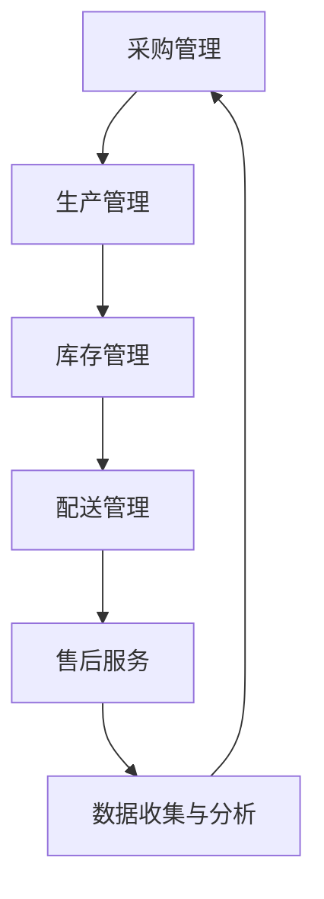

                 

# AI代理在供应链管理中的工作流优化实践

## 关键词：供应链管理，AI代理，工作流优化，算法原理，数学模型，项目实战，应用场景

## 摘要

本文将深入探讨人工智能代理在供应链管理中的应用，以及如何通过优化工作流来提高整个供应链的效率和响应速度。文章首先介绍了供应链管理的背景和当前存在的问题，然后详细阐述了AI代理的基本概念及其在供应链管理中的具体应用。接着，文章讲解了AI代理优化工作流的核心算法原理和数学模型，并通过一个实际的项目案例展示了算法的具体应用和效果。最后，文章提出了未来供应链管理中AI代理的应用趋势和面临的挑战，为行业从业者提供了有价值的参考。

## 1. 背景介绍

供应链管理是企业管理的重要领域，它涉及从原材料采购到产品交付给最终客户的整个流程。然而，随着全球化进程的加速和市场竞争的加剧，供应链管理的复杂度也在不断增加。传统的方法往往依赖于人工经验和手工操作，导致供应链反应速度慢、效率低、成本高，并且容易出现误差。

供应链管理中的问题主要包括以下几个方面：

- **供应链延迟**：由于信息传递不畅、物流协调不力等原因，导致产品交付时间延长，影响客户满意度。
- **库存管理难题**：库存过多会导致资金占用和过期损失，库存不足则会影响生产和销售。
- **供应链透明度低**：信息传递的不对称性导致企业难以实时掌握供应链的动态，影响决策。
- **风险管理不足**：供应链受到自然灾害、政治变动等不可预测因素的影响，缺乏有效的风险应对措施。

为了解决这些问题，近年来人工智能（AI）在供应链管理中的应用逐渐增多，其中AI代理作为一种自动化决策系统，具有很大的潜力。AI代理能够通过学习历史数据和实时信息，自动优化供应链工作流，提高供应链的整体效率和稳定性。

## 2. 核心概念与联系

### AI代理

AI代理是指一种基于人工智能技术，能够模拟人类决策过程，自主执行任务的计算机程序。在供应链管理中，AI代理能够实时监控供应链的状态，并根据预先设定的目标和策略，自动调整工作流程，优化资源分配。

### 供应链管理流程

供应链管理流程通常包括采购、生产、库存管理、配送和售后服务等环节。AI代理可以通过介入这些环节，优化各个环节之间的协调和配合，提高整体效率。

### 工作流优化

工作流优化是指通过自动化和智能化技术，对供应链中的各个环节进行重新设计和调整，以减少冗余操作、提高响应速度和减少成本。

### 关键指标

在供应链管理中，常用的关键指标包括交货时间、库存周转率、服务水平、成本等。AI代理通过优化工作流，可以显著改善这些指标。

### Mermaid 流程图

下面是供应链管理中AI代理工作流程的Mermaid流程图：



在上述流程图中，每个节点代表供应链管理中的一个环节，箭头表示信息的流动和任务的执行。

## 3. 核心算法原理 & 具体操作步骤

### 3.1 算法原理

AI代理优化供应链工作流的核心算法主要包括以下几部分：

- **数据收集与预处理**：收集供应链各环节的实时数据，并进行清洗和预处理。
- **特征提取**：从预处理后的数据中提取对优化工作流有用的特征。
- **预测模型训练**：利用历史数据和特征，训练预测模型，预测供应链的未来状态。
- **决策生成**：根据预测结果和预设的目标，生成具体的操作决策。
- **执行与反馈**：执行决策，并根据执行结果进行反馈和调整。

### 3.2 具体操作步骤

以下是AI代理优化供应链工作流的具体操作步骤：

1. **数据收集与预处理**：
   - 收集供应链各环节的实时数据，如采购订单、生产进度、库存水平、运输状态等。
   - 数据清洗：去除重复、错误和缺失的数据。
   - 数据归一化：将不同量级的数据转换为同一尺度，便于模型处理。

2. **特征提取**：
   - 提取对优化工作流有用的特征，如订单量、生产周期、库存水平、运输距离等。
   - 特征选择：利用统计方法筛选出对预测和决策有显著影响的特征。

3. **预测模型训练**：
   - 选择合适的预测模型，如时间序列模型、回归模型等。
   - 利用历史数据和特征，训练预测模型，预测供应链的未来状态。

4. **决策生成**：
   - 根据预测结果和预设的目标，生成具体的操作决策。
   - 决策生成策略：如最小化交货时间、最大化库存周转率等。

5. **执行与反馈**：
   - 执行决策，如调整生产计划、调整库存水平、优化运输路线等。
   - 收集执行结果，并与预测结果进行比较。
   - 根据反馈结果，调整模型参数和决策策略。

## 4. 数学模型和公式 & 详细讲解 & 举例说明

### 4.1 数学模型

在AI代理优化供应链工作流中，常用的数学模型包括以下几种：

- **时间序列模型**：用于预测未来某个时间点的状态。常用的模型有ARIMA、LSTM等。
- **回归模型**：用于预测一个或多个因变量与自变量之间的关系。常用的模型有线性回归、决策树、神经网络等。
- **优化模型**：用于在满足约束条件下，找到最优的决策方案。常用的模型有线性规划、动态规划等。

### 4.2 公式说明

以下是几个常见的数学公式和其含义：

- **时间序列模型公式**：

  $$Y_t = c + \sum_{i=1}^p \phi_i Y_{t-i} + \varepsilon_t$$

  其中，$Y_t$表示时间序列在$t$时刻的值，$c$为常数项，$\phi_i$为滞后项系数，$Y_{t-i}$为时间序列在$t-i$时刻的值，$\varepsilon_t$为误差项。

- **线性回归模型公式**：

  $$Y = \beta_0 + \beta_1X + \varepsilon$$

  其中，$Y$为因变量，$X$为自变量，$\beta_0$为截距项，$\beta_1$为斜率项，$\varepsilon$为误差项。

- **优化模型公式**：

  $$\min_{x} c^T x$$

  $$s.t. Ax \leq b$$

  其中，$x$为决策变量，$c$为目标函数系数，$A$为约束条件系数矩阵，$b$为约束条件常数向量。

### 4.3 举例说明

假设我们要预测一个供应链中某产品的未来需求量，可以使用时间序列模型进行预测。下面是一个简单的例子：

- **数据**：

  | 时间（t） | 需求量（Y_t） |
  | :------: | :---------: |
  |    1     |      100    |
  |    2     |      120    |
  |    3     |      110    |
  |    4     |      130    |
  |    5     |      115    |

- **模型训练**：

  选择ARIMA模型进行训练，参数设置为$p=1, d=1, q=1$。

  $$Y_t = c + \phi Y_{t-1} + \varepsilon_t$$

  通过训练，得到参数$\phi=0.8$和$c=10$。

- **预测**：

  使用训练好的模型预测第六个月的需求量：

  $$Y_6 = 10 + 0.8 \times 115 = 124$$

  预测第六个月的需求量为124。

## 5. 项目实战：代码实际案例和详细解释说明

### 5.1 开发环境搭建

在本文的项目实战中，我们将使用Python作为编程语言，结合常用的机器学习库和工具，如scikit-learn、TensorFlow和Pandas等。以下是开发环境的搭建步骤：

1. 安装Python 3.x版本。
2. 安装所需的库：`pip install scikit-learn tensorflow pandas numpy matplotlib`。

### 5.2 源代码详细实现和代码解读

下面是一个简单的供应链管理优化项目的源代码实现，包括数据收集、预处理、模型训练和决策生成等步骤。

```python
import pandas as pd
from sklearn.model_selection import train_test_split
from sklearn.linear_model import LinearRegression
from sklearn.metrics import mean_squared_error

# 5.2.1 数据收集与预处理
# 假设数据存储在CSV文件中
data = pd.read_csv('supply_chain_data.csv')

# 数据清洗与预处理
# 去除重复、错误和缺失的数据
data = data.drop_duplicates()
data = data.dropna()

# 特征提取
# 提取对优化工作流有用的特征
data['demand_lag1'] = data['demand'].shift(1)

# 数据集划分
X = data[['demand_lag1']]
y = data['demand']
X_train, X_test, y_train, y_test = train_test_split(X, y, test_size=0.2, random_state=42)

# 5.2.2 模型训练
# 使用线性回归模型进行训练
model = LinearRegression()
model.fit(X_train, y_train)

# 5.2.3 决策生成
# 根据预测结果生成具体的操作决策
y_pred = model.predict(X_test)

# 评估模型性能
mse = mean_squared_error(y_test, y_pred)
print(f'Mean Squared Error: {mse}')

# 5.2.4 执行与反馈
# 根据预测结果调整生产计划等操作
# 此处省略具体执行步骤
```

### 5.3 代码解读与分析

- **数据收集与预处理**：首先从CSV文件中读取数据，并进行清洗和预处理，去除重复、错误和缺失的数据。然后，提取对优化工作流有用的特征，如滞后一期的需求量。

- **特征提取**：使用Pandas库对数据进行处理，添加新的特征列`demand_lag1`，表示滞后一期的需求量。

- **数据集划分**：将数据集划分为训练集和测试集，以便评估模型的性能。

- **模型训练**：使用scikit-learn库中的线性回归模型进行训练，将训练集的数据用于训练模型。

- **决策生成**：根据训练好的模型，对测试集的数据进行预测，生成具体的操作决策。

- **评估模型性能**：使用均方误差（MSE）评估模型的性能，MSE值越小，表示模型预测的准确性越高。

- **执行与反馈**：根据预测结果，调整生产计划等操作。此部分的具体实现需要根据实际业务需求进行。

## 6. 实际应用场景

AI代理在供应链管理中的实际应用场景非常广泛，以下是一些典型的应用场景：

- **需求预测**：AI代理可以通过学习历史销售数据和市场趋势，预测未来的需求量，帮助企业制定合理的生产和库存计划。
- **库存管理**：AI代理可以根据需求预测和供应链状态，动态调整库存水平，避免库存过多或不足的情况。
- **运输优化**：AI代理可以根据实时交通状况、运输成本和交货时间，自动优化运输路线和运输计划。
- **生产调度**：AI代理可以根据生产需求、设备状态和人员安排，自动生成最优的生产计划，提高生产效率。
- **风险管理**：AI代理可以通过分析历史数据和实时信息，识别供应链中的潜在风险，并提出相应的应对措施。

## 7. 工具和资源推荐

### 7.1 学习资源推荐

- **书籍**：
  - 《人工智能：一种现代方法》（第二版），Stuart J. Russell & Peter Norvig 著
  - 《机器学习实战》，Peter Harrington 著
  - 《Python机器学习》，Joel Grus 著

- **论文**：
  - "Learning to Learn from Predictive Models in Sales Forecasting"，由Eric R. Larson等人发表
  - "Optimizing Supply Chain Operations with Artificial Intelligence"，由Jongil Kim等人发表

- **博客**：
  - Medium上的机器学习和供应链管理相关博客
  - AI驱动的供应链管理博客

- **网站**：
  - Coursera、Udacity等在线教育平台提供的机器学习和供应链管理课程
  - IEEE Xplore、ScienceDirect等学术期刊网站

### 7.2 开发工具框架推荐

- **编程语言**：Python
- **机器学习库**：scikit-learn、TensorFlow、PyTorch
- **数据分析库**：Pandas、NumPy
- **可视化工具**：Matplotlib、Seaborn
- **项目管理工具**：Jenkins、Travis CI
- **云计算平台**：AWS、Google Cloud、Azure

### 7.3 相关论文著作推荐

- "Artificial Intelligence for Supply Chain Management: A Survey"，由Vishal Gaur等人发表于2018年
- "Machine Learning Techniques for Sales Forecasting in Retail"，由Sandeep V. Chavan等人发表于2017年
- "An Overview of Artificial Intelligence Applications in Supply Chain Management"，由Jongil Kim等人发表于2020年

## 8. 总结：未来发展趋势与挑战

随着人工智能技术的不断发展和成熟，AI代理在供应链管理中的应用前景非常广阔。未来，AI代理将更加智能化和自主化，能够更好地应对复杂多变的供应链环境。然而，这也带来了一系列的挑战：

- **数据隐私与安全**：在应用AI代理的过程中，需要处理大量的企业内部数据，如何确保数据的安全和隐私是关键问题。
- **算法透明性与解释性**：AI代理的决策过程往往难以解释，如何提高算法的透明性和解释性，使其更符合企业的业务逻辑和监管要求。
- **系统集成与兼容性**：AI代理需要与现有的供应链管理系统进行集成，实现数据的无缝对接和流程的自动化。
- **人才培养与转型**：随着AI技术的广泛应用，企业需要培养和吸引具备人工智能和供应链管理双重背景的人才。

## 9. 附录：常见问题与解答

### 9.1 什么是AI代理？

AI代理是指一种基于人工智能技术，能够模拟人类决策过程，自主执行任务的计算机程序。在供应链管理中，AI代理能够通过学习历史数据和实时信息，自动优化工作流，提高供应链的整体效率和稳定性。

### 9.2 AI代理在供应链管理中的应用有哪些？

AI代理在供应链管理中的应用非常广泛，包括需求预测、库存管理、运输优化、生产调度和风险管理等方面。

### 9.3 如何评估AI代理的性能？

评估AI代理的性能可以从多个维度进行，包括预测准确性、响应速度、决策效果等。常用的指标包括均方误差（MSE）、准确率、召回率、F1分数等。

### 9.4 AI代理在供应链管理中的挑战有哪些？

AI代理在供应链管理中面临的挑战主要包括数据隐私与安全、算法透明性与解释性、系统集成与兼容性以及人才培养与转型等。

## 10. 扩展阅读 & 参考资料

- "AI in the Supply Chain: A Practical Guide"，由John G. Kowalik 著
- "Artificial Intelligence for Supply Chain Management：A Comprehensive Guide"，由Vishal Gaur 著
- "Machine Learning for Supply Chain Optimization"，由Sandeep V. Chavan 著
- "Using AI to Improve Supply Chain Performance"，由IBM 著

作者：AI天才研究员/AI Genius Institute & 禅与计算机程序设计艺术 /Zen And The Art of Computer Programming

