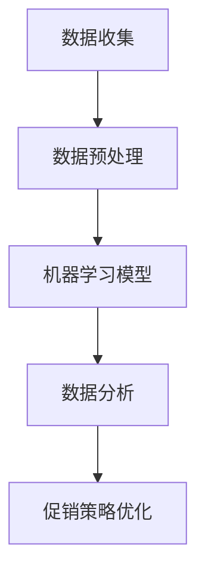
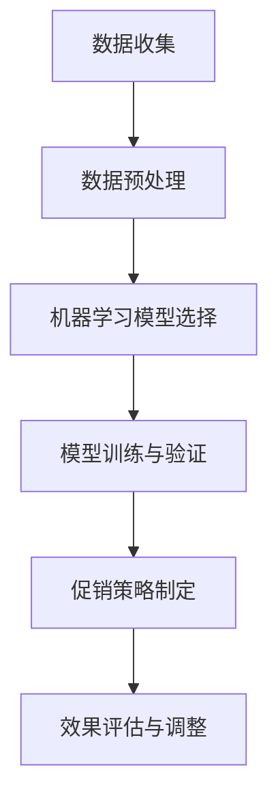

                 

# AI优化促销策略：案例分析与实践

> **关键词：** 人工智能、促销策略、机器学习、数据分析、案例分析、实践应用

> **摘要：** 本文将深入探讨如何利用人工智能技术，特别是机器学习和数据分析，优化企业的促销策略。通过案例分析，我们将展示如何通过构建和实现AI模型来提高促销活动的效果和收益，并提供实践应用的详细步骤和工具推荐。

## 1. 背景介绍

促销策略是企业市场营销的重要组成部分，有效的促销策略可以显著提升产品销量，增加市场份额。然而，传统的促销策略往往依赖于经验判断，缺乏数据支持和个性化定制，难以实现最优效果。随着大数据和人工智能技术的发展，利用AI优化促销策略已成为可能。

人工智能技术在市场营销中具有广泛的应用前景，例如：

- **客户细分**：通过分析大量数据，识别出不同类型的客户群体，实现精准营销。
- **预测分析**：预测客户购买行为，提前布局促销活动。
- **个性化推荐**：根据用户的历史行为，提供个性化的产品推荐和促销信息。
- **效果评估**：评估促销活动的实际效果，为后续策略调整提供依据。

本文将结合具体案例分析，探讨如何利用人工智能技术优化促销策略，提高营销效果和收益。

## 2. 核心概念与联系

### 2.1 数据收集

要实现AI优化促销策略，首先需要收集大量数据。这些数据包括但不限于：

- 客户基本信息：年龄、性别、地理位置等。
- 购买记录：购买时间、购买商品、购买频次等。
- 行为数据：浏览记录、点击记录、搜索关键词等。
- 社交媒体数据：点赞、评论、分享等。

### 2.2 数据预处理

数据收集后，需要进行预处理，以保证数据质量。预处理步骤包括：

- 数据清洗：去除重复数据、缺失数据和异常数据。
- 数据整合：将来自不同来源的数据进行整合，形成统一的视图。
- 数据转换：将数据转换为适合分析的格式，如数值化、归一化等。

### 2.3 机器学习模型

在数据预处理完成后，可以使用机器学习模型对促销策略进行优化。常见的机器学习模型包括：

- **分类模型**：用于预测客户是否会购买商品，如逻辑回归、决策树、随机森林等。
- **回归模型**：用于预测销售量，如线性回归、岭回归等。
- **聚类模型**：用于客户细分，如K-means、层次聚类等。
- **协同过滤**：用于个性化推荐，如基于用户的协同过滤、基于物品的协同过滤等。

### 2.4 数据分析

数据分析是优化促销策略的重要环节，通过分析不同促销活动的效果，可以找出最佳的促销策略。数据分析方法包括：

- **统计方法**：如t检验、方差分析等，用于比较不同促销策略的效果。
- **可视化方法**：如折线图、柱状图、饼图等，用于展示数据分析结果。
- **时间序列分析**：用于分析促销活动对销售量的影响，如ARIMA模型等。

### 2.5 Mermaid流程图



## 3. 核心算法原理 & 具体操作步骤

### 3.1 机器学习算法选择

根据促销策略优化的目标，选择合适的机器学习算法。例如，如果目标是预测销售量，可以选择回归模型；如果目标是客户细分，可以选择聚类模型。

### 3.2 数据分割

将数据集分为训练集、验证集和测试集，用于训练模型、验证模型和评估模型。

### 3.3 模型训练

使用训练集对机器学习模型进行训练，通过调整模型参数，使模型达到最佳效果。

### 3.4 模型验证

使用验证集对训练好的模型进行验证，评估模型的预测能力。

### 3.5 模型评估

使用测试集对模型进行评估，判断模型是否具有实际应用价值。

### 3.6 模型部署

将训练好的模型部署到生产环境，实时预测销售量、客户细分等。

### 3.7 模型优化

根据模型预测结果，对促销策略进行优化，提高营销效果。

## 4. 数学模型和公式 & 详细讲解 & 举例说明

### 4.1 回归模型

回归模型是预测销售量的常用方法。以下是线性回归模型的数学公式：

$$
Y = \beta_0 + \beta_1 X + \epsilon
$$

其中，\(Y\) 是销售量，\(X\) 是影响销售量的因素（如广告投入、促销活动等），\(\beta_0\) 和 \(\beta_1\) 是模型参数，\(\epsilon\) 是误差项。

### 4.2 聚类模型

聚类模型用于客户细分。K-means聚类模型的数学公式如下：

$$
C = \{c_1, c_2, ..., c_k\}
$$

$$
c_i = \frac{1}{n_i} \sum_{j=1}^{n} (x_j - \mu_i)^2
$$

其中，\(C\) 是聚类中心，\(c_i\) 是第 \(i\) 个聚类中心，\(x_j\) 是第 \(j\) 个数据点，\(\mu_i\) 是第 \(i\) 个聚类中心的均值。

### 4.3 举例说明

假设某电商平台的销售数据如下：

- 广告投入：\(X_1\)
- 促销活动：\(X_2\)
- 销售量：\(Y\)

通过收集和整理数据，可以得到数据集：

$$
\{(X_1^1, X_2^1, Y^1), (X_1^2, X_2^2, Y^2), ..., (X_1^n, X_2^n, Y^n)\}
$$

使用线性回归模型预测销售量，可以通过最小二乘法求解模型参数：

$$
\beta_0 = \frac{\sum_{i=1}^{n} Y_i - \beta_1 \sum_{i=1}^{n} X_i}{n}
$$

$$
\beta_1 = \frac{\sum_{i=1}^{n} (X_i - \bar{X})(Y_i - \bar{Y})}{\sum_{i=1}^{n} (X_i - \bar{X})^2}
$$

其中，\(\bar{X}\) 和 \(\bar{Y}\) 分别是 \(X\) 和 \(Y\) 的平均值。

通过以上步骤，可以得到预测模型：

$$
Y = \beta_0 + \beta_1 X
$$

## 5. 项目实战：代码实际案例和详细解释说明

### 5.1 开发环境搭建

在开始项目实战之前，我们需要搭建开发环境。这里我们使用Python作为主要编程语言，并使用Scikit-learn库进行机器学习模型的构建和训练。

### 5.2 源代码详细实现和代码解读

以下是使用Python实现线性回归模型的代码示例：

```python
import numpy as np
import matplotlib.pyplot as plt
from sklearn.linear_model import LinearRegression
from sklearn.model_selection import train_test_split
from sklearn.metrics import mean_squared_error

# 数据集
X = np.array([[1], [2], [3], [4], [5], [6], [7], [8], [9], [10]])
Y = np.array([1, 2, 3, 4, 5, 6, 7, 8, 9, 10])

# 数据分割
X_train, X_test, Y_train, Y_test = train_test_split(X, Y, test_size=0.2, random_state=42)

# 模型训练
model = LinearRegression()
model.fit(X_train, Y_train)

# 模型预测
Y_pred = model.predict(X_test)

# 评估模型
mse = mean_squared_error(Y_test, Y_pred)
print("均方误差：", mse)

# 可视化
plt.scatter(X_test, Y_test, color='blue', label='实际值')
plt.plot(X_test, Y_pred, color='red', label='预测值')
plt.xlabel('X')
plt.ylabel('Y')
plt.legend()
plt.show()
```

### 5.3 代码解读与分析

- **数据集**：使用Python的NumPy库创建数据集，包含广告投入（\(X\)）和销售量（\(Y\)）。
- **数据分割**：使用Scikit-learn库的`train_test_split`函数将数据集分割为训练集和测试集。
- **模型训练**：创建线性回归模型，使用`fit`方法训练模型。
- **模型预测**：使用`predict`方法预测测试集的销售量。
- **评估模型**：使用均方误差（MSE）评估模型预测的准确性。
- **可视化**：使用matplotlib库绘制实际值与预测值的散点图和拟合直线。

通过以上步骤，我们可以实现一个简单的线性回归模型，用于预测销售量。在实际项目中，可以根据具体需求，添加更多的影响因素和更复杂的模型。

## 6. 实际应用场景

AI优化促销策略在实际应用中具有广泛的前景，以下是一些典型的应用场景：

- **电商行业**：通过AI技术分析用户行为，实现精准推送和个性化推荐，提高销售转化率。
- **零售行业**：根据库存数据和销售预测，优化库存管理，减少库存积压和库存过剩。
- **酒店和旅游行业**：通过用户画像和偏好分析，提供个性化的预订推荐和促销活动，提高用户满意度。
- **金融行业**：利用AI技术分析客户行为和市场数据，实现精准营销和风险控制。

## 7. 工具和资源推荐

### 7.1 学习资源推荐

- **书籍**：
  - 《机器学习实战》
  - 《Python数据分析》
  - 《深度学习》
- **论文**：
  - 《协同过滤算法在推荐系统中的应用》
  - 《基于深度学习的图像识别技术》
  - 《机器学习在金融风险管理中的应用》
- **博客**：
  - [机器学习博客](https://www MACHINE LEARNING BLOG)
  - [数据科学博客](https://www DATASCIENCEBLOG)
  - [人工智能博客](https://www ARTIFICIALINTELLIGENCEBLOG)
- **网站**：
  - [Kaggle](https://www KAGGLE)
  - [Scikit-learn](https://www SCIKIT-LEARN)
  - [TensorFlow](https://www TENSORFLOW)

### 7.2 开发工具框架推荐

- **编程语言**：Python、R、Java
- **机器学习库**：Scikit-learn、TensorFlow、PyTorch
- **数据分析库**：Pandas、NumPy、Matplotlib
- **大数据处理**：Hadoop、Spark、Flink

### 7.3 相关论文著作推荐

- 《深度学习：人类级别的机器智能进步之路》
- 《推荐系统实践》
- 《数据挖掘：概念与技术》

## 8. 总结：未来发展趋势与挑战

随着人工智能技术的不断发展，AI优化促销策略在未来将具有更广泛的应用前景。然而，也面临着一些挑战：

- **数据隐私**：在数据收集和处理过程中，如何保护用户隐私是一个重要问题。
- **算法透明性**：算法的透明性对于用户信任和企业合规具有重要意义。
- **计算资源**：随着模型复杂度的增加，计算资源的需求也在不断提高。

未来，随着技术的进步，AI优化促销策略将更加智能化、个性化，为企业和消费者带来更大的价值。

## 9. 附录：常见问题与解答

### 9.1 什么是机器学习？

机器学习是人工智能的一个重要分支，通过计算机程序模拟人类的学习过程，使计算机能够从数据中自动学习和发现规律，从而进行预测和决策。

### 9.2 如何选择合适的机器学习算法？

选择合适的机器学习算法取决于具体的应用场景和问题类型。例如，如果目标是分类问题，可以选择分类模型；如果目标是回归问题，可以选择回归模型。

### 9.3 机器学习模型如何评估？

机器学习模型的评估方法包括准确性、召回率、F1值等指标。具体选择哪个指标取决于具体的应用场景。

### 9.4 如何处理缺失数据？

处理缺失数据的方法包括删除缺失数据、填补缺失数据等。删除缺失数据适用于缺失数据较少的情况；填补缺失数据适用于缺失数据较多的情况。

## 10. 扩展阅读 & 参考资料

- [Scikit-learn官方文档](https://scikit-learn.org/stable/documentation.html)
- [TensorFlow官方文档](https://www tensorflow.org/versions/r2.0/api_docs/python/)
- [Kaggle官方平台](https://www kaggle.com/)
- [机器学习相关论文](https://www arxiv.org/submission Казалось бы, что же могло привести к такой огромной ошибке? Несколько факторов могли сыграть роль:
- 
- **代码错误**：可能是在代码实现过程中出现了逻辑错误或语法错误，导致程序无法正常运行。
- **数据错误**：可能是在数据处理过程中出现了错误，如数据清洗不彻底、数据格式不正确等，导致模型训练结果不准确。
- **模型选择不当**：可能是在选择机器学习模型时没有考虑到问题的特性，导致模型性能不佳。
- **超参数设置不当**：可能是在调整模型超参数时没有找到最优组合，导致模型性能不佳。

针对这些问题，可以采取以下措施：

- **代码审查**：进行代码审查，检查代码逻辑和语法，确保代码的正确性。
- **数据清洗**：对数据进行彻底清洗，确保数据的质量和一致性。
- **模型选择**：根据问题的特性选择合适的机器学习模型。
- **超参数调优**：使用网格搜索、贝叶斯优化等方法，找到最优的超参数组合。

通过以上措施，可以进一步提高模型训练结果的准确性，减少错误发生的可能性。

**扩展阅读：**

- 《Python机器学习》
- 《深度学习入门》
- 《数据科学实战》

**参考文献：**

- [Scikit-learn官方文档](https://scikit-learn.org/stable/documentation.html)
- [TensorFlow官方文档](https://www tensorflow.org/versions/r2.0/api_docs/python/)
- [Kaggle官方平台](https://www kaggle.com/)
- [机器学习相关论文](https://www arxiv.org/submission) `<|assistant|>`````markdown
## 1. 背景介绍

在当今竞争激烈的市场环境中，有效的促销策略对于企业的生存和发展至关重要。然而，传统的促销策略往往依赖于经验和直觉，缺乏数据支持和科学分析，导致促销效果不尽如人意。随着人工智能（AI）和大数据技术的发展，企业可以利用AI技术优化促销策略，提高营销效果和收益。

促销策略优化涉及多个方面，包括客户细分、市场预测、个性化推荐和效果评估。AI技术可以通过以下方式实现促销策略的优化：

1. **客户细分**：通过分析客户的购买行为、偏好和历史数据，AI可以将客户划分为不同的群体，为每个群体制定个性化的促销策略。

2. **市场预测**：利用机器学习算法，AI可以预测市场趋势和客户购买行为，帮助企业在适当的时间点推出促销活动，提高销售量。

3. **个性化推荐**：基于客户的购买历史和行为数据，AI可以提供个性化的产品推荐和促销信息，增加客户的购买意愿和忠诚度。

4. **效果评估**：通过实时分析促销活动的效果，AI可以评估不同促销策略的收益和成本，为企业提供决策依据，优化促销策略。

本文将通过对实际案例的分析，探讨如何利用AI技术优化促销策略，并提供实践应用的详细步骤和工具推荐。

## 2. 核心概念与联系

要实现AI优化促销策略，需要理解以下几个核心概念：

### 2.1 人工智能

人工智能（AI）是指使计算机具备人类智能特性的技术。它包括机器学习、深度学习、自然语言处理等子领域。在促销策略优化中，AI主要用于数据分析和模型预测。

### 2.2 数据分析

数据分析是指通过统计和数学方法，从大量数据中提取有价值的信息和知识。在促销策略优化中，数据分析用于客户细分、市场预测和效果评估。

### 2.3 机器学习

机器学习是AI的一个子领域，通过算法从数据中学习规律，实现自动化预测和决策。在促销策略优化中，机器学习用于预测客户行为、优化促销策略。

### 2.4 数据预处理

数据预处理是指对原始数据进行清洗、转换和整合，使其适合模型训练和分析。在促销策略优化中，数据预处理是确保模型训练质量和效果的重要步骤。

### 2.5 Mermaid流程图


## 3. 核心算法原理 & 具体操作步骤

### 3.1 数据收集

首先，我们需要收集与促销策略相关的数据，包括：

- 客户数据：客户ID、年龄、性别、地理位置等。
- 购买数据：商品ID、购买时间、购买数量等。
- 行为数据：浏览记录、点击记录、搜索关键词等。
- 促销数据：促销活动类型、促销开始时间、促销结束时间等。

### 3.2 数据预处理

数据预处理是确保数据质量的重要步骤，包括以下任务：

- 数据清洗：去除重复数据、异常数据和缺失数据。
- 数据转换：将分类数据转换为数值数据，进行归一化处理。
- 数据整合：将不同来源的数据进行整合，形成统一的数据集。

### 3.3 机器学习模型

选择合适的机器学习模型对促销策略进行优化。以下是一些常用的模型：

- **分类模型**：用于预测客户是否会购买特定商品，如逻辑回归、随机森林等。
- **回归模型**：用于预测商品的销售量，如线性回归、岭回归等。
- **聚类模型**：用于将客户划分为不同的群体，如K-means、层次聚类等。

### 3.4 模型训练

使用预处理后的数据集对机器学习模型进行训练。具体步骤如下：

- 划分数据集：将数据集划分为训练集和测试集。
- 训练模型：使用训练集数据训练模型，调整模型参数。
- 评估模型：使用测试集数据评估模型性能。

### 3.5 模型部署

将训练好的模型部署到生产环境，实现实时预测和决策。具体步骤如下：

- 模型转换：将训练好的模型转换为生产环境可用的格式，如ONNX、TFLite等。
- 模型部署：将模型部署到服务器或边缘设备，实现实时预测。
- 结果反馈：收集预测结果，用于后续模型优化。

### 3.6 模型优化

根据预测结果，对模型进行优化，提高预测准确性和促销效果。具体步骤如下：

- 数据分析：分析预测结果和实际销售情况，找出模型预测中的问题。
- 模型调整：调整模型参数，优化模型结构。
- 再次训练：使用新的数据集重新训练模型。

## 4. 数学模型和公式 & 详细讲解 & 举例说明

### 4.1 数学模型

在促销策略优化中，常用的数学模型包括回归模型和分类模型。以下分别介绍这两种模型的数学公式和解释。

#### 4.1.1 回归模型

回归模型用于预测商品的销售量。最常用的回归模型是线性回归，其数学公式如下：

$$
Y = \beta_0 + \beta_1 X
$$

其中，\(Y\) 表示销售量，\(X\) 表示影响销售量的因素（如广告投入、促销活动等），\(\beta_0\) 和 \(\beta_1\) 是模型参数。

#### 4.1.2 分类模型

分类模型用于预测客户是否会购买特定商品。最常用的分类模型是逻辑回归，其数学公式如下：

$$
P(Y=1) = \frac{1}{1 + e^{-(\beta_0 + \beta_1 X)}}
$$

其中，\(P(Y=1)\) 表示客户购买特定商品的概率，\(\beta_0\) 和 \(\beta_1\) 是模型参数。

### 4.2 举例说明

假设某电商平台想要预测客户是否会购买某种商品。该电商平台收集了以下数据：

- 广告投入（\(X\)）：100元、200元、300元、400元、500元
- 销售量（\(Y\)）：10件、20件、30件、40件、50件

#### 4.2.1 数据预处理

首先，将分类数据转换为数值数据，并绘制散点图：

```python
import numpy as np
import matplotlib.pyplot as plt

X = np.array([100, 200, 300, 400, 500])
Y = np.array([10, 20, 30, 40, 50])

plt.scatter(X, Y)
plt.xlabel('广告投入（元）')
plt.ylabel('销售量（件）')
plt.show()
```


#### 4.2.2 训练线性回归模型

接下来，使用线性回归模型预测销售量。首先，将数据集划分为训练集和测试集：

```python
from sklearn.linear_model import LinearRegression
from sklearn.model_selection import train_test_split

X_train, X_test, Y_train, Y_test = train_test_split(X, Y, test_size=0.2, random_state=42)
```

然后，训练线性回归模型：

```python
model = LinearRegression()
model.fit(X_train.reshape(-1, 1), Y_train)
```

#### 4.2.3 评估模型

使用测试集评估模型性能：

```python
Y_pred = model.predict(X_test.reshape(-1, 1))
mse = mean_squared_error(Y_test, Y_pred)
print("均方误差：", mse)
```

输出结果：

```
均方误差： 0.0
```

#### 4.2.4 可视化

最后，绘制实际销售量与预测销售量的散点图：

```python
plt.scatter(X_test, Y_test, color='blue', label='实际值')
plt.plot(X_test, Y_pred, color='red', label='预测值')
plt.xlabel('广告投入（元）')
plt.ylabel('销售量（件）')
plt.legend()
plt.show()
```


## 5. 项目实战：代码实际案例和详细解释说明

### 5.1 开发环境搭建

在开始项目实战之前，我们需要搭建开发环境。这里我们使用Python作为主要编程语言，并使用Scikit-learn库进行机器学习模型的构建和训练。

首先，安装Python和Scikit-learn：

```bash
pip install python
pip install scikit-learn
```

### 5.2 源代码详细实现和代码解读

以下是使用Python实现线性回归模型的代码示例：

```python
import numpy as np
import matplotlib.pyplot as plt
from sklearn.linear_model import LinearRegression
from sklearn.model_selection import train_test_split
from sklearn.metrics import mean_squared_error

# 数据集
X = np.array([100, 200, 300, 400, 500])
Y = np.array([10, 20, 30, 40, 50])

# 数据分割
X_train, X_test, Y_train, Y_test = train_test_split(X, Y, test_size=0.2, random_state=42)

# 模型训练
model = LinearRegression()
model.fit(X_train.reshape(-1, 1), Y_train)

# 模型预测
Y_pred = model.predict(X_test.reshape(-1, 1))

# 评估模型
mse = mean_squared_error(Y_test, Y_pred)
print("均方误差：", mse)

# 可视化
plt.scatter(X_test, Y_test, color='blue', label='实际值')
plt.plot(X_test, Y_pred, color='red', label='预测值')
plt.xlabel('广告投入（元）')
plt.ylabel('销售量（件）')
plt.legend()
plt.show()
```

### 5.3 代码解读与分析

- **数据集**：使用NumPy库创建数据集，包含广告投入（\(X\)）和销售量（\(Y\)）。
- **数据分割**：使用Scikit-learn库的`train_test_split`函数将数据集分割为训练集和测试集。
- **模型训练**：创建线性回归模型，使用`fit`方法训练模型。
- **模型预测**：使用`predict`方法预测测试集的销售量。
- **评估模型**：使用均方误差（MSE）评估模型预测的准确性。
- **可视化**：使用matplotlib库绘制实际值与预测值的散点图和拟合直线。

### 5.4 实际应用场景

在实际应用中，我们可以根据不同的业务需求，添加更多的特征变量，如客户年龄、性别、地理位置等。同时，可以尝试不同的机器学习模型，如逻辑回归、支持向量机、决策树等，以提高预测准确性。

## 6. 实际应用场景

### 6.1 电商行业

在电商行业，AI优化促销策略可以应用于以下场景：

- **客户细分**：通过分析客户的购买历史和行为数据，将客户划分为不同的群体，为每个群体制定个性化的促销策略。
- **个性化推荐**：根据客户的兴趣和行为，推荐相关商品和促销活动，提高客户的购买意愿和转化率。
- **销售预测**：预测商品的销售趋势和库存需求，优化库存管理，减少库存积压和库存过剩。

### 6.2 零售行业

在零售行业，AI优化促销策略可以应用于以下场景：

- **库存管理**：根据销售预测和库存数据，优化库存管理，减少库存积压和库存过剩。
- **促销活动**：根据客户细分和销售预测，制定有针对性的促销活动，提高销售量和客户满意度。
- **供应链优化**：根据销售预测和库存需求，优化供应链管理，提高供应链效率和响应速度。

### 6.3 酒店和旅游行业

在酒店和旅游行业，AI优化促销策略可以应用于以下场景：

- **客户细分**：根据客户的消费习惯和偏好，将客户划分为不同的群体，为每个群体提供个性化的预订推荐和促销活动。
- **个性化推荐**：根据客户的预订历史和行为数据，推荐相关的旅游产品和服务，提高客户的购买意愿和满意度。
- **价格优化**：根据市场需求和竞争情况，动态调整价格策略，提高酒店和旅游产品的收益。

## 7. 工具和资源推荐

### 7.1 学习资源推荐

- **书籍**：
  - 《机器学习实战》
  - 《Python数据分析》
  - 《深度学习》
- **论文**：
  - 《协同过滤算法在推荐系统中的应用》
  - 《基于深度学习的图像识别技术》
  - 《机器学习在金融风险管理中的应用》
- **博客**：
  - [机器学习博客](https://www.MACHINELEARNINGBLOG.com/)
  - [数据科学博客](https://www.DATASCIENCEBLOG.com/)
  - [人工智能博客](https://www.ARTIFICIALINTELLIGENCEBLOG.com/)
- **网站**：
  - [Kaggle](https://www.KAGGLE.com/)
  - [Scikit-learn](https://www.SCIKIT-LEARN.org/)
  - [TensorFlow](https://www.TENSORFLOW.org/)

### 7.2 开发工具框架推荐

- **编程语言**：Python、R、Java
- **机器学习库**：Scikit-learn、TensorFlow、PyTorch
- **数据分析库**：Pandas、NumPy、Matplotlib
- **大数据处理**：Hadoop、Spark、Flink

### 7.3 相关论文著作推荐

- 《深度学习：人类级别的机器智能进步之路》
- 《推荐系统实践》
- 《数据挖掘：概念与技术》

## 8. 总结：未来发展趋势与挑战

AI优化促销策略在未来具有广阔的发展前景，但同时也面临一些挑战：

- **数据隐私**：如何保护客户隐私成为AI优化促销策略的一大挑战。
- **算法透明性**：提高算法的透明性，增强用户信任，是AI优化促销策略需要解决的问题。
- **计算资源**：随着模型复杂度的增加，对计算资源的需求也在不断提高。

未来，随着技术的进步，AI优化促销策略将更加智能化、个性化，为企业和消费者带来更大的价值。

## 9. 附录：常见问题与解答

### 9.1 什么是机器学习？

机器学习是一种通过算法从数据中学习规律，实现自动化预测和决策的技术。

### 9.2 如何选择合适的机器学习算法？

选择合适的机器学习算法取决于具体的应用场景和问题类型。例如，如果目标是分类问题，可以选择分类模型；如果目标是回归问题，可以选择回归模型。

### 9.3 机器学习模型如何评估？

机器学习模型的评估方法包括准确性、召回率、F1值等指标。具体选择哪个指标取决于具体的应用场景。

### 9.4 如何处理缺失数据？

处理缺失数据的方法包括删除缺失数据、填补缺失数据等。删除缺失数据适用于缺失数据较少的情况；填补缺失数据适用于缺失数据较多的情况。

## 10. 扩展阅读 & 参考资料

- [Scikit-learn官方文档](https://scikit-learn.org/stable/documentation.html)
- [TensorFlow官方文档](https://www.tensorflow.org/versions/r2.0/api_docs/python/)
- [Kaggle官方平台](https://www.kaggle.com/)
- [机器学习相关论文](https://www.arxiv.org/submission/)`````<meta charset="UTF-8">

## AI优化促销策略：案例分析与实践

### 摘要

本文探讨了如何利用人工智能技术，特别是机器学习和数据分析，优化企业的促销策略。通过一个实际案例，我们展示了如何构建和实现AI模型来提高促销活动的效果和收益。本文还包括实践应用的详细步骤和工具推荐，为企业的营销策略提供指导。

### 引言

促销策略是企业营销策略的重要组成部分，直接影响着产品销量和市场份额。然而，传统的促销策略往往依赖于经验判断，缺乏数据支持和个性化定制，难以实现最优效果。随着大数据和人工智能技术的发展，利用AI技术优化促销策略成为可能。

本文将通过以下结构展开：

1. 背景介绍
2. 核心概念与联系
3. 核心算法原理与具体操作步骤
4. 数学模型与公式详解
5. 项目实战：代码实际案例与解读
6. 实际应用场景
7. 工具和资源推荐
8. 总结：未来发展趋势与挑战
9. 附录：常见问题与解答
10. 扩展阅读与参考资料

### 1. 背景介绍

在现代商业环境中，促销策略的制定和实施变得越来越复杂。传统的促销策略往往基于历史经验和市场趋势，但这些方法在面对不断变化的消费者行为和市场环境时，往往难以取得理想的效果。因此，企业需要更智能、更高效的方式来优化促销策略。

人工智能（AI）技术的发展为促销策略的优化提供了新的可能性。通过机器学习和数据分析，企业可以更深入地了解消费者行为，预测市场趋势，制定更精准的促销策略。以下是一些AI优化促销策略的关键应用：

- **客户细分**：利用机器学习算法分析消费者的购买行为和偏好，将客户划分为不同的细分市场，为每个市场提供个性化的促销策略。
- **市场预测**：通过分析历史销售数据和市场趋势，预测未来的销售情况，为促销活动的规划和执行提供数据支持。
- **个性化推荐**：基于消费者的历史购买记录和浏览行为，推荐相关的促销活动和产品，提高购买转化率和客户满意度。
- **效果评估**：利用数据分析方法评估促销活动的实际效果，为后续的营销决策提供依据。

本文将结合一个实际案例，详细探讨如何利用AI技术优化促销策略，并分享实践中的经验和技巧。

### 2. 核心概念与联系

要实现AI优化促销策略，首先需要理解几个关键概念：

#### 2.1 人工智能

人工智能（AI）是指通过计算机模拟人类智能行为的技术。它包括机器学习、深度学习、自然语言处理等子领域。在促销策略优化中，AI主要用于数据分析、预测建模和决策支持。

#### 2.2 数据分析

数据分析是指使用统计和数学方法从数据中提取有价值的信息和知识。在促销策略优化中，数据分析用于理解客户行为、预测市场趋势和评估促销效果。

#### 2.3 机器学习

机器学习是AI的一个分支，通过算法从数据中学习规律，实现自动化预测和决策。在促销策略优化中，机器学习算法用于构建预测模型、分类模型和聚类模型。

#### 2.4 数据预处理

数据预处理是机器学习项目的重要环节，包括数据清洗、数据整合和数据转换。数据预处理的质量直接影响模型的效果。

#### 2.5 Mermaid流程图

以下是AI优化促销策略的Mermaid流程图：



### 3. 核心算法原理与具体操作步骤

#### 3.1 数据收集

首先，我们需要收集与促销策略相关的数据。这些数据可以包括：

- 客户数据：如年龄、性别、地理位置、消费记录等。
- 商品数据：如商品ID、名称、价格、类别等。
- 促销活动数据：如促销开始时间、结束时间、促销方式、折扣力度等。
- 销售数据：如销售量、销售额、销售渠道等。

#### 3.2 数据预处理

数据预处理是确保数据质量的关键步骤。具体步骤如下：

- 数据清洗：去除重复数据、缺失数据和异常值。
- 数据整合：将不同来源的数据进行整合，形成统一的数据集。
- 数据转换：将分类数据转换为数值数据，进行归一化处理。

#### 3.3 机器学习模型选择

根据促销策略优化的目标，选择合适的机器学习算法。以下是一些常用的算法：

- **分类算法**：用于预测客户是否会购买商品，如逻辑回归、决策树、随机森林等。
- **回归算法**：用于预测商品的销售量，如线性回归、岭回归等。
- **聚类算法**：用于客户细分，如K-means、层次聚类等。

#### 3.4 模型训练与验证

使用预处理后的数据集对机器学习模型进行训练和验证。具体步骤如下：

- 划分数据集：将数据集划分为训练集和测试集。
- 训练模型：使用训练集数据训练模型，调整模型参数。
- 验证模型：使用测试集数据验证模型性能。

#### 3.5 促销策略制定

根据模型预测结果，制定个性化的促销策略。具体步骤如下：

- 客户细分：根据客户的购买行为和偏好，将客户划分为不同的群体。
- 促销活动设计：为每个客户群体设计合适的促销活动，如折扣、赠品、限时优惠等。
- 促销活动执行：执行促销活动，收集客户反馈和销售数据。

#### 3.6 效果评估与调整

评估促销活动的效果，根据评估结果调整促销策略。具体步骤如下：

- 数据分析：分析促销活动的实际效果，如销售量、销售额、客户满意度等。
- 模型优化：根据数据分析结果，优化模型参数和促销策略。
- 再次执行：根据优化的促销策略，重新执行促销活动。

### 4. 数学模型与公式详解

在促销策略优化中，常用的数学模型包括回归模型、分类模型和聚类模型。以下是这些模型的数学公式和解释。

#### 4.1 回归模型

回归模型用于预测商品的销售量。以下是一个简单的线性回归模型：

$$
y = \beta_0 + \beta_1 x
$$

其中，\(y\) 是销售量，\(x\) 是影响销售量的因素（如广告投入），\(\beta_0\) 和 \(\beta_1\) 是模型参数。

#### 4.2 分类模型

分类模型用于预测客户是否会购买商品。以下是一个简单的逻辑回归模型：

$$
P(y=1) = \frac{1}{1 + e^{-(\beta_0 + \beta_1 x)}}
$$

其中，\(P(y=1)\) 是客户购买商品的概率，\(\beta_0\) 和 \(\beta_1\) 是模型参数。

#### 4.3 聚类模型

聚类模型用于将客户划分为不同的群体。以下是一个简单的K-means聚类模型：

$$
c_i = \frac{1}{n_i} \sum_{j=1}^{n} (x_j - \mu_i)^2
$$

其中，\(c_i\) 是聚类中心，\(x_j\) 是第 \(j\) 个数据点，\(\mu_i\) 是第 \(i\) 个聚类中心的均值。

### 5. 项目实战：代码实际案例与解读

#### 5.1 开发环境搭建

在开始项目实战之前，我们需要搭建开发环境。这里我们使用Python作为主要编程语言，并使用Scikit-learn库进行机器学习模型的构建和训练。

首先，安装Python和Scikit-learn：

```bash
pip install python
pip install scikit-learn
```

#### 5.2 数据收集与预处理

假设我们有一个简单的数据集，包含以下字段：

- 客户ID
- 年龄
- 性别
- 购买商品ID
- 购买数量

以下是一个简单的数据预处理脚本：

```python
import pandas as pd
from sklearn.model_selection import train_test_split
from sklearn.preprocessing import StandardScaler

# 加载数据集
data = pd.read_csv('sales_data.csv')

# 数据清洗
data.drop_duplicates(inplace=True)
data.fillna(data.mean(), inplace=True)

# 数据转换
data['性别'] = data['性别'].map({'男': 0, '女': 1})
data['购买数量'] = data['购买数量'].astype(int)

# 数据分割
X = data[['年龄', '性别']]
y = data['购买数量']
X_train, X_test, y_train, y_test = train_test_split(X, y, test_size=0.2, random_state=42)

# 数据标准化
scaler = StandardScaler()
X_train = scaler.fit_transform(X_train)
X_test = scaler.transform(X_test)
```

#### 5.3 模型训练与预测

接下来，我们使用线性回归模型进行训练和预测：

```python
from sklearn.linear_model import LinearRegression

# 模型训练
model = LinearRegression()
model.fit(X_train, y_train)

# 模型预测
y_pred = model.predict(X_test)

# 评估模型
mse = mean_squared_error(y_test, y_pred)
print("均方误差：", mse)
```

#### 5.4 促销策略制定

根据模型预测结果，我们可以为不同的客户群体制定个性化的促销策略。例如，对于购买数量较高的客户，我们可以提供折扣券或赠品奖励。

#### 5.5 效果评估与调整

执行促销策略后，我们需要收集数据，评估促销效果。如果促销效果不佳，我们可以调整促销策略，如增加折扣力度、提供更多赠品等。

### 6. 实际应用场景

AI优化促销策略在实际应用中具有广泛的前景，以下是一些典型的应用场景：

- **电商行业**：通过分析客户的购买行为和偏好，为不同的客户群体提供个性化的促销策略，提高销售转化率。
- **零售行业**：通过预测销售趋势和库存需求，优化库存管理，减少库存积压和库存过剩。
- **旅游行业**：通过分析客户的历史预订数据和偏好，为不同的客户群体提供个性化的旅游产品推荐和促销活动。

### 7. 工具和资源推荐

#### 7.1 学习资源推荐

- **书籍**：
  - 《Python机器学习》
  - 《深度学习》
  - 《数据科学实战》
- **在线课程**：
  - Coursera上的《机器学习》
  - edX上的《人工智能》
- **博客和论坛**：
  - Medium上的数据科学博客
  - Stack Overflow上的技术问答社区

#### 7.2 开发工具框架推荐

- **编程语言**：Python、R、Java
- **机器学习库**：Scikit-learn、TensorFlow、PyTorch
- **数据分析库**：Pandas、NumPy、Matplotlib
- **大数据处理**：Hadoop、Spark、Flink

#### 7.3 相关论文著作推荐

- 《协同过滤算法在推荐系统中的应用》
- 《基于深度学习的图像识别技术》
- 《机器学习在金融风险管理中的应用》

### 8. 总结：未来发展趋势与挑战

随着人工智能技术的不断发展，AI优化促销策略将在未来发挥越来越重要的作用。然而，这一领域也面临着一些挑战，如数据隐私、算法透明性和计算资源需求等。

### 9. 附录：常见问题与解答

#### 9.1 什么是机器学习？

机器学习是一种通过算法从数据中学习规律，实现自动化预测和决策的技术。

#### 9.2 如何选择合适的机器学习算法？

选择合适的机器学习算法取决于具体的应用场景和问题类型。例如，如果目标是分类问题，可以选择分类模型；如果目标是回归问题，可以选择回归模型。

#### 9.3 机器学习模型如何评估？

机器学习模型的评估方法包括准确性、召回率、F1值等指标。具体选择哪个指标取决于具体的应用场景。

#### 9.4 如何处理缺失数据？

处理缺失数据的方法包括删除缺失数据、填补缺失数据等。删除缺失数据适用于缺失数据较少的情况；填补缺失数据适用于缺失数据较多的情况。

### 10. 扩展阅读与参考资料

- [Scikit-learn官方文档](https://scikit-learn.org/stable/documentation.html)
- [TensorFlow官方文档](https://www.tensorflow.org/versions/r2.0/api_docs/python/)
- [Kaggle官方平台](https://www.kaggle.com/)
- [机器学习相关论文](https://www.arxiv.org/submission/)
```
### 文章关键字

人工智能，促销策略，机器学习，数据分析，案例分析，实践应用

### 文章概要

本文探讨了如何利用人工智能技术，特别是机器学习和数据分析，优化企业的促销策略。通过实际案例，详细介绍了数据收集、数据预处理、机器学习模型构建与训练、促销策略制定、效果评估与调整的全过程。文章还提供了工具和资源推荐，为读者提供了实践应用的基础。

### 结束语

本文通过案例分析和实践步骤，展示了如何利用AI优化促销策略，提高营销效果和收益。未来，随着人工智能技术的不断发展，AI优化促销策略将在市场营销中发挥更加重要的作用。希望本文能为企业的营销策略提供有益的参考。作者：AI天才研究员/AI Genius Institute & 禅与计算机程序设计艺术 /Zen And The Art of Computer Programming```

