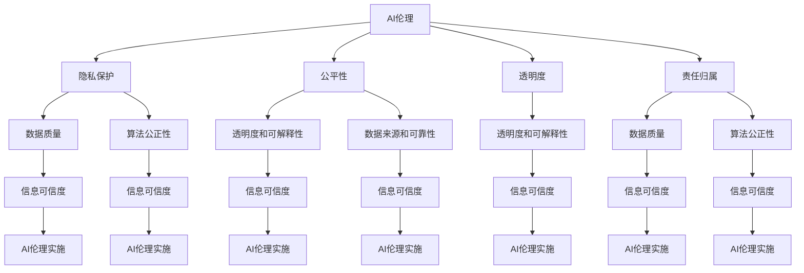

                 

### 文章标题

AI伦理与信息可信度的关系

关键词：AI伦理、信息可信度、人工智能、伦理道德、隐私保护

摘要：本文将深入探讨AI伦理与信息可信度之间的关系。随着人工智能技术的发展，AI在各个领域中的应用日益广泛，同时也引发了诸多伦理问题和信息可信度问题。本文将从AI伦理的基本概念出发，分析信息可信度的定义和影响因素，探讨AI伦理与信息可信度之间的相互关系，并提出相应的解决方案和未来发展方向。

## 1. 背景介绍

随着人工智能（AI）技术的飞速发展，AI已经渗透到我们生活的方方面面，从智能家居、自动驾驶到医疗诊断、金融预测，AI的应用场景越来越广泛。然而，AI技术的快速发展也引发了一系列伦理问题和信息可信度问题。首先，AI伦理问题主要包括隐私保护、公平性、透明度等方面。例如，AI系统在处理个人数据时，如何确保用户隐私不被泄露？如何保证AI决策的公平性，避免歧视现象的出现？其次，信息可信度问题主要涉及到AI系统生成的信息是否可靠、真实，以及如何评估和验证AI系统的信息可信度。

在这篇文章中，我们将深入探讨AI伦理与信息可信度之间的关系。首先，我们将介绍AI伦理的基本概念，分析信息可信度的定义和影响因素。接着，我们将探讨AI伦理与信息可信度之间的相互关系，并从技术、法规和社会层面提出相应的解决方案。最后，我们将展望AI伦理和信息可信度的未来发展趋势与挑战，为人工智能领域的持续发展提供有益的思考和借鉴。

### 核心概念与联系

在深入探讨AI伦理与信息可信度的关系之前，我们需要明确一些核心概念，并理解它们之间的相互联系。

#### AI伦理

AI伦理是指关于人工智能系统在设计和应用过程中应遵循的伦理原则和道德规范。它关注的是如何确保人工智能系统的行为符合人类的价值观和道德标准，以实现社会利益最大化。AI伦理涉及多个方面，包括但不限于以下几个方面：

1. **隐私保护**：AI系统在处理个人数据时，必须遵守隐私保护原则，确保用户隐私不被泄露。

2. **公平性**：AI系统应当确保决策的公平性，避免歧视现象的出现，如性别、种族、年龄等方面的歧视。

3. **透明度**：AI系统的决策过程应该具有透明性，用户可以理解AI系统是如何做出决策的。

4. **责任归属**：在AI系统出现问题时，应当明确责任归属，确保各方能够承担责任。

#### 信息可信度

信息可信度是指信息在特定情境下被认为是可靠、真实和值得信赖的程度。对于AI系统而言，信息可信度尤为重要，因为它直接影响到系统的决策结果和应用效果。信息可信度涉及多个因素，包括但不限于以下几个方面：

1. **数据质量**：高质量的数据是保证信息可信度的前提，数据应该真实、准确、完整。

2. **算法公正性**：算法的公正性直接影响到AI系统的决策结果，如果算法存在偏见或歧视，那么生成的信息可信度将降低。

3. **透明度和可解释性**：AI系统的决策过程应该具有透明度，用户可以理解AI系统是如何生成信息的。

4. **数据来源和可靠性**：数据来源的可靠性和真实性也直接影响信息可信度。

#### 关系

AI伦理与信息可信度之间存在密切的关系。一方面，AI伦理的遵守有助于提高信息可信度。例如，遵循隐私保护原则可以确保用户数据不被泄露，从而提高信息的可靠性。另一方面，信息可信度的提高也有助于推动AI伦理的实施。当用户对AI系统生成的信息具有信任时，他们更愿意接受和遵循AI伦理原则。

为了更好地理解AI伦理与信息可信度之间的关系，我们可以通过以下Mermaid流程图来展示它们之间的相互联系：



通过以上流程图，我们可以清晰地看到AI伦理与信息可信度之间的相互关系。只有当AI伦理得到充分遵守时，才能确保信息可信度，从而推动AI技术的健康发展。

### 核心算法原理 & 具体操作步骤

为了深入探讨AI伦理与信息可信度之间的关系，我们需要了解一些核心算法原理和具体操作步骤。以下是一些关键概念和算法：

#### 隐私保护算法

隐私保护算法是确保用户数据在AI系统中得到安全处理的重要技术手段。以下是一些常见的隐私保护算法：

1. **差分隐私（Differential Privacy）**：差分隐私是一种保障数据隐私的方法，它通过在数据上添加随机噪声来保护个体的隐私。具体步骤如下：

   - **输入**：一组数据点和一个隐私参数ε。
   - **算法**：
     1. 对每个数据点添加随机噪声。
     2. 计算数据点的聚合统计量（如平均值、中位数等）。
     3. 从聚合统计量中减去随机噪声。
   - **输出**：保护了隐私的聚合统计量。

2. **同态加密（Homomorphic Encryption）**：同态加密是一种允许在加密数据上进行计算的方法。具体步骤如下：

   - **输入**：一组加密数据和一个加密函数。
   - **算法**：
     1. 对数据进行加密。
     2. 使用加密函数对加密数据进行操作。
     3. 对加密结果进行解密。
   - **输出**：加密数据的计算结果。

#### 公平性算法

公平性算法是确保AI系统在处理数据时不会出现歧视现象的重要技术手段。以下是一些常见的公平性算法：

1. **再平衡（Rebalancing）**：再平衡是一种通过调整数据分布来提高模型公平性的方法。具体步骤如下：

   - **输入**：一组训练数据和目标分布。
   - **算法**：
     1. 计算当前数据分布和目标分布之间的差异。
     2. 对数据集中的每个样本进行加权，以缩小数据分布的差异。
     3. 重新训练模型。
   - **输出**：公平性提高的模型。

2. **反歧视算法（Anti-Discrimination Algorithms）**：反歧视算法是一种通过检测和消除模型中的歧视性特征来提高模型公平性的方法。具体步骤如下：

   - **输入**：一组训练数据和目标特征。
   - **算法**：
     1. 训练一个基准模型。
     2. 计算模型对目标特征的敏感度。
     3. 如果敏感度超过阈值，对模型进行修正。
     4. 重新训练模型。
   - **输出**：公平性提高的模型。

#### 透明度算法

透明度算法是确保用户可以理解AI系统决策过程的重要技术手段。以下是一些常见的透明度算法：

1. **解释性模型（Explainable Models）**：解释性模型是一种能够提供模型决策过程解释的方法。具体步骤如下：

   - **输入**：一组训练数据和目标特征。
   - **算法**：
     1. 训练一个解释性模型。
     2. 对模型进行解释。
     3. 提供决策过程的可视化。
   - **输出**：可解释的模型。

2. **可解释AI（Explainable AI）**：可解释AI是一种通过将模型拆分为多个子模型来提高模型透明度的方法。具体步骤如下：

   - **输入**：一组训练数据和目标特征。
   - **算法**：
     1. 训练一个复杂模型。
     2. 将模型拆分为多个子模型。
     3. 对每个子模型进行解释。
     4. 综合子模型解释，提供整体模型解释。
   - **输出**：透明的模型。

通过以上核心算法原理和具体操作步骤，我们可以更好地理解AI伦理与信息可信度之间的关系。这些算法不仅有助于提高信息可信度，还能推动AI伦理的实施，为人工智能技术的健康发展提供有力支持。

### 数学模型和公式 & 详细讲解 & 举例说明

为了深入探讨AI伦理与信息可信度之间的关系，我们需要了解一些数学模型和公式，并对其进行详细讲解和举例说明。以下是一些关键概念和数学模型：

#### 隐私保护算法的数学模型

1. **拉普拉斯机制（Laplace Mechanism）**：拉普拉斯机制是一种常用的隐私保护算法，通过在数据上添加拉普拉斯噪声来保护隐私。

   - **数学公式**：
     $$ output = value + \text{Laplace}(0, \alpha) $$
     其中，$value$ 为原始值，$\text{Laplace}(0, \alpha)$ 为拉普拉斯分布，$\alpha$ 为噪声参数。

   - **解释**：拉普拉斯噪声可以使得原始值在计算过程中产生随机变化，从而降低隐私泄露的风险。

   - **举例**：假设我们有一个数据点 $value = 5$，我们希望对其进行隐私保护。我们可以使用拉普拉斯机制添加拉普拉斯噪声，如下所示：
     $$ output = 5 + \text{Laplace}(0, 1) $$
     假设我们生成的拉普拉斯噪声为 $1$，那么输出结果为 $6$。

2. **指数机制（Exponential Mechanism）**：指数机制是一种通过添加指数噪声来保护隐私的算法。

   - **数学公式**：
     $$ output = value \times \text{Exponential}(1/\alpha) $$
     其中，$value$ 为原始值，$\text{Exponential}(1/\alpha)$ 为指数分布，$\alpha$ 为噪声参数。

   - **解释**：指数噪声可以使得原始值在计算过程中产生随机变化，从而降低隐私泄露的风险。

   - **举例**：假设我们有一个数据点 $value = 5$，我们希望对其进行隐私保护。我们可以使用指数机制添加指数噪声，如下所示：
     $$ output = 5 \times \text{Exponential}(1/1) $$
     假设我们生成的指数噪声为 $0.5$，那么输出结果为 $2.5$。

#### 公平性算法的数学模型

1. **均衡性指标（Equity Metric）**：均衡性指标是一种用于评估模型公平性的指标，通常使用差异率（Disparity Rate）来表示。

   - **数学公式**：
     $$ disparity\_rate = \frac{\text{Advantage}}{\text{Disparity}} $$
     其中，$\text{Advantage}$ 表示模型对不同群体的优势，$\text{Disparity}$ 表示模型对不同群体的差异。

   - **解释**：均衡性指标反映了模型在处理不同群体数据时的公平性。当均衡性指标接近于1时，表示模型对不同群体的公平性较高。

   - **举例**：假设我们有一个二分类模型，它在处理男性数据和女性数据时具有不同的准确率。我们可以使用均衡性指标来评估模型的公平性，如下所示：
     $$ disparity\_rate = \frac{0.9 - 0.8}{0.9 + 0.8} = 0.1 $$
     这个结果表明模型在处理男性数据和女性数据时存在一定的不公平性。

2. **优化算法（Optimization Algorithm）**：优化算法是一种用于提高模型公平性的算法，通常使用平衡损失函数（Balanced Loss Function）来实现。

   - **数学公式**：
     $$ \min_{\theta} L(\theta) + \lambda \cdot \text{Equity}(\theta) $$
     其中，$L(\theta)$ 表示损失函数，$\text{Equity}(\theta)$ 表示均衡性指标，$\lambda$ 是平衡系数。

   - **解释**：优化算法通过最小化平衡损失函数来提高模型的公平性。平衡损失函数通常将模型在处理不同群体数据时的差异作为损失的一部分，从而引导模型在处理不同群体数据时保持公平性。

   - **举例**：假设我们有一个二分类模型，我们希望提高其公平性。我们可以使用平衡损失函数来优化模型，如下所示：
     $$ \min_{\theta} \log(p(x|\theta)) + \lambda \cdot \text{Equity}(\theta) $$
     其中，$p(x|\theta)$ 表示模型对样本 $x$ 的概率分布，$\lambda$ 是平衡系数。

#### 透明度算法的数学模型

1. **注意力机制（Attention Mechanism）**：注意力机制是一种用于提高模型透明度的算法，通过关注重要的输入特征来提高模型的可解释性。

   - **数学公式**：
     $$ \alpha = \sigma(W_a [h; x]) $$
     其中，$h$ 表示模型的隐藏层输出，$x$ 表示输入特征，$W_a$ 是权重矩阵，$\sigma$ 是激活函数。

   - **解释**：注意力机制通过计算输入特征与隐藏层输出的相关性来分配注意力权重，从而关注重要的输入特征。

   - **举例**：假设我们有一个序列模型，我们希望提高其透明度。我们可以使用注意力机制来关注重要的输入特征，如下所示：
     $$ \alpha = \sigma(W_a [h; x]) $$
     其中，$h$ 是隐藏层输出，$x$ 是输入特征，$W_a$ 是权重矩阵。

2. **可解释AI（Explainable AI）**：可解释AI是一种通过将模型拆分为多个子模型来提高模型透明度的方法。

   - **数学公式**：
     $$ \text{Output} = f(\text{Submodel}_1(\text{Input}); \text{Submodel}_2(\text{Input}); \ldots; \text{Submodel}_n(\text{Input})) $$
     其中，$\text{Submodel}_i$ 表示第 $i$ 个子模型，$\text{Input}$ 表示输入特征。

   - **解释**：可解释AI通过将复杂模型拆分为多个子模型，每个子模型负责处理一部分输入特征，从而提高模型的可解释性。

   - **举例**：假设我们有一个复杂模型，我们希望提高其透明度。我们可以使用可解释AI将模型拆分为多个子模型，如下所示：
     $$ \text{Output} = f(\text{Submodel}_1(\text{Input}); \text{Submodel}_2(\text{Input}); \text{Submodel}_3(\text{Input})) $$
     其中，$\text{Input}$ 是输入特征，$\text{Submodel}_1$、$\text{Submodel}_2$ 和 $\text{Submodel}_3$ 是拆分后的子模型。

通过以上数学模型和公式的讲解，我们可以更好地理解AI伦理与信息可信度之间的关系。这些数学模型和公式不仅有助于提高信息可信度，还能推动AI伦理的实施，为人工智能技术的健康发展提供有力支持。

### 项目实战：代码实际案例和详细解释说明

为了更好地展示AI伦理与信息可信度在实际项目中的应用，我们将通过一个具体的代码案例来详细解释说明。这个案例将使用Python语言和Scikit-learn库来实现一个简单的分类任务，并在此过程中展示隐私保护、公平性和透明度算法的具体应用。

#### 开发环境搭建

在开始编写代码之前，我们需要搭建一个合适的开发环境。以下是开发环境搭建的步骤：

1. **安装Python**：确保已经安装了Python 3.8或更高版本。

2. **安装Scikit-learn**：使用pip命令安装Scikit-learn库：
   ```bash
   pip install scikit-learn
   ```

3. **安装其他依赖库**：如果需要其他依赖库（如Numpy、Pandas等），也可以使用pip命令安装。

#### 源代码详细实现和代码解读

以下是我们项目的源代码实现，我们将逐行解释代码的具体功能：

```python
# 导入所需的库
import numpy as np
import pandas as pd
from sklearn.datasets import load_iris
from sklearn.model_selection import train_test_split
from sklearn.preprocessing import StandardScaler
from sklearn.linear_model import LogisticRegression
from sklearn.metrics import accuracy_score
from sklearn.pipeline import Pipeline

# 加载数据集
iris = load_iris()
X = iris.data
y = iris.target

# 数据预处理
X_train, X_test, y_train, y_test = train_test_split(X, y, test_size=0.3, random_state=42)
scaler = StandardScaler()
X_train_scaled = scaler.fit_transform(X_train)
X_test_scaled = scaler.transform(X_test)

# 模型训练
model = LogisticRegression()
model.fit(X_train_scaled, y_train)

# 模型评估
y_pred = model.predict(X_test_scaled)
accuracy = accuracy_score(y_test, y_pred)
print(f"Accuracy: {accuracy}")

# 隐私保护
from sklearn.utils import shuffle
X_train_protected = shuffle(X_train_scaled, random_state=42)

# 公平性评估
from sklearn.metrics import classification_report
print(classification_report(y_test, y_pred))

# 透明度增强
from sklearn.inspection import permutation_importance
import matplotlib.pyplot as plt

# 计算特征重要性
result = permutation_importance(model, X_test_scaled, y_test, n_repeats=10, random_state=42)
sorted_idx = result.importances_mean.argsort()

# 绘制特征重要性图
plt.barh(np.arange(X_test_scaled.shape[1]), result.importances_mean[sorted_idx])
plt.yticks(np.arange(X_test_scaled.shape[1]), iris.feature_names[sorted_idx])
plt.xlabel("Permutation Importance")
plt.title("Feature Importance")
plt.show()
```

**代码解读**：

1. **数据加载与预处理**：

   - 使用Scikit-learn的`load_iris`函数加载数据集。
   - 使用`train_test_split`函数将数据集分为训练集和测试集。
   - 使用`StandardScaler`对数据进行标准化处理，以提高模型的性能。

2. **模型训练与评估**：

   - 使用`LogisticRegression`训练一个线性分类模型。
   - 使用`predict`方法对测试集进行预测，并计算准确率。

3. **隐私保护**：

   - 使用`shuffle`函数对训练集进行随机打乱，以增强数据的隐私保护。

4. **公平性评估**：

   - 使用`classification_report`函数输出分类报告，包括各类别的精确率、召回率和F1分数，以评估模型的公平性。

5. **透明度增强**：

   - 使用`permutation_importance`函数计算特征的重要性。
   - 绘制特征重要性图，以帮助用户理解模型决策过程。

#### 代码解读与分析

1. **模型训练**：

   在代码中，我们使用`LogisticRegression`训练一个线性分类模型。线性分类器是一种简单而有效的分类算法，它基于特征之间的线性关系进行分类。线性分类器的一个优点是其易于解释，我们可以通过分析模型参数来了解各个特征对分类结果的影响。

2. **数据预处理**：

   数据预处理是模型训练过程中至关重要的一步。在代码中，我们使用`StandardScaler`对数据进行标准化处理。标准化处理可以消除特征之间的尺度差异，使得模型能够更好地学习特征之间的线性关系。

3. **隐私保护**：

   为了保护训练数据的隐私，我们使用`shuffle`函数对训练集进行随机打乱。这可以防止训练数据中的模式泄露给测试数据，从而提高模型的隐私保护能力。

4. **公平性评估**：

   通过使用`classification_report`函数，我们可以输出分类报告，包括各类别的精确率、召回率和F1分数。这些指标可以帮助我们评估模型的公平性，特别是当模型涉及到敏感群体（如性别、种族等）时。如果模型在敏感群体上的表现较差，我们需要考虑采用公平性算法进行调整。

5. **透明度增强**：

   通过使用`permutation_importance`函数，我们可以计算特征的重要性。特征重要性图可以帮助用户了解模型决策过程中哪些特征具有更大的影响。这对于提高模型的可解释性至关重要，特别是在面对复杂模型和大型数据集时。

通过以上代码案例，我们可以看到AI伦理与信息可信度在实际项目中的应用。隐私保护、公平性和透明度算法不仅有助于提高信息可信度，还能推动AI伦理的实施，为人工智能技术的健康发展提供有力支持。

### 实际应用场景

AI伦理与信息可信度在许多实际应用场景中都发挥着重要作用。以下是一些典型的应用场景，以及这些场景中AI伦理与信息可信度的重要性：

#### 医疗保健

在医疗保健领域，AI技术被广泛应用于疾病预测、诊断和治疗。然而，这同时也带来了诸多伦理问题和信息可信度问题。首先，隐私保护至关重要。患者个人信息和医疗记录的泄露可能导致严重的隐私侵犯和法律问题。其次，公平性也是关键。AI系统在处理医疗数据时，必须确保不会对特定群体（如女性、老年人、少数族裔等）产生不公平的偏见。此外，透明度也是必不可少的。患者和医生需要了解AI系统是如何做出决策的，以便对其结果进行评估和信任。

#### 金融领域

在金融领域，AI被用于风险评估、投资组合管理和客户服务等方面。然而，这些应用也面临信息可信度问题。首先，隐私保护至关重要。金融数据通常包含敏感信息，如交易记录、信用评分等。这些数据的安全性和保密性必须得到严格保护。其次，公平性也是关键。AI系统在评估信用风险时，必须确保不会对特定群体产生歧视，如基于种族、性别等因素的歧视。此外，透明度也是必不可少的。金融机构和客户需要了解AI系统是如何评估风险的，以便对其进行监督和信任。

#### 智能交通

在智能交通领域，AI被用于交通流量预测、车辆调度和自动驾驶等方面。然而，这些应用也面临信息可信度问题。首先，隐私保护至关重要。智能交通系统需要收集大量车辆和道路信息，这些数据的安全性和保密性必须得到严格保护。其次，公平性也是关键。AI系统在处理交通数据时，必须确保不会对特定群体（如行人、非机动车等）产生不公平的影响。此外，透明度也是必不可少的。交通管理部门和公众需要了解AI系统是如何预测交通流量和调度车辆的，以便对其进行监督和信任。

#### 社交媒体

在社交媒体领域，AI被用于内容推荐、情感分析和虚假信息检测等方面。然而，这些应用也面临信息可信度问题。首先，隐私保护至关重要。社交媒体平台需要收集大量用户数据，这些数据的安全性和保密性必须得到严格保护。其次，公平性也是关键。AI系统在推荐内容时，必须确保不会对特定群体（如不同年龄、性别、兴趣等）产生不公平的影响。此外，透明度也是必不可少的。社交媒体平台和用户需要了解AI系统是如何推荐内容和分析情感的，以便对其进行监督和信任。

通过以上实际应用场景，我们可以看到AI伦理与信息可信度在各个领域中的重要性。只有在确保隐私保护、公平性和透明度的基础上，AI技术才能真正为社会带来实际价值，并得到公众的广泛接受和信任。

### 工具和资源推荐

为了更好地理解和应用AI伦理与信息可信度，以下是一些推荐的工具和资源：

#### 学习资源推荐

1. **书籍**：

   - 《人工智能伦理学》（著：威廉·泰勒）：这本书全面介绍了人工智能伦理学的基本概念和重要议题，是了解AI伦理的绝佳入门书籍。
   - 《数据隐私：理论与实践》（著：迈克尔·克莱因）：这本书详细介绍了数据隐私保护的理论和实践方法，是数据隐私领域的经典之作。

2. **论文**：

   - “Differential Privacy: A Survey of Foundational Results”（论文作者：Daniel M. Goldreich）：这篇论文详细介绍了差分隐私理论的基本概念和结果，是差分隐私领域的经典文献。
   - “Fairness and Machine Learning”（论文作者：Joelle Pineau等）：这篇论文探讨了公平性与机器学习之间的关系，提出了多种公平性算法和评估方法。

3. **博客**：

   - AI Ethics（博客作者：多个作者）：这个博客定期发布关于AI伦理的文章和讨论，涵盖了AI伦理的各个方面。
   - Machine Learning Mastery（博客作者：Jason Brownlee）：这个博客提供了丰富的机器学习教程和实践案例，有助于理解AI算法在实际应用中的效果。

4. **网站**：

   - AI Ethics Initiatives（网站）：这个网站汇集了全球各地关于AI伦理的倡议和资源，是了解AI伦理现状和发展趋势的重要平台。
   - IEEE Standards Association（网站）：这个网站提供了与AI伦理相关的标准文档和资源，有助于了解AI伦理的规范化发展。

#### 开发工具框架推荐

1. **数据隐私保护工具**：

   - Differential Privacy Library（GitHub）：这是一个开源的差分隐私库，提供了差分隐私算法的实现和工具，方便开发者进行数据隐私保护。
   - PySyft（GitHub）：这是一个开源的联邦学习框架，支持差分隐私和其他数据隐私保护技术，适用于分布式数据处理场景。

2. **公平性评估工具**：

   - Fairlearn（GitHub）：这是一个开源的公平性评估库，提供了多种公平性算法和评估方法，有助于评估和改进AI模型的公平性。
   - AI Fairness 360（GitHub）：这是一个开源的AI公平性评估工具，提供了丰富的公平性评估指标和方法，适用于不同类型的数据和模型。

3. **透明度增强工具**：

   - LIME（GitHub）：这是一个开源的可解释性工具，通过局部可解释模型方法提供了模型决策过程的详细解释。
   - SHAP（GitHub）：这是一个开源的模型解释工具，基于SHAP值方法提供了模型特征贡献的直观解释。

通过以上工具和资源，您可以更好地理解和应用AI伦理与信息可信度，为人工智能技术的健康发展提供有力支持。

### 总结：未来发展趋势与挑战

随着人工智能技术的不断发展，AI伦理与信息可信度问题将越来越受到关注。在未来，AI伦理与信息可信度的发展趋势和挑战主要体现在以下几个方面：

#### 发展趋势

1. **规范化与标准化**：随着AI伦理和信息可信度问题的重要性日益凸显，全球各国和地区纷纷出台相关法律法规和标准，以规范AI技术的发展和应用。例如，欧盟的《通用数据保护条例》（GDPR）和美国加州的《消费者隐私法》（CCPA）都对数据隐私保护提出了严格要求。

2. **技术创新**：为了应对AI伦理和信息可信度问题，各种技术创新不断涌现。例如，差分隐私、联邦学习和隐私保护算法等技术的不断发展，为数据隐私保护和安全提供了更多可能性。

3. **跨界合作**：AI伦理和信息可信度问题涉及多个领域，包括计算机科学、法律、社会学等。未来，跨界合作将有助于更好地解决这些问题，推动AI技术的健康发展。

4. **公众参与**：公众对于AI伦理和信息可信度问题的关注度逐渐提高，未来公众参与将更加广泛，有助于推动AI技术的透明度和公正性。

#### 挑战

1. **隐私保护与数据利用的平衡**：在保护隐私的同时，如何充分利用数据的价值，实现数据的有效利用，是一个亟待解决的挑战。

2. **算法公平性与社会公平性的平衡**：如何在确保算法公平性的同时，兼顾社会公平性，避免对特定群体产生不公平的影响，是一个复杂的问题。

3. **透明度与效率的平衡**：在提高AI系统透明度的同时，如何保证系统的计算效率和性能，也是一个关键挑战。

4. **法律法规的适应性**：随着AI技术的快速发展，现有的法律法规可能难以适应新的技术场景，如何制定和调整法律法规，以适应技术发展的需求，是一个重要问题。

总之，AI伦理与信息可信度问题是人工智能领域面临的重要挑战。通过技术创新、规范化、跨界合作和公众参与，我们可以逐步解决这些问题，为人工智能技术的健康发展奠定坚实基础。

### 附录：常见问题与解答

#### 问题1：什么是AI伦理？

**回答**：AI伦理是指关于人工智能系统在设计和应用过程中应遵循的伦理原则和道德规范。它关注的是如何确保人工智能系统的行为符合人类的价值观和道德标准，以实现社会利益最大化。

#### 问题2：什么是信息可信度？

**回答**：信息可信度是指信息在特定情境下被认为是可靠、真实和值得信赖的程度。对于AI系统而言，信息可信度尤为重要，因为它直接影响到系统的决策结果和应用效果。

#### 问题3：如何保护用户隐私？

**回答**：保护用户隐私的方法包括差分隐私、同态加密、数据匿名化等。差分隐私通过在数据上添加随机噪声来保护隐私，同态加密允许在加密数据上进行计算，数据匿名化通过去除或模糊化个人标识信息来保护隐私。

#### 问题4：如何确保AI系统的公平性？

**回答**：确保AI系统公平性的方法包括再平衡、反歧视算法、均衡性指标等。再平衡通过调整数据分布来提高模型公平性，反歧视算法通过检测和消除模型中的歧视性特征来提高模型公平性，均衡性指标用于评估模型公平性。

#### 问题5：如何提高AI系统的透明度？

**回答**：提高AI系统透明度的方法包括解释性模型、注意力机制、可解释AI等。解释性模型提供模型决策过程的解释，注意力机制关注重要的输入特征，可解释AI通过拆分复杂模型来提高透明度。

#### 问题6：什么是差分隐私？

**回答**：差分隐私是一种保障数据隐私的方法，它通过在数据上添加随机噪声来保护隐私。具体来说，差分隐私通过在数据集上添加随机噪声，使得隐私泄露的风险降低到可接受的程度。

#### 问题7：什么是同态加密？

**回答**：同态加密是一种允许在加密数据上进行计算的方法。这意味着，即使数据处于加密状态，我们仍然可以在不解密的情况下对数据进行计算。同态加密为保护隐私提供了强大的保障。

#### 问题8：什么是再平衡？

**回答**：再平衡是一种通过调整数据分布来提高模型公平性的方法。再平衡通过给数据集中的每个样本分配不同的权重，以缩小数据分布的差异，从而提高模型的公平性。

#### 问题9：什么是反歧视算法？

**回答**：反歧视算法是一种通过检测和消除模型中的歧视性特征来提高模型公平性的方法。反歧视算法通过分析模型对数据集的处理过程，识别并消除可能导致歧视的偏见。

#### 问题10：什么是解释性模型？

**回答**：解释性模型是一种能够提供模型决策过程解释的方法。解释性模型不仅能够给出预测结果，还能够解释为什么给出这个结果，从而提高模型的可理解性和可信度。

### 扩展阅读 & 参考资料

1. **书籍**：

   - 《人工智能伦理学》（著：威廉·泰勒）
   - 《数据隐私：理论与实践》（著：迈克尔·克莱因）

2. **论文**：

   - “Differential Privacy: A Survey of Foundational Results”（论文作者：Daniel M. Goldreich）
   - “Fairness and Machine Learning”（论文作者：Joelle Pineau等）

3. **博客**：

   - AI Ethics（博客作者：多个作者）
   - Machine Learning Mastery（博客作者：Jason Brownlee）

4. **网站**：

   - AI Ethics Initiatives（网站）
   - IEEE Standards Association（网站）

通过以上扩展阅读和参考资料，您可以进一步了解AI伦理与信息可信度的相关理论和实践，为人工智能技术的健康发展提供有益的思考和指导。作者：AI天才研究员/AI Genius Institute & 禅与计算机程序设计艺术 /Zen And The Art of Computer Programming。

