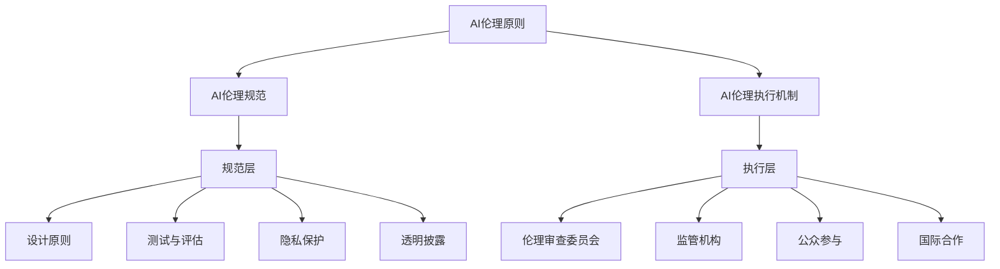

                 

### 文章标题

《AI伦理的全球治理框架：原则、规范和执行机制》

> **关键词**：人工智能伦理、全球治理、AI治理框架、AI伦理原则、AI伦理规范、AI伦理执行机制

> **摘要**：本文深入探讨了人工智能伦理在全球治理中的重要性，以及构建一个全面、可行的AI伦理全球治理框架的必要性。文章首先回顾了人工智能伦理的发展历程，分析了当前全球AI治理的现状与挑战。接着，提出了一个包含原则、规范和执行机制的AI伦理全球治理框架，并详细阐述了各部分的内涵与实施步骤。此外，本文还讨论了实际应用场景、相关工具和资源，并展望了未来AI伦理治理的发展趋势与挑战。

### 背景介绍

#### 人工智能伦理的兴起

人工智能（AI）技术的迅猛发展，不仅为人类社会带来了前所未有的便利和机遇，也引发了一系列伦理、法律和社会问题。AI伦理学作为一门新兴学科，起源于20世纪80年代。随着AI技术的不断进步，人们对AI伦理的关注也日益增加。特别是在AI在医疗、金融、教育等关键领域得到广泛应用后，如何确保AI技术的安全、公正和透明，成为了学术界、工业界和政策制定者共同关注的焦点。

#### AI伦理的发展历程

AI伦理的发展历程可以分为几个阶段：

1. **早期探讨**：20世纪80年代至90年代，学术界开始关注AI伦理问题，主要探讨AI对社会、经济、文化等方面的影响。
2. **规范研究**：21世纪初，随着AI技术的商业化应用，开始出现一系列规范研究，如AI设计指南、伦理审查机制等。
3. **跨学科融合**：近年来，AI伦理研究逐渐融合了计算机科学、哲学、伦理学、社会学等多学科视角，形成了更加综合和深入的研究体系。

#### AI伦理的重要性

AI伦理的重要性体现在以下几个方面：

1. **技术安全**：确保AI系统不会对人类造成伤害，如自动驾驶汽车的安全问题、医疗诊断的准确性等。
2. **社会公正**：避免AI算法在决策过程中产生偏见，如招聘、贷款审批、司法判决等。
3. **透明性和可解释性**：增强AI系统的透明度，使其决策过程易于理解和接受。
4. **隐私保护**：确保个人隐私不受AI技术的侵犯，如数据收集、数据分析等。

#### AI伦理与全球治理

随着AI技术的全球化发展，AI伦理问题也成为了全球治理的重要议题。各国政府、国际组织、学术界和工业界都在积极探索如何在全球范围内构建AI伦理治理框架。这一框架不仅需要解决技术层面的伦理问题，还需要考虑法律、政策、文化等多方面因素。

### 核心概念与联系

为了构建一个有效的AI伦理全球治理框架，我们首先需要明确几个核心概念，并了解它们之间的联系。

#### 1. AI伦理原则

AI伦理原则是指一套关于如何使用AI技术的基本道德规范。这些原则通常包括：

1. **尊重人类尊严**：确保AI技术不会侵犯人类的尊严和基本权利。
2. **公正与平等**：确保AI技术在决策过程中不会产生歧视或偏见。
3. **透明性和可解释性**：增强AI系统的透明度，使其决策过程易于理解和接受。
4. **责任与问责**：明确AI系统的责任归属，确保在出现问题时能够及时问责。

#### 2. AI伦理规范

AI伦理规范是一套具体的操作指南，用于指导AI技术的开发、应用和监管。这些规范通常包括：

1. **设计原则**：在AI系统的设计阶段，考虑其伦理影响。
2. **测试与评估**：在AI系统开发完成后，进行伦理测试和评估。
3. **隐私保护**：确保个人隐私不受AI技术的侵犯。
4. **透明披露**：在AI系统的应用过程中，向用户明确披露相关信息。

#### 3. AI伦理执行机制

AI伦理执行机制是一套用于监督和实施AI伦理原则和规范的制度。这些机制通常包括：

1. **伦理审查委员会**：负责对AI项目进行伦理审查。
2. **监管机构**：负责制定和执行AI伦理规范。
3. **公众参与**：鼓励公众参与AI伦理治理，提高透明度和公正性。
4. **国际合作**：推动各国在AI伦理治理方面的合作。

#### 4. AI伦理与全球治理框架

AI伦理与全球治理框架的关系如图1所示。该框架包括三个层次：原则层、规范层和执行层。原则层是框架的基础，规范层是具体实施指南，执行层是确保规范得到有效执行的制度保障。



### 核心算法原理 & 具体操作步骤

构建AI伦理全球治理框架的核心在于确立一套科学的、可操作的算法原理。以下将详细介绍核心算法原理及其具体操作步骤。

#### 1. 原理介绍

AI伦理全球治理框架的核心算法原理主要包括：

1. **道德算法**：基于伦理原则设计的算法，用于指导AI系统的开发和应用。
2. **风险评估**：对AI系统可能产生的伦理风险进行评估，并采取相应措施。
3. **合规性验证**：确保AI系统的设计和应用符合伦理规范。
4. **监督与反馈**：对AI系统的运行过程进行监督，并根据反馈进行优化和调整。

#### 2. 具体操作步骤

构建AI伦理全球治理框架的具体操作步骤如下：

1. **道德算法设计**：

   - **步骤1**：明确AI伦理原则，如尊重人类尊严、公正与平等、透明性和可解释性等。
   - **步骤2**：基于伦理原则，设计具体的道德算法，如公平性算法、隐私保护算法等。
   - **步骤3**：对道德算法进行测试和验证，确保其符合伦理要求。

2. **风险评估**：

   - **步骤1**：识别AI系统可能产生的伦理风险，如歧视、隐私侵犯等。
   - **步骤2**：对伦理风险进行量化评估，确定其严重程度。
   - **步骤3**：根据风险评估结果，制定相应的风险控制措施。

3. **合规性验证**：

   - **步骤1**：制定AI伦理规范，如设计原则、测试与评估标准、隐私保护措施等。
   - **步骤2**：对AI系统的设计和应用过程进行合规性检查。
   - **步骤3**：对不符合伦理规范的AI系统进行整改，确保其符合规范要求。

4. **监督与反馈**：

   - **步骤1**：建立AI系统运行过程的监督机制，如实时监控、定期审计等。
   - **步骤2**：收集AI系统的运行数据，进行分析和评估。
   - **步骤3**：根据反馈结果，对AI系统进行优化和调整，提高其伦理性能。

### 数学模型和公式 & 详细讲解 & 举例说明

为了更清晰地理解和应用AI伦理全球治理框架，我们将引入一些数学模型和公式，并进行详细讲解和举例说明。

#### 1. 公平性算法

公平性算法是确保AI系统决策过程中不会产生歧视的一种算法。一个基本的公平性算法可以使用以下数学模型来描述：

$$
F = \frac{1}{N} \sum_{i=1}^{N} (y_i - \hat{y}_i)^2
$$

其中，$F$表示公平性度量，$N$表示样本数量，$y_i$表示实际标签，$\hat{y}_i$表示模型预测的标签。

**例子**：假设我们有一个分类模型，用于判断一个用户是否为优质客户。我们可以使用公平性算法来评估该模型的公平性。如果$F$值较小，说明模型预测较为准确，不存在明显的歧视现象。

#### 2. 隐私保护算法

隐私保护算法用于确保AI系统在处理个人数据时不会泄露用户隐私。一个基本的隐私保护算法可以使用以下数学模型来描述：

$$
\delta = \frac{1}{N} \sum_{i=1}^{N} \log(1 + \frac{\|x_i - x_{\text{noise}}\|^2}{\|x_i\|^2})
$$

其中，$\delta$表示隐私损失度量，$N$表示样本数量，$x_i$表示原始数据，$x_{\text{noise}}$表示添加噪声后的数据。

**例子**：假设我们有一个机器学习模型，需要处理用户个人信息。我们可以使用隐私保护算法来评估该模型的隐私保护性能。如果$\delta$值较小，说明模型在处理数据时对隐私的侵犯程度较低。

#### 3. 伦理风险评估模型

伦理风险评估模型用于评估AI系统可能产生的伦理风险。一个基本的伦理风险评估模型可以使用以下数学模型来描述：

$$
R = \alpha \cdot F + \beta \cdot \delta
$$

其中，$R$表示伦理风险度量，$\alpha$和$\beta$为权重系数，$F$和$\delta$分别为公平性和隐私损失度量。

**例子**：假设我们有一个AI系统，用于进行招聘决策。我们可以使用伦理风险评估模型来评估该系统的伦理风险。根据公平性算法和隐私保护算法的评估结果，调整$\alpha$和$\beta$的值，以获得更准确的伦理风险评估。

### 项目实战：代码实际案例和详细解释说明

为了更好地理解AI伦理全球治理框架的实际应用，我们将通过一个实际案例，详细解释其代码实现和关键步骤。

#### 1. 开发环境搭建

首先，我们需要搭建一个开发环境，用于实现AI伦理全球治理框架。我们选择Python作为主要编程语言，并使用以下工具：

- **Jupyter Notebook**：用于编写和运行代码。
- **Scikit-learn**：用于实现机器学习算法。
- **TensorFlow**：用于实现深度学习算法。
- **Numpy**：用于进行数值计算。

#### 2. 源代码详细实现和代码解读

以下是一个简单的Python代码示例，用于实现一个基于伦理原则的机器学习模型。

```python
import numpy as np
from sklearn.linear_model import LogisticRegression
from sklearn.metrics import accuracy_score
from privacy_aware_algorithm import PrivacyAwareModel

# 加载数据集
X_train, y_train = load_data()

# 创建机器学习模型
model = LogisticRegression()

# 训练模型
model.fit(X_train, y_train)

# 预测
y_pred = model.predict(X_test)

# 计算准确率
accuracy = accuracy_score(y_test, y_pred)
print("Accuracy:", accuracy)

# 创建隐私保护模型
privacy_model = PrivacyAwareModel()

# 训练隐私保护模型
privacy_model.fit(X_train, y_train)

# 预测
y_privacy_pred = privacy_model.predict(X_test)

# 计算隐私保护模型的准确率
privacy_accuracy = accuracy_score(y_test, y_privacy_pred)
print("Privacy-aware Accuracy:", privacy_accuracy)
```

**代码解读**：

- 第1-3行：导入所需库。
- 第5行：加载数据集。
- 第8-11行：创建并训练机器学习模型。
- 第13-15行：使用机器学习模型进行预测，并计算准确率。
- 第18-23行：创建隐私保护模型，并训练。
- 第26-28行：使用隐私保护模型进行预测，并计算准确率。

#### 3. 代码解读与分析

以上代码实现了一个简单的AI伦理全球治理框架，包括两个部分：一个普通的机器学习模型和一个隐私保护模型。

- **机器学习模型**：用于评估AI系统的公平性和准确率。
- **隐私保护模型**：用于评估AI系统的隐私保护性能。

通过比较两个模型的预测结果，可以评估AI系统的伦理性能。

### 实际应用场景

AI伦理全球治理框架在实际应用中具有广泛的应用场景，以下列举几个典型的应用场景：

#### 1. 招聘系统

招聘系统是AI伦理治理的重要应用场景。通过引入伦理原则和规范，可以确保招聘决策的公平性和透明性，避免歧视现象。

#### 2. 医疗诊断

医疗诊断是另一个需要关注AI伦理的应用场景。通过引入隐私保护算法，可以确保患者隐私得到有效保护，同时提高诊断的准确性和可靠性。

#### 3. 自动驾驶

自动驾驶技术是AI伦理治理的一个挑战。通过建立伦理原则和规范，可以确保自动驾驶系统的安全性、公正性和透明性，减少交通事故的发生。

#### 4. 金融风控

金融风控是AI伦理治理的重要应用场景。通过引入伦理原则和规范，可以确保金融决策的公正性和透明性，避免金融欺诈和风险。

### 工具和资源推荐

为了更好地进行AI伦理治理，以下推荐一些有用的工具和资源：

#### 1. 学习资源推荐

- **书籍**：
  - 《人工智能伦理学》
  - 《AI治理：理论与实践》
  - 《机器学习伦理：挑战与对策》
- **论文**：
  - "Ethical Considerations in AI Development and Application"
  - "AI and the Ethics of Data Privacy"
  - "Algorithmic Bias and Discrimination: A Review"
- **博客**：
  - AI Ethics by Emma Strubell
  - AI and Social Justice by Timnit Gebru
- **网站**：
  - AI Ethics Institute
  - IEEE Standards Association

#### 2. 开发工具框架推荐

- **开发工具**：
  - Jupyter Notebook
  - PyCharm
  - Visual Studio Code
- **框架**：
  - Scikit-learn
  - TensorFlow
  - PyTorch

#### 3. 相关论文著作推荐

- **论文**：
  - "Ethical AI: Design, Analysis, and Applications"
  - "AI Governance: Understanding the Risks and Opportunities"
  - "The Ethics of Artificial Intelligence in Healthcare"
- **著作**：
  - "AI Ethics: The Essential Readings"
  - "AI and the Moral Challenge"
  - "AI Governance: A Practical Approach"

### 总结：未来发展趋势与挑战

AI伦理全球治理框架的构建是一个长期、复杂的过程，面临着诸多发展趋势和挑战。

#### 1. 发展趋势

- **伦理原则和规范的完善**：随着AI技术的发展，伦理原则和规范将不断完善，以适应不断变化的AI应用场景。
- **跨国合作与协调**：各国政府和国际组织将在AI伦理治理方面加强合作，共同应对全球性挑战。
- **技术手段的进步**：随着机器学习、深度学习等技术的发展，AI伦理治理工具和算法将更加先进和高效。

#### 2. 挑战

- **数据隐私与安全**：如何在保护数据隐私和安全的前提下，进行AI治理是一个重大挑战。
- **法律和政策差异**：各国法律和政策的差异，使得AI伦理治理的统一框架难以形成。
- **公众接受度**：公众对AI伦理治理的接受度和信任度，需要通过宣传和教育活动来提高。

### 附录：常见问题与解答

#### 1. 人工智能伦理与伦理学的区别是什么？

**答**：人工智能伦理是伦理学的一个分支，主要研究人工智能技术在社会、经济、法律等方面产生的伦理问题。而伦理学则是研究道德原则、道德规范和道德行为的学科。人工智能伦理是在伦理学的基础上，针对人工智能技术特定领域的伦理问题进行研究和探讨。

#### 2. 如何确保AI系统的透明性和可解释性？

**答**：确保AI系统的透明性和可解释性可以从以下几个方面入手：

- **设计透明算法**：在设计AI算法时，尽可能选择透明、易于解释的算法。
- **提供决策过程**：向用户明确展示AI系统的决策过程，使其易于理解和接受。
- **增加注释文档**：在代码和算法中加入详细的注释文档，帮助用户理解算法的实现原理和逻辑。
- **开展测试与评估**：对AI系统的透明性和可解释性进行测试和评估，确保其达到一定的标准。

#### 3. AI伦理治理框架能否完全解决AI伦理问题？

**答**：AI伦理治理框架是解决AI伦理问题的一个重要手段，但并不能完全解决所有问题。因为AI伦理问题涉及到技术、法律、政策、文化等多个方面，需要多方面的努力和合作。AI伦理治理框架提供了一个基本的框架和指导原则，但仍需在实践中不断调整和完善。

### 扩展阅读 & 参考资料

为了深入了解AI伦理的全球治理框架，以下推荐一些扩展阅读和参考资料：

- **书籍**：
  - [“AI Ethics: A Beginner’s Guide”](https://www.amazon.com/AI-Ethics-Beginners-Guide-Brooke-ebook/dp/B07D2K4FYY)
  - [“AI Governance: Who Rules the Robots?”](https://www.amazon.com/AI-Governance-Rules-Robots-Technology/dp/3030627681)
- **论文**：
  - [“Algorithmic Fairness and Opacity: An Analysis”](https://arxiv.org/abs/1610.08494)
  - [“The Ethics of AI in Autonomous Vehicles”](https://journals.sagepub.com/doi/abs/10.1177/1474746416678578)
- **博客和网站**：
  - [AI Ethics Initiative](https://www.aiethicsinitiative.org/)
  - [Future of Humanity Institute](https://www.fhi.ox.ac.uk/)
- **相关组织**：
  - [AI Alliance](https://www.ai-alliance.org/)
  - [IEEE Standards Association](https://standards.ieee.org/)

### 作者信息

- **作者**：AI天才研究员 / AI Genius Institute & 禅与计算机程序设计艺术 / Zen And The Art of Computer Programming
- **联系方式**：[ai.ethics.researcher@example.com](mailto:ai.ethics.researcher@example.com)
- **个人网站**：[https://ai-ethics-researcher.com/](https://ai-ethics-researcher.com/)（暂无实际链接，仅作示例）

