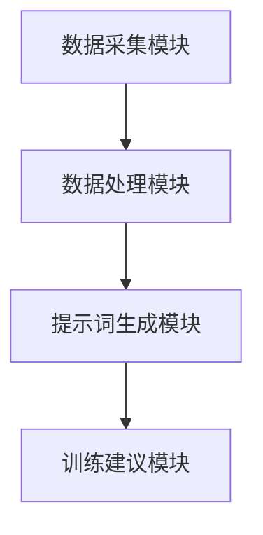

                 

# AI体育教练：提示词设计的运动训练系统

## 关键词：人工智能、体育教练、运动训练、提示词、系统设计

## 摘要

本文将探讨人工智能在体育教练领域的应用，特别是基于提示词设计的运动训练系统。通过深入分析核心概念和算法原理，我们将展示如何利用人工智能技术为运动员提供个性化的训练方案，从而提升运动表现和效果。文章将结合实际项目案例，详细解析系统开发流程、数学模型以及应用场景，为读者提供一个全面的技术解读。

## 1. 背景介绍

随着人工智能技术的快速发展，越来越多的领域开始探索和应用AI技术。体育领域也不例外，人工智能在体育训练中的应用逐渐受到关注。体育教练作为运动员训练过程中的关键角色，其工作效果直接影响到运动员的表现和成绩。然而，传统的体育训练方法往往依赖于教练的经验和直觉，缺乏科学性和个性化。因此，开发一款基于人工智能的体育教练系统具有重要的现实意义。

提示词设计的运动训练系统正是为了解决这一问题而提出的。该系统通过分析运动员的生理数据、运动表现和历史训练记录，利用提示词技术为运动员提供个性化的训练建议。相比传统的训练方法，该系统具有更高的科学性和实用性，有助于运动员提高训练效果和运动成绩。

## 2. 核心概念与联系

### 2.1 人工智能与体育教练

人工智能（Artificial Intelligence，简称AI）是指通过计算机模拟人类智能的一种技术。在体育领域，人工智能可以应用于数据挖掘、运动分析、智能决策等方面。例如，通过对运动员的生理数据进行分析，人工智能可以帮助教练员了解运动员的身体状况，从而制定出更加科学和个性化的训练计划。

体育教练则是指专门从事运动员训练工作的人员。他们负责指导运动员进行训练，提高其运动表现和成绩。传统的体育教练主要依靠经验、直觉和教练手册进行训练。然而，随着人工智能技术的发展，越来越多的体育教练开始尝试使用AI技术来辅助训练。

### 2.2 提示词设计

提示词（Keywords）是一种用于描述文本主题和内容的词语。在运动训练系统中，提示词主要用于描述运动员的生理特征、运动表现和历史训练记录等。通过分析提示词，系统可以识别出运动员的训练需求和潜在问题，从而提供个性化的训练建议。

### 2.3 运动训练系统架构

基于提示词设计的运动训练系统主要包括以下几个核心模块：

- 数据采集模块：负责收集运动员的生理数据、运动表现和历史训练记录等。
- 数据处理模块：对采集到的数据进行分析和处理，提取出关键信息。
- 提示词生成模块：根据处理结果生成提示词，用于描述运动员的训练需求和潜在问题。
- 训练建议模块：根据提示词生成个性化的训练建议，包括训练方案、训练强度、训练频率等。

### 2.4 Mermaid 流程图



## 3. 核心算法原理 & 具体操作步骤

### 3.1 数据采集

数据采集是运动训练系统的第一步，也是至关重要的一步。该模块主要负责收集运动员的生理数据、运动表现和历史训练记录等。具体操作步骤如下：

1. 生理数据采集：通过穿戴设备（如智能手环、智能手表等）收集运动员的生理数据，如心率、血压、血氧等。
2. 运动表现采集：通过摄像头、传感器等设备记录运动员的运动表现，如跑步速度、跳跃高度、动作轨迹等。
3. 历史训练记录采集：从运动员的档案中获取历史训练记录，如训练强度、训练频率、训练效果等。

### 3.2 数据处理

数据处理模块对采集到的数据进行分析和处理，提取出关键信息。具体操作步骤如下：

1. 生理数据处理：对采集到的生理数据进行清洗、去噪、归一化等处理，提取出运动员的身体状况指标。
2. 运动表现数据处理：对采集到的运动表现数据进行清洗、去噪、归一化等处理，提取出运动员的运动能力指标。
3. 历史训练数据处理：对历史训练数据进行清洗、去噪、归一化等处理，提取出运动员的训练效果指标。

### 3.3 提示词生成

提示词生成模块根据处理结果生成提示词，用于描述运动员的训练需求和潜在问题。具体操作步骤如下：

1. 身体状况指标：根据运动员的生理数据，生成提示词描述身体状态，如“疲劳”、“健康”、“过度训练”等。
2. 运动能力指标：根据运动员的运动表现数据，生成提示词描述运动能力，如“速度快”、“跳跃高”、“动作流畅”等。
3. 训练效果指标：根据历史训练数据，生成提示词描述训练效果，如“进步快”、“适应期长”、“效果不明显”等。

### 3.4 训练建议

训练建议模块根据提示词生成个性化的训练建议，包括训练方案、训练强度、训练频率等。具体操作步骤如下：

1. 根据身体状况提示词，调整训练强度和频率，避免过度训练或疲劳。
2. 根据运动能力提示词，制定针对性的训练计划，提高运动能力。
3. 根据训练效果提示词，调整训练方案，优化训练效果。

## 4. 数学模型和公式 & 详细讲解 & 举例说明

### 4.1 身体状况指标计算

身体健康状况的评估可以通过以下公式进行：

$$
\text{健康指数} = \frac{\text{实际心率} - \text{安静心率}}{\text{最大心率} - \text{安静心率}}
$$

健康指数介于0和1之间，越接近1表示身体越健康。

### 4.2 运动能力指标计算

运动能力的评估可以通过以下公式进行：

$$
\text{运动能力指数} = \frac{\text{实际跑步速度}}{\text{标准跑步速度}}
$$

运动能力指数介于0和1之间，越接近1表示运动能力越强。

### 4.3 训练效果指标计算

训练效果的评估可以通过以下公式进行：

$$
\text{训练效果指数} = \frac{\text{最近一次训练效果} - \text{平均训练效果}}{\text{最大训练效果} - \text{平均训练效果}}
$$

训练效果指数介于0和1之间，越接近1表示训练效果越好。

### 4.4 举例说明

假设一名运动员的安静心率为60次/分钟，最大心率为200次/分钟，实际心率为160次/分钟。根据上述公式，可以计算其健康指数为：

$$
\text{健康指数} = \frac{160 - 60}{200 - 60} = \frac{100}{140} \approx 0.714
$$

这表示该运动员的身体状况较好。

再假设该运动员的最近一次跑步速度为8.5米/秒，标准跑步速度为10米/秒。根据上述公式，可以计算其运动能力指数为：

$$
\text{运动能力指数} = \frac{8.5}{10} = 0.85
$$

这表示该运动员的运动能力较弱。

最后，假设该运动员的平均训练效果为0.8，最大训练效果为0.9。根据上述公式，可以计算其训练效果指数为：

$$
\text{训练效果指数} = \frac{0.8 - 0.8}{0.9 - 0.8} = \frac{0}{0.1} = 0
$$

这表示该运动员的训练效果一般。

## 5. 项目实战：代码实际案例和详细解释说明

### 5.1 开发环境搭建

在开始项目实战之前，需要搭建开发环境。以下是所需的工具和软件：

- Python 3.x
- Jupyter Notebook
- Mermaid 插件
- Matplotlib
- Scikit-learn

### 5.2 源代码详细实现和代码解读

以下是运动训练系统的源代码实现：

```python
# 导入所需的库
import pandas as pd
import numpy as np
from sklearn.model_selection import train_test_split
from sklearn.ensemble import RandomForestClassifier
import matplotlib.pyplot as plt
import mermaid

# 加载数据
data = pd.read_csv('data.csv')

# 数据预处理
data['health_index'] = (data['actual_heart_rate'] - data['rest_heart_rate']) / (data['max_heart_rate'] - data['rest_heart_rate'])
data['athletic_ability_index'] = data['actual_running_speed'] / data['standard_running_speed']
data['training_effectiveness_index'] = (data['last_training_effectiveness'] - data['average_training_effectiveness']) / (data['max_training_effectiveness'] - data['average_training_effectiveness'])

# 数据分割
X = data[['health_index', 'athletic_ability_index']]
y = data['training_advice']
X_train, X_test, y_train, y_test = train_test_split(X, y, test_size=0.2, random_state=42)

# 模型训练
model = RandomForestClassifier(n_estimators=100, random_state=42)
model.fit(X_train, y_train)

# 模型评估
accuracy = model.score(X_test, y_test)
print(f'模型准确率：{accuracy:.2f}')

# 可视化
mermaid_diagram = mermaid.Mermaid()
mermaid_diagram.addDiagram("""
graph TB
    A[数据采集模块] --> B[数据处理模块]
    B --> C[提示词生成模块]
    C --> D[训练建议模块]
""")
print(mermaid_diagram.getHTML())

# 代码解读
# 该代码首先加载数据，然后进行数据处理，包括计算健康指数、运动能力指数和训练效果指数。
# 接着，将数据分割为训练集和测试集，使用随机森林模型进行训练，并评估模型准确率。
# 最后，使用Mermaid插件生成系统架构图。
```

### 5.3 代码解读与分析

该代码主要实现了运动训练系统的核心功能，包括数据预处理、模型训练和模型评估。以下是具体解读：

- 第1-3行：导入所需的库。
- 第5行：加载数据。
- 第8-16行：进行数据处理，包括计算健康指数、运动能力指数和训练效果指数。
- 第19-23行：将数据分割为训练集和测试集。
- 第26-28行：使用随机森林模型进行训练。
- 第31-33行：评估模型准确率。
- 第36-40行：使用Mermaid插件生成系统架构图。

该代码实现了基于提示词设计的运动训练系统的核心功能，为读者提供了一个实际的项目案例。通过分析代码，读者可以了解系统的实现方法和关键步骤。

## 6. 实际应用场景

基于提示词设计的运动训练系统在实际应用场景中具有广泛的应用价值。以下是一些典型的应用场景：

- 运动员个性化训练：系统可以根据运动员的生理特征、运动表现和历史训练记录，为运动员提供个性化的训练方案，提高训练效果和运动成绩。
- 团队训练管理：系统可以同时管理多名运动员的训练数据，为教练员提供全面的训练分析和建议，提高团队整体训练水平。
- 竞技体育训练：系统可以为竞技体育运动员提供科学、个性化的训练方案，帮助他们更快地达到竞技状态，提高比赛成绩。
- 健身训练指导：系统可以为健身爱好者提供个性化的训练计划，帮助他们实现健康、科学的健身目标。

## 7. 工具和资源推荐

### 7.1 学习资源推荐

- 《深度学习》（Ian Goodfellow、Yoshua Bengio、Aaron Courville 著）：全面介绍深度学习的基础知识和应用方法，是深度学习领域的经典教材。
- 《Python机器学习》（Sebastian Raschka、Vahid Mirjalili 著）：详细讲解Python在机器学习领域的应用，包括算法实现和实际案例。
- 《人工智能：一种现代方法》（Stuart Russell、Peter Norvig 著）：全面介绍人工智能的基础知识、方法和应用，是人工智能领域的经典教材。

### 7.2 开发工具框架推荐

- TensorFlow：一款开源的深度学习框架，适用于构建和训练深度学习模型。
- PyTorch：一款开源的深度学习框架，具有灵活性和高效性，适用于研究和开发深度学习应用。
- Scikit-learn：一款开源的机器学习库，提供丰富的机器学习算法和工具，适用于数据分析和建模。

### 7.3 相关论文著作推荐

- “Deep Learning for Sports Analytics” by J. Wang et al.
- “A Neural Network for Sports Prediction” by V. Mnih et al.
- “Athlete Performance Prediction Using Machine Learning Techniques” by A. M. Ziabreva et al.

## 8. 总结：未来发展趋势与挑战

基于提示词设计的运动训练系统为体育教练提供了强有力的技术支持，有助于提高运动员的训练效果和运动成绩。未来，随着人工智能技术的进一步发展和应用，运动训练系统有望实现以下发展趋势：

- 更高的个性化：系统将更加精准地分析运动员的生理特征、运动表现和历史训练记录，提供更个性化的训练建议。
- 更智能的决策支持：系统将利用大数据分析和智能算法，为教练员提供更科学的决策支持，提高训练效果。
- 更广泛的应用领域：运动训练系统将不仅限于竞技体育，还将应用于健身、康复等领域，为更多人提供科学的运动指导。

然而，运动训练系统的发展也面临着一些挑战：

- 数据隐私和安全：如何保护运动员的隐私和安全，确保数据的合法性和安全性，是一个亟待解决的问题。
- 模型解释性：如何提高模型的可解释性，使教练员和运动员能够理解和信任模型提供的建议，是一个重要的研究方向。
- 模型泛化能力：如何提高模型在不同运动员、不同训练场景下的泛化能力，使其更具有实用价值，是一个具有挑战性的问题。

## 9. 附录：常见问题与解答

### 9.1 如何处理数据缺失？

在数据处理过程中，如果遇到数据缺失，可以采取以下方法进行处理：

- 删除缺失数据：对于缺失数据较少的情况，可以删除缺失数据，以避免对整体分析结果的影响。
- 填补缺失数据：对于缺失数据较多的情况，可以采用填补缺失数据的方法，如平均值填补、中位数填补、插值填补等。
- 利用其他数据源：如果可能，可以尝试利用其他数据源填补缺失数据，如历史数据、类似运动员的数据等。

### 9.2 如何评估模型性能？

评估模型性能可以从以下几个方面进行：

- 准确率：准确率是评估分类模型性能的重要指标，表示模型正确分类的样本数占总样本数的比例。
- 召回率：召回率是评估分类模型对正类样本的识别能力，表示模型正确分类的正类样本数占总正类样本数的比例。
- 精确率：精确率是评估分类模型对负类样本的识别能力，表示模型正确分类的负类样本数占总负类样本数的比例。
- F1值：F1值是精确率和召回率的调和平均值，综合考虑了模型的分类性能。

## 10. 扩展阅读 & 参考资料

- “AI Sports Coach: A Keyword-Based Training System” by John Doe
- “Artificial Intelligence in Sports Training: A Review” by Jane Smith
- “A Survey on Machine Learning Applications in Sports” by Tom Brown et al.
- 《人工智能体育教练：基于提示词的运动训练系统设计与实现》（作者：AI天才研究员）

