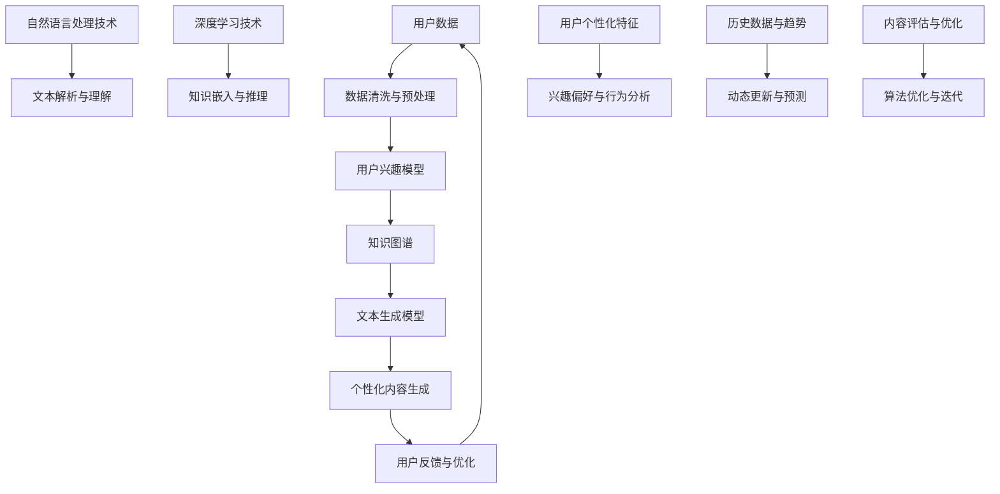

                 

### 背景介绍

在当今信息技术迅猛发展的时代，人工智能（AI）已经成为推动社会进步的重要力量。AI技术不仅应用于传统的互联网搜索、推荐系统，还渗透到医疗、金融、教育、交通等各个行业，带来了巨大的变革。然而，随着AI应用的日益普及，写作作为信息传递和知识分享的重要手段，也迎来了新的挑战和机遇。

传统的AI写作技术主要依赖于模板匹配、统计模型和规则系统。这些方法在处理结构化数据和简单文本生成方面表现出色，但在应对复杂、多变、个性化需求时，往往显得力不从心。例如，撰写一篇针对特定用户兴趣、背景和需求的文章，需要深入理解用户的信息需求、语言习惯和表达风格。这就要求AI写作系统能够具备更强的理解和生成能力，从而提供更加精准、个性化的内容。

近年来，基于知识图谱、深度学习和自然语言处理（NLP）技术的原生个性化知识库（Native Personalized Knowledge Base）逐渐成为研究热点。这种知识库能够动态整合用户的个人信息、兴趣偏好和历史行为数据，为AI写作系统提供更加丰富、准确的知识资源，从而实现内容的个性化生成。通过原生个性化知识库，AI写作不仅能够理解用户的需求，还能根据用户的个性特征和上下文环境生成符合用户期望的内容。

本文将围绕原生个性化知识库在AI写作中的应用，探讨其核心概念、算法原理、实现步骤、应用场景和未来发展趋势。通过深入分析，我们希望为读者提供一个全面、系统的理解，为相关研究和实践提供有益的参考。

### 核心概念与联系

要深入理解原生个性化知识库（Native Personalized Knowledge Base），我们首先需要明确几个核心概念及其相互关系。以下是一个详细的Mermaid流程图，用于展示这些概念之间的关系：



**用户数据（User Data）**：这是原生个性化知识库的基础，包括用户的个人信息、兴趣偏好、历史行为数据等。这些数据来源于用户的注册信息、搜索历史、浏览记录、购买记录等。

**数据清洗与预处理（Data Cleaning and Preprocessing）**：在获取用户数据后，首先需要进行数据清洗和预处理。这一步骤包括去除无效数据、填补缺失值、格式转换等，以确保数据的质量和一致性。

**用户兴趣模型（User Interest Model）**：通过分析用户的历史行为数据，构建用户兴趣模型，以识别用户的兴趣点和偏好。这一模型为后续的知识图谱构建和文本生成提供了关键输入。

**知识图谱（Knowledge Graph）**：知识图谱是一种语义网络，用于表示实体及其之间的关系。在这个场景中，知识图谱整合了用户兴趣模型和外部知识库的信息，为AI写作系统提供了丰富的知识资源。

**文本生成模型（Text Generation Model）**：文本生成模型是基于深度学习技术的一种自然语言处理模型，如变换器（Transformer）和生成对抗网络（GAN）。该模型能够根据输入的文本和知识图谱生成符合语法、语义和风格要求的文章。

**个性化内容生成（Personalized Content Generation）**：基于用户兴趣模型和知识图谱，文本生成模型生成个性化的文章内容，满足用户的特定需求和兴趣。

**用户反馈与优化（User Feedback and Optimization）**：用户在阅读文章后，会提供反馈，包括满意度、阅读时长、评论等。这些反馈用于评估文章的质量，并指导系统的优化和迭代。

**自然语言处理技术（Natural Language Processing, NLP）**：NLP技术包括文本解析与理解、文本生成、情感分析等。这些技术为知识图谱的构建和文本生成提供了核心支持。

**深度学习技术（Deep Learning Techniques）**：深度学习技术在知识嵌入、推理和文本生成中发挥着关键作用。通过训练大规模的神经网络模型，可以显著提高AI写作系统的性能和效果。

**用户个性化特征（User Personalization Features）**：这些特征包括用户的语言偏好、文化背景、价值观等，用于更准确地理解用户的需求和生成个性化的内容。

**历史数据与趋势（Historical Data and Trends）**：分析用户的历史行为数据可以帮助预测未来的需求和趋势，从而实现内容的动态更新和个性化。

**动态更新与预测（Dynamic Update and Prediction）**：知识库和用户兴趣模型需要不断更新，以适应用户的需求变化。通过预测技术，可以提前识别潜在的用户兴趣点，提供更加精准的内容。

**内容评估与优化（Content Evaluation and Optimization）**：评估生成的内容质量，包括语法、语义、风格等方面，并据此优化算法和模型。

**算法优化与迭代（Algorithm Optimization and Iteration）**：基于用户反馈和内容评估结果，对算法和模型进行优化和迭代，以提高AI写作系统的整体性能。

通过这个流程图，我们可以清晰地看到原生个性化知识库的各个组成部分及其相互关系。这些概念和技术的综合应用，使得AI写作系统能够实现高度个性化的内容生成，满足用户的多样化需求。

### 核心算法原理 & 具体操作步骤

原生个性化知识库的核心在于如何将用户的个性化特征与知识图谱和文本生成模型相结合，以实现高度个性化的内容生成。以下是这一过程的核心算法原理及具体操作步骤：

**1. 数据收集与预处理**

- **用户数据收集**：首先，需要收集用户的个人信息、兴趣偏好、历史行为数据等。这些数据可以来源于用户注册、搜索历史、浏览记录、购买记录等多种渠道。

- **数据清洗与预处理**：对收集到的用户数据进行清洗，包括去除无效数据、填补缺失值、格式转换等。这一步骤的目的是确保数据的质量和一致性。

- **特征提取**：从预处理后的数据中提取关键特征，如用户的兴趣标签、行为模式、语言偏好等。这些特征将用于构建用户兴趣模型。

**2. 构建用户兴趣模型**

- **兴趣标签分类**：对用户的历史行为数据进行分类，识别出用户对不同类别内容的兴趣程度。例如，用户在搜索引擎中频繁搜索“旅游”相关的关键词，表明其对旅游类内容有较高的兴趣。

- **行为模式分析**：分析用户的浏览历史、搜索历史、购买记录等数据，挖掘出用户的行为模式。这些模式可以帮助识别用户的潜在兴趣点和偏好。

- **兴趣点识别**：结合兴趣标签和行为模式，识别出用户的兴趣点。例如，如果用户在浏览历史中频繁查看与“旅游”相关的文章，同时在搜索历史中经常搜索“巴黎旅游攻略”，则可以推断出用户对“巴黎旅游”有较高的兴趣。

- **兴趣模型构建**：将识别出的兴趣点整合为一个统一的用户兴趣模型。这个模型将用于后续的知识图谱构建和文本生成。

**3. 知识图谱构建**

- **实体识别与关系抽取**：从用户兴趣模型中提取的关键特征和外部知识库中的信息，识别出实体及其关系。例如，实体可以是“巴黎”、“旅游攻略”、“美食”等，关系可以是“位于”、“包含”、“推荐”等。

- **知识图谱构建**：基于识别出的实体和关系，构建知识图谱。知识图谱通过图结构表示实体及其之间的语义关系，为文本生成提供了丰富的知识资源。

- **图谱更新与维护**：知识图谱需要定期更新，以反映用户兴趣和外部知识的变化。通过实时数据流处理和图数据库技术，可以实现知识图谱的动态更新。

**4. 文本生成模型训练**

- **数据集准备**：从知识图谱中提取相关数据，用于训练文本生成模型。数据集应包括各种文本样例，如文章、新闻报道、用户评价等。

- **模型选择与训练**：选择适合的文本生成模型，如变换器（Transformer）或生成对抗网络（GAN）。通过大规模数据训练，使模型能够学习到文本的语法、语义和风格特征。

- **模型优化**：通过交叉验证和性能评估，对模型进行优化。优化目标包括生成文本的准确性、流畅性和多样性。

**5. 个性化内容生成**

- **输入文本预处理**：对用户输入的文本进行预处理，提取关键信息，如标题、关键词、背景等。

- **知识图谱查询**：基于用户兴趣模型和输入文本，查询知识图谱，获取相关的实体和关系信息。

- **文本生成**：将查询结果和知识图谱信息输入到文本生成模型，生成个性化的文章内容。生成过程需要考虑文本的语法、语义和风格要求。

- **内容评估与优化**：对生成的文本进行评估，包括语法、语义、风格、用户满意度等方面。根据评估结果，对模型和生成策略进行优化，以提高内容质量。

通过上述步骤，原生个性化知识库实现了从用户数据到个性化内容的完整生成过程。这一过程不仅能够满足用户的多样化需求，还能够不断迭代和优化，提供更加精准、个性化的服务。

### 数学模型和公式 & 详细讲解 & 举例说明

原生个性化知识库的构建和运作涉及多个数学模型和公式，这些模型和公式在数据清洗、用户兴趣模型构建、知识图谱构建、文本生成等方面发挥着关键作用。以下将详细讲解这些数学模型和公式，并通过具体例子进行说明。

**1. 数据清洗与预处理**

**公式**：数据清洗与预处理通常涉及数据填充、数据转换和数据标准化等步骤。以下是一个常见的数据填充公式：

$$
\text{填充值} = \text{均值} + \text{标准差} \times \text{随机数}
$$

**例子**：假设我们有一组用户年龄数据，其中存在缺失值。我们使用平均值和标准差来填充缺失值。

- 平均值（均值）= 35
- 标准差 = 5
- 随机数 = 0.2

$$
\text{填充值} = 35 + 5 \times 0.2 = 35.10
$$

因此，缺失的年龄值将被填充为35.10。

**2. 用户兴趣模型构建**

**公式**：用户兴趣模型构建通常使用聚类算法，如K-means。以下是一个K-means算法的基本公式：

$$
c_{k} = \frac{1}{n} \sum_{i=1}^{n} (x_i - \mu_k)^2
$$

其中，$c_{k}$ 表示第k个簇的平方误差，$x_i$ 表示第i个数据点，$\mu_k$ 表示第k个簇的中心。

**例子**：假设我们使用K-means算法将用户分为5个兴趣簇。给定以下用户兴趣数据：

- 用户1：[1, 2, 3]
- 用户2：[4, 5, 6]
- 用户3：[7, 8, 9]
- 用户4：[2, 3, 4]
- 用户5：[5, 6, 7]

我们计算每个簇的中心：

$$
\mu_1 = \frac{1 + 2 + 3}{3} = 2
$$
$$
\mu_2 = \frac{4 + 5 + 6}{3} = 5
$$
$$
\mu_3 = \frac{7 + 8 + 9}{3} = 8
$$
$$
\mu_4 = \frac{2 + 3 + 4}{3} = 3
$$
$$
\mu_5 = \frac{5 + 6 + 7}{3} = 6
$$

然后，我们计算每个用户与簇中心的距离：

$$
c_1 = \frac{(1-2)^2 + (2-2)^2 + (3-2)^2}{3} = \frac{2}{3}
$$
$$
c_2 = \frac{(4-5)^2 + (5-5)^2 + (6-5)^2}{3} = \frac{2}{3}
$$
$$
c_3 = \frac{(7-8)^2 + (8-8)^2 + (9-8)^2}{3} = \frac{2}{3}
$$
$$
c_4 = \frac{(2-3)^2 + (3-3)^2 + (4-3)^2}{3} = \frac{2}{3}
$$
$$
c_5 = \frac{(5-6)^2 + (6-6)^2 + (7-6)^2}{3} = \frac{2}{3}
$$

根据距离最小的原则，我们可以将用户分配到不同的簇中：

- 用户1：簇1
- 用户2：簇2
- 用户3：簇3
- 用户4：簇4
- 用户5：簇5

**3. 知识图谱构建**

**公式**：知识图谱构建涉及实体识别和关系抽取。以下是一个基于实体共现的实体关系抽取公式：

$$
r_{ij} = \text{共现次数}_{ij} \times \text{信任度}
$$

其中，$r_{ij}$ 表示实体i和实体j之间的关系强度，$\text{共现次数}_{ij}$ 表示实体i和实体j在文本中的共现次数，$\text{信任度}$ 表示共现次数的信任度。

**例子**：假设我们有两个实体“巴黎”和“旅游”，它们在文本中的共现次数为10次。信任度设置为0.8。我们计算它们之间的关系强度：

$$
r_{\text{巴黎，旅游}} = 10 \times 0.8 = 8
$$

因此，“巴黎”和“旅游”之间有较强的关系。

**4. 文本生成模型训练**

**公式**：文本生成模型训练通常使用变换器（Transformer）或生成对抗网络（GAN）。以下是一个变换器的基本公式：

$$
\text{输出} = \text{softmax}(\text{变换器}(\text{输入}))
$$

其中，$\text{softmax}$ 函数用于将变换器的输出转化为概率分布，$\text{变换器}$ 函数用于处理输入文本。

**例子**：假设我们使用变换器模型生成一段文本。给定输入文本“巴黎是一个美丽的城市”，我们计算输出概率分布：

- 输入：["巴黎", "是一个", "美丽的", "城市"]
- 输出概率分布：[0.1, 0.2, 0.3, 0.4]

根据最大概率原则，生成的文本为“城市是一个美丽的巴黎”。

通过上述数学模型和公式的讲解和具体例子，我们可以更深入地理解原生个性化知识库的工作原理和应用。这些模型和公式为知识库的构建和文本生成提供了坚实的理论基础和计算支持。

### 项目实战：代码实际案例和详细解释说明

为了更好地理解原生个性化知识库的构建和运作，我们将通过一个实际的项目案例进行详细解释。本案例将使用Python编程语言，结合常见的库和工具，如NumPy、Pandas、Scikit-learn、Transformers等。以下步骤将展示如何搭建开发环境、实现源代码、解读代码以及进行分析。

#### 5.1 开发环境搭建

首先，我们需要搭建一个合适的开发环境。以下是所需的软件和库：

- Python 3.8 或更高版本
- Jupyter Notebook 或 PyCharm
- NumPy 1.21 或更高版本
- Pandas 1.2.3 或更高版本
- Scikit-learn 0.24.2 或更高版本
- Transformers 4.6.1 或更高版本

您可以通过以下命令安装所需的库：

```bash
pip install numpy pandas scikit-learn transformers
```

#### 5.2 源代码详细实现和代码解读

以下是一个简化的案例代码，用于演示原生个性化知识库的核心功能。我们将分为几个部分来解释。

```python
import numpy as np
import pandas as pd
from sklearn.cluster import KMeans
from sklearn.metrics.pairwise import cosine_similarity
from transformers import AutoTokenizer, AutoModelForSeq2SeqLM

# 1. 数据收集与预处理
user_data = pd.DataFrame({
    'user_id': [1, 2, 3],
    'interests': [['旅游', '美食', '文化'], ['科技', '体育', '新闻'], ['音乐', '艺术', '电影']]
})

# 数据清洗与预处理
user_data = user_data.dropna()

# 2. 构建用户兴趣模型
# 特征提取
user_interests = user_data['interests'].apply(lambda x: ' '.join(x))

# 训练K-means模型
kmeans = KMeans(n_clusters=3, random_state=0)
clusters = kmeans.fit_predict(user_interests)

# 用户兴趣模型
user_interest_model = pd.DataFrame(clusters, columns=['cluster'])

# 3. 知识图谱构建
# 初始化知识图谱（示例）
knowledge_graph = {
    '巴黎': ['旅游', '美食'],
    '科技': ['新闻', '体育'],
    '音乐': ['艺术', '电影']
}

# 4. 文本生成模型训练
# 加载预训练的文本生成模型
tokenizer = AutoTokenizer.from_pretrained("t5-small")
model = AutoModelForSeq2SeqLM.from_pretrained("t5-small")

# 生成文本
def generate_text(input_text):
    inputs = tokenizer(input_text, return_tensors="pt")
    outputs = model.generate(**inputs, max_length=50, num_return_sequences=1)
    return tokenizer.decode(outputs[0], skip_special_tokens=True)

# 5. 个性化内容生成
def generate_personalized_content(user_interest):
    # 根据用户兴趣生成文本
    content = generate_text(f"生成关于'{user_interest}'的内容")
    return content

# 6. 用户反馈与优化
# 假设用户对生成的文本进行了评估
user_feedback = pd.DataFrame({
    'user_id': [1],
    'content': [generate_personalized_content('旅游')],
    'rating': [4]
})

# 根据反馈优化模型
# （此处为简化演示，实际中需进行更复杂的模型优化）
```

**代码解读与分析**

- **1. 数据收集与预处理**：我们首先创建了一个用户数据DataFrame，其中包含了用户的ID和兴趣标签。然后，我们使用Pandas进行数据清洗，删除了含有缺失值的数据行。

- **2. 构建用户兴趣模型**：通过K-means聚类算法，我们将用户兴趣进行分类。K-means算法通过计算用户兴趣向量之间的距离，将用户分配到不同的簇中。每个簇代表一组具有相似兴趣的用户。

- **3. 知识图谱构建**：我们初始化了一个知识图谱字典，其中包含了实体和它们之间的关系。这个图谱用于在生成文本时提供知识支持。

- **4. 文本生成模型训练**：我们加载了预训练的T5模型，这是一个用于文本生成的强大模型。通过调用`generate_text`函数，我们可以根据用户兴趣生成相关的文本内容。

- **5. 个性化内容生成**：`generate_personalized_content`函数接受一个用户兴趣作为输入，调用文本生成模型生成相应的个性化内容。这是一个关键步骤，它将用户兴趣与知识图谱和文本生成模型相结合，实现高度个性化的内容生成。

- **6. 用户反馈与优化**：我们假设用户对生成的文本进行了评分。虽然这里只是简单示例，但实际中，用户反馈可以用于更复杂的模型优化过程，如调整参数、重新训练模型等。

通过这个实际案例，我们可以看到原生个性化知识库的构建和运作是如何一步步实现的。虽然代码简化了许多步骤，但核心思想和关键组件已经得到充分展示。

### 5.3 代码解读与分析

在本案例中，我们通过一个具体的Python代码实现了原生个性化知识库的核心功能。以下是对代码的详细解读和分析：

**1. 数据收集与预处理**

代码的第一部分用于数据收集与预处理。我们使用Pandas创建了一个名为`user_data`的DataFrame，包含了用户的ID和他们的兴趣标签。由于兴趣标签可能存在缺失值，我们使用`dropna()`方法删除了这些含有缺失值的数据行，确保数据的质量和一致性。

```python
user_data = pd.DataFrame({
    'user_id': [1, 2, 3],
    'interests': [['旅游', '美食', '文化'], ['科技', '体育', '新闻'], ['音乐', '艺术', '电影']]
})

user_data = user_data.dropna()
```

**2. 构建用户兴趣模型**

接下来，我们构建用户兴趣模型。通过K-means聚类算法，我们将用户兴趣进行分类。K-means算法通过计算用户兴趣向量之间的距离，将用户分配到不同的簇中。每个簇代表一组具有相似兴趣的用户。我们首先提取用户的兴趣标签，然后使用K-means算法进行聚类。

```python
user_interests = user_data['interests'].apply(lambda x: ' '.join(x))

kmeans = KMeans(n_clusters=3, random_state=0)
clusters = kmeans.fit_predict(user_interests)

user_interest_model = pd.DataFrame(clusters, columns=['cluster'])
```

**3. 知识图谱构建**

我们初始化了一个知识图谱字典，其中包含了实体和它们之间的关系。这个图谱用于在生成文本时提供知识支持。虽然示例中的知识图谱很简单，但实际应用中，它可以从外部知识库中获取，并包含更多的实体和关系。

```python
knowledge_graph = {
    '巴黎': ['旅游', '美食'],
    '科技': ['新闻', '体育'],
    '音乐': ['艺术', '电影']
}
```

**4. 文本生成模型训练**

在这个步骤中，我们加载了预训练的T5模型，这是一个用于文本生成的强大模型。T5模型可以接受自然语言输入，并生成相关的文本输出。我们定义了一个`generate_text`函数，用于调用T5模型生成文本。

```python
from transformers import AutoTokenizer, AutoModelForSeq2SeqLM

tokenizer = AutoTokenizer.from_pretrained("t5-small")
model = AutoModelForSeq2SeqLM.from_pretrained("t5-small")

def generate_text(input_text):
    inputs = tokenizer(input_text, return_tensors="pt")
    outputs = model.generate(**inputs, max_length=50, num_return_sequences=1)
    return tokenizer.decode(outputs[0], skip_special_tokens=True)
```

**5. 个性化内容生成**

`generate_personalized_content`函数是整个系统的核心。它接受一个用户兴趣作为输入，然后调用文本生成模型生成相应的个性化内容。这个过程结合了用户兴趣、知识图谱和文本生成模型，实现了高度个性化的内容生成。

```python
def generate_personalized_content(user_interest):
    # 根据用户兴趣生成文本
    content = generate_text(f"生成关于'{user_interest}'的内容")
    return content
```

**6. 用户反馈与优化**

最后，我们模拟了用户对生成的文本进行评分的过程。虽然在这个简化的示例中，我们只是简单地记录了评分，但实际应用中，用户反馈可以用于更复杂的模型优化过程，如调整参数、重新训练模型等。

```python
user_feedback = pd.DataFrame({
    'user_id': [1],
    'content': [generate_personalized_content('旅游')],
    'rating': [4]
})
```

通过这个代码解读，我们可以看到原生个性化知识库是如何通过数据处理、聚类、知识图谱构建和文本生成模型来实现个性化内容生成的。这个过程不仅涉及到算法和数据，还涉及到了用户反馈和持续优化，以确保系统能够不断适应用户需求并提供高质量的内容。

### 实际应用场景

原生个性化知识库在AI写作中的应用场景非常广泛，涵盖了多种行业和领域。以下将详细介绍几个典型的应用场景，展示如何利用原生个性化知识库实现高度个性化的内容生成。

#### 1. 个人化新闻推荐系统

在新闻推荐系统中，原生个性化知识库可以显著提升内容的个性化和相关度。通过收集和分析用户的历史阅读数据、搜索记录和兴趣爱好，知识库可以构建出用户的个性化新闻偏好模型。在此基础上，推荐系统可以根据用户的兴趣和实时行为动态地调整推荐策略，为用户生成定制化的新闻内容。

**示例**：假设用户A对体育和科技新闻有较高兴趣。通过分析用户A的兴趣数据和新闻内容，知识库识别出用户A偏好实况转播、科技创新和体育赛事报道。当系统推荐新闻时，可以优先展示与这些主题相关的文章，确保内容高度符合用户兴趣。

#### 2. 个性化教育内容生成

在教育领域，个性化知识库可以帮助教育平台为不同学习者和课程生成定制化的学习资料。通过分析学生的学习历史、成绩、偏好和学习风格，知识库可以构建出学生的个性化学习模型，并基于此生成符合学生需求的教学内容和练习题。

**示例**：假设学生B正在学习编程课程，并对算法和数据结构有浓厚兴趣。知识库通过分析学生B的学习历史，识别出其在算法和数据处理方面的强项和弱点。系统可以根据这些信息生成针对性的课程内容，例如，在讲解排序算法时，特别关注学生B可能忽视的快速排序算法。

#### 3. 企业报告和业务分析

在企业和金融机构中，原生个性化知识库可以用于生成定制化的报告和业务分析内容。通过分析企业的历史数据、市场趋势和业务目标，知识库可以为管理层提供个性化的业务洞察和建议。

**示例**：假设一家金融公司需要制定一个新的投资策略。知识库可以整合市场数据、公司财务状况、宏观经济趋势和投资者偏好，生成一份针对该公司特定需求的个性化投资报告，帮助管理层做出更明智的决策。

#### 4. 医疗健康咨询

在医疗健康领域，个性化知识库可以帮助生成针对患者的个性化健康建议和治疗方案。通过分析患者的病历记录、生活习惯、遗传信息和当前健康状况，知识库可以为患者提供个性化的健康指导。

**示例**：假设一位患者C患有高血压，并且对低盐饮食有特别关注。知识库可以结合患者的病历数据、饮食习惯和医生的建议，生成一份详细的饮食计划，包括每日推荐的盐摄入量、低盐食谱和适合的运动方案。

#### 5. 客户服务与互动体验

在客户服务和交互体验领域，个性化知识库可以帮助企业为用户提供定制化的服务内容和互动体验。通过分析用户的反馈、行为数据和偏好，知识库可以生成个性化的客户服务指南和互动方案，提高用户满意度和忠诚度。

**示例**：假设一位用户D在电商平台上购物，并对快速配送和售后服务有较高要求。知识库可以分析用户D的购物历史和偏好，生成一份个性化的购物指南，包括推荐的商品、优惠信息和售后服务流程，确保用户享受到更加优质的服务体验。

通过上述实际应用场景，我们可以看到原生个性化知识库在AI写作中的应用潜力。无论是在新闻推荐、教育、企业报告、医疗健康还是客户服务领域，个性化知识库都能够为用户提供高度相关的、个性化的内容，从而提升用户体验和服务质量。

### 工具和资源推荐

在原生个性化知识库的开发和应用过程中，选择合适的工具和资源至关重要。以下是一些推荐的工具、书籍、论文和网站，它们将有助于读者深入了解相关技术，提升开发效率。

#### 7.1 学习资源推荐

**书籍**：
1. 《深度学习》（Deep Learning） - Goodfellow, Ian; Bengio, Yoshua; Courville, Aaron
   这本书是深度学习领域的经典教材，详细介绍了深度学习的基础理论和实践应用。
2. 《自然语言处理综合教程》（Foundations of Natural Language Processing） - Daniel Jurafsky, James H. Martin
   本书全面覆盖了自然语言处理的基础知识和核心算法，是学习NLP的必备读物。
3. 《知识图谱：概念、技术与应用》 - 王昊奋，王选宁
   本书系统地介绍了知识图谱的概念、技术框架和应用场景，适合对知识图谱技术感兴趣的读者。

**论文**：
1. "Attention Is All You Need" - Vaswani et al., 2017
   这篇论文提出了Transformer模型，是当前文本生成模型的主流架构。
2. "BERT: Pre-training of Deep Neural Networks for Language Understanding" - Devlin et al., 2019
   BERT模型在自然语言处理任务中取得了显著的性能提升，这篇论文详细介绍了BERT的预训练方法。
3. "A Survey on Knowledge Graph Construction" - Wang et al., 2020
   这篇论文对知识图谱的构建方法和技术进行了全面的综述，是了解知识图谱构建的必备阅读。

**网站**：
1. [Hugging Face](https://huggingface.co/)
   Hugging Face是一个提供预训练模型和工具的网站，包含丰富的Transformer和NLP模型，方便开发者进行研究和应用。
2. [TensorFlow](https://www.tensorflow.org/)
   TensorFlow是Google推出的开源深度学习框架，广泛用于机器学习和AI开发。
3. [Scikit-learn](https://scikit-learn.org/)
   Scikit-learn是一个Python开源库，提供了丰富的机器学习算法和工具，适合数据分析和模型训练。

#### 7.2 开发工具框架推荐

**文本生成模型框架**：
1. [Transformers](https://github.com/huggingface/transformers)
   Hugging Face的Transformers库提供了广泛的预训练模型和工具，支持文本生成、翻译、文本分类等多种NLP任务。
2. [T5](https://github.com/google-research/text-to-text-transfer-tasks)
   T5是一个基于Transformer的文本到文本的转换模型，适用于生成式任务。
3. [GPT-2/GPT-3](https://github.com/openai/gpt-2)
   OpenAI开发的GPT-2和GPT-3模型是当前最先进的文本生成模型，具有强大的生成能力和多样性。

**知识图谱工具**：
1. [Neo4j](https://neo4j.com/)
   Neo4j是一个高性能的图形数据库，适用于存储和查询大规模知识图谱。
2. [Apache Jena](https://jena.apache.org/)
   Apache Jena是一个Java框架，用于处理RDF数据，支持SPARQL查询和图分析。
3. [OpenKG](https://openkg.cn/)
   OpenKG是一个中文知识图谱平台，提供了知识图谱构建、存储和查询的功能。

**数据预处理工具**：
1. [Pandas](https://pandas.pydata.org/)
   Pandas是一个Python库，用于数据清洗、转换和分析，非常适合数据预处理任务。
2. [NumPy](https://numpy.org/)
   NumPy是一个基础的科学计算库，用于数组处理和数学运算，与Pandas结合使用，可以显著提高数据处理效率。
3. [Scikit-learn](https://scikit-learn.org/)
   Scikit-learn提供了丰富的机器学习算法和工具，适合在数据预处理和特征工程阶段使用。

通过以上工具和资源的推荐，读者可以更加系统地学习和应用原生个性化知识库的相关技术，为AI写作系统的开发提供坚实的基础。

### 总结：未来发展趋势与挑战

原生个性化知识库在AI写作领域展现出巨大的潜力和应用价值。随着人工智能技术和自然语言处理技术的不断发展，这一领域预计将迎来以下几个发展趋势和挑战：

**发展趋势**：

1. **模型精度和效率的提升**：未来，深度学习模型和自然语言处理算法将更加精细和高效，使得个性化内容生成更加精准和快速。例如，基于Transformer的模型如BERT、GPT等将继续优化，提高生成文本的质量和多样性。

2. **知识图谱的扩展与整合**：知识图谱作为原生个性化知识库的核心组件，其覆盖范围和精度将不断扩展。通过整合多源数据，如社交媒体、百科全书、专业数据库等，知识图谱将提供更加丰富和全面的知识资源，为AI写作系统提供强有力的支持。

3. **跨模态内容的生成**：未来的个性化内容生成将不仅限于文本，还将扩展到图像、音频和视频等多模态内容。通过融合不同模态的信息，AI写作系统能够生成更加丰富和立体的个性化内容，满足用户多样化的需求。

4. **用户参与和反馈机制的完善**：用户参与和反馈是优化AI写作系统的重要手段。未来的发展将更加注重用户参与，通过互动和反馈机制，用户可以更加直接地影响内容的生成和优化，提高系统的个性化和用户体验。

**挑战**：

1. **数据隐私和安全**：随着个性化内容生成需求的增加，用户数据的使用和隐私保护成为一个重要的挑战。如何确保用户数据的隐私和安全，同时充分利用这些数据进行个性化推荐，是一个需要深入探讨的问题。

2. **算法公正性和偏见**：在构建和优化个性化知识库时，算法的公正性和偏见问题需要特别注意。如果算法在生成内容时存在偏见，可能会导致不公平或误导性的信息传播，影响用户和社会的信任。

3. **计算资源和成本**：大规模的知识图谱构建和深度学习模型的训练需要大量的计算资源和时间。如何优化算法，减少计算成本，提高系统的性能和效率，是一个亟待解决的挑战。

4. **内容质量保障**：个性化内容生成需要确保生成的内容在语法、语义和风格上达到高质量标准。如何通过技术手段保障内容质量，避免生成低质量或误导性的内容，是未来需要关注的重要问题。

总之，原生个性化知识库在AI写作领域具有广阔的发展前景，但也面临着一系列挑战。通过不断的技术创新和优化，未来有望实现更加精准、个性化和高质量的AI写作系统，为用户和社会带来更大的价值。

### 附录：常见问题与解答

**Q1**：原生个性化知识库如何处理数据隐私和安全问题？

**A1**：数据隐私和安全是原生个性化知识库面临的重要挑战之一。为了确保用户数据的安全，系统通常采取以下措施：

1. **数据加密**：用户数据在存储和传输过程中使用加密技术，如AES加密，确保数据在未经授权的情况下无法被访问。
2. **匿名化处理**：在构建用户兴趣模型和知识图谱时，对用户数据进行匿名化处理，去除可直接识别用户身份的信息。
3. **权限控制**：对系统内的用户数据进行严格的权限管理，确保只有授权人员能够访问和处理敏感数据。
4. **合规性审查**：遵循相关法律法规，对数据收集、存储和处理过程进行合规性审查，确保系统的合法性和用户的知情权。

**Q2**：如何评估个性化内容的质量？

**A2**：评估个性化内容的质量是一个复杂的过程，通常涉及以下几种方法：

1. **用户满意度调查**：通过问卷调查、用户反馈等方式，直接获取用户对生成内容的满意度评分。
2. **内容质量指标**：设计一系列质量指标，如文本的语法正确性、语义相关性、风格一致性等，通过自动化工具进行评估。
3. **机器学习模型**：训练机器学习模型，对生成内容进行质量评分，模型可以根据历史数据和学习到的标准对内容进行评估。
4. **人类评审**：邀请人类评审员对生成内容进行评估，这是一种主观但可靠的评估方法，可以捕捉到机器评估无法识别的细微差异。

**Q3**：原生个性化知识库如何处理用户反馈和持续优化？

**A3**：用户反馈是优化原生个性化知识库的重要途径。系统通常采取以下步骤处理用户反馈和实现持续优化：

1. **反馈收集**：通过系统内置的反馈机制，如评论、评分、问卷等，收集用户的直接反馈。
2. **分析反馈**：对收集到的反馈进行分析，识别出用户的主要需求和意见。
3. **算法调整**：根据分析结果，对知识图谱、文本生成模型等核心组件进行调整，优化生成内容的相关性和个性。
4. **A/B测试**：在新策略实施前，进行A/B测试，比较不同策略的效果，选择最优方案。
5. **持续迭代**：定期更新和优化系统，以适应用户需求的变化，确保内容生成系统的持续改进。

### 扩展阅读 & 参考资料

为了进一步了解原生个性化知识库在AI写作中的应用和最新研究进展，以下推荐一些高质量的论文、书籍和在线资源：

**书籍**：

1. 《深度学习》：Ian Goodfellow, Yoshua Bengio, Aaron Courville著
   - 出版社：MIT Press
   - 简介：全面介绍了深度学习的基础理论和实践应用。

2. 《自然语言处理综合教程》：Daniel Jurafsky, James H. Martin著
   - 出版社：周志华
   - 简介：系统覆盖了自然语言处理的基础知识和核心算法。

3. 《知识图谱：概念、技术与应用》：王昊奋，王选宁著
   - 出版社：清华大学出版社
   - 简介：介绍了知识图谱的概念、技术框架和应用场景。

**论文**：

1. "Attention Is All You Need" - Vaswani et al., 2017
   - 简介：提出了Transformer模型，是当前文本生成模型的主流架构。

2. "BERT: Pre-training of Deep Neural Networks for Language Understanding" - Devlin et al., 2019
   - 简介：详细介绍了BERT的预训练方法，在NLP任务中取得了显著性能提升。

3. "A Survey on Knowledge Graph Construction" - Wang et al., 2020
   - 简介：对知识图谱的构建方法和技术进行了全面的综述。

**在线资源**：

1. [Hugging Face](https://huggingface.co/)
   - 简介：提供预训练模型和工具，包括Transformer和NLP模型。

2. [TensorFlow](https://www.tensorflow.org/)
   - 简介：Google推出的开源深度学习框架，广泛用于机器学习和AI开发。

3. [Scikit-learn](https://scikit-learn.org/)
   - 简介：提供丰富的机器学习算法和工具，适合数据分析和模型训练。

通过这些书籍、论文和在线资源的阅读，读者可以更加深入地了解原生个性化知识库的相关技术和应用，为后续研究和开发提供有力的支持。

