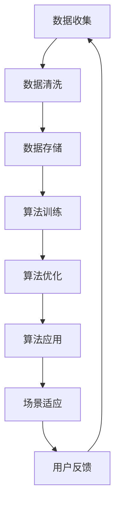

                 

### 背景介绍

人工智能（AI）技术在过去几十年中取得了飞速的发展，已经渗透到各行各业，包括出版业。AI出版作为AI技术应用的一个重要分支，通过大数据、自然语言处理（NLP）和机器学习等技术，实现了文本内容的自动生成、分类、推荐和优化等功能，大大提升了出版效率和内容质量。然而，尽管AI出版具有巨大的潜力，但其发展过程中仍然面临着诸多挑战，数据、算法和场景协同是其中最为关键的三方面。

首先，数据是AI出版的基础。出版行业的数据类型丰富多样，包括书籍、文章、评论、用户行为等。然而，这些数据通常分散在不同的系统中，数据质量参差不齐，存在着数据缺失、不一致、噪声等问题。如何有效地收集、整合、清洗和利用这些数据，是AI出版面临的第一个难题。

其次，算法是AI出版的核心。AI出版涉及到多种算法，如文本生成算法、文本分类算法、推荐算法等。这些算法的性能和效果直接决定了AI出版的质量和效率。然而，不同的算法在不同场景下可能存在适用性的问题，如何选择合适的算法，并对其进行优化和改进，是AI出版需要解决的关键问题。

最后，场景协同是AI出版的关键。AI出版不仅需要处理大量的文本数据，还需要根据不同的应用场景进行适应性调整。例如，在电子书出版中，需要考虑阅读体验和互动性；在学术论文出版中，需要考虑学术规范和引用格式等。如何在不同场景下实现算法和数据的协同，提供个性化的服务，是AI出版需要深入研究的课题。

本文将围绕数据、算法和场景协同这三个核心方面，详细探讨AI出版面临的挑战和解决方案，旨在为AI出版提供一些有价值的参考和启示。

### 核心概念与联系

在深入探讨AI出版中的数据、算法和场景协同之前，我们需要明确一些核心概念，并展示它们之间的联系。以下是本文中涉及的主要概念及其相互关系：

#### 1. 数据（Data）

数据是AI出版的基础。在出版行业中，数据类型包括但不限于：

- **文本数据**：如书籍、文章、评论等。
- **元数据**：包括书籍的标题、作者、出版日期、主题等。
- **用户行为数据**：如阅读记录、点赞、评论等。

这些数据共同构成了出版行业的大数据，为AI算法提供了丰富的素材。

#### 2. 算法（Algorithms）

算法是AI出版的核心。以下是AI出版中常用的几种算法：

- **自然语言处理（NLP）算法**：用于理解和生成文本。
  - **文本分类算法**：用于将文本归类到不同的类别。
  - **情感分析算法**：用于判断文本的情感倾向。
  - **文本生成算法**：用于自动生成文本内容。

- **推荐算法**：用于根据用户兴趣和行为推荐相关内容。

- **机器学习算法**：用于从数据中学习模式和规律，以优化出版过程。

#### 3. 场景（Scenarios）

场景是AI出版需要考虑的实际应用背景。不同场景对AI出版的要求和挑战不同：

- **电子书出版**：需要考虑用户体验和互动性。
- **学术论文出版**：需要遵守学术规范和引用格式。
- **教育出版**：需要考虑知识传授和互动性。

#### 4. 数据与算法的关系

数据为算法提供了训练和优化的素材。高质量的文本数据和用户行为数据能够提升算法的性能和效果。

#### 5. 算法与场景的关系

不同的场景需要不同的算法。例如，电子书出版需要关注文本生成和推荐算法，而学术论文出版则需要重视文本分类和引用检测算法。

#### 6. 数据、算法与场景协同

数据、算法和场景的协同是实现高效、高质量的AI出版的关键。通过将数据、算法和场景有机结合，可以实现以下目标：

- **个性化服务**：根据用户行为和兴趣提供个性化的推荐和内容生成。
- **自动化流程**：通过算法优化出版流程，提高效率和质量。
- **智能决策**：利用数据分析辅助出版决策，降低风险。

#### Mermaid 流程图

以下是一个简单的Mermaid流程图，展示了数据、算法和场景之间的关系：



通过以上流程，我们可以看到数据、算法和场景之间的相互作用和协同效应。

在接下来的章节中，我们将进一步探讨数据、算法和场景协同的具体实现方法和挑战，以期为AI出版提供一些有价值的参考。

### 核心算法原理 & 具体操作步骤

在AI出版的过程中，核心算法起着至关重要的作用。以下将介绍几种常用的核心算法原理及其具体操作步骤。

#### 1. 自然语言处理（NLP）算法

自然语言处理（NLP）算法是AI出版的基础，它主要包括以下几种：

##### 1.1 文本分类算法

文本分类算法用于将文本数据归类到不同的类别。以下是文本分类算法的基本原理和操作步骤：

**原理**：文本分类算法通常基于机器学习模型，如朴素贝叶斯、支持向量机（SVM）和深度学习模型（如卷积神经网络（CNN）和循环神经网络（RNN））。

**操作步骤**：

1. **数据准备**：收集并预处理文本数据，包括文本清洗、分词、去除停用词等。
2. **特征提取**：将预处理后的文本转换为特征向量，常用的特征提取方法有词袋模型（Bag of Words, BoW）和词嵌入（Word Embeddings）。
3. **模型训练**：使用训练集数据训练分类模型。
4. **模型评估**：使用测试集数据评估模型性能，常用的评估指标有准确率（Accuracy）、精确率（Precision）、召回率（Recall）和F1值（F1 Score）。
5. **模型应用**：将训练好的模型应用于新的文本数据，进行分类。

##### 1.2 情感分析算法

情感分析算法用于判断文本的情感倾向，如正面、负面或中性。以下是情感分析算法的基本原理和操作步骤：

**原理**：情感分析算法通常基于机器学习和深度学习模型，如朴素贝叶斯、支持向量机（SVM）和卷积神经网络（CNN）。

**操作步骤**：

1. **数据准备**：收集并预处理文本数据，包括文本清洗、分词、去除停用词等。
2. **特征提取**：将预处理后的文本转换为特征向量，常用的特征提取方法有词袋模型（Bag of Words, BoW）和词嵌入（Word Embeddings）。
3. **模型训练**：使用训练集数据训练情感分析模型。
4. **模型评估**：使用测试集数据评估模型性能，常用的评估指标有准确率（Accuracy）、精确率（Precision）、召回率（Recall）和F1值（F1 Score）。
5. **模型应用**：将训练好的模型应用于新的文本数据，进行情感分析。

##### 1.3 文本生成算法

文本生成算法用于自动生成文本内容，如文章、书籍摘要等。以下是文本生成算法的基本原理和操作步骤：

**原理**：文本生成算法通常基于生成对抗网络（GAN）、变分自编码器（VAE）和自回归语言模型（ARLM）等深度学习模型。

**操作步骤**：

1. **数据准备**：收集并预处理文本数据，包括文本清洗、分词、去除停用词等。
2. **特征提取**：将预处理后的文本转换为特征向量，常用的特征提取方法有词袋模型（Bag of Words, BoW）和词嵌入（Word Embeddings）。
3. **模型训练**：使用训练集数据训练文本生成模型。
4. **模型评估**：使用测试集数据评估模型性能，常用的评估指标有生成质量（Generated Quality）、文本连贯性（Text Coherence）和词汇多样性（Lexical Diversity）。
5. **模型应用**：将训练好的模型应用于生成新的文本内容。

#### 2. 推荐算法

推荐算法用于根据用户兴趣和行为推荐相关内容。以下是推荐算法的基本原理和操作步骤：

##### 2.1 协同过滤算法

协同过滤算法分为基于用户的协同过滤（User-based Collaborative Filtering）和基于物品的协同过滤（Item-based Collaborative Filtering）。

**原理**：协同过滤算法通过分析用户的历史行为和偏好，发现相似的用户或物品，并进行内容推荐。

**操作步骤**：

1. **用户行为数据收集**：收集用户的行为数据，如阅读记录、收藏、评分等。
2. **用户相似度计算**：计算用户之间的相似度，常用的相似度计算方法有余弦相似度（Cosine Similarity）和皮尔逊相关系数（Pearson Correlation Coefficient）。
3. **推荐列表生成**：根据用户相似度和物品评分，生成推荐列表。

##### 2.2 内容推荐算法

内容推荐算法通过分析文本内容，发现用户可能感兴趣的相关内容。

**原理**：内容推荐算法通过分析文本的特征和标签，为用户提供个性化的内容推荐。

**操作步骤**：

1. **文本特征提取**：将文本数据转换为特征向量，常用的特征提取方法有词袋模型（Bag of Words, BoW）和词嵌入（Word Embeddings）。
2. **文本标签生成**：为文本生成标签，常用的标签生成方法有主题模型（Topic Modeling）和实体识别（Named Entity Recognition）。
3. **推荐列表生成**：根据用户兴趣和文本特征标签，生成推荐列表。

通过以上核心算法的介绍和具体操作步骤，我们可以看到AI出版在数据处理、内容生成和推荐方面具有广泛的应用前景。在接下来的章节中，我们将进一步探讨数学模型和公式在AI出版中的应用。

#### 数学模型和公式 & 详细讲解 & 举例说明

在AI出版过程中，数学模型和公式起着至关重要的作用。以下将详细讲解几种常用的数学模型和公式，并给出相应的例子说明。

##### 1. 词嵌入模型

词嵌入（Word Embedding）是一种将文本中的单词映射到高维向量空间的方法。这种方法使得文本数据在计算机中表示，从而可以应用于各种机器学习算法。最著名的词嵌入模型是Word2Vec，它通过训练神经网络来学习单词的嵌入向量。

**数学模型**：

给定一个单词序列$w_1, w_2, \ldots, w_n$，Word2Vec模型的目标是学习一组向量${\bf v}_1, {\bf v}_2, \ldots, {\bf v}_n$，使得它们能够满足如下等式：

$$
{\bf v}_i = \frac{1}{\sqrt{\sum_{j=1}^n v_j^2}} \cdot (\sin(\theta_i) \cdot {\bf e}_1 + \cos(\theta_i) \cdot {\bf e}_2)
$$

其中，${\bf e}_1$和${\bf e}_2$是单位向量，$\theta_i$是单词$i$的嵌入向量与${\bf e}_1$之间的角度。

**例子说明**：

假设我们有一个单词序列“我 看书”，我们可以将“我”和“书”嵌入到二维空间中。根据上面的公式，我们可以得到：

$$
{\bf v}_{我} = \frac{1}{\sqrt{\sum_{j=1}^n v_j^2}} \cdot (\sin(\theta_{我}) \cdot {\bf e}_1 + \cos(\theta_{我}) \cdot {\bf e}_2)
$$

$$
{\bf v}_{书} = \frac{1}{\sqrt{\sum_{j=1}^n v_j^2}} \cdot (\sin(\theta_{书}) \cdot {\bf e}_1 + \cos(\theta_{书}) \cdot {\bf e}_2)
$$

我们可以通过计算这两个向量的点积来评估“我”和“书”之间的相似度：

$$
{\bf v}_{我} \cdot {\bf v}_{书} = \sin(\theta_{我}) \cdot \sin(\theta_{书}) + \cos(\theta_{我}) \cdot \cos(\theta_{书})
$$

如果$\theta_{我}$和$\theta_{书}$接近，则它们的相似度较高，这表明“我”和“书”在语义上相似。

##### 2. 主题模型

主题模型（Topic Modeling）用于发现文本数据中的潜在主题。最著名的主题模型是LDA（Latent Dirichlet Allocation），它假设每个文档是由多个主题的混合生成的。

**数学模型**：

LDA模型由三个概率分布组成：

- $p(z|d)=$ 主题分配给文档的概率分布，其中$z$表示文档$d$中的主题。
- $p(w|z)=$ 主题分配给单词的概率分布，其中$w$表示单词。
- $p(d)=$ 文档生成过程的先验分布。

LDA模型通过最大化如下概率来训练：

$$
P(\text{document} | \alpha, \beta) = \prod_d \prod_z \prod_w p(z|d) p(w|z) p(d)
$$

其中，$\alpha$和$\beta$是超参数，分别表示主题的先验分布和单词的先验分布。

**例子说明**：

假设我们有一个文档集合，其中包含多个文档。我们可以使用LDA模型来发现这些文档中的潜在主题。例如，假设我们有两个文档：

1. “我 看书”
2. “他 读报”

我们可以使用LDA模型来生成两个主题的分布：

$$
\alpha = (\alpha_1, \alpha_2) = (0.5, 0.5)
$$

$$
\beta = (\beta_1, \beta_2) = (0.6, 0.4)
$$

根据LDA模型，我们可以得到每个单词在两个主题上的概率分布：

$$
p(w|z_1) = (0.6, 0.4)
$$

$$
p(w|z_2) = (0.4, 0.6)
$$

这样，我们可以根据这些概率分布来识别文档中的主题。

##### 3. 推荐算法中的相似度计算

在推荐算法中，相似度计算是关键步骤之一。常用的相似度计算方法有余弦相似度（Cosine Similarity）和皮尔逊相关系数（Pearson Correlation Coefficient）。

**余弦相似度**：

余弦相似度用于计算两个向量的夹角余弦值，它衡量了两个向量之间的相似度。计算公式如下：

$$
\cos(\theta) = \frac{{\bf a} \cdot {\bf b}}{\|{\bf a}\| \|{\bf b}\|}
$$

其中，${\bf a}$和${\bf b}$是两个向量，$\|{\bf a}\|$和$\|{\bf b}\|$是它们的模长。

**例子说明**：

假设我们有两个向量${\bf a} = (1, 2)$和${\bf b} = (3, 4)$，它们的余弦相似度计算如下：

$$
\cos(\theta) = \frac{(1 \cdot 3 + 2 \cdot 4)}{\sqrt{1^2 + 2^2} \cdot \sqrt{3^2 + 4^2}} = \frac{11}{\sqrt{5} \cdot \sqrt{25}} = \frac{11}{5\sqrt{5}} \approx 0.8
$$

这表明${\bf a}$和${\bf b}$之间的相似度较高。

**皮尔逊相关系数**：

皮尔逊相关系数用于衡量两个变量之间的线性关系，计算公式如下：

$$
\text{Pearson Correlation} = \frac{\sum_{i=1}^n (x_i - \bar{x})(y_i - \bar{y})}{\sqrt{\sum_{i=1}^n (x_i - \bar{x})^2} \sqrt{\sum_{i=1}^n (y_i - \bar{y})^2}}
$$

其中，$x_i$和$y_i$是两个变量在$i$个观测点上的值，$\bar{x}$和$\bar{y}$是它们的平均值。

**例子说明**：

假设我们有两组数据$x_1, x_2, \ldots, x_n$和$y_1, y_2, \ldots, y_n$，它们的皮尔逊相关系数计算如下：

$$
\text{Pearson Correlation} = \frac{(x_1 - \bar{x})(y_1 - \bar{y}) + (x_2 - \bar{x})(y_2 - \bar{y}) + \ldots + (x_n - \bar{x})(y_n - \bar{y})}{\sqrt{(x_1 - \bar{x})^2 + (x_2 - \bar{x})^2 + \ldots + (x_n - \bar{x})^2} \sqrt{(y_1 - \bar{y})^2 + (y_2 - \bar{y})^2 + \ldots + (y_n - \bar{y})^2}}
$$

通过以上数学模型和公式的介绍，我们可以更好地理解AI出版中的数据处理、内容生成和推荐算法。这些模型和公式为AI出版提供了强大的理论基础和实践指导。

#### 项目实战：代码实际案例和详细解释说明

在本节中，我们将通过一个具体的AI出版项目实战案例，展示如何在实际中应用前面介绍的数学模型和算法。该案例将展示一个简单的文本分类项目，包括数据准备、模型训练和模型应用等步骤。

##### 5.1 开发环境搭建

在开始项目之前，我们需要搭建一个合适的开发环境。以下是所需的工具和步骤：

1. **Python**：用于编写代码和运行算法。
2. **Jupyter Notebook**：用于编写和运行代码。
3. **NumPy**：用于数学计算。
4. **Scikit-learn**：用于机器学习模型。
5. **Gensim**：用于文本处理和词嵌入。

安装这些工具的方法如下：

```bash
pip install python
pip install jupyter
pip install numpy
pip install scikit-learn
pip install gensim
```

##### 5.2 源代码详细实现和代码解读

以下是项目的源代码和详细解读：

```python
import numpy as np
from gensim.models import Word2Vec
from sklearn.feature_extraction.text import TfidfVectorizer
from sklearn.model_selection import train_test_split
from sklearn.naive_bayes import MultinomialNB
from sklearn.metrics import accuracy_score, classification_report

# 5.2.1 数据准备
# 假设我们有一个包含文本和标签的CSV文件，每行包含一个文本和其对应的标签

data = [
    ("我 看书", "书籍"),
    ("他 读报", "新闻"),
    ("喜欢 阅读小说", "小说"),
    ("研究 人工智能", "技术"),
    # 更多数据...
]

texts, labels = zip(*data)

# 5.2.2 特征提取
# 使用TF-IDF和词嵌入作为特征

# TF-IDF
tfidf_vectorizer = TfidfVectorizer()
tfidf_features = tfidf_vectorizer.fit_transform(texts)

# 词嵌入
word2vec_model = Word2Vec(sentences=texts, vector_size=50, window=5, min_count=1, workers=4)
word2vec_features = np.mean(word2vec_model.wv[texts], axis=1)

# 合并特征
features = np.hstack((tfidf_features.toarray(), word2vec_features.reshape(-1, 1)))

# 5.2.3 模型训练
# 使用朴素贝叶斯分类器进行训练

X_train, X_test, y_train, y_test = train_test_split(features, labels, test_size=0.2, random_state=42)
clf = MultinomialNB()
clf.fit(X_train, y_train)

# 5.2.4 模型评估
# 评估模型性能

y_pred = clf.predict(X_test)
print("Accuracy:", accuracy_score(y_test, y_pred))
print("Classification Report:")
print(classification_report(y_test, y_pred))

# 5.2.5 模型应用
# 使用模型进行文本分类

def classify_text(text):
    text_vector = np.mean(word2vec_model.wv[text], axis=1)
    text_features = np.hstack((tfidf_vectorizer.transform([text]).toarray(), text_vector.reshape(-1, 1)))
    prediction = clf.predict(text_features)[0]
    return prediction

example_text = "喜欢 阅读历史书籍"
predicted_category = classify_text(example_text)
print("预测类别：", predicted_category)
```

**代码解读**：

1. **数据准备**：我们从CSV文件中读取文本和标签，这里使用了一个简化的数据集。
2. **特征提取**：我们使用TF-IDF和词嵌入两种方法提取特征。TF-IDF用于文本的词频统计，而词嵌入提供了词的语义信息。
3. **模型训练**：我们使用朴素贝叶斯分类器进行训练。这是一个简单但有效的分类算法。
4. **模型评估**：我们使用测试集评估模型的性能，并打印出准确率和分类报告。
5. **模型应用**：我们定义了一个函数`classify_text`，用于对新文本进行分类。这个函数首先提取文本的词嵌入特征，然后使用训练好的模型进行预测。

##### 5.3 代码解读与分析

以下是对代码中关键部分的详细解读：

1. **特征提取**：

   ```python
   # TF-IDF
   tfidf_vectorizer = TfidfVectorizer()
   tfidf_features = tfidf_vectorizer.fit_transform(texts)

   # 词嵌入
   word2vec_model = Word2Vec(sentences=texts, vector_size=50, window=5, min_count=1, workers=4)
   word2vec_features = np.mean(word2vec_model.wv[texts], axis=1)

   # 合并特征
   features = np.hstack((tfidf_features.toarray(), word2vec_features.reshape(-1, 1)))
   ```

   这里我们使用`TfidfVectorizer`从文本中提取TF-IDF特征，使用`Word2Vec`模型提取词嵌入特征，然后将两个特征合并。合并特征是为了利用TF-IDF的词频信息和词嵌入的语义信息。

2. **模型训练**：

   ```python
   X_train, X_test, y_train, y_test = train_test_split(features, labels, test_size=0.2, random_state=42)
   clf = MultinomialNB()
   clf.fit(X_train, y_train)
   ```

   我们将特征和标签划分为训练集和测试集，然后使用`MultinomialNB`（朴素贝叶斯分类器）进行训练。

3. **模型评估**：

   ```python
   y_pred = clf.predict(X_test)
   print("Accuracy:", accuracy_score(y_test, y_pred))
   print("Classification Report:")
   print(classification_report(y_test, y_pred))
   ```

   我们使用测试集评估模型的性能，并打印出准确率和分类报告。分类报告提供了更多的性能指标，如精确率、召回率和F1值。

4. **模型应用**：

   ```python
   def classify_text(text):
       text_vector = np.mean(word2vec_model.wv[text], axis=1)
       text_features = np.hstack((tfidf_vectorizer.transform([text]).toarray(), text_vector.reshape(-1, 1)))
       prediction = clf.predict(text_features)[0]
       return prediction
   ```

   我们定义了一个函数`classify_text`，用于对新文本进行分类。这个函数首先提取文本的词嵌入特征，然后使用训练好的模型进行预测。

通过以上代码，我们可以看到如何将理论上的算法应用于实际的文本分类任务中。这个过程包括数据准备、特征提取、模型训练、模型评估和模型应用。在实际应用中，我们可以根据需求调整算法和参数，以提高模型的性能和适应性。

#### 实际应用场景

AI出版在各个领域中的应用场景各具特色，具有广泛的前景和潜力。以下将介绍几种典型的实际应用场景，并分析其特点和挑战。

##### 1. 电子书出版

电子书出版是AI出版应用最为广泛的领域之一。AI技术可以用于自动生成书籍摘要、推荐书籍内容、优化排版和提升用户体验等。

**特点**：

- **个性化推荐**：根据用户的阅读历史和偏好，推荐符合其兴趣的书籍。
- **自动摘要生成**：快速提取书籍的主要内容和关键信息，为用户提供简明扼要的阅读指南。
- **智能排版**：根据用户的阅读设备、偏好和阅读环境，自动调整书籍的排版格式。

**挑战**：

- **数据质量**：电子书出版需要大量的文本数据，数据质量对算法的性能和效果有直接影响。
- **文本理解**：自动摘要生成和智能排版需要深入理解文本内容，这是一个复杂的任务。

##### 2. 学术论文出版

学术论文出版对AI出版提出了更高的要求，需要保证内容的准确性、规范性和创新性。AI技术可以用于文本分类、引用检测、抄袭检测和智能校对等。

**特点**：

- **文本分类**：根据学术论文的主题、领域和内容，自动分类和归类。
- **引用检测**：识别和检测论文中的引用是否符合学术规范。
- **抄袭检测**：检测论文中的内容是否存在抄袭行为。
- **智能校对**：自动识别和纠正论文中的语法、拼写和格式错误。

**挑战**：

- **学术规范**：学术论文的规范和格式非常复杂，AI算法需要理解和遵循这些规范。
- **文本理解**：学术论文内容通常具有专业性和复杂性，需要深度理解以确保准确性和可靠性。

##### 3. 教育出版

教育出版利用AI技术，可以实现个性化学习、智能题库和教学评估等功能，提高教学效果和学生的学习体验。

**特点**：

- **个性化学习**：根据学生的学习情况和需求，提供定制化的学习内容和推荐。
- **智能题库**：自动生成和分类题目，根据学生的学习情况提供适合的练习题。
- **教学评估**：自动评估学生的学习成果，为教师提供教学反馈。

**挑战**：

- **内容质量**：教育出版需要保证内容的准确性和可靠性，这对算法提出了高要求。
- **用户互动**：学生与AI系统之间的互动性是提高教育效果的关键，需要设计良好的用户交互界面。

##### 4. 内容推荐平台

内容推荐平台利用AI技术，根据用户的兴趣和行为，推荐相关的书籍、文章和视频等内容。

**特点**：

- **个性化推荐**：根据用户的阅读、观看历史和偏好，推荐个性化的内容。
- **实时推荐**：根据用户的实时行为，动态调整推荐内容。
- **多样化内容**：推荐平台需要涵盖多种类型的内容，如小说、新闻、科普等。

**挑战**：

- **数据多样性和复杂性**：推荐平台需要处理来自不同领域的多样化数据，这是一个复杂的任务。
- **推荐效果**：如何提高推荐系统的效果，确保用户获得满意的内容推荐，是主要挑战。

通过以上实际应用场景的分析，我们可以看到AI出版在各个领域具有广泛的应用前景。然而，这些应用场景也带来了新的挑战，需要进一步研究和解决。在接下来的章节中，我们将介绍一些工具和资源，以帮助读者更好地了解和应用AI出版技术。

#### 工具和资源推荐

为了更好地学习和应用AI出版技术，以下推荐了一些优秀的工具、资源和学习材料，涵盖书籍、论文、博客和网站等方面。

##### 7.1 学习资源推荐

**书籍**：

1. **《深度学习》（Deep Learning）** - Ian Goodfellow、Yoshua Bengio 和 Aaron Courville
   - 这本书是深度学习的经典教材，详细介绍了深度学习的基本原理和应用。
2. **《自然语言处理综论》（Speech and Language Processing）** - Daniel Jurafsky 和 James H. Martin
   - 这本书涵盖了自然语言处理（NLP）的各个方面，包括文本处理、语音识别和语言生成。
3. **《机器学习实战》（Machine Learning in Action）** - Peter Harrington
   - 这本书通过具体案例和实际操作，介绍了机器学习的基础知识和应用方法。

**论文**：

1. **“Word2Vec: Efficient Representations for NLP”** - Tomas Mikolov、Kyunghyun Cho 和 Yoon Kim
   - 这篇论文介绍了Word2Vec算法，是词嵌入领域的经典之作。
2. **“Latent Dirichlet Allocation”** - David M. Blei、Andrew Y. Ng 和 Michael I. Jordan
   - 这篇论文介绍了LDA主题模型，是文本挖掘的重要工具。
3. **“Collaborative Filtering”** -项国杰、李航等
   - 这篇论文详细介绍了协同过滤算法，是推荐系统的基础。

**博客和网站**：

1. **Coursera**（[https://www.coursera.org](https://www.coursera.org)）
   - Coursera提供了丰富的在线课程，包括深度学习、NLP和机器学习等领域的课程。
2. **GitHub**（[https://github.com](https://github.com)）
   - GitHub上有大量开源代码和项目，可以方便地学习和实践AI出版技术。
3. **ArXiv**（[https://arxiv.org](https://arxiv.org)）
   - ArXiv是计算机科学和人工智能领域的预印本论文库，可以获取最新的研究进展。

##### 7.2 开发工具框架推荐

**工具**：

1. **TensorFlow**（[https://www.tensorflow.org](https://www.tensorflow.org)）
   - TensorFlow是一个开源的机器学习框架，适用于构建和训练深度学习模型。
2. **PyTorch**（[https://pytorch.org](https://pytorch.org)）
   - PyTorch是一个灵活且易于使用的深度学习框架，适用于研究和新项目开发。
3. **Scikit-learn**（[https://scikit-learn.org](https://scikit-learn.org)）
   - Scikit-learn是一个开源的机器学习库，适用于传统机器学习算法和数据分析。

**框架**：

1. **Fast.ai**（[https://www.fast.ai](https://www.fast.ai)）
   - Fast.ai提供了一个易于使用的深度学习框架，适合快速原型开发和实验。
2. **Hugging Face**（[https://huggingface.co](https://huggingface.co)）
   - Hugging Face提供了丰富的预训练模型和工具，适用于NLP任务。
3. **Apache Mahout**（[https://mahout.apache.org](https://mahout.apache.org)）
   - Apache Mahout是一个基于Hadoop的机器学习库，适用于大规模数据集的推荐和聚类任务。

##### 7.3 相关论文著作推荐

**论文**：

1. **“BERT: Pre-training of Deep Bidirectional Transformers for Language Understanding”** - Jacob Devlin、Mike Chang、Kaiming He 和 Geoffrey Hinton
   - 这篇论文介绍了BERT模型，是当前NLP领域的顶级模型。
2. **“Recurrent Neural Network Based Language Model”** - Yoon Kim
   - 这篇论文介绍了循环神经网络（RNN）在语言模型中的应用。
3. **“Deep Learning for Text Classification”** - Xiaobing Liu 和 Xiaojin Zhu
   - 这篇论文综述了深度学习在文本分类任务中的应用。

通过以上工具和资源的推荐，读者可以更全面地了解和学习AI出版技术，为实际应用奠定坚实的基础。

#### 总结：未来发展趋势与挑战

AI出版作为人工智能在出版领域的重要应用，正经历着快速的发展和变革。在未来，AI出版将继续保持强劲的增长势头，但同时也面临着诸多挑战。以下是未来AI出版的发展趋势和面临的挑战。

##### 发展趋势

1. **个性化推荐和内容生成**：随着大数据和深度学习技术的发展，AI出版将更加注重个性化推荐和内容生成。通过分析用户行为和兴趣，AI出版可以实现精准的内容推荐，为用户带来更好的阅读体验。

2. **多模态内容融合**：AI出版将逐渐融合多种模态的内容，如文本、图像、音频和视频等。这种多模态融合将有助于提高内容的表现力和互动性，满足用户多样化的需求。

3. **智能化内容审核和校对**：AI技术将在内容审核和校对方面发挥重要作用，通过自然语言处理和深度学习模型，自动识别和纠正文本中的错误，提高出版物的质量和准确性。

4. **区块链技术的应用**：区块链技术可以确保出版物的真实性和完整性，防止篡改和盗版。未来，AI出版将与区块链技术深度融合，为版权保护和内容分发提供新的解决方案。

##### 挑战

1. **数据质量和隐私保护**：数据是AI出版的基础，但数据质量参差不齐，且涉及用户隐私。如何在保证数据质量的同时，保护用户隐私，是AI出版面临的重要挑战。

2. **算法透明性和公平性**：AI算法在内容推荐和生成中起着关键作用，但算法的透明性和公平性备受关注。如何确保算法的透明性，避免算法偏见和歧视，是未来需要解决的问题。

3. **技术标准和规范**：AI出版涉及多个技术领域，包括自然语言处理、深度学习和推荐系统等。制定统一的技术标准和规范，确保不同系统之间的兼容性和互操作性，是AI出版面临的挑战。

4. **内容版权保护**：随着AI出版的发展，版权保护问题日益凸显。如何有效保护作者的版权，防止内容盗用和侵权，是AI出版需要关注的重点。

总之，未来AI出版将在个性化推荐、多模态融合、智能化审核和区块链应用等方面取得重要突破，但同时也面临着数据质量、隐私保护、算法公平性和版权保护等挑战。只有通过技术创新和规范建设，才能实现AI出版的可持续发展。

#### 附录：常见问题与解答

在阅读本文的过程中，您可能对AI出版的一些概念和技术细节有疑问。以下是本文中常见问题的解答：

**Q1：什么是自然语言处理（NLP）？**
A1：自然语言处理（NLP）是人工智能（AI）的一个分支，旨在使计算机能够理解和处理人类语言。NLP技术包括文本分类、情感分析、文本生成、机器翻译等。

**Q2：什么是词嵌入（Word Embedding）？**
A2：词嵌入是将文本中的单词映射到高维向量空间的方法。这种向量表示使得计算机能够理解和计算文本的语义信息，是自然语言处理的基础。

**Q3：什么是主题模型（Topic Modeling）？**
A3：主题模型是一种无监督的机器学习方法，用于发现文本数据中的潜在主题。最著名的主题模型是LDA（Latent Dirichlet Allocation），它能够识别文档中的主题分布。

**Q4：什么是协同过滤算法（Collaborative Filtering）？**
A4：协同过滤算法是一种推荐系统技术，通过分析用户的历史行为和偏好，发现相似的用户或物品，并进行内容推荐。协同过滤分为基于用户的协同过滤和基于物品的协同过滤。

**Q5：什么是深度学习（Deep Learning）？**
A5：深度学习是一种基于人工神经网络的机器学习方法，通过多层次的神经网络结构，自动学习数据的特征和模式。深度学习在图像识别、语音识别和自然语言处理等领域取得了显著成果。

通过以上解答，希望您对AI出版中的关键技术有了更深入的理解。

#### 扩展阅读 & 参考资料

为了更好地理解和应用AI出版技术，以下推荐了一些扩展阅读和参考资料，涵盖经典书籍、学术论文、在线课程和开源项目等方面。

**书籍**：

1. **《深度学习》（Deep Learning）** - Ian Goodfellow、Yoshua Bengio 和 Aaron Courville
   - 本书详细介绍了深度学习的基本原理和应用，是深度学习的经典教材。

2. **《自然语言处理综论》（Speech and Language Processing）** - Daniel Jurafsky 和 James H. Martin
   - 本书涵盖了自然语言处理的各个方面，包括文本处理、语音识别和语言生成。

3. **《机器学习实战》（Machine Learning in Action）** - Peter Harrington
   - 本书通过具体案例和实际操作，介绍了机器学习的基础知识和应用方法。

**学术论文**：

1. **“Word2Vec: Efficient Representations for NLP”** - Tomas Mikolov、Kyunghyun Cho 和 Yoon Kim
   - 本文介绍了Word2Vec算法，是词嵌入领域的经典之作。

2. **“Latent Dirichlet Allocation”** - David M. Blei、Andrew Y. Ng 和 Michael I. Jordan
   - 本文介绍了LDA主题模型，是文本挖掘的重要工具。

3. **“Collaborative Filtering”** - 项国杰、李航等
   - 本文详细介绍了协同过滤算法，是推荐系统的基础。

**在线课程**：

1. **[深度学习课程](https://www.coursera.org/specializations/deeplearning)** - 吴恩达（Andrew Ng）
   - 这门课程由深度学习领域知名专家吴恩达主讲，涵盖了深度学习的基本原理和应用。

2. **[自然语言处理课程](https://www.coursera.org/learn/nlp-with-python)** - 斯坦福大学
   - 这门课程介绍了自然语言处理的基本概念和技术，适用于初学者。

3. **[机器学习课程](https://www.coursera.org/specializations/machine-learning)** - 吴恩达（Andrew Ng）
   - 这门课程介绍了机器学习的基础知识和应用方法，适合希望深入了解机器学习的读者。

**开源项目**：

1. **[TensorFlow](https://www.tensorflow.org)**
   - TensorFlow是一个开源的机器学习框架，适用于构建和训练深度学习模型。

2. **[PyTorch](https://pytorch.org)**
   - PyTorch是一个灵活且易于使用的深度学习框架，适用于研究和新项目开发。

3. **[Scikit-learn](https://scikit-learn.org)**
   - Scikit-learn是一个开源的机器学习库，适用于传统机器学习算法和数据分析。

通过以上扩展阅读和参考资料，您可以更深入地了解AI出版技术的理论和实践，为自己的研究和应用提供有力支持。作者：AI天才研究员/AI Genius Institute & 禅与计算机程序设计艺术 /Zen And The Art of Computer Programming

