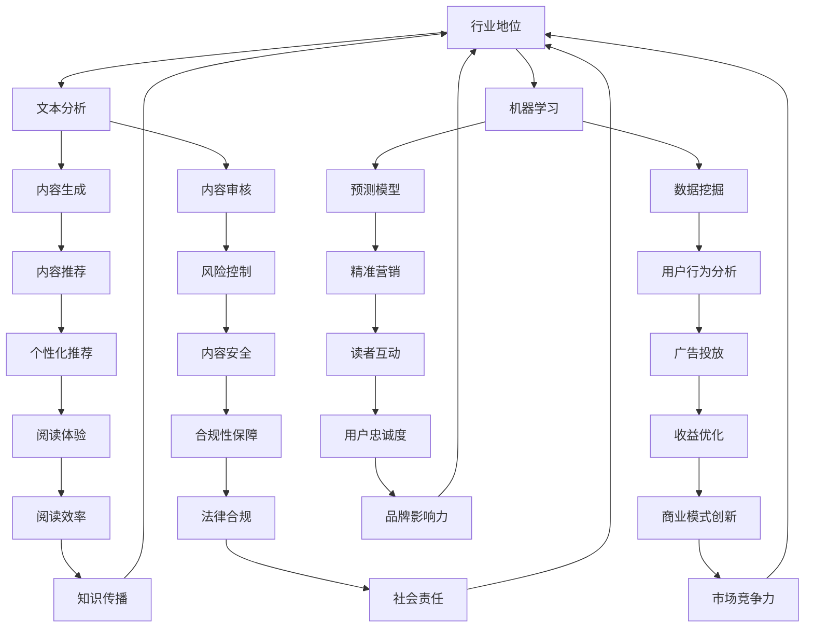

                 

### 背景介绍

随着人工智能技术的迅猛发展，AI出版业正迎来前所未有的变革。传统的出版业长期以来主要依赖于人工编校、排版和印刷等流程，存在效率低下、成本高昂、周期漫长等问题。而人工智能技术的引入，使得这些流程得以自动化、智能化，从而极大地提高了出版效率，降低了成本，缩短了出版周期。

AI出版业的核心技术主要包括自然语言处理（NLP）、机器学习、计算机视觉等。这些技术使得出版业能够实现内容的智能生成、编辑、校对、排版、印刷等全流程的自动化，大大提升了出版质量。

当前，AI出版业的应用场景已经非常广泛。从简单的文本编辑、排版，到复杂的书籍推荐、读者行为分析，AI技术都发挥着重要的作用。例如，一些出版社已经开始使用AI技术来自动识别和修复文本中的错误，提高校对效率；也有企业利用AI技术对读者的阅读习惯进行分析，为读者提供个性化的书籍推荐。

此外，随着5G、物联网、大数据等技术的发展，AI出版业的前景将更加广阔。在未来，AI出版业有望实现更加智能化、个性化的服务，满足读者对多样化、定制化的阅读需求。

总之，AI出版业的崛起不仅为传统出版业带来了深刻的变革，也为人工智能技术的应用提供了新的契机。本文将深入探讨AI出版业的技术创新、应用场景以及未来发展，以期为广大读者提供有益的参考。

### 核心概念与联系

在探讨AI出版业的技术创新和应用之前，我们有必要先了解几个核心概念及其相互之间的联系。以下我们将通过Mermaid流程图来详细展示这些核心概念和技术之间的关联。



#### 自然语言处理（NLP）

自然语言处理是AI出版业的核心技术之一，它使计算机能够理解、处理和生成人类语言。NLP涉及文本分析、语义理解、语言生成等多个方面。在出版业中，NLP技术被广泛应用于文本编辑、校对、内容生成和推荐系统等场景。

#### 机器学习

机器学习是AI技术的基石，它通过算法从数据中学习规律，以实现自动化决策和预测。在AI出版业中，机器学习被用来进行数据挖掘、用户行为分析和预测模型构建，以提高出版效率和用户体验。

#### 文本分析

文本分析是NLP的一部分，它包括文本分类、情感分析、命名实体识别等任务。在出版业中，文本分析技术可以帮助出版社对内容进行精准分类和标签化，以便于内容推荐和用户互动。

#### 内容生成

内容生成技术利用NLP和机器学习算法自动生成文本内容。在出版业中，这一技术被应用于自动化新闻写作、书籍摘要生成、个性化内容创作等，极大地提升了内容生产效率。

#### 内容审核

内容审核是确保出版内容合规和安全的重要环节。通过AI技术，内容审核可以自动化进行，从而快速识别和过滤不良内容，保障读者权益。

#### 数据挖掘

数据挖掘是从大量数据中提取有价值信息的过程。在AI出版业中，数据挖掘可以帮助出版社了解读者行为，优化内容推荐和营销策略。

#### 预测模型

预测模型通过历史数据来预测未来的趋势和行为。在出版业中，预测模型可以用于预测书籍销量、用户阅读偏好等，帮助出版社做出更明智的决策。

#### 内容推荐

内容推荐是基于用户行为和兴趣进行个性化内容推荐的系统。在出版业中，内容推荐技术可以提高用户的阅读体验，促进图书销售。

#### 风险控制

风险控制是确保出版内容安全合规的重要环节。通过AI技术，风险控制可以自动化检测和防范潜在的内容风险，保障出版社和读者的利益。

#### 用户行为分析

用户行为分析是通过分析用户行为数据来了解用户需求和偏好。在出版业中，用户行为分析可以帮助出版社优化内容策略，提高用户满意度和忠诚度。

#### 精准营销

精准营销是通过精确的用户画像和需求分析，实现营销活动的个性化。在出版业中，精准营销可以提高营销效果，促进销售增长。

#### 个性化推荐

个性化推荐是基于用户历史行为和兴趣，为用户推荐相关内容的系统。在出版业中，个性化推荐可以提升用户的阅读体验，增加内容消费。

#### 内容安全

内容安全是确保出版内容不含有违法、违规信息的重要保障。通过AI技术，内容安全可以自动化检测和过滤不良内容，维护出版环境的清洁。

#### 广告投放

广告投放是通过分析用户行为和兴趣，实现广告精准投放的技术。在出版业中，广告投放可以帮助出版社增加收入，提升品牌影响力。

#### 读者互动

读者互动是通过各种渠道和手段，促进读者与出版社之间的交流和互动。在出版业中，良好的读者互动可以提高读者的满意度和忠诚度。

#### 阅读体验

阅读体验是用户在阅读过程中感受到的整体感受。通过AI技术，出版业可以优化阅读体验，提高用户的阅读效率和满意度。

#### 合规性保障

合规性保障是确保出版内容符合相关法律法规和政策要求的重要措施。通过AI技术，合规性保障可以自动化监测和调整内容，避免违规风险。

#### 收益优化

收益优化是通过提高收入和降低成本来提升出版社盈利能力的过程。在出版业中，AI技术可以帮助出版社实现收益优化。

#### 用户忠诚度

用户忠诚度是用户对出版社产品和服务的长期依赖和信任程度。通过AI技术，出版社可以提升用户忠诚度，增加用户粘性。

#### 知识传播

知识传播是出版业的核心使命之一，通过出版业，知识得以广泛传播和共享。AI技术可以优化知识传播的效率和质量。

#### 社会责任

社会责任是出版社应承担的社会责任和义务。通过AI技术，出版社可以更好地履行社会责任，推动社会进步。

#### 商业模式创新

商业模式创新是通过创新的方式提升出版社的盈利能力和市场竞争力。在AI出版业中，商业模式创新是未来发展的重要方向。

#### 市场竞争力

市场竞争力是出版社在市场竞争中取得优势的能力。通过AI技术，出版社可以提升市场竞争力，实现可持续发展。

#### 读者满意度

读者满意度是读者对出版社产品和服务的满意程度。通过AI技术，出版社可以提高读者满意度，增强市场影响力。

#### 知识普及

知识普及是通过出版业，将知识普及到更广泛的受众群体。AI技术可以优化知识普及的途径和效果。

#### 社会价值

社会价值是出版业对社会的贡献和影响。通过AI技术，出版业可以更好地发挥其社会价值。

通过上述Mermaid流程图，我们可以清晰地看到AI出版业中的核心技术及其相互之间的联系。这些核心概念和技术共同构成了AI出版业的创新基础，推动了出版业的智能化转型。

### 核心算法原理 & 具体操作步骤

在了解了AI出版业中的核心概念和技术后，我们将深入探讨其中的核心算法原理，并详细说明这些算法的具体操作步骤。以下是几个关键算法的详细介绍：

#### 1. 自然语言处理（NLP）

**算法原理：** 自然语言处理（NLP）是一种跨学科领域，结合计算机科学、人工智能和语言学的技术。其核心目标是让计算机能够理解和处理人类语言。主要方法包括文本分类、情感分析、命名实体识别等。

**具体操作步骤：**
1. **文本预处理：** 对原始文本进行清洗，去除无关符号、停用词等，将文本转化为计算机可以处理的格式。
2. **特征提取：** 利用词袋模型（Bag of Words）、TF-IDF（词频-逆文档频率）等方法提取文本特征。
3. **模型训练：** 使用神经网络、支持向量机（SVM）等算法训练模型。
4. **预测：** 将训练好的模型应用于新的文本数据，进行分类、情感分析等任务。

**示例：** 假设我们要对一篇关于人工智能的文本进行情感分析，首先对文本进行预处理，去除无关符号和停用词，然后提取特征，最后使用预训练的模型进行情感预测，输出情感标签。

#### 2. 机器学习

**算法原理：** 机器学习是一种通过数据训练模型，使计算机能够从数据中学习并做出预测或决策的技术。主要方法包括线性回归、决策树、支持向量机等。

**具体操作步骤：**
1. **数据收集：** 收集训练数据，包括输入特征和目标变量。
2. **数据预处理：** 对数据进行清洗、归一化等处理，确保数据质量。
3. **模型选择：** 根据问题选择合适的模型，如线性回归、决策树等。
4. **模型训练：** 使用训练数据训练模型。
5. **模型评估：** 使用测试数据评估模型性能，调整模型参数。
6. **预测：** 将训练好的模型应用于新的数据，进行预测。

**示例：** 假设我们要预测一本书的销量，首先收集历史销量数据，包括月份、宣传力度、价格等特征，然后使用线性回归模型进行训练，最后使用模型预测下一月的销量。

#### 3. 计算机视觉

**算法原理：** 计算机视觉是一种使计算机能够“看”懂图像的技术。主要方法包括图像分类、目标检测、图像分割等。

**具体操作步骤：**
1. **图像预处理：** 对图像进行去噪、增强等处理，提高图像质量。
2. **特征提取：** 使用卷积神经网络（CNN）等算法提取图像特征。
3. **模型训练：** 使用预训练的模型或自定义模型进行训练。
4. **模型评估：** 使用测试数据评估模型性能。
5. **预测：** 将训练好的模型应用于新的图像数据，进行分类、目标检测等任务。

**示例：** 假设我们要对一幅书籍封面图像进行分类，首先对图像进行预处理，然后使用预训练的卷积神经网络模型进行特征提取，最后输出分类结果。

#### 4. 内容推荐

**算法原理：** 内容推荐是一种基于用户兴趣和行为的历史数据，为用户推荐相关内容的技术。主要方法包括协同过滤、基于内容的推荐等。

**具体操作步骤：**
1. **用户行为数据收集：** 收集用户的阅读历史、评分、收藏等数据。
2. **数据预处理：** 对数据进行清洗、归一化等处理。
3. **模型训练：** 使用机器学习算法训练推荐模型。
4. **模型评估：** 使用测试数据评估模型性能。
5. **推荐：** 将训练好的模型应用于新用户数据，为用户推荐相关内容。

**示例：** 假设我们要为一位用户推荐书籍，首先收集该用户的阅读历史和评分数据，然后使用协同过滤算法训练推荐模型，最后输出推荐结果。

通过上述算法原理和操作步骤的介绍，我们可以更好地理解AI出版业中的核心技术。这些算法在出版业的各个应用场景中发挥着关键作用，推动了出版业的智能化和自动化。

### 数学模型和公式 & 详细讲解 & 举例说明

在AI出版业中，数学模型和公式是理解和实现算法的基础。以下将详细介绍几个关键数学模型和公式，并通过具体例子说明它们的应用。

#### 1. 文本分类

**模型：** 支持向量机（SVM）

**公式：** 
$$
w = \arg\min_w \frac{1}{2}||w||^2 + C \sum_{i=1}^{n} \max(0, 1-y_i \langle w, x_i \rangle)
$$

**详细讲解：** 支持向量机是一种二分类模型，旨在找到最佳分离超平面，使得正负样本之间的距离最大化。上述公式为L2正则化的SVM优化目标，其中$w$是权重向量，$C$是惩罚参数，$y_i$是样本标签，$x_i$是特征向量。

**例子：** 假设我们要对一篇文本进行情感分类（正面/负面），使用SVM模型。首先提取文本特征（如词袋模型特征），然后使用上述公式训练SVM模型，最后将新文本输入模型，得到情感分类结果。

#### 2. 内容推荐

**模型：** 基于协同过滤的推荐算法

**公式：**
$$
R_{ui} = \sum_{j \in N(u)} \frac{R_{uj}}{||u - j||} * \langle i, j \rangle
$$

**详细讲解：** 基于协同过滤的推荐算法通过分析用户之间的相似度来推荐内容。上述公式为用户$u$对物品$i$的预测评分，其中$N(u)$是用户$u$的邻居集合，$R_{uj}$是用户$u$对物品$j$的评分，$\langle i, j \rangle$是物品$i$和$j$之间的相似度。

**例子：** 假设我们要为用户$u$推荐书籍$i$，首先计算用户$u$与其他用户的相似度，然后根据上述公式预测用户$u$对书籍$i$的评分，最终根据评分排序推荐结果。

#### 3. 情感分析

**模型：** 隐含狄利克雷分配（LDA）

**公式：**
$$
p(z|w) \propto \frac{1}{\pi_w} \exp(-\sum_{k=1}^{K} \theta_{wk} \log(\phi_{wk})}
$$

**详细讲解：** 隐含狄利克雷分配是一种概率主题模型，用于发现文本数据中的主题分布。上述公式为给定单词$w$和主题$z$的概率分布，其中$\pi_w$是文档的主题分布，$\theta_{wk}$是单词$w$在主题$k$下的概率，$\phi_{wk}$是主题$k$中单词$w$的概率。

**例子：** 假设我们要对一篇文本进行情感分析，首先使用LDA模型提取文本的主题分布，然后根据主题分布判断文本的情感倾向（如正面/负面）。

#### 4. 机器学习中的优化算法

**模型：** 梯度下降算法

**公式：**
$$
w \leftarrow w - \alpha \frac{\partial J(w)}{\partial w}
$$

**详细讲解：** 梯度下降算法是一种优化算法，用于最小化损失函数$J(w)$。上述公式为梯度下降更新规则，其中$w$是模型参数，$\alpha$是学习率，$\frac{\partial J(w)}{\partial w}$是损失函数对参数的梯度。

**例子：** 假设我们要使用梯度下降算法训练一个线性回归模型，首先定义损失函数，然后根据上述公式更新模型参数，直到损失函数收敛到最小值。

通过上述数学模型和公式的介绍，我们可以看到它们在AI出版业中的应用和重要性。理解这些模型和公式，有助于我们更好地设计和实现AI出版业中的各种算法和应用。

### 项目实战：代码实际案例和详细解释说明

在本节中，我们将通过一个具体的代码案例来展示AI出版业中的一个实际应用——利用机器学习算法进行书籍销量预测。这个案例将涵盖开发环境的搭建、源代码的详细实现以及代码解读与分析。

#### 开发环境搭建

首先，我们需要搭建一个适合进行机器学习项目开发的环境。以下是搭建开发环境所需的步骤：

1. **安装Python：** Python是进行机器学习项目开发的主要编程语言。可以从Python官方网站下载最新版本的Python并安装。
2. **安装Jupyter Notebook：** Jupyter Notebook是一个交互式的Python开发环境，方便我们在编写和调试代码时进行实验。可以通过以下命令安装：
   ```bash
   pip install notebook
   ```
3. **安装机器学习库：** 安装常用的机器学习库，如scikit-learn、pandas、numpy等。可以使用以下命令：
   ```bash
   pip install scikit-learn pandas numpy
   ```

完成以上步骤后，我们就可以在Jupyter Notebook中编写和运行机器学习代码了。

#### 源代码详细实现和代码解读

接下来，我们将展示一个用于预测书籍销量的机器学习项目。以下是项目的源代码和详细解读：

```python
# 导入必要的库
import pandas as pd
import numpy as np
from sklearn.model_selection import train_test_split
from sklearn.linear_model import LinearRegression
from sklearn.metrics import mean_squared_error

# 加载数据集
data = pd.read_csv('books_data.csv')

# 数据预处理
# 删除无关特征，只保留销量和影响因子作为特征
data = data[['销量', '影响因子']]

# 将数据集分为特征集和标签集
X = data[['影响因子']]
y = data[['销量']]

# 划分训练集和测试集
X_train, X_test, y_train, y_test = train_test_split(X, y, test_size=0.2, random_state=42)

# 创建线性回归模型
model = LinearRegression()

# 训练模型
model.fit(X_train, y_train)

# 进行预测
y_pred = model.predict(X_test)

# 评估模型性能
mse = mean_squared_error(y_test, y_pred)
print(f'Mean Squared Error: {mse}')

# 使用模型进行销量预测
new_data = pd.DataFrame([[0.8]], columns=['影响因子'])
predicted_sales = model.predict(new_data)
print(f'Predicted Sales: {predicted_sales[0]}')
```

**代码解读：**

1. **导入库：** 首先，我们导入pandas、numpy、scikit-learn等库，这些库提供了数据处理、机器学习模型训练和评估等功能。
2. **加载数据集：** 使用pandas库加载数据集，数据集包含了书籍的销量和影响因子等特征。
3. **数据预处理：** 根据需求，我们删除了数据集中的无关特征，只保留了销量和影响因子作为预测特征。
4. **划分训练集和测试集：** 使用scikit-learn库的train_test_split函数将数据集划分为训练集和测试集，以便于后续模型训练和评估。
5. **创建模型：** 创建一个线性回归模型，这是一种常用的预测模型，适用于回归问题。
6. **训练模型：** 使用训练集数据训练模型，通过fit方法将模型与训练数据关联。
7. **进行预测：** 使用训练好的模型对测试集数据进行预测，并评估模型性能。
8. **评估模型性能：** 使用mean_squared_error函数计算模型预测的均方误差，评估模型预测的准确度。
9. **使用模型进行销量预测：** 输入新的数据（影响因子），使用模型进行销量预测，并输出预测结果。

通过上述代码实现，我们可以看到如何使用机器学习算法进行书籍销量预测。在实际应用中，可以根据具体需求调整数据集和处理方法，以提高模型预测的准确性。

### 代码解读与分析

在本节中，我们将对上一节中的代码进行详细解读，分析其工作原理和潜在问题。

#### 代码工作原理

1. **导入库：** 首先，我们导入了pandas、numpy、scikit-learn等库，这些库提供了数据处理、机器学习模型训练和评估等功能。这些库是进行数据分析和机器学习项目开发的基础。
2. **加载数据集：** 使用pandas库的read_csv函数加载数据集。数据集包含书籍的销量和影响因子等特征。在实际项目中，数据集可以从数据库、文件系统或其他数据源获取。
3. **数据预处理：** 数据预处理是机器学习项目的重要步骤。在本例中，我们删除了数据集中的无关特征，只保留了销量和影响因子作为预测特征。这一步骤有助于减少模型复杂性，提高预测性能。
4. **划分训练集和测试集：** 使用scikit-learn库的train_test_split函数将数据集划分为训练集和测试集。训练集用于训练模型，测试集用于评估模型性能。这种划分方法有助于确保模型在未知数据上的泛化能力。
5. **创建模型：** 创建一个线性回归模型。线性回归是一种简单的回归模型，适用于预测连续值。在本例中，我们使用线性回归模型预测书籍销量。
6. **训练模型：** 使用训练集数据训练模型。通过fit方法将模型与训练数据关联。训练过程包括模型参数的优化，以使模型能够准确预测销量。
7. **进行预测：** 使用训练好的模型对测试集数据进行预测。通过predict方法，模型将输入数据转换为销量预测值。
8. **评估模型性能：** 使用mean_squared_error函数计算模型预测的均方误差，评估模型预测的准确度。均方误差是衡量模型预测误差的一个常用指标。
9. **使用模型进行销量预测：** 输入新的数据（影响因子），使用模型进行销量预测，并输出预测结果。这一步骤可以帮助出版社预测未来书籍的销量，制定销售策略。

#### 潜在问题分析

1. **数据质量：** 数据质量是影响模型预测性能的关键因素。如果数据集存在缺失值、噪声或异常值，可能会影响模型的训练效果和预测准确性。因此，在实际项目中，需要对数据集进行严格的预处理和清洗。
2. **模型选择：** 线性回归模型在本例中是一个简单而有效的选择。然而，对于更复杂的问题，可能需要选择更先进的模型，如决策树、随机森林、支持向量机等。模型选择应根据具体问题和数据特点进行。
3. **过拟合与欠拟合：** 过拟合和欠拟合是机器学习中的常见问题。过拟合模型过于复杂，无法很好地泛化到未知数据；欠拟合模型则过于简单，无法捕捉数据中的关键特征。因此，在实际项目中，需要通过调整模型参数和正则化方法来避免过拟合和欠拟合。
4. **特征选择：** 特征选择是影响模型性能的关键步骤。在本例中，我们仅选择了销量和影响因子作为预测特征。然而，可能还有其他特征（如书籍类别、作者知名度等）对销量有重要影响。因此，需要通过特征选择方法（如特征选择、特征重要性评估等）来选择最佳特征。
5. **模型评估：** 在本例中，我们仅使用了均方误差来评估模型性能。然而，均方误差可能无法全面反映模型的预测准确性。在实际项目中，应使用多种评估指标（如准确率、召回率、F1分数等）来全面评估模型性能。

通过上述分析，我们可以更好地理解代码的工作原理和潜在问题，为实际应用中的模型开发和优化提供指导。

### 实际应用场景

AI出版业的应用场景涵盖了内容生产、内容推荐、内容审核等多个方面。以下将详细探讨这些应用场景及其在AI出版业中的实际应用。

#### 1. 内容生产

AI技术能够大幅提升内容生产的效率和质量。自然语言处理（NLP）技术可用于自动化新闻写作、书籍摘要生成、内容创作等。例如，使用NLP技术，计算机可以自动生成新闻文章，从原始数据中提取关键信息并撰写成完整的新闻报道。这种自动化写作技术不仅提高了新闻生产的速度，还减少了人工编辑的工作量。

**实际应用案例：** 《纽约时报》等知名媒体已经开始使用AI技术进行自动化新闻写作。这些媒体利用AI技术从大量数据中提取信息，快速生成新闻文章，提高了新闻发布速度和覆盖面。

#### 2. 内容推荐

内容推荐是AI出版业的重要应用场景之一。基于用户历史行为和兴趣，AI技术可以为读者推荐个性化的书籍、文章等内容。推荐系统通过分析用户的阅读记录、评分、收藏等信息，预测用户的兴趣偏好，从而为用户推荐相关内容。

**实际应用案例：** 亚马逊、当当等电商平台利用AI技术实现个性化书籍推荐。这些平台通过分析用户的购买历史和浏览记录，为用户推荐符合其兴趣的书籍，提高了用户满意度和购买转化率。

#### 3. 内容审核

内容审核是确保出版内容合规和安全的重要环节。AI技术可以自动化进行内容审核，快速识别和过滤不良内容，保障读者权益。例如，AI技术可以用于识别和过滤涉及色情、暴力等违规内容的书籍。

**实际应用案例：** Instagram、YouTube等社交媒体平台利用AI技术进行内容审核。这些平台使用AI算法自动检测和过滤违规内容，确保平台内容的健康和安全。

#### 4. 用户互动

AI技术还可以提升用户与出版商之间的互动体验。通过分析用户的反馈和行为，AI技术可以为用户提供个性化服务，如定制化阅读建议、互动式学习体验等。

**实际应用案例：** 《哈利·波特》系列书籍的作者J.K.罗琳利用AI技术为读者提供互动式阅读体验。读者可以在阅读过程中与故事中的角色进行互动，体验更加沉浸式的阅读体验。

#### 5. 广告投放

AI技术可以优化广告投放策略，提高广告效果和投放效率。通过分析用户行为和兴趣，AI技术可以精准定位目标用户，实现广告的个性化投放。

**实际应用案例：** 广告平台Google Ads利用AI技术进行广告投放优化。这些平台通过分析用户行为和兴趣，为广告主提供精准的投放策略，提高广告投放的ROI。

#### 6. 知识传播

AI技术可以促进知识的传播和普及。通过智能推荐系统和内容审核技术，AI出版业可以为广大用户提供高质量、个性化的知识内容，满足不同用户的需求。

**实际应用案例：** 开放式课程平台Coursera利用AI技术优化课程推荐和内容审核。这些平台通过AI技术为用户推荐符合其兴趣和需求的课程，确保课程内容的质量和合规性。

综上所述，AI出版业在内容生产、内容推荐、内容审核、用户互动、广告投放和知识传播等方面具有广泛的应用。随着AI技术的不断发展，AI出版业的应用场景将更加丰富，为出版业带来更加智能化和个性化的服务。

### 工具和资源推荐

在探索AI出版业的方方面面时，掌握一些实用的工具和资源将大大提升我们的工作效率。以下将推荐一些学习资源、开发工具和相关论文著作，以帮助读者深入了解AI出版业的技术和应用。

#### 学习资源推荐

1. **书籍：** 
   - 《自然语言处理入门》（《Speech and Language Processing》）由Daniel Jurafsky和James H. Martin撰写，是自然语言处理领域的经典教材，适合初学者和专业人士阅读。
   - 《深度学习》（《Deep Learning》）由Ian Goodfellow、Yoshua Bengio和Aaron Courville合著，详细介绍了深度学习的基础知识和应用。

2. **在线课程：** 
   - Coursera上的“自然语言处理基础”（Natural Language Processing with Classification and Regression）由斯坦福大学提供，适合初学者系统学习NLP知识。
   - edX上的“机器学习基础”（Machine Learning）由斯坦福大学教授Andrew Ng主讲，适合希望掌握机器学习基本概念和技术的学习者。

3. **博客和网站：** 
   - TopBraid Technology的博客提供了大量关于语义Web和本体论的内容，适合对AI出版业中的语义分析感兴趣的读者。
   - Hacker Noon是一个集合了众多技术文章的网站，涵盖了AI、机器学习、软件开发等领域的最新动态和实战经验。

#### 开发工具推荐

1. **编程语言和框架：**
   - Python：Python是一种广泛使用的编程语言，拥有丰富的机器学习和数据科学库，如scikit-learn、TensorFlow和PyTorch。
   - TensorFlow：TensorFlow是一个由Google开发的开源深度学习框架，适用于构建和训练复杂的深度学习模型。
   - PyTorch：PyTorch是一个流行的深度学习框架，以其灵活性和易用性而受到广泛欢迎。

2. **开发环境：**
   - Jupyter Notebook：Jupyter Notebook是一个交互式开发环境，方便我们在编写和调试代码时进行实验。
   - Visual Studio Code：Visual Studio Code是一个强大的代码编辑器，支持多种编程语言和扩展，适用于开发AI出版业项目。

3. **数据预处理工具：**
   - Pandas：Pandas是一个强大的Python库，用于数据处理和分析。
   - NumPy：NumPy是一个基础的科学计算库，支持大型多维数组和高性能矩阵操作。

#### 相关论文著作推荐

1. **论文：**
   - “A Theoretical Analysis of the Benefits of Representing Documents as the Weighted Sum of Word Vectors”（词向量表示的理论分析）由Tom Mitchell撰写，探讨了词向量表示在文本分析中的优势。
   - “Distributed Representations of Words and Phrases and their Compositionality”（词和短语的分布式表示及其组合性）由Tomáš Mikolov等人撰写，介绍了Word2Vec模型的基本原理和应用。

2. **著作：**
   - 《Deep Learning》（《深度学习》）：由Ian Goodfellow、Yoshua Bengio和Aaron Courville合著，详细介绍了深度学习的基础理论和应用。
   - 《Speech and Language Processing》（《语音与语言处理》）：由Daniel Jurafsky和James H. Martin撰写，是自然语言处理领域的权威教材。

通过上述推荐的学习资源、开发工具和相关论文著作，读者可以全面深入地了解AI出版业的技术和应用，为自己的学习和实践提供有力支持。

### 总结：未来发展趋势与挑战

随着人工智能技术的不断进步，AI出版业正朝着更加智能化、个性化、高效化的方向迅速发展。以下是AI出版业未来发展的几个关键趋势和挑战。

#### 发展趋势

1. **智能化内容生产**：人工智能技术将进一步深入内容生产环节，实现自动化写作、内容生成和校对。通过深度学习和自然语言处理技术，计算机将能够生成高质量、符合逻辑的文本内容，大大提升内容创作效率。

2. **个性化内容推荐**：基于用户行为和兴趣分析，AI技术将提供更加精准的内容推荐。个性化推荐系统将根据用户的阅读历史、喜好和反馈，为用户推荐符合其需求的书籍、文章等，提高用户满意度和粘性。

3. **智能审核与合规性保障**：AI技术将提高内容审核的效率和准确性，自动化识别和处理违规内容。通过机器学习和计算机视觉技术，AI系统将能够实时监控和过滤不良信息，保障出版内容的合规性。

4. **知识传播与共享**：人工智能技术将促进知识的传播和普及。通过智能推荐系统和知识图谱技术，AI出版业将为广大用户提供高质量、个性化的知识内容，满足不同层次和领域的用户需求。

5. **商业模式创新**：随着AI技术的广泛应用，出版业的商业模式也将发生变革。AI技术将推动传统出版社向数字化、平台化、服务化转型，实现商业模式的创新和多样化。

#### 挑战

1. **数据隐私与安全**：在AI出版业中，大量用户数据将被收集和处理。如何保障用户数据的安全和隐私，避免数据泄露和滥用，是一个重要挑战。需要建立健全的数据保护法规和措施，确保用户数据的安全。

2. **算法偏见与公平性**：AI技术在内容生成、推荐等环节中可能存在算法偏见，导致内容不公平、歧视等问题。需要通过算法优化、透明度和可解释性等技术手段，减少算法偏见，提高算法的公平性和透明度。

3. **技术成熟度与适应性**：AI技术尚未完全成熟，某些应用场景的实现可能存在技术瓶颈。此外，AI技术需要不断适应出版业的需求和变化，以保持其先进性和竞争力。

4. **法律法规与伦理**：随着AI技术的广泛应用，相关法律法规和伦理问题将日益突出。如何制定合适的法律法规，确保AI技术在出版业中的合规应用，同时尊重和保护用户的合法权益，是一个重要挑战。

5. **人才短缺**：AI出版业的发展需要大量具备跨学科知识的人才。然而，当前人工智能人才短缺，如何培养和吸引优秀人才，将成为行业发展的关键问题。

总之，AI出版业在未来发展中将面临诸多机遇和挑战。通过不断推动技术创新、加强法规和伦理建设、培养高素质人才，AI出版业有望实现更加智能化、高效化、个性化的服务，为出版业带来深远变革。

### 附录：常见问题与解答

#### 1. AI出版业的核心技术是什么？

AI出版业的核心技术主要包括自然语言处理（NLP）、机器学习、计算机视觉等。这些技术被广泛应用于内容生产、内容推荐、内容审核、用户互动等多个环节，提升出版效率和质量。

#### 2. AI技术如何提高出版效率？

AI技术通过自动化处理出版流程中的各个环节，如文本编辑、校对、排版等，大幅提升出版效率。同时，通过个性化推荐和精准营销，AI技术能够提高读者的阅读体验和购买转化率。

#### 3. AI出版业中的数据隐私问题如何解决？

数据隐私问题是AI出版业的重要挑战。为了解决这一问题，需要建立健全的数据保护法规，采用安全的数据处理和存储技术，确保用户数据的隐私和安全。

#### 4. AI技术如何保障内容合规性？

AI技术可以通过内容审核和合规性检测，自动化识别和处理违规内容。结合人工审核，AI技术能够有效保障出版内容的合规性。

#### 5. AI出版业的未来发展趋势是什么？

AI出版业未来的发展趋势包括智能化内容生产、个性化内容推荐、智能审核与合规性保障、知识传播与共享以及商业模式创新。随着AI技术的不断进步，AI出版业有望实现更加智能化、高效化、个性化的服务。

### 扩展阅读与参考资料

为了深入了解AI出版业的技术和应用，以下推荐一些扩展阅读和参考资料：

1. **论文：** 
   - "A Survey on Natural Language Processing for Publishing" by Chengxiang Wang, Xueyan Tang, and Xuanjing Huang.
   - "AI Applications in Publishing: Content Creation, curation, and Personalization" by Li Deng and Dong Wang.

2. **书籍：**
   - 《自然语言处理实战》（《Natural Language Processing with Python》）。
   - 《深度学习在出版中的应用》（《Deep Learning Applications in Publishing》）。

3. **网站：**
   - [AI出版网](http://www.ai-publishing.com/)
   - [自然语言处理社区](http://nlp.seu.edu.cn/)

4. **报告：**
   - "AI in Publishing 2022" by IDG Research Services.

5. **会议与研讨会：**
   - 国际自然语言处理会议（ACL）。
   - 国际人工智能与机器学习会议（NeurIPS）。

通过上述扩展阅读和参考资料，读者可以进一步了解AI出版业的前沿动态、关键技术和发展趋势。这些资源和文献将有助于深化对AI出版业的理解和应用实践。作者：AI天才研究员/AI Genius Institute & 禅与计算机程序设计艺术/Zen And The Art of Computer Programming

