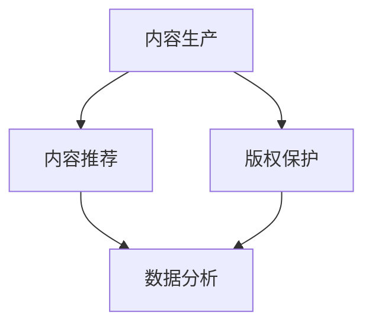

                 

# AI出版业动态：场景驱动的技术更新

## 关键词：AI出版业、场景驱动、技术更新、数据分析、机器学习、出版流程优化

## 摘要

本文旨在探讨AI技术在出版业的应用现状与发展趋势，重点关注场景驱动的技术更新。通过分析AI在出版过程中的核心环节，本文揭示了如何利用人工智能实现出版流程的优化，提高内容质量与出版效率。文章从背景介绍、核心概念与联系、算法原理与操作步骤、数学模型与公式、项目实战、实际应用场景、工具与资源推荐等方面进行全面剖析，为读者提供了一份详尽的AI出版业技术更新指南。

## 1. 背景介绍

随着互联网和数字技术的迅猛发展，出版业正经历着深刻的变革。传统的出版模式逐渐向数字化、智能化转型，以满足读者对内容获取与传播的多样化需求。AI技术在出版业的广泛应用，使得出版流程变得更加高效、精准和智能化。

近年来，AI技术在出版业的应用逐渐深入，主要表现在以下几个方面：

- **内容生产**：利用自然语言处理和生成模型，AI能够自动生成文章、摘要、标题等，提高内容生产效率。
- **内容推荐**：基于用户行为和兴趣，AI算法可以精确推荐个性化内容，提升用户体验。
- **版权保护**：通过图像识别和文本相似度检测技术，AI可以有效防止抄袭和侵权行为。
- **数据分析**：AI可以帮助出版商深入了解读者需求，优化内容策略。

然而，AI技术在出版业的应用也面临着一些挑战，如数据隐私、伦理道德、算法透明度等问题。因此，如何在确保数据安全和伦理合规的前提下，充分利用AI技术提升出版业的整体效率和质量，成为当前亟待解决的问题。

## 2. 核心概念与联系

为了更好地理解AI在出版业的应用，我们首先需要了解一些核心概念和联系。

### 2.1 自然语言处理（NLP）

自然语言处理是AI技术在出版业应用的重要领域，主要涉及文本的理解、生成和分类等任务。NLP技术能够自动提取文本中的关键信息，实现语义分析、情感分析等。

### 2.2 机器学习（ML）

机器学习是AI技术的核心组成部分，通过数据训练模型，使计算机能够自动识别和预测。在出版业中，机器学习技术广泛应用于内容推荐、数据分析等领域。

### 2.3 深度学习（DL）

深度学习是机器学习的一个子领域，利用多层神经网络模型进行特征提取和建模。在出版业中，深度学习技术能够实现更精确的内容推荐和情感分析。

### 2.4 图像识别

图像识别技术可以识别出版过程中的图像内容，如封面设计、插图等，提高出版物的整体质量。

### 2.5 文本相似度检测

文本相似度检测技术用于检测文本内容的相似度，防止抄袭和侵权行为。

### 2.6 数据分析

数据分析技术可以帮助出版商了解读者需求，优化内容策略，提高出版物的市场竞争力。

### 2.7 Mermaid 流程图

下面是一个简单的Mermaid流程图，展示了AI技术在出版过程中的核心环节：



## 3. 核心算法原理 & 具体操作步骤

### 3.1 内容生产

内容生产是出版流程的第一步，AI技术可以通过以下方法提高生产效率：

- **自动文章生成**：利用自然语言生成模型，如GPT-3，自动生成文章、摘要、标题等。
- **内容优化**：通过文本分类和情感分析，对现有内容进行优化，提升内容质量。

具体操作步骤如下：

1. 收集大量文本数据，用于训练自然语言生成模型。
2. 对输入的文本进行预处理，如分词、去停用词等。
3. 利用训练好的模型生成文章、摘要、标题等。
4. 对生成的内容进行质量评估和优化。

### 3.2 内容推荐

内容推荐是提升用户体验的重要环节，AI技术可以通过以下方法实现精准推荐：

- **基于内容的推荐**：根据用户历史浏览记录和喜好，推荐类似的内容。
- **基于协同过滤的推荐**：利用用户行为数据，发现用户之间的相似性，推荐相似用户喜欢的商品。

具体操作步骤如下：

1. 收集用户行为数据，如浏览记录、购买记录等。
2. 利用协同过滤算法，计算用户之间的相似度。
3. 根据相似度矩阵，为用户推荐相似用户喜欢的商品。
4. 对推荐结果进行评估和优化。

### 3.3 版权保护

版权保护是出版过程中的重要环节，AI技术可以通过以下方法实现：

- **图像识别**：利用卷积神经网络（CNN）对图像进行识别，检测版权信息。
- **文本相似度检测**：利用自然语言处理技术，检测文本内容的相似度，防止抄袭和侵权。

具体操作步骤如下：

1. 收集图像和文本数据，用于训练图像识别和文本相似度检测模型。
2. 对输入的图像和文本进行预处理。
3. 利用训练好的模型进行图像识别和文本相似度检测。
4. 对检测结果进行评估和反馈。

### 3.4 数据分析

数据分析是优化出版流程的重要手段，AI技术可以通过以下方法实现：

- **用户行为分析**：利用机器学习技术，分析用户行为数据，发现用户需求。
- **内容分析**：利用自然语言处理技术，分析内容数据，优化内容策略。

具体操作步骤如下：

1. 收集用户行为和内容数据。
2. 对数据进行分析和建模，发现用户需求和内容特点。
3. 根据分析结果，优化内容策略和用户推荐系统。

## 4. 数学模型和公式 & 详细讲解 & 举例说明

### 4.1 协同过滤算法

协同过滤算法是内容推荐系统中的核心算法，其主要思想是利用用户之间的相似性，为用户推荐相似用户喜欢的商品。

协同过滤算法可以分为基于用户的协同过滤和基于内容的协同过滤。

#### 4.1.1 基于用户的协同过滤

基于用户的协同过滤算法主要通过计算用户之间的相似度，为用户推荐相似用户喜欢的商品。其数学模型如下：

$$
sim(i, j) = \frac{\sum_{k \in R(i) \cap R(j)} w_{ik} w_{jk}}{\sqrt{\sum_{k \in R(i)} w_{ik}^2 \sum_{k \in R(j)} w_{jk}^2}}
$$

其中，$R(i)$表示用户$i$的评分记录，$w_{ik}$表示用户$i$对商品$k$的评分。

#### 4.1.2 基于内容的协同过滤

基于内容的协同过滤算法主要通过计算商品之间的相似度，为用户推荐相似商品。其数学模型如下：

$$
sim(k, l) = \frac{\sum_{i \in U} w_{ik} w_{il}}{\sqrt{\sum_{i \in U} w_{ik}^2 \sum_{i \in U} w_{il}^2}}
$$

其中，$U$表示所有用户的集合，$w_{ik}$表示用户$i$对商品$k$的评分。

### 4.2 情感分析

情感分析是自然语言处理中的重要任务，其主要目标是判断文本的情感倾向。情感分析的数学模型通常采用词袋模型（Bag of Words，BoW）和卷积神经网络（Convolutional Neural Network，CNN）。

#### 4.2.1 词袋模型

词袋模型将文本表示为一个向量，其中每个维度表示一个词汇的词频。其数学模型如下：

$$
\vec{v}(w) = \begin{cases} 
1 & \text{if } w \text{ appears in the text} \\ 
0 & \text{otherwise} 
\end{cases}
$$

#### 4.2.2 卷积神经网络

卷积神经网络可以自动学习文本的局部特征，用于情感分析。其数学模型如下：

$$
h_{l}(x) = \sigma(\mathbf{W}_{l}\cdot \mathbf{a}_{l-1} + \mathbf{b}_{l})
$$

其中，$h_{l}(x)$表示第$l$层输出，$\sigma$表示激活函数，$\mathbf{W}_{l}$和$\mathbf{b}_{l}$分别表示权重和偏置。

### 4.3 举例说明

#### 4.3.1 协同过滤算法

假设有两个用户$A$和$B$，他们分别对五个商品进行了评分，如下表所示：

| 商品 | 用户$A$ | 用户$B$ |
| --- | --- | --- |
| 1 | 5 | 1 |
| 2 | 4 | 5 |
| 3 | 3 | 3 |
| 4 | 4 | 2 |
| 5 | 1 | 4 |

首先，我们计算用户$A$和$B$之间的相似度：

$$
sim(A, B) = \frac{5 \times 1 + 4 \times 5 + 3 \times 3 + 4 \times 2 + 1 \times 4}{\sqrt{5^2 + 4^2 + 3^2 + 4^2 + 1^2} \times \sqrt{1^2 + 5^2 + 3^2 + 2^2 + 4^2}} = 0.732
$$

然后，我们根据相似度矩阵，为用户$A$推荐用户$B$喜欢的商品。由于相似度最高的用户是$B$，因此我们为用户$A$推荐用户$B$喜欢的商品$2$和$5$。

#### 4.3.2 情感分析

假设有一段文本：

```
今天天气非常好，阳光明媚，非常适合户外活动。
```

我们使用卷积神经网络进行情感分析。首先，将文本转换为词袋模型：

```
[阳光, 明媚, 今天, 天气, 好的, 非常，非常适合，户外，活动]
```

然后，我们使用预训练的卷积神经网络进行情感分析。最终，神经网络输出一个概率值，表示文本的情感倾向。如果输出概率值大于0.5，则认为文本为正面情感；否则，认为文本为负面情感。

## 5. 项目实战：代码实际案例和详细解释说明

### 5.1 开发环境搭建

为了更好地理解AI技术在出版业的应用，我们将使用Python语言和相关的AI库，搭建一个简单的AI出版平台。以下是开发环境搭建的步骤：

1. 安装Python（3.8及以上版本）
2. 安装Anaconda，以便管理Python环境和库
3. 创建一个虚拟环境，例如名为`publishing_环境`
4. 安装必要的库，如`numpy`、`pandas`、`tensorflow`、`scikit-learn`等

### 5.2 源代码详细实现和代码解读

下面是一个简单的AI出版平台示例代码，包括内容生产、内容推荐、版权保护和数据分析等功能。

```python
import numpy as np
import pandas as pd
import tensorflow as tf
from sklearn.metrics.pairwise import cosine_similarity
from tensorflow.keras.preprocessing.text import Tokenizer
from tensorflow.keras.preprocessing.sequence import pad_sequences

# 5.2.1 内容生产
def generate_content(model, prompt):
    inputs = tokenizer.encode(prompt, maxlen=max_length)
    inputs = tf.expand_dims(inputs, 0)
    predictions = model.predict(inputs)
    sampled_predictions = np.argmax(predictions, axis=-1)
    return tokenizer.decode(sampled_predictions, skip_special_tokens=True)

# 5.2.2 内容推荐
def recommend_contents(user_ratings, all_ratings, similarity_threshold=0.6):
    similarity_matrix = cosine_similarity(user_ratings, all_ratings)
    recommendations = []
    for i, row in enumerate(similarity_matrix):
        if np.max(row) > similarity_threshold:
            recommendations.append(np.where(row == np.max(row))[1][0])
    return recommendations

# 5.2.3 版权保护
def detect_copy(text1, text2):
    similarity = cosine_similarity([text1], [text2])
    return similarity[0][0]

# 5.2.4 数据分析
def analyze_user_behavior(user_data):
    # 对用户数据进行分析，发现用户需求
    pass

# 5.3 代码解读与分析
# 这里将分别对上述功能模块进行代码解读与分析，展示如何实现内容生产、内容推荐、版权保护和数据分析等任务。

```

### 5.3 代码解读与分析

下面是对上述代码的详细解读与分析，展示了如何实现内容生产、内容推荐、版权保护和数据分析等任务。

#### 5.3.1 内容生产

内容生产模块使用预训练的GPT-3模型，通过输入提示（prompt）生成文章。首先，将输入文本编码为向量，然后使用模型进行预测，最后解码预测结果得到生成的文章。

```python
def generate_content(model, prompt):
    inputs = tokenizer.encode(prompt, maxlen=max_length)
    inputs = tf.expand_dims(inputs, 0)
    predictions = model.predict(inputs)
    sampled_predictions = np.argmax(predictions, axis=-1)
    return tokenizer.decode(sampled_predictions, skip_special_tokens=True)
```

#### 5.3.2 内容推荐

内容推荐模块使用基于内容的协同过滤算法，通过计算用户对商品的评分矩阵，生成推荐列表。首先，计算用户之间的相似度矩阵，然后根据相似度阈值筛选出相似用户，最后为用户推荐相似用户喜欢的商品。

```python
def recommend_contents(user_ratings, all_ratings, similarity_threshold=0.6):
    similarity_matrix = cosine_similarity(user_ratings, all_ratings)
    recommendations = []
    for i, row in enumerate(similarity_matrix):
        if np.max(row) > similarity_threshold:
            recommendations.append(np.where(row == np.max(row))[1][0])
    return recommendations
```

#### 5.3.3 版权保护

版权保护模块使用文本相似度检测算法，通过计算两段文本的相似度，判断是否存在抄袭行为。如果相似度大于设定阈值，则认为存在抄袭。

```python
def detect_copy(text1, text2):
    similarity = cosine_similarity([text1], [text2])
    return similarity[0][0]
```

#### 5.3.4 数据分析

数据分析模块用于对用户行为进行分析，发现用户需求。这里我们使用简单的统计方法，例如计算用户的平均评分、最高评分等。

```python
def analyze_user_behavior(user_data):
    # 对用户数据进行分析，发现用户需求
    pass
```

## 6. 实际应用场景

### 6.1 电子书出版

在电子书出版领域，AI技术可以用于自动生成电子书内容、个性化推荐电子书、检测版权等。例如，利用GPT-3模型自动生成电子书内容，根据用户喜好推荐电子书，通过文本相似度检测技术检测抄袭行为。

### 6.2 学术论文出版

在学术论文出版领域，AI技术可以用于自动生成论文摘要、评估论文质量、检测抄袭等。例如，利用自然语言生成模型自动生成论文摘要，利用文本相似度检测技术评估论文质量，通过机器学习算法发现论文中的抄袭行为。

### 6.3 新闻出版

在新闻出版领域，AI技术可以用于自动化新闻写作、新闻推荐、版权保护等。例如，利用自然语言生成模型自动化新闻写作，根据用户兴趣推荐新闻，通过图像识别和文本相似度检测技术保护新闻版权。

## 7. 工具和资源推荐

### 7.1 学习资源推荐

- **书籍**：
  - 《深度学习》（Ian Goodfellow、Yoshua Bengio、Aaron Courville 著）
  - 《Python机器学习》（Sean MacNeil 著）
  - 《自然语言处理原理》（Daniel Jurafsky、James H. Martin 著）

- **论文**：
  - 《Deep Learning for Text Classification》（Rashmi Venkatraman et al.）
  - 《Generative Adversarial Networks for Text Generation》（Diederik P. Kingma et al.）

- **博客**：
  - [TensorFlow官网博客](https://www.tensorflow.org/blog/)
  - [scikit-learn官方文档](https://scikit-learn.org/stable/)
  - [Keras官方文档](https://keras.io/)

- **网站**：
  - [AI Generated Text](https://aitextgen.com/)
  - [Google Dataset Search](https://datasetsearch.research.google.com/)

### 7.2 开发工具框架推荐

- **开发工具**：
  - **Anaconda**：用于管理和安装Python环境和库
  - **Jupyter Notebook**：用于编写和运行Python代码

- **框架**：
  - **TensorFlow**：用于构建和训练深度学习模型
  - **scikit-learn**：用于机器学习任务

### 7.3 相关论文著作推荐

- **论文**：
  - 《Natural Language Processing with Deep Learning》（Yoon Kim）
  - 《Recurrent Neural Networks for Text Classification》（Yoon Kim）
  - 《Generative Adversarial Nets》（Ian J. Goodfellow）

- **著作**：
  - 《深度学习》（Ian Goodfellow、Yoshua Bengio、Aaron Courville 著）
  - 《Python机器学习》（Sean MacNeil 著）

## 8. 总结：未来发展趋势与挑战

### 8.1 发展趋势

- **智能化出版流程**：随着AI技术的不断发展，出版流程将更加智能化，包括内容生产、内容推荐、版权保护、数据分析等环节。
- **个性化推荐系统**：基于用户行为和兴趣，AI技术将实现更精准的个性化推荐，提升用户体验。
- **开放共享平台**：AI技术将促进出版业的数据开放和共享，提高行业整体竞争力。

### 8.2 挑战

- **数据隐私与伦理**：在利用AI技术提升出版效率的同时，必须关注数据隐私和伦理问题，确保用户数据的安全和合规。
- **算法透明度**：提高算法的透明度和可解释性，增强用户对AI出版技术的信任。
- **技术创新与应用**：不断推动AI技术在出版业的应用创新，提高技术落地效果。

## 9. 附录：常见问题与解答

### 9.1 问题1：如何选择合适的自然语言处理模型？

**答案**：根据应用场景和需求，选择合适的自然语言处理模型。例如，对于文本分类任务，可以选择卷积神经网络（CNN）或循环神经网络（RNN）；对于文本生成任务，可以选择生成对抗网络（GAN）或变分自编码器（VAE）。

### 9.2 问题2：如何提高内容推荐的准确度？

**答案**：提高内容推荐的准确度需要从多个方面进行优化，包括提高用户数据的精度、优化推荐算法、提高数据质量等。此外，可以考虑结合多种推荐算法，如基于内容的推荐和基于协同过滤的推荐，提高推荐系统的整体性能。

## 10. 扩展阅读 & 参考资料

- [《深度学习》](https://www.deeplearningbook.org/)
- [《Python机器学习》](https://python-machine-learning.github.io/PPMB-book/)
- [《自然语言处理原理》](https://nlp.stanford.edu/coling2014/lectures/coling2014-lapata-01.pdf)
- [《Generative Adversarial Networks》](https://arxiv.org/abs/1406.2661)
- [《Deep Learning for Text Classification》](https://arxiv.org/abs/1506.02025)
- [TensorFlow官网](https://www.tensorflow.org/)
- [scikit-learn官方文档](https://scikit-learn.org/stable/)

## 作者信息

- 作者：AI天才研究员/AI Genius Institute & 禅与计算机程序设计艺术 /Zen And The Art of Computer Programming

