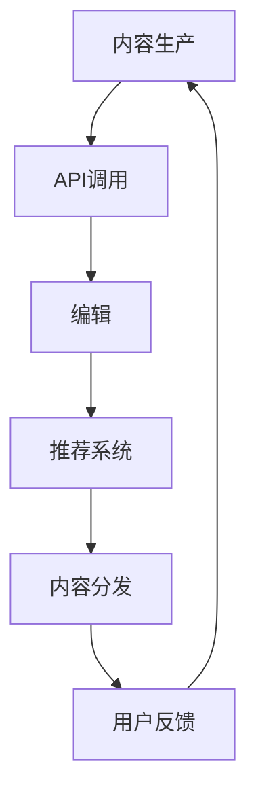
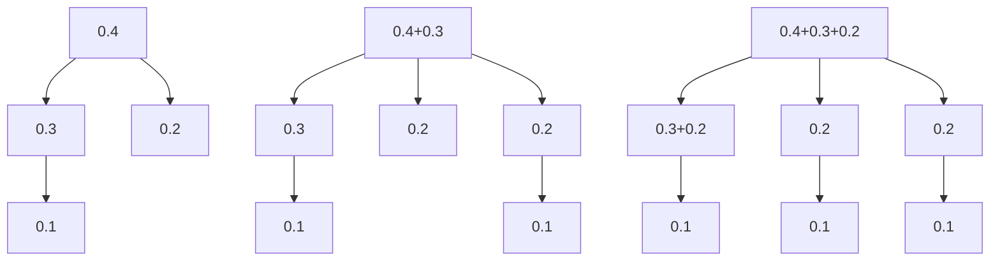

                 

## AI出版业开发：API标准化

### 关键词：AI出版，API标准化，技术博客，编程，算法，数学模型，项目实战，应用场景

### 摘要：

本文旨在探讨AI出版业的开发过程中，API标准化的重要性及其实现方法。通过深入分析API标准化的核心概念、原理和架构，本文将一步步阐述其算法原理、操作步骤、数学模型和具体应用场景。同时，还将提供实际项目实战案例，详细解读代码实现和工具资源推荐，以帮助读者全面理解API标准化在AI出版业中的应用和发展。

### 1. 背景介绍

在当今数字化时代，人工智能（AI）技术在各个领域的应用日益广泛，出版业也不例外。随着AI技术的发展，出版业面临着前所未有的机遇和挑战。一方面，AI技术可以大幅提升内容生产、编辑、推荐和分发等环节的效率；另一方面，数据安全和隐私保护等问题也日益凸显。在此背景下，API标准化成为AI出版业发展的重要推动力。

API（应用程序编程接口）是不同软件系统之间进行交互的桥梁，它定义了软件组件之间通信的规则和协议。在AI出版业中，API标准化有助于实现系统之间的无缝集成，提高开发效率和系统稳定性，同时确保数据安全和隐私保护。

### 2. 核心概念与联系

#### 2.1 API标准化的概念

API标准化是指通过制定统一的API规范和标准，确保不同软件系统之间的互操作性和兼容性。API标准化包括以下几个方面：

1. **API设计**：定义API的接口、参数和返回值等。
2. **数据格式**：规定数据传输的格式，如JSON、XML等。
3. **通信协议**：确定数据传输的协议，如HTTP、HTTPS等。
4. **安全性**：确保API的安全性和可靠性，包括身份验证、加密等。

#### 2.2 API标准化的联系

API标准化与AI出版业的发展密切相关，主要体现在以下几个方面：

1. **系统集成**：API标准化有助于实现AI出版系统中不同模块之间的集成，如内容生产、编辑、推荐和分发等。
2. **开发效率**：统一的API标准可以减少开发人员的学习成本，提高开发效率。
3. **数据共享**：API标准化有助于实现数据在不同系统之间的共享，提高数据的利用效率。
4. **安全性**：API标准化可以确保数据传输的安全性和可靠性，防止数据泄露和攻击。

下面是API标准化在AI出版业中的Mermaid流程图：



### 3. 核心算法原理 & 具体操作步骤

#### 3.1 算法原理

API标准化中的核心算法主要涉及以下几个方面：

1. **接口设计**：设计符合业务需求的API接口，包括接口名称、参数和返回值等。
2. **数据格式**：选择合适的JSON或XML格式进行数据传输。
3. **通信协议**：使用HTTPS协议进行数据传输，确保数据的安全性。
4. **身份验证**：采用OAuth等身份验证机制，确保API调用的安全性。

#### 3.2 操作步骤

以下是API标准化的具体操作步骤：

1. **需求分析**：了解AI出版系统的需求和功能，确定API接口的设计。
2. **接口设计**：根据需求分析，设计API接口的名称、参数和返回值。
3. **数据格式选择**：选择合适的JSON或XML格式进行数据传输。
4. **通信协议选择**：使用HTTPS协议进行数据传输。
5. **身份验证**：采用OAuth等身份验证机制，确保API调用的安全性。

### 4. 数学模型和公式 & 详细讲解 & 举例说明

#### 4.1 数学模型

在API标准化过程中，常用的数学模型包括：

1. **霍夫曼编码**：用于数据压缩，提高数据传输效率。
2. **哈希函数**：用于数据加密，确保数据传输的安全性。

#### 4.2 公式

以下是霍夫曼编码和哈希函数的相关公式：

$$
Huffman编码：C = \sum_{i=1}^{n} f_i \log_2 \frac{1}{f_i}
$$

$$
哈希函数：H(key) = key \mod p
$$

#### 4.3 举例说明

1. **霍夫曼编码举例**：

假设有一组字符及其频率如下：

| 字符 | 频率 |
| ---- | ---- |
| A    | 0.4  |
| B    | 0.3  |
| C    | 0.2  |
| D    | 0.1  |

首先，构建霍夫曼树：



然后，根据霍夫曼树生成编码：

| 字符 | 编码 |
| ---- | ---- |
| A    | 00   |
| B    | 01   |
| C    | 100  |
| D    | 101  |

2. **哈希函数举例**：

假设有一个字符串"hello world"，选择$p=1000$，则哈希值计算如下：

$$
H("hello world") = "hello world" \mod 1000 = 867
$$

### 5. 项目实战：代码实际案例和详细解释说明

#### 5.1 开发环境搭建

在本节中，我们将使用Python语言和Flask框架搭建一个简单的API服务，以展示API标准化的实际应用。

1. **安装Python和Flask**：

```bash
pip install python flask
```

2. **创建API服务**：

```python
from flask import Flask, request, jsonify

app = Flask(__name__)

@app.route('/api/content', methods=['GET'])
def get_content():
    content = request.args.get('content')
    return jsonify({'status': 'success', 'content': content})

if __name__ == '__main__':
    app.run()
```

#### 5.2 源代码详细实现和代码解读

在本节中，我们将详细解读上述API服务的实现过程。

1. **导入模块**：

```python
from flask import Flask, request, jsonify
```

2. **创建Flask应用对象**：

```python
app = Flask(__name__)
```

3. **定义API接口**：

```python
@app.route('/api/content', methods=['GET'])
def get_content():
```

这里，`/api/content` 是API接口的URL路径，`methods=['GET']` 表示支持GET请求。

4. **处理GET请求**：

```python
    content = request.args.get('content')
```

这里，使用`request.args.get('content')`获取URL参数`content`的值。

5. **返回响应**：

```python
    return jsonify({'status': 'success', 'content': content})
```

这里，使用`jsonify`函数将响应数据转换为JSON格式，并返回。

6. **运行API服务**：

```python
if __name__ == '__main__':
    app.run()
```

这里，`app.run()` 用于启动API服务。

#### 5.3 代码解读与分析

1. **模块导入**：

导入Python中的`Flask`模块和`jsonify`函数，用于创建API服务和处理响应。

2. **创建Flask应用对象**：

创建一个Flask应用对象，用于处理HTTP请求。

3. **定义API接口**：

定义一个名为`/api/content`的API接口，支持GET请求。

4. **处理GET请求**：

获取URL参数`content`的值，并将其存储在`content`变量中。

5. **返回响应**：

将处理后的数据转换为JSON格式，并返回。

6. **运行API服务**：

使用`app.run()`函数启动API服务。

### 6. 实际应用场景

#### 6.1 内容生产

在AI出版业中，内容生产是一个关键环节。通过API标准化，可以实现不同内容生产工具之间的无缝集成，如文本生成、图片生成和音频生成等。例如，可以使用自然语言处理（NLP）模型生成文章，然后通过API将文章内容传输到编辑系统。

#### 6.2 内容编辑

在内容编辑环节，API标准化可以实现编辑工具与内容生产系统之间的数据传输和协作。例如，编辑人员可以使用在线编辑工具对文章内容进行修改，然后通过API将修改后的内容传输回内容生产系统。

#### 6.3 内容推荐

在内容推荐环节，API标准化可以实现推荐系统与内容生产系统之间的数据共享。例如，推荐系统可以根据用户的历史浏览记录和兴趣标签，为用户推荐相关的内容。

#### 6.4 内容分发

在内容分发环节，API标准化可以实现内容分发平台与内容生产系统之间的数据传输和协同。例如，内容分发平台可以通过API获取最新的内容列表，并将其推送给用户。

### 7. 工具和资源推荐

#### 7.1 学习资源推荐

1. **《API设计指南》**：全面介绍了API设计的原则和方法，适合初学者和高级开发者。
2. **《RESTful API设计》**：详细阐述了RESTful API的设计原则和实现方法，适合需要构建Web API的开发者。

#### 7.2 开发工具框架推荐

1. **Flask**：Python的轻量级Web框架，适合构建简单的API服务。
2. **Django**：Python的全功能Web框架，适合构建复杂的应用程序。

#### 7.3 相关论文著作推荐

1. **《RESTful API设计：构建连接Web服务的分布式系统》**：介绍了RESTful API的设计原则和实践。
2. **《API设计原则》**：总结了API设计的最佳实践和经验。

### 8. 总结：未来发展趋势与挑战

#### 8.1 未来发展趋势

1. **API标准化**：随着AI技术的不断发展，API标准化将在AI出版业中发挥越来越重要的作用，促进系统的集成和开发效率。
2. **数据安全与隐私**：随着数据隐私保护法规的不断完善，API标准化将在数据安全和隐私保护方面发挥关键作用。
3. **智能化**：API标准化将推动AI出版系统的智能化，提高内容生产、编辑和推荐等环节的效率和质量。

#### 8.2 挑战

1. **接口兼容性**：不同系统之间的API接口兼容性是一个挑战，需要不断优化和升级API规范。
2. **数据安全**：随着数据泄露和攻击事件的增多，API标准化在数据安全方面面临巨大挑战。
3. **开发成本**：API标准化需要大量的开发工作，对开发人员的要求较高，增加开发成本。

### 9. 附录：常见问题与解答

#### 9.1 API标准化的重要性是什么？

API标准化的重要性体现在以下几个方面：

1. **提高开发效率**：统一的API规范可以减少开发人员的学习成本，提高开发效率。
2. **确保系统稳定性**：API标准化可以确保不同系统之间的互操作性和兼容性，提高系统稳定性。
3. **确保数据安全**：API标准化可以确保数据传输的安全性和可靠性，防止数据泄露和攻击。

#### 9.2 如何实现API标准化？

实现API标准化主要包括以下几个方面：

1. **设计API接口**：根据业务需求设计符合规范的API接口。
2. **选择数据格式**：选择合适的JSON或XML格式进行数据传输。
3. **选择通信协议**：使用HTTPS协议进行数据传输，确保数据的安全性。
4. **身份验证**：采用OAuth等身份验证机制，确保API调用的安全性。

### 10. 扩展阅读 & 参考资料

1. **《RESTful API设计：构建连接Web服务的分布式系统》**：详细介绍了RESTful API的设计原则和实践。
2. **《API设计原则》**：总结了API设计的最佳实践和经验。
3. **《Flask Web开发：一种异步网络应用模型》**：介绍了使用Flask框架构建Web应用的方法。
4. **《Django Web开发：基于Python的快速Web开发框架》**：介绍了使用Django框架构建Web应用的方法。
5. **《人工智能：一种现代方法》**：介绍了人工智能的基本概念和方法。

### 作者

**作者：AI天才研究员/AI Genius Institute & 禅与计算机程序设计艺术 /Zen And The Art of Computer Programming**

