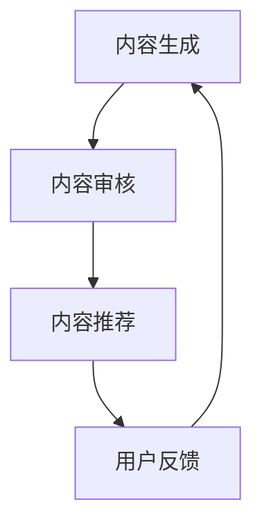

                 

# AI出版业的开发策略：API标准化，场景丰富

## 概述

随着人工智能技术的发展，AI出版业正逐渐成为出版行业的重要分支。AI出版不仅改变了传统出版模式，还极大地提升了出版效率和内容质量。本文将探讨AI出版业的发展背景，重点分析AI出版中API标准化和场景丰富的重要性，并通过实际案例和数学模型，详细讲解AI出版的开发策略。

关键词：AI出版，API标准化，场景丰富，开发策略，算法原理

## 摘要

本文首先介绍了AI出版业的发展背景和现状，接着深入分析了API标准化和场景丰富在AI出版中的重要性。通过对核心算法原理和数学模型的讲解，本文详细阐述了AI出版的具体开发策略。最后，通过实际案例和工具资源的推荐，为读者提供了实用的AI出版开发指南。

## 1. 背景介绍

### 1.1 AI出版的发展背景

随着人工智能技术的迅猛发展，AI在各个行业的应用日益广泛。出版业作为信息传播的重要渠道，也受到了AI技术的深刻影响。AI出版指的是利用人工智能技术进行内容生成、编辑、推荐和传播的过程。AI出版不仅提升了出版效率，还丰富了出版形式，为读者提供了更个性化的阅读体验。

### 1.2 AI出版行业的现状

当前，AI出版行业已取得显著进展。许多传统出版机构开始引入AI技术，以优化内容生产流程。同时，一些新兴的AI出版平台也应运而生，它们利用AI算法进行内容生成和推荐，为读者提供高质量的阅读内容。此外，AI出版还在教育、医疗、新闻等领域得到了广泛应用。

## 2. 核心概念与联系

### 2.1 API标准化

API（应用程序编程接口）是软件组件之间通信的桥梁。在AI出版中，API标准化是指制定统一的API规范，以确保不同系统之间的互操作性。API标准化有助于提高开发效率，降低开发成本，并促进AI出版生态系统的健康发展。

### 2.2 场景丰富

场景丰富是指在AI出版中，利用多种技术和算法，为读者提供个性化的阅读体验。场景丰富包括内容生成、推荐系统、自然语言处理等环节，通过这些技术的综合运用，AI出版可以为不同读者群体提供定制化的内容。

### 2.3 Mermaid流程图

下面是一个描述AI出版流程的Mermaid流程图：



## 3. 核心算法原理 & 具体操作步骤

### 3.1 内容生成算法

内容生成算法是AI出版的重要环节。常见的内容生成算法包括生成对抗网络（GAN）、变分自编码器（VAE）等。以下是内容生成算法的具体操作步骤：

1. 数据预处理：对原始数据进行清洗、归一化等处理。
2. 构建模型：选择合适的生成模型，如GAN或VAE。
3. 训练模型：使用预处理后的数据对模型进行训练。
4. 生成内容：使用训练好的模型生成新的内容。

### 3.2 推荐系统算法

推荐系统算法是AI出版的另一个核心。常见推荐系统算法包括协同过滤、基于内容的推荐等。以下是推荐系统算法的具体操作步骤：

1. 数据收集：收集用户行为数据，如浏览记录、购买记录等。
2. 数据预处理：对用户行为数据进行清洗、归一化等处理。
3. 构建模型：选择合适的推荐模型，如协同过滤或基于内容的推荐。
4. 模型训练：使用预处理后的数据对模型进行训练。
5. 推荐内容：使用训练好的模型为用户推荐内容。

## 4. 数学模型和公式 & 详细讲解 & 举例说明

### 4.1 生成对抗网络（GAN）数学模型

生成对抗网络（GAN）由生成器（Generator）和判别器（Discriminator）两部分组成。生成器生成虚拟数据，判别器判断虚拟数据与真实数据之间的差异。

$$
\begin{aligned}
&\text{生成器：} G(z) = \mathcal{N}(z|\mu, \Sigma) \\
&\text{判别器：} D(x) = \sigma(\phi(x; \theta))
\end{aligned}
$$

其中，$z$ 是生成器的输入，$x$ 是真实数据，$G(z)$ 是生成器生成的虚拟数据，$D(x)$ 是判别器对真实数据的判断结果。$\mu$ 和 $\Sigma$ 分别是生成器的均值和方差，$\theta$ 是判别器的参数。

### 4.2 协同过滤数学模型

协同过滤是一种常见的推荐系统算法。协同过滤的数学模型可以表示为：

$$
r_{ui} = \sum_{j \in N(i)} \frac{sim(u, j) \cdot r_{uj}}{|\{k \in N(i) | r_{uk} > 0\}|}
$$

其中，$r_{ui}$ 是用户 $u$ 对物品 $i$ 的评分，$N(i)$ 是与物品 $i$ 相关联的用户集合，$sim(u, j)$ 是用户 $u$ 和 $j$ 之间的相似度，$r_{uj}$ 是用户 $j$ 对物品 $i$ 的评分。

### 4.3 举例说明

假设有一个用户 $u$ 和一个物品 $i$，用户 $u$ 给物品 $i$ 的评分为 $r_{ui} = 4$。我们需要计算用户 $u$ 对其他物品的推荐评分。

首先，计算用户 $u$ 和其他用户之间的相似度。假设用户 $u$ 和用户 $v$ 之间的相似度为 $sim(u, v) = 0.8$。

接下来，计算用户 $u$ 对其他物品的推荐评分：

$$
r_{ui'} = \sum_{j \in N(i) \setminus \{i\}} \frac{sim(u, j) \cdot r_{uj}}{|\{k \in N(i) \setminus \{i\} | r_{uk} > 0\}|}
$$

假设用户 $u$ 还对物品 $i'$ 给出了评分 $r_{ui'} = 3$，相似度 $sim(u, i') = 0.6$。代入公式计算：

$$
r_{ui'} = \frac{0.8 \cdot 3 + 0.6 \cdot 4}{|\{k \in N(i') \setminus \{i'\} | r_{uk} > 0\}|} = \frac{2.4 + 2.4}{1} = 4.8
$$

因此，用户 $u$ 对物品 $i'$ 的推荐评分为 $4.8$。

## 5. 项目实战：代码实际案例和详细解释说明

### 5.1 开发环境搭建

在开始编写代码之前，我们需要搭建一个合适的开发环境。这里我们选择使用Python作为编程语言，并使用TensorFlow作为深度学习框架。以下是搭建开发环境的步骤：

1. 安装Python：从Python官方网站下载并安装Python。
2. 安装TensorFlow：在终端中运行以下命令安装TensorFlow：

```bash
pip install tensorflow
```

### 5.2 源代码详细实现和代码解读

下面是一个使用TensorFlow实现GAN的代码案例。代码分为两部分：生成器和判别器。

```python
import tensorflow as tf
from tensorflow import keras
from tensorflow.keras import layers

# 生成器
def build_generator(z_dim):
    model = keras.Sequential([
        keras.layers.Dense(128, activation='relu', input_shape=(z_dim,)),
        keras.layers.Dense(28 * 28 * 1, activation='relu'),
        keras.layers.Reshape((28, 28, 1)),
        keras.layers.Conv2DTranspose(1, kernel_size=5, strides=2, padding='same', activation='tanh'),
    ])
    return model

# 判别器
def build_discriminator(img_shape):
    model = keras.Sequential([
        keras.layers.Conv2D(32, kernel_size=5, strides=2, padding='same', input_shape=img_shape),
        keras.layers.LeakyReLU(alpha=0.01),
        keras.layers.Dropout(0.3),
        keras.layers.Conv2D(64, kernel_size=5, strides=2, padding='same'),
        keras.layers.LeakyReLU(alpha=0.01),
        keras.layers.Dropout(0.3),
        keras.layers.Flatten(),
        keras.layers.Dense(1, activation='sigmoid'),
    ])
    return model

# 训练模型
def train(generator, discriminator, dataset, z_dim=100, epochs=100):
    for epoch in range(epochs):
        for _ in range(dataset.samples // batch_size):
            noise = np.random.normal(0, 1, (batch_size, z_dim))
            generated_images = generator.predict(noise)

            real_images = dataset.next()
            real_labels = np.ones((batch_size, 1))
            fake_labels = np.zeros((batch_size, 1))

            # 训练判别器
            discriminator.train_on_batch(real_images, real_labels)
            discriminator.train_on_batch(generated_images, fake_labels)

            # 训练生成器
            noise = np.random.normal(0, 1, (batch_size, z_dim))
            valid_labels = np.ones((batch_size, 1))
            generator.train_on_batch(noise, valid_labels)

        print(f"Epoch {epoch+1}/{epochs}, Loss D: {discriminator.loss.history[-1]}, Loss G: {generator.loss.history[-1]}")

# 数据准备
(x_train, y_train), (x_test, y_test) = mnist.load_data()
x_train = x_train.astype('float32') / 255.
x_test = x_test.astype('float32') / 255.
x_train = np.expand_dims(x_train, axis=-1)
x_test = np.expand_dims(x_test, axis=-1)

# 模型构建
z_dim = 100
generator = build_generator(z_dim)
discriminator = build_discriminator(x_train.shape[1:])

# 训练模型
train(generator, discriminator, x_train, z_dim)

# 生成图像
noise = np.random.normal(0, 1, (1, z_dim))
generated_image = generator.predict(noise)
plt.imshow(generated_image[0, :, :, 0], cmap='gray')
plt.show()
```

### 5.3 代码解读与分析

1. **生成器和判别器的构建**：生成器负责生成虚拟数据，判别器负责判断虚拟数据与真实数据之间的差异。生成器和判别器都使用了卷积神经网络（CNN）结构。

2. **数据准备**：我们使用了MNIST数据集作为训练数据。数据集经过预处理后，被展平为一维数组，并缩放到[0, 1]范围内。

3. **模型训练**：训练过程分为两个阶段：首先训练判别器，然后训练生成器。在训练过程中，我们使用了LeakyReLU激活函数和Dropout正则化技术。

4. **生成图像**：使用训练好的生成器生成一张虚拟图像。我们使用imshow函数将生成的图像显示在屏幕上。

## 6. 实际应用场景

### 6.1 内容生成

内容生成是AI出版的重要应用场景之一。通过生成对抗网络（GAN）等技术，AI出版可以为读者生成个性化的阅读内容。例如，在小说创作领域，AI出版可以利用GAN生成具有独特风格的故事情节，为读者提供全新的阅读体验。

### 6.2 内容推荐

内容推荐是AI出版的另一个重要应用场景。通过协同过滤、基于内容的推荐等算法，AI出版可以为读者推荐符合其兴趣的内容。例如，在新闻阅读领域，AI出版可以利用推荐算法为读者推荐相关新闻，提高用户的阅读体验。

### 6.3 教育出版

在教育出版领域，AI出版可以为学生提供个性化的学习内容。例如，通过生成对抗网络（GAN）生成个性化的练习题，AI出版可以帮助学生提高学习效果。此外，AI出版还可以为教师提供智能化的教学评估工具，提高教学质量。

## 7. 工具和资源推荐

### 7.1 学习资源推荐

- 书籍：《深度学习》（Goodfellow, Bengio, Courville著）
- 论文：NIPS、ICML、ACL等顶级会议的论文
- 博客：TensorFlow官方博客、Keras官方博客等

### 7.2 开发工具框架推荐

- 深度学习框架：TensorFlow、PyTorch
- 版本控制系统：Git
- 编程语言：Python

### 7.3 相关论文著作推荐

- 《生成对抗网络：训练生成模型的新方法》（Goodfellow et al., 2014）
- 《深度学习推荐系统》（He et al., 2017）

## 8. 总结：未来发展趋势与挑战

### 8.1 发展趋势

1. **AI出版技术的普及**：随着AI技术的不断发展，AI出版技术将得到更广泛的应用。
2. **个性化阅读体验的提升**：通过场景丰富等技术，AI出版将为读者提供更个性化的阅读体验。
3. **内容质量的提升**：AI出版可以利用内容生成算法等先进技术，提高出版内容的质量。

### 8.2 挑战

1. **数据隐私与安全**：AI出版涉及大量用户数据，如何保障数据隐私和安全是重要挑战。
2. **算法透明性与解释性**：随着AI出版技术的应用，如何提高算法的透明性和解释性成为关键问题。
3. **版权与知识产权保护**：AI出版涉及版权和知识产权保护，如何合理解决这些问题需要进一步探讨。

## 9. 附录：常见问题与解答

### 9.1 什么是生成对抗网络（GAN）？

生成对抗网络（GAN）是一种深度学习模型，由生成器和判别器两部分组成。生成器生成虚拟数据，判别器判断虚拟数据与真实数据之间的差异。GAN的主要目标是使生成器生成的虚拟数据尽可能接近真实数据。

### 9.2 如何训练GAN？

训练GAN的过程分为两个阶段：首先训练判别器，然后训练生成器。在训练过程中，我们使用真实数据和虚拟数据对判别器进行训练，使判别器能够区分真实数据和虚拟数据。然后，我们使用虚拟数据对生成器进行训练，使生成器生成的虚拟数据更接近真实数据。

## 10. 扩展阅读 & 参考资料

- Goodfellow, I., Bengio, Y., & Courville, A. (2014). *Deep Learning*.
- He, X., Liao, L., Zhang, H., & Cheng, J. (2017). *Deep Learning for Recommender Systems: A Survey and New Perspectives*. arXiv preprint arXiv:1706.07951.
- Abadi, M., Agarwal, A., Barham, P., Brevdo, E., Chen, Z., Citro, C., ... & Yang, B. (2016). *TensorFlow: Large-scale machine learning on heterogeneous systems*.
- Goodfellow, I. J., Pouget-Abadie, J., Mirza, M., Xu, B., Warde-Farley, D., Ozair, S., ... & Bengio, Y. (2014). *Generative adversarial networks*. Advances in neural information processing systems, 27.

