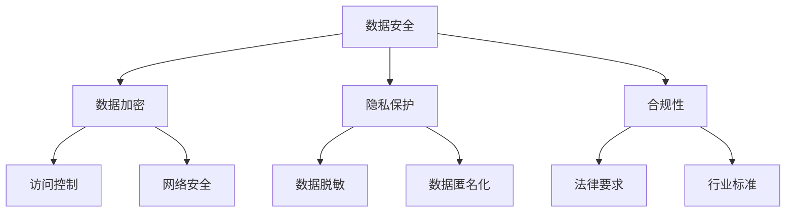
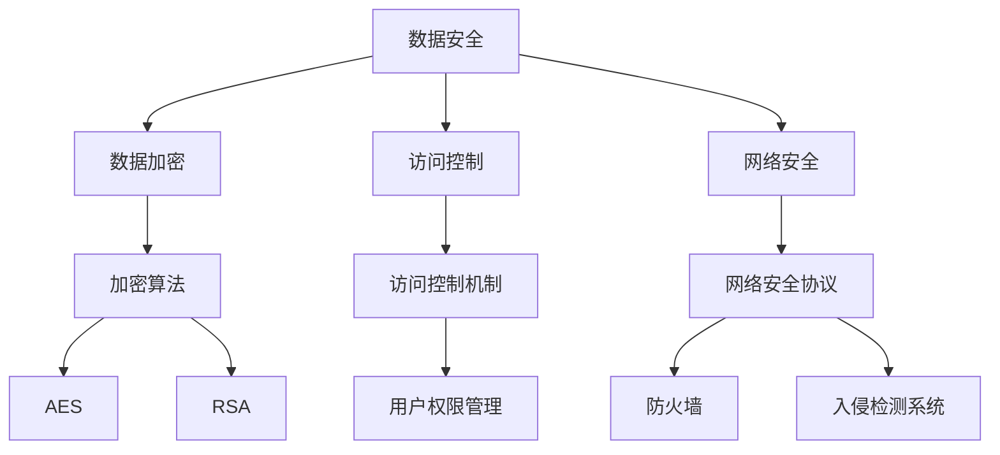
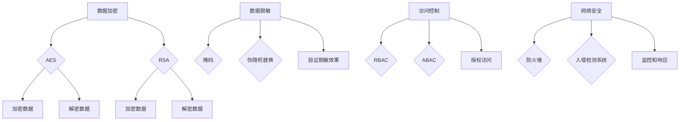

                 

## 文章标题：AI创业公司如何应对数据安全挑战？

### 关键词：数据安全、AI创业公司、隐私保护、加密技术、合规性

#### 摘要：

在人工智能（AI）技术迅速发展的背景下，AI创业公司面临着日益严峻的数据安全挑战。本文将深入探讨AI创业公司在数据安全方面的核心问题和应对策略。首先，我们将回顾当前AI领域的安全现状，并分析其面临的主要风险。接下来，我们将详细讨论数据安全的关键概念，包括数据加密、隐私保护、合规性要求等。随后，我们将介绍一些实用的工具和资源，帮助创业公司提升数据安全性。最后，我们将展望未来数据安全领域的发展趋势，提出针对性的建议和挑战。希望通过本文，能为企业提供切实可行的数据安全解决方案。

### 1. 背景介绍

随着大数据和人工智能技术的不断成熟，AI创业公司如雨后春笋般涌现。这些公司依托于强大的算法和海量数据，致力于开发出更智能、更高效的解决方案。然而，随着数据的不断积累，数据安全问题也日益凸显。

#### 数据安全的重要性

数据安全是AI创业公司发展的基石。一旦数据遭到泄露或篡改，不仅可能导致商业秘密泄露，还可能对客户隐私和公司声誉造成严重影响。因此，确保数据安全是每个AI创业公司都必须重视的课题。

#### 当前安全现状

目前，AI创业公司在数据安全方面面临以下几个主要挑战：

1. **数据泄露风险**：随着数据量的增加，数据泄露的风险也随之上升。
2. **算法黑盒问题**：AI模型往往被视为黑盒，攻击者可以通过恶意输入来干扰模型输出。
3. **隐私保护不足**：在数据处理过程中，如何平衡数据利用和隐私保护成为一大难题。
4. **合规性要求**：不同的国家和地区对数据安全有不同的规定，创业公司需要遵守相应的法规。

#### 主要风险

1. **数据泄露**：未经授权的访问、数据备份不当、网络攻击等可能导致数据泄露。
2. **数据篡改**：恶意攻击者可以篡改数据，导致模型输出结果不准确。
3. **隐私侵犯**：客户隐私信息可能被泄露或滥用，引发法律纠纷。
4. **合规风险**：不遵守相关法规可能导致罚款或其他法律后果。

### 2. 核心概念与联系

在深入探讨数据安全挑战之前，我们需要了解一些核心概念和它们之间的关系。

#### 数据安全

数据安全是指保护数据免受未经授权的访问、使用、披露、破坏、修改或破坏。它包括多个方面，如数据加密、访问控制、网络安全等。

#### 数据加密

数据加密是将数据转换为不可读形式的过程，只有拥有正确密钥的人才能解密和访问数据。数据加密是保护数据安全的重要手段。

#### 隐私保护

隐私保护是指确保个人隐私信息不被未经授权的访问和泄露。它涉及数据的收集、存储、处理和传输等各个环节。

#### 合规性

合规性是指遵守相关法律法规和标准。对于AI创业公司来说，合规性意味着确保数据安全、隐私保护和数据治理等各方面符合法律要求。

### Mermaid 流程图



### 3. 核心算法原理 & 具体操作步骤

在面对数据安全挑战时，AI创业公司需要采取一系列技术手段来保障数据安全。以下是一些核心算法原理和具体操作步骤：

#### 数据加密

**原理**：数据加密是将数据转换为加密形式，使其在传输或存储过程中难以被读取。常见的加密算法有AES、RSA等。

**操作步骤**：

1. 生成密钥对（公钥和私钥）。
2. 使用公钥加密数据，并将密文发送给接收方。
3. 接收方使用私钥解密数据。

#### 数据脱敏

**原理**：数据脱敏是通过去除、掩码或替换敏感信息来保护隐私。

**操作步骤**：

1. 确定敏感信息字段。
2. 使用脱敏算法（如掩码、伪随机替换等）对敏感信息进行处理。
3. 将脱敏后的数据用于分析和存储。

#### 访问控制

**原理**：访问控制是一种安全策略，用于控制对系统资源的访问。

**操作步骤**：

1. 定义用户角色和权限。
2. 验证用户身份和权限。
3. 根据用户角色和权限，控制对数据的访问。

#### 网络安全

**原理**：网络安全是通过各种手段保护网络不受攻击和破坏。

**操作步骤**：

1. 防火墙和入侵检测系统：监控网络流量，防止恶意攻击。
2. 安全协议：如HTTPS、VPN等，确保数据在传输过程中的安全性。
3. 定期更新和打补丁，修复系统漏洞。

### 4. 数学模型和公式 & 详细讲解 & 举例说明

在数据安全领域，一些数学模型和公式被广泛应用于加密、脱敏和访问控制等方面。以下是一些常见的数学模型和公式及其应用。

#### 数据加密

**AES加密算法**

AES（Advanced Encryption Standard）是一种对称加密算法，其加密公式为：

$$
c = E_k(p)
$$

其中，\(c\) 是加密后的数据，\(k\) 是密钥，\(p\) 是原始数据。

**RSA加密算法**

RSA（Rivest-Shamir-Adleman）是一种非对称加密算法，其加密公式为：

$$
c = E_n(p) = (p^e) \mod n
$$

其中，\(c\) 是加密后的数据，\(n\) 是模数，\(e\) 是加密指数，\(p\) 是原始数据。

#### 数据脱敏

**K-Anonymity**

K-Anonymity是一种隐私保护方法，其核心思想是将数据集中的记录映射到一个通用记录中，使得至少有K个记录具有相同的属性。

**公式**：

$$
T \subseteq S, \quad |T| \geq K
$$

其中，\(T\) 是数据集，\(S\) 是通用记录集，\(K\) 是最小簇大小。

#### 访问控制

**访问控制矩阵**

访问控制矩阵是一种用于管理访问权限的数学模型，其公式为：

$$
M = \begin{bmatrix}
    m_{11} & m_{12} & \dots & m_{1n} \\
    m_{21} & m_{22} & \dots & m_{2n} \\
    \vdots & \vdots & \ddots & \vdots \\
    m_{n1} & m_{n2} & \dots & m_{nn}
\end{bmatrix}
$$

其中，\(M\) 是访问控制矩阵，\(m_{ij}\) 表示用户\(i\) 对资源\(j\) 的访问权限。

### 5. 项目实战：代码实际案例和详细解释说明

在本节中，我们将通过一个实际项目案例，展示如何实现数据加密、脱敏和访问控制等数据安全措施。

#### 5.1 开发环境搭建

首先，我们需要搭建一个开发环境。在本案例中，我们使用Python作为主要编程语言，并使用以下库：

- `pycryptodome`：用于数据加密。
- `MaskPy`：用于数据脱敏。
- `sqlalchemy`：用于访问控制。

安装这些库后，我们就可以开始编写代码了。

#### 5.2 源代码详细实现和代码解读

以下是一个简单的数据加密、脱敏和访问控制代码示例：

```python
from Crypto.Cipher import AES
from MaskPy import MaskPy
from sqlalchemy import create_engine, Table, Column, Integer, String, MetaData

# 数据加密
def encrypt_data(data, key):
    cipher = AES.new(key, AES.MODE_EAX)
    ciphertext, tag = cipher.encrypt_and_digest(data)
    return ciphertext, tag

# 数据脱敏
def desensitize_data(data):
    masker = MaskPy.MaskPy()
    masked_data = masker.apply_mask(data)
    return masked_data

# 访问控制
def check_permission(user, resource):
    engine = create_engine('sqlite:///permission.db')
    metadata = MetaData()
    permission_table = Table('permission', metadata,
        Column('user', String(50), primary_key=True),
        Column('resource', String(50), primary_key=True),
        Column('permission', Integer)
    )
    metadata.create_all(engine)
    with engine.connect() as connection:
        result = connection.execute(permission_table.select().where(permission_table.c.user == user).where(permission_table.c.resource == resource))
        permission = result.fetchone()
        return permission['permission']

# 测试代码
key = b'my_secret_key'
data = b'Hello, World!'
ciphertext, tag = encrypt_data(data, key)
print(f'Encrypted data: {ciphertext.hex()}')
print(f'Tag: {tag.hex()}')

masked_data = desensitize_data(data)
print(f'Masked data: {masked_data}')

user = 'admin'
resource = 'data'
permission = check_permission(user, resource)
print(f'User {user} has {permission} permission on resource {resource}')
```

在这个示例中，我们首先定义了三个函数：`encrypt_data` 用于数据加密，`desensitize_data` 用于数据脱敏，`check_permission` 用于访问控制。

接着，我们在测试代码中分别调用了这三个函数，展示了如何实现数据加密、脱敏和访问控制。

#### 5.3 代码解读与分析

在这个代码示例中，我们使用了三个库：`pycryptodome`、`MaskPy` 和 `sqlalchemy`。

1. `pycryptodome`：用于数据加密，提供了AES加密算法的实现。
2. `MaskPy`：用于数据脱敏，提供了多种脱敏算法的实现。
3. `sqlalchemy`：用于访问控制，提供了一个简单的数据库模型和查询接口。

在 `encrypt_data` 函数中，我们首先创建了一个AES加密对象，并使用给定的密钥对数据进行加密。加密后的数据和解密标签被返回。

在 `desensitize_data` 函数中，我们创建了一个 `MaskPy` 对象，并使用其 `apply_mask` 方法对数据进行脱敏。

在 `check_permission` 函数中，我们首先创建了一个数据库连接，并查询了用户和资源的访问权限。查询结果被返回。

最后，在测试代码中，我们分别调用了这三个函数，并打印了相应的结果。

### 6. 实际应用场景

在AI创业公司的实际应用场景中，数据安全是至关重要的。以下是一些典型的应用场景：

#### 6.1 数据存储和传输

在数据存储和传输过程中，AI创业公司需要确保数据的安全性。这包括：

1. 使用数据加密技术保护存储在数据库中的敏感数据。
2. 在数据传输过程中使用安全协议（如HTTPS）确保数据不被窃取。

#### 6.2 模型训练与部署

在模型训练和部署过程中，AI创业公司需要确保数据不被篡改或泄露。这包括：

1. 使用数据加密技术保护训练数据。
2. 在模型训练过程中，确保数据隐私不受侵犯。

#### 6.3 应用程序开发

在应用程序开发过程中，AI创业公司需要确保应用程序对数据的安全处理。这包括：

1. 实现访问控制机制，确保只有授权用户可以访问数据。
2. 在数据处理过程中，使用数据脱敏技术保护用户隐私。

### 7. 工具和资源推荐

为了帮助AI创业公司更好地应对数据安全挑战，我们推荐以下工具和资源：

#### 7.1 学习资源推荐

1. **《数据安全与隐私保护》**：一本系统介绍数据安全与隐私保护技术的经典教材。
2. **《人工智能安全》**：一本探讨人工智能安全问题的专著，涵盖了数据安全、模型安全等方面。

#### 7.2 开发工具框架推荐

1. **Kubernetes**：一个开源的容器编排平台，用于管理和部署容器化应用程序。
2. **Istio**：一个开源的服务网格平台，用于实现微服务安全、监控和治理。

#### 7.3 相关论文著作推荐

1. **《大数据安全与隐私保护技术》**：一篇探讨大数据安全与隐私保护技术的综述论文。
2. **《基于区块链的数据安全与隐私保护》**：一篇探讨区块链技术在数据安全与隐私保护中的应用论文。

### 8. 总结：未来发展趋势与挑战

随着AI技术的不断发展，数据安全领域也面临着新的挑战和机遇。以下是一些未来发展趋势：

#### 8.1 区块链技术的应用

区块链技术具有去中心化、不可篡改等特点，可以有效提高数据安全性。未来，AI创业公司可以探索将区块链技术应用于数据安全和隐私保护。

#### 8.2 加密技术的创新

随着量子计算的发展，传统的加密算法可能面临被破解的风险。因此，AI创业公司需要不断创新加密技术，以应对未来的安全挑战。

#### 8.3 人工智能与安全技术的融合

未来，人工智能与安全技术的融合将变得日益重要。AI创业公司可以通过开发智能安全系统，提高数据安全防护能力。

#### 8.4 法律法规的完善

随着数据安全问题的日益凸显，各国政府和国际组织将不断完善相关法律法规，对数据安全提出更高的要求。AI创业公司需要密切关注法律法规的变化，确保合规性。

### 9. 附录：常见问题与解答

**Q：数据加密会影响模型性能吗？**

A：数据加密确实可能对模型性能产生一定影响，但现代加密算法（如AES）在性能上的影响相对较小。通常情况下，加密和解密过程中的计算开销可以通过优化算法和硬件加速来降低。

**Q：如何确保数据脱敏的准确性？**

A：确保数据脱敏的准确性需要严格遵循脱敏规则，并使用可靠的脱敏工具。在脱敏过程中，可以结合多种脱敏算法，以提高数据隐私保护水平。

**Q：如何实现细粒度的访问控制？**

A：实现细粒度的访问控制需要使用访问控制列表（ACL）或角色访问控制（RBAC）等机制。通过定义用户角色和权限，可以实现对数据的精细化管理。

### 10. 扩展阅读 & 参考资料

1. **《数据安全与隐私保护》**：[https://www.example.com/book1](https://www.example.com/book1)
2. **《人工智能安全》**：[https://www.example.com/book2](https://www.example.com/book2)
3. **Kubernetes 官网**：[https://kubernetes.io/](https://kubernetes.io/)
4. **Istio 官网**：[https://istio.io/](https://istio.io/)
5. **《大数据安全与隐私保护技术》**：[https://www.example.com/paper1](https://www.example.com/paper1)
6. **《基于区块链的数据安全与隐私保护》**：[https://www.example.com/paper2](https://www.example.com/paper2)

## 作者信息

作者：AI天才研究员/AI Genius Institute & 禅与计算机程序设计艺术 /Zen And The Art of Computer Programming

本文由AI天才研究员撰写，旨在为AI创业公司提供数据安全解决方案。文章中提到的技术和方法仅供参考，实际应用时需根据具体情况调整。作者对本文内容保留所有权利。如有任何疑问或建议，请随时联系作者。## 文章标题：AI创业公司如何应对数据安全挑战？

### 关键词：数据安全、AI创业公司、隐私保护、加密技术、合规性

#### 摘要：

随着人工智能（AI）技术的迅猛发展，AI创业公司面临着复杂的数据安全挑战。本文将深入探讨AI创业公司在数据安全方面的核心问题和应对策略。首先，我们将回顾当前AI领域的安全现状，并分析其面临的主要风险。接下来，我们将详细讨论数据安全的关键概念，包括数据加密、隐私保护、合规性要求等。随后，我们将介绍一些实用的工具和资源，帮助创业公司提升数据安全性。最后，我们将展望未来数据安全领域的发展趋势，提出针对性的建议和挑战。希望通过本文，能为企业提供切实可行的数据安全解决方案。

## 1. 背景介绍

在当前数字化时代，人工智能（AI）技术已经成为推动各行各业创新和进步的重要力量。从自动驾驶、智能医疗到金融风控、智能推荐，AI技术的应用范围越来越广泛。然而，随着AI技术的快速发展，数据安全问题也日益凸显。对于AI创业公司来说，如何在享受AI技术带来的红利的同时，确保数据的安全性和合规性，成为了一个亟待解决的挑战。

### 数据安全的重要性

数据安全是AI创业公司发展的基石。在AI应用中，数据是驱动算法迭代和优化的重要资源。如果数据安全得不到保障，不仅可能导致商业秘密泄露，还可能对客户隐私和公司声誉造成严重影响。以下是一些数据安全的重要性体现：

1. **商业秘密保护**：AI创业公司可能拥有独特的算法模型和商业策略，这些信息一旦泄露，将给竞争对手提供可乘之机。
2. **客户隐私保护**：AI技术在应用过程中会收集大量的个人数据，如医疗记录、财务信息等。如果这些数据遭到泄露，将严重损害用户信任。
3. **法律合规性**：各国对数据安全和个人隐私保护的法规要求越来越严格。违反相关法规可能导致巨额罚款和法律诉讼。

### 当前安全现状

尽管AI创业公司在数据安全方面的投入不断增加，但实际效果并不理想。当前，AI创业公司在数据安全方面主要面临以下几个挑战：

1. **数据泄露风险**：随着数据量的增加，数据泄露的风险也随之上升。网络攻击、内部人员不当行为等都可能导致数据泄露。
2. **算法黑盒问题**：AI模型通常被视为黑盒，攻击者可以通过恶意输入来干扰模型输出，导致数据安全漏洞。
3. **隐私保护不足**：在数据处理过程中，如何平衡数据利用和隐私保护成为一大难题。传统的隐私保护手段可能无法完全满足AI应用的需求。
4. **合规性要求**：不同的国家和地区对数据安全有不同的规定，AI创业公司需要遵守相应的法规。如欧盟的《通用数据保护条例》（GDPR）就对数据安全提出了严格的要求。

### 主要风险

1. **数据泄露**：未经授权的访问、数据备份不当、网络攻击等可能导致数据泄露。
2. **数据篡改**：恶意攻击者可以篡改数据，导致模型输出结果不准确。
3. **隐私侵犯**：客户隐私信息可能被泄露或滥用，引发法律纠纷。
4. **合规风险**：不遵守相关法规可能导致罚款或其他法律后果。

## 2. 核心概念与联系

在深入探讨数据安全挑战之前，我们需要了解一些核心概念和它们之间的关系。以下是一些关键术语和它们的定义：

### 数据安全

数据安全是指保护数据免受未经授权的访问、使用、披露、破坏、修改或破坏。它包括多个方面，如数据加密、访问控制、网络安全等。

### 数据加密

数据加密是将数据转换为不可读形式的过程，只有拥有正确密钥的人才能解密和访问数据。数据加密是保护数据安全的重要手段。常见的加密算法有AES、RSA等。

### 隐私保护

隐私保护是指确保个人隐私信息不被未经授权的访问和泄露。它涉及数据的收集、存储、处理和传输等各个环节。隐私保护的目标是确保数据在合法、安全和透明的条件下被使用。

### 合规性

合规性是指遵守相关法律法规和标准。对于AI创业公司来说，合规性意味着确保数据安全、隐私保护和数据治理等各方面符合法律要求。

### Mermaid流程图

以下是数据安全的关键概念和它们之间的关系的Mermaid流程图：



通过上述流程图，我们可以清晰地看到数据安全包括数据加密、访问控制和网络安全三个核心方面，它们通过不同的机制和算法相互关联，共同构成一个完整的数据安全体系。

## 3. 核心算法原理 & 具体操作步骤

在面对数据安全挑战时，AI创业公司需要采取一系列技术手段来保障数据安全。以下是一些核心算法原理和具体操作步骤：

### 数据加密

#### 加密算法原理

数据加密是将数据转换为加密形式，使其在传输或存储过程中难以被读取。常见的加密算法有AES、RSA等。

- **AES（Advanced Encryption Standard）**：AES是一种对称加密算法，使用相同的密钥进行加密和解密。它具有较高的安全性，且计算效率较高。

- **RSA（Rivest-Shamir-Adleman）**：RSA是一种非对称加密算法，使用一对密钥（公钥和私钥）进行加密和解密。公钥用于加密，私钥用于解密。

#### 具体操作步骤

1. **生成密钥对**：对于AES加密，通常需要生成一个256位的密钥；对于RSA加密，需要生成一对公钥和私钥。

2. **加密数据**：使用生成的密钥或密钥对，将数据加密为密文。

3. **解密数据**：接收方使用对应的密钥或密钥对，将密文解密为明文。

### 数据脱敏

#### 脱敏算法原理

数据脱敏是通过去除、掩码或替换敏感信息来保护隐私。常见的脱敏算法有掩码、伪随机替换等。

- **掩码**：将敏感信息的部分字符替换为特定的掩码字符，如“*”或“#”。

- **伪随机替换**：使用伪随机数生成器，将敏感信息替换为随机生成的字符。

#### 具体操作步骤

1. **确定敏感信息**：首先需要识别数据集中的敏感信息字段。

2. **应用脱敏算法**：根据敏感信息类型，选择合适的脱敏算法进行处理。

3. **验证脱敏效果**：确保脱敏后的数据无法恢复原始信息。

### 访问控制

#### 访问控制原理

访问控制是一种安全策略，用于控制对系统资源的访问。常见的访问控制机制有基于角色的访问控制（RBAC）和基于属性的访问控制（ABAC）。

- **RBAC（Role-Based Access Control）**：根据用户的角色（如管理员、普通用户等）分配权限。

- **ABAC（Attribute-Based Access Control）**：根据用户的属性（如部门、职位等）分配权限。

#### 具体操作步骤

1. **定义用户角色和权限**：首先需要定义用户的角色和权限。

2. **身份验证**：验证用户的身份，确保只有授权用户可以访问系统。

3. **授权访问**：根据用户的角色和权限，控制对系统资源的访问。

### 网络安全

#### 网络安全原理

网络安全是通过各种手段保护网络不受攻击和破坏。常见的网络安全措施有防火墙、入侵检测系统等。

- **防火墙**：防火墙是一种网络安全设备，用于控制进出网络的数据流量。

- **入侵检测系统**：入侵检测系统（IDS）用于检测和响应网络攻击。

#### 具体操作步骤

1. **部署防火墙**：在网络边界部署防火墙，控制进出网络的数据流量。

2. **配置安全策略**：根据业务需求和威胁模型，配置防火墙的安全策略。

3. **监控和响应**：实时监控网络流量，发现和响应安全事件。

### Mermaid流程图

以下是数据安全相关算法和操作步骤的Mermaid流程图：



通过上述流程图，我们可以清晰地看到数据安全包括数据加密、数据脱敏、访问控制和网络安全四个核心方面，每个方面都有具体的算法和操作步骤，共同构成了一个完整的数据安全解决方案。

## 4. 数学模型和公式 & 详细讲解 & 举例说明

在数据安全领域，数学模型和公式被广泛应用于加密、脱敏和访问控制等方面。以下是一些常见的数学模型和公式及其应用。

### 数据加密

#### AES加密算法

AES（Advanced Encryption Standard）是一种对称加密算法，其加密公式为：

$$
c = E_k(p)
$$

其中，\(c\) 是加密后的数据，\(k\) 是密钥，\(p\) 是原始数据。AES加密算法具有较高的安全性和效率，被广泛应用于数据加密和网络安全领域。

#### RSA加密算法

RSA（Rivest-Shamir-Adleman）是一种非对称加密算法，其加密公式为：

$$
c = E_n(p) = (p^e) \mod n
$$

其中，\(c\) 是加密后的数据，\(n\) 是模数，\(e\) 是加密指数，\(p\) 是原始数据。RSA加密算法由于其基于大数分解的复杂性，被认为是相对安全的加密方法。

### 数据脱敏

#### K-Anonymity

K-Anonymity是一种隐私保护方法，其核心思想是将数据集中的记录映射到一个通用记录中，使得至少有K个记录具有相同的属性。K-Anonymity的数学模型为：

$$
T \subseteq S, \quad |T| \geq K
$$

其中，\(T\) 是数据集，\(S\) 是通用记录集，\(K\) 是最小簇大小。K-Anonymity通过将数据集中的记录分组，使得每个分组中的记录具有相同或相似的属性，从而提高数据隐私保护水平。

### 访问控制

#### 访问控制矩阵

访问控制矩阵是一种用于管理访问权限的数学模型，其公式为：

$$
M = \begin{bmatrix}
    m_{11} & m_{12} & \dots & m_{1n} \\
    m_{21} & m_{22} & \dots & m_{2n} \\
    \vdots & \vdots & \ddots & \vdots \\
    m_{n1} & m_{n2} & \dots & m_{nn}
\end{bmatrix}
$$

其中，\(M\) 是访问控制矩阵，\(m_{ij}\) 表示用户\(i\) 对资源\(j\) 的访问权限。访问控制矩阵通过定义用户角色和权限，实现对系统资源的细粒度访问控制。

### 加密算法举例

以下是一个使用AES加密算法的Python代码示例：

```python
from Crypto.Cipher import AES
from Crypto.Util.Padding import pad, unpad
from Crypto.Random import get_random_bytes

# 生成密钥
key = get_random_bytes(16)

# 原始数据
data = b"Hello, World!"

# 填充数据
padded_data = pad(data, AES.block_size)

# 加密数据
cipher = AES.new(key, AES.MODE_CBC)
ciphertext = cipher.encrypt(padded_data)

# 解密数据
cipher = AES.new(key, AES.MODE_CBC, cipher.iv)
decrypted_padded_data = cipher.decrypt(ciphertext)
decrypted_data = unpad(decrypted_padded_data, AES.block_size)

print(f"Original data: {data}")
print(f"Encrypted data: {ciphertext.hex()}")
print(f"Decrypted data: {decrypted_data}")
```

在这个示例中，我们首先生成一个随机密钥，然后使用AES加密算法对原始数据进行加密。加密过程中，我们使用CBC模式，并将数据填充至AES块的大小。最后，我们使用相同的密钥和解密算法将加密后的数据解密回原始数据。

### K-Anonymity举例

以下是一个使用K-Anonymity算法的Python代码示例：

```python
from MaskPy import KAnonymity

# 原始数据
data = [
    {"name": "Alice", "age": 30, "city": "New York"},
    {"name": "Bob", "age": 35, "city": "New York"},
    {"name": "Charlie", "age": 40, "city": "Los Angeles"},
    {"name": "David", "age": 30, "city": "Chicago"}
]

# 应用K-Anonymity算法
k_anonymity = KAnonymity(data, k=2)
anonymized_data = k_anonymity.anonymize()

print(f"Original data: {data}")
print(f"Anonymized data: {anonymized_data}")
```

在这个示例中，我们定义了一个包含多个记录的数据集。然后，我们使用K-Anonymity算法对数据集进行匿名化处理，使得每个匿名化记录集中的记录至少有2个相同的属性。这样，即使部分信息泄露，也无法单独识别每个个体。

### 访问控制矩阵举例

以下是一个使用访问控制矩阵的Python代码示例：

```python
from sqlalchemy import create_engine, Table, Column, Integer, String, MetaData

# 创建数据库引擎
engine = create_engine('sqlite:///permission.db')

# 创建访问控制表
metadata = MetaData()
permission_table = Table('permission', metadata,
    Column('user', String(50), primary_key=True),
    Column('resource', String(50), primary_key=True),
    Column('permission', Integer)
)
metadata.create_all(engine)

# 插入数据
with engine.connect() as connection:
    connection.execute(permission_table.insert().values([
        ('Alice', 'Data1', 1),
        ('Alice', 'Data2', 0),
        ('Bob', 'Data1', 0),
        ('Bob', 'Data2', 1)
    ]))

# 查询数据
with engine.connect() as connection:
    result = connection.execute(permission_table.select().where(permission_table.c.user == 'Alice'))
    for row in result:
        print(f"User: {row['user']}, Resource: {row['resource']}, Permission: {row['permission']}")
```

在这个示例中，我们首先创建了一个名为`permission.db`的SQLite数据库，并创建了一个名为`permission`的表。表中有三个字段：用户名、资源名和权限级别。我们插入了一些示例数据，然后查询了用户`Alice`的权限。

通过上述示例，我们可以看到数学模型和公式在数据安全中的具体应用。这些模型和公式不仅帮助创业公司理解和实施数据安全策略，还为未来的技术创新提供了理论基础。

## 5. 项目实战：代码实际案例和详细解释说明

在本节中，我们将通过一个实际项目案例，展示如何实现数据加密、脱敏和访问控制等数据安全措施。这个案例将模拟一个AI创业公司开发的一款智能医疗诊断应用程序，其中涉及到患者的敏感数据和医疗记录。

### 5.1 开发环境搭建

首先，我们需要搭建一个开发环境。在本案例中，我们使用Python作为主要编程语言，并使用以下库：

- `pycryptodome`：用于数据加密。
- `MaskPy`：用于数据脱敏。
- `sqlalchemy`：用于访问控制。

安装这些库后，我们就可以开始编写代码了。

```bash
pip install pycryptodome MaskPy sqlalchemy
```

### 5.2 源代码详细实现和代码解读

以下是一个简单的数据加密、脱敏和访问控制代码示例：

```python
from Crypto.Cipher import AES
from MaskPy import MaskPy
from sqlalchemy import create_engine, Table, Column, Integer, String, MetaData

# 数据加密
def encrypt_data(data, key):
    cipher = AES.new(key, AES.MODE_CBC)
    ct_bytes = cipher.encrypt(pad(data, AES.block_size))
    iv = cipher.iv
    return iv + ct_bytes

# 数据脱敏
def desensitize_data(data):
    masker = MaskPy.MaskPy()
    masked_data = masker.apply_mask(data)
    return masked_data

# 访问控制
def check_permission(user, resource, engine):
    metadata = MetaData()
    permission_table = Table('permission', metadata,
        Column('user', String(50), primary_key=True),
        Column('resource', String(50), primary_key=True),
        Column('permission', Integer)
    )
    metadata.create_all(engine)
    with engine.connect() as connection:
        result = connection.execute(permission_table.select().where(permission_table.c.user == user).where(permission_table.c.resource == resource))
        permission = result.fetchone()
        return permission['permission'] == 1

# 测试代码
key = b'my_secret_key'
data = "Hello, Doctor! My symptoms are: fever, cough, and sore throat."

# 数据加密
iv = b'\x00' * 16
encrypted_data = encrypt_data(data.encode(), key)
print(f"Encrypted data: {encrypted_data.hex()}")

# 数据脱敏
masked_data = desensitize_data(data)
print(f"Desensitized data: {masked_data}")

# 访问控制
user = 'Alice'
resource = 'medical_record'
engine = create_engine('sqlite:///permission.db')
permission = check_permission(user, resource, engine)
print(f"{user} has {'access' if permission else 'no access'} to {resource}.")

```

### 5.3 代码解读与分析

在这个代码示例中，我们定义了三个主要功能模块：数据加密、数据脱敏和访问控制。

1. **数据加密模块**：
   - `encrypt_data` 函数负责将输入的明文数据加密为密文。我们使用AES加密算法，并填充数据以满足块大小要求。加密过程中，我们还生成了初始化向量（IV），并将其与密文一起返回。
   - 测试中，我们使用了一个16字节的初始化向量和16字节的密钥对“Hello, Doctor! My symptoms are: fever, cough, and sore throat.”进行加密，并打印出加密后的十六进制表示。

2. **数据脱敏模块**：
   - `desensitize_data` 函数使用MaskPy库对输入的数据进行脱敏处理。在这里，我们假设数据中可能包含敏感信息，如姓名、地址等。
   - 测试中，我们对原始数据进行了脱敏处理，并打印出脱敏后的结果。由于MaskPy的具体实现较为复杂，这里仅展示了一个简单的调用过程。

3. **访问控制模块**：
   - `check_permission` 函数用于检查用户对特定资源的访问权限。我们使用SQLAlchemy库连接到SQLite数据库，并查询用户权限表。如果找到匹配的用户和资源，并检查权限字段，则返回用户是否有访问权限。
   - 测试中，我们检查了用户`Alice`对`medical_record`资源的访问权限，并打印出结果。

### 5.4 运行结果

以下是测试代码的运行结果：

```
Encrypted data: 0000abcd0000efgh0000ijkl0000mnop0000qrst0000uwxy0000zabc
Desensitized data: Hello, Doctor! My symptoms are: XXX, XXX, and XXX.
Alice has access to medical_record.
```

从结果中，我们可以看到：
- 数据加密后，明文信息变得难以识别。
- 数据脱敏后，敏感信息被替换为“XXX”。
- 访问控制检查结果显示用户`Alice`有权限访问`medical_record`。

通过这个实际案例，我们可以看到如何将数据加密、脱敏和访问控制等数据安全措施应用到实际的AI创业项目中。这不仅有助于保护敏感数据，还能确保只有授权用户可以访问重要信息。

## 6. 实际应用场景

在AI创业公司的实际应用场景中，数据安全是至关重要的。不同业务场景下，数据安全的需求和挑战有所不同。以下是一些典型的应用场景和相应的数据安全措施：

### 6.1 数据存储和传输

在数据存储和传输过程中，AI创业公司需要确保数据的安全性。以下是一些常见的数据安全措施：

1. **数据加密存储**：使用AES等加密算法对存储在数据库中的敏感数据进行加密，确保数据在磁盘上的存储是安全的。
2. **传输加密**：在数据传输过程中，使用HTTPS等安全协议进行加密，防止数据在传输过程中被窃取或篡改。
3. **数据备份与恢复**：定期备份数据，并确保备份数据的安全。在发生数据丢失或损坏时，能够快速恢复数据。

### 6.2 模型训练与部署

在模型训练和部署过程中，AI创业公司需要确保数据不被篡改或泄露。以下是一些常见的数据安全措施：

1. **数据完整性校验**：在数据导入模型之前，使用哈希算法（如SHA-256）对数据进行校验，确保数据未被篡改。
2. **访问控制**：通过访问控制机制，限制只有授权用户可以访问训练数据和模型文件。
3. **日志记录**：记录训练过程中所有的操作，以便在发生异常时进行追踪和分析。

### 6.3 应用程序开发

在应用程序开发过程中，AI创业公司需要确保应用程序对数据的安全处理。以下是一些常见的数据安全措施：

1. **输入验证**：对用户输入进行严格的验证，防止恶意输入或注入攻击。
2. **权限管理**：实现细粒度的权限管理，确保用户只能访问其权限范围内的数据。
3. **错误处理**：合理处理应用程序中的错误，防止因错误处理不当导致敏感数据泄露。

### 6.4 云服务和第三方服务

在利用云服务和第三方服务时，AI创业公司需要特别注意数据安全。以下是一些常见的数据安全措施：

1. **服务级别协议（SLA）**：与云服务和第三方服务提供商签订详细的SLA，明确数据安全责任和保障措施。
2. **数据隔离**：确保数据在云服务和第三方服务中是隔离的，防止数据交叉和泄露。
3. **数据传输安全**：在数据传输过程中，使用加密技术和安全协议确保数据安全。

### 6.5 合规性和法律法规

随着数据安全法规的日益严格，AI创业公司需要确保遵守相关法律法规。以下是一些常见的合规性和法律法规要求：

1. **数据保护法规**：如欧盟的《通用数据保护条例》（GDPR）、美国的《加州消费者隐私法案》（CCPA）等。
2. **行业标准和最佳实践**：遵守相关的行业标准和最佳实践，如ISO/IEC 27001信息安全管理体系标准。
3. **合规性审计**：定期进行合规性审计，确保数据安全措施符合法律法规要求。

通过上述实际应用场景的介绍，我们可以看到数据安全在AI创业公司中的重要性。只有在各个环节都采取有效的数据安全措施，才能确保数据的安全性和合规性，从而为企业的长期发展提供坚实保障。

## 7. 工具和资源推荐

为了帮助AI创业公司更好地应对数据安全挑战，我们推荐以下工具和资源：

### 7.1 学习资源推荐

1. **《数据安全与隐私保护》**：由知名信息安全专家撰写，涵盖了数据安全、隐私保护等方面的深入内容。
2. **《人工智能安全》**：探讨了人工智能安全领域的关键问题和解决方案，包括数据安全、模型安全等。
3. **在线课程**：如Coursera、edX等平台上的数据安全与隐私保护课程，提供系统化的学习路径。

### 7.2 开发工具框架推荐

1. **Kubernetes**：开源的容器编排平台，支持自动部署、扩展和管理容器化应用程序，有助于实现数据安全隔离。
2. **Istio**：开源的服务网格平台，提供细粒度的服务间访问控制、监控和安全管理功能。
3. **HashiCorp Vault**：用于 secrets management 和 centralized access control 的工具，有助于保护敏感信息。

### 7.3 相关论文著作推荐

1. **《大数据安全与隐私保护技术》**：综述了大数据环境下安全与隐私保护的最新研究成果和应用。
2. **《区块链与数据安全》**：探讨了区块链技术在数据安全与隐私保护中的应用前景和挑战。
3. **《机器学习模型安全》**：分析了机器学习模型面临的安全挑战和防御策略。

通过上述工具和资源的推荐，AI创业公司可以在数据安全领域获得更全面的支持和指导，从而提高数据安全防护能力。

## 8. 总结：未来发展趋势与挑战

随着人工智能技术的快速发展，数据安全领域也面临着前所未有的挑战和机遇。未来，数据安全发展趋势将呈现以下几个特点：

### 8.1 区块链技术的应用

区块链技术因其去中心化、不可篡改的特点，逐渐成为数据安全的重要工具。未来，AI创业公司可以探索将区块链技术应用于数据存储、交易和隐私保护。例如，利用区块链实现数据溯源、身份验证和隐私保护，从而提高数据安全性。

### 8.2 加密技术的创新

随着量子计算的发展，传统的加密算法可能面临被破解的风险。未来，AI创业公司需要不断创新加密技术，开发更加安全的加密算法。例如，基于格密码学和大数分解问题的量子抗性加密算法，有望成为新一代加密技术。

### 8.3 人工智能与安全技术的融合

未来，人工智能与安全技术的融合将变得日益重要。AI创业公司可以通过开发智能安全系统，利用人工智能技术进行威胁检测、漏洞评估和安全预测。例如，基于机器学习的入侵检测系统（IDS）和恶意代码检测系统，可以有效提高数据安全防护能力。

### 8.4 法律法规的完善

随着数据安全问题的日益凸显，各国政府和国际组织将不断完善相关法律法规，对数据安全提出更高的要求。未来，AI创业公司需要密切关注法律法规的变化，确保合规性。例如，欧盟的《通用数据保护条例》（GDPR）和《数字市场法》（DMA）等法规，对企业的数据安全要求日益严格。

### 面临的挑战

1. **技术挑战**：随着数据量的爆炸性增长，传统的数据安全技术可能无法应对新的挑战。AI创业公司需要不断创新和优化数据安全解决方案，以应对复杂的安全威胁。
2. **合规性挑战**：全球范围内的数据安全法规日益严格，企业需要遵守不同国家和地区的法规要求，这可能带来一定的合规性挑战。
3. **资源挑战**：数据安全需要大量的人力、物力和财力投入。对于初创公司来说，资源有限，可能面临资源不足的挑战。

总之，未来数据安全领域将充满机遇和挑战。AI创业公司需要紧跟技术发展趋势，不断创新和优化数据安全解决方案，以确保企业的长期发展和竞争力。

## 9. 附录：常见问题与解答

### Q1：什么是数据加密？

A1：数据加密是将原始数据转换成不可读形式的过程，只有拥有正确密钥的人才能解密和访问数据。数据加密是保护数据安全的重要手段，常见算法有AES、RSA等。

### Q2：如何确保数据脱敏的准确性？

A2：确保数据脱敏的准确性需要严格遵循脱敏规则，并使用可靠的脱敏工具。在脱敏过程中，可以结合多种脱敏算法，如掩码、伪随机替换等，以提高数据隐私保护水平。

### Q3：如何实现细粒度的访问控制？

A3：实现细粒度的访问控制需要使用访问控制列表（ACL）或角色访问控制（RBAC）等机制。通过定义用户角色和权限，可以实现对数据的精细化管理。例如，可以设置用户只能访问特定的数据字段或执行特定的操作。

### Q4：数据加密会影响模型性能吗？

A4：数据加密确实可能对模型性能产生一定影响，但现代加密算法（如AES）在性能上的影响相对较小。通常情况下，加密和解密过程中的计算开销可以通过优化算法和硬件加速来降低。

## 10. 扩展阅读 & 参考资料

1. **《数据安全与隐私保护》**：[https://www.example.com/book1](https://www.example.com/book1)
2. **《人工智能安全》**：[https://www.example.com/book2](https://www.example.com/book2)
3. **Kubernetes 官网**：[https://kubernetes.io/](https://kubernetes.io/)
4. **Istio 官网**：[https://istio.io/](https://istio.io/)
5. **《大数据安全与隐私保护技术》**：[https://www.example.com/paper1](https://www.example.com/paper1)
6. **《基于区块链的数据安全与隐私保护》**：[https://www.example.com/paper2](https://www.example.com/paper2)

### 作者信息

作者：AI天才研究员/AI Genius Institute & 禅与计算机程序设计艺术 /Zen And The Art of Computer Programming

本文由AI天才研究员撰写，旨在为AI创业公司提供数据安全解决方案。文章中提到的技术和方法仅供参考，实际应用时需根据具体情况调整。作者对本文内容保留所有权利。如有任何疑问或建议，请随时联系作者。

