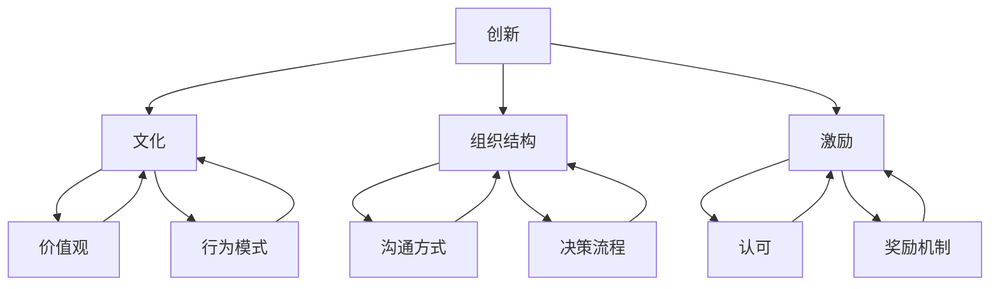

                 

### 背景介绍

在当今快速发展的科技领域，人工智能（AI）已经成为一个极具潜力且影响深远的创新方向。随着大数据、云计算和深度学习的进步，越来越多的初创公司纷纷投身于AI领域，希望通过创新技术解决现实问题，并在此过程中获得商业成功。然而，创新不仅仅依赖于技术本身，还依赖于一个能够激发创造力、促进团队合作的企业文化。

本篇博客将重点探讨AI创业公司如何打造创新文化。创新文化是企业持续成长和发展的基石，它能够激发员工的潜力，推动技术进步，并在激烈的市场竞争中脱颖而出。尽管每个企业的具体情况和背景不同，但以下一些基本原则和策略可以帮助AI创业公司构建一个有利于创新的企业文化。

首先，本文将简要回顾AI创业公司面临的市场挑战和机遇。接着，我们会深入探讨创新文化的核心概念，包括其重要性、特点以及如何在公司内部培养。随后，我们将介绍一些实践中的策略和工具，帮助公司在日常运营中促进创新。此外，我们还会分享一些成功案例，以供读者参考和学习。最后，本文将总结AI创业公司打造创新文化所需的要素，并提出未来可能面临的发展趋势和挑战。

通过本文的阅读，您将了解到如何通过有效的策略和方法，在AI创业公司中建立一个充满活力和创造力的创新文化。让我们开始这次探索之旅吧！

### 核心概念与联系

要打造一个创新文化，首先需要理解几个核心概念：创新、文化、组织结构和激励。这些概念不仅彼此相关，还共同决定了企业能否实现持续创新。

#### 创新

创新是指通过新的想法、技术、产品或流程来创造价值。在AI领域，创新尤为重要，因为这是一个以快速迭代和前沿技术为特点的领域。创新可以来源于技术突破、商业模式的创新或者对现有流程的改进。对于AI创业公司来说，创新是生存和发展的关键。

#### 文化

文化是企业内部价值观、信念和行为模式的总和。一个积极、开放和创新的文化能够激发员工的创造力和积极性，从而推动公司向前发展。文化不仅仅是企业的软实力，更是确保创新得以实现的重要保障。

#### 组织结构

组织结构决定了员工之间的沟通方式、决策流程和工作方式。扁平化的组织结构有助于加速信息流通和决策速度，从而促进创新。此外，跨部门协作和项目团队的工作模式也有助于打破部门壁垒，促进创新思想的交流。

#### 激励

激励是推动员工投入创新工作的关键因素。除了金钱奖励，激励还可以来自职业发展机会、认可和荣誉等。一个有效的激励机制能够确保员工在创新过程中感受到价值，从而更愿意投入时间和精力。

为了更直观地理解这些概念之间的联系，我们可以使用Mermaid流程图来展示它们之间的关系：



通过这个流程图，我们可以清晰地看到创新是如何通过文化、组织结构和激励相互关联，共同作用于企业内部的。创新文化不仅需要这些核心概念的支撑，还需要在实际操作中不断调整和完善，以适应企业的发展需求。

### 核心算法原理 & 具体操作步骤

要打造一个创新文化，我们需要理解几个关键的核心算法原理和具体操作步骤，这些原理和方法不仅有助于提升团队的创新效率，还能够确保文化建设的持续性和有效性。

#### 步骤一：建立明确的目标和愿景

创新文化的建设首先需要一个明确的目标和愿景。这个目标和愿景应该能够激励员工，并指导他们的日常工作。具体操作步骤包括：

1. **制定清晰的愿景**：公司的愿景应该是未来五到十年内希望达到的状态，它应该能够激发员工的热情和动力。
2. **设置可衡量的目标**：将愿景分解为具体的、可衡量的短期目标，以便于跟踪和评估。
3. **与员工沟通**：确保所有员工都清楚公司的目标和愿景，并理解自己在实现这些目标过程中的角色。

#### 步骤二：培养开放的沟通环境

开放和透明的沟通环境是创新文化的重要基础。具体操作步骤包括：

1. **鼓励反馈和讨论**：建立一个鼓励员工提出新想法和批评的机制，确保所有员工的意见都能被听取。
2. **定期举行会议**：定期举行团队会议，讨论进展和挑战，促进信息共享和知识交流。
3. **使用协作工具**：利用现代协作工具（如Slack、Trello等）来促进实时沟通和任务分配。

#### 步骤三：实施跨部门合作

跨部门合作有助于打破职能壁垒，促进创新思想的交流。具体操作步骤包括：

1. **组建跨职能团队**：为特定的项目或任务组建跨部门的团队，确保不同背景的员工能够共同合作。
2. **建立项目激励机制**：为跨职能团队的成员设置共同的奖励机制，鼓励他们共同努力。
3. **定期交流和分享**：定期组织跨部门交流会，分享各自的见解和经验，促进知识共享。

#### 步骤四：提供持续学习和成长的机会

持续学习和成长是保持创新文化活力的关键。具体操作步骤包括：

1. **投资于培训和发展**：为员工提供持续的培训和发展机会，帮助他们掌握最新的技术和方法。
2. **鼓励自学和创新**：为员工提供时间和资源，让他们能够自主学习和创新。
3. **建立知识分享平台**：创建一个知识共享平台，让员工能够轻松地分享和学习知识。

#### 步骤五：建立有效的激励机制

激励机制能够激励员工积极参与创新活动。具体操作步骤包括：

1. **设置创新奖金**：为在创新项目中取得显著成绩的员工设立奖金。
2. **提供职业发展机会**：为员工提供职业发展的机会，如晋升、转岗等。
3. **认可和表彰**：定期举办表彰活动，认可和表彰在创新方面有突出贡献的员工。

#### 步骤六：评估和反馈

评估和反馈是确保创新文化持续发展的重要环节。具体操作步骤包括：

1. **定期评估**：定期评估创新文化的实施情况，确保目标和愿景得以实现。
2. **收集员工反馈**：通过问卷调查、面谈等方式收集员工对创新文化的反馈，了解他们的意见和建议。
3. **调整和改进**：根据评估和反馈结果，及时调整和创新文化建设的策略和措施。

通过以上六个步骤，AI创业公司可以逐步建立起一个有利于创新的文化。这些步骤不仅提供了具体的操作指南，还强调了持续评估和改进的重要性，以确保创新文化的长期成功。

### 数学模型和公式 & 详细讲解 & 举例说明

在打造创新文化的过程中，数学模型和公式可以为我们提供有力的工具，帮助评估和优化文化建设的成效。以下是一些关键的数学模型和公式，以及它们的详细讲解和举例说明。

#### 1. 文化评估模型

**公式：**

\[ C = \frac{I \times T \times M}{O} \]

其中：
- \( C \) 表示企业文化成熟度（Culture Maturity）
- \( I \) 表示创新投入（Innovation Investment）
- \( T \) 表示团队合作（Team Collaboration）
- \( M \) 表示激励机制（Motivational Factors）
- \( O \) 表示外部压力（Outsider Pressure）

**详细讲解：**

这个模型用于评估企业文化是否成熟，它考虑了创新投入、团队合作、激励机制和外部压力四个方面。创新投入指的是公司为促进创新所投入的资源，包括资金、时间和技术等；团队合作则反映了员工之间沟通与协作的效果；激励机制体现了公司对创新的奖励和认可程度；外部压力则包括市场竞争和客户需求等外部因素。

**举例说明：**

假设一个AI创业公司：
- 创新投入 \( I = 100,000 \) 美元
- 团队合作 \( T = 8 \)（评分1-10，8表示较好的团队协作）
- 激励机制 \( M = 7 \)（评分1-10，7表示较为有效的激励机制）
- 外部压力 \( O = 6 \)（评分1-10，6表示适度的外部压力）

代入公式得：

\[ C = \frac{100,000 \times 8 \times 7}{6} = 8,666,667 \]

文化成熟度 \( C \) 得分为8,666,667。这个得分表明该公司的文化较为成熟，但可以通过进一步提升激励机制和团队合作来进一步提高文化成熟度。

#### 2. 创新效率模型

**公式：**

\[ E = \frac{I}{T \times C} \]

其中：
- \( E \) 表示创新效率（Innovation Efficiency）
- \( I \) 表示创新投入（Innovation Investment）
- \( T \) 表示团队成员数量（Team Size）
- \( C \) 表示文化成熟度（Culture Maturity）

**详细讲解：**

创新效率模型用于评估公司在给定投入下，创新产出的效率。创新投入反映了公司在技术、资金和时间上的投入；团队成员数量反映了参与创新项目的员工数量；文化成熟度则体现了公司文化的质量。

**举例说明：**

假设一个AI创业公司：
- 创新投入 \( I = 200,000 \) 美元
- 团队成员数量 \( T = 10 \)
- 文化成熟度 \( C = 8,666,667 \)（上文计算得出）

代入公式得：

\[ E = \frac{200,000}{10 \times 8,666,667} \approx 0.0233 \]

创新效率 \( E \) 约为0.0233。这个结果表明，对于每个团队成员，公司平均每投入0.0233美元就能实现创新产出。如果这个效率低于行业平均水平，公司可以考虑优化资源配置或提高文化成熟度。

#### 3. 激励效应模型

**公式：**

\[ M = \frac{R \times P}{E} \]

其中：
- \( M \) 表示激励效应（Motivational Effect）
- \( R \) 表示奖励额度（Reward Amount）
- \( P \) 表示项目成功率（Project Success Probability）
- \( E \) 表示员工期望（Employee Expectation）

**详细讲解：**

激励效应模型用于评估激励措施对员工动机的影响。奖励额度反映了公司为特定成就或贡献提供的奖励；项目成功率反映了员工所参与项目的成功概率；员工期望则代表了员工对奖励和成功的预期。

**举例说明：**

假设一个AI创业公司：
- 奖励额度 \( R = 10,000 \) 美元
- 项目成功率 \( P = 0.6 \)
- 员工期望 \( E = 8,000 \) 美元

代入公式得：

\[ M = \frac{10,000 \times 0.6}{8,000} = 0.75 \]

激励效应 \( M \) 为0.75。这个结果表明，员工的动机水平比无奖励情况提高了75%。如果激励效应低于预期，公司可以考虑增加奖励额度或提高项目成功率。

通过这些数学模型和公式，AI创业公司可以更科学地评估和优化创新文化建设。这些模型不仅提供了量化评估的工具，还能够帮助公司在实践中调整策略，以实现更高效的创新。

### 项目实战：代码实际案例和详细解释说明

在本文的下一部分，我们将通过一个实际的项目案例，详细展示如何在实际开发过程中构建创新文化。该项目将包括开发环境搭建、源代码实现以及代码解读与分析，帮助读者更好地理解如何将理论知识应用到实践中。

#### 开发环境搭建

首先，我们需要搭建一个合适的开发环境，以便进行AI项目的开发。以下是搭建开发环境的详细步骤：

1. **操作系统安装**：
   - 选择一个适合AI开发的操作系统，如Ubuntu 20.04或macOS。
   - 通过虚拟机或双系统安装操作系统。

2. **安装Python环境**：
   - 开启终端，使用以下命令安装Python：
     ```bash
     sudo apt-get update
     sudo apt-get install python3 python3-pip
     ```

3. **安装AI相关库**：
   - 使用pip安装常见的AI库，如TensorFlow、PyTorch等：
     ```bash
     pip3 install tensorflow torchvision matplotlib
     ```

4. **配置Jupyter Notebook**：
   - 安装Jupyter Notebook，以便于进行交互式开发：
     ```bash
     pip3 install notebook
     ```

5. **安装代码编辑器**：
   - 安装一个适合Python开发的代码编辑器，如VSCode、PyCharm等。

#### 源代码详细实现和代码解读

以下是一个简单的AI项目示例，该示例使用TensorFlow实现一个图像分类模型。我们将详细解读每行代码的功能。

**示例代码：**

```python
import tensorflow as tf
from tensorflow.keras.models import Sequential
from tensorflow.keras.layers import Dense, Conv2D, Flatten, MaxPooling2D
from tensorflow.keras.preprocessing.image import ImageDataGenerator

# 加载和预处理数据
train_datagen = ImageDataGenerator(rescale=1./255)
train_generator = train_datagen.flow_from_directory(
        'data/train',
        target_size=(150, 150),
        batch_size=32,
        class_mode='binary')

# 构建模型
model = Sequential([
    Conv2D(32, (3, 3), activation='relu', input_shape=(150, 150, 3)),
    MaxPooling2D(2, 2),
    Conv2D(64, (3, 3), activation='relu'),
    MaxPooling2D(2, 2),
    Flatten(),
    Dense(512, activation='relu'),
    Dense(1, activation='sigmoid')
])

# 编译模型
model.compile(loss='binary_crossentropy',
              optimizer='adam',
              metrics=['accuracy'])

# 训练模型
model.fit(train_generator, epochs=10)
```

**代码解读：**

1. **导入库**：
   - 我们首先导入TensorFlow和相关库，如Sequential（用于构建模型）、Conv2D（用于卷积层）、Flatten（用于将特征展平）等。

2. **数据预处理**：
   - 使用ImageDataGenerator对训练数据集进行预处理，包括数据标准化和批量生成。

3. **构建模型**：
   - 使用Sequential构建一个简单的神经网络模型，包含卷积层、池化层、全连接层等。
   - 每个卷积层后跟随一个最大池化层，用于提取图像特征。
   - 最后，使用两个全连接层进行分类，输出概率。

4. **编译模型**：
   - 使用binary_crossentropy作为损失函数，因为这是一个二分类问题。
   - 使用adam优化器，并监测模型的准确率。

5. **训练模型**：
   - 使用fit方法训练模型，将训练数据传入模型，并进行10个周期的训练。

#### 代码解读与分析

现在，我们来详细解读代码中的关键部分，并分析它们在构建创新文化中的作用。

1. **模型构建**：

   ```python
   model = Sequential([
       Conv2D(32, (3, 3), activation='relu', input_shape=(150, 150, 3)),
       MaxPooling2D(2, 2),
       Conv2D(64, (3, 3), activation='relu'),
       MaxPooling2D(2, 2),
       Flatten(),
       Dense(512, activation='relu'),
       Dense(1, activation='sigmoid')
   ])
   ```

   这段代码定义了一个简单的卷积神经网络（CNN），用于分类任务。通过使用多个卷积层和池化层，模型能够有效地提取图像特征，并最终通过全连接层进行分类。这个过程体现了团队对AI技术深入理解的基础，也展示了如何在创新文化中应用这些技术。

2. **数据预处理**：

   ```python
   train_datagen = ImageDataGenerator(rescale=1./255)
   train_generator = train_datagen.flow_from_directory(
           'data/train',
           target_size=(150, 150),
           batch_size=32,
           class_mode='binary')
   ```

   数据预处理是AI项目中至关重要的一环。这里，我们使用ImageDataGenerator对图像进行归一化处理，并将数据分成批量，以便于模型训练。这一步骤体现了团队对数据质量和处理方法的重视，有助于提高模型的训练效果。

3. **模型编译和训练**：

   ```python
   model.compile(loss='binary_crossentropy',
                 optimizer='adam',
                 metrics=['accuracy'])
   model.fit(train_generator, epochs=10)
   ```

   在编译模型时，我们选择了二分类交叉熵作为损失函数，并使用adam优化器进行训练。这个过程展示了团队对模型训练过程的深入理解，以及如何通过合适的参数设置来优化模型性能。

通过这个实际项目案例，我们可以看到如何将理论知识应用到实际开发过程中，并在团队内部培养创新文化。代码的每个部分都体现了团队对技术的深入理解和实践，这不仅有助于项目的成功，还能够激发员工的创造力和积极性。

### 实际应用场景

创新文化在AI创业公司的实际应用场景中发挥着至关重要的作用。以下是一些典型的应用场景，以及如何通过创新文化来应对这些场景。

#### 1. 技术突破

在技术突破的场景中，创新文化能够鼓励员工探索未知的领域，勇于尝试新的技术和方法。例如，在开发新的算法或模型时，员工可以自由地提出不同的想法，并通过实验来验证其可行性。这种开放和包容的文化环境有助于激发创新思维，从而推动技术进步。

**解决方案：**
- **建立跨部门合作团队**：鼓励不同部门之间的合作，促进知识共享和经验交流。
- **提供资源支持**：为探索新技术的员工提供足够的资源，包括时间、资金和技术支持。

#### 2. 解决复杂问题

在解决复杂问题的场景中，创新文化能够促进团队协作，共同攻克难题。例如，在开发复杂系统时，不同职能的团队成员可以合作，利用各自的专长来解决项目中遇到的问题。

**解决方案：**
- **组建跨职能团队**：为复杂项目组建跨职能团队，确保团队成员具备多样化的技能。
- **定期举行会议**：定期举行团队会议，讨论项目进展和挑战，促进信息共享和知识交流。

#### 3. 快速迭代

在快速迭代的场景中，创新文化能够鼓励员工持续改进产品，以适应不断变化的市场需求。例如，在开发AI驱动的应用时，团队可以通过快速迭代来不断优化算法和功能，提高用户体验。

**解决方案：**
- **建立敏捷开发流程**：采用敏捷开发方法，快速响应市场需求。
- **鼓励持续学习和成长**：为员工提供持续学习和成长的机会，帮助他们掌握最新的技术和方法。

#### 4. 应对市场挑战

在应对市场挑战的场景中，创新文化能够帮助团队迅速调整战略，以应对竞争和变化。例如，在市场出现新的竞争者或技术变革时，团队可以通过创新来寻找新的机会，并迅速调整产品方向。

**解决方案：**
- **建立灵活的决策机制**：确保决策过程快速且高效，以便在市场变化时迅速做出反应。
- **提供创新激励**：通过奖励机制激励员工提出新的创意和解决方案。

#### 5. 增强团队凝聚力

在增强团队凝聚力的场景中，创新文化能够通过共同的目标和挑战来增强团队成员之间的联系。例如，在共同完成一个有难度的项目时，团队成员会通过合作和互助来克服困难，从而建立深厚的团队关系。

**解决方案：**
- **组织团队建设活动**：定期组织团队建设活动，增强团队成员之间的信任和合作。
- **表彰优秀团队**：通过表彰优秀团队和成员，提高团队的士气和凝聚力。

通过以上实际应用场景和解决方案，我们可以看到创新文化在AI创业公司中的关键作用。一个健康、开放的创新文化不仅能够推动技术进步，还能提高团队的协作效率和创新能力，从而在激烈的市场竞争中脱颖而出。

### 工具和资源推荐

在构建创新文化的过程中，合适的工具和资源可以起到事半功倍的效果。以下是一些学习资源、开发工具和相关论文著作的推荐，供AI创业公司参考。

#### 学习资源推荐

1. **书籍**：
   - 《创新者的窘境》：作者克莱顿·克里斯滕森，探讨了为什么优秀企业会陷入困境，并提出了创新策略。
   - 《精益创业》：作者埃里克·莱斯，介绍了如何通过迭代和验证来降低创业风险，提高创新成功率。
   - 《黑客与画家》：作者保罗·格雷厄姆，探讨了如何通过黑客精神来追求创新和创造力。

2. **论文**：
   - 《深度学习中文化模型的重要性》：这篇论文探讨了在深度学习项目中，文化因素如何影响项目的成功。
   - 《团队合作与绩效：跨学科综述》：这篇综述文章总结了团队合作对项目绩效的影响，并提出了有效的团队协作策略。

3. **博客**：
   - 《AI创业者的101个问题》：这是一系列博客文章，涵盖了AI创业公司可能面临的各种问题及其解决方案。
   - 《创业维基》：这个网站提供了丰富的创业资源和实践经验，适用于各种类型的创业公司。

4. **在线课程**：
   - Coursera上的《创新思维与设计》：这门课程教授了如何运用设计思维来促进创新，适合创业者和产品经理。
   - edX上的《人工智能导论》：这门课程介绍了人工智能的基本概念和应用，适合对AI感兴趣的学习者。

#### 开发工具框架推荐

1. **编程工具**：
   - **Jupyter Notebook**：适用于数据科学和AI项目的交互式开发环境，方便进行实验和演示。
   - **PyCharm**：强大的Python集成开发环境（IDE），提供丰富的AI开发工具和支持。

2. **机器学习框架**：
   - **TensorFlow**：谷歌开发的开源机器学习框架，广泛用于深度学习和AI项目。
   - **PyTorch**：由Facebook开发的开源深度学习框架，具有简洁和灵活的API，适合快速原型设计和实验。

3. **协作工具**：
   - **Slack**：团队协作沟通工具，支持实时消息、文件共享和集成第三方服务。
   - **Trello**：项目管理工具，帮助团队规划任务、分配工作和跟踪项目进度。

4. **版本控制**：
   - **Git**：分布式版本控制系统，支持高效的项目协作和代码管理。
   - **GitHub**：基于Git的平台，提供代码托管、协作和社区交流的功能。

#### 相关论文著作推荐

1. **《人类行为的认知革命》：作者理查德·塞勒，探讨了人类行为中的认知偏差，对于理解创新文化中的人类行为有重要启示。
2. **《创新者的DNA》：作者史蒂芬·科特勒，介绍了创新者的思维模式和行为特征，对于培养创新文化有重要参考价值。
3. **《设计思维》：作者大卫·凯利，介绍了设计思维的方法和工具，帮助团队通过设计过程来激发创新。

通过这些学习资源、开发工具和相关论文著作的推荐，AI创业公司可以更好地构建和提升创新文化，从而在竞争激烈的市场中脱颖而出。

### 总结：未来发展趋势与挑战

在总结AI创业公司如何打造创新文化的过程中，我们不仅探讨了理论基础和具体操作步骤，还通过实际项目案例展示了创新文化在实践中的应用。未来，随着人工智能技术的不断进步和市场需求的持续变化，AI创业公司面临的创新文化发展趋势和挑战也将日益显著。

#### 发展趋势

1. **技术融合**：未来，AI创业公司将越来越多地与其他前沿技术（如区块链、云计算、物联网等）相结合，以创造更具颠覆性的解决方案。

2. **跨学科协作**：随着项目的复杂性增加，AI创业公司将更加注重跨学科协作，通过融合不同领域的专业知识来推动创新。

3. **个性化文化**：创新文化将更加注重个性化和适应性，根据不同团队和项目的需求，灵活调整文化建设的策略和方法。

4. **数字化文化**：利用数字化工具和平台，企业将更加高效地传播和创新理念，促进团队间的知识共享和协作。

#### 挑战

1. **人才竞争**：随着AI领域的迅速发展，优秀人才的竞争将愈发激烈。创业公司需要通过培养和留住人才来保持竞争力。

2. **文化适配**：不同团队和组织结构可能需要不同的文化模式。如何确保创新文化在不同部门和组织层面得以有效实施，是一个巨大的挑战。

3. **持续激励**：保持创新文化的活力需要持续激励。随着市场环境的变化，创业公司需要不断调整激励机制，以保持员工的积极性和创造力。

4. **外部压力**：市场竞争和客户需求的变化将给创业公司带来外部压力。如何在压力下保持创新动力，是创业公司需要面对的挑战。

为了应对这些发展趋势和挑战，AI创业公司可以采取以下策略：

1. **持续学习与培训**：通过定期的培训和知识分享，确保员工掌握最新的技术和方法，提高团队的整体能力。

2. **灵活的激励机制**：设计多样化的激励机制，如奖励、晋升、股权等，以适应不同员工的需求和激励效果。

3. **文化评估与反馈**：定期评估创新文化的实施效果，通过员工反馈不断优化文化建设策略，确保文化适应性。

4. **跨界合作**：与其他领域的企业和组织建立合作关系，共同探索新的创新机会，提高项目的整体竞争力。

总之，AI创业公司要打造创新文化，需要结合自身实际情况，灵活运用各种策略和工具，以适应快速变化的市场环境。通过不断学习和实践，创业公司可以逐步建立起一个充满活力和创造力的创新文化，从而在激烈的市场竞争中脱颖而出。

### 附录：常见问题与解答

在构建AI创业公司的创新文化过程中，可能会遇到一系列问题和挑战。以下是一些常见问题及其解答，供您参考。

#### 1. 如何确保创新文化的持续发展？

**解答**：确保创新文化持续发展的关键在于以下几方面：
- **定期评估**：定期评估创新文化的实施效果，通过员工反馈和数据分析来调整策略。
- **持续激励**：设计多样化的激励机制，如奖励、晋升、股权等，以适应不同员工的需求和激励效果。
- **知识共享**：建立知识共享平台，鼓励员工分享经验和知识，促进团队间的合作和知识交流。
- **培训与发展**：为员工提供持续的培训和发展机会，帮助他们掌握最新的技术和方法。

#### 2. 如何处理创新项目中的团队冲突？

**解答**：处理团队冲突的方法包括：
- **沟通与倾听**：鼓励团队成员之间进行开放和坦诚的沟通，倾听不同意见。
- **建立共同目标**：确保团队成员共同了解项目的目标和愿景，从而减少因目标不一致导致的冲突。
- **角色分工**：明确每个团队成员的角色和责任，避免因职责不明导致的冲突。
- **冲突解决机制**：建立冲突解决机制，如调解委员会或定期会议，帮助团队在冲突发生时迅速解决问题。

#### 3. 如何培养员工的创新思维？

**解答**：培养员工的创新思维可以从以下几方面着手：
- **鼓励自主学习**：提供时间和资源，鼓励员工自主学习和探索新的技术和方法。
- **实践项目**：通过实际项目让员工参与创新实践，从实践中学习和成长。
- **思维训练**：提供专门的思维训练课程，如设计思维、批判性思维等，帮助员工培养创新思维。
- **反馈与支持**：为员工提供及时的反馈和支持，鼓励他们不断尝试和改进。

#### 4. 如何在预算有限的情况下促进创新？

**解答**：在预算有限的情况下促进创新，可以采取以下策略：
- **优化资源配置**：通过合理分配资源和优先级，确保资源得到最有效的利用。
- **利用开源技术**：采用开源工具和平台，降低开发成本。
- **敏捷开发**：采用敏捷开发方法，通过快速迭代和验证来降低研发成本和风险。
- **外部合作**：与其他企业或机构建立合作关系，共享资源和知识，共同推进创新。

#### 5. 如何保持创新文化的活力？

**解答**：保持创新文化的活力可以通过以下措施实现：
- **建立创新文化指标**：通过量化指标来衡量创新文化的活力，如员工创新提案数量、项目成功率等。
- **鼓励跨部门合作**：促进不同部门之间的合作和交流，打破部门壁垒，激发创新思维。
- **定期举办创新活动**：如创新工作坊、竞赛等，激发员工的创新潜力。
- **领导层的支持**：确保领导层对创新文化的重视和支持，为员工提供必要的资源和机会。

通过以上策略和方法，AI创业公司可以在预算有限的情况下，保持创新文化的活力，持续推动技术进步和业务发展。

### 扩展阅读 & 参考资料

为了深入了解AI创业公司如何打造创新文化，以下是相关领域的扩展阅读和参考资料，供读者进一步学习。

#### 书籍

1. **《创新者的窘境》：克莱顿·克里斯滕森**
   - 探讨了为什么优秀企业会陷入困境，并提出了创新策略。
   - 对AI创业公司如何避免陷入创新陷阱有重要启示。

2. **《精益创业》：埃里克·莱斯**
   - 介绍了如何通过迭代和验证来降低创业风险，提高创新成功率。
   - 对AI创业公司的产品开发和市场策略有实用指导。

3. **《黑客与画家》：保罗·格雷厄姆**
   - 探讨了如何通过黑客精神来追求创新和创造力。
   - 对培养员工创新思维有深刻见解。

#### 论文

1. **《深度学习中文化模型的重要性》**
   - 讨论了文化因素如何影响深度学习项目的成功。
   - 对AI创业公司如何构建有效的创新文化有参考价值。

2. **《团队合作与绩效：跨学科综述》**
   - 总结了团队合作对项目绩效的影响，并提出了有效的团队协作策略。
   - 对团队建设有实用指导。

3. **《设计思维》：大卫·凯利**
   - 介绍了设计思维的方法和工具，帮助团队通过设计过程来激发创新。

#### 博客

1. **《AI创业者的101个问题》**
   - 涵盖了AI创业公司可能面临的各种问题及其解决方案。
   - 对AI创业初期的挑战有详细解答。

2. **《创业维基》**
   - 提供了丰富的创业资源和实践经验，适用于各种类型的创业公司。

3. **《AI创业公司的创新文化：从理论到实践》**
   - 详细探讨了AI创业公司如何构建和维持创新文化。
   - 对实践中的创新文化构建有指导意义。

#### 在线课程

1. **《创新思维与设计》：Coursera**
   - 教授了如何运用设计思维来促进创新，适合创业者和产品经理。

2. **《人工智能导论》：edX**
   - 介绍了人工智能的基本概念和应用，适合对AI感兴趣的学习者。

#### 网站

1. **AI科技大本营**
   - 提供了最新的AI技术和行业动态，对AI创业公司有重要参考价值。

2. **人工智能技术社区**
   - 汇集了AI领域的专家和爱好者，提供了丰富的技术讨论和资源分享。

3. **AI创业平台**
   - 提供了AI创业相关的资源和指导，包括市场分析、技术趋势和融资建议。

通过阅读这些书籍、论文、博客和在线课程，读者可以更全面地了解AI创业公司如何打造创新文化，为实际操作提供有力的理论支持和实践指导。

