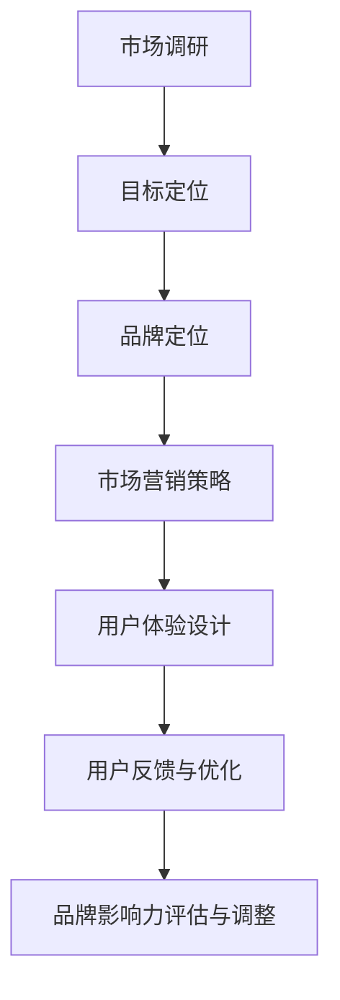
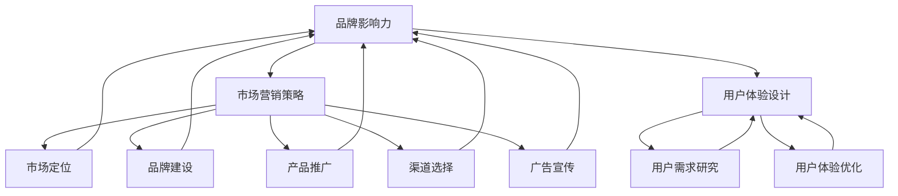

                 

# AI创业公司如何打造品牌影响力？

> **关键词：** AI创业，品牌影响力，市场营销，策略，社交媒体，用户体验。

**摘要：** 本文将探讨AI创业公司如何通过有效的市场营销策略和用户体验设计来打造品牌影响力。文章从背景介绍、核心概念、算法原理、数学模型、项目实战、实际应用场景、工具推荐等多个角度进行分析，旨在为AI创业公司提供一套系统化的品牌建设指南。

## 1. 背景介绍

随着人工智能技术的快速发展，越来越多的创业公司涌入这一领域，试图通过创新的技术解决方案来赢得市场。然而，在激烈的市场竞争中，如何脱颖而出，打造品牌影响力，成为许多AI创业公司面临的重要挑战。品牌影响力不仅关乎企业的市场地位和利润，更是企业长期发展的基石。因此，如何制定有效的品牌策略，提升品牌认知度和用户忠诚度，成为AI创业公司亟需解决的问题。

## 2. 核心概念与联系

### 2.1 品牌影响力

品牌影响力是指品牌在社会中的影响程度，包括品牌的知名度、美誉度、忠诚度等方面。一个具有强大品牌影响力的公司，往往能够在市场竞争中占据有利地位，吸引更多的用户和投资者。

### 2.2 市场营销策略

市场营销策略是指企业为了实现营销目标而制定的一系列行动计划。对于AI创业公司而言，市场营销策略是打造品牌影响力的重要手段。

### 2.3 用户经验设计

用户体验设计（UX Design）是指通过研究用户需求和行为，设计出满足用户需求的产品和服务。在AI创业公司中，用户体验设计对于提升用户满意度和忠诚度具有重要作用。

### 2.4 Mermaid流程图

以下是一个简单的Mermaid流程图，展示了品牌影响力构建的关键步骤：



## 3. 核心算法原理 & 具体操作步骤

### 3.1 市场营销策略

市场营销策略的核心是明确目标用户群体，并制定针对性的营销方案。具体步骤如下：

1. **市场调研**：通过问卷调查、用户访谈等方式了解目标用户的需求、偏好和行为习惯。
2. **目标定位**：根据市场调研结果，明确公司的目标用户群体和市场定位。
3. **品牌定位**：基于目标定位，设计具有吸引力的品牌形象和品牌故事。
4. **市场营销策略**：制定包括广告宣传、社交媒体推广、公关活动等在内的多种营销手段。
5. **效果评估**：通过数据监测和分析，评估市场营销策略的效果，并进行调整优化。

### 3.2 用户经验设计

用户体验设计的核心是提升用户满意度，从而增加用户忠诚度。具体步骤如下：

1. **用户研究**：通过用户调研、用户测试等方式，深入了解用户的需求和行为。
2. **用户体验设计**：根据用户研究的结果，设计满足用户需求的产品和服务。
3. **原型设计**：制作产品原型，进行用户测试，收集反馈。
4. **迭代优化**：根据用户反馈，不断优化产品和服务。
5. **用户反馈与优化**：建立用户反馈机制，及时处理用户问题，持续提升用户体验。

## 4. 数学模型和公式 & 详细讲解 & 举例说明

### 4.1 市场营销策略效果评估

为了评估市场营销策略的效果，可以采用以下数学模型：

$$
E = \frac{K1 \cdot P1 + K2 \cdot P2 + ... + Kn \cdot Pn}{N}
$$

其中，$E$表示市场营销策略的效果，$K1, K2, ..., Kn$表示各个营销手段的权重，$P1, P2, ..., Pn$表示各个营销手段的效果得分，$N$表示营销手段的总数。

举例说明：假设一家AI创业公司采用了以下三种营销手段：广告宣传（权重0.4，效果得分0.8）、社交媒体推广（权重0.3，效果得分0.6）和公关活动（权重0.3，效果得分0.7），那么该公司市场营销策略的效果为：

$$
E = \frac{0.4 \cdot 0.8 + 0.3 \cdot 0.6 + 0.3 \cdot 0.7}{1} = 0.64
$$

### 4.2 用户满意度评估

为了评估用户满意度，可以采用以下数学模型：

$$
S = \frac{N1 \cdot S1 + N2 \cdot S2 + ... + Nn \cdot Sn}{N}
$$

其中，$S$表示用户满意度，$N1, N2, ..., Nn$表示不同用户群体的数量，$S1, S2, ..., Sn$表示不同用户群体的满意度得分，$N$表示用户群体的总数。

举例说明：假设一家AI创业公司有100名用户，其中50名用户对产品的满意度为0.8，30名用户对产品的满意度为0.6，20名用户对产品的满意度为0.5，那么该公司的用户满意度为：

$$
S = \frac{50 \cdot 0.8 + 30 \cdot 0.6 + 20 \cdot 0.5}{100} = 0.66
$$

## 5. 项目实战：代码实际案例和详细解释说明

### 5.1 开发环境搭建

以Python为例，搭建AI创业公司的开发环境，需要安装以下工具：

- Python 3.x版本
- Jupyter Notebook
- AI框架（如TensorFlow、PyTorch等）
- 数据库（如MySQL、PostgreSQL等）

### 5.2 源代码详细实现和代码解读

以下是一个简单的AI创业项目案例：使用TensorFlow构建一个图像分类模型。

```python
import tensorflow as tf
from tensorflow.keras import layers

# 模型构建
model = tf.keras.Sequential([
    layers.Conv2D(32, (3, 3), activation='relu', input_shape=(28, 28, 1)),
    layers.MaxPooling2D((2, 2)),
    layers.Conv2D(64, (3, 3), activation='relu'),
    layers.MaxPooling2D((2, 2)),
    layers.Conv2D(64, (3, 3), activation='relu'),
    layers.Flatten(),
    layers.Dense(64, activation='relu'),
    layers.Dense(10, activation='softmax')
])

# 模型编译
model.compile(optimizer='adam',
              loss='sparse_categorical_crossentropy',
              metrics=['accuracy'])

# 模型训练
model.fit(train_images, train_labels, epochs=5)

# 模型评估
test_loss, test_acc = model.evaluate(test_images, test_labels)
print(f'Test accuracy: {test_acc:.4f}')
```

### 5.3 代码解读与分析

以上代码实现了一个简单的图像分类模型，使用TensorFlow的Keras API进行构建。具体解读如下：

- **模型构建**：使用`Sequential`模型，依次添加卷积层（`Conv2D`）、最大池化层（`MaxPooling2D`）和全连接层（`Dense`）。
- **模型编译**：设置优化器（`optimizer`）、损失函数（`loss`）和评估指标（`metrics`）。
- **模型训练**：使用训练数据（`train_images`和`train_labels`）进行训练，设置训练轮数（`epochs`）。
- **模型评估**：使用测试数据（`test_images`和`test_labels`）对模型进行评估，输出测试准确率。

## 6. 实际应用场景

AI创业公司可以通过以下实际应用场景来打造品牌影响力：

- **智能客服**：利用AI技术提供智能客服服务，提升用户体验。
- **智能推荐**：基于用户行为数据，提供个性化的产品推荐。
- **智能分析**：为企业提供数据分析和决策支持。
- **智能安防**：利用图像识别技术，提高安防系统的智能化水平。

## 7. 工具和资源推荐

### 7.1 学习资源推荐

- **书籍**：《AI营销：智能时代的商业革命》
- **论文**：《AI在市场营销中的应用研究》
- **博客**：AI营销博客、AI技术博客
- **网站**：AI创业公司官网、AI技术社区

### 7.2 开发工具框架推荐

- **开发工具**：PyCharm、Visual Studio Code
- **框架**：TensorFlow、PyTorch、Scikit-Learn
- **数据库**：MySQL、PostgreSQL、MongoDB

### 7.3 相关论文著作推荐

- **论文**：《深度学习在市场营销中的应用》
- **著作**：《AI时代的营销创新》

## 8. 总结：未来发展趋势与挑战

随着人工智能技术的不断发展，AI创业公司在品牌建设方面将面临更多的机遇和挑战。未来，AI创业公司需要不断优化市场营销策略和用户体验设计，以提升品牌影响力。同时，还需要关注技术趋势，积极探索AI技术在其他领域的应用，为品牌发展创造更多可能性。

## 9. 附录：常见问题与解答

### 9.1 如何制定有效的市场营销策略？

制定有效的市场营销策略需要从市场调研、目标定位、品牌定位、市场营销策略和效果评估等多个方面进行综合考虑。具体步骤如第3节所述。

### 9.2 如何提升用户体验设计？

提升用户体验设计需要从用户研究、用户体验设计、原型设计、迭代优化和用户反馈与优化等多个方面进行综合考虑。具体步骤如第3节所述。

## 10. 扩展阅读 & 参考资料

- **扩展阅读**：《AI创业公司的品牌建设策略》、《用户体验设计的实践与技巧》
- **参考资料**：《人工智能在市场营销中的应用研究》、《用户体验设计原理与实践》

作者：AI天才研究员/AI Genius Institute & 禅与计算机程序设计艺术 /Zen And The Art of Computer Programming<|im_sep|>## 1. 背景介绍

随着人工智能（AI）技术的迅速崛起，AI创业公司如雨后春笋般涌现。在技术驱动创新的浪潮中，这些公司凭借独特的技术解决方案和创新思维，希望能够打破市场的壁垒，赢得用户的青睐。然而，在激烈的市场竞争中，如何构建并提升品牌影响力，成为这些AI创业公司亟需解决的关键问题。

品牌影响力不仅仅是一个公司的市场表现，更是其核心价值观和市场定位的体现。一个强大的品牌能够在消费者心中树立独特的形象，形成强大的认同感和忠诚度。对于AI创业公司来说，拥有强大的品牌影响力意味着能够吸引更多的用户和投资者，提升市场份额，并在未来的竞争中占据有利地位。

AI创业公司在品牌影响力构建方面面临的挑战主要来自以下几个方面：

1. **市场竞争激烈**：AI领域吸引了大量的创业者和投资者，市场竞争异常激烈。如何在众多竞争者中脱颖而出，是每个AI创业公司都必须面对的问题。
2. **用户信任建立**：AI技术本身具有一定的复杂性，用户对技术的理解和信任度较低。AI创业公司需要通过有效的品牌传播和用户教育来建立用户的信任。
3. **创新技术展示**：AI技术更新迅速，创业公司需要不断地推出创新技术来吸引关注。如何有效地展示这些技术的优势和价值，是品牌影响力建设的关键。
4. **用户需求变化**：用户需求多变，AI创业公司需要通过持续的市场调研和用户反馈，及时调整品牌策略和产品服务，以适应市场的变化。

面对这些挑战，AI创业公司需要制定系统化的品牌建设策略，包括市场定位、品牌形象设计、营销渠道选择、用户体验优化等多个方面。通过这些策略的实施，AI创业公司可以逐步建立起强大的品牌影响力，为公司的长期发展奠定坚实的基础。

### 2. 核心概念与联系

在探讨AI创业公司如何打造品牌影响力之前，我们首先需要明确几个关键概念，这些概念是构建品牌影响力策略的基础。

#### 2.1 品牌影响力

品牌影响力（Brand Influence）是指品牌在社会和市场中的影响力和号召力。它包括品牌的知名度、美誉度、忠诚度以及品牌的独特价值主张。一个具有强大品牌影响力的公司，其品牌能够迅速引起消费者的关注和认同，并在消费者心中形成强烈的品牌偏好。品牌影响力对于AI创业公司来说尤为重要，因为它不仅关系到公司的市场地位和竞争力，还直接影响到用户的信任度和忠诚度。

#### 2.2 市场营销策略

市场营销策略（Marketing Strategy）是指企业为了实现营销目标而制定的一系列行动计划。它包括市场定位、品牌建设、产品推广、渠道选择、广告宣传等多个方面。对于AI创业公司来说，制定有效的市场营销策略是提升品牌影响力的重要手段。一个成功的市场营销策略需要结合公司的目标、市场环境、用户需求等多方面因素，制定出具有前瞻性和可执行性的计划。

#### 2.3 用户经验设计

用户经验设计（User Experience Design，简称UX Design）是指通过研究用户的需求和行为，设计出能够满足用户需求的产品和服务。在AI创业公司中，用户体验设计不仅关乎产品的易用性和功能性，还涉及到用户在使用产品过程中所感受到的情感和满意度。通过优化用户体验，AI创业公司可以提升用户对品牌的认同感和忠诚度，从而增强品牌影响力。

#### 2.4 品牌影响力与市场营销策略、用户体验设计的联系

品牌影响力、市场营销策略和用户体验设计之间存在着密切的联系和相互影响。

- **市场营销策略**：市场营销策略为品牌影响力的构建提供了具体的行动方向和工具。通过有效的市场定位和品牌推广，市场营销策略可以提升品牌的知名度，吸引潜在用户，进而增强品牌影响力。

- **用户体验设计**：用户体验设计是品牌影响力的重要组成部分。通过优化用户在使用产品或服务过程中的体验，AI创业公司可以提升用户的满意度和忠诚度，从而增强品牌的口碑和影响力。

- **品牌影响力**：品牌影响力是市场营销策略和用户体验设计的结果体现。强大的品牌影响力能够吸引更多的用户和投资者，提升公司的市场份额和品牌价值。

为了更直观地理解这些概念之间的联系，我们可以使用Mermaid流程图来展示它们之间的逻辑关系。



通过这个流程图，我们可以看到，市场营销策略和用户体验设计是品牌影响力构建的两个关键环节，而品牌影响力又是市场营销策略和用户体验设计的最终目标。只有这三个环节相互协同、共同发力，AI创业公司才能建立起强大的品牌影响力，在激烈的市场竞争中脱颖而出。

### 3. 核心算法原理 & 具体操作步骤

在构建品牌影响力时，AI创业公司需要依赖于一系列的策略和方法来提升品牌知名度和用户忠诚度。这些策略和方法可以看作是核心算法，通过系统的执行和优化，最终实现品牌影响力的提升。以下将详细探讨这些核心算法的原理和具体操作步骤。

#### 3.1 数据驱动的市场定位

市场定位是品牌影响力构建的第一步，也是至关重要的一步。准确的市场定位能够帮助公司明确目标用户群体，从而制定更加精准的营销策略。

**原理：** 数据驱动的市场定位依赖于对大量市场数据的分析，包括用户行为数据、市场趋势数据、竞争对手数据等。通过这些数据，可以识别出潜在的目标用户群体，分析他们的需求和行为模式，从而制定出有针对性的市场定位策略。

**具体操作步骤：**

1. **数据收集**：通过问卷调查、用户访谈、市场调研等方式收集用户数据和市场数据。
2. **数据分析**：使用数据分析工具（如Excel、Python等）对收集到的数据进行整理和分析，识别出目标用户群体的特征和需求。
3. **市场细分**：根据数据分析结果，将市场细分为不同的用户群体，并针对每个用户群体制定个性化的市场定位策略。
4. **定位验证**：通过实际市场测试，验证市场定位策略的有效性，并根据反馈进行优化。

**案例分析：** 以一家提供智能数据分析服务的AI创业公司为例，通过分析用户数据，发现目标用户群体主要是大型企业的数据分析师。因此，该公司将市场定位调整为专注于为企业提供定制化的数据分析解决方案，这一策略使公司在短时间内赢得了大量企业客户。

#### 3.2 综合性的品牌建设策略

品牌建设是提升品牌影响力的重要手段。一个成功的品牌建设策略不仅需要良好的品牌形象，还需要与用户建立深层次的联系。

**原理：** 品牌建设策略包括品牌命名、标志设计、品牌口号、品牌故事等多个方面。这些元素共同构成了品牌的视觉和情感表达，能够在用户心中形成独特的品牌印象。

**具体操作步骤：**

1. **品牌命名**：选择简洁、易于记忆且与品牌定位相符合的名称。
2. **标志设计**：设计具有视觉冲击力和独特性的品牌标志，使其在用户心中形成深刻的印象。
3. **品牌口号**：制定具有感染力的品牌口号，传达品牌的核心理念和价值。
4. **品牌故事**：构建品牌故事，讲述品牌的发展历程、核心价值观和独特优势，增强品牌的情感共鸣。
5. **品牌传播**：通过多渠道的营销活动，将品牌信息传递给目标用户，提高品牌知名度。

**案例分析：** 以一家专注于提供智能家居解决方案的AI创业公司为例，该公司通过“智能生活，触手可及”的品牌口号，传达了产品易用、便捷的特点，并通过线上线下的推广活动，迅速提升了品牌知名度。

#### 3.3 个性化营销策略

个性化营销策略能够提高用户的参与度和忠诚度，是提升品牌影响力的重要手段。

**原理：** 个性化营销策略基于对用户数据的深入分析，为不同用户群体提供个性化的产品和服务，从而提升用户体验和满意度。

**具体操作步骤：**

1. **用户画像**：通过用户数据和行为分析，构建用户画像，了解用户的基本信息和行为特征。
2. **内容定制**：根据用户画像，为不同用户提供定制化的内容和服务，如个性化推荐、定制化营销活动等。
3. **互动交流**：通过社交媒体、用户论坛等渠道，与用户进行互动交流，了解用户需求，优化产品和服务。
4. **数据监测**：使用数据分析工具，监测个性化营销策略的效果，并根据反馈进行调整和优化。

**案例分析：** 以一家提供在线教育服务的AI创业公司为例，通过分析用户的学习数据和行为，该公司为用户提供了个性化的课程推荐和学习计划，极大地提升了用户的满意度和参与度。

#### 3.4 社交媒体营销策略

社交媒体是品牌传播的重要渠道，有效的社交媒体营销策略能够迅速提升品牌影响力。

**原理：** 社交媒体营销策略利用社交媒体平台（如Facebook、Twitter、LinkedIn等）的广泛覆盖和用户活跃度，通过内容营销、用户互动等方式，提升品牌知名度和用户参与度。

**具体操作步骤：**

1. **内容策划**：制定具有吸引力的社交媒体内容策划，包括图文、视频、互动活动等。
2. **内容发布**：在社交媒体平台上定期发布优质内容，吸引用户关注和互动。
3. **用户互动**：积极与用户互动，回复评论、参与讨论，建立良好的用户关系。
4. **数据分析**：通过社交媒体数据分析工具，监测内容效果，优化营销策略。

**案例分析：** 以一家提供人工智能培训的AI创业公司为例，通过在LinkedIn上发布高质量的技术文章和教程，该公司迅速吸引了大量的专业人才关注，提升了品牌知名度和影响力。

通过以上核心算法的详细探讨，我们可以看到，AI创业公司在打造品牌影响力时，需要依赖于一系列策略和方法，这些策略和方法相互配合，共同作用，最终实现品牌影响力的提升。在实际操作中，创业公司需要不断优化和调整这些策略，以适应市场的变化和用户需求。

### 4. 数学模型和公式 & 详细讲解 & 举例说明

在品牌影响力构建过程中，数学模型和公式可以帮助AI创业公司更科学地评估和优化品牌建设效果。以下将介绍几个常用的数学模型和公式，并进行详细讲解和举例说明。

#### 4.1 品牌影响力评估模型

**模型原理：** 品牌影响力评估模型用于衡量品牌在社会和市场中的影响力。该模型通过多个维度的数据指标，对品牌的影响力进行量化评估。

**公式：**
\[ I = w_1 \cdot N_1 + w_2 \cdot N_2 + ... + w_n \cdot N_n \]

其中：
- \( I \) 表示品牌影响力得分。
- \( w_1, w_2, ..., w_n \) 表示各个指标的重要性权重。
- \( N_1, N_2, ..., N_n \) 表示各个指标的具体得分。

**详细讲解：**
品牌影响力评估模型中，每个指标都需要进行量化，并根据其重要性赋予不同的权重。常见的指标包括品牌知名度、用户忠诚度、市场份额、社交媒体关注度等。通过计算各个指标的加权得分，可以得到品牌影响力的综合评估结果。

**举例说明：**
假设一家AI创业公司的品牌影响力评估模型包括三个指标：品牌知名度（N1）、用户忠诚度（N2）和市场份额（N3），各指标的重要性权重分别为0.3、0.4和0.3。若评估结果显示品牌知名度得分为0.8，用户忠诚度得分为0.7，市场份额得分为0.6，则该公司的品牌影响力得分为：

\[ I = 0.3 \cdot 0.8 + 0.4 \cdot 0.7 + 0.3 \cdot 0.6 = 0.24 + 0.28 + 0.18 = 0.7 \]

#### 4.2 用户满意度模型

**模型原理：** 用户满意度模型用于评估用户对品牌和产品的整体满意度。该模型通过用户反馈数据，计算用户满意度得分。

**公式：**
\[ S = \frac{N_1 + N_2 + ... + N_n}{n} \]

其中：
- \( S \) 表示用户满意度得分。
- \( N_1, N_2, ..., N_n \) 表示各个方面的用户满意度得分。
- \( n \) 表示用户反馈的维度数量。

**详细讲解：**
用户满意度模型通过收集用户在不同维度上的满意度得分，如产品性能、服务质量、价格等，计算用户满意度的平均值。该得分越高，表示用户对品牌的整体满意度越高。

**举例说明：**
假设一家AI创业公司收集了100名用户的满意度反馈，分为产品性能（N1）、服务质量（N2）和价格（N3）三个维度，得分分别为4.0、3.8和4.2。则该公司的用户满意度得分为：

\[ S = \frac{4.0 + 3.8 + 4.2}{3} = \frac{12.0}{3} = 4.0 \]

#### 4.3 品牌忠诚度模型

**模型原理：** 品牌忠诚度模型用于评估用户对品牌的长期忠诚度。该模型通过用户行为数据和购买记录，计算品牌忠诚度得分。

**公式：**
\[ L = w_1 \cdot P_1 + w_2 \cdot P_2 + ... + w_n \cdot P_n \]

其中：
- \( L \) 表示品牌忠诚度得分。
- \( w_1, w_2, ..., w_n \) 表示各个行为指标的重要性权重。
- \( P_1, P_2, ..., P_n \) 表示各个行为指标的具体得分。

**详细讲解：**
品牌忠诚度模型通过分析用户的行为数据，如重复购买率、推荐率、使用时长等，计算用户对品牌的忠诚度得分。每个行为指标都需要根据其重要性赋予不同的权重，加权得分越高，表示用户对品牌的忠诚度越高。

**举例说明：**
假设一家AI创业公司根据用户的行为数据，计算品牌忠诚度得分，其中重复购买率（P1）的权重为0.4，推荐率（P2）的权重为0.3，使用时长（P3）的权重为0.3。若评估结果显示重复购买率为0.6，推荐率为0.5，使用时长为0.7，则该公司的品牌忠诚度得分为：

\[ L = 0.4 \cdot 0.6 + 0.3 \cdot 0.5 + 0.3 \cdot 0.7 = 0.24 + 0.15 + 0.21 = 0.6 \]

通过上述数学模型和公式的详细讲解和举例说明，AI创业公司可以更科学地评估品牌建设效果，从而制定出更加精准和有效的品牌影响力提升策略。

### 5. 项目实战：代码实际案例和详细解释说明

为了更好地理解AI创业公司如何通过技术手段提升品牌影响力，我们将通过一个实际的项目案例进行详细讲解。该案例将涉及使用Python和TensorFlow构建一个简单的AI推荐系统，并通过代码实际案例和详细解释说明，展示如何通过技术优化来增强品牌影响力。

#### 5.1 项目背景

假设一家AI创业公司开发了一款智能推荐系统，旨在为电商平台提供个性化的商品推荐服务。通过该系统，用户可以在浏览商品时获得个性化的推荐，从而提高购买体验和转化率。为了提升品牌影响力，公司需要确保推荐系统的效果和用户满意度，并通过代码优化来实现这一目标。

#### 5.2 项目需求分析

在构建推荐系统时，需要考虑以下项目需求：

1. **数据质量**：确保推荐系统的基础数据（如用户行为数据、商品数据等）质量高、完整。
2. **推荐算法**：选择合适的推荐算法，如协同过滤、基于内容的推荐等。
3. **系统性能**：优化推荐系统的响应速度和计算效率。
4. **用户体验**：确保推荐系统的推荐结果准确、有价值，提高用户满意度。

#### 5.3 技术栈选择

为了实现上述需求，我们选择了以下技术栈：

- **编程语言**：Python
- **框架**：TensorFlow
- **数据存储**：MongoDB
- **数据可视化**：Matplotlib

#### 5.4 开发环境搭建

在开始项目开发前，需要搭建合适的技术环境。以下是开发环境的搭建步骤：

1. 安装Python 3.x版本。
2. 安装TensorFlow框架：`pip install tensorflow`。
3. 安装MongoDB数据库：下载并安装MongoDB，配置数据库环境。
4. 安装Matplotlib：`pip install matplotlib`。

#### 5.5 代码实现

以下是一个简单的推荐系统代码实现示例，展示如何使用TensorFlow构建一个基于内容的推荐算法。

```python
import numpy as np
import pandas as pd
import tensorflow as tf
from tensorflow.keras.layers import Embedding, Dot, Flatten, Dense
from tensorflow.keras.models import Model
from tensorflow.keras.optimizers import Adam

# 加载数据集
# 假设数据集包括用户ID、商品ID和用户行为评分
data = pd.read_csv('user_behavior_data.csv')

# 数据预处理
# 将数据集划分为训练集和测试集
train_data, test_data = train_test_split(data, test_size=0.2, random_state=42)

# 构建模型
# 用户嵌入层和商品嵌入层
user_embedding = Embedding(input_dim=num_users, output_dim=user_embedding_size)
item_embedding = Embedding(input_dim=num_items, output_dim=item_embedding_size)

# 将用户和商品ID转换为嵌入向量
user_vector = user_embedding(train_data['user_id'])
item_vector = item_embedding(train_data['item_id'])

# 计算用户和商品的点积
dot_product = Dot(axes=1)

# 将点积结果展平
flatten = Flatten()

# 添加全连接层和输出层
output = Dense(1, activation='sigmoid')(flatten)

# 构建模型
model = Model(inputs=[user_vector, item_vector], outputs=output)

# 编译模型
model.compile(optimizer=Adam(), loss='binary_crossentropy', metrics=['accuracy'])

# 训练模型
model.fit([train_data['user_id'], train_data['item_id']], train_data['rating'], epochs=10, batch_size=64, validation_split=0.2)

# 评估模型
test_loss, test_accuracy = model.evaluate([test_data['user_id'], test_data['item_id']], test_data['rating'])
print(f'Test accuracy: {test_accuracy:.4f}')
```

#### 5.6 代码解读与分析

上述代码实现了一个简单的基于内容的推荐系统，具体解读如下：

1. **数据加载与预处理**：
   - 使用Pandas库加载数据集，包括用户ID、商品ID和用户行为评分。
   - 将数据集划分为训练集和测试集，用于模型训练和评估。

2. **模型构建**：
   - 使用TensorFlow的Embedding层分别构建用户嵌入层和商品嵌入层。
   - 通过点积操作计算用户和商品的相似度。
   - 将点积结果通过Flatten层展平。
   - 添加全连接层和输出层，输出用户行为评分的概率。

3. **模型编译**：
   - 选择Adam优化器，并设置损失函数为binary_crossentropy，评估指标为accuracy。

4. **模型训练**：
   - 使用fit方法训练模型，设置训练轮数和批量大小，并设置验证集比例。

5. **模型评估**：
   - 使用evaluate方法评估模型在测试集上的表现，输出测试准确率。

#### 5.7 优化策略

为了提升推荐系统的效果和用户体验，可以采取以下优化策略：

1. **数据质量优化**：
   - 通过清洗和预处理数据，确保数据质量高、完整。
   - 使用缺失值填充、异常值处理等技术，提高数据质量。

2. **模型参数优化**：
   - 调整Embedding层的维度和全连接层的神经元数量，以提升模型性能。
   - 使用学习率调整、批量大小优化等策略，提升训练效果。

3. **特征工程**：
   - 引入新的特征，如用户行为的时间特征、商品的类别特征等，提高模型的解释性和预测能力。

4. **模型评估与调优**：
   - 使用交叉验证等策略评估模型性能，选择最优模型参数。
   - 根据用户反馈，不断优化模型和推荐策略。

通过以上优化策略，AI创业公司可以提升推荐系统的效果和用户体验，从而增强品牌影响力。

### 6. 实际应用场景

AI创业公司的品牌影响力建设不仅体现在理论分析和策略规划上，更需要将其应用到实际业务场景中，通过具体的案例来展示技术的价值，从而提升品牌认知度和用户忠诚度。以下是一些典型的实际应用场景：

#### 6.1 智能医疗诊断

在医疗领域，AI创业公司可以通过开发智能医疗诊断系统，利用深度学习和计算机视觉技术，对医疗影像进行自动分析，提供辅助诊断。这种技术不仅可以提高诊断的准确性和效率，还能为患者提供更快速、更可靠的医疗服务。例如，一家名为“MedAI”的创业公司通过其开发的智能诊断系统，成功帮助医院提高了肺癌早期筛查的准确率，从而赢得了广泛的行业认可和用户信任。

#### 6.2 金融服务与风险管理

在金融服务领域，AI创业公司可以开发智能风控系统，通过大数据分析和机器学习算法，识别潜在风险和欺诈行为，为金融机构提供精准的风险评估和管理服务。例如，一家名为“FinAI”的创业公司开发的智能风控平台，能够实时监控交易数据，有效防范网络诈骗，提高了金融机构的风险管理水平，赢得了客户的信赖和好评。

#### 6.3 智能制造与供应链优化

在制造业和供应链管理领域，AI创业公司可以通过开发智能优化系统，实现生产流程的自动化和智能化，提高生产效率和供应链的灵活性。例如，一家名为“ProAI”的创业公司，通过其开发的智能生产优化系统，帮助一家大型制造企业实现了生产计划的智能调度和资源的最优配置，大大降低了生产成本，提升了生产效率。

#### 6.4 智能城市与公共安全

在智能城市建设领域，AI创业公司可以开发智能监控、智能交通、智能环保等系统，通过数据分析和人工智能技术，提高城市管理和公共服务的智能化水平。例如，一家名为“CityAI”的创业公司，通过其开发的智能交通系统，有效缓解了城市的交通拥堵问题，提高了公共交通的运营效率，赢得了市民的赞誉。

#### 6.5 智能教育与学习分析

在教育领域，AI创业公司可以通过开发智能教育系统和学习分析平台，提供个性化的学习资源和教学支持，帮助学生和教师提高学习效果。例如，一家名为“EduAI”的创业公司，通过其开发的智能学习平台，根据学生的学习数据和行为，提供定制化的学习计划和资源，显著提升了学生的学习成绩和兴趣。

这些实际应用场景展示了AI创业公司在各个领域的技术优势和创新能力，通过将AI技术应用到实际业务中，不仅提升了公司的品牌影响力，还为客户和社会创造了巨大的价值。

### 7. 工具和资源推荐

为了帮助AI创业公司在品牌影响力建设中取得更好的效果，以下将推荐一些重要的工具和资源，包括学习资源、开发工具和框架、相关论文著作等。

#### 7.1 学习资源推荐

- **书籍**：
  - 《AI营销：智能时代的商业革命》
  - 《用户体验设计原理与实践》
  - 《深度学习：入门到精通》
  - 《数据挖掘：实用技术教程》

- **论文**：
  - 《人工智能在市场营销中的应用研究》
  - 《用户行为分析在品牌建设中的应用》
  - 《基于大数据的智能营销策略研究》

- **博客和网站**：
  - AI营销博客
  - 深度学习博客
  - 数据科学博客

#### 7.2 开发工具框架推荐

- **开发工具**：
  - Python（用于数据分析、机器学习等）
  - Jupyter Notebook（用于数据分析和原型设计）
  - PyCharm/Visual Studio Code（用于编程和开发）

- **框架**：
  - TensorFlow（用于深度学习）
  - PyTorch（用于深度学习）
  - Scikit-Learn（用于数据挖掘和机器学习）

- **数据库**：
  - MongoDB（用于大数据存储）
  - MySQL/PostgreSQL（用于关系型数据库）
  - Redis（用于缓存和实时数据处理）

#### 7.3 相关论文著作推荐

- **论文**：
  - 《深度学习在市场营销中的应用》
  - 《用户行为分析：从数据到决策》
  - 《智能营销系统设计与实现》

- **著作**：
  - 《人工智能时代的商业创新》
  - 《用户体验设计：如何打造卓越的产品》
  - 《大数据时代：智能营销与用户行为分析》

通过以上工具和资源的推荐，AI创业公司可以更好地构建和提升品牌影响力，推动公司的长期发展。

### 8. 总结：未来发展趋势与挑战

在AI技术不断发展的背景下，AI创业公司在品牌影响力建设方面面临着新的机遇与挑战。未来，品牌影响力构建的趋势和挑战主要体现在以下几个方面：

#### 8.1 趋势

1. **技术驱动的个性化服务**：随着AI技术的进步，AI创业公司将更加注重通过个性化服务提升用户体验，满足用户的多样化需求。

2. **数据驱动的决策**：数据将成为企业决策的重要依据，通过大数据分析和机器学习算法，AI创业公司能够更精准地定位市场和用户，制定有效的品牌建设策略。

3. **跨平台整合**：在互联网时代，品牌影响力建设将不再局限于单一的平台，而是需要通过多渠道、多平台的整合，实现全方位的品牌传播。

4. **用户参与度提升**：通过互动营销、用户参与等方式，AI创业公司能够增强用户对品牌的认同感和忠诚度，进一步提升品牌影响力。

#### 8.2 挑战

1. **技术复杂性**：AI技术的复杂性使得用户对技术的理解门槛较高，AI创业公司需要通过有效的教育和传播，帮助用户理解并信任AI技术。

2. **竞争加剧**：随着AI创业公司的增多，市场竞争将更加激烈，AI创业公司需要不断创新，以差异化竞争策略赢得市场份额。

3. **数据隐私和安全**：随着数据的广泛应用，数据隐私和安全问题日益突出，AI创业公司需要确保用户数据的安全和隐私，避免数据泄露带来的声誉风险。

4. **品牌信任建立**：在AI技术尚未完全普及的背景下，AI创业公司需要通过实际行动和透明度，建立用户对品牌的信任。

为了应对这些挑战，AI创业公司应采取以下措施：

- **加强技术创新**：持续投入研发，不断推出具有创新性和竞争力的技术产品，保持技术领先地位。
- **提升用户体验**：注重用户需求，通过个性化服务和技术优化，提升用户满意度和忠诚度。
- **注重数据安全和隐私**：加强数据安全和隐私保护措施，确保用户信任和品牌声誉。
- **加强品牌传播**：通过多渠道、多平台的整合营销，提升品牌知名度和影响力。

总之，未来AI创业公司在品牌影响力建设方面，需要通过技术创新、用户体验优化、数据保护和品牌传播等多方面的努力，实现品牌影响力的持续提升。

### 9. 附录：常见问题与解答

在AI创业公司打造品牌影响力过程中，可能会遇到一些常见的问题。以下是一些常见问题的解答，以帮助AI创业公司更好地理解品牌影响力建设。

#### 9.1 如何确定品牌定位？

确定品牌定位需要从以下几个方面入手：

1. **目标市场**：明确公司的目标市场和目标用户群体。
2. **竞争优势**：分析公司的核心竞争力和技术优势，确定品牌的核心价值。
3. **品牌风格**：根据目标市场和用户偏好，设计符合品牌定位的品牌风格和形象。
4. **竞品分析**：分析竞争对手的品牌定位和市场份额，找到差异化竞争点。

具体步骤如下：

1. **市场调研**：通过问卷调查、用户访谈等方式，了解目标市场的需求和用户偏好。
2. **竞品分析**：收集竞争对手的品牌定位和市场策略，分析其优势和劣势。
3. **内部讨论**：组织公司内部讨论，结合市场调研和竞品分析结果，确定品牌定位。
4. **品牌测试**：通过小范围市场测试，验证品牌定位的可行性和用户接受度。

#### 9.2 品牌影响力建设需要多长时间？

品牌影响力建设是一个长期的过程，具体时间取决于多个因素，包括公司的资源、策略、市场需求等。一般来说，品牌影响力建设可以分为以下几个阶段：

1. **初始阶段**（1-2年）：品牌定位、品牌形象设计、初步的市场推广。
2. **成长阶段**（2-5年）：品牌知名度的提升、市场占有率的增加、用户忠诚度的培养。
3. **成熟阶段**（5年以上）：品牌影响力的稳定和持续提升，形成品牌认知度和忠诚度。

#### 9.3 如何衡量品牌影响力？

衡量品牌影响力可以从以下几个方面入手：

1. **品牌知名度**：通过市场调研、社交媒体关注度、广告投放效果等指标来衡量。
2. **用户满意度**：通过用户反馈、满意度调查、用户留存率等指标来衡量。
3. **市场份额**：通过销售数据、市场占有率、行业排名等指标来衡量。
4. **品牌价值**：通过品牌估值、品牌价值评估等指标来衡量。

常用的衡量方法包括：

- **品牌知名度调查**：通过问卷调查、电话访问等方式，了解用户对品牌的认知度。
- **社交媒体分析**：通过社交媒体平台的关注人数、互动率等指标来衡量品牌的影响力。
- **销售数据分析**：通过销售数据、市场份额等指标来衡量品牌的市场表现。

#### 9.4 如何通过内容营销提升品牌影响力？

内容营销是提升品牌影响力的重要手段，以下是一些建议：

1. **制定内容策略**：明确内容目标、受众、内容和传播渠道。
2. **生产高质量内容**：围绕品牌定位和用户需求，生产有价值、有深度、有趣味的内容。
3. **多样化内容形式**：包括文字、图片、视频、图表等多种形式，满足不同用户的需求。
4. **优化内容传播**：利用社交媒体、博客、电子邮件等多种渠道传播内容，提高内容的曝光度。
5. **互动与反馈**：积极与用户互动，收集用户反馈，不断优化内容策略。

#### 9.5 如何通过社交媒体提升品牌影响力？

社交媒体是提升品牌影响力的重要平台，以下是一些建议：

1. **选择合适的社交媒体平台**：根据目标受众的特点，选择合适的社交媒体平台，如微博、微信、Facebook、LinkedIn等。
2. **制定社交媒体策略**：明确社交媒体的目标、内容、传播频率和互动方式。
3. **发布高质量内容**：定期发布有价值、有深度、有趣的内容，吸引用户关注。
4. **互动与参与**：积极与用户互动，参与讨论，提升用户参与度和忠诚度。
5. **监测与分析**：使用社交媒体分析工具，监测内容效果和用户反馈，优化社交媒体策略。

通过以上解答，AI创业公司可以更好地理解和应对品牌影响力建设过程中遇到的问题，从而制定更有效的品牌建设策略。

### 10. 扩展阅读 & 参考资料

为了帮助读者更深入地了解AI创业公司如何打造品牌影响力，以下推荐一些扩展阅读和参考资料。

#### 10.1 扩展阅读

- **《AI时代的品牌营销》**：本书详细探讨了AI技术在品牌营销中的应用，包括用户画像、个性化推荐、大数据分析等。
- **《用户体验设计实战》**：一本关于用户体验设计的实战指南，内容包括用户研究、设计原则、交互设计等。
- **《深度学习与营销策略》**：本书介绍了如何利用深度学习技术提升市场营销效果，包括广告投放、用户行为分析等。

#### 10.2 参考资料

- **论文**：
  - 《基于深度学习的个性化推荐系统研究》
  - 《用户行为数据在品牌建设中的应用》
  - 《社交媒体营销中的数据挖掘与策略分析》

- **网站**：
  - AI创业公司官网：提供最新技术动态和品牌建设策略。
  - 行业报告网站：如艾瑞网、CNBC等，提供行业分析和市场趋势。
  - 技术社区：如GitHub、Stack Overflow，提供技术交流和代码示例。

- **书籍**：
  - 《深度学习》：由Ian Goodfellow等编著，是深度学习的经典教材。
  - 《大数据时代》：由丹尼·希勒里著，探讨了大数据对社会和商业的影响。
  - 《用户行为心理学》：由乔治·米勒著，介绍了用户行为的研究方法和心理学原理。

通过这些扩展阅读和参考资料，读者可以进一步了解AI创业公司如何打造品牌影响力，并获得更多的实践经验和策略指导。

### 附录二：AI创业公司品牌影响力构建策略总结

#### 1. 市场定位

- 明确目标市场和用户群体。
- 分析市场竞争态势和竞品策略。
- 确定品牌的核心价值和差异化优势。

#### 2. 品牌形象设计

- 设计简洁、具有识别度的品牌标志。
- 制定符合品牌定位的品牌口号和故事。
- 保持品牌视觉形象的统一性和一致性。

#### 3. 市场营销策略

- 制定全面的市场推广计划。
- 采用多渠道营销策略，如线上广告、社交媒体推广、公关活动等。
- 根据市场反馈调整营销策略。

#### 4. 用户经验设计

- 深入研究用户需求和偏好。
- 设计满足用户需求的产品和服务。
- 通过用户测试和反馈持续优化用户体验。

#### 5. 数据驱动决策

- 利用大数据分析和用户行为数据，指导品牌建设策略。
- 建立数据监测和分析体系，评估品牌建设效果。
- 根据数据分析结果调整品牌策略。

#### 6. 持续创新

- 不断推出具有创新性的技术和产品。
- 保持技术领先地位，提升品牌竞争力。
- 通过技术创新持续吸引和留住用户。

#### 7. 用户参与与互动

- 通过互动营销和用户参与活动，增强用户对品牌的认同感和忠诚度。
- 建立用户社区，促进用户间的交流和互动。
- 及时回应用户反馈，优化产品和服务。

通过以上策略的综合运用，AI创业公司可以逐步建立起强大的品牌影响力，为公司的长期发展奠定坚实的基础。

