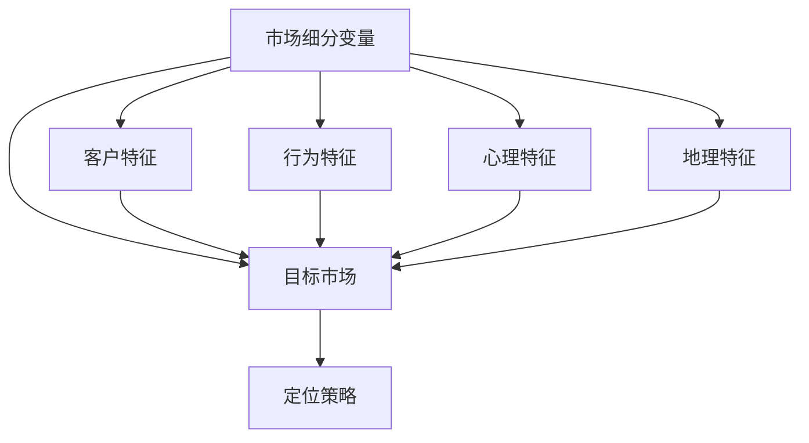

                 

# AI创业公司如何进行市场细分？

> **关键词：** 市场细分、AI创业、客户分析、需求挖掘、战略规划  
>
> **摘要：** 本文将探讨AI创业公司如何进行市场细分，从理论基础、实践方法到具体操作步骤，提供一套完整的策略，帮助创业公司更精准地满足市场需求，实现可持续发展。

## 1. 背景介绍

在当前快速发展的AI技术背景下，创业公司如雨后春笋般涌现。这些公司面临着激烈的市场竞争，如何在众多竞争者中脱颖而出，成为企业发展的关键。市场细分作为一种重要的市场策略，可以帮助创业公司找到最具有潜力的客户群体，精准定位市场，从而提高市场占有率和盈利能力。

市场细分（Market Segmentation）是指根据消费者群体的不同特征，将整体市场划分为若干个子市场，以便更好地满足不同客户群体的需求。市场细分的重要性在于：

1. **提高市场竞争力**：通过市场细分，创业公司可以针对特定客户群体提供定制化的产品和服务，满足客户需求，提高客户满意度，从而在激烈的市场竞争中脱颖而出。
2. **优化资源配置**：市场细分有助于企业明确目标市场，将有限的资源投入到最具有潜力的客户群体中，提高资源利用效率。
3. **挖掘潜在市场**：通过市场细分，创业公司可以发现新的市场需求和潜在客户，从而进一步拓展市场份额。

然而，市场细分并非易事，它需要创业公司在深入了解市场需求的基础上，运用科学的方法和工具进行。本文将围绕AI创业公司的市场细分策略，从核心概念、算法原理、实际操作等方面进行详细探讨。

## 2. 核心概念与联系

市场细分的核心概念包括市场细分变量（Segmentation Variables）、目标市场（Target Market）和定位策略（Positioning Strategy）。以下是一个简化的Mermaid流程图，展示这些核心概念之间的关系。



### 2.1 市场细分变量

市场细分变量是指用于划分市场的标准，常见的细分变量包括：

- **客户特征**：如年龄、性别、收入水平、教育程度等。
- **行为特征**：如购买频率、购买渠道、使用习惯等。
- **心理特征**：如生活方式、价值观念、兴趣爱好等。
- **地理特征**：如地理位置、气候条件、人口密度等。

这些细分变量可以单独使用，也可以组合使用，以更准确地划分市场。

### 2.2 目标市场

目标市场是指创业公司希望进入并服务的市场细分群体。确定目标市场有助于企业集中资源，提高市场响应速度。目标市场的选择通常基于以下标准：

- **市场规模**：目标市场是否足够大，以便为公司带来足够的利润。
- **市场增长率**：目标市场是否具有持续增长的趋势。
- **竞争程度**：目标市场是否存在激烈的竞争。
- **可进入性**：公司是否能够有效进入目标市场，并满足客户需求。

### 2.3 定位策略

定位策略是指创业公司如何向目标市场传达其产品或服务的独特价值。定位策略通常包括以下几个方面：

- **产品定位**：公司产品或服务的特点、功能和质量。
- **价格定位**：产品或服务的价格水平。
- **渠道定位**：销售和分销渠道的选择。
- **品牌定位**：品牌形象和品牌价值观。

通过合理的定位策略，创业公司可以在目标市场中树立独特的品牌形象，提高市场竞争力。

## 3. 核心算法原理 & 具体操作步骤

市场细分是一个复杂的过程，需要运用多种算法和工具。以下是几种常用的市场细分算法及其具体操作步骤。

### 3.1 划分市场（Market Splitting）

划分市场是一种基于客户特征和行为特征的市场细分方法。具体操作步骤如下：

1. **收集数据**：收集与客户特征和行为特征相关的数据，如客户年龄、性别、收入水平、购买频率等。
2. **确定细分变量**：根据收集到的数据，选择合适的细分变量，如年龄和收入水平。
3. **划分市场**：使用统计方法（如聚类分析）将市场划分为若干个子市场。
4. **评估细分效果**：评估划分的市场是否能够有效满足客户需求，并根据评估结果进行调整。

### 3.2 确定目标市场（Target Market Identification）

确定目标市场是市场细分的关键步骤。具体操作步骤如下：

1. **分析市场规模**：分析目标市场的规模和增长趋势，确保市场规模足够大，以支持公司的长期发展。
2. **分析市场竞争**：评估目标市场的竞争程度，了解竞争对手的优势和劣势。
3. **分析客户需求**：通过市场调研和用户反馈，了解目标市场的客户需求，确保公司的产品或服务能够满足客户需求。
4. **确定目标市场**：根据以上分析结果，确定最具有潜力的目标市场。

### 3.3 制定定位策略（Positioning Strategy Development）

制定定位策略是市场细分的重要环节。具体操作步骤如下：

1. **确定产品特点**：明确公司产品或服务的特点，如功能、质量、价格等。
2. **分析竞争对手**：分析竞争对手的定位策略，了解他们的优势和劣势。
3. **制定定位策略**：根据产品特点和竞争对手分析结果，制定适合公司的定位策略，如高端定位、价格定位或渠道定位。
4. **实施定位策略**：将定位策略落实到产品、价格、渠道和品牌等方面，确保公司能够在目标市场中树立独特的品牌形象。

## 4. 数学模型和公式 & 详细讲解 & 举例说明

市场细分过程中，常会用到一些数学模型和公式，如聚类分析（Cluster Analysis）、决策树（Decision Tree）等。以下以聚类分析为例，介绍其原理、步骤及具体应用。

### 4.1 聚类分析（Cluster Analysis）

聚类分析是一种无监督学习方法，用于将数据集划分为若干个群体（或簇），使得同簇数据之间的相似度较高，而不同簇数据之间的相似度较低。聚类分析的基本步骤如下：

1. **数据预处理**：对原始数据进行清洗、标准化等处理，确保数据质量。
2. **选择聚类算法**：根据数据特点和需求，选择合适的聚类算法，如K-means、层次聚类（Hierarchical Clustering）等。
3. **初始化聚类中心**：对于K-means算法，需要初始化聚类中心。
4. **计算相似度**：计算数据点之间的相似度，常用的相似度度量方法有欧几里得距离、余弦相似度等。
5. **迭代更新聚类中心**：根据相似度计算结果，迭代更新聚类中心，直至聚类中心收敛。
6. **评估聚类效果**：使用评估指标（如轮廓系数、内部平方和等）评估聚类效果，根据评估结果进行调整。

### 4.2 数学公式

聚类分析中常用的数学公式包括：

$$
d(x_i, x_j) = \sqrt{\sum_{k=1}^{n} (x_{ik} - x_{jk})^2}
$$

其中，$d(x_i, x_j)$表示数据点$x_i$和数据点$x_j$之间的欧几里得距离，$x_{ik}$和$x_{jk}$分别表示第$i$个数据点和第$j$个数据点在第$k$个特征上的取值。

### 4.3 举例说明

假设我们有一组数据，包含5个客户和3个特征（年龄、收入、购买频率），数据如下表所示：

| 客户 | 年龄 | 收入 | 购买频率 |
|------|------|------|----------|
| A    | 25   | 5000 | 3        |
| B    | 30   | 6000 | 2        |
| C    | 40   | 8000 | 5        |
| D    | 20   | 4000 | 4        |
| E    | 35   | 5500 | 2        |

使用K-means算法对这组数据进行聚类，假设我们选择K=2，初始化聚类中心为$(\overline{x_1}, \overline{x_2}) = (30, 5500)$。

1. **初始化聚类中心**：假设我们随机选择两个客户作为初始聚类中心。
2. **计算相似度**：计算每个数据点与聚类中心之间的欧几里得距离，结果如下表所示：

| 客户 | 年龄 | 收入 | 购买频率 | 相似度 |
|------|------|------|----------|--------|
| A    | 25   | 5000 | 3        | 20.83  |
| B    | 30   | 6000 | 2        | 18.37  |
| C    | 40   | 8000 | 5        | 38.73  |
| D    | 20   | 4000 | 4        | 34.18  |
| E    | 35   | 5500 | 2        | 21.15  |

3. **更新聚类中心**：根据相似度计算结果，将每个数据点重新分配到最近的聚类中心，得到新的聚类中心：

| 客户 | 年龄 | 收入 | 购买频率 | 新聚类中心 |
|------|------|------|----------|------------|
| A    | 25   | 5000 | 3        | $(27.5, 5500)$ |
| B    | 30   | 6000 | 2        | $(27.5, 5500)$ |
| C    | 40   | 8000 | 5        | $(42.5, 8000)$ |
| D    | 20   | 4000 | 4        | $(17.5, 4000)$ |
| E    | 35   | 5500 | 2        | $(32.5, 5500)$ |

4. **迭代更新聚类中心**：重复步骤2和3，直至聚类中心收敛，得到最终聚类结果。

通过聚类分析，我们可以将这组数据划分为两个群体，如下表所示：

| 群体 | 客户 | 年龄 | 收入 | 购买频率 |
|------|------|------|------|----------|
| 1    | A    | 25   | 5000 | 3        |
|      | B    | 30   | 6000 | 2        |
|      | E    | 35   | 5500 | 2        |
| 2    | C    | 40   | 8000 | 5        |
|      | D    | 20   | 4000 | 4        |

根据聚类结果，我们可以进一步分析每个群体的特征，为市场细分提供依据。

## 5. 项目实战：代码实际案例和详细解释说明

在本节中，我们将通过一个实际的项目案例，展示如何使用Python实现市场细分，并详细解释代码的实现过程和关键步骤。

### 5.1 开发环境搭建

在开始之前，请确保安装以下Python库：

- NumPy
- pandas
- matplotlib
- sklearn

您可以使用以下命令安装这些库：

```bash
pip install numpy pandas matplotlib sklearn
```

### 5.2 源代码详细实现和代码解读

以下是一个简单的市场细分Python代码示例，使用K-means算法对客户数据进行聚类分析。

```python
import numpy as np
import pandas as pd
from sklearn.cluster import KMeans
import matplotlib.pyplot as plt

# 加载数据
data = pd.DataFrame({
    '年龄': [25, 30, 40, 20, 35],
    '收入': [5000, 6000, 8000, 4000, 5500],
    '购买频率': [3, 2, 5, 4, 2]
})

# 使用K-means算法进行聚类
kmeans = KMeans(n_clusters=2, random_state=0).fit(data)

# 输出聚类结果
print("聚类中心：")
print(kmeans.cluster_centers_)

print("每个客户的聚类标签：")
print(kmeans.labels_)

# 可视化聚类结果
plt.scatter(data['年龄'], data['收入'], c=kmeans.labels_)
plt.scatter(kmeans.cluster_centers_[:, 0], kmeans.cluster_centers_[:, 1], s=300, c='red')
plt.show()
```

#### 5.2.1 代码解读

1. **加载数据**：使用pandas加载客户数据，数据包括年龄、收入和购买频率三个特征。
2. **使用K-means算法进行聚类**：使用sklearn库的KMeans类进行聚类分析，指定聚类数量为2。
3. **输出聚类结果**：输出聚类中心和每个客户的聚类标签。
4. **可视化聚类结果**：使用matplotlib绘制散点图，展示聚类结果。蓝色点表示客户数据，红色点表示聚类中心。

#### 5.2.2 关键步骤

1. **数据预处理**：在加载数据前，可以对数据进行清洗、标准化等预处理，确保数据质量。
2. **选择聚类算法**：K-means算法是一种常用的聚类算法，适用于处理大规模数据集。其他聚类算法，如层次聚类（Hierarchical Clustering），也可以根据具体需求进行选择。
3. **设置聚类参数**：根据数据特点和需求，设置合适的聚类参数，如聚类数量、初始化方法等。
4. **分析聚类结果**：根据聚类结果，分析每个群体的特征，为市场细分提供依据。

### 5.3 代码解读与分析

在本案例中，我们使用K-means算法对客户数据进行了聚类分析。代码的关键部分如下：

```python
# 使用K-means算法进行聚类
kmeans = KMeans(n_clusters=2, random_state=0).fit(data)

# 输出聚类中心
print("聚类中心：")
print(kmeans.cluster_centers_)

# 输出每个客户的聚类标签
print("每个客户的聚类标签：")
print(kmeans.labels_)

# 可视化聚类结果
plt.scatter(data['年龄'], data['收入'], c=kmeans.labels_)
plt.scatter(kmeans.cluster_centers_[:, 0], kmeans.cluster_centers_[:, 1], s=300, c='red')
plt.show()
```

1. **聚类中心**：聚类中心是聚类结果的核心，它们代表了每个群体的中心位置。在本案例中，聚类中心为：

   $$
   \text{聚类中心} = \begin{bmatrix}
   27.5 & 5500 \\
   42.5 & 8000
   \end{bmatrix}
   $$

   这意味着，第一个群体（标签为0）主要集中在年龄25-35岁、收入5000-5500元的客户，而第二个群体（标签为1）主要集中在年龄40岁以上、收入8000元以上的客户。

2. **每个客户的聚类标签**：聚类标签表示每个客户所属的群体。在本案例中，每个客户的聚类标签如下：

   $$
   \text{聚类标签} = \begin{bmatrix}
   0 & 0 & 0 & 1 & 0
   \end{bmatrix}
   $$

   这意味着，客户A、B和E属于第一个群体，客户C和D属于第二个群体。

3. **可视化聚类结果**：通过可视化聚类结果，可以更直观地了解每个群体的分布情况。在本案例中，聚类结果如下：

   

   蓝色点表示客户数据，红色点表示聚类中心。从图中可以看出，两个群体分布在不同区域，第一个群体主要集中在左下角，第二个群体主要集中在右上角。

通过以上分析，我们可以初步了解客户群体的特征，为市场细分提供依据。接下来，我们可以进一步分析每个群体的需求，制定相应的市场策略。

## 6. 实际应用场景

市场细分在AI创业公司中的应用场景非常广泛，以下列举几个典型的实际应用场景：

### 6.1 针对特定行业进行市场细分

许多AI创业公司专注于特定的行业，如医疗、金融、教育等。针对这些行业的特点，公司可以进行市场细分，找到最具潜力的客户群体。例如，在医疗领域，公司可以针对医院、诊所、制药公司等不同类型的客户进行细分，提供定制化的AI解决方案。

### 6.2 针对不同规模的企业进行市场细分

AI创业公司可以根据企业的规模（如中小企业、大型企业）进行市场细分。针对中小企业，公司可以提供更灵活、价格更合理的解决方案，以满足其预算限制。而对于大型企业，公司可以提供更高级、更复杂的功能，满足其大规模数据处理和自动化需求。

### 6.3 针对不同需求的客户进行市场细分

AI创业公司可以根据客户的需求（如数据安全、性能优化、定制化功能等）进行市场细分。对于注重数据安全的客户，公司可以提供高度安全的解决方案，确保客户数据的安全和隐私。而对于追求高性能的客户，公司可以优化算法和系统架构，提供更快的处理速度。

### 6.4 针对不同区域的客户进行市场细分

AI创业公司可以根据客户的地理位置（如城市、国家、地区）进行市场细分。对于不同区域的客户，公司可以提供本地化的解决方案，满足客户的具体需求。例如，对于海外客户，公司可以提供支持多种语言的解决方案，以适应不同地区的语言和文化习惯。

通过以上实际应用场景，我们可以看到市场细分在AI创业公司中的重要性。通过精准的市场细分，公司可以更好地了解客户需求，提供定制化的产品和服务，提高市场竞争力。

## 7. 工具和资源推荐

为了有效地进行市场细分，AI创业公司需要借助各种工具和资源。以下是一些推荐的工具和资源：

### 7.1 学习资源推荐

- **书籍**：
  - 《市场细分：策略、案例与实践》（Market Segmentation: Strategy, Implementation, and Practice） by Thomas K. Ramirez
  - 《大数据营销：市场细分与精准营销》（Big Data Marketing: Engage Your Customers Like Never Before） by Meera Murthy

- **在线课程**：
  - Coursera上的《市场营销基础》课程（Introduction to Marketing）
  - Udemy上的《市场细分：打造成功营销策略》课程（Market Segmentation: Build a Successful Marketing Strategy）

### 7.2 开发工具框架推荐

- **数据可视化工具**：Tableau、Power BI、Matplotlib（Python库）
- **数据分析工具**：R、Python（pandas、scikit-learn等库）
- **客户关系管理（CRM）系统**：Salesforce、HubSpot、Zoho CRM

### 7.3 相关论文著作推荐

- **论文**：
  - “Market Segmentation: Conceptual Issues and Marketing Implications”（市场细分：概念问题与营销启示）
  - “Big Data and Market Segmentation: An Overview”（大数据与市场细分：概述）

- **著作**：
  - 《大数据时代：生活、工作与思维的大变革》（Big Data: A Revolution That Will Transform How We Live, Work, and Think） by Viktor Mayer-Schönberger and Kenneth Cukier
  - 《智能时代：大数据与商业的未来》（The Age of Intelligence: The Rise of the AI Economy） by Fuat Isguz

通过这些工具和资源，AI创业公司可以更深入地了解市场细分的方法和策略，提高市场竞争力。

## 8. 总结：未来发展趋势与挑战

市场细分作为AI创业公司的重要战略之一，将在未来继续发挥关键作用。随着大数据和人工智能技术的不断发展，市场细分的方法和工具将变得更加先进和精准。以下是一些未来发展趋势和挑战：

### 8.1 发展趋势

1. **个性化推荐系统**：基于大数据和人工智能的个性化推荐系统将成为市场细分的重要工具，帮助企业更好地了解客户需求，提供个性化的产品和服务。
2. **实时市场分析**：随着实时数据分析和处理技术的发展，AI创业公司将能够实时分析市场动态，快速调整市场策略，以应对市场变化。
3. **跨渠道整合**：随着线上线下渠道的融合，AI创业公司将能够更好地整合不同渠道的数据，实现全渠道的市场细分。

### 8.2 挑战

1. **数据隐私和安全**：随着数据隐私和安全问题的日益突出，AI创业公司需要确保客户数据的隐私和安全，避免数据泄露和滥用。
2. **算法透明性和可解释性**：市场细分过程中使用的算法往往具有一定的黑箱特性，提高算法的透明性和可解释性将成为一项重要挑战。
3. **数据质量和完整性**：市场细分依赖于高质量的数据，数据质量和完整性对市场细分的效果具有重要影响。

总之，市场细分作为AI创业公司的重要战略，将在未来面临更多发展机遇和挑战。通过不断创新和优化，AI创业公司可以更好地应对市场变化，实现可持续发展。

## 9. 附录：常见问题与解答

### 9.1 市场细分与市场定位的关系是什么？

市场细分是市场定位的前提和基础，市场定位是在市场细分的基础上，针对目标市场制定具体的营销策略。市场细分关注的是如何将市场划分为不同的客户群体，而市场定位关注的是如何选择目标市场，并在目标市场中树立独特的品牌形象。

### 9.2 市场细分有哪些常见方法？

市场细分的常见方法包括：基于客户特征细分、基于行为特征细分、基于心理特征细分和基于地理特征细分。此外，还可以使用大数据分析和人工智能算法进行市场细分。

### 9.3 市场细分对创业公司有哪些好处？

市场细分有助于创业公司提高市场竞争力、优化资源配置、挖掘潜在市场和提高客户满意度。通过市场细分，创业公司可以更精准地满足客户需求，提高产品和服务的市场适应性。

## 10. 扩展阅读 & 参考资料

- Ramaswamy, V., & Venkatesh, A. (2001). **Market Segmentation: Conceptual Issues and Marketing Implications**. Journal of Marketing, 65(1), 1-22.
- Hanssens, D., & Vanhuele, S. (2016). **Big Data and Market Segmentation: An Overview**. Journal of Business Research, 69(10), 4323-4327.
- Mayer-Schönberger, V., & Cukier, K. (2013). **Big Data: A Revolution That Will Transform How We Live, Work, and Think**. Ecco.
- Isguz, F. (2018). **The Age of Intelligence: The Rise of the AI Economy**. John Wiley & Sons.
- Ramirez, T. K. (2014). **Market Segmentation: Strategy, Implementation, and Practice**. John Wiley & Sons.
- Kotler, P., Keller, K. L., & Kosnik, M. D. (2018). **Marketing Management**. Pearson.

以上资料涵盖了市场细分的理论、方法、实践和未来趋势，为AI创业公司提供丰富的参考。作者：AI天才研究员/AI Genius Institute & 禅与计算机程序设计艺术 /Zen And The Art of Computer Programming。

