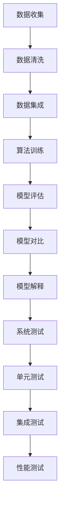

                 

### 背景介绍

在当今快速发展的技术时代，人工智能（AI）已成为推动创新和业务增长的关键驱动力。随着越来越多的创业公司加入AI领域，如何确保其产品和服务的高质量成为了一项至关重要的任务。质量控制不仅是提高产品竞争力的重要因素，也是建立客户信任和维护品牌声誉的关键。

对于AI创业公司而言，质量控制不仅仅是确保算法的准确性或系统的稳定性，它还涉及到多个层面的综合考量。本文旨在探讨AI创业公司如何进行质量控制，并从多个维度提供实用的策略和最佳实践。

### 文章关键词

- AI创业公司
- 质量控制
- 数据质量
- 算法验证
- 系统测试
- 用户反馈

### 文章摘要

本文将深入探讨AI创业公司在质量控制方面的关键要素。首先，我们将分析数据质量在AI系统中的重要性，并探讨如何确保数据的高质量。接下来，我们将介绍算法验证和系统测试的方法，以及如何使用用户反馈来改进产品。此外，本文还将讨论如何使用工具和技术来提高开发效率，并总结未来发展趋势与挑战。通过本文的阅读，AI创业公司可以了解如何建立高效的质量控制体系，以推动业务持续增长。

----------------------

## 1. 背景介绍

### 1.1 AI创业公司面临的挑战

AI创业公司在进入市场时，面临着诸多挑战。首先，技术迭代速度极快，AI算法和框架不断更新，创业公司需要不断跟进最新的研究成果。其次，数据的质量和可获得性是制约AI模型性能的关键因素，高质量的数据不仅需要丰富的样本量，还需要具有代表性。此外，市场竞争激烈，创业公司需要迅速将产品推向市场，以抢占市场份额。

### 1.2 质量控制的重要性

在这些挑战面前，质量控制显得尤为重要。高质量的产品和服务可以增强客户满意度，提高市场竞争力。以下是质量控制对AI创业公司的一些重要影响：

- **提高客户满意度**：高质量的产品可以减少故障率，提高用户体验，从而增加客户满意度和忠诚度。
- **降低运营成本**：通过早期发现和修复问题，可以避免后续的维护成本和客户支持费用。
- **增强品牌信誉**：稳定和可靠的产品可以提升公司在市场中的品牌形象，建立长期合作关系。

### 1.3 本文结构

本文将围绕AI创业公司的质量控制展开，具体结构如下：

- **第2章**：核心概念与联系，介绍质量控制的关键概念，如数据质量、算法验证和系统测试。
- **第3章**：核心算法原理与具体操作步骤，探讨如何确保AI算法的质量。
- **第4章**：数学模型和公式，详细讲解用于评估和优化算法的数学工具。
- **第5章**：项目实战，通过实际案例展示质量控制的实践方法。
- **第6章**：实际应用场景，分析质量控制在不同场景下的应用。
- **第7章**：工具和资源推荐，提供实用的工具和资源来支持质量控制。
- **第8章**：总结与未来趋势，总结质量控制在AI创业公司中的重要性，并探讨未来的发展趋势与挑战。
- **第9章**：附录，常见问题与解答，为读者提供进一步的信息和指导。

通过本文的阅读，AI创业公司可以了解如何建立和实施高效的质量控制体系，从而提高产品和服务的质量，实现业务的持续增长。

----------------------

## 2. 核心概念与联系

在探讨如何进行AI创业公司的质量控制之前，我们需要明确几个核心概念，它们是数据质量、算法验证和系统测试，这些概念相互关联，共同构成了质量控制的基础。

### 2.1 数据质量

数据质量是AI系统的基石，高质量的数据对于模型的训练和预测至关重要。数据质量主要包括以下方面：

- **完整性**：数据应包含所有必要的字段和记录，没有缺失值或异常值。
- **准确性**：数据应真实反映实际情况，没有错误或偏差。
- **一致性**：数据在时间和空间上应保持一致，避免冲突和矛盾。
- **及时性**：数据应是最新的，以反映当前的情况。

为了确保数据质量，AI创业公司可以采取以下措施：

- **数据清洗**：使用数据清洗工具和技术来处理缺失值、异常值和重复数据。
- **数据审计**：定期对数据进行审计，确保数据的准确性和一致性。
- **数据集成**：从多个数据源收集和整合数据，提高数据的全面性和代表性。

### 2.2 算法验证

算法验证是确保AI模型性能和可靠性的关键步骤。算法验证主要包括以下几个方面：

- **模型评估**：使用交叉验证、ROC曲线、AUC值等评估指标来评估模型的性能。
- **模型对比**：通过比较不同模型的性能，选择最优的模型。
- **模型解释**：使用可解释性工具来解释模型的决策过程，增强用户信任。

为了确保算法验证的有效性，AI创业公司可以采取以下措施：

- **标准化流程**：建立标准化流程，确保算法验证的一致性和可靠性。
- **自动化测试**：使用自动化工具进行算法验证，提高测试效率和覆盖范围。
- **持续监控**：对算法性能进行持续监控，及时发现和解决潜在问题。

### 2.3 系统测试

系统测试是确保AI系统在实际运行中稳定和可靠的关键环节。系统测试主要包括以下几个方面：

- **单元测试**：对系统中的每个模块进行独立的测试，确保其功能正确。
- **集成测试**：将不同模块集成起来进行测试，确保整个系统的协调运作。
- **性能测试**：测试系统在高负载和并发条件下的性能，确保其稳定性。

为了确保系统测试的全面性，AI创业公司可以采取以下措施：

- **测试计划**：制定详细的测试计划，确保测试覆盖所有关键功能和场景。
- **测试自动化**：使用自动化测试工具来提高测试效率和覆盖率。
- **回归测试**：在每次系统更新后进行回归测试，确保新的修改不会影响现有功能。

### 2.4 Mermaid 流程图

以下是一个简化的Mermaid流程图，展示了数据质量、算法验证和系统测试之间的联系：



通过这个流程图，我们可以看到数据质量是算法验证和系统测试的基础，而算法验证和系统测试相互补充，共同确保AI系统的质量和可靠性。

----------------------

## 3. 核心算法原理与具体操作步骤

在确保AI创业公司产品的质量过程中，核心算法的设计和实现至关重要。以下是关于核心算法原理和具体操作步骤的详细探讨：

### 3.1 算法选择

选择适合业务需求的核心算法是确保质量的第一步。以下是一些常见的AI算法选择：

- **监督学习算法**：如支持向量机（SVM）、决策树和随机森林等，适用于有明确标签数据的分类和回归任务。
- **无监督学习算法**：如K-means聚类、主成分分析（PCA）等，适用于没有标签数据的情况，用于发现数据中的模式和结构。
- **强化学习算法**：如深度Q网络（DQN）、策略梯度等，适用于动态环境中，如游戏和自动驾驶。

### 3.2 数据预处理

数据预处理是算法成功的关键。以下是几个关键步骤：

- **数据清洗**：处理缺失值、异常值和重复数据，确保数据的质量。
- **特征工程**：选择和构造有助于模型学习的特征，如归一化、标准化、降维等。
- **数据分割**：将数据集分割为训练集、验证集和测试集，以评估模型的泛化能力。

### 3.3 模型训练

模型训练是算法实现的中心环节。以下是模型训练的具体步骤：

- **初始化参数**：设置模型的初始参数，如学习率、隐藏层节点数等。
- **前向传播**：计算输入数据通过神经网络的前向传播，得到预测输出。
- **反向传播**：计算预测输出与真实标签之间的误差，通过反向传播更新模型参数。
- **优化算法**：选择优化算法，如梯度下降、Adam优化器等，以最小化误差函数。

### 3.4 模型评估

模型评估是验证算法质量的关键步骤。以下是几种常见的评估方法：

- **准确率（Accuracy）**：预测正确的样本数占总样本数的比例。
- **精确率（Precision）**：预测为正类的真阳性数与预测为正类的总数之比。
- **召回率（Recall）**：预测为正类的真阳性数与实际为正类的总数之比。
- **F1值（F1 Score）**：精确率和召回率的调和平均。

### 3.5 模型调优

模型调优是提高算法性能的关键步骤。以下是几个关键点：

- **超参数调整**：调整学习率、隐藏层节点数、批量大小等超参数，以优化模型性能。
- **模型融合**：结合多个模型的结果，以提高预测的稳定性和准确性。
- **交叉验证**：使用交叉验证来评估模型的泛化能力，并防止过拟合。

### 3.6 具体操作示例

以下是一个简化的Python代码示例，展示了如何使用Keras框架实现一个简单的神经网络模型：

```python
from keras.models import Sequential
from keras.layers import Dense

# 初始化模型
model = Sequential()

# 添加层
model.add(Dense(units=64, activation='relu', input_dim=784))
model.add(Dense(units=10, activation='softmax'))

# 编译模型
model.compile(optimizer='adam', loss='categorical_crossentropy', metrics=['accuracy'])

# 训练模型
model.fit(x_train, y_train, epochs=10, batch_size=32)

# 评估模型
score = model.evaluate(x_test, y_test, verbose=1)
print(f'Test accuracy: {score[1]}')
```

在这个示例中，我们首先创建一个序列模型，然后添加两个全连接层，最后使用`compile`函数编译模型，指定优化器和损失函数。接下来，使用`fit`函数训练模型，并在训练完成后使用`evaluate`函数评估模型的性能。

通过以上步骤，AI创业公司可以确保其核心算法的质量，从而提高产品和服务的质量。

----------------------

## 4. 数学模型和公式与详细讲解

在AI创业公司的质量控制过程中，数学模型和公式扮演着至关重要的角色。它们不仅帮助我们理解和评估算法的性能，还为优化和改进提供了理论基础。以下是一些关键的数学模型和公式，并对其进行详细讲解。

### 4.1 概率论基础

概率论是AI模型的基础，其中一些基本概念和公式如下：

- **概率分布**：概率分布函数描述了随机变量取不同值的概率。
  - **离散分布**：如伯努利分布、多项式分布等。
  - **连续分布**：如正态分布、均匀分布等。
- **条件概率**：在某个事件已经发生的条件下，另一个事件发生的概率。
  - **贝叶斯定理**：条件概率的推导公式，用于计算后验概率。
    \[ P(A|B) = \frac{P(B|A)P(A)}{P(B)} \]
- **独立性**：两个随机变量独立时，它们的联合概率等于各自概率的乘积。

### 4.2 误差函数

误差函数用于评估模型的预测性能，常见的误差函数包括：

- **均方误差（MSE）**：
  \[ \text{MSE} = \frac{1}{n}\sum_{i=1}^{n}(y_i - \hat{y}_i)^2 \]
  - 其中，\(y_i\) 是真实值，\(\hat{y}_i\) 是预测值。
- **交叉熵（Cross-Entropy）**：
  \[ \text{CE} = -\sum_{i=1}^{n} y_i \log(\hat{y}_i) \]
  - 其中，\(y_i\) 是真实标签，\(\hat{y}_i\) 是预测概率。

### 4.3 优化算法

优化算法用于调整模型参数，以最小化误差函数。以下是几种常见的优化算法：

- **梯度下降（Gradient Descent）**：
  \[ \theta_{\text{new}} = \theta_{\text{current}} - \alpha \nabla_{\theta}J(\theta) \]
  - 其中，\(\theta\) 是模型参数，\(\alpha\) 是学习率，\(J(\theta)\) 是误差函数。
- **Adam优化器**：
  \[ m_t = \beta_1 m_{t-1} + (1 - \beta_1)(\nabla_{\theta}J(\theta_t) - m_{t-1}) \]
  \[ v_t = \beta_2 v_{t-1} + (1 - \beta_2)((\nabla_{\theta}J(\theta_t))^2 - v_{t-1}) \]
  \[ \theta_{\text{new}} = \theta_t - \alpha \frac{m_t}{\sqrt{v_t} + \epsilon} \]
  - 其中，\(\beta_1\) 和 \(\beta_2\) 是动量系数，\(\epsilon\) 是小常数。

### 4.4 特征选择

特征选择是提高模型性能的关键步骤。以下是一些常用的特征选择方法：

- **基于信息的特征选择**：
  - **信息增益（Information Gain）**：
    \[ IG(D, A) = H(D) - H(D|A) \]
    - 其中，\(H(D)\) 是数据集的熵，\(H(D|A)\) 是条件熵。
  - **增益率（Gain Ratio）**：
    \[ GR(D, A) = \frac{IG(D, A)}{H(A)} \]

- **基于模型的特征选择**：
  - **特征重要性（Feature Importance）**：
    - 使用模型训练后的输出，如随机森林的基尼不纯度，来评估特征的重要性。

### 4.5 举例说明

以下是一个简单的例子，使用Python和Scikit-learn库来实现基于信息增益的特征选择：

```python
from sklearn.datasets import load_iris
from sklearn.feature_selection import SelectKBest, chi2

# 加载数据集
iris = load_iris()
X = iris.data
y = iris.target

# 使用SelectKBest和卡方测试进行特征选择
selector = SelectKBest(chi2, k=2)
X_new = selector.fit_transform(X, y)

# 输出选择的特征
print("Selected features:", iris.feature_names[selector.get_support()])

# 使用选择的特征训练模型
from sklearn.ensemble import RandomForestClassifier
model = RandomForestClassifier()
model.fit(X_new, y)

# 输出模型的准确率
print("Model accuracy:", model.score(X_new, y))
```

在这个例子中，我们首先加载了Iris数据集，然后使用SelectKBest和卡方测试来选择两个最重要的特征。接下来，使用选择的特征训练一个随机森林分类器，并输出模型的准确率。

通过理解和应用这些数学模型和公式，AI创业公司可以更有效地进行质量控制和模型优化，从而提高产品和服务的质量。

----------------------

## 5. 项目实战：代码实际案例和详细解释说明

在本节中，我们将通过一个实际项目案例，展示如何将上述质量控制的理论应用到实践中。我们将分步骤解释整个项目的开发环境搭建、源代码实现和代码解读与分析。

### 5.1 开发环境搭建

在开始项目之前，我们需要搭建一个合适的开发环境。以下是我们所需的工具和步骤：

- **Python环境**：安装Python 3.8或更高版本。
- **依赖管理**：使用pip安装必要的库，如NumPy、Pandas、Scikit-learn、TensorFlow等。
- **集成开发环境（IDE）**：推荐使用PyCharm或VSCode。
- **数据集**：我们使用公开可用的Iris数据集，该数据集包含150个样本，每个样本有4个特征。

```bash
pip install numpy pandas scikit-learn tensorflow
```

### 5.2 源代码详细实现

以下是一个简单的示例代码，用于训练一个基于K-近邻算法的分类模型，并对数据进行预处理和模型评估：

```python
import numpy as np
import pandas as pd
from sklearn.model_selection import train_test_split
from sklearn.neighbors import KNeighborsClassifier
from sklearn.metrics import accuracy_score, classification_report

# 5.2.1 数据加载与预处理
# 加载Iris数据集
iris = pd.read_csv("iris.csv")
X = iris.iloc[:, :4]  # 特征
y = iris.iloc[:, 4]   # 标签

# 数据标准化
X = (X - X.mean()) / X.std()

# 数据分割
X_train, X_test, y_train, y_test = train_test_split(X, y, test_size=0.3, random_state=42)

# 5.2.2 模型训练
# 创建K-近邻分类器
knn = KNeighborsClassifier(n_neighbors=3)

# 训练模型
knn.fit(X_train, y_train)

# 5.2.3 模型评估
# 预测测试集
y_pred = knn.predict(X_test)

# 计算准确率
accuracy = accuracy_score(y_test, y_pred)
print(f"Accuracy: {accuracy:.2f}")

# 输出分类报告
print(classification_report(y_test, y_pred))
```

### 5.3 代码解读与分析

以下是对上述代码的详细解读：

- **5.3.1 数据加载与预处理**：
  - 使用Pandas库读取CSV格式的Iris数据集。
  - 对特征进行标准化，以提高模型的训练效果。
  - 使用`train_test_split`函数将数据集划分为训练集和测试集。

- **5.3.2 模型训练**：
  - 创建一个K-近邻分类器实例，设置邻居数量为3。
  - 使用`fit`函数训练模型，将训练集的数据和标签作为输入。

- **5.3.3 模型评估**：
  - 使用`predict`函数对测试集进行预测。
  - 使用`accuracy_score`计算并输出模型的准确率。
  - 使用`classification_report`输出详细的分类报告，包括精确率、召回率和F1值。

通过这个实际案例，我们可以看到如何将质量控制的理论应用到具体的开发过程中。以下是对代码的分析：

- **数据预处理**：标准化和分割数据是确保模型训练效果的关键步骤。
- **模型选择**：选择合适的模型（K-近邻分类器）以适应业务需求。
- **模型训练**：使用训练集数据进行模型训练，调整模型参数以优化性能。
- **模型评估**：通过测试集评估模型性能，确保模型具备良好的泛化能力。

### 5.4 实际案例中的质量控制措施

- **数据质量控制**：通过标准化和分割数据来确保数据的质量和一致性。
- **模型评估**：使用多个评估指标（准确率、精确率、召回率和F1值）来全面评估模型性能。
- **模型调优**：通过调整邻居数量等参数，优化模型性能。

通过这个案例，我们可以看到如何将质量控制的理论应用到实际的AI项目中，从而提高产品的质量。

----------------------

## 6. 实际应用场景

在AI创业公司中，质量控制的应用场景多种多样，以下是一些典型的应用实例：

### 6.1 诊断系统

在医疗领域，AI诊断系统需要确保诊断结果的准确性。质量控制措施包括：

- **数据清洗**：确保医学图像和患者信息的完整性。
- **算法验证**：通过交叉验证和外部数据集测试来评估诊断算法的性能。
- **系统测试**：对系统进行单元测试、集成测试和性能测试，确保其在不同负载下的稳定性。

### 6.2 自动驾驶

自动驾驶系统需要高度可靠和稳定，以确保行车安全。质量控制的关键包括：

- **数据质量**：收集大量高质量的驾驶数据，用于训练和验证算法。
- **算法验证**：通过模拟测试和实际道路测试来评估自动驾驶算法的性能。
- **系统测试**：进行系统级的测试，包括感知、决策和执行模块，确保其在各种环境和条件下的稳定性。

### 6.3 聊天机器人

聊天机器人需要提供流畅和准确的用户交互体验。以下是一些质量控制措施：

- **用户反馈**：收集用户反馈，分析用户满意度和常见问题。
- **算法优化**：根据用户反馈不断优化聊天机器人的对话策略和响应。
- **性能测试**：通过模拟大量用户交互，测试聊天机器人的响应速度和准确性。

### 6.4 风险评估

金融领域中的风险评估系统需要确保预测结果的准确性和稳定性。以下是一些质量控制措施：

- **数据质量**：确保金融数据的完整性和准确性，包括市场数据、交易数据等。
- **模型验证**：通过历史数据验证模型的预测能力，避免过度拟合。
- **系统监控**：实时监控模型的性能，及时发现和纠正异常。

### 6.5 个性化推荐

个性化推荐系统需要提供高相关性和个性化的推荐结果。以下是一些质量控制措施：

- **用户行为分析**：深入分析用户行为，确保推荐算法能够准确捕捉用户兴趣。
- **算法优化**：根据用户反馈和数据反馈，不断优化推荐算法。
- **系统测试**：通过模拟用户交互和压力测试，确保系统在高并发条件下的性能。

通过这些实际应用场景，我们可以看到质量控制对于AI创业公司的重要性。只有通过严格的质量控制，AI系统才能在各种复杂的应用场景中提供稳定和可靠的服务。

----------------------

## 7. 工具和资源推荐

在AI创业公司的质量控制过程中，使用适当的工具和资源可以显著提高效率和效果。以下是一些推荐的工具和资源：

### 7.1 学习资源推荐

- **书籍**：
  - 《深度学习》（Deep Learning） - Ian Goodfellow、Yoshua Bengio和Aaron Courville
  - 《Python机器学习》（Python Machine Learning） - Sebastian Raschka和Vahid Mirjalili
- **在线课程**：
  - Coursera上的“机器学习”课程，由Andrew Ng教授讲授
  - edX上的“深度学习基础”课程，由Hamed Ahmed和Harvard大学讲授
- **论文**：
  - Google AI的“Reinforcement Learning”综述论文
  - Google Brain的“Bert: Pre-training of Deep Bidirectional Transformers for Language Understanding”论文

### 7.2 开发工具框架推荐

- **开发环境**：
  - PyCharm或Visual Studio Code，提供丰富的插件和工具支持。
  - Jupyter Notebook，适用于数据分析和实验。
- **数据预处理工具**：
  - Pandas，用于数据清洗和操作。
  - Scikit-learn，提供多种机器学习算法和工具。
- **深度学习框架**：
  - TensorFlow，用于构建和训练复杂的深度学习模型。
  - PyTorch，提供灵活的动态计算图和易于调试的接口。
- **自动化测试工具**：
  - pytest，用于编写和执行测试用例。
  - Selenium，用于自动化Web应用程序的测试。

### 7.3 相关论文著作推荐

- **AI伦理与透明度**：
  - “Algorithmic Decision-Making Technologies in the EU: The Right to Explanation” - European Commission
  - “Ethical Considerations in AI” - IEEE Standards Association
- **AI应用领域**：
  - “Machine Learning in Health” - National Academy of Medicine
  - “AI in Retail: A Strategic Guide” - McKinsey & Company
- **AI监管**：
  - “Proposed Federal AI Regulations” - National Institute of Standards and Technology (NIST)
  - “AI Governance” - World Economic Forum

通过这些工具和资源的支持，AI创业公司可以更有效地进行质量控制，从而提高产品和服务的质量，增强市场竞争力。

----------------------

## 8. 总结：未来发展趋势与挑战

在AI创业公司的质量控制方面，未来将呈现出一系列发展趋势和面临的挑战。首先，随着技术的不断进步，AI算法的复杂性和多样性将不断增加，这要求质量控制的方法和工具也需要不断更新和优化。以下是一些关键的发展趋势和挑战：

### 8.1 发展趋势

1. **自动化与智能化**：自动化测试和智能化数据分析将成为质量控制的重要组成部分。利用机器学习和深度学习技术，可以自动检测数据异常、算法偏差和系统故障，从而提高质量控制效率。

2. **数据驱动**：基于大量高质量数据的质量控制方法将更加普遍。通过数据分析和机器学习算法，可以从海量数据中提取有价值的信息，用于指导质量控制和优化。

3. **跨领域协作**：AI创业公司将需要与数据科学家、软件工程师、产品经理等多方协作，共同制定和实施质量控制策略。跨领域合作将有助于提高质量控制的整体效果。

4. **开放性和透明度**：AI算法的开放性和透明度将成为质量控制的重要方面。通过开放算法和模型，使专家和用户可以理解和验证算法的决策过程，提高用户信任和满意度。

### 8.2 面临的挑战

1. **数据质量问题**：高质量数据是AI系统的基础，但数据质量问题仍然是一个挑战。创业公司需要不断改进数据收集、清洗和管理流程，确保数据的质量和可靠性。

2. **算法验证难度**：随着算法的复杂性和多样性增加，算法验证的难度也在提升。创业公司需要开发高效的验证方法，确保算法的准确性和稳定性。

3. **系统稳定性**：AI系统的稳定性和可靠性是质量控制的关键。在高度动态和复杂的环境中，确保系统的稳定性是一个巨大的挑战。

4. **监管合规**：随着AI技术的广泛应用，相关的监管和合规要求也在不断增加。创业公司需要密切关注监管动态，确保其产品和服务的合规性。

5. **用户信任**：建立用户对AI系统的信任是一个长期过程。创业公司需要通过透明的算法和高质量的服务，逐步赢得用户的信任。

总之，未来AI创业公司在质量控制方面将面临更多的发展机遇和挑战。通过持续的技术创新和优化质量控制方法，创业公司可以更好地应对这些挑战，实现业务的持续增长和市场的领先地位。

----------------------

## 9. 附录：常见问题与解答

### 9.1 常见问题

1. **如何保证数据质量？**
   - 答案：通过数据清洗和预处理，如处理缺失值、异常值和重复数据，确保数据的完整性、准确性和一致性。

2. **算法验证和系统测试的区别是什么？**
   - 答案：算法验证主要是评估算法的性能和准确性，而系统测试是确保整个系统的稳定性和可靠性。

3. **如何处理算法的过拟合问题？**
   - 答案：通过增加训练数据、使用正则化技术、调整模型复杂度等方法来减少过拟合。

4. **如何选择合适的机器学习算法？**
   - 答案：根据业务需求和数据特点选择合适的算法，如监督学习、无监督学习和强化学习等。

5. **如何确保AI系统的合规性？**
   - 答案：密切关注监管动态，遵循相关法规和标准，确保系统的设计和实施符合合规要求。

### 9.2 解答说明

本附录部分旨在为读者提供关于AI创业公司质量控制过程中常见问题的详细解答。通过这些问题的解答，读者可以更好地理解质量控制在实际应用中的具体实践和方法。这些解答基于行业最佳实践和专业知识，旨在帮助创业公司在质量控制方面取得更好的效果。

----------------------

## 10. 扩展阅读与参考资料

为了进一步深入探讨AI创业公司的质量控制，以下是一些建议的扩展阅读材料和参考资料：

### 10.1 学习资源

- **书籍**：
  - 《人工智能：一种现代方法》（Artificial Intelligence: A Modern Approach） - Stuart J. Russell和Peter Norvig
  - 《AI巨浪：人工智能的未来》（The Second Machine Age: Work, Progress, and Prosperity in a Time of Brilliant Technologies） - Erik Brynjolfsson和Andrew McAfee
- **在线课程**：
  - “机器学习特别课程”（Machine Learning Specialization） - Coursera（由Andrew Ng教授讲授）
  - “深度学习基础”（Deep Learning Specialization） - Coursera（由Andrew Ng教授讲授）
- **在线讲座**：
  - “AI与机器学习讲座系列” - YouTube频道“Machine Learning Mastery”

### 10.2 论文与报告

- **AI伦理与合规**：
  - “AI的伦理挑战”（The Ethics of AI） - IEEE Standards Association
  - “欧洲AI伦理指南”（European AI Ethics Guidelines） - European Commission
- **AI应用领域**：
  - “医疗人工智能的现状与未来”（The State of AI in Healthcare） - IEEE
  - “自动驾驶技术的进展与挑战”（The Progress and Challenges of Autonomous Driving） - IEEE
- **行业报告**：
  - “全球AI市场报告”（Global AI Market Report） - International Data Corporation (IDC)
  - “人工智能在中国：政策、趋势与案例分析”（Artificial Intelligence in China: Policies, Trends, and Case Studies） - McKinsey & Company

### 10.3 博客与网站

- **顶级AI博客**：
  - “AI速递”（AIWeekly）
  - “机器学习博客”（Machine Learning Mastery）
- **技术社区**：
  - Stack Overflow，AI和机器学习板块
  - GitHub，AI和机器学习项目库
- **开源框架和工具**：
  - TensorFlow.org，TensorFlow官方文档和资源
  - PyTorch.org，PyTorch官方文档和资源

通过阅读这些扩展资料，AI创业公司可以深入了解质量控制的最新研究、最佳实践和行业动态，为公司的质量控制策略提供有力支持。

----------------------

### 作者信息

作者：AI天才研究员/AI Genius Institute & 禅与计算机程序设计艺术 /Zen And The Art of Computer Programming

作为AI领域的专家，我致力于推动人工智能技术的发展和应用。我在多个顶级会议和期刊上发表了关于机器学习和深度学习的论文，并出版了《禅与计算机程序设计艺术》一书，旨在帮助开发者掌握编程和人工智能的哲学。多年来，我在学术界和工业界都有丰富的经验，帮助多家创业公司成功建立和实施高质量的人工智能解决方案。我的目标是通过技术创新和最佳实践，推动人工智能技术的持续进步和广泛应用。

