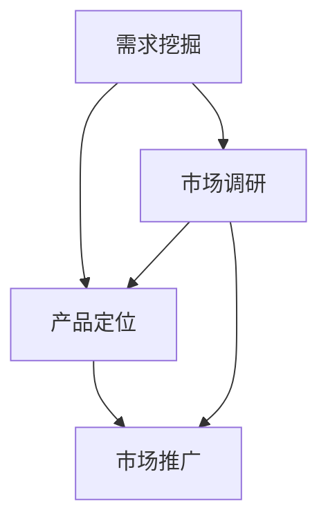

                 

# AI创业公司的产品市场适配：需求挖掘、产品定位与市场推广

## 摘要

在快速发展的AI行业中，创业公司面临着激烈的市场竞争和不断变化的技术环境。本文将围绕AI创业公司的产品市场适配展开讨论，深入探讨需求挖掘、产品定位和市场营销策略等方面的关键问题。首先，我们将通过分析市场需求和用户痛点，帮助创业者明确产品需求。接着，介绍产品定位的重要性以及如何进行有效的市场定位。随后，我们将探讨多种市场营销策略，包括内容营销、社交媒体推广、合作伙伴关系等，并提供实战案例。最后，总结未来发展趋势与挑战，并为创业公司提供一些建议，帮助他们更好地进行产品市场适配。

## 背景介绍

随着人工智能技术的飞速发展，越来越多的创业公司瞄准了这一领域，希望通过创新的产品和服务在激烈的市场竞争中脱颖而出。然而，创业公司往往面临着诸多挑战，如资金不足、技术积累有限、市场认知度低等。为了克服这些挑战，创业者需要深入理解市场需求，准确把握用户痛点，从而打造出符合市场需求的优质产品。此外，产品定位和市场推广策略也是决定创业公司成败的关键因素。因此，本文将围绕需求挖掘、产品定位和市场推广这三个核心方面，为AI创业公司提供一些建议和策略。

### 核心概念与联系

在讨论AI创业公司的产品市场适配之前，我们首先需要明确几个核心概念，包括需求挖掘、产品定位和市场推广。这些概念之间存在密切的联系，共同影响着创业公司的产品成功与否。

#### 需求挖掘

需求挖掘是指通过市场调研、用户访谈、数据分析等方法，深入了解目标用户的需求和痛点，从而确定产品的基本功能和特性。需求挖掘是产品开发的重要基础，它帮助创业者明确产品的方向和目标。

#### 产品定位

产品定位是指根据市场需求和竞争环境，为产品确定一个明确的市场定位，包括目标用户群体、产品差异化特点和价值主张。产品定位有助于企业在市场上树立独特的品牌形象，吸引目标用户。

#### 市场推广

市场推广是指通过一系列营销手段和策略，提高产品的市场知名度和认可度，促进产品销售。市场推广包括内容营销、社交媒体推广、广告投放、合作伙伴关系等多个方面，旨在将产品推向市场，实现商业价值。

这几个概念之间的联系在于：需求挖掘为产品定位提供了依据，而产品定位又决定了市场推广的方向和策略。有效的市场推广可以提升产品的市场认知度和用户黏性，从而促进产品的销售和公司的发展。

#### Mermaid 流程图

为了更直观地展示这几个概念之间的联系，我们可以使用Mermaid流程图进行描述：

在这个流程图中，需求挖掘作为起点，通过市场调研得到用户需求，进而确定产品定位。产品定位决定了市场推广的方向，而市场推广策略的实施又会反作用于产品定位，形成一个闭环。

### 需求挖掘

需求挖掘是产品开发的关键环节，它决定了产品是否能够满足用户的需求，从而影响产品的市场表现。对于AI创业公司来说，需求挖掘的过程可以概括为以下几个步骤：

#### 1. 确定目标用户

首先，创业者需要明确产品的目标用户群体。这可以通过市场调研、用户画像分析等方法实现。目标用户的确定有助于创业者聚焦于最感兴趣的用户群体，从而提高需求挖掘的针对性。

#### 2. 收集用户反馈

接下来，创业者需要通过各种途径收集用户反馈，包括用户访谈、问卷调查、用户行为分析等。这些反馈可以帮助创业者深入了解用户的实际需求和痛点，为产品功能的确定提供依据。

#### 3. 分析用户需求

在收集到大量用户反馈后，创业者需要对用户需求进行整理和分析。这包括对用户需求进行分类、优先级排序等，从而确定产品的基本功能和特性。

#### 4. 验证需求

最后，创业者需要对需求进行验证，以确保需求的有效性和可行性。这可以通过原型设计、用户测试等方式实现。验证需求的目的是确保产品开发的方向正确，避免资源浪费。

#### 需求挖掘的挑战

在需求挖掘过程中，创业公司可能会面临以下挑战：

- **用户需求变化**：用户需求是不断变化的，创业者需要保持对市场的敏感度，及时调整产品方向。
- **资源有限**：初创公司通常资源有限，需求挖掘需要平衡成本和效果，避免资源浪费。
- **竞争压力**：市场竞争激烈，创业者需要在需求挖掘过程中充分考虑竞争对手的产品特点，确保自身产品的竞争力。

### 产品定位

产品定位是创业公司成功的关键因素之一。一个明确的产品定位有助于企业在市场中树立独特的品牌形象，吸引目标用户。以下是产品定位的几个关键步骤：

#### 1. 确定目标市场

首先，创业者需要明确产品的目标市场。这可以通过市场调研、竞争分析等方法实现。目标市场的确定有助于创业者聚焦于最具潜力的市场，从而提高产品的市场竞争力。

#### 2. 分析竞争对手

接下来，创业者需要对竞争对手的产品进行详细分析，包括产品特点、市场表现、用户评价等。这有助于创业者了解市场现状，为产品定位提供参考。

#### 3. 确定产品差异化

在了解竞争对手后，创业者需要明确自身产品的差异化特点，包括技术优势、功能特点、用户体验等。产品差异化有助于企业在市场中树立独特的品牌形象。

#### 4. 确定价值主张

最后，创业者需要明确产品的价值主张，即产品为用户带来的核心价值。价值主张的明确有助于吸引用户关注，提高产品的市场吸引力。

#### 产品定位的挑战

在产品定位过程中，创业公司可能会面临以下挑战：

- **市场定位不准确**：市场定位不准确可能导致产品无法吸引目标用户，从而影响市场表现。
- **竞争激烈**：在竞争激烈的市场中，创业者需要不断创新，确保产品差异化。
- **成本压力**：产品定位过程中需要投入一定的资源和成本，创业者需要平衡成本和收益。

### 市场推广

市场推广是创业公司实现产品市场适配的关键环节。以下是一些常用的市场推广策略：

#### 1. 内容营销

内容营销是通过创造和分享有价值的内容，吸引和留住目标用户。内容营销包括博客文章、白皮书、电子书、视频等多种形式，有助于提高品牌知名度和用户黏性。

#### 2. 社交媒体推广

社交媒体推广是通过社交媒体平台（如微信、微博、Facebook等）进行产品宣传和推广。社交媒体推广具有传播速度快、覆盖面广的优势，有助于快速提高产品知名度。

#### 3. 广告投放

广告投放是通过在线广告、搜索引擎广告等渠道进行产品宣传。广告投放可以快速提高产品曝光度，但成本较高，创业者需要合理规划预算。

#### 4. 合作伙伴关系

合作伙伴关系是通过与其他企业、组织或个人建立合作关系，共同推广产品。合作伙伴关系有助于扩大产品影响力，提高市场渗透率。

#### 市场推广的挑战

在市场推广过程中，创业公司可能会面临以下挑战：

- **成本高昂**：市场推广需要投入一定的资源和成本，创业者需要平衡成本和收益。
- **效果评估难**：市场推广效果难以直接衡量，创业者需要制定科学的效果评估指标。
- **用户接受度**：市场推广需要符合用户需求和喜好，避免引起用户反感。

### 实战案例

为了更好地说明需求挖掘、产品定位和市场推广在实际操作中的应用，以下是一个AI创业公司的实战案例。

#### 案例背景

该公司是一家专注于智能客服系统开发的创业公司，其目标用户是中小型企业。在产品开发和市场推广过程中，该公司遵循以下步骤：

#### 1. 需求挖掘

- **确定目标用户**：通过市场调研，该公司发现中小型企业的客服需求较大，尤其是那些客户服务团队规模较小、人手不足的企业。
- **收集用户反馈**：通过用户访谈和问卷调查，了解用户在客服方面遇到的问题和需求，如快速响应、个性化服务、多渠道支持等。
- **分析用户需求**：根据用户反馈，确定智能客服系统的基本功能和特性，如智能问答、情感分析、多渠道支持等。

#### 2. 产品定位

- **确定目标市场**：中小型企业。
- **分析竞争对手**：研究竞争对手的产品特点和市场表现，了解自身产品的差异化优势。
- **确定产品差异化**：基于用户需求和竞争对手分析，明确产品的差异化特点，如高效、智能化、灵活部署等。
- **确定价值主张**：智能客服系统可以帮助企业提高客服效率，降低人力成本，提升客户满意度。

#### 3. 市场推广

- **内容营销**：通过发布博客文章、案例分析等，向用户传递产品的价值和优势，提高品牌知名度。
- **社交媒体推广**：在社交媒体平台上发布相关内容，与用户互动，增加产品曝光度。
- **广告投放**：在搜索引擎和行业网站上投放广告，吸引潜在用户。
- **合作伙伴关系**：与行业合作伙伴建立合作关系，共同推广产品，扩大市场影响力。

通过以上步骤，该公司成功地将产品推向市场，并在短时间内获得了良好的市场反响。

### 工具和资源推荐

为了更好地进行需求挖掘、产品定位和市场推广，以下是一些实用的工具和资源推荐：

#### 1. 学习资源推荐

- **书籍**：《人人都是产品经理》、《精益创业》、《市场营销管理》等。
- **论文**：相关领域的学术论文，如AI、产品管理、市场营销等。
- **博客**：知名博客网站，如Medium、博客园等，可以获取行业经验和最新动态。
- **网站**：行业门户网站，如36氪、TechWeb等，可以了解行业趋势和最新动态。

#### 2. 开发工具框架推荐

- **开发工具**：如Visual Studio、PyCharm等，用于编写和调试代码。
- **框架**：如TensorFlow、PyTorch等，用于AI模型开发。
- **平台**：如阿里云、腾讯云等，提供计算资源和AI服务。

#### 3. 相关论文著作推荐

- **《人工智能：一种现代方法》**：介绍人工智能的基本原理和应用。
- **《机器学习》**：介绍机器学习的基础理论和算法。
- **《深度学习》**：介绍深度学习的基本原理和应用。

### 总结：未来发展趋势与挑战

在AI创业公司中，需求挖掘、产品定位和市场推广是产品成功的关键环节。随着AI技术的不断进步和市场竞争的加剧，创业公司需要更加关注市场需求，提高产品竞争力。未来，AI创业公司的发展趋势包括：

- **个性化服务**：通过大数据和机器学习技术，提供更加个性化的服务。
- **跨界合作**：与不同领域的合作伙伴建立合作关系，实现优势互补。
- **AI伦理**：关注AI伦理问题，确保技术的可持续发展。

同时，创业公司也面临以下挑战：

- **技术更新换代**：快速发展的AI技术可能导致现有产品的过时。
- **市场竞争**：市场竞争激烈，需要不断提高产品竞争力。
- **数据安全**：数据安全是AI创业公司面临的重要挑战。

创业公司需要不断学习和适应市场变化，抓住机遇，应对挑战，实现可持续发展。

### 附录：常见问题与解答

1. **如何进行有效的需求挖掘？**

   - **明确目标用户**：通过市场调研和用户画像分析，确定产品的目标用户。
   - **收集用户反馈**：通过用户访谈、问卷调查等方式，收集用户需求和痛点。
   - **分析用户需求**：对用户需求进行分类、排序和优先级分析，确定产品的基本功能。
   - **验证需求**：通过原型设计、用户测试等方式，验证需求的有效性和可行性。

2. **产品定位的重要性是什么？**

   - **明确目标市场**：有助于聚焦最具潜力的市场，提高市场竞争力。
   - **差异化竞争**：通过产品差异化，树立独特的品牌形象，吸引目标用户。
   - **提高用户黏性**：明确的价值主张和差异化特点，有助于提高用户满意度和忠诚度。

3. **如何进行有效的市场推广？**

   - **内容营销**：通过创造和分享有价值的内容，提高品牌知名度和用户黏性。
   - **社交媒体推广**：在社交媒体平台上发布相关内容，与用户互动，增加产品曝光度。
   - **广告投放**：合理规划广告预算，选择合适的广告渠道和投放策略。
   - **合作伙伴关系**：与行业合作伙伴建立合作关系，共同推广产品，扩大市场影响力。

### 扩展阅读与参考资料

1. **《人人都是产品经理》**：作者：武小文
2. **《精益创业》**：作者：埃里克·莱斯
3. **《市场营销管理》**：作者：菲利普·科特勒
4. **《人工智能：一种现代方法》**：作者：Stuart Russell & Peter Norvig
5. **《机器学习》**：作者：Tom Mitchell
6. **《深度学习》**：作者：Ian Goodfellow、Yoshua Bengio、Aaron Courville
7. **《36氪》**：网址：https://36kr.com/
8. **《TechWeb》**：网址：https://www.techweb.com.cn/

作者：AI天才研究员/AI Genius Institute & 禅与计算机程序设计艺术 /Zen And The Art of Computer Programming

