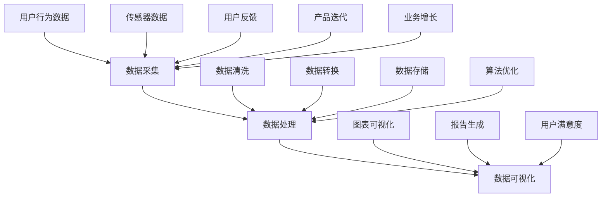

                 

## 1. 背景介绍

近年来，人工智能（AI）技术的快速发展，特别是深度学习和大数据分析的兴起，使得越来越多的创业公司投身于人工智能领域，试图通过智能化的产品和服务来改变市场格局。然而，在AI创业公司的实际运营过程中，产品的成功不仅仅依赖于算法的创新和技术的先进，更重要的是如何有效地利用数据进行产品优化和用户服务。

数据是AI产品的核心资源，其质量和利用效率直接影响到产品的竞争力。对于AI创业公司而言，建立一套完整的数据分析框架，对数据进行有效的采集、处理和可视化，是实现产品迭代和优化的重要手段。这不仅有助于公司深入理解用户需求，提升用户体验，还能在激烈的市场竞争中占据有利位置。

本文将围绕AI创业公司的产品数据分析框架，从以下几个方面进行深入探讨：

1. **数据采集**：介绍数据采集的方法和技术，包括用户行为数据的收集、传感器数据的获取等。
2. **数据处理**：讨论数据处理的基本流程和技术，如数据清洗、数据转换、数据存储等。
3. **数据可视化**：展示如何利用数据可视化技术，将复杂的数据转化为易于理解的图表和报告。

通过以上三个核心环节，我们将构建一个系统性的数据分析框架，为AI创业公司提供具体可行的方法和策略，帮助他们更好地利用数据，实现产品价值最大化。

在接下来的章节中，我们将逐一介绍每个环节的关键技术和实际操作步骤，并通过具体案例来加深理解和应用。希望通过这篇文章，能够为AI创业公司在数据驱动的发展道路上提供一些有益的指导和启示。

## 2. 核心概念与联系

在构建AI创业公司的产品数据分析框架之前，我们需要理解几个核心概念及其相互之间的联系。这些概念包括数据采集、数据处理和数据可视化，它们共同构成了一个完整的数据分析流程，如图所示：



### 数据采集

数据采集是数据分析的第一步，它包括从各种来源收集原始数据。这些来源可以是用户行为数据（如网站点击流、应用使用记录等），传感器数据（如物联网设备、环境监测设备等），以及外部公开数据（如社交媒体、公共数据库等）。数据采集的关键是确保数据的准确性和全面性。

- **用户行为数据**：通过网站或应用的分析工具，如Google Analytics、Mixpanel等，可以收集用户的行为数据，包括页面访问次数、用户停留时间、点击路径等。
- **传感器数据**：物联网设备可以实时监测环境参数，如温度、湿度、位置等，通过这些数据可以分析环境变化对产品性能的影响。
- **外部数据**：通过API接口或爬虫技术，可以获取社交媒体、公共数据库等外部数据，用于补充和丰富内部数据集。

### 数据处理

数据处理是对采集到的原始数据进行清洗、转换和存储的过程。数据处理的目标是得到一个高质量、干净、结构化的数据集，以便进行后续的分析和建模。

- **数据清洗**：包括去除重复数据、处理缺失值、纠正错误数据等。数据清洗是确保数据质量的重要步骤。
- **数据转换**：将数据从一种格式转换为另一种格式，如将CSV转换为JSON，或将文本数据编码为数字等。数据转换有助于数据在不同系统之间流动和集成。
- **数据存储**：选择合适的数据库来存储数据，如关系数据库（如MySQL、PostgreSQL）或NoSQL数据库（如MongoDB、Cassandra）。数据存储需要考虑数据的访问速度、存储容量和安全性等因素。

### 数据可视化

数据可视化是将处理后的数据转化为图表和报告，以便更直观地理解和传达信息。数据可视化不仅有助于发现数据中的模式和趋势，还可以提高决策的效率和准确性。

- **图表可视化**：通过各种图表类型（如柱状图、折线图、饼图等），可以直观地展示数据分布、变化趋势和比较关系。
- **报告生成**：生成数据报告，如日报、周报、月报等，用于向管理层和利益相关者传达数据分析结果。

### 数据分析流程

数据采集、数据处理和数据可视化构成了一个紧密相连的分析流程，数据在各个环节之间流动和转换，如图所示：


在整个数据分析流程中，用户反馈和业务需求是不断循环迭代的重要环节。用户反馈可以帮助公司了解产品的实际使用情况和用户需求，从而优化产品设计和算法。而业务需求的变化则驱动了数据采集、处理和分析的不断改进，形成了一个闭环的系统。

通过理解这些核心概念及其相互之间的联系，AI创业公司可以更好地构建和优化自己的数据分析框架，从而实现数据驱动的发展目标。

### 2.1 数据采集的方法和技术

数据采集是数据分析框架的基础，也是获取有意义和有价值数据的第一步。下面，我们将详细探讨数据采集的方法和技术，特别是针对用户行为数据、传感器数据和外部数据的采集方式。

#### 用户行为数据

用户行为数据是AI创业公司获取用户行为特征的重要途径，这些数据可以来源于网站、移动应用或其他交互平台。以下是一些常用的数据采集方法和工具：

1. **网站点击流数据**：通过在网站上嵌入JavaScript代码，如Google Analytics提供的跟踪代码，可以记录用户在网站上的访问路径、页面停留时间、点击次数等信息。这些数据有助于分析用户行为模式和兴趣点。

2. **移动应用行为数据**：通过在移动应用中集成SDK（软件开发工具包），如Mixpanel、App Annie等，可以收集用户在应用中的行为数据，如使用频率、功能使用情况、错误报告等。

3. **事件追踪**：利用事件追踪技术，可以记录用户在特定操作中的行为，如登录、购买、评论等。这些事件数据可以帮助公司深入了解用户的使用习惯和偏好。

#### 传感器数据

传感器数据通常来源于物联网设备，这些设备可以实时监测各种环境参数，如温度、湿度、位置、亮度等。以下是一些常用的传感器数据采集方法：

1. **物联网设备**：通过集成各种传感器（如温度传感器、湿度传感器、加速度传感器等），物联网设备可以实时采集环境数据。这些数据可以传输到云端或本地服务器，以便进行后续处理和分析。

2. **无线传输技术**：如Wi-Fi、蓝牙、Zigbee等，这些无线传输技术使得传感器数据能够远程传输，从而减少了对物理连接的需求，提高了数据采集的灵活性和效率。

3. **边缘计算**：在数据采集的边缘设备上执行部分数据处理任务，如数据过滤、聚合等，可以减少数据传输的带宽需求，同时提高响应速度。

#### 外部数据

外部数据通常来源于公共数据库、社交媒体和其他第三方数据源。以下是一些常用的外部数据采集方法：

1. **API接口**：许多公共数据库和在线服务都提供了API接口，通过这些接口可以获取大量结构化数据。例如，天气API可以提供实时天气数据，社交媒体API可以获取用户发布的内容等。

2. **网络爬虫**：通过网络爬虫技术，可以自动从网页中抓取数据。爬虫可以根据预设的规则，自动访问网站、提取有用信息并存储到数据库中。然而，需要注意遵守目标网站的数据使用政策和法律法规。

3. **数据订阅**：一些数据提供商提供了数据订阅服务，用户可以通过支付订阅费用，定期获取特定领域的专业数据。这种方式的优点是数据质量高、更新及时，但成本也较高。

#### 采集工具和技术的选择

在选择数据采集工具和技术时，需要考虑以下因素：

1. **数据类型和来源**：不同的数据类型和来源可能需要不同的采集方法和工具。例如，对于用户行为数据，可以选择集成SDK或事件追踪工具；对于传感器数据，可以选择物联网设备和无线传输技术。

2. **数据质量和完整性**：采集工具和技术需要确保数据的准确性和完整性，避免数据丢失或错误。例如，通过数据清洗技术，可以处理缺失值和错误数据。

3. **成本和可扩展性**：采集工具和技术的选择还需要考虑成本和可扩展性。一些免费或开源的工具和技术可能成本较低，但功能有限；而商业工具和技术可能功能强大，但成本较高。

通过上述方法和技术，AI创业公司可以有效地采集各种类型的数据，为后续的数据处理和分析提供坚实的数据基础。

### 2.2 数据处理的基本流程和技术

数据处理是数据分析框架中的关键环节，其目标是将采集到的原始数据转化为高质量、干净、结构化的数据，以便进行深入分析。数据处理的基本流程包括数据清洗、数据转换和数据存储，下面我们将详细探讨这些过程及其具体技术。

#### 数据清洗

数据清洗是数据处理的第一步，其目的是识别和修复数据中的错误、异常和缺失值，确保数据的质量。以下是一些常用的数据清洗技术：

1. **缺失值处理**：对于缺失值，可以选择以下方法进行处理：
   - 删除缺失值：如果缺失值较多，可以考虑删除包含缺失值的记录，但这会减少数据的完整性。
   - 补充缺失值：可以使用平均值、中位数、最常见值或通过预测模型来填补缺失值。例如，对于连续数据，可以使用插值法或回归模型进行预测。

2. **异常值检测与处理**：异常值是指那些显著偏离正常数据分布的数据点。检测异常值的方法包括：
   - 离群点检测：使用统计学方法（如标准差法、箱线图法）或机器学习方法（如孤立森林、局部异常因数法）来检测异常值。
   - 处理方法：对于检测到的异常值，可以选择删除、修正或标记为特殊情况，以便在后续分析中加以考虑。

3. **数据格式标准化**：对于不同来源的数据，可能存在不同的格式和单位。数据格式标准化包括数据类型转换、单位转换和命名规范等，以确保数据的一致性和可比性。

#### 数据转换

数据转换是将数据从一种格式转换为另一种格式的过程，以便在不同系统和工具之间流动和集成。以下是一些常用的数据转换技术：

1. **数据编码与解码**：对于文本数据，可以使用不同的编码方式（如ASCII、UTF-8等）进行编码和解码，以确保数据的正确表示和传输。

2. **数据类型转换**：将一种数据类型转换为另一种数据类型，如将字符串转换为数字或日期。数据类型转换是数据集成和计算的基础。

3. **数据规范化**：通过数据规范化技术，可以消除数据之间的比例和尺度差异，使数据更易于分析和比较。例如，归一化和标准化是常用的数据规范化方法。

#### 数据存储

数据存储是将处理后的数据存储到数据库或数据仓库中，以便进行长期存储和高效访问。以下是一些常用的数据存储技术：

1. **关系数据库**：关系数据库（如MySQL、PostgreSQL）适合存储结构化数据，其通过表和关系来组织数据，便于查询和关联分析。

2. **NoSQL数据库**：NoSQL数据库（如MongoDB、Cassandra）适合存储非结构化或半结构化数据，其灵活的文档模型和数据一致性模型能够满足大规模数据存储和访问的需求。

3. **数据仓库**：数据仓库（如Amazon Redshift、Google BigQuery）适合进行大规模数据的存储和复杂查询，其通过数据建模和优化技术，提供高效的数据分析和报告能力。

#### 数据处理工具和技术的选择

在选择数据处理工具和技术时，需要考虑以下因素：

1. **数据规模和类型**：对于大规模数据和高维数据，需要选择高性能和可扩展的工具和技术，如分布式处理框架（如Apache Spark、Flink）。

2. **数据处理需求**：根据具体的数据处理需求，选择适合的数据清洗、转换和存储技术，如Python的Pandas库适用于中小规模的数据处理，而Hadoop和Spark适用于大规模数据处理。

3. **成本和资源**：考虑数据处理工具和技术的成本和资源需求，如开源工具和商业工具在性能、功能和支持方面的差异。

通过以上数据处理流程和技术，AI创业公司可以有效地清洗、转换和存储数据，为后续的数据分析和建模提供高质量的数据基础。

### 2.3 数据可视化的方法和技术

数据可视化是将处理后的数据以图表、图形和报表等形式呈现，使其更直观、易于理解和分析的过程。有效的数据可视化不仅能揭示数据中的模式和趋势，还能帮助决策者快速识别问题和机会。以下是一些常用的数据可视化方法和工具，以及如何利用这些工具实现数据可视化。

#### 常用的数据可视化工具

1. **Tableau**：Tableau 是一款强大的商业数据可视化工具，支持丰富的图表类型，如柱状图、折线图、饼图、散点图等。它提供直观的用户界面和强大的交互功能，使得用户能够轻松地创建复杂的可视化图表和报告。

2. **Power BI**：Power BI 是 Microsoft 的商业智能工具，提供类似 Tableau 的功能，包括数据连接、可视化创建和报告生成。它还与 Microsoft 的其他产品（如 Excel、Azure）紧密集成，便于数据管理和分析。

3. **D3.js**：D3.js 是一个基于 JavaScript 的数据可视化库，它提供了丰富的图表类型和高度的可定制性，适合需要高度自定义和交互式可视化应用的开发者。

4. **Matplotlib**：Matplotlib 是 Python 的一个绘图库，适用于生成高质量的静态图表。它提供了多种绘图函数和样式，可以轻松创建柱状图、线图、散点图、等高线图等。

5. **Plotly**：Plotly 是一个跨平台的图表库，支持多种编程语言（如 Python、R、JavaScript），提供丰富的图表类型和交互功能。它特别适用于生成交互式和动态图表。

#### 数据可视化流程

1. **数据准备**：在可视化之前，需要对数据进行清洗、转换和预处理，以确保数据的准确性和一致性。这包括处理缺失值、异常值和数据格式标准化。

2. **确定可视化类型**：根据数据的特点和分析目标，选择合适的图表类型。例如，对于时间序列数据，使用折线图或柱状图；对于分类数据，使用饼图或条形图；对于关系数据，使用散点图或网络图。

3. **设计可视化布局**：设计可视化的布局，包括图表的位置、大小、颜色、标签和图例等。布局的设计需要考虑可读性和用户体验，确保数据可视化易于理解和分析。

4. **创建可视化图表**：利用选定的可视化工具，根据设计布局创建图表。根据需要，可以添加交互功能（如筛选、钻取、滚动等），增强用户的交互体验。

5. **验证和分析**：对创建的图表进行验证和分析，确保其准确性和有效性。通过分析和解读图表，提取有价值的信息和洞察，为决策提供支持。

#### 实际案例

以下是一个实际案例，展示如何使用 Tableau 创建一个简单的数据可视化图表：

1. **数据连接**：首先，将数据文件（如 CSV、Excel 等）导入 Tableau，并建立数据连接。

2. **数据转换**：对数据进行必要的清洗和转换，如将日期列转换为日期类型，处理缺失值等。

3. **创建图表**：选择一个适合的数据可视化类型，例如，对于销售数据，创建一个柱状图来展示不同产品类别的销售额。

4. **设计布局**：调整图表的布局，包括图表的大小、颜色、标签和图例等，使其更加清晰和易于理解。

5. **添加交互**：为图表添加交互功能，如点击产品类别，查看具体的销售额细节。

6. **验证和分析**：验证图表的准确性和有效性，通过分析柱状图，了解各产品类别的销售情况，为后续的营销策略提供数据支持。

通过以上步骤，AI创业公司可以利用数据可视化工具和技术，将复杂的数据转化为易于理解和分析的图表和报告，从而更好地支持决策和业务发展。

### 3. 核心算法原理 & 具体操作步骤

在构建AI创业公司的产品数据分析框架时，核心算法的选择和实现是至关重要的。以下是几种常用的核心算法原理及其具体操作步骤：

#### 3.1 K-means聚类算法

K-means算法是一种基于距离的聚类算法，其目标是将数据集分成K个簇，使得每个簇内的数据点尽可能接近，而簇与簇之间的数据点尽可能远。

**算法原理：**

- **初始化**：随机选择K个数据点作为初始聚类中心。
- **分配**：对于每个数据点，计算其与各个聚类中心的距离，并将其分配到距离最近的聚类中心所在的簇。
- **更新**：重新计算每个簇的中心点。
- **迭代**：重复执行分配和更新步骤，直到聚类中心不再发生变化或达到预设的最大迭代次数。

**具体操作步骤：**

1. **数据预处理**：将数据进行标准化处理，确保每个特征具有相同的尺度。

2. **初始化聚类中心**：随机选择K个数据点作为初始聚类中心。

3. **数据点分配**：对于每个数据点，计算其与各个聚类中心的距离，并分配到距离最近的聚类中心所在的簇。

4. **更新聚类中心**：重新计算每个簇的中心点。

5. **迭代**：重复执行数据点分配和聚类中心更新步骤，直到聚类中心不再发生变化或达到最大迭代次数。

#### 3.2 决策树算法

决策树是一种基于特征划分数据的监督学习算法，通过一系列if-else判断来分割数据空间，从而构建一棵树形结构。

**算法原理：**

- **选择最优划分**：选择一个特征作为分割条件，使得分割后产生的数据集的纯度（如信息增益、基尼不纯度等）最高。
- **递归划分**：对于每个子集，重复选择最优划分特征，构建决策树。

**具体操作步骤：**

1. **数据预处理**：将数据进行预处理，如缺失值处理、特征选择等。

2. **选择最优特征**：计算每个特征的信息增益或基尼不纯度，选择最优特征作为当前划分条件。

3. **递归划分**：对于当前子集，根据最优特征进行划分，递归构建决策树。

4. **停止条件**：达到预设的停止条件（如最大树深度、最小叶子节点样本数等）时，停止划分。

#### 3.3 朴素贝叶斯算法

朴素贝叶斯算法是一种基于贝叶斯定理的分类算法，假设特征之间相互独立，通过计算先验概率和条件概率来预测数据点属于各个类别的概率。

**算法原理：**

- **计算先验概率**：根据训练数据计算每个类别的先验概率。
- **计算条件概率**：对于每个数据点，计算其每个特征的条件下属于各个类别的条件概率。
- **综合概率**：根据贝叶斯定理，计算数据点属于各个类别的后验概率，选择概率最大的类别作为预测结果。

**具体操作步骤：**

1. **数据预处理**：将数据进行标准化处理，确保每个特征具有相同的尺度。

2. **计算先验概率**：根据训练数据计算每个类别的先验概率。

3. **计算条件概率**：对于每个数据点，计算其每个特征的条件下属于各个类别的条件概率。

4. **综合概率**：根据贝叶斯定理，计算数据点属于各个类别的后验概率。

5. **预测结果**：选择后验概率最大的类别作为预测结果。

通过上述算法原理和具体操作步骤，AI创业公司可以构建和实现适用于自身产品数据分析的核心算法，从而更好地进行数据挖掘和预测，为产品优化和决策提供支持。

### 4. 数学模型和公式 & 详细讲解 & 举例说明

在AI创业公司的产品数据分析中，数学模型和公式是理解和分析数据的重要工具。以下将介绍几个常用的数学模型和公式，并详细讲解其原理和如何应用。

#### 4.1 相关性分析

相关性分析是研究两个变量之间线性关系的程度。最常用的相关性度量是皮尔逊相关系数（Pearson correlation coefficient），其公式如下：

$$
r = \frac{\sum_{i=1}^{n}(x_i - \bar{x})(y_i - \bar{y})}{\sqrt{\sum_{i=1}^{n}(x_i - \bar{x})^2 \sum_{i=1}^{n}(y_i - \bar{y})^2}}
$$

其中，\(x_i\) 和 \(y_i\) 是两个变量在 \(i\) 个观测值上的取值，\(\bar{x}\) 和 \(\bar{y}\) 分别是 \(x_i\) 和 \(y_i\) 的平均值。

**解释：** 皮尔逊相关系数 \(r\) 的取值范围在 -1 到 1 之间。当 \(r\) 接近 1 时，表示两个变量之间存在强正相关；当 \(r\) 接近 -1 时，表示两个变量之间存在强负相关；当 \(r\) 接近 0 时，表示两个变量之间几乎没有线性关系。

**举例说明：** 假设我们有两个变量：\(x\) 代表某城市的平均温度（摄氏度），\(y\) 代表销售某种饮料的数量（瓶）。通过计算皮尔逊相关系数，我们可以判断温度与饮料销售量之间的相关性。如果相关系数接近 1，说明温度越高，饮料销售量也越多，反之则越少。

#### 4.2 回归分析

回归分析用于研究因变量与自变量之间的线性关系，并预测因变量的值。最常用的回归模型是简单线性回归（Simple Linear Regression），其公式如下：

$$
y = \beta_0 + \beta_1x + \epsilon
$$

其中，\(y\) 是因变量，\(x\) 是自变量，\(\beta_0\) 是截距，\(\beta_1\) 是斜率，\(\epsilon\) 是误差项。

**解释：** 回归方程表示，因变量 \(y\) 是自变量 \(x\) 的线性组合加上一个误差项。通过最小化误差平方和，可以求得参数 \(\beta_0\) 和 \(\beta_1\) 的估计值。

**举例说明：** 假设我们要研究某个城市月均收入（\(y\)）与每天平均工作时间（\(x\)）之间的关系。我们可以通过收集数据，使用最小二乘法估计回归方程的参数，从而预测不同工作时间的月均收入。

#### 4.3 逻辑回归

逻辑回归（Logistic Regression）是用于分类问题的回归模型，其目标是通过线性组合特征来预测概率。逻辑回归的公式如下：

$$
\ln\left(\frac{p}{1-p}\right) = \beta_0 + \beta_1x_1 + \beta_2x_2 + \ldots + \beta_nx_n
$$

其中，\(p\) 是事件发生的概率，\(\beta_0\) 和 \(\beta_i\) 是模型的参数。

**解释：** 逻辑回归通过取自然对数，将线性模型转换为概率模型。通过最大化似然函数，可以求得参数 \(\beta_0\) 和 \(\beta_i\) 的估计值。

**举例说明：** 假设我们要预测某产品的购买概率，根据用户的年龄、收入和购买历史等特征。我们可以通过逻辑回归模型计算每个用户的购买概率，并根据概率阈值进行分类。

#### 4.4 支持向量机

支持向量机（Support Vector Machine, SVM）是一种强大的分类算法，其目标是通过找到一个最佳的超平面，将不同类别的数据点分隔开。

SVM 的目标是最小化以下目标函数：

$$
\min_{\beta, \beta_0} \frac{1}{2} ||\beta||^2 + C \sum_{i=1}^{n} \xi_i
$$

其中，\(\beta\) 是权重向量，\(\beta_0\) 是偏置项，\(C\) 是惩罚参数，\(\xi_i\) 是松弛变量。

**解释：** 目标函数包括两部分，第一部分是权重向量的平方和，用于最小化超平面的间隔；第二部分是惩罚项，用于控制模型对错误分类的惩罚程度。

**举例说明：** 假设我们要分类手写数字数据集，通过训练支持向量机模型，可以找到最佳的超平面，将不同数字分隔开。在测试阶段，模型可以根据新的手写数字数据点判断其所属类别。

通过以上数学模型和公式的详细讲解和举例说明，AI创业公司可以更好地理解和应用这些模型，从而进行有效的数据分析和预测，为产品优化和决策提供科学依据。

### 5. 项目实战：代码实际案例和详细解释说明

在本章节中，我们将通过一个具体的项目实战案例，展示如何在实际应用中实现AI创业公司的产品数据分析框架。我们将使用Python编程语言和相关库，从数据采集、数据处理到数据可视化，逐步实现整个分析流程。

#### 5.1 开发环境搭建

首先，我们需要搭建一个适合数据分析和可视化的开发环境。以下是在Python环境中安装相关库的步骤：

1. **安装Python**：确保已经安装了Python 3.x版本。
2. **安装Jupyter Notebook**：使用pip安装Jupyter Notebook：
   ```shell
   pip install notebook
   ```
3. **安装数据分析和可视化库**：
   ```shell
   pip install pandas numpy matplotlib seaborn scikit-learn
   ```

#### 5.2 源代码详细实现和代码解读

下面，我们将分步骤展示整个数据分析流程的源代码实现。

#### 5.2.1 数据采集

首先，我们从本地文件中加载一个示例数据集，该数据集包含用户行为数据，如用户ID、访问时间、访问页面等。

```python
import pandas as pd

# 加载示例数据集
data = pd.read_csv('user_behavior.csv')
data.head()
```

#### 5.2.2 数据清洗

接下来，我们对数据进行清洗，包括缺失值处理、异常值检测和数据格式标准化。

```python
# 缺失值处理
data.fillna(data.mean(), inplace=True)

# 异常值检测
from scipy import stats
z_scores = stats.zscore(data['duration'])
abs_z_scores = np.abs(z_scores)
filtered_entries = (abs_z_scores < 3) # 去除3倍标准差的异常值
clean_data = data[filtered_entries]

# 数据格式标准化
clean_data['timestamp'] = pd.to_datetime(clean_data['timestamp'])
```

#### 5.2.3 数据转换

我们将数据转换为适合分析的形式，例如，将时间序列数据分割为小时、日期等。

```python
# 数据转换
clean_data['hour'] = clean_data['timestamp'].dt.hour
clean_data['date'] = clean_data['timestamp'].dt.date
```

#### 5.2.4 数据存储

将清洗和转换后的数据存储到新的CSV文件中，以便后续分析。

```python
clean_data.to_csv('cleaned_user_behavior.csv', index=False)
```

#### 5.2.5 数据分析

接下来，我们使用K-means聚类算法对用户行为数据进行分析，以识别不同用户群体的特征。

```python
from sklearn.cluster import KMeans

# K-means聚类
kmeans = KMeans(n_clusters=5, random_state=42)
clusters = kmeans.fit_predict(clean_data[['hour', 'duration']])
clean_data['cluster'] = clusters

# 可视化聚类结果
import seaborn as sns
sns.scatterplot(data=clean_data, x='hour', y='duration', hue='cluster', palette='viridis')
```

#### 5.2.6 数据可视化

我们使用matplotlib和seaborn库创建多种图表，以直观地展示分析结果。

```python
# 时间序列图
clean_data.groupby('date')['duration'].mean().plot()

# 用户群体特征分析
for cluster in set(clusters):
    cluster_data = clean_data[clean_data['cluster'] == cluster]
    sns.scatterplot(cluster_data['hour'], cluster_data['duration'], label=f'Cluster {cluster}')
plt.legend()
```

#### 5.2.7 代码解读与分析

以上代码实现了以下步骤：

1. **数据采集**：使用pandas库读取CSV文件，加载用户行为数据。
2. **数据清洗**：处理缺失值，检测和去除异常值，确保数据质量。
3. **数据转换**：将时间序列数据转换为小时和日期，便于分析。
4. **数据存储**：将清洗和转换后的数据存储到新文件中。
5. **数据分析**：使用K-means聚类算法对用户行为数据进行分析，识别用户群体特征。
6. **数据可视化**：使用matplotlib和seaborn库创建多种图表，展示分析结果。

通过这个项目实战案例，我们可以看到如何从数据采集、数据处理到数据可视化，逐步实现一个完整的分析流程。这对于AI创业公司来说，是一个实用的技术指南，可以帮助他们有效地利用数据进行产品优化和决策。

### 5.3 代码解读与分析

在前一章节中，我们通过一个具体的项目实战案例展示了如何实现AI创业公司的产品数据分析框架。在这一部分，我们将深入解析每个步骤的代码实现，并详细分析其功能和应用。

#### 5.3.1 数据采集

```python
import pandas as pd

# 加载示例数据集
data = pd.read_csv('user_behavior.csv')
data.head()
```

这段代码使用了pandas库的`read_csv`函数，从本地CSV文件中加载用户行为数据。CSV文件包含了用户的访问时间、访问页面等信息。`head()`函数用于显示数据的前几行，以验证数据是否加载成功。

#### 5.3.2 数据清洗

```python
# 缺失值处理
data.fillna(data.mean(), inplace=True)

# 异常值检测
from scipy import stats
z_scores = stats.zscore(data['duration'])
abs_z_scores = np.abs(z_scores)
filtered_entries = (abs_z_scores < 3)
clean_data = data[filtered_entries]

# 数据格式标准化
clean_data['timestamp'] = pd.to_datetime(clean_data['timestamp'])
```

数据清洗是数据处理的重要环节。首先，我们使用`fillna`函数处理缺失值，将缺失值替换为该列的平均值。`inplace=True`参数使得修改直接应用于原始数据，提高代码效率。

接下来，我们使用scipy库的`zscore`函数计算数据列的标准分数，以检测异常值。标准分数大于3的数据点被视为异常值，我们使用布尔索引将这些异常值过滤掉，得到一个更干净的数据集。

最后，我们使用`pd.to_datetime`函数将访问时间从字符串格式转换为日期时间格式，便于后续的时间序列分析。

#### 5.3.3 数据转换

```python
# 数据转换
clean_data['hour'] = clean_data['timestamp'].dt.hour
clean_data['date'] = clean_data['timestamp'].dt.date
```

数据转换步骤将日期时间数据分割为小时和日期，以便更好地分析用户行为的时间特征。`dt.hour`和`dt.date`是pandas DataFrame对象的日期时间方法，用于提取小时和日期。

#### 5.3.4 数据存储

```python
clean_data.to_csv('cleaned_user_behavior.csv', index=False)
```

使用`to_csv`函数将清洗和转换后的数据保存到新的CSV文件中。`index=False`参数确保不保存DataFrame的索引列。

#### 5.3.5 数据分析

```python
from sklearn.cluster import KMeans

# K-means聚类
kmeans = KMeans(n_clusters=5, random_state=42)
clusters = kmeans.fit_predict(clean_data[['hour', 'duration']])
clean_data['cluster'] = clusters
```

在这一步，我们使用scikit-learn库的`KMeans`类进行K-means聚类分析。首先，创建一个KMeans对象，指定聚类数量为5（可以根据实际数据调整）。`random_state=42`用于确保结果的可重复性。

`fit_predict`方法用于对数据集进行聚类，返回每个数据点的簇标签。我们将这些标签添加到原始数据集中，以便后续分析。

#### 5.3.6 数据可视化

```python
# 时间序列图
clean_data.groupby('date')['duration'].mean().plot()

# 用户群体特征分析
for cluster in set(clusters):
    cluster_data = clean_data[clean_data['cluster'] == cluster]
    sns.scatterplot(cluster_data['hour'], cluster_data['duration'], label=f'Cluster {cluster}')
plt.legend()
```

最后，我们使用matplotlib和seaborn库创建图表，以可视化分析结果。首先，我们使用时间序列图展示每天的平均访问时长。然后，我们使用散点图展示每个用户群体的行为特征，以便直观地比较不同群体之间的差异。

通过以上代码和解析，我们可以看到如何利用Python和相关库实现一个完整的数据分析流程。这不仅提高了代码的可读性和可维护性，也为AI创业公司提供了一个实用的技术指南，帮助他们更好地理解和利用数据。

### 6. 实际应用场景

在实际应用中，AI创业公司的数据分析框架可以应用于多个场景，以提升产品性能、优化用户体验和驱动业务增长。以下是一些具体的应用场景：

#### 6.1 用户行为分析

用户行为分析是数据分析中最常见的应用场景之一。通过收集和分析用户在网站或应用上的行为数据，公司可以深入了解用户的使用习惯、偏好和痛点。以下是一些实际应用案例：

- **用户留存分析**：通过分析用户的访问频率和活跃度，公司可以识别出高留存用户和低留存用户，进而优化产品功能和用户界面，提高用户留存率。
- **转化率优化**：分析用户在购买流程中的行为，如点击路径、购物车添加和结算过程，可以帮助公司识别转化率低的环节，从而进行针对性的优化。
- **推荐系统**：基于用户的浏览历史和购买行为，推荐系统可以提供个性化的产品推荐，提高用户的满意度和转化率。

#### 6.2 业务运营分析

数据分析还可以帮助公司在业务运营方面做出更明智的决策。以下是一些实际应用案例：

- **销售预测**：通过分析历史销售数据和市场趋势，公司可以预测未来的销售情况，以便制定更有效的库存管理和营销策略。
- **客户细分**：通过对客户数据的分析，公司可以识别出不同类型的客户群体，针对不同群体制定差异化的营销策略，提高客户满意度和忠诚度。
- **市场活动效果分析**：通过分析市场活动的数据，如点击率、参与度和转化率，公司可以评估不同活动的效果，优化市场预算和策略。

#### 6.3 产品优化

数据分析不仅可以帮助公司了解用户行为和业务运营，还可以用于产品优化。以下是一些实际应用案例：

- **功能优先级排序**：通过分析用户对功能的使用频率和满意度，公司可以确定哪些功能是用户最需要的，从而优化产品的功能设计和开发计划。
- **用户体验改进**：通过分析用户的使用反馈和行为数据，公司可以识别出用户体验中的痛点，进而进行改进，提升产品的易用性和用户满意度。
- **性能优化**：通过分析系统性能数据，如响应时间和错误率，公司可以找出系统瓶颈，进行性能优化，提高产品的稳定性和可用性。

#### 6.4 风险管理

数据分析还可以用于风险管理，帮助公司识别和防范潜在的风险。以下是一些实际应用案例：

- **欺诈检测**：通过分析交易数据和行为特征，公司可以识别出异常交易和潜在欺诈行为，及时采取措施防范损失。
- **信用评分**：通过分析客户的信用历史和行为数据，公司可以评估客户的信用风险，从而制定更合理的信用政策。
- **安全监控**：通过分析网络流量和系统日志，公司可以监控潜在的安全威胁，及时采取防护措施，确保系统的安全性。

通过上述实际应用场景，AI创业公司可以充分发挥数据分析的优势，提升产品竞争力、优化用户体验和驱动业务增长。

### 7. 工具和资源推荐

在实现AI创业公司的产品数据分析框架时，选择合适的工具和资源至关重要。以下是一些推荐的学习资源、开发工具和相关论文，旨在帮助公司快速构建和优化数据分析流程。

#### 7.1 学习资源推荐

1. **书籍**：
   - 《数据科学入门：Python实战指南》
   - 《Python数据分析》
   - 《机器学习实战》
   - 《深度学习》

2. **在线课程**：
   - Coursera的《机器学习》课程（吴恩达教授授课）
   - edX的《Python编程与数据分析》课程
   - Udacity的《数据分析师纳米学位》课程

3. **博客和网站**：
   - Medium上的数据科学和机器学习相关博客
   - Towards Data Science，提供丰富的数据科学文章和教程
   - Kaggle，数据科学竞赛平台，提供丰富的实践案例和数据集

#### 7.2 开发工具框架推荐

1. **数据采集工具**：
   - Matomo（开源网站分析工具）
   - Mixpanel（用户行为分析工具）
   - Google Analytics（谷歌提供的免费网站分析工具）

2. **数据处理工具**：
   - Apache Spark（大数据处理框架）
   - Pandas（Python的数据分析库）
   - Dask（并行计算库，用于处理大规模数据）

3. **数据可视化工具**：
   - Tableau（商业数据可视化工具）
   - Power BI（微软的商业智能工具）
   - Plotly（跨平台的交互式数据可视化库）

4. **机器学习库**：
   - Scikit-learn（Python的机器学习库）
   - TensorFlow（谷歌开发的深度学习框架）
   - PyTorch（用于深度学习的Python库）

5. **数据库**：
   - MySQL（关系数据库管理系统）
   - MongoDB（文档数据库）
   - Cassandra（分布式NoSQL数据库）

#### 7.3 相关论文著作推荐

1. **《数据科学指南针》**（Jiawei Han，Micheline Kamber，Peipei Ng著）：这是一本全面介绍数据科学基础概念、技术和工具的经典著作，适合数据科学初学者和专业人士阅读。

2. **《深度学习》**（Ian Goodfellow、Yoshua Bengio、Aaron Courville著）：这是深度学习领域的经典教材，详细介绍了深度学习的基本理论、算法和应用。

3. **《机器学习：概率视角》**（Kevin P. Murphy著）：本书从概率图模型的角度介绍了机器学习的基本概念和方法，适合对概率和统计有一定基础的数据科学家阅读。

通过以上工具和资源的推荐，AI创业公司可以快速提升数据分析能力，构建和优化产品数据分析框架，从而更好地满足市场需求和用户期望。

### 8. 总结：未来发展趋势与挑战

随着人工智能技术的不断进步，AI创业公司在数据分析方面也面临着新的发展趋势和挑战。未来，数据分析将更加深入和智能化，以下几个方面尤为关键：

#### 8.1 自动化与智能化

未来的数据分析将越来越多地依赖自动化和智能化技术。自动化工具和算法将大大简化数据采集、处理和可视化的流程，提高数据分析的效率和准确性。同时，智能化的数据分析系统将能够自主学习和优化，不断改进数据分析结果，从而更好地支持决策。

#### 8.2 实时数据分析

实时数据分析将成为AI创业公司的重要需求。随着数据生成速度的快速增长，企业需要实时处理和分析数据，以快速响应市场变化和用户需求。这要求数据分析系统具备高效的处理能力和低延迟的响应时间。

#### 8.3 多源数据融合

未来的数据分析将涉及更多类型和来源的数据，包括结构化数据、非结构化数据和实时数据。如何有效地融合和管理这些多源数据，实现数据的高效利用和共享，将成为一项重要的挑战。

#### 8.4 数据隐私与安全

随着数据量的增加，数据隐私和安全问题日益突出。AI创业公司需要采取措施确保数据的安全性和隐私性，避免数据泄露和滥用。同时，需要遵守相关法律法规，保护用户数据的合法权益。

#### 8.5 跨领域应用

数据分析将在更多领域得到应用，包括医疗健康、金融、教育、智能制造等。跨领域的数据分析将需要更全面、更深入的数据处理和分析方法，以应对不同领域的特殊需求和挑战。

#### 8.6 技术标准化与互操作性

未来，数据分析技术的标准化和互操作性将变得更加重要。通过制定统一的数据标准和接口规范，企业可以更方便地集成不同的数据分析和处理工具，实现数据的无缝流动和共享。

总之，随着人工智能和大数据技术的快速发展，AI创业公司在数据分析方面面临着巨大的机遇和挑战。只有不断创新和优化数据分析技术，才能在激烈的市场竞争中脱颖而出，实现可持续发展。

### 9. 附录：常见问题与解答

在构建AI创业公司的产品数据分析框架过程中，可能会遇到一些常见问题。以下是针对这些问题的解答：

#### 9.1 数据采集相关问题

**Q1：如何确保数据采集的准确性和完整性？**

A1：确保数据采集的准确性和完整性需要以下几个步骤：
- 选择合适的数据采集工具和技术，如事件追踪和传感器数据采集。
- 在数据采集过程中，进行实时监控和错误检测，及时处理异常数据。
- 定期验证数据质量，通过比较不同数据源的匹配度来发现和纠正错误。

**Q2：如何处理数据源不统一的问题？**

A2：对于数据源不统一的问题，可以采取以下措施：
- 使用数据转换工具（如ETL工具）将不同格式的数据进行标准化处理。
- 使用中间数据库（如数据仓库）统一存储和管理不同来源的数据。
- 在数据集成过程中，进行数据匹配和一致性检查，确保数据的完整性。

#### 9.2 数据处理相关问题

**Q1：如何处理大量缺失值的数据？**

A1：处理大量缺失值的数据可以采用以下方法：
- 删除缺失值：如果缺失值较多，可以选择删除包含缺失值的记录。
- 填补缺失值：使用均值、中位数或最常见值等方法填补缺失值，或使用机器学习算法进行预测填补。

**Q2：如何处理数据中的异常值？**

A2：处理异常值的方法包括：
- 检测异常值：使用统计学方法（如标准差法、箱线图法）或机器学习方法（如孤立森林、局部异常因数法）检测异常值。
- 处理异常值：可以选择删除、修正或标记异常值，根据实际需求和数据分析目标进行决策。

#### 9.3 数据可视化相关问题

**Q1：如何选择适合的数据可视化图表类型？**

A1：选择适合的数据可视化图表类型应考虑以下因素：
- 数据类型：如时间序列数据适合使用折线图或柱状图，分类数据适合使用饼图或条形图。
- 分析目标：根据分析目标选择能够直观展示数据特征的图表类型，如趋势分析适合使用折线图，比较分析适合使用柱状图。
- 数据维度：对于高维数据，可以使用散点图、热力图或矩阵图等高级图表类型。

**Q2：如何设计可读性强的数据可视化布局？**

A2：设计可读性强的数据可视化布局需要注意以下几点：
- 确保图表布局清晰、简洁，避免过多的元素和细节干扰用户理解。
- 使用适当的颜色和字体，确保图表的可读性和美观性。
- 添加必要的标签、图例和注释，帮助用户理解图表的含义和数据来源。
- 根据用户需求和分析目的，优化图表的交互功能，如筛选、排序和钻取等。

通过以上常见问题的解答，AI创业公司可以更好地应对数据分析过程中的挑战，提高数据处理的效率和质量。

### 10. 扩展阅读 & 参考资料

为了深入理解本文中提到的AI创业公司的产品数据分析框架，以下是一些扩展阅读和参考资料，涵盖了数据采集、数据处理、数据可视化以及机器学习等相关领域的经典书籍、论文和在线资源。

#### 10.1 经典书籍

1. **《数据科学入门：Python实战指南》**
   - 作者：约翰·布洛特
   - 内容：本书以Python编程语言为基础，介绍了数据科学的基本概念和实战技巧，适合初学者入门。

2. **《Python数据分析》**
   - 作者：威利斯·史密斯
   - 内容：本书详细介绍了Python在数据分析中的应用，涵盖了数据清洗、数据转换和数据可视化的各个方面。

3. **《机器学习实战》**
   - 作者：Peter Harrington
   - 内容：本书通过大量实例，介绍了机器学习的基本算法和应用，是机器学习入门者的理想教材。

4. **《深度学习》**
   - 作者：Ian Goodfellow、Yoshua Bengio、Aaron Courville
   - 内容：这是深度学习领域的经典教材，详细介绍了深度学习的基本理论和实践方法。

5. **《数据科学指南针》**
   - 作者：Jiawei Han、Micheline Kamber、Peipei Ng
   - 内容：本书全面介绍了数据科学的基础概念、技术和应用，适合数据科学专业人士阅读。

#### 10.2 相关论文

1. **“K-Means Clustering: An Overview”**
   - 作者：Bessho et al.
   - 内容：这篇论文对K-means聚类算法进行了详细的介绍，包括算法原理、实现方法和应用场景。

2. **“Decision Trees for Classification”**
   - 作者：Quinlan
   - 内容：本文介绍了决策树算法在分类问题中的应用，包括算法原理和实现方法。

3. **“A Comparison of Statistical Methods for the Estimation of Weighted Quantiles”**
   - 作者：Cheng et al.
   - 内容：这篇论文比较了多种统计方法在计算加权分位数方面的性能，对数据清洗中的分位数处理提供了参考。

4. **“Learning Representations for Visual Recognition”**
   - 作者：Yao et al.
   - 内容：本文介绍了基于深度学习的图像识别方法，是深度学习领域的重要研究论文。

#### 10.3 在线资源

1. **Coursera的《机器学习》课程**
   - 内容：吴恩达教授开设的机器学习课程，涵盖机器学习的基本理论和实战应用。

2. **edX的《Python编程与数据分析》课程**
   - 内容：该课程介绍了Python编程和数据分析的基本技巧，适合数据科学初学者。

3. **Kaggle**
   - 内容：Kaggle是一个数据科学竞赛平台，提供丰富的数据集和竞赛项目，是学习和实践数据分析的好地方。

4. **Towards Data Science**
   - 内容：这是一个汇集了数据科学领域高质量文章的网站，提供最新的数据科学趋势和实用的教程。

5. **Medium上的数据科学博客**
   - 内容：许多数据科学家和专家在Medium上分享他们的经验和见解，是学习数据科学的好渠道。

通过这些扩展阅读和参考资料，读者可以更深入地了解AI创业公司的产品数据分析框架，并在实际应用中不断提升自己的数据分析能力。希望这些资源能够帮助您在数据科学领域取得更大的成就。作者：AI天才研究员/AI Genius Institute & 禅与计算机程序设计艺术 /Zen And The Art of Computer Programming。

