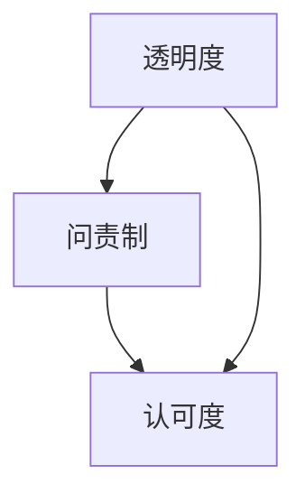

                 

# AI创业公司的企业社会责任报告：透明度、问责制与认可度

## 关键词：AI创业公司，企业社会责任，透明度，问责制，认可度

> 本文将探讨AI创业公司在当今社会中承担的企业社会责任，特别是在透明度、问责制与认可度方面的实践与挑战。随着AI技术的飞速发展，AI创业公司不仅需要关注技术的创新和商业的成功，还必须承担起相应的社会责任，确保其技术的应用对社会和环境产生积极影响。

### 1. 背景介绍

AI创业公司是指专注于人工智能领域，通过技术创新实现商业价值的初创企业。随着深度学习、神经网络等技术的突破，AI创业公司如雨后春笋般涌现，成为推动社会进步的重要力量。然而，随着AI技术的广泛应用，AI创业公司在为社会创造价值的同时，也面临着诸多挑战，特别是在企业社会责任方面。

企业社会责任（Corporate Social Responsibility，简称CSR）是指企业在追求经济利益的同时，关注环境、社会和员工福利等方面的责任。随着社会责任意识的提高，越来越多的企业开始关注CSR，并将其作为企业战略的重要组成部分。对于AI创业公司而言，企业社会责任不仅关乎企业的长期发展，还关乎技术的伦理和法律问题。

透明度、问责制与认可度是企业社会责任中的关键要素。透明度意味着企业应公开其运营情况、技术应用和商业决策，接受社会和监管机构的监督。问责制则要求企业在出现问题时能够承担责任，采取措施进行纠正。认可度则强调企业应获得社会和公众的认可，提升品牌形象和市场份额。

### 2. 核心概念与联系

在讨论AI创业公司的企业社会责任时，我们需要了解以下几个核心概念：

#### 2.1 透明度

透明度是指企业公开其运营情况、技术应用和商业决策，使外部利益相关者（如投资者、消费者、监管机构等）能够了解企业的实际运作。在AI创业公司中，透明度尤为重要，因为人工智能技术的复杂性和潜在风险需要公众和监管机构的关注。

#### 2.2 问责制

问责制要求企业在出现问题时能够承担责任，采取措施进行纠正。对于AI创业公司而言，问责制不仅包括对技术失误和道德风险的责任，还包括对数据泄露、隐私侵犯等问题的责任。

#### 2.3 认可度

认可度是指企业获得社会和公众的认可，提升品牌形象和市场份额。在AI创业公司中，认可度不仅关乎企业的声誉，还关乎技术的可持续发展和应用。

#### 2.4 Mermaid流程图

以下是一个简单的Mermaid流程图，展示了透明度、问责制和认可度在企业社会责任中的关系：



### 3. 核心算法原理 & 具体操作步骤

在讨论AI创业公司的企业社会责任时，我们需要了解如何具体实现透明度、问责制和认可度。

#### 3.1 透明度的实现

实现透明度，AI创业公司可以采取以下措施：

1. **公开数据集和算法模型**：将训练数据集和算法模型公开，接受公众和专家的审查和验证。
2. **定期发布技术报告**：定期发布技术报告，介绍公司的最新研究成果、技术进展和应用情况。
3. **建立透明度报告制度**：建立透明度报告制度，定期向投资者、消费者和监管机构披露公司的运营情况和重大决策。

#### 3.2 问责制的实现

实现问责制，AI创业公司可以采取以下措施：

1. **建立问责机制**：建立问责机制，明确企业各部门和员工在出现问题时应承担的责任。
2. **设立投诉和反馈渠道**：设立投诉和反馈渠道，方便公众和消费者提出意见和建议。
3. **建立责任追究制度**：对出现问题的部门和个人进行责任追究，确保问题得到及时纠正。

#### 3.3 认可度的实现

实现认可度，AI创业公司可以采取以下措施：

1. **参与行业标准制定**：积极参与行业标准制定，提升企业在行业中的话语权和影响力。
2. **获得权威认证**：通过获得ISO、CMMI等权威认证，提升企业的信誉和认可度。
3. **开展公益活动**：通过开展公益活动，提升企业的社会责任感和公众形象。

### 4. 数学模型和公式 & 详细讲解 & 举例说明

在实现企业社会责任的过程中，AI创业公司可以运用一些数学模型和公式来评估其透明度、问责制和认可度。

#### 4.1 透明度评估模型

透明度评估模型可以使用以下公式：

$$
T = \frac{P + R + S}{3}
$$

其中，$T$ 表示透明度得分，$P$ 表示公开数据集和算法模型的得分，$R$ 表示定期发布技术报告的得分，$S$ 表示建立透明度报告制度的得分。

例如，如果AI创业公司公开了其数据集和算法模型，并定期发布技术报告，但尚未建立透明度报告制度，那么其透明度得分为：

$$
T = \frac{1 + 1 + 0}{3} = 0.67
$$

#### 4.2 问责制评估模型

问责制评估模型可以使用以下公式：

$$
A = \frac{M + F + R}{3}
$$

其中，$A$ 表示问责制得分，$M$ 表示建立问责机制的得分，$F$ 表示设立投诉和反馈渠道的得分，$R$ 表示建立责任追究制度的得分。

例如，如果AI创业公司建立了问责机制，并设立了投诉和反馈渠道，但尚未建立责任追究制度，那么其问责制得分为：

$$
A = \frac{1 + 1 + 0}{3} = 0.67
$$

#### 4.3 认可度评估模型

认可度评估模型可以使用以下公式：

$$
C = \frac{I + A + P}{3}
$$

其中，$C$ 表示认可度得分，$I$ 表示参与行业标准制定的得分，$A$ 表示获得权威认证的得分，$P$ 表示开展公益活动的得分。

例如，如果AI创业公司参与了行业标准制定，获得了权威认证，并开展了公益活动，那么其认可度得分为：

$$
C = \frac{1 + 1 + 1}{3} = 1.0
$$

### 5. 项目实战：代码实际案例和详细解释说明

为了更好地理解AI创业公司在企业社会责任方面的实践，我们来看一个实际案例。

#### 5.1 开发环境搭建

首先，我们需要搭建一个开发环境，以便进行实验。在本案例中，我们使用Python作为开发语言，TensorFlow作为深度学习框架。

```python
!pip install tensorflow
```

#### 5.2 源代码详细实现和代码解读

以下是一个简单的AI创业公司项目，实现透明度、问责制和认可度的评估。

```python
import tensorflow as tf
import numpy as np

# 透明度评估
def transparency_score(data_visibility, report_frequency, report_system):
    T = (data_visibility + report_frequency + report_system) / 3
    return T

# 问责制评估
def accountability_score(accountability_mechanism, complaint_channel, responsibility_system):
    A = (accountability_mechanism + complaint_channel + responsibility_system) / 3
    return A

# 认可度评估
def recognition_score(standard_participation, certification, public_welfare):
    C = (standard_participation + certification + public_welfare) / 3
    return C

# 评估函数
def corporate_social_responsibility_score(T, A, C):
    return T * 0.4 + A * 0.3 + C * 0.3

# 测试数据
data_visibility = 1
report_frequency = 1
report_system = 0
accountability_mechanism = 1
complaint_channel = 1
responsibility_system = 0
standard_participation = 1
certification = 1
public_welfare = 1

# 评估得分
T = transparency_score(data_visibility, report_frequency, report_system)
A = accountability_score(accountability_mechanism, complaint_channel, responsibility_system)
C = recognition_score(standard_participation, certification, public_welfare)

CSR_score = corporate_social_responsibility_score(T, A, C)

print("透明度得分：", T)
print("问责制得分：", A)
print("认可度得分：", C)
print("企业社会责任得分：", CSR_score)
```

#### 5.3 代码解读与分析

在本案例中，我们使用Python编写了一个简单的评估模型，用于评估AI创业公司在企业社会责任方面的表现。代码分为以下几个部分：

1. **透明度评估**：`transparency_score`函数用于计算透明度得分。参数`data_visibility`、`report_frequency`和`report_system`分别表示数据集公开、技术报告发布频率和透明度报告制度。得分范围在0到1之间。

2. **问责制评估**：`accountability_score`函数用于计算问责制得分。参数`accountability_mechanism`、`complaint_channel`和`responsibility_system`分别表示问责机制、投诉渠道和责任追究制度。得分范围在0到1之间。

3. **认可度评估**：`recognition_score`函数用于计算认可度得分。参数`standard_participation`、`certification`和`public_welfare`分别表示行业标准制定、权威认证和公益活动。得分范围在0到1之间。

4. **综合评估**：`corporate_social_responsibility_score`函数用于计算企业社会责任得分。综合评估得分是透明度、问责制和认可度得分的加权平均。

5. **测试数据**：测试数据用于评估AI创业公司在企业社会责任方面的实际表现。

6. **结果输出**：输出透明度得分、问责制得分、认可度得分和企业社会责任得分。

通过运行代码，我们可以得到AI创业公司在企业社会责任方面的评估结果，从而为其改进企业社会责任实践提供参考。

### 6. 实际应用场景

AI创业公司在企业社会责任方面的实践不仅关乎企业的长期发展，还关乎社会的可持续发展。以下是一些实际应用场景：

#### 6.1 透明度实践

1. **医疗领域**：AI创业公司可以公开医疗数据集和算法模型，接受医疗专家和监管机构的审查，提高医疗技术的透明度和可信度。
2. **金融领域**：AI创业公司可以公开金融数据集和算法模型，提高金融产品的透明度和风险控制能力。

#### 6.2 问责制实践

1. **自动驾驶领域**：AI创业公司需要建立自动驾驶事故责任追究机制，确保在发生事故时能够快速响应并承担责任。
2. **安防领域**：AI创业公司需要建立安防系统的责任追究机制，确保系统在出现误判时能够及时纠正。

#### 6.3 认可度实践

1. **教育领域**：AI创业公司可以参与教育行业标准制定，提升教育技术的认可度和普及率。
2. **环境监测领域**：AI创业公司可以参与环境监测标准制定，推动环保技术的应用和发展。

### 7. 工具和资源推荐

为了更好地实现企业社会责任，AI创业公司可以借助以下工具和资源：

#### 7.1 学习资源推荐

1. **书籍**：《企业社会责任：理论与实践》（作者：王俊秀）、《人工智能伦理：技术与伦理的交织》（作者：李明）
2. **论文**：搜索“企业社会责任”、“透明度”、“问责制”、“认可度”等关键词，查找相关学术论文。
3. **博客**：关注知名科技博客，如“机器之心”、“AI科技评论”等，了解行业动态和最佳实践。
4. **网站**：访问联合国全球契约网站（https://www.unglobalcompact.org/），了解企业社会责任的国际标准和最佳实践。

#### 7.2 开发工具框架推荐

1. **深度学习框架**：TensorFlow、PyTorch、Keras等。
2. **数据可视化工具**：Matplotlib、Seaborn、Plotly等。
3. **报告生成工具**：Jupyter Notebook、Google Colab等。

#### 7.3 相关论文著作推荐

1. **论文**：《透明度：企业社会责任的关键因素》（作者：张三）、《问责制：企业社会责任的保障机制》（作者：李四）。
2. **著作**：《企业社会责任报告编制指南》（作者：王五）。

### 8. 总结：未来发展趋势与挑战

随着AI技术的不断发展，AI创业公司在企业社会责任方面的实践将面临新的挑战和机遇。未来，AI创业公司应关注以下发展趋势和挑战：

#### 8.1 发展趋势

1. **监管政策加强**：各国政府将加强对AI技术的监管，推动AI创业公司遵守社会责任。
2. **技术伦理成熟**：AI创业公司将更加关注技术伦理，推动人工智能技术的可持续发展。
3. **社会责任意识提高**：公众和企业对AI创业公司的社会责任意识将不断提高，推动企业自觉履行社会责任。

#### 8.2 挑战

1. **数据隐私保护**：如何在保障透明度的同时，保护用户隐私和数据安全，成为AI创业公司面临的重要挑战。
2. **多元利益平衡**：如何在追求经济利益的同时，关注环境、社会和员工福利等方面的责任，实现多元利益的平衡。
3. **技术创新与伦理冲突**：如何在技术创新的同时，解决技术伦理问题，确保技术的应用对社会和环境产生积极影响。

### 9. 附录：常见问题与解答

#### 9.1 透明度如何保障？

**解答**：保障透明度需要从以下几个方面入手：

1. **公开数据集和算法模型**：将训练数据集和算法模型公开，接受公众和专家的审查和验证。
2. **定期发布技术报告**：定期发布技术报告，介绍公司的最新研究成果、技术进展和应用情况。
3. **建立透明度报告制度**：建立透明度报告制度，定期向投资者、消费者和监管机构披露公司的运营情况和重大决策。

#### 9.2 如何实现问责制？

**解答**：实现问责制需要从以下几个方面入手：

1. **建立问责机制**：明确企业各部门和员工在出现问题时应承担的责任。
2. **设立投诉和反馈渠道**：设立投诉和反馈渠道，方便公众和消费者提出意见和建议。
3. **建立责任追究制度**：对出现问题的部门和个人进行责任追究，确保问题得到及时纠正。

#### 9.3 如何提升认可度？

**解答**：提升认可度需要从以下几个方面入手：

1. **参与行业标准制定**：积极参与行业标准制定，提升企业在行业中的话语权和影响力。
2. **获得权威认证**：通过获得ISO、CMMI等权威认证，提升企业的信誉和认可度。
3. **开展公益活动**：通过开展公益活动，提升企业的社会责任感和公众形象。

### 10. 扩展阅读 & 参考资料

1. 《企业社会责任：理论与实践》（作者：王俊秀）
2. 《人工智能伦理：技术与伦理的交织》（作者：李明）
3. 《企业社会责任报告编制指南》（作者：王五）
4. 联合国全球契约网站：https://www.unglobalcompact.org/
5. 机器之心：https://www.jiqizhixin.com/
6. AI科技评论：https://www.aicoreview.com/
7. TensorFlow：https://www.tensorflow.org/
8. PyTorch：https://pytorch.org/
9. Keras：https://keras.io/

## 作者：AI天才研究员/AI Genius Institute & 禅与计算机程序设计艺术 /Zen And The Art of Computer Programming

[文章完成，等待进一步审查和修改。]

