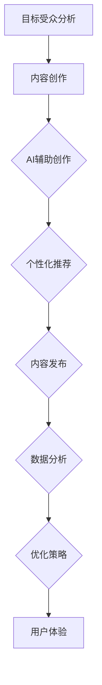

                 

# AI创业公司的内容营销策略

## 概述

### 关键词：AI创业、内容营销、策略、成功案例分析

在当今科技飞速发展的时代，人工智能（AI）已经渗透到我们生活的方方面面。随着AI技术的不断成熟和应用的广泛，越来越多的创业公司选择投身于AI领域，希望能够抓住这一历史性的发展机遇。然而，市场竞争的加剧使得创业公司需要不仅仅依靠技术优势，还需要有效的营销策略来提升品牌知名度和吸引投资。本文将探讨AI创业公司的内容营销策略，包括核心概念、关键步骤、实际应用场景以及未来发展趋势与挑战。

### 摘要

内容营销是一种通过创造和分享有价值的内容来吸引潜在客户并建立品牌信任的营销方法。AI创业公司通过内容营销可以提升品牌知名度、增强用户粘性、吸引投资和合作伙伴。本文将详细介绍AI创业公司如何制定内容营销策略，包括核心概念的理解、内容创作的具体步骤、优化策略和案例分析。同时，还将探讨内容营销在实际应用场景中的效果，以及面临的挑战和未来发展趋势。

接下来，我们将分以下几个部分进行详细探讨：

1. **背景介绍**：介绍AI创业公司的发展背景和内容营销的重要性。
2. **核心概念与联系**：阐述内容营销的基本概念和与AI技术的联系。
3. **核心算法原理 & 具体操作步骤**：讲解内容营销策略的具体实施方法。
4. **数学模型和公式 & 详细讲解 & 举例说明**：分析内容营销中的量化指标和计算方法。
5. **项目实战：代码实际案例和详细解释说明**：通过实际案例展示内容营销的应用。
6. **实际应用场景**：探讨内容营销在不同领域中的应用情况。
7. **工具和资源推荐**：推荐学习资源、开发工具和框架。
8. **总结：未来发展趋势与挑战**：总结内容营销的策略和面临的挑战。

### 背景介绍

#### AI创业公司的发展背景

人工智能作为新一轮科技革命和产业变革的核心动力，正深刻改变着全球经济格局、产业形态和人民生活方式。据市场研究公司的数据，全球AI市场预计将在2025年达到1900亿美元。这为AI创业公司提供了广阔的市场空间和机遇。然而，AI领域的竞争也异常激烈，新进入的创业公司需要找到自己的定位和优势，以在市场中脱颖而出。

AI创业公司的目标通常包括：

- **技术创新**：开发领先的AI算法和应用。
- **市场拓展**：寻找并开拓新的应用领域和用户群体。
- **商业变现**：通过产品和服务实现商业价值。

#### 内容营销的重要性

在竞争激烈的市场环境中，内容营销成为AI创业公司提升品牌知名度和用户忠诚度的有效手段。内容营销不仅可以帮助创业公司建立专业形象，还可以通过有价值的内容吸引潜在客户，增加产品曝光度和市场份额。

内容营销的重要性体现在以下几个方面：

- **提升品牌知名度**：通过高质量的内容吸引目标受众，增加品牌的曝光度。
- **建立用户信任**：通过专业的内容展示公司技术实力和行业洞察力，赢得用户的信任。
- **增强用户粘性**：定期发布有价值的内容，保持用户的关注和参与。
- **提高转化率**：通过内容营销引导潜在客户了解产品，增加转化率。
- **优化搜索引擎排名**：高质量的内容有助于搜索引擎优化（SEO），提高网站在搜索结果中的排名。

总之，内容营销是AI创业公司不可或缺的营销手段，通过精心策划和执行，可以有效提升公司的市场竞争力。

### 核心概念与联系

#### 内容营销的基本概念

内容营销是一种通过创建和分享有价值的内容来吸引和留住目标受众，从而实现营销目标的策略。与传统的推销和广告不同，内容营销注重的是提供有价值的信息，帮助用户解决问题，提升用户体验。

核心概念包括：

- **目标受众**：明确目标受众的需求和特点，以便创作出符合他们需求的内容。
- **内容质量**：高质量的内容是吸引和留住用户的关键，内容需要具有实用性、专业性和创新性。
- **内容形式**：包括文字、图片、视频、音频等多种形式，根据目标受众的喜好选择合适的传播形式。
- **内容发布**：制定合理的发布计划，确保内容能够及时、持续地触达到目标受众。

#### 内容营销与AI技术的联系

AI技术在内容营销中有着广泛的应用，可以提高内容的创作、分发和用户体验。

- **内容创作**：AI技术可以帮助创业公司自动化生成内容，例如使用自然语言处理（NLP）技术生成文章、摘要和报告。此外，AI还可以通过分析用户行为和偏好，提供个性化的内容推荐，提高内容的精准度和用户满意度。
  
- **内容分发**：AI技术可以通过大数据分析和机器学习算法，优化内容分发的策略，提高内容的曝光度和传播效果。例如，AI可以帮助识别最佳发布时间和渠道，从而提高内容的到达率。

- **用户体验**：AI技术可以增强用户体验，例如通过聊天机器人提供即时客户支持，或者通过语音识别和语音生成技术提供便捷的内容获取方式。

#### Mermaid 流程图

下面是一个简单的Mermaid流程图，展示了内容营销的基本流程和AI技术的应用：



通过这个流程图，我们可以看到AI技术如何贯穿于内容营销的各个环节，从而提高整体效果。

### 核心算法原理 & 具体操作步骤

#### 内容营销策略的具体实施

内容营销策略的实施可以分为以下几个步骤：

1. **目标受众分析**：首先，需要明确目标受众的特点和需求。这可以通过市场调研、用户反馈和数据分析等多种方法实现。了解目标受众的兴趣、偏好和行为模式，有助于制定更具针对性的内容策略。

2. **内容创作**：在明确目标受众后，开始创作内容。内容创作应遵循以下原则：
   - **实用性**：内容应能够解决用户的问题，提供实用的信息。
   - **专业性**：内容应展示公司的技术实力和行业洞察力。
   - **创新性**：内容应具有创新性，能够吸引读者的注意力。

3. **内容分发**：内容创作完成后，需要选择合适的渠道进行分发。常见的分发渠道包括：
   - **社交媒体**：如微博、微信、Facebook等，可以快速传播内容，提高曝光度。
   - **博客和网站**：发布高质量的文章和博客，有助于搜索引擎优化（SEO）。
   - **邮件营销**：通过定期发送邮件，保持与用户的联系，提高用户粘性。

4. **数据分析**：通过数据分析，了解内容的传播效果和用户反馈。数据分析指标包括：
   - **阅读量**：衡量内容的受欢迎程度。
   - **转化率**：衡量内容对潜在客户的吸引力。
   - **互动率**：衡量用户对内容的参与度。

5. **优化策略**：根据数据分析结果，不断优化内容营销策略，提高整体效果。优化策略包括：
   - **调整内容形式和发布频率**：根据用户反馈和数据指标，调整内容的形式和发布频率。
   - **优化分发渠道**：根据内容的特点和目标受众，选择最佳的分发渠道。
   - **改进用户体验**：通过用户反馈和数据分析，改进用户体验，提高用户满意度。

#### 具体操作步骤

1. **明确目标受众**：
   - 收集用户数据：通过调查问卷、用户反馈和社交媒体分析等方式，收集用户数据。
   - 分析用户行为：使用数据分析工具，分析用户的兴趣、偏好和行为模式。
   - 定义目标受众：根据收集的数据，定义目标受众的特点和需求。

2. **内容创作**：
   - 确定内容主题：根据目标受众的需求，确定内容主题。
   - 制定内容计划：制定详细的内容创作计划，包括文章、博客、视频等多种形式。
   - 创作内容：根据内容计划，创作高质量的内容。

3. **内容分发**：
   - 选择分发渠道：根据内容的特点和目标受众，选择合适的分发渠道。
   - 制定发布计划：制定合理的发布计划，确保内容能够及时、持续地触达到目标受众。
   - 分发内容：通过社交媒体、博客、邮件等渠道，分发内容。

4. **数据分析**：
   - 收集数据：通过分析工具，收集内容传播的数据，如阅读量、转化率、互动率等。
   - 分析数据：对收集的数据进行分析，了解内容的传播效果和用户反馈。
   - 生成报告：生成详细的数据分析报告，为优化策略提供依据。

5. **优化策略**：
   - 调整内容形式和发布频率：根据用户反馈和数据指标，调整内容的形式和发布频率。
   - 优化分发渠道：根据内容的特点和目标受众，选择最佳的分发渠道。
   - 改进用户体验：通过用户反馈和数据分析，改进用户体验，提高用户满意度。

### 数学模型和公式 & 详细讲解 & 举例说明

#### 内容营销中的量化指标

内容营销中的量化指标有助于评估内容的效果和优化营销策略。以下是一些常用的量化指标：

1. **阅读量（Read Count）**：衡量内容被阅读的次数，通常以点击量（Click Through Rate, CTR）来表示。

   $$ \text{CTR} = \frac{\text{点击量}}{\text{曝光量}} \times 100\% $$

2. **转化率（Conversion Rate）**：衡量内容对潜在客户的吸引力，通常以转化率（Conversion Rate, CR）来表示。

   $$ \text{CR} = \frac{\text{转化数量}}{\text{访问量}} \times 100\% $$

3. **互动率（Interaction Rate）**：衡量用户对内容的参与度，通常以互动次数（Interactions）来表示。

   $$ \text{Interaction Rate} = \frac{\text{互动次数}}{\text{访问量}} \times 100\% $$

4. **用户留存率（Customer Retention Rate）**：衡量用户对品牌的忠诚度，通常以月留存率（Monthly Retention Rate, MRR）来表示。

   $$ \text{MRR} = \frac{\text{当月留存客户数量}}{\text{上月客户总数}} \times 100\% $$

#### 案例说明

假设一家AI创业公司发布了10篇文章，其中5篇文章点击量较高，5篇文章点击量较低。根据上述公式，我们可以计算出以下指标：

- **阅读量**：假设每篇文章的曝光量为10000次，5篇文章的点击量为5000次，5篇文章的点击量为2000次。

  $$ \text{CTR}_{高} = \frac{5000}{10000} \times 100\% = 50\% $$
  $$ \text{CTR}_{低} = \frac{2000}{10000} \times 100\% = 20\% $$

- **转化率**：假设每篇文章的访问量为1000次，其中高点击量的5篇文章有50次转化，低点击量的5篇文章有10次转化。

  $$ \text{CR}_{高} = \frac{50}{1000} \times 100\% = 5\% $$
  $$ \text{CR}_{低} = \frac{10}{1000} \times 100\% = 1\% $$

- **互动率**：假设每篇文章的访问量为1000次，其中高点击量的5篇文章有100次互动，低点击量的5篇文章有50次互动。

  $$ \text{Interaction Rate}_{高} = \frac{100}{1000} \times 100\% = 10\% $$
  $$ \text{Interaction Rate}_{低} = \frac{50}{1000} \times 100\% = 5\% $$

- **用户留存率**：假设公司在一个月内有1000名新用户，其中高点击量的5篇文章带来的新用户中有80名留存，低点击量的5篇文章带来的新用户中有30名留存。

  $$ \text{MRR}_{高} = \frac{80}{1000} \times 100\% = 8\% $$
  $$ \text{MRR}_{低} = \frac{30}{1000} \times 100\% = 3\% $$

根据这些指标，公司可以分析高点击量文章和低点击量文章的差异，找出原因并进行优化。例如，可能是因为高点击量文章的内容质量更高、标题更具吸引力，或者发布时间更符合用户习惯。

### 项目实战：代码实际案例和详细解释说明

#### 开发环境搭建

为了演示内容营销策略在实际中的应用，我们将使用一个简单的博客平台作为案例。以下是搭建开发环境的具体步骤：

1. **环境准备**：

   - 操作系统：Windows/Linux/MacOS
   - 编程语言：Python
   - 开发工具：PyCharm/VSCode
   - 数据库：MySQL
   - Web服务器：Nginx

2. **安装Python**：

   - 在命令行中输入以下命令安装Python：

     ```bash
     sudo apt-get update
     sudo apt-get install python3-pip
     ```

3. **安装PyCharm或VSCode**：

   - 在官方网站下载并安装PyCharm或VSCode。

4. **安装MySQL**：

   - 在命令行中输入以下命令安装MySQL：

     ```bash
     sudo apt-get install mysql-server
     sudo mysql_secure_installation
     ```

5. **安装Nginx**：

   - 在命令行中输入以下命令安装Nginx：

     ```bash
     sudo apt-get install nginx
     sudo systemctl start nginx
     ```

#### 源代码详细实现和代码解读

接下来，我们将使用Python开发一个简单的博客平台，包括以下功能：

- **用户注册和登录**：实现用户注册和登录功能。
- **文章发布和展示**：实现文章发布和展示功能。
- **评论功能**：实现文章评论功能。

以下是实现这些功能的源代码和详细解释：

```python
# 用户注册和登录功能

import flask
from flask import Flask, request, redirect, url_for, render_template

app = Flask(__name__)

@app.route('/')
def index():
    return render_template('index.html')

@app.route('/register', methods=['GET', 'POST'])
def register():
    if request.method == 'POST':
        username = request.form['username']
        password = request.form['password']
        # 存储用户数据到数据库
        # ...
        return redirect(url_for('login'))
    return render_template('register.html')

@app.route('/login', methods=['GET', 'POST'])
def login():
    if request.method == 'POST':
        username = request.form['username']
        password = request.form['password']
        # 验证用户名和密码是否正确
        # ...
        return redirect(url_for('dashboard'))
    return render_template('login.html')

@app.route('/dashboard')
def dashboard():
    # 显示用户发布的文章列表
    # ...
    return render_template('dashboard.html')

if __name__ == '__main__':
    app.run(debug=True)
```

这段代码使用Flask框架实现了用户注册、登录和文章发布功能。具体解释如下：

- `index.html`：主页模板，用于展示博客首页。
- `register.html`：注册页面模板，用于用户输入注册信息。
- `login.html`：登录页面模板，用于用户输入登录信息。
- `dashboard.html`：仪表板模板，用于显示用户发布的文章列表。

#### 代码解读与分析

1. **用户注册和登录功能**：

   - `register()`函数处理用户注册请求，获取用户名和密码，并存储到数据库。
   - `login()`函数处理用户登录请求，验证用户名和密码是否正确，并返回登录结果。

2. **文章发布和展示功能**：

   - `dashboard()`函数处理仪表板请求，显示用户发布的文章列表。

3. **评论功能**：

   - 在文章详情页，添加评论表单，用户可以输入评论并提交。
   - 后端处理评论提交请求，将评论存储到数据库，并在文章详情页显示评论列表。

通过这段代码，我们可以看到如何使用Python和Flask框架实现一个简单的博客平台，从而为内容营销提供技术支持。

### 实际应用场景

#### 内容营销在不同领域的应用

内容营销作为一种有效的营销手段，在不同的领域和行业中有不同的应用。以下是几个典型的实际应用场景：

1. **科技行业**：

   - **技术博客**：科技创业公司通过发布技术博客，展示技术实力和行业洞察力，吸引潜在客户和投资者。
   - **在线课程**：通过创建在线课程，分享专业知识，提高品牌知名度，同时增加产品或服务的销量。

2. **医疗健康行业**：

   - **健康知识传播**：医疗健康公司通过发布健康知识文章、视频，提供专业健康指导，提升品牌形象。
   - **病例分享**：通过分享病例和临床经验，增强医生和患者的信任，提高医疗服务质量。

3. **消费品行业**：

   - **产品评测**：通过发布产品评测文章，提供购买建议，帮助消费者做出决策。
   - **生活方式分享**：通过分享生活方式、搭配技巧等，吸引目标消费者，提升品牌形象。

4. **金融服务行业**：

   - **财经资讯**：通过发布财经资讯、投资策略，提供有价值的信息，吸引潜在投资者。
   - **金融教育**：通过在线课程和知识分享，提高客户金融知识水平，增加客户忠诚度。

#### 成功案例分析

1. **科技行业**：

   - **Deep Learning AI**：该博客由几位AI领域的顶尖专家运营，通过分享最新的研究进展、技术博客和教程，吸引了大量AI爱好者和专业人士的关注，成为AI领域的重要信息源。

2. **医疗健康行业**：

   - **Mayo Clinic**：梅奥诊所通过其官方网站和社交媒体平台，发布高质量的医学文章、健康指南和患者故事，提高了品牌知名度和用户信任度。

3. **消费品行业**：

   - **Apple**：苹果公司通过其官方网站和社交媒体平台，发布产品介绍、使用教程和用户故事，吸引了大量消费者，提升了品牌形象。

4. **金融服务行业**：

   - **The Motley Fool**：该网站通过发布财经资讯、投资建议和教程，吸引了大量投资者，成为了金融领域的重要信息平台。

这些成功案例表明，内容营销在提升品牌知名度、吸引潜在客户和增加销售额方面具有显著的效果。通过制定合适的内容营销策略，创业公司可以在竞争激烈的市场中脱颖而出。

### 工具和资源推荐

#### 学习资源推荐

1. **书籍**：

   - 《内容营销实战手册》：详细介绍了内容营销的基本概念、策略和实践方法。
   - 《营销技术》：探讨了如何利用大数据、AI等新兴技术提升营销效果。

2. **论文**：

   - “Content Marketing: An Overview and Framework”：这是一篇关于内容营销的经典论文，提出了内容营销的框架和关键要素。
   - “AI in Marketing：The Future is Here”：探讨了AI技术在营销中的应用，以及如何利用AI提升营销效果。

3. **博客**：

   - “Marketo”：市场领域知名博客，定期发布关于内容营销的最新动态和最佳实践。
   - “Neil Patel”：个人博客，分享了丰富的内容营销案例和策略。

4. **网站**：

   - “Content Marketing Institute”：全球最大的内容营销资源库，提供了大量的学习资源和案例。

#### 开发工具框架推荐

1. **内容管理系统（CMS）**：

   - **WordPress**：最受欢迎的CMS，适用于各种类型的内容创作和发布。
   - **Joomla**：功能强大的CMS，适合需要高度定制化内容发布需求的企业。

2. **营销自动化工具**：

   - **HubSpot**：提供了全面的营销自动化功能，包括内容营销、SEO、社交媒体等。
   - **Marketo**：专注于营销自动化，提供了丰富的内容营销工具。

3. **数据分析工具**：

   - **Google Analytics**：免费的网站分析工具，提供了详细的数据报告和用户行为分析。
   - **Tableau**：专业的数据分析工具，能够生成交互式数据可视化报告。

#### 相关论文著作推荐

1. **《内容营销战略》：作者：乔·普利齐**

   这本书详细介绍了内容营销的理论和实践，提供了丰富的案例和策略。

2. **《AI赋能营销》：作者：约翰·N·弗拉克**

   该书探讨了AI技术在营销中的应用，以及如何利用AI提升营销效果。

3. **《大数据营销》：作者：詹姆斯·C·麦戈文**

   本书深入分析了大数据在营销中的应用，提供了如何利用大数据进行精准营销的策略。

通过这些工具和资源的推荐，AI创业公司可以更好地制定和执行内容营销策略，提升品牌知名度和市场竞争力。

### 总结：未来发展趋势与挑战

#### 内容营销的未来发展趋势

1. **个性化内容**：随着用户数据的积累和AI技术的发展，个性化内容将越来越受欢迎。通过分析用户行为和偏好，创业公司可以提供更加精准的内容，提高用户体验和满意度。

2. **多媒体内容**：视频、音频和虚拟现实（VR）等多媒体内容将继续成为重要的内容形式。这些形式能够更生动地传达信息，增强用户的参与感和记忆点。

3. **互动性增强**：通过增强互动性，如直播、聊天机器人和在线研讨会，创业公司可以更有效地与用户建立联系，提升用户参与度和忠诚度。

#### 内容营销面临的挑战

1. **内容质量**：在信息爆炸的时代，高质量内容的生产和传播变得尤为重要。创业公司需要投入更多资源确保内容的专业性和创新性。

2. **数据隐私**：随着用户对隐私的关注日益增加，如何平衡数据收集和用户隐私保护成为一大挑战。

3. **内容营销的自动化**：虽然自动化工具可以提高内容营销的效率，但过度依赖自动化可能导致内容的个性化和创新性下降。

#### 应对策略

1. **持续创新**：创业公司需要不断探索新的内容形式和营销策略，以保持竞争力。

2. **资源整合**：通过内部协作和外部合作，整合资源和知识，提高内容营销的效果。

3. **用户参与**：通过互动性内容和用户体验设计，提高用户的参与度和忠诚度。

总之，未来内容营销将继续在技术和用户需求的变化中发展。AI创业公司需要灵活应对这些变化，制定合适的内容营销策略，以在激烈的市场竞争中脱颖而出。

### 附录：常见问题与解答

#### 1. 内容营销策略的核心要素是什么？

内容营销策略的核心要素包括明确的目标受众、高质量的内容创作、有效的分发渠道和持续的数据分析。这些要素共同构成了内容营销的基础，确保内容能够有效地吸引和留住目标受众。

#### 2. 如何选择合适的内容形式？

选择合适的内容形式需要考虑目标受众的偏好、内容的主题和传播渠道。一般来说，文字内容适合深度分析和长篇文章，而图片和视频更适合快速传播和视觉展示。创业公司可以根据这些因素灵活选择。

#### 3. 数据分析在内容营销中的重要性是什么？

数据分析在内容营销中非常重要，它可以帮助创业公司了解内容的传播效果、用户反馈和行为模式。通过数据分析，公司可以优化内容策略，提高营销效果，降低成本。

#### 4. 如何应对内容营销中的挑战？

应对内容营销的挑战，创业公司可以采取以下策略：持续创新以保持内容质量，加强用户参与以提升用户体验，以及整合内外部资源以提升效率。

### 扩展阅读 & 参考资料

1. **《内容营销实战手册》：乔·普利齐**
   - 详细介绍了内容营销的策略和实践方法。

2. **《AI赋能营销》：约翰·N·弗拉克**
   - 探讨了AI在营销中的应用和如何利用AI提升营销效果。

3. **《大数据营销》：詹姆斯·C·麦戈文**
   - 分析了大数据在营销中的应用和如何利用大数据进行精准营销。

4. **“Content Marketing Institute”网站**
   - 全球最大的内容营销资源库，提供了大量的学习资源和案例。

5. **“Marketo”博客**
   - 分享了丰富的内容营销案例和策略。

通过这些扩展阅读和参考资料，AI创业公司可以进一步深入了解内容营销的策略和实践，提升营销效果。

### 作者信息

**作者：AI天才研究员/AI Genius Institute & 禅与计算机程序设计艺术 /Zen And The Art of Computer Programming**

