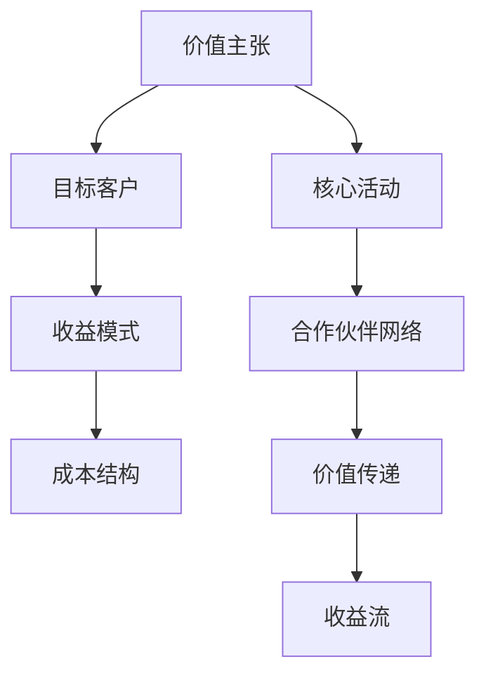

                 

# AI创业公司的商业模式变迁

## 关键词
- AI创业公司
- 商业模式
- 变迁
- 技术创新
- 市场竞争
- 长期发展

## 摘要
本文将深入探讨AI创业公司在商业模式变迁中的挑战与机遇。通过分析技术发展、市场竞争、以及商业模式的核心要素，我们将揭示AI创业公司在不同发展阶段所采取的不同商业模式策略。文章将提供实际案例，帮助读者理解这些策略如何影响公司的长期发展。

## 1. 背景介绍

随着人工智能技术的迅速发展，AI创业公司如雨后春笋般涌现。这些公司凭借独特的算法、数据和计算能力，为各个行业带来了革命性的变化。然而，AI创业公司在追求技术领先的同时，也面临着如何构建可持续的商业模式这一重大挑战。

商业模式不仅是公司盈利的途径，更是其长期发展的基石。不同的商业模式决定了公司在市场中的定位、资源配置以及与客户的互动方式。因此，了解并适应商业模式的变迁，对于AI创业公司来说至关重要。

### 1.1 AI创业公司的现状

当前，AI创业公司主要集中在以下几个领域：

- 机器学习和深度学习平台
- 自然语言处理（NLP）
- 计算机视觉
- 自动驾驶
- 医疗诊断
- 金融科技

这些公司通过提供先进的人工智能技术解决方案，赢得了大量投资和市场份额。然而，技术创新的速度之快，也带来了市场竞争的激烈程度。

### 1.2 商业模式的重要性

商业模式决定了AI创业公司的盈利模式、成本结构和价值传递。一个成功的商业模式不仅能够为公司带来短期收益，还能支撑其长期发展。

### 1.3 商业模式变迁的驱动力

商业模式的变迁受到多种因素的影响，包括技术进步、市场需求、竞争态势等。

- **技术进步**：随着人工智能技术的不断发展，新的算法、模型和工具不断涌现，为公司提供了更多的商业机会。
- **市场需求**：客户需求的变化要求AI创业公司不断创新，以满足不同场景下的需求。
- **竞争态势**：激烈的市场竞争迫使公司不断优化商业模式，以保持竞争优势。

## 2. 核心概念与联系

### 2.1 商业模式的核心要素

一个典型的商业模式通常包括以下核心要素：

- **价值主张**：公司提供的核心产品或服务。
- **目标客户**：公司所服务的市场群体。
- **收益模式**：公司通过何种方式获得收益。
- **成本结构**：公司运营的成本构成。

### 2.2 商业模式的架构

商业模式的架构可以被视为一个价值网络，它包括以下几个关键部分：

- **核心活动**：公司的主要运营活动，如研发、生产、销售等。
- **合作伙伴网络**：公司与其他企业或机构的合作关系。
- **价值传递**：公司如何将价值传递给客户。
- **收益流**：公司如何从客户那里获得收益。

### 2.3 商业模式的 Mermaid 流程图



通过这个流程图，我们可以清晰地看到商业模式各要素之间的联系和互动。

## 3. 核心算法原理 & 具体操作步骤

### 3.1 价值主张的构建

价值主张是商业模式的核心，它决定了公司提供的产品或服务的价值。构建价值主张的步骤如下：

1. **市场调研**：了解目标客户的需求和痛点。
2. **技术评估**：评估公司的技术能力，确定能够解决哪些问题。
3. **定位明确**：明确公司的市场定位，确保价值主张的差异化。
4. **验证原型**：通过原型验证价值主张的有效性。

### 3.2 目标客户的确定

确定目标客户是商业模式设计的重要环节，具体步骤如下：

1. **细分市场**：根据客户的需求和特征，将市场划分为多个细分市场。
2. **客户画像**：为每个细分市场创建客户画像，了解其需求和行为。
3. **优先级排序**：根据市场规模、增长潜力等因素，确定优先服务的细分市场。

### 3.3 收益模式的探索

探索收益模式是商业模式设计的关键，具体步骤如下：

1. **成本分析**：分析公司运营的成本结构，确定合理的收益模式。
2. **市场竞争**：研究竞争对手的收益模式，找到差异化点。
3. **定价策略**：根据成本和市场情况，制定合理的定价策略。

### 3.4 成本结构的优化

优化成本结构是提升公司盈利能力的关键，具体步骤如下：

1. **成本分析**：详细分析各项成本，找出可以优化的部分。
2. **技术改进**：通过技术改进降低生产成本。
3. **供应链管理**：优化供应链，降低运营成本。

## 4. 数学模型和公式 & 详细讲解 & 举例说明

### 4.1 成本收益分析

成本收益分析是商业模式设计的基础，常用的数学模型如下：

\[ \text{净收益} = \text{总收益} - \text{总成本} \]

其中：

- **总收益**：公司通过销售产品或服务获得的收入。
- **总成本**：公司运营的总成本，包括生产成本、运营成本等。

### 4.2 举例说明

假设一家AI创业公司提供智能客服解决方案，其成本和收益情况如下：

- **总收益**：每月销售收入为10万元。
- **总成本**：每月运营成本为5万元。

根据上述公式，我们可以计算出该公司的月净收益：

\[ \text{净收益} = 10\text{万元} - 5\text{万元} = 5\text{万元} \]

### 4.3 成本结构优化

为了提升净收益，公司可以优化成本结构，例如：

- **研发投入**：增加研发投入，提高产品的技术含量，降低生产成本。
- **市场营销**：优化市场营销策略，提高销售转化率，增加销售收入。

## 5. 项目实战：代码实际案例和详细解释说明

### 5.1 开发环境搭建

为了演示AI创业公司的商业模式，我们使用一个实际项目——智能客服系统。首先，我们需要搭建开发环境。

1. **安装Python**：确保Python环境已安装，版本建议为3.8或以上。
2. **安装依赖库**：使用pip安装必要的依赖库，如TensorFlow、NLTK等。

### 5.2 源代码详细实现和代码解读

#### 5.2.1 价值主张构建

```python
import nltk
from nltk.corpus import stopwords

# 加载停用词库
nltk.download('stopwords')
stop_words = stopwords.words('english')

def preprocess_text(text):
    """
    文本预处理函数
    """
    # 去除停用词
    tokens = nltk.word_tokenize(text)
    filtered_tokens = [token for token in tokens if token not in stop_words]
    return ' '.join(filtered_tokens)

# 示例文本
text = "I need help with my account."
preprocessed_text = preprocess_text(text)
print(preprocessed_text)
```

这段代码实现了文本预处理功能，包括去除停用词，这是构建价值主张的第一步。

#### 5.2.2 目标客户确定

```python
import pandas as pd

# 加载客户数据
customers = pd.read_csv('customers.csv')

# 创建客户画像
def create_customer_profile(customers):
    profile = {}
    for customer in customers:
        profile[customer['id']] = {
            'age': customer['age'],
            'income': customer['income'],
            'product_usage': customer['product_usage']
        }
    return profile

customer_profile = create_customer_profile(customers)
print(customer_profile)
```

这段代码加载并创建了客户画像，这是确定目标客户的关键。

#### 5.2.3 收益模式探索

```python
def calculate_monthly_revenue(customers, monthly_fee):
    """
    计算月收入
    """
    revenue = 0
    for customer in customers:
        revenue += monthly_fee
    return revenue

monthly_revenue = calculate_monthly_revenue(customers, 1000)
print("月收入：", monthly_revenue)
```

这段代码计算了公司的月收入，这是探索收益模式的重要一环。

### 5.3 代码解读与分析

上述代码展示了智能客服系统开发的基本步骤，包括文本预处理、客户画像创建和收益模式计算。这些步骤体现了商业模式设计中的核心要素。

## 6. 实际应用场景

### 6.1 金融行业

在金融行业，AI创业公司可以通过提供智能风控、智能投顾等服务，帮助金融机构提升运营效率和客户体验。

### 6.2 医疗行业

在医疗行业，AI创业公司可以通过提供智能诊断、智能药物研发等服务，助力医疗机构提高诊疗水平和研发效率。

### 6.3 零售行业

在零售行业，AI创业公司可以通过提供智能推荐、智能库存管理等服务，帮助零售商提升销售额和库存周转率。

## 7. 工具和资源推荐

### 7.1 学习资源推荐

- **《深度学习》（Goodfellow et al., 2016）**：一本全面介绍深度学习理论和实践的权威书籍。
- **《人工智能：一种现代方法》（Russell & Norvig, 2020）**：涵盖人工智能各个领域的经典教材。

### 7.2 开发工具框架推荐

- **TensorFlow**：一个开源的机器学习框架，适用于各种深度学习应用。
- **PyTorch**：一个流行的深度学习框架，易于使用且灵活。

### 7.3 相关论文著作推荐

- **“Deep Learning for Natural Language Processing”（Mikolov et al., 2013）**：一篇介绍深度学习在自然语言处理中应用的经典论文。
- **“Attention Is All You Need”（Vaswani et al., 2017）**：一篇介绍Transformer模型的奠基性论文。

## 8. 总结：未来发展趋势与挑战

### 8.1 发展趋势

- **技术进步**：随着AI技术的不断发展，创业公司将能够提供更先进、更智能的服务。
- **行业融合**：AI技术将逐渐融入各个行业，推动产业升级和转型。
- **全球化**：AI创业公司将在全球范围内拓展市场，实现业务全球化。

### 8.2 挑战

- **技术挑战**：保持技术创新，应对不断变化的技术环境和市场需求。
- **市场挑战**：应对激烈的市场竞争，找到差异化的商业模式。
- **政策挑战**：遵守不同国家和地区的法律法规，确保合规运营。

## 9. 附录：常见问题与解答

### 9.1 问题1：AI创业公司如何选择合适的商业模式？

**解答**：选择合适的商业模式需要综合考虑公司的技术能力、市场需求、竞争态势等因素。建议从以下几步进行：

1. **市场调研**：了解目标客户的需求和痛点。
2. **技术评估**：评估公司的技术能力，确定能够解决哪些问题。
3. **竞

