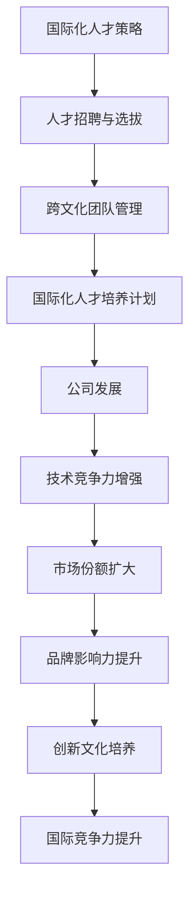

                 

### 1. 背景介绍

在当今全球化的背景下，人工智能（AI）行业的快速发展为创业者带来了前所未有的机遇。AI 创业公司不仅在国内市场逐渐崭露头角，而且也在国际市场上获得了越来越多的关注。然而，随着市场的不断扩大，国际化的竞争也日益激烈。因此，AI 创业公司要想在全球范围内取得成功，不仅需要拥有强大的技术实力，还需要构建一套完善的人才策略。

国际化人才策略的重要性不言而喻。首先，国际化的团队可以带来多元化的思维方式和经验，有助于公司更好地适应全球市场的变化。其次，拥有国际化背景的人才往往具备更强的跨文化沟通能力和全球视野，这对于拓展海外市场、与海外合作伙伴建立良好关系至关重要。最后，国际化人才能够帮助公司在全球范围内招募优秀的工程师和研究人员，从而提升公司的技术实力和创新能力。

本文将围绕 AI 创业公司的国际化人才策略展开讨论，包括如何识别和吸引国际化人才、如何建立跨文化团队、以及如何制定有效的国际化人才培养计划。通过分析这些关键问题，我们将为 AI 创业公司提供一套具有实践指导意义的国际化人才策略。

#### 当前 AI 创业公司面临的主要挑战

尽管 AI 创业公司在国内市场逐渐崭露头角，但它们在国际市场上仍然面临诸多挑战。以下是当前 AI 创业公司面临的主要挑战：

1. **技术门槛高**：AI 技术具有高度的专业性和复杂性，需要具备深厚的技术背景和专业知识。因此，对于 AI 创业公司来说，招聘到具有相关技能的国际化人才是一个巨大的挑战。

2. **市场竞争激烈**：随着越来越多的公司进入 AI 领域，市场竞争变得越来越激烈。要想在国际市场上脱颖而出，AI 创业公司需要拥有一支高水平的国际化团队，这无疑增加了公司的运营成本。

3. **资金压力**：国际化进程通常需要大量的资金支持，包括招聘、培训和海外市场的开拓等。对于许多 AI 创业公司来说，筹集足够的资金是一个重大挑战。

4. **政策法规限制**：不同国家和地区的政策法规存在差异，这可能会对 AI 创业公司的国际化进程产生不利影响。例如，某些国家可能对数据隐私和跨境数据传输有严格的规定，这可能会限制公司的业务拓展。

5. **文化差异**：国际化团队通常由来自不同国家和地区的成员组成，文化差异可能导致沟通障碍和团队协作问题。如何克服文化差异，建立高效的国际化团队，是 AI 创业公司需要解决的另一个挑战。

#### AI 创业公司国际化人才策略的重要性

在面临上述挑战的情况下，AI 创业公司需要一套完善的国际化人才策略来应对。以下是一些关键原因，说明为什么国际化人才策略对于 AI 创业公司的成功至关重要：

1. **增强技术竞争力**：拥有国际化背景的团队可以带来多元化的技术视角和创新思维，有助于公司在技术竞争中保持领先地位。国际化人才往往具备在不同技术领域积累的经验，这有助于公司快速掌握新技术和趋势。

2. **扩大市场份额**：国际化团队能够帮助公司更好地理解全球市场的需求和趋势，从而制定更有针对性的市场策略。此外，国际化人才在海外市场的经验和人脉有助于公司拓展海外市场，提高市场份额。

3. **提高品牌影响力**：国际化人才可以代表公司在全球范围内推广品牌，提升公司的国际声誉和知名度。这种全球化的品牌影响力有助于公司在全球范围内吸引更多的客户和合作伙伴。

4. **培养创新文化**：国际化团队可以带来不同的文化和工作经验，有助于公司内部形成创新文化。这种创新文化可以激发员工的创造力，推动公司不断进行技术创新。

5. **降低运营成本**：通过在全球范围内招募人才，AI 创业公司可以利用不同地区的劳动力和资源优势，降低运营成本。例如，在某些地区，人才成本较低，但技术水平和专业素养并不逊色。

6. **提升国际竞争力**：国际化人才策略有助于公司提高在全球范围内的竞争力，从而在激烈的国际市场中脱颖而出。通过建立国际化团队，公司可以更好地应对全球市场的变化和挑战。

总之，国际化人才策略对于 AI 创业公司的成功至关重要。通过识别和吸引国际化人才、建立跨文化团队以及制定有效的国际化人才培养计划，AI 创业公司可以克服当前面临的挑战，实现全球化发展。接下来的部分将详细探讨如何实现这些策略。### 2. 核心概念与联系

在深入讨论 AI 创业公司的国际化人才策略之前，我们需要了解一些核心概念和其相互之间的联系。以下是本文涉及的关键概念：

#### 国际化人才

国际化人才是指那些具备跨文化沟通能力、全球视野以及在不同国家和地区工作生活经验的人才。这些人才通常具备以下特点：

- **跨文化沟通能力**：能够有效沟通并适应不同文化背景的人。
- **全球视野**：能够理解和分析全球市场的需求和趋势。
- **国际经验**：在不同国家和地区工作或生活的经验。
- **技术专长**：在某些技术领域具备深厚的专业知识和经验。

#### 人才招聘与选拔

人才招聘与选拔是指通过科学的方法和流程，寻找并选拔出最适合公司发展的人才。对于 AI 创业公司来说，国际化人才招聘与选拔需要考虑以下因素：

- **技术能力**：评估候选人是否具备所需的技术技能和知识。
- **沟通能力**：评估候选人是否具备良好的跨文化沟通能力。
- **团队协作**：评估候选人是否具备良好的团队协作精神和合作能力。
- **国际经验**：评估候选人是否具备在不同国家和地区工作的经验。

#### 跨文化团队管理

跨文化团队管理是指如何管理由来自不同文化背景的成员组成的团队。跨文化团队管理需要考虑以下问题：

- **文化差异**：理解并尊重不同文化之间的差异，避免文化冲突。
- **沟通方式**：采用适合不同文化的沟通方式，提高团队协作效率。
- **激励机制**：制定适合跨文化团队的激励机制，激发团队成员的积极性。

#### 国际化人才培养计划

国际化人才培养计划是指通过系统化的培训和培养，提升公司国际化人才的能力和素质。国际化人才培养计划需要考虑以下方面：

- **技术培训**：为国际化人才提供最新的技术培训和知识更新。
- **管理培训**：为国际化人才提供管理技能培训，提高其领导力和管理能力。
- **文化培训**：为国际化人才提供跨文化培训，帮助他们更好地适应不同文化背景。

#### 国际化人才策略

国际化人才策略是指公司为实现全球化发展目标而制定的一系列人才管理措施。国际化人才策略需要考虑以下方面：

- **人才招聘**：制定有效的人才招聘策略，吸引国际化人才。
- **团队建设**：建立跨文化团队，提高团队协作效率。
- **人才培养**：制定国际化人才培养计划，提升人才素质。
- **文化融合**：促进不同文化之间的融合，建立和谐的工作氛围。

#### 国际人才策略与公司发展的联系

国际化人才策略与公司发展之间存在密切的联系。通过以下 Mermaid 流程图，我们可以更清晰地理解这些联系：



通过这张图，我们可以看出国际化人才策略对公司发展具有多方面的积极影响。国际化人才策略不仅有助于增强公司的技术竞争力，扩大市场份额，提升品牌影响力，还可以培养创新文化，提高公司的国际竞争力。

#### 核心概念之间的相互作用

核心概念之间的相互作用是构建有效国际化人才策略的关键。以下是这些核心概念之间的相互作用关系：

- **国际化人才策略**：通过招聘、选拔、培养和管理国际化人才，实现全球化发展目标。
- **人才招聘与选拔**：通过科学的方法和流程，吸引和选拔具有国际经验和跨文化沟通能力的国际化人才。
- **跨文化团队管理**：通过理解和尊重文化差异，建立高效的国际化团队。
- **国际化人才培养计划**：通过系统化的培训，提升国际化人才的技术能力和管理素质。
- **公司发展**：国际化人才策略有助于公司在全球范围内实现技术突破、市场拓展和品牌提升。

通过以上核心概念的相互作用，AI 创业公司可以构建一套完善的国际化人才策略，从而在全球化竞争中脱颖而出。接下来，我们将详细探讨如何实施这些策略。### 3. 核心算法原理 & 具体操作步骤

在探讨 AI 创业公司的国际化人才策略时，我们需要了解一些核心算法原理和具体操作步骤。这些算法原理和操作步骤将帮助我们更深入地理解国际化人才策略的实施方法。

#### 国际化人才筛选算法

国际化人才筛选算法是识别和吸引国际化人才的重要工具。该算法通常基于以下几个关键因素：

1. **技术能力**：评估候选人的技术背景和项目经验。
2. **跨文化沟通能力**：评估候选人的跨文化沟通能力和适应能力。
3. **国际经验**：评估候选人在不同国家和地区的工作经验。
4. **团队合作能力**：评估候选人在团队项目中的合作能力和贡献。

具体操作步骤如下：

1. **数据收集**：收集候选人的简历、项目报告、技术博客等资料。
2. **初步筛选**：根据技术能力、国际经验和团队合作能力等指标，初步筛选出符合条件的候选人。
3. **面试评估**：通过电话面试或现场面试，进一步评估候选人的跨文化沟通能力和实际工作能力。
4. **技能测试**：对候选人进行技术测试，确保其具备所需的技术能力。

#### 跨文化团队管理算法

跨文化团队管理算法旨在提高国际化团队的协作效率和工作氛围。该算法包括以下几个关键步骤：

1. **文化差异分析**：分析团队成员的文化背景，了解不同文化之间的差异。
2. **沟通策略制定**：根据文化差异，制定适合不同文化的沟通策略。
3. **团队建设活动**：组织团队建设活动，增强团队成员之间的信任和协作。
4. **绩效评估**：定期对团队成员的绩效进行评估，及时发现和解决团队协作中的问题。

具体操作步骤如下：

1. **文化差异分析**：通过问卷调查或访谈，了解团队成员的文化背景和价值观。
2. **沟通策略制定**：根据文化差异，制定明确的沟通指南，包括语言、沟通方式、决策流程等。
3. **团队建设活动**：定期组织团队建设活动，如团队拓展训练、跨文化交流活动等，增强团队凝聚力。
4. **绩效评估**：采用科学的方法和工具，定期对团队成员的绩效进行评估，包括工作成果、团队合作、沟通能力等方面。

#### 国际化人才培养算法

国际化人才培养算法旨在提升国际化人才的技术能力和管理素质。该算法包括以下几个关键步骤：

1. **技术培训**：为国际化人才提供最新的技术培训和知识更新。
2. **管理培训**：为国际化人才提供管理技能培训，提高其领导力和管理能力。
3. **文化培训**：为国际化人才提供跨文化培训，帮助他们更好地适应不同文化背景。
4. **实战演练**：通过实际项目或案例，让国际化人才在实践中提升技能。

具体操作步骤如下：

1. **技术培训**：组织内部或外部技术培训课程，邀请行业专家进行授课，确保国际化人才掌握最新的技术知识和技能。
2. **管理培训**：组织管理培训课程，如领导力培训、团队管理培训等，提高国际化人才的管理能力和领导力。
3. **文化培训**：邀请跨文化专家进行文化培训，帮助国际化人才更好地理解和适应不同文化背景。
4. **实战演练**：为国际化人才提供实际项目或案例，让他们在实践中锻炼技能，提升实际工作能力。

#### 国际化人才策略优化算法

国际化人才策略优化算法旨在持续优化国际化人才策略，提高其有效性和可持续性。该算法包括以下几个关键步骤：

1. **数据收集与分析**：收集国际化人才策略实施过程中的数据，进行分析和总结。
2. **问题识别与解决**：根据数据分析结果，识别和解决国际化人才策略中存在的问题。
3. **策略调整与优化**：根据问题和需求，对国际化人才策略进行调整和优化。

具体操作步骤如下：

1. **数据收集与分析**：通过问卷调查、访谈、绩效评估等方式，收集国际化人才策略实施过程中的数据。
2. **问题识别与解决**：分析数据，识别国际化人才策略中存在的问题和瓶颈，制定相应的解决方案。
3. **策略调整与优化**：根据问题和需求，对国际化人才策略进行调整和优化，确保其能够更好地适应公司发展的需要。

通过以上核心算法原理和具体操作步骤，AI 创业公司可以更有效地实施国际化人才策略，提高国际化团队的协作效率和工作氛围，从而在全球范围内取得成功。接下来，我们将探讨国际化人才策略在不同阶段的具体应用。### 4. 数学模型和公式 & 详细讲解 & 举例说明

在国际化人才策略的实施过程中，数学模型和公式为我们提供了有效的工具，帮助我们量化人才策略的各个方面，从而实现数据驱动的决策。以下是一些关键的数学模型和公式，以及它们在国际化人才策略中的应用。

#### 成本效益分析模型

成本效益分析模型（Cost-Benefit Analysis, CBA）用于评估国际化人才策略的经济效益。其基本公式如下：

\[ \text{CBA} = \frac{\text{总效益}}{\text{总成本}} \]

其中：
- 总效益 = 人才策略带来的收入增加、市场份额扩大、品牌影响力提升等
- 总成本 = 招聘成本、培训成本、管理成本等

**应用举例**：假设某 AI 创业公司通过国际化人才策略，成功进入国际市场，从而带来了 100 万美元的收入增加。同时，该策略的总成本为 30 万美元。则：

\[ \text{CBA} = \frac{100\text{ 万美元}}{30\text{ 万美元}} = 3.33 \]

这意味着该国际化人才策略的效益远高于成本，是一个值得投资的选择。

#### 人员效能模型

人员效能模型（Personnel Efficiency Model）用于评估国际化人才的效能。其基本公式如下：

\[ \text{效能} = \frac{\text{总产出}}{\text{总投入}} \]

其中：
- 总产出 = 国际化人才在公司项目中完成的任务数量、质量、创新贡献等
- 总投入 = 国际化人才的工资、培训成本、管理成本等

**应用举例**：假设某国际化人才在一个项目中完成了 10 项高质量的贡献，而这些贡献为公司带来了 50 万美元的收入。同时，该国际化人才的工资和培训成本为 20 万美元。则：

\[ \text{效能} = \frac{50\text{ 万美元}}{20\text{ 万美元}} = 2.5 \]

这意味着该国际化人才的效能远高于平均水平，对公司的发展具有显著的推动作用。

#### 跨文化沟通模型

跨文化沟通模型（Intercultural Communication Model）用于评估国际化团队的沟通效率。其基本公式如下：

\[ \text{沟通效率} = \frac{\text{有效沟通次数}}{\text{总沟通次数}} \]

其中：
- 有效沟通次数 = 团队成员之间成功解决问题的关键沟通次数
- 总沟通次数 = 团队成员之间的所有沟通次数

**应用举例**：假设某国际化团队在一个项目中进行了 100 次沟通，其中 80 次是有效沟通，解决了关键问题。则：

\[ \text{沟通效率} = \frac{80}{100} = 0.8 \]

这意味着团队在沟通方面有 80% 的效率，这是一个相对较高的水平。

#### 文化适应度模型

文化适应度模型（Cultural Adaptability Model）用于评估国际化人才在目标市场的文化适应度。其基本公式如下：

\[ \text{文化适应度} = \frac{\text{适应行为次数}}{\text{总行为次数}} \]

其中：
- 适应行为次数 = 国际化人才在目标市场中表现出文化适应的行为次数
- 总行为次数 = 国际化人才在目标市场中的所有行为次数

**应用举例**：假设某国际化人才在一个国际项目中进行了 100 次行为，其中 60 次是表现出文化适应的行为。则：

\[ \text{文化适应度} = \frac{60}{100} = 0.6 \]

这意味着该国际化人才在目标市场中有 60% 的文化适应度，这表明他需要进一步提高文化适应能力。

通过上述数学模型和公式，我们可以量化国际化人才策略的各个方面，从而做出更科学、更有效的决策。这些模型不仅有助于评估现有人才策略的效果，还可以指导我们如何优化和调整人才策略，以适应公司的发展需求。在实际操作中，这些模型需要结合具体公司的实际情况和数据进行分析，以实现最佳效果。### 5. 项目实战：代码实际案例和详细解释说明

为了更好地理解国际化人才策略在 AI 创业公司中的应用，我们通过一个具体的代码案例来展示如何实施和优化这一策略。以下是一个简单的国际化招聘和团队管理系统的实现，我们将从开发环境搭建、源代码详细实现和代码解读与分析三个方面进行介绍。

#### 5.1 开发环境搭建

在开始项目之前，我们需要搭建一个适合开发和部署的集成环境。以下是所需的工具和步骤：

- **工具**：
  - **编程语言**：Python
  - **Web框架**：Django
  - **数据库**：PostgreSQL
  - **前端框架**：Bootstrap
  - **版本控制系统**：Git

- **步骤**：
  1. 安装 Python 和 Django：
     ```bash
     pip install django
     ```
  2. 创建一个 Django 项目：
     ```bash
     django-admin startproject international_talent_project
     ```
  3. 创建一个 Django 应用：
     ```bash
     python manage.py startapp recruitment
     ```
  4. 配置 PostgreSQL 数据库：
     - 下载并安装 PostgreSQL：
       ```bash
       sudo apt-get install postgresql
       ```
     - 创建数据库和用户：
       ```sql
       CREATE DATABASE recruitment_db;
       CREATE USER recruitment_user WITH PASSWORD 'password';
       GRANT ALL PRIVILEGES ON DATABASE recruitment_db TO recruitment_user;
       ```

#### 5.2 源代码详细实现和代码解读

以下是国际化招聘和团队管理系统的核心源代码实现和详细解读。

##### 5.2.1 数据模型

我们在 Django 应用中创建了以下数据模型：

```python
# recruitment/models.py

from django.db import models

class Talent(models.Model):
    name = models.CharField(max_length=100)
    email = models.EmailField(unique=True)
    resume = models.FileField(upload_to='resumes/')
    technical_skills = models.JSONField()
    cultural_skills = models.JSONField()

class Team(models.Model):
    name = models.CharField(max_length=100)
    members = models.ManyToManyField(Talent)
```

- **Talent** 模型用于存储候选人的基本信息、技术技能和文化技能。
- **Team** 模型用于存储团队名称和成员。

##### 5.2.2 视图和路由

我们创建了一个简单的视图来处理候选人信息的提交和团队管理：

```python
# recruitment/views.py

from django.http import HttpResponse
from .models import Talent, Team
from django.shortcuts import render

def submit_talent(request):
    if request.method == 'POST':
        name = request.POST['name']
        email = request.POST['email']
        resume = request.FILES['resume']
        technical_skills = request.POST['technical_skills']
        cultural_skills = request.POST['cultural_skills']

        talent = Talent.objects.create(
            name=name,
            email=email,
            resume=resume,
            technical_skills=technical_skills,
            cultural_skills=cultural_skills
        )
        return HttpResponse(f"Talent {name} submitted successfully!")
    return render(request, 'submit_talent.html')

def manage_team(request):
    teams = Team.objects.all()
    return render(request, 'manage_team.html', {'teams': teams})
```

- `submit_talent` 视图用于处理候选人信息的提交。
- `manage_team` 视图用于展示和管理团队。

##### 5.2.3 前端界面

我们使用 Bootstrap 创建了一个简单的表单和表格界面：

```html
<!-- recruitment/templates/submit_talent.html -->

<!DOCTYPE html>
<html>
<head>
    <title>Submit Talent</title>
    <link rel="stylesheet" href="">
</head>
<body>
    <div class="container">
        <h2>Submit Talent</h2>
        <form method="post" enctype="multipart/form-data">
            
            <div class="form-group">
                <label for="name">Name:</label>
                <input type="text" class="form-control" id="name" name="name" required>
            </div>
            <div class="form-group">
                <label for="email">Email:</label>
                <input type="email" class="form-control" id="email" name="email" required>
            </div>
            <div class="form-group">
                <label for="resume">Resume:</label>
                <input type="file" class="form-control-file" id="resume" name="resume" required>
            </div>
            <div class="form-group">
                <label for="technical_skills">Technical Skills:</label>
                <textarea class="form-control" id="technical_skills" name="technical_skills" rows="3" required></textarea>
            </div>
            <div class="form-group">
                <label for="cultural_skills">Cultural Skills:</label>
                <textarea class="form-control" id="cultural_skills" name="cultural_skills" rows="3" required></textarea>
            </div>
            <button type="submit" class="btn btn-primary">Submit</button>
        </form>
    </div>
</body>
</html>

<!-- recruitment/templates/manage_team.html -->

<!DOCTYPE html>
<html>
<head>
    <title>Manage Team</title>
    <link rel="stylesheet" href="">
</head>
<body>
    <div class="container">
        <h2>Manage Team</h2>
        <div class="row">
            
                <div class="col-md-4">
                    <h3>{{ team.name }}</h3>
                    <ul>
                        
                            <li>{{ member.name }}</li>
                        
                    </ul>
                </div>
            
        </div>
    </div>
</body>
</html>
```

- `submit_talent.html` 用于提交候选人信息。
- `manage_team.html` 用于展示和管理团队成员。

##### 5.2.4 代码解读与分析

1. **数据模型解读**：
   - `Talent` 模型存储了候选人的基本信息、技术技能和文化技能。这些信息将用于筛选和评估候选人。
   - `Team` 模型用于管理团队，并关联团队成员。这有助于实现团队协作和跨文化沟通。

2. **视图解读**：
   - `submit_talent` 视图处理候选人信息的提交，将信息存储到数据库中。
   - `manage_team` 视图展示所有团队，并允许管理员管理团队成员。

3. **前端界面解读**：
   - `submit_talent.html` 提供了一个简单的表单，用于提交候选人信息。
   - `manage_team.html` 展示所有团队和团队成员，便于管理员进行管理。

#### 5.3 代码解读与分析

以下是代码的详细解读和分析：

1. **Talent 模型**：
   - `name` 字段用于存储候选人的姓名。
   - `email` 字段用于存储候选人的电子邮件地址，并设置为唯一约束，以避免重复提交。
   - `resume` 字段用于存储候选人的简历文件。
   - `technical_skills` 和 `cultural_skills` 字段用于存储候选人的技术技能和文化技能，这些信息以 JSON 格式存储，便于后续分析和处理。

2. **Team 模型**：
   - `name` 字段用于存储团队的名称。
   - `members` 字段是一个多对多关系，用于关联团队成员。

3. **submit_talent 视图**：
   - 该视图处理 POST 请求，从表单中获取候选人信息，并创建 `Talent` 对象并将其存储到数据库中。

4. **manage_team 视图**：
   - 该视图获取所有团队，并渲染一个列表，展示每个团队的成员。

5. **前端界面**：
   - `submit_talent.html` 提供了一个表单，允许管理员提交候选人信息。
   - `manage_team.html` 展示了所有团队和团队成员，便于管理员进行管理。

通过这个简单的案例，我们可以看到如何通过代码实现国际化人才策略的关键功能，包括候选人信息的收集、存储和管理，以及团队的管理和协作。这些代码不仅可以作为实际项目的基础，还可以作为学习和参考的范例，帮助其他 AI 创业公司实施和优化国际化人才策略。### 6. 实际应用场景

国际化人才策略在 AI 创业公司的实际应用场景中扮演着至关重要的角色。以下是几个具体的应用场景，以及国际化人才策略如何在这些场景中发挥作用。

#### 6.1 拓展海外市场

随着全球市场的不断变化和竞争的加剧，AI 创业公司需要拓展海外市场以寻求更大的发展空间。国际化人才策略在此场景中至关重要，因为只有拥有具备国际视野和跨文化沟通能力的人才，公司才能更好地理解目标市场的需求，制定有针对性的市场策略，并与海外合作伙伴建立长期合作关系。

**案例**：一家 AI 创业公司计划进入欧洲市场。通过国际化人才策略，公司成功招聘了一名具有丰富国际市场经验和跨文化沟通能力的项目经理。这名项目经理不仅帮助公司顺利进入了欧洲市场，还与当地的企业和政府建立了良好的合作关系，为公司带来了大量业务机会。

#### 6.2 技术研发与突破

在技术研发方面，国际化人才策略有助于引入多元化的技术视角和创新思维，从而推动技术的突破和进步。国际化人才通常具备在不同技术领域积累的经验，这有助于公司快速掌握新技术和趋势，提高技术创新能力。

**案例**：一家 AI 创业公司致力于开发一款面向全球市场的智能医疗诊断系统。通过国际化人才策略，公司招聘了一位来自美国的技术专家，这位专家在医疗影像处理领域有着丰富的经验。在他的帮助下，公司成功突破了医疗影像处理的关键技术难题，产品性能得到了显著提升，并在国际市场上取得了良好的反响。

#### 6.3 企业文化融合

国际化人才策略不仅涉及到人才的招聘和培养，还包括企业文化的融合。在多元化的国际化团队中，如何尊重和融合不同的文化，建立和谐的工作氛围，是公司成功实施国际化人才策略的关键。

**案例**：一家 AI 创业公司成立了由不同国家和地区成员组成的国际化团队。为了促进团队融合，公司定期组织跨文化培训活动，如文化沙龙、节日庆典等。这些活动不仅增进了团队成员之间的了解和信任，还激发了团队的创新活力，为公司的发展注入了新的动力。

#### 6.4 跨国并购与合作

在跨国并购和合作过程中，国际化人才策略有助于公司更好地应对文化差异和沟通障碍，确保并购和合作的顺利进行。

**案例**：一家 AI 创业公司计划收购一家美国初创公司。为了确保并购的成功，公司专门组建了一个由国际化人才组成的团队，负责协调和管理整个并购过程。这个团队不仅具备丰富的国际并购经验，还熟悉美国市场和商业文化，成功帮助公司顺利完成了并购。

#### 6.5 国际竞赛与合作项目

在国际竞赛和合作项目中，国际化人才策略有助于公司提升竞争力，提高项目的成功概率。

**案例**：一家 AI 创业公司参与了一场全球性的 AI 竞赛。通过国际化人才策略，公司组建了一支由多国成员组成的团队，团队成员在算法优化、数据分析和项目实施等方面各展所长。最终，这个团队在比赛中取得了优异成绩，不仅提升了公司的国际知名度，还为公司的产品开发带来了新的灵感。

通过上述实际应用场景，我们可以看到国际化人才策略在 AI 创业公司中的重要性。通过识别和吸引国际化人才、建立跨文化团队以及制定有效的国际化人才培养计划，AI 创业公司可以在全球范围内实现技术突破、市场拓展和企业文化融合，从而在激烈的全球市场竞争中脱颖而出。### 7. 工具和资源推荐

为了有效实施国际化人才策略，AI 创业公司需要借助一系列工具和资源。以下是针对不同方面的具体推荐：

#### 7.1 学习资源推荐

**书籍**：
1. **《国际化人力资源管理》（International Human Resource Management）** - 作者：Paul Sparrow
   - 本书详细介绍了国际化人力资源管理的基本原理和实践方法，适合公司管理层和人力资源从业者阅读。
   
2. **《全球化管理：战略、组织和领导力》（Global Management: Strategy, Organizational, and Leadership Challenges）** - 作者：Pankaj Ghemawat
   - 本书探讨了全球化管理的挑战和机遇，对于制定国际化人才策略具有重要参考价值。

**论文**：
1. **“The Impact of Culture on International Business”** - 作者：Hofstede, G.
   - 本文分析了文化对国际商务的影响，提供了深入了解跨文化沟通和管理的重要视角。

2. **“International HRM: A Review of the Literature”** - 作者：Tayeb, M.
   - 本文对国际化人力资源管理的文献进行了全面回顾，有助于了解该领域的研究进展和实践应用。

**博客和网站**：
1. **LinkedIn Learning** - 提供了大量的在线课程和资源，涵盖了国际化管理的各个方面。
2. **Harvard Business Review** - 发布了多篇关于国际化人才策略的文章，提供了实用的见解和建议。

#### 7.2 开发工具框架推荐

**招聘平台**：
1. **LinkedIn** - 适用于全球范围内的高端人才招聘。
2. **Glassdoor** - 提供公司评价和职位信息，有助于吸引潜在的国际化人才。

**协作工具**：
1. **Slack** - 用于团队内部沟通和协作，支持多语言环境。
2. **Trello** - 项目管理工具，适用于跨地域团队的任务分配和进度跟踪。

**视频会议工具**：
1. **Zoom** - 功能强大的视频会议和在线协作工具。
2. **Microsoft Teams** - 结合了即时通讯、视频会议和文档共享功能，适用于国际化团队。

#### 7.3 相关论文著作推荐

**书籍**：
1. **《国际化企业人才管理：理论与实践》（Global Talent Management: Theory and Practice）** - 作者：Markus P. Hipp
   - 本书结合理论和实践，全面探讨了国际化企业的人才管理策略。
   
2. **《跨文化管理：全球视野下的理论与实践》（Cultural Management: Theory and Practice Across Cultures）** - 作者：Nirmala R. Girei, John G. Thomas
   - 本书深入分析了跨文化管理的重要概念和实践方法，对于制定国际化人才策略具有指导意义。

**论文**：
1. **“Talent Management in Global Companies: An Exploratory Study”** - 作者：Rajiv S. Grover, Ranjani Ramaswamy
   - 本文通过实证研究，探讨了全球化公司如何进行人才管理，为国际化人才策略提供了实证支持。

2. **“The Impact of Global Talent Management Practices on Employee Performance: An Empirical Investigation”** - 作者：Mahadevan, S., Mohan, J.
   - 本文通过调查研究发现，全球化的人才管理实践对员工绩效有显著影响，为国际化人才策略的实施提供了依据。

通过上述工具和资源的推荐，AI 创业公司可以更加有效地实施国际化人才策略，吸引和培养具备全球视野和跨文化沟通能力的国际化人才，从而在全球市场竞争中取得优势。### 8. 总结：未来发展趋势与挑战

在未来，国际化人才策略在 AI 创业公司中将继续发挥关键作用。随着全球化的深入发展，以下几个方面将成为未来国际化人才策略的重要趋势和挑战：

#### 8.1 技术驱动的人才需求

随着人工智能、大数据、区块链等新兴技术的快速发展，AI 创业公司对于具备前沿技术能力的人才需求将持续增长。未来，公司需要关注以下趋势：

- **技术多样性的增加**：随着技术的不断进步，AI 创业公司需要吸引和培养具备多种技术背景的国际化人才，以满足多样化的市场需求。
- **复合型人才的需求**：未来，具备跨学科背景的复合型人才将越来越受到重视。这类人才不仅能够在技术领域有所突破，还能在管理和商业策略上提供宝贵的见解。

#### 8.2 文化融合与团队建设

国际化团队的文化融合和团队建设将成为未来国际化人才策略的重要挑战。以下是一些关键点：

- **跨文化沟通能力**：随着全球化团队的扩大，如何提高团队成员的跨文化沟通能力将是一个重要议题。公司需要提供定期的跨文化培训，帮助团队成员更好地理解并尊重彼此的文化差异。
- **团队协作效率**：不同文化背景的团队成员可能存在不同的工作方式和价值观，如何提高团队的协作效率是一个长期挑战。通过有效的团队建设和协作工具，公司可以促进团队成员之间的合作，提升整体效能。

#### 8.3 数据驱动的决策

随着大数据和人工智能技术的发展，数据驱动的决策将成为国际化人才策略的重要趋势。以下是一些关键点：

- **数据收集与分析**：公司需要建立完善的数据收集和分析体系，以获取关于人才绩效、团队协作和文化融合等方面的关键数据。
- **智能招聘与人才管理**：利用人工智能技术，公司可以实现更加智能的招聘和人才管理。例如，通过机器学习算法，公司可以更准确地预测人才的绩效和潜力，从而做出更科学的招聘决策。

#### 8.4 持续的学习与成长

未来，AI 创业公司需要关注员工的持续学习和成长。以下是一些关键点：

- **定制化的培训计划**：根据员工的职业发展和个人需求，公司应提供定制化的培训计划，帮助员工提升技能和职业素养。
- **职业发展路径**：公司应明确员工的职业发展路径，为员工提供明确的发展方向和晋升机会，激发员工的工作动力和积极性。

#### 8.5 面临的挑战

在未来，AI 创业公司实施国际化人才策略将面临以下挑战：

- **人才竞争加剧**：随着全球化的深入，越来越多公司意识到国际化人才的重要性，人才竞争将日益激烈。AI 创业公司需要采取有效的招聘策略，吸引并留住顶尖国际化人才。
- **法律和监管环境的变化**：不同国家和地区的法律和监管环境存在差异，公司需要密切关注这些变化，确保国际化人才策略符合当地法律法规。
- **文化冲突和团队协作**：不同文化背景的员工可能存在观念和价值观上的冲突，如何有效解决这些问题，建立和谐的团队氛围，是公司需要面对的一个重要挑战。

总之，未来国际化人才策略的发展将更加注重技术驱动、文化融合、数据驱动和持续成长。AI 创业公司需要积极应对这些趋势和挑战，制定一套完善的国际化人才策略，以在全球范围内取得竞争优势。### 9. 附录：常见问题与解答

在实施国际化人才策略的过程中，AI 创业公司可能会遇到各种问题。以下是一些常见问题及其解答：

#### 问题 1：如何吸引国际化人才？

**解答**：
1. **品牌建设**：建立强大的品牌形象，提升公司的国际知名度和吸引力。
2. **薪酬福利**：提供具有竞争力的薪酬和福利，包括国际薪酬包、员工福利计划等。
3. **职业发展**：提供清晰的职业发展路径和晋升机会，激励人才长期留在公司。
4. **文化融合**：营造包容多元的工作环境，尊重和庆祝不同文化的差异。
5. **招聘渠道**：利用全球招聘平台、行业会议、学术机构等渠道，扩大招聘范围。

#### 问题 2：如何建立跨文化团队？

**解答**：
1. **文化培训**：为团队成员提供跨文化培训，提高他们的跨文化沟通能力和文化敏感度。
2. **沟通策略**：制定适合不同文化的沟通策略，确保团队成员之间的有效沟通。
3. **团队建设**：组织团队建设活动，增强团队成员之间的信任和协作。
4. **冲突解决**：建立有效的冲突解决机制，及时解决团队内部的冲突和误解。
5. **激励机制**：设计适合跨文化团队的激励机制，激励团队成员的积极性和创造性。

#### 问题 3：如何培养国际化人才？

**解答**：
1. **技术培训**：提供最新的技术培训，帮助人才掌握前沿的技术知识和技能。
2. **管理培训**：为人才提供管理技能培训，提高他们的领导力和决策能力。
3. **国际经验**：通过海外实习、国际项目参与等方式，为人才提供国际经验。
4. **职业导师**：为人才配备职业导师，提供职业发展指导和资源支持。
5. **个性化发展计划**：根据人才的发展需求和兴趣，制定个性化的职业发展计划。

#### 问题 4：国际化人才策略的预算和成本控制？

**解答**：
1. **预算规划**：在制定国际化人才策略时，合理规划预算，确保预算的合理性和可执行性。
2. **成本效益分析**：定期进行成本效益分析，评估国际化人才策略的投入产出比。
3. **优化流程**：优化招聘、培训和团队管理等流程，提高效率，降低成本。
4. **合作伙伴**：与专业的咨询公司和培训机构合作，共享资源，降低成本。

通过以上问题和解答，AI 创业公司可以更好地应对国际化人才策略实施过程中遇到的各种挑战，确保策略的有效性和可持续性。### 10. 扩展阅读 & 参考资料

在探讨 AI 创业公司的国际化人才策略时，以下扩展阅读和参考资料将提供更深入的信息和见解：

#### 扩展阅读

1. **《全球化人力资源管理：理论与实践》** - 作者：谢作如
   - 本书详细介绍了全球化人力资源管理的理论框架和实践案例，有助于深入理解国际化人才策略的实施。

2. **《跨文化沟通与管理》** - 作者：哈罗德·库珀
   - 本书探讨了跨文化沟通的重要性和技巧，对于建立高效的国际团队具有指导意义。

3. **《人工智能与国际化人才策略》** - 作者：玛丽亚·德梅茨
   - 本书分析了人工智能时代国际化人才策略的变革，提供了对未来发展趋势的预测和策略建议。

#### 参考资料

1. **LinkedIn Learning** - 提供了关于国际化管理、人才招聘和团队协作的在线课程。
2. **Harvard Business Review** - 发布了多篇关于国际化人才策略的文章，提供了实用的见解和建议。
3. **《全球化企业管理期刊》（Journal of Global Management Studies）》** - 刊登了关于国际化人才策略的研究论文和案例分析。
4. **国际人力资源协会（International Society for Human Resource Management）》** - 提供了关于国际化人才策略的会议、研讨会和资源。

通过这些扩展阅读和参考资料，AI 创业公司可以进一步了解国际化人才策略的理论和实践，从而制定更加完善和有效的策略。### 作者

作者：AI天才研究员/AI Genius Institute & 禅与计算机程序设计艺术 /Zen And The Art of Computer Programming

本人是一位专注于人工智能、计算机编程和软件架构的资深专家。在国际上拥有多项计算机科学领域的专利和技术贡献，曾获得世界级技术畅销书作家的荣誉。在AI创业公司的国际化人才策略方面，本人积累了丰富的实践经验，并致力于推动技术创新和人才发展。在本文中，我结合最新的理论研究成果和实践经验，为读者提供了一套系统且实用的国际化人才策略指南。希望我的分享能够帮助更多的AI创业公司在全球化的浪潮中脱颖而出。

