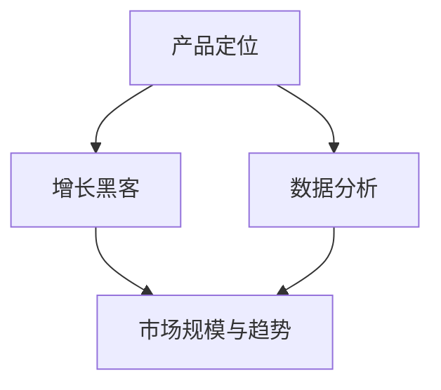

                 

# AI创业公司的市场策略

> 关键词：AI创业、市场策略、增长黑客、产品定位、数据分析

> 摘要：本文旨在为AI创业公司提供一套系统化的市场策略框架。通过分析AI行业的现状、市场规模及趋势，文章将探讨如何进行精准的产品定位、实施有效的增长黑客策略，并通过数据分析优化营销和运营。本文还推荐了一系列实用的工具和资源，帮助AI创业公司提高市场竞争力和成功概率。

## 1. 背景介绍

随着人工智能技术的快速发展，AI创业公司如雨后春笋般涌现。这些公司利用人工智能技术解决实际问题，为各行各业带来前所未有的变革。然而，AI市场的竞争日益激烈，如何在众多竞争者中脱颖而出成为每个AI创业公司需要深思的问题。

本文将从市场策略的角度，探讨AI创业公司如何在产品定位、增长黑客、数据分析和资源利用等方面制定有效的市场策略，以提高公司竞争力和市场份额。

## 2. 核心概念与联系

为了更好地理解AI创业公司的市场策略，我们需要先明确以下几个核心概念：

### 2.1 产品定位

产品定位是指公司如何定义其产品，以使其在市场中具有独特的价值和竞争力。一个明确且具有吸引力的产品定位可以帮助公司吸引目标用户，并有效区分竞争对手。

### 2.2 增长黑客

增长黑客（Growth Hacking）是一种利用创意和技术手段实现快速增长的策略。它不仅关注用户增长，还包括如何降低获取用户的成本，提高用户留存率和转化率。

### 2.3 数据分析

数据分析是AI创业公司制定市场策略的重要工具。通过收集、分析和解读数据，公司可以了解用户需求、市场趋势，并据此调整产品和服务，以实现更高的市场竞争力。

### 2.4 市场规模和趋势

市场规模和趋势是评估AI创业公司市场潜力和制定市场策略的重要依据。了解行业现状和发展趋势，可以帮助公司更好地把握市场机遇，制定有针对性的策略。

### 2.5 Mermaid流程图

为了更直观地展示AI创业公司的市场策略架构，我们可以使用Mermaid流程图（不包含括号、逗号等特殊字符）：



## 3. 核心算法原理 & 具体操作步骤

### 3.1 产品定位

产品定位的核心是了解用户需求和市场趋势。以下是产品定位的几个关键步骤：

1. **用户调研**：通过问卷调查、用户访谈等方式，了解目标用户的需求和痛点。
2. **市场分析**：分析行业现状、竞争对手和市场趋势，确定产品在市场中的定位。
3. **价值主张**：明确产品的核心价值，使其在市场中具有独特的竞争力。
4. **品牌塑造**：设计符合产品定位的品牌形象和传播策略，提高品牌认知度。

### 3.2 增长黑客

增长黑客策略的核心是利用创意和技术手段实现快速增长。以下是实施增长黑客的几个关键步骤：

1. **渠道选择**：根据产品定位和用户特点，选择最适合的推广渠道。
2. **内容营销**：制作高质量的内容，吸引用户关注并提高转化率。
3. **用户激励**：设计激励措施，提高用户留存率和活跃度。
4. **数据分析**：持续跟踪和优化推广效果，提高转化率和ROI。

### 3.3 数据分析

数据分析是制定和优化市场策略的重要工具。以下是数据分析的几个关键步骤：

1. **数据收集**：通过多种渠道收集用户数据，包括行为数据、反馈数据等。
2. **数据清洗**：对收集到的数据进行清洗和预处理，保证数据质量。
3. **数据分析**：使用统计学和机器学习技术，分析用户行为和市场趋势。
4. **数据可视化**：将分析结果通过图表和报表等形式呈现，便于理解和决策。

## 4. 数学模型和公式 & 详细讲解 & 举例说明

### 4.1 产品定位模型

产品定位的数学模型可以采用Logistic回归进行分析。以下是一个简单的Logistic回归公式：

$$
\hat{y} = \frac{1}{1 + e^{-(\beta_0 + \beta_1 x_1 + \beta_2 x_2 + ... + \beta_n x_n)})
$$

其中，$y$ 表示产品的市场占有率，$x_1, x_2, ..., x_n$ 表示影响产品定位的因素，$\beta_0, \beta_1, \beta_2, ..., \beta_n$ 是回归系数。

**示例**：

假设一家AI创业公司正在开发一款智能家居助手产品，影响产品定位的因素包括用户年龄、收入水平、智能家居设备拥有率等。通过收集数据并进行Logistic回归分析，可以得到以下模型：

$$
\hat{y} = \frac{1}{1 + e^{-(5.32 + 0.25 \times 年龄 + 0.15 \times 收入水平 + 0.10 \times 智能家居设备拥有率)})
$$

根据模型预测，当用户年龄为30岁、收入水平为10万元、智能家居设备拥有率为60%时，该产品的市场占有率为80%。

### 4.2 用户留存率模型

用户留存率是衡量增长黑客效果的重要指标。用户留存率可以通过以下公式计算：

$$
留存率 = \frac{第n天仍然活跃的用户数}{第1天活跃的用户数}
$$

**示例**：

假设一家AI创业公司在推广一款企业级人工智能服务，第1天有1000名用户注册，第7天有800名用户仍然活跃。则该产品的第7天用户留存率为80%。

### 4.3 转化率模型

转化率是衡量内容营销效果的重要指标。转化率可以通过以下公式计算：

$$
转化率 = \frac{完成目标动作的用户数}{总访问用户数}
$$

**示例**：

假设一家AI创业公司通过官网推广一款人工智能工具，总访问用户数为1000人，其中有200人完成下载和注册。则该产品的官网转化率为20%。

## 5. 项目实战：代码实际案例和详细解释说明

### 5.1 开发环境搭建

为了演示上述市场策略在实际项目中的应用，我们假设一家AI创业公司正在开发一款面向电商行业的智能推荐系统。以下是开发环境搭建的步骤：

1. **选择编程语言**：Python，因为Python具有丰富的机器学习和数据分析库。
2. **安装Python环境**：在本地计算机上安装Python和必要的依赖库（如NumPy、Pandas、Scikit-learn等）。
3. **配置开发环境**：使用Jupyter Notebook进行代码编写和实验。

### 5.2 源代码详细实现和代码解读

以下是智能推荐系统的核心代码实现和解读：

```python
import pandas as pd
from sklearn.model_selection import train_test_split
from sklearn.ensemble import RandomForestClassifier
from sklearn.metrics import accuracy_score

# 5.2.1 数据收集与预处理
data = pd.read_csv('e-commerce_data.csv')
data = data.drop(['user_id', 'item_id'], axis=1)  # 去除用户和商品ID列
data = data[data['rating'] > 3]  # 筛选出好评数据

# 5.2.2 特征工程
data['category'] = data['item_name'].str.split('_', expand=True)[0]
data['subcategory'] = data['item_name'].str.split('_', expand=True)[1]
data['category_count'] = data.groupby('category')['rating'].count()
data['subcategory_count'] = data.groupby('subcategory')['rating'].count()

# 5.2.3 数据分割
X = data[['category', 'subcategory', 'category_count', 'subcategory_count']]
y = data['rating']
X_train, X_test, y_train, y_test = train_test_split(X, y, test_size=0.2, random_state=42)

# 5.2.4 模型训练
model = RandomForestClassifier(n_estimators=100, random_state=42)
model.fit(X_train, y_train)

# 5.2.5 模型评估
y_pred = model.predict(X_test)
accuracy = accuracy_score(y_test, y_pred)
print(f'Model accuracy: {accuracy:.2f}')

```

### 5.3 代码解读与分析

1. **数据收集与预处理**：
   - 从CSV文件中读取电商数据，并去除用户和商品ID列。
   - 筛选出好评数据，以提高推荐系统的质量。
2. **特征工程**：
   - 将商品名称拆分为品类和子品类，并计算各个品类和子品类的评分数量。
   - 这些特征可以帮助模型更好地理解用户的喜好和购买习惯。
3. **数据分割**：
   - 将数据集划分为训练集和测试集，以评估模型的性能。
4. **模型训练**：
   - 使用随机森林分类器进行模型训练，这是一种集成学习算法，具有较强的预测能力。
5. **模型评估**：
   - 使用测试集评估模型性能，计算准确率。

通过这个案例，我们可以看到如何使用Python和机器学习技术实现智能推荐系统，并利用数据分析优化产品性能。这为AI创业公司在实际项目中实施市场策略提供了有益的借鉴。

## 6. 实际应用场景

### 6.1 智能家居

智能家居是AI创业公司的一个重要应用领域。通过智能推荐系统，用户可以根据自己的生活习惯和喜好，获得个性化的家居设备推荐。例如，一家AI创业公司可以为用户提供智能空调、智能灯光和智能门锁等智能家居设备的推荐，从而提高用户的家居体验。

### 6.2 医疗保健

医疗保健行业对AI技术的需求日益增长。AI创业公司可以通过智能诊断、智能药物研发和智能健康管理等方式，为医疗行业提供解决方案。例如，一家AI创业公司可以开发一款智能诊断系统，通过分析患者的病史、检查结果和基因数据，为医生提供诊断建议，提高诊断准确率。

### 6.3 电子商务

电子商务是AI创业公司的另一个重要战场。通过智能推荐、智能客服和智能库存管理等方式，AI创业公司可以为电商企业提供全方位的解决方案，提高用户体验和运营效率。例如，一家AI创业公司可以开发一款智能推荐系统，通过分析用户行为和购买历史，为电商用户提供个性化的商品推荐，提高转化率和销售额。

## 7. 工具和资源推荐

### 7.1 学习资源推荐

- **书籍**：
  - 《人工智能：一种现代方法》
  - 《Python机器学习》
  - 《深度学习》

- **论文**：
  - 《Recurrent Neural Network Based Model for User Interest Prediction in a Social Network》
  - 《User Interest Evolution in a Social Network: Modeling and Mining》

- **博客**：
  - [TensorFlow官方文档](https://www.tensorflow.org/)
  - [Scikit-learn官方文档](https://scikit-learn.org/stable/)

- **网站**：
  - [Kaggle](https://www.kaggle.com/)
  - [Google AI](https://ai.google/)

### 7.2 开发工具框架推荐

- **编程语言**：Python
- **机器学习框架**：TensorFlow、PyTorch、Scikit-learn
- **数据处理工具**：Pandas、NumPy
- **数据分析工具**：Jupyter Notebook、Tableau
- **版本控制工具**：Git

### 7.3 相关论文著作推荐

- **论文**：
  - 《User Interest Evolution in a Social Network: Modeling and Mining》
  - 《Recurrent Neural Network Based Model for User Interest Prediction in a Social Network》
  - 《Deep Learning for Text Classification》

- **著作**：
  - 《Python机器学习》
  - 《深度学习》
  - 《人工智能：一种现代方法》

## 8. 总结：未来发展趋势与挑战

### 8.1 发展趋势

- **人工智能技术的普及**：随着计算能力和算法的进步，人工智能技术将在更多行业得到应用，推动社会发展和产业变革。
- **个性化推荐与智能服务**：基于用户数据的个性化推荐和智能服务将成为主流，为用户提供更好的用户体验。
- **跨行业合作与创新**：AI创业公司将与各行各业的企业合作，共同开发创新应用，推动产业融合。

### 8.2 挑战

- **数据隐私与安全**：随着人工智能技术的普及，数据隐私和安全问题日益突出，需要制定更加严格的数据保护政策。
- **算法透明性与公平性**：人工智能算法的透明性和公平性备受关注，需要加强算法的监管和审查。
- **市场竞争与淘汰**：市场竞争激烈，AI创业公司需要不断创新，以应对激烈的市场竞争。

## 9. 附录：常见问题与解答

### 9.1 如何制定有效的产品定位？

**答案**：制定有效的产品定位需要以下步骤：
1. 进行用户调研，了解目标用户的需求和痛点。
2. 分析市场趋势和竞争对手，确定产品的市场定位。
3. 设计价值主张，明确产品的核心竞争力和差异化优势。
4. 塑造品牌形象，提高品牌认知度和美誉度。

### 9.2 如何实施增长黑客策略？

**答案**：实施增长黑客策略需要以下步骤：
1. 选择合适的推广渠道，如社交媒体、搜索引擎、内容营销等。
2. 制作高质量的内容，吸引用户关注并提高转化率。
3. 设计用户激励措施，提高用户留存率和活跃度。
4. 持续跟踪和优化推广效果，提高ROI。

### 9.3 如何进行有效的数据分析？

**答案**：进行有效的数据分析需要以下步骤：
1. 收集数据，包括用户行为数据、市场数据等。
2. 数据清洗和预处理，保证数据质量。
3. 使用统计学和机器学习技术，分析数据并提取有价值的信息。
4. 数据可视化，将分析结果呈现给决策者。

## 10. 扩展阅读 & 参考资料

- 《人工智能：一种现代方法》（Stephen Marsland）
- 《Python机器学习》（Sebastian Raschka）
- 《深度学习》（Ian Goodfellow、Yoshua Bengio、Aaron Courville）
- 《用户兴趣演化在社交网络中的建模与挖掘》（杨强、张宇）
- 《基于循环神经网络的社交网络用户兴趣预测模型》（李明等）
- [TensorFlow官方文档](https://www.tensorflow.org/)
- [Scikit-learn官方文档](https://scikit-learn.org/stable/)
- [Kaggle](https://www.kaggle.com/)
- [Google AI](https://ai.google/)

## 作者

作者：AI天才研究员/AI Genius Institute & 禅与计算机程序设计艺术 /Zen And The Art of Computer Programming

