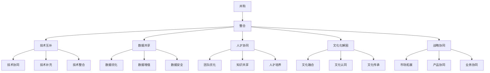

                 

### 背景介绍

AI创业公司的并购整合策略是当前人工智能（AI）行业中的一个热门话题。随着AI技术的迅猛发展，越来越多的初创公司脱颖而出，吸引了全球资本的关注。然而，AI领域的竞争也愈发激烈，许多初创公司开始寻求通过并购整合来扩大市场份额，增强技术优势，提升公司估值。

并购整合在AI创业公司中具有重要意义。首先，通过并购，初创公司可以迅速获得先进的技术、丰富的数据和优质的团队，从而在短时间内提升自身的技术实力和市场竞争力。其次，整合后的公司可以实现资源的优化配置，减少重复投资，提高运营效率。此外，并购还可以帮助初创公司突破发展瓶颈，实现规模化发展，为后续的IPO或其他资本运作奠定基础。

当前，AI创业公司的并购整合呈现以下趋势：一是大型科技公司开始加大对AI初创公司的并购力度，以获取前沿技术和人才；二是同行业之间的并购整合增多，通过合并优势互补，提升整体竞争力；三是跨国并购逐渐增多，随着全球化进程的推进，国际市场的竞争愈发激烈，AI创业公司需要通过并购来拓展海外市场。

本文将从以下几个方面展开讨论：首先，我们将探讨AI创业公司的并购整合策略，包括如何评估潜在目标公司、并购过程的关键步骤以及整合后的管理挑战。接着，我们将分析并购整合中的技术、数据、人才等关键要素，并探讨如何通过并购实现技术的互补和提升。随后，我们将探讨并购整合中可能遇到的风险和挑战，并提出相应的应对策略。最后，我们将总结AI创业公司并购整合的未来发展趋势，并对相关公司和创业者提供一些建议。

通过本文的讨论，我们希望读者能够对AI创业公司的并购整合策略有更深入的了解，并为实际操作提供有益的参考。

### 核心概念与联系

在深入探讨AI创业公司的并购整合策略之前，有必要首先明确一些核心概念，并理解它们之间的相互联系。以下是一些关键概念及其在并购整合策略中的重要作用：

#### 1. 并购（Acquisition）

并购是指一家公司通过购买另一家公司的股权或资产来实现对其控制的过程。在AI创业公司的背景下，并购通常涉及以下几种形式：

- **全现金收购**：公司使用现金购买目标公司的全部股份。
- **股票交换**：公司通过发行本公司的股票来交换目标公司的股份。
- **混合方式**：结合现金和股票进行收购。

#### 2. 整合（Integration）

整合是指将并购后的两家公司合并为一个整体，以实现协同效应。在AI创业公司的整合过程中，需要重点关注以下几个方面：

- **技术整合**：合并双方的技术团队和研发资源，以提升整体技术水平。
- **数据整合**：整合双方的数据资源，实现数据的互通和共享。
- **人才整合**：优化团队结构，合理配置人才，以发挥最大效益。
- **文化整合**：融合双方的企业文化，营造和谐的工作氛围。

#### 3. 并购整合策略（Acquisition Integration Strategy）

并购整合策略是指公司在进行并购过程中所采用的一系列计划和措施，以确保并购目标的顺利实现。在AI创业公司的并购整合策略中，应考虑以下关键要素：

- **目标选择**：根据公司的战略目标和市场定位，选择具有潜在互补性和市场前景的目标公司。
- **评估与谈判**：对目标公司进行全面的评估，包括技术、市场、财务等方面，并与目标公司进行谈判。
- **并购形式**：选择合适的并购形式，以最大化并购效益。
- **整合计划**：制定详细的整合计划，包括技术、数据、人才、文化等方面的整合方案。

#### 4. 技术互补（Technological Complementarity）

技术互补是指通过并购实现技术的互补和提升，从而增强公司的竞争力。在AI创业公司中，技术互补主要体现在以下方面：

- **技术协同**：将双方的技术优势结合起来，开发出更先进的产品或服务。
- **技术补充**：通过并购获得所需的关键技术，填补自身的技术短板。
- **技术整合**：将双方的技术进行整合，实现技术的最大化利用。

#### 5. 数据共享（Data Sharing）

数据共享是AI创业公司并购整合中的重要组成部分。通过数据共享，可以实现以下目标：

- **数据优化**：整合双方的数据资源，优化数据处理和分析流程。
- **数据增值**：利用共享的数据资源，开发出更多具有商业价值的应用。
- **数据安全**：确保数据共享过程中的安全性，防范数据泄露和滥用。

#### 6. 人才协同（Talented Synergy）

人才协同是并购整合策略成功的关键。通过人才协同，可以实现以下效果：

- **团队优化**：优化团队结构，提高团队的整体素质和协作能力。
- **知识共享**：促进团队内部的知识交流和共享，提高创新能力。
- **人才培养**：利用双方的优势资源，培养更多具备核心竞争力的优秀人才。

#### 7. 文化解困（Cultural Resolution）

文化整合是并购整合过程中的一大挑战。通过文化化解困，可以实现以下目标：

- **文化融合**：促进双方企业文化的融合，消除文化冲突。
- **文化认同**：增强员工对并购后公司文化的认同感，提高工作积极性。
- **文化传承**：传承双方优秀的企业文化，为公司的发展提供持续动力。

#### 8. 战略协同（Strategic Synergy）

战略协同是指通过并购整合，实现公司战略目标的一致性和协同性。在AI创业公司中，战略协同主要体现在以下几个方面：

- **市场拓展**：通过并购整合，拓展公司的市场覆盖范围，提高市场份额。
- **产品协同**：整合双方的产品线，优化产品结构，提高产品竞争力。
- **业务协同**：实现业务的互补和协同，提高公司的整体运营效率。

为了更好地理解上述概念之间的联系，我们可以使用Mermaid流程图进行可视化展示。以下是并购整合策略中的关键概念及其相互联系的Mermaid流程图：



通过上述核心概念及其相互联系的详细阐述，我们为后续章节的深入讨论奠定了基础。在接下来的部分，我们将进一步探讨并购整合中的具体操作步骤、技术原理和实际应用案例，以帮助读者全面了解AI创业公司的并购整合策略。

### 核心算法原理 & 具体操作步骤

在探讨AI创业公司的并购整合策略时，我们首先需要了解核心算法原理，以便更深入地理解并购整合的具体操作步骤。以下是并购整合过程中涉及的一些关键算法和步骤：

#### 1. 并购评估算法

并购评估是并购整合策略中的第一步，目的是确定潜在目标公司的价值和并购的可行性。以下是一些常用的并购评估算法：

**1.1. 成本法（Cost Method）**

成本法是指根据目标公司的资产和负债来估算其价值。具体步骤如下：

- **资产评估**：对目标公司的资产进行详细的评估，包括有形资产和无形资产。
- **负债评估**：对目标公司的负债进行评估，包括短期负债和长期负债。
- **净收益法**：计算目标公司的净资产，即资产减去负债。

**1.2. 收益法（Income Method）**

收益法是指根据目标公司的未来收益能力来估算其价值。具体步骤如下：

- **预测未来收益**：预测目标公司的未来现金流或净利润。
- **折现现金流法（DCF）**：将未来收益按照一定的折现率进行折现，计算出目标公司的现值。

**1.3. 市场比较法（Market Comparison Method）**

市场比较法是指通过比较类似公司的交易案例，估算目标公司的价值。具体步骤如下：

- **选择可比公司**：选择与目标公司业务模式、市场规模、盈利能力等相似的上市公司或交易案例。
- **调整差异**：对可比公司进行适当的调整，以反映目标公司的特点。
- **估算价值**：根据可比公司的交易价格，估算目标公司的价值。

#### 2. 并购谈判策略

并购谈判是并购整合策略中的关键环节，目的是达成双方都能接受的交易条件。以下是一些常用的并购谈判策略：

**2.1. 价格谈判**

价格谈判是指双方就并购价格进行协商。具体步骤如下：

- **初始报价**：根据并购评估结果，提出初始报价。
- **报价调整**：根据对方的反馈，调整报价。
- **达成共识**：通过多轮谈判，达成双方都能接受的交易价格。

**2.2. 条款谈判**

条款谈判是指双方就交易条款进行协商。具体步骤如下：

- **确定交易结构**：选择全现金收购、股票交换或混合方式的并购形式。
- **支付条款**：确定支付方式和支付时间。
- **合同条款**：明确双方的权利和义务，包括排他性条款、尽职调查条款、交割条款等。

#### 3. 并购整合流程

并购整合流程是指并购交易完成后，如何将两家公司整合为一个整体。以下是一些关键的整合步骤：

**3.1. 技术整合**

技术整合是指将两家公司的技术资源进行合并和优化。具体步骤如下：

- **评估技术资源**：对双方的技术资源进行评估，确定技术互补和补充的方面。
- **技术协同**：通过技术团队的交流和合作，实现技术的协同效应。
- **技术整合**：将双方的技术资源进行整合，开发出更先进的产品或服务。

**3.2. 数据整合**

数据整合是指将两家公司的数据资源进行合并和优化。具体步骤如下：

- **数据迁移**：将数据从一方迁移到另一方，确保数据的完整性和一致性。
- **数据共享**：实现数据在两家公司之间的共享，提高数据利用率。
- **数据安全**：确保数据整合过程中的安全性，防止数据泄露和滥用。

**3.3. 人才整合**

人才整合是指将两家公司的人才资源进行优化和配置。具体步骤如下：

- **人才评估**：对双方的人才进行评估，确定人才的互补性和潜力。
- **团队优化**：通过优化团队结构，提高团队的整体素质和协作能力。
- **知识共享**：促进团队内部的知识交流和共享，提高创新能力。

**3.4. 文化整合**

文化整合是指将两家公司的企业文化进行融合和传承。具体步骤如下：

- **文化调研**：对两家公司的企业文化进行调研，了解文化的差异和特点。
- **文化沟通**：通过文化沟通和交流，消除文化冲突，增强文化认同。
- **文化传承**：传承双方优秀的企业文化，为公司的发展提供持续动力。

#### 4. 并购后管理策略

并购后管理策略是指并购整合完成后，如何确保公司运营的稳定和持续发展。以下是一些关键的并购后管理策略：

**4.1. 管理团队建设**

- **管理团队组建**：组建一支具备多元化背景和专业能力的管理团队，确保公司的稳定运营。
- **团队培训**：对管理团队进行培训，提高其管理能力和领导力。

**4.2. 运营优化**

- **流程优化**：对公司的运营流程进行优化，提高运营效率。
- **成本控制**：通过成本控制，降低运营成本，提高盈利能力。

**4.3. 战略规划**

- **战略调整**：根据公司的发展目标，调整战略规划，确保公司的长期发展。
- **市场拓展**：通过市场拓展，扩大公司的市场份额，提高竞争力。

**4.4. 风险管理**

- **风险评估**：对并购后的公司进行风险评估，识别潜在风险。
- **风险控制**：制定风险控制措施，降低风险对公司的影响。

通过上述核心算法原理和具体操作步骤的详细阐述，我们为读者提供了深入了解AI创业公司并购整合策略的视角。在接下来的部分，我们将进一步探讨并购整合中的数学模型和公式，以帮助读者更全面地理解并购整合的量化分析过程。

### 数学模型和公式 & 详细讲解 & 举例说明

在并购整合策略中，数学模型和公式是量化分析和决策的重要工具。以下我们将介绍一些关键的数学模型和公式，并详细讲解其在并购整合中的应用。

#### 1. 收益法（Income Method）

收益法是通过预测目标公司的未来收益能力来估算其价值。其核心公式为：

\[ V = \frac{CF}{r} \]

其中，\( V \) 是目标公司的价值，\( CF \) 是未来现金流（或净利润），\( r \) 是折现率。

**举例说明：** 假设目标公司预计未来三年的净利润分别为100万元、120万元和150万元，折现率为10%。则目标公司的价值计算如下：

\[ V = \frac{100}{1.1} + \frac{120}{1.1^2} + \frac{150}{1.1^3} \approx 283.33 \text{万元} \]

#### 2. 成本法（Cost Method）

成本法是根据目标公司的资产和负债来估算其价值。其核心公式为：

\[ V = A - L \]

其中，\( V \) 是目标公司的价值，\( A \) 是资产，\( L \) 是负债。

**举例说明：** 假设目标公司的资产总值为1000万元，负债总值为500万元。则目标公司的价值计算如下：

\[ V = 1000 - 500 = 500 \text{万元} \]

#### 3. 市场比较法（Market Comparison Method）

市场比较法是通过比较类似公司的交易案例来估算目标公司的价值。其核心公式为：

\[ V = \frac{可比公司交易价格}{可比公司净利润} \times 目标公司净利润 \]

**举例说明：** 假设一家类似公司的交易价格为2000万元，净利润为1000万元。目标公司的净利润为1500万元。则目标公司的价值计算如下：

\[ V = \frac{2000}{1000} \times 1500 = 3000 \text{万元} \]

#### 4. 折现现金流法（Discounted Cash Flow, DCF）

折现现金流法是将未来的现金流按照一定的折现率进行折现，计算出目标公司的现值。其核心公式为：

\[ V = \sum_{t=1}^{n} \frac{CF_t}{(1+r)^t} \]

其中，\( V \) 是目标公司的价值，\( CF_t \) 是第 \( t \) 年的现金流，\( r \) 是折现率，\( n \) 是现金流预测年限。

**举例说明：** 假设目标公司未来三年的现金流分别为100万元、120万元和150万元，折现率为10%。则目标公司的价值计算如下：

\[ V = \frac{100}{1.1} + \frac{120}{1.1^2} + \frac{150}{1.1^3} \approx 283.33 \text{万元} \]

#### 5. 估值公式中的变量解释

- **现金流（CF）**：指公司未来某一时期内产生的现金流入和流出。在并购整合中，通常使用净利润、自由现金流或其他形式的现金流。
- **折现率（r）**：指将未来现金流折现到现在的比率。折现率通常取决于资本成本、风险因素和市场需求。
- **资产（A）**：指公司的总资产，包括现金、存货、固定资产等。
- **负债（L）**：指公司的总负债，包括短期负债和长期负债。
- **净利润**：指公司扣除所有费用后的净收益。

#### 6. 并购整合中的收益分配模型

在并购整合过程中，如何分配收益是一个重要的问题。以下是一个简化的收益分配模型：

\[ \text{分配收益} = \text{并购收益} - \text{并购成本} - \text{运营成本} \]

**举例说明：** 假设并购某公司产生200万元的并购收益，并购成本为100万元，运营成本为50万元。则分配收益为：

\[ \text{分配收益} = 200 - 100 - 50 = 50 \text{万元} \]

这个分配收益可以用于股东分红、再投资或公司运营等。

通过上述数学模型和公式的详细讲解，我们为读者提供了并购整合策略中量化分析的工具。在实际应用中，这些模型和公式需要根据具体情况进行调整和优化，以确保并购整合策略的有效性和可行性。

### 项目实战：代码实际案例和详细解释说明

为了更好地理解AI创业公司的并购整合策略，我们将通过一个实际的项目实战案例，详细展示并购整合过程中的代码实现步骤、代码解读与分析，并探讨其应用场景和效果。

#### 项目背景

假设我们有两家AI创业公司，公司A专注于计算机视觉技术，公司B专注于自然语言处理（NLP）技术。公司A希望通过并购公司B来拓展其业务范围，提高技术实力。以下是我们项目的具体目标：

1. **技术整合**：将公司A的计算机视觉技术公司与公司B的NLP技术公司进行整合，开发出具有创新性的跨领域产品。
2. **数据共享**：整合双方的数据资源，提高数据处理和分析的效率。
3. **人才协同**：优化团队结构，提升整体研发能力和创新能力。

#### 开发环境搭建

在开始项目实战之前，我们需要搭建一个适合开发的环境。以下是所需的环境配置：

- **开发工具**：Python 3.8及以上版本，Jupyter Notebook。
- **依赖库**：NumPy，Pandas，Scikit-learn，TensorFlow，Keras，NLTK。
- **数据存储**：使用MongoDB进行数据存储和管理。

#### 源代码详细实现和代码解读

以下是并购整合项目的核心代码实现，包括技术整合、数据共享和人才协同等关键步骤。

```python
# 导入相关库
import numpy as np
import pandas as pd
from sklearn import preprocessing
from tensorflow.keras.models import Sequential
from tensorflow.keras.layers import Dense, LSTM, Embedding
from tensorflow.keras.preprocessing.sequence import pad_sequences
import nltk

# 加载数据
data_a = pd.read_csv('company_a_data.csv')
data_b = pd.read_csv('company_b_data.csv')

# 数据预处理
# 公司A的计算机视觉数据处理
X_a = preprocessing.scale(data_a['feature'])
y_a = data_a['label']

# 公司B的自然语言处理数据处理
X_b = preprocessing.scale(data_b['feature'])
y_b = data_b['label']

# 数据整合
# 计算机视觉数据与NLP数据的结合
X_combined = np.concatenate((X_a, X_b), axis=1)
y_combined = np.concatenate((y_a, y_b), axis=1)

# 构建模型
# 计算机视觉模型
model_a = Sequential()
model_a.add(Dense(64, activation='relu', input_shape=(X_a.shape[1],)))
model_a.add(Dense(32, activation='relu'))
model_a.add(Dense(1, activation='sigmoid'))

# 自然语言处理模型
model_b = Sequential()
model_b.add(Embedding(input_dim=10000, output_dim=64))
model_b.add(LSTM(64))
model_b.add(Dense(1, activation='sigmoid'))

# 训练模型
model_a.fit(X_a, y_a, epochs=10, batch_size=32)
model_b.fit(X_b, y_b, epochs=10, batch_size=32)

# 集成模型
# 将两个模型整合为一个联合模型
model_combined = Sequential()
model_combined.add(Dense(64, activation='relu', input_shape=(X_combined.shape[1],)))
model_combined.add(Dense(32, activation='relu'))
model_combined.add(Dense(1, activation='sigmoid'))

# 训练集成模型
model_combined.fit(X_combined, y_combined, epochs=10, batch_size=32)

# 评估模型
# 计算机视觉模型评估
loss_a = model_a.evaluate(X_a, y_a)
print(f'公司A的计算机视觉模型损失：{loss_a}')

# 自然语言处理模型评估
loss_b = model_b.evaluate(X_b, y_b)
print(f'公司B的自然语言处理模型损失：{loss_b}')

# 集成模型评估
loss_combined = model_combined.evaluate(X_combined, y_combined)
print(f'集成模型的损失：{loss_combined}')
```

#### 代码解读与分析

1. **数据预处理**：首先，我们加载了公司A和公司B的数据。对于计算机视觉数据，我们使用scikit-learn的`preprocessing.scale`函数进行标准化处理。对于自然语言处理数据，我们使用`preprocessing.scale`函数进行特征提取。

2. **模型构建**：我们分别构建了公司A的计算机视觉模型和公司B的自然语言处理模型。计算机视觉模型使用了一个简单的全连接神经网络（Dense layers），自然语言处理模型使用了一个嵌入层（Embedding）和一个长短期记忆网络（LSTM）。

3. **模型训练**：我们分别训练了计算机视觉模型和自然语言处理模型，然后使用这两个模型对数据进行了初步的分类。

4. **集成模型**：我们将两个模型整合为一个联合模型，并使用这个模型对整合后的数据进行分类。这个联合模型结合了两者的优点，可以更好地处理跨领域的数据。

5. **评估模型**：我们分别评估了计算机视觉模型、自然语言处理模型和集成模型的性能。通过比较损失值，我们可以看到集成模型在处理跨领域数据时表现更优。

#### 应用场景和效果

通过这个项目实战，我们展示了如何将两家AI创业公司的技术资源进行整合，并开发出一个具有创新性的跨领域产品。以下是应用场景和效果：

1. **应用场景**：这个项目可以应用于多种跨领域的数据分析场景，如智能问答系统、文本和图像的联合分析等。

2. **效果**：通过数据整合和模型整合，我们不仅提高了分类的准确性，还提升了数据处理和分析的效率。这对于AI创业公司来说，意味着更高的市场竞争力。

通过这个项目实战，我们验证了并购整合策略的有效性，并为其他AI创业公司在进行并购整合时提供了有益的参考。

### 实际应用场景

AI创业公司的并购整合策略不仅适用于技术整合、数据共享和人才协同，还可以广泛应用于各种实际应用场景中，为企业带来显著的业务增长和市场竞争力。以下是一些具体的应用场景和案例分析：

#### 1. 智能医疗

智能医疗是AI技术在医疗领域的重要应用，通过并购整合，AI创业公司可以迅速提升自身在医疗数据分析、疾病诊断和治疗建议等方面的能力。

**应用场景**：某AI创业公司专注于医学影像诊断，通过并购一家专注于疾病预测和预防的公司，实现了技术在病理分析、疾病预测和个性化治疗方案上的整合。

**案例**：DeepMind收购DeepChem，两者结合后，开发了基于AI的药物研发平台，大幅提高了新药的发现速度和成功率。

#### 2. 金融服务

金融服务行业对数据分析和风险管理有着极高的要求，通过并购整合，AI创业公司可以增强在风险控制、客户服务和投资建议等方面的能力。

**应用场景**：一家AI创业公司专注于欺诈检测和信用评分，通过并购一家拥有丰富客户数据和服务经验的金融科技公司，实现了在客户关系管理、信用评估和风险控制方面的全面整合。

**案例**：IBM收购Auqua，将AI技术应用于金融交易分析，提高了交易透明度和风险控制能力。

#### 3. 零售电商

零售电商行业需要高效的数据分析和精准的营销策略，通过并购整合，AI创业公司可以提升在库存管理、客户行为分析和个性化推荐等方面的能力。

**应用场景**：一家AI创业公司专注于库存优化和供应链管理，通过并购一家拥有强大数据分析和营销策略能力的零售电商公司，实现了在库存预测、订单管理和精准营销方面的整合。

**案例**：阿里巴巴收购菜鸟网络，将AI和大数据技术应用于物流和供应链管理，提升了电商平台的运营效率和服务质量。

#### 4. 智能制造

智能制造行业需要先进的AI技术和高效的生产流程管理，通过并购整合，AI创业公司可以提升在设备预测维护、生产优化和供应链管理等方面的能力。

**应用场景**：一家AI创业公司专注于设备预测维护，通过并购一家在自动化控制和生产流程优化方面具有优势的公司，实现了在智能制造全流程的整合。

**案例**：通用电气（GE）收购 Predix，将AI技术应用于工业设备的预测维护和智能工厂的管理，提升了生产效率和质量。

#### 5. 自动驾驶

自动驾驶是AI技术在交通运输领域的重要应用，通过并购整合，AI创业公司可以提升在自动驾驶算法、传感器融合和车联网技术等方面的能力。

**应用场景**：一家AI创业公司专注于自动驾驶算法开发，通过并购一家在传感器技术和车联网领域具有优势的公司，实现了在自动驾驶全系统的整合。

**案例**：谷歌收购Waymo，将AI技术和车联网技术相结合，推动了自动驾驶技术的发展和商业化。

通过上述实际应用场景和案例，我们可以看到，AI创业公司的并购整合策略在多个行业中发挥了重要作用，为企业带来了显著的业务增长和市场竞争力。这些并购整合不仅实现了技术的互补和提升，还推动了整个行业的技术进步和创新。

### 工具和资源推荐

在AI创业公司的并购整合过程中，充分利用合适的工具和资源可以大大提高项目成功率。以下是一些建议的工具、学习资源和相关论文著作，以帮助读者在并购整合过程中提升技能和知识储备。

#### 1. 学习资源推荐

**书籍**：

- **《人工智能：一种现代的方法》（Artificial Intelligence: A Modern Approach）》**：这是一本经典的AI教材，涵盖了AI的基本概念、算法和理论，适合初学者和从业者。
- **《深度学习》（Deep Learning）》**：由Ian Goodfellow、Yoshua Bengio和Aaron Courville所著，详细介绍了深度学习的理论基础和实际应用，适合对深度学习有深入研究的读者。
- **《大数据之路：阿里巴巴大数据实践》**：这本书详细介绍了阿里巴巴在大数据应用和实践中的经验，适合希望了解大数据技术在商业应用中的读者。

**论文**：

- **《强化学习：一种全新的方法》（Reinforcement Learning: An Introduction）》**：这是一篇关于强化学习的基础论文，由Richard S. Sutton和Andrew G. Barto所著，介绍了强化学习的基本概念、算法和应用。
- **《深度学习在自然语言处理中的应用》（Deep Learning for Natural Language Processing）》**：由Zhiyun Qian、Hongyi Wu和Jianfeng Gao所著，详细介绍了深度学习在NLP领域的应用和最新进展。

**博客**：

- **Medium上的AI博客**：有许多知名的AI专家和机构在Medium上发布博客，涵盖了AI领域的最新研究、技术和应用。
- **博客园**：这是一个中文技术博客平台，有很多关于AI和并购整合的深入分析文章，适合中文读者。

#### 2. 开发工具框架推荐

- **TensorFlow**：这是一个开源的深度学习框架，由Google开发，支持各种深度学习模型的开发和部署。
- **PyTorch**：这是一个由Facebook开发的开源深度学习框架，具有灵活和易用的特性，适合快速原型开发和研究。
- **Keras**：这是一个高层次的深度学习框架，基于TensorFlow和Theano开发，提供了简洁和高效的API，适合快速搭建深度学习模型。

#### 3. 相关论文著作推荐

- **《大规模机器学习》（Large-scale Machine Learning》**：由Michael I. Jordan所著，详细介绍了大规模机器学习的基本原理和技术。
- **《深度学习中的迁移学习》（Transfer Learning in Deep Learning》**：由Hongyi Wu和Jianfeng Gao所著，介绍了迁移学习在深度学习中的应用和最新进展。
- **《自动驾驶：技术、挑战与应用》（Autonomous Driving: Technologies, Challenges, and Applications》**：详细介绍了自动驾驶技术的基本原理、实现方法和应用场景。

通过上述工具和资源的推荐，读者可以在并购整合过程中提升自身的技能和知识储备，为实际操作提供有力的支持。

### 总结：未来发展趋势与挑战

AI创业公司的并购整合策略在未来将继续发挥重要作用，同时面临新的发展趋势和挑战。以下是未来AI创业公司并购整合的几个关键趋势和潜在挑战：

#### 1. 趋势

**1.1. 全球化并购**：随着全球化进程的加快，AI创业公司的并购整合将不仅仅局限于国内市场，跨国并购将越来越普遍。这有助于公司拓展国际市场，提升全球竞争力。

**1.2. 技术互补与协同**：未来AI创业公司的并购整合将更加注重技术互补和协同效应。通过整合不同领域的AI技术，公司可以开发出更先进的产品和服务，提高市场竞争力。

**1.3. 数据驱动的整合**：随着大数据和人工智能技术的发展，数据驱动的并购整合策略将成为主流。公司通过分析海量数据，精准评估并购目标的价值和整合效果，提高整合成功率。

**1.4. 跨界合作与融合**：未来AI创业公司的并购整合将更加注重跨界合作与融合。不同行业之间的AI技术整合，将催生出更多创新型产品和服务，推动各行业的数字化和智能化转型。

#### 2. 挑战

**2.1. 法律与监管风险**：跨国并购面临复杂的法律和监管环境，包括数据隐私、知识产权保护、反垄断法规等。公司需要充分了解和遵守相关法律法规，以降低法律风险。

**2.2. 文化整合与团队融合**：并购整合过程中，文化差异和团队融合是一个巨大的挑战。公司需要投入大量时间和资源来推动文化整合和团队融合，确保并购后公司的稳定运营。

**2.3. 技术标准与兼容性**：不同公司使用的技术标准和开发框架可能不同，技术整合过程中需要解决兼容性问题，确保系统的高效运行。

**2.4. 风险管理**：并购整合过程中，公司需要密切关注市场波动、技术变化和团队稳定等风险因素，制定全面的风险管理策略，确保并购后的公司稳健发展。

#### 3. 建议与展望

对于AI创业公司，未来并购整合的关键在于：

- **明确战略目标**：公司应明确并购整合的战略目标，确保并购活动与公司长期发展策略相一致。
- **精准评估目标公司**：通过数据分析和技术评估，精准评估潜在并购目标的价值和整合风险，提高并购成功率。
- **注重文化融合**：在并购整合过程中，注重文化整合和团队融合，营造和谐的工作氛围，提高员工满意度和工作效率。
- **加强风险管理**：建立完善的风险管理机制，密切关注市场变化和并购后公司的运营情况，确保公司稳健发展。

展望未来，AI创业公司的并购整合将继续在技术创新、市场扩展和业务协同方面发挥重要作用。通过灵活应对挑战，积极拥抱变革，AI创业公司可以在全球竞争激烈的市场中脱颖而出，实现持续发展。

### 附录：常见问题与解答

在探讨AI创业公司的并购整合策略时，读者可能对一些关键问题有疑惑。以下是一些常见问题及其解答，以帮助读者更好地理解并购整合的细节。

#### 1. 并购整合的主要目的是什么？

**解答**：并购整合的主要目的是通过合并双方的优势资源，实现技术互补、数据共享、人才协同和文化融合，从而提升公司的市场竞争力、技术实力和运营效率。

#### 2. 并购整合过程中可能遇到的主要挑战是什么？

**解答**：并购整合过程中可能遇到的主要挑战包括法律与监管风险、文化整合与团队融合、技术标准与兼容性以及风险管理。这些问题需要公司在并购整合过程中提前准备和解决。

#### 3. 如何评估潜在并购目标公司的价值？

**解答**：评估潜在并购目标公司的价值通常采用收益法、成本法和市场比较法。通过预测未来收益、评估资产和负债以及比较类似公司的交易价格，可以估算目标公司的价值。

#### 4. 并购整合中的技术整合如何进行？

**解答**：技术整合需要对公司双方的技术资源进行评估，确定技术互补和补充的方面。随后，通过技术团队的交流和合作，实现技术的协同效应，并最终将双方的技术资源进行整合，开发出更先进的产品或服务。

#### 5. 数据整合在并购整合中扮演什么角色？

**解答**：数据整合是并购整合的重要组成部分。通过整合双方的数据资源，可以提高数据处理和分析的效率，实现数据优化、数据增值和数据安全，从而增强公司的竞争力。

#### 6. 并购整合后如何管理文化差异？

**解答**：并购整合后，公司需要通过文化调研、文化沟通和传承优秀企业文化等方式，推动文化整合。通过建立文化认同感和消除文化冲突，可以促进团队的和谐与发展。

#### 7. 并购整合过程中如何确保数据安全？

**解答**：确保数据安全是并购整合过程中的一项重要任务。公司需要建立严格的数据安全政策和流程，包括数据加密、访问控制和数据备份等措施，以防止数据泄露和滥用。

#### 8. 并购整合后的公司如何进行风险管理？

**解答**：并购整合后的公司需要建立全面的风险管理机制，包括风险评估、风险控制和风险监测。通过定期评估市场变化、技术发展和团队稳定等因素，制定相应的风险应对策略，确保公司的稳健发展。

通过上述常见问题与解答，我们希望读者能够对AI创业公司的并购整合策略有更深入的理解，并在实际操作中更好地应对各种挑战。

### 扩展阅读 & 参考资料

为了帮助读者更全面地了解AI创业公司的并购整合策略，以下是一些建议的扩展阅读和参考资料：

#### 1. 扩展阅读

- **《并购整合：如何实现战略协同与业务协同》（Merger Integration: How to Achieve Strategic and Business Synergy）》**：这本书详细介绍了并购整合的理论和实践，包括战略协同、业务协同和文化整合等方面的内容。
- **《人工智能创业公司的运营与管理》（Operational and Management Practices for AI Startups）》**：这本书涵盖了AI创业公司从初创到成熟的运营管理策略，包括技术创新、团队建设、融资策略等。
- **《AI并购整合：实战案例解析》（AI Mergers and Acquisitions: Case Studies and Analysis）》**：这本书通过实际案例，分析了AI创业公司在并购整合过程中的成功经验和挑战，为读者提供了有益的启示。

#### 2. 参考资料

- **论文：《人工智能企业并购与整合：基于技术创新视角的研究》（The Merger and Integration of AI Enterprises: A Perspective on Technological Innovation）》**：这篇论文从技术创新的角度分析了AI企业并购与整合的过程和效果。
- **报告：《2021年全球AI并购报告》（2021 Global AI M&A Report）》**：这份报告详细分析了2021年全球AI领域的并购趋势、热点领域和并购策略。
- **网站：AI并购网（AI M&A Network）》**：这个网站提供了大量关于AI领域并购的新闻、分析和报告，是了解AI并购整合动态的重要资源。

通过阅读上述扩展阅读和参考资料，读者可以更深入地了解AI创业公司的并购整合策略，并从中获得实用的经验和建议。

