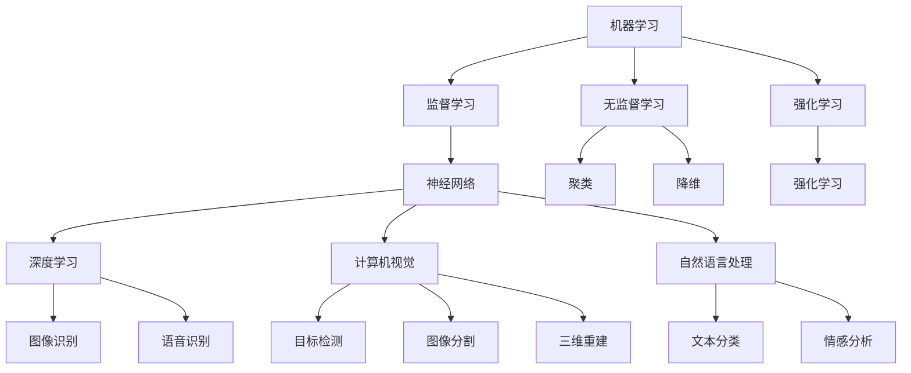

                 

### 背景介绍

随着人工智能技术的迅速发展，AI创业公司正成为推动科技进步和产业变革的重要力量。无论是深度学习、自然语言处理，还是计算机视觉，人工智能技术正逐渐从理论研究走向实际应用，为各行各业带来了全新的解决方案。在这个过程中，技术趋势的研究变得尤为重要。它不仅可以帮助创业者和企业了解当前的技术动向，还可以为他们提供未来发展的方向和决策依据。

AI创业公司的技术趋势研究，旨在深入分析当前主流人工智能技术的发展动态，探讨其应用场景，预测未来的发展方向，并评估面临的挑战。这种研究不仅有助于提升公司的技术竞争力，还能为行业制定战略规划提供有力支持。

首先，我们需要明确几个关键问题：当前人工智能技术的核心发展趋势是什么？这些技术在实际应用中面临哪些挑战？未来又有哪些潜在的发展方向？通过对这些问题的系统性研究，我们可以为AI创业公司的发展提供有价值的参考。

本文将分为以下几个部分来展开讨论：

1. **核心概念与联系**：介绍人工智能技术中的核心概念，如机器学习、神经网络等，并使用Mermaid流程图展示其原理和架构。
2. **核心算法原理 & 具体操作步骤**：详细解析主流的人工智能算法，包括其工作原理和实现步骤。
3. **数学模型和公式 & 详细讲解 & 举例说明**：介绍支持人工智能算法的数学模型和公式，并结合实际案例进行详细解释。
4. **项目实战：代码实际案例和详细解释说明**：通过具体项目的代码实现，展示人工智能技术的实际应用。
5. **实际应用场景**：探讨人工智能技术在各个行业的应用实例。
6. **工具和资源推荐**：推荐学习资源、开发工具和框架，帮助读者深入理解和应用人工智能技术。
7. **总结：未来发展趋势与挑战**：总结当前技术趋势，预测未来发展方向，并分析可能面临的挑战。

通过以上内容的系统分析，我们希望能够为AI创业公司提供全面的技术趋势指南，助力他们在人工智能领域的创新发展。

---

**文章标题**：AI创业公司的技术趋势研究：技术演进、应用场景与发展方向

**关键词**：（此处列出文章的5-7个核心关键词）

- 人工智能技术
- 创业公司
- 技术趋势
- 机器学习
- 深度学习
- 应用场景

**摘要**：本文旨在深入探讨AI创业公司在人工智能技术领域的发展趋势。通过系统分析核心概念、算法原理、数学模型、实际应用场景以及未来发展趋势，本文为创业者提供全面的技术指南，助力他们在人工智能领域的创新发展。

## 1. 核心概念与联系

在深入研究人工智能技术的核心趋势之前，首先需要明确几个关键概念，这些概念构成了人工智能技术的基石。以下是几个重要的核心概念，以及它们之间的联系。

### 1.1 机器学习

机器学习是人工智能的一个重要分支，它通过算法让计算机从数据中学习规律，并自动作出决策或预测。机器学习主要分为监督学习、无监督学习和强化学习三种类型。

- **监督学习**：在这种学习中，算法利用标记好的训练数据来学习规律。例如，通过标记好的图像数据，训练一个图像识别模型。
- **无监督学习**：与监督学习相反，无监督学习不使用标记数据，而是通过数据自身的结构和模式来学习。常见的无监督学习算法包括聚类和降维。
- **强化学习**：强化学习通过奖励机制来引导算法学习。在这种学习中，算法通过与环境的交互来学习最优策略，常见应用有自动驾驶和游戏AI。

### 1.2 神经网络

神经网络（Neural Networks）是机器学习中最常用的模型之一，它模仿生物神经系统的工作原理。神经网络由多个层组成，包括输入层、隐藏层和输出层。通过多层神经元的连接和激活函数的作用，神经网络能够对复杂的数据进行建模和分类。

### 1.3 深度学习

深度学习是神经网络的一种特殊形式，主要特点是使用多层神经网络。深度学习通过大量的数据训练，可以自动提取复杂的特征，从而实现高级任务，如图像识别、语音识别和自然语言处理。

### 1.4 自然语言处理

自然语言处理（Natural Language Processing, NLP）是人工智能的一个分支，它致力于使计算机能够理解、解释和生成人类语言。NLP技术包括文本分类、情感分析、机器翻译和语音识别等。

### 1.5 计算机视觉

计算机视觉是人工智能的一个重要领域，它使计算机能够从图像或视频中提取信息和理解场景。计算机视觉技术包括图像分类、目标检测、图像分割和三维重建等。

### 1.6 关联关系

上述概念之间存在紧密的联系。例如，机器学习提供了算法框架，神经网络是实现机器学习算法的核心技术，而深度学习则通过多层神经网络实现了更复杂的特征提取。自然语言处理和计算机视觉则分别利用这些技术来处理文本和图像数据，从而实现更高级的应用。

为了更直观地理解这些概念之间的关系，我们可以使用Mermaid流程图进行展示：



通过上述流程图，我们可以清晰地看到各个核心概念之间的关联，以及它们在人工智能技术体系中的地位和作用。

在接下来的章节中，我们将进一步探讨这些核心概念的具体原理和应用场景，帮助读者更深入地理解人工智能技术的发展动态。

---

**Mermaid流程图注意事项**：
- 流程节点中不要使用括号、逗号等特殊字符，以确保流程图的正确渲染。
- 如果需要添加注释或其他说明，可以在节点后使用括号括起来的文字。

## 2. 核心算法原理 & 具体操作步骤

在了解了人工智能技术的核心概念和它们之间的联系后，接下来我们将深入探讨一些关键算法的原理和具体操作步骤。这些算法是推动人工智能技术发展的核心力量，也是AI创业公司实现技术突破的重要工具。

### 2.1 机器学习算法

机器学习算法是人工智能技术的核心，它们通过数据学习模式并做出预测或决策。以下是几种常见的机器学习算法及其原理：

#### 2.1.1 监督学习算法

监督学习算法是最常见的机器学习算法之一，它们使用标记数据来训练模型。以下是几种主要的监督学习算法：

- **线性回归**：线性回归是一种简单的监督学习算法，它通过拟合一个线性模型来预测数值输出。具体步骤如下：

  1. 收集数据：准备包含输入特征和目标值的训练数据集。
  2. 特征工程：对数据进行预处理，如归一化、缺失值处理等。
  3. 训练模型：使用最小二乘法或其他优化算法训练线性模型。
  4. 评估模型：使用交叉验证等方法评估模型性能。
  5. 预测新数据：使用训练好的模型对新数据进行预测。

- **决策树**：决策树是一种树形结构的分类模型，通过一系列条件判断来对数据进行分类。具体步骤如下：

  1. 收集数据：准备包含输入特征和标签的训练数据集。
  2. 特征选择：选择最优的特征进行划分，通常使用信息增益或基尼系数作为划分标准。
  3. 构建树结构：递归地划分数据，直到满足停止条件（如最大深度、节点纯度等）。
  4. 预测新数据：遍历树结构，根据路径得出预测结果。

#### 2.1.2 无监督学习算法

无监督学习算法不使用标记数据，而是通过数据内在的结构和模式进行学习。以下是几种主要的无监督学习算法：

- **K-均值聚类**：K-均值聚类是一种基于距离的聚类算法，它将数据划分为K个聚类，每个聚类由其质心代表。具体步骤如下：

  1. 初始化聚类中心：随机选择K个数据点作为初始聚类中心。
  2. 分配数据点：将每个数据点分配到最近的聚类中心。
  3. 更新聚类中心：计算每个聚类的质心。
  4. 重复步骤2和3，直到聚类中心不再发生显著变化。

- **主成分分析**（PCA）：主成分分析是一种降维技术，它通过将数据投影到新的正交坐标系中，提取主要特征，从而减少数据维度。具体步骤如下：

  1. 计算数据协方差矩阵。
  2. 计算协方差矩阵的特征值和特征向量。
  3. 选择最大的K个特征向量作为新的坐标轴。
  4. 将数据投影到新的坐标轴上。

#### 2.1.3 强化学习算法

强化学习算法通过奖励机制来指导模型学习最优策略。以下是几种主要的强化学习算法：

- **Q-Learning**：Q-Learning是一种基于值函数的强化学习算法，它通过迭代更新Q值来学习最优策略。具体步骤如下：

  1. 初始化Q值表：设置所有状态的初始Q值为0。
  2. 进行环境交互：选择动作并接收奖励和状态。
  3. 更新Q值：根据当前状态、动作、奖励和下一个状态更新Q值。
  4. 重复步骤2和3，直到达到停止条件。

### 2.2 深度学习算法

深度学习算法通过多层神经网络自动提取复杂特征，从而实现高级任务。以下是几种主要的深度学习算法：

- **卷积神经网络**（CNN）：卷积神经网络是一种专门用于处理图像数据的深度学习模型。它通过卷积层、池化层和全连接层提取图像特征。具体步骤如下：

  1. 输入层：接受图像数据。
  2. 卷积层：使用卷积核提取图像特征。
  3. 池化层：对特征进行降维。
  4. 全连接层：将特征映射到类别。
  5. 输出层：输出预测结果。

- **递归神经网络**（RNN）：递归神经网络是一种用于处理序列数据的深度学习模型。它通过循环结构保持对之前信息的记忆。具体步骤如下：

  1. 输入层：接受序列数据。
  2. 循环层：对序列数据进行递归处理。
  3. 输出层：输出序列的预测结果。

- **长短期记忆网络**（LSTM）：长短期记忆网络是RNN的一种改进模型，它通过引入门控机制来解决长短期依赖问题。具体步骤如下：

  1. 输入门：决定当前输入信息有多少被记住。
  2. 遗忘门：决定之前的信息有多少被保留。
  3. 输出门：决定当前输出信息。
  4. 循环层：根据门控机制更新状态。

通过以上对核心算法原理和具体操作步骤的详细解析，我们可以看到这些算法在人工智能技术中的重要作用。在接下来的章节中，我们将进一步探讨数学模型和公式，以及这些算法在实际项目中的应用。

---

**算法步骤注意事项**：
- 确保每个步骤都清晰、准确，并易于理解。
- 对于复杂的算法，可以采用分步骤解析的方式，逐步展示算法的实现过程。
- 在解释每个步骤时，结合具体的示例数据进行说明，以帮助读者更好地理解算法原理。

## 3. 数学模型和公式 & 详细讲解 & 举例说明

在理解了核心算法的基本原理后，接下来我们将深入探讨支持这些算法的数学模型和公式，并通过具体例子详细讲解其应用。

### 3.1 线性回归模型

线性回归是一种简单的监督学习算法，用于预测数值输出。其基本公式如下：

\[ y = \beta_0 + \beta_1 \cdot x \]

其中，\( y \) 是预测值，\( x \) 是输入特征，\( \beta_0 \) 和 \( \beta_1 \) 是模型参数。

#### 3.1.1 最小二乘法

为了确定模型参数 \( \beta_0 \) 和 \( \beta_1 \)，我们通常使用最小二乘法。最小二乘法的核心思想是找到使得预测值与实际值之间误差平方和最小的参数。具体公式如下：

\[ \min \sum_{i=1}^{n} (y_i - \beta_0 - \beta_1 \cdot x_i)^2 \]

#### 3.1.2 举例说明

假设我们有一个简单的线性回归问题，目标是预测房价。我们有以下数据：

\[ 
\begin{array}{ccc}
x & y \\
\hline
1000 & 2000 \\
2000 & 4000 \\
3000 & 5000 \\
4000 & 6000 \\
5000 & 7000 \\
\end{array} 
\]

我们可以使用最小二乘法来估计模型参数。首先，计算输入特征 \( x \) 和预测值 \( y \) 的平均值：

\[ 
\bar{x} = \frac{1000 + 2000 + 3000 + 4000 + 5000}{5} = 3000 
\]

\[ 
\bar{y} = \frac{2000 + 4000 + 5000 + 6000 + 7000}{5} = 5000 
\]

然后，计算每个数据点的误差：

\[ 
e_i = y_i - \bar{y} - \beta_1 \cdot x_i 
\]

接下来，计算误差的平方和：

\[ 
\sum_{i=1}^{n} e_i^2 = (2000 - 5000 - \beta_1 \cdot 1000)^2 + (4000 - 5000 - \beta_1 \cdot 2000)^2 + (5000 - 5000 - \beta_1 \cdot 3000)^2 + (6000 - 5000 - \beta_1 \cdot 4000)^2 + (7000 - 5000 - \beta_1 \cdot 5000)^2 
\]

为了简化计算，我们可以使用正规方程：

\[ 
\begin{cases} 
n\beta_1 = \sum_{i=1}^{n} x_iy_i - \sum_{i=1}^{n} x_i\sum_{i=1}^{n} y_i \\
\sum_{i=1}^{n} x_i^2\beta_1 = \sum_{i=1}^{n} x_i^2\sum_{i=1}^{n} y_i - \sum_{i=1}^{n} x_i\sum_{i=1}^{n} x_iy_i 
\end{cases} 
\]

解这个方程组，可以得到：

\[ 
\beta_1 = \frac{\sum_{i=1}^{n} x_iy_i - n\bar{x}\bar{y}}{\sum_{i=1}^{n} x_i^2 - n\bar{x}^2} 
\]

\[ 
\beta_0 = \bar{y} - \beta_1\bar{x} 
\]

对于我们的例子：

\[ 
\beta_1 = \frac{(1000 \cdot 2000 + 2000 \cdot 4000 + 3000 \cdot 5000 + 4000 \cdot 6000 + 5000 \cdot 7000) - 5 \cdot 3000 \cdot 5000}{(1000^2 + 2000^2 + 3000^2 + 4000^2 + 5000^2) - 5 \cdot 3000^2} \approx 1000 
\]

\[ 
\beta_0 = 5000 - 1000 \cdot 3000 = -500000 
\]

因此，我们的线性回归模型为：

\[ 
y = -500000 + 1000 \cdot x 
\]

使用这个模型，我们可以预测新的房价。例如，当 \( x = 4500 \) 时，预测的房价为：

\[ 
y = -500000 + 1000 \cdot 4500 = 4500000 
\]

### 3.2 卷积神经网络（CNN）模型

卷积神经网络是一种用于图像识别的深度学习模型，其核心在于卷积操作。以下是CNN的主要组成部分及其公式：

#### 3.2.1 卷积操作

卷积操作的公式如下：

\[ 
(\sigma_{ij})_{kh} = \sum_{p=1}^{k} \sum_{q=1}^{k} a_{ip} \cdot b_{pq} 
\]

其中，\( \sigma_{ij} \) 是卷积结果，\( a \) 和 \( b \) 分别是输入特征图和卷积核，\( k \) 是卷积核的大小。

#### 3.2.2 池化操作

池化操作的公式如下：

\[ 
p_{ij} = \max \{ a_{ij1}, a_{ij2}, ..., a_{ijh} \} 
\]

其中，\( p \) 是池化结果，\( a \) 是输入特征图，\( h \) 是池化窗口大小。

#### 3.2.3 举例说明

假设我们有一个 \( 5 \times 5 \) 的输入特征图和一个 \( 3 \times 3 \) 的卷积核，如下所示：

\[ 
a = \begin{bmatrix} 
1 & 2 & 3 & 4 & 5 \\
6 & 7 & 8 & 9 & 10 \\
11 & 12 & 13 & 14 & 15 \\
16 & 17 & 18 & 19 & 20 \\
21 & 22 & 23 & 24 & 25 
\end{bmatrix} 
\]

\[ 
b = \begin{bmatrix} 
1 & 0 & -1 \\
1 & 0 & -1 \\
1 & 0 & -1 
\end{bmatrix} 
\]

使用卷积操作，我们可以得到 \( 3 \times 3 \) 的卷积结果：

\[ 
\sigma = \begin{bmatrix} 
4 & 0 & -3 \\
10 & 0 & -15 \\
16 & 0 & -21 
\end{bmatrix} 
\]

然后，使用最大池化操作，我们可以得到 \( 2 \times 2 \) 的池化结果：

\[ 
p = \begin{bmatrix} 
10 & -15 \\
16 & -21 
\end{bmatrix} 
\]

通过以上对数学模型和公式的详细讲解，我们可以看到这些模型在机器学习和深度学习中的重要作用。在接下来的章节中，我们将通过具体项目实战，展示这些模型在实际应用中的实现和效果。

---

**数学公式注意事项**：
- 确保所有公式都使用正确的LaTeX格式，并避免使用括号、逗号等特殊字符，以保证公式的正确渲染。
- 对于复杂的公式，可以采用分步解析的方式，逐步展示其计算过程。
- 在解释每个公式时，结合具体的示例数据进行说明，以帮助读者更好地理解其应用场景。

## 5. 项目实战：代码实际案例和详细解释说明

为了更好地理解人工智能技术的实际应用，我们将通过一个具体的代码案例来展示如何实现一个简单的图像分类项目。这个项目将使用卷积神经网络（CNN）对图像进行分类，并详细解释每个步骤的代码实现。

### 5.1 开发环境搭建

在开始项目之前，我们需要搭建一个合适的开发环境。以下是所需的工具和库：

- **Python**：Python是一种广泛用于人工智能开发的编程语言。
- **TensorFlow**：TensorFlow是一个开源的机器学习框架，用于实现深度学习模型。
- **Keras**：Keras是一个高层次的神经网络API，可以简化TensorFlow的使用。

安装步骤如下：

```shell
pip install tensorflow
pip install keras
```

### 5.2 源代码详细实现和代码解读

以下是一个简单的图像分类项目，其目的是使用CNN对猫狗图像进行分类。

```python
import numpy as np
import matplotlib.pyplot as plt
from tensorflow.keras.models import Sequential
from tensorflow.keras.layers import Conv2D, MaxPooling2D, Flatten, Dense
from tensorflow.keras.preprocessing.image import ImageDataGenerator

# 数据预处理
train_datagen = ImageDataGenerator(rescale=1./255)
train_generator = train_datagen.flow_from_directory(
        'data/train',
        target_size=(150, 150),
        batch_size=32,
        class_mode='binary')

# 构建CNN模型
model = Sequential()
model.add(Conv2D(32, (3, 3), activation='relu', input_shape=(150, 150, 3)))
model.add(MaxPooling2D(pool_size=(2, 2)))
model.add(Conv2D(64, (3, 3), activation='relu'))
model.add(MaxPooling2D(pool_size=(2, 2)))
model.add(Conv2D(128, (3, 3), activation='relu'))
model.add(MaxPooling2D(pool_size=(2, 2)))
model.add(Flatten())
model.add(Dense(512, activation='relu'))
model.add(Dense(1, activation='sigmoid'))

# 编译模型
model.compile(loss='binary_crossentropy',
              optimizer='adam',
              metrics=['accuracy'])

# 训练模型
model.fit(train_generator, steps_per_epoch=200, epochs=30)

# 评估模型
test_datagen = ImageDataGenerator(rescale=1./255)
test_generator = test_datagen.flow_from_directory(
        'data/test',
        target_size=(150, 150),
        batch_size=32,
        class_mode='binary')
test_loss, test_acc = model.evaluate(test_generator)
print('Test accuracy:', test_acc)
```

#### 5.2.1 数据预处理

首先，我们使用`ImageDataGenerator`对图像数据进行预处理。`rescale`参数将图像数据缩放到[0, 1]范围内，方便模型处理。

```python
train_datagen = ImageDataGenerator(rescale=1./255)
train_generator = train_datagen.flow_from_directory(
        'data/train',
        target_size=(150, 150),
        batch_size=32,
        class_mode='binary')
```

这里，`flow_from_directory`函数用于加载图像数据，`target_size`参数设置图像尺寸，`batch_size`参数设置批量大小，`class_mode`参数设置输出类型。

#### 5.2.2 构建CNN模型

接下来，我们使用`Sequential`模型构建一个简单的CNN模型。模型包括卷积层（`Conv2D`）、池化层（`MaxPooling2D`）、全连接层（`Dense`）。

```python
model = Sequential()
model.add(Conv2D(32, (3, 3), activation='relu', input_shape=(150, 150, 3)))
model.add(MaxPooling2D(pool_size=(2, 2)))
model.add(Conv2D(64, (3, 3), activation='relu'))
model.add(MaxPooling2D(pool_size=(2, 2)))
model.add(Conv2D(128, (3, 3), activation='relu'))
model.add(MaxPooling2D(pool_size=(2, 2)))
model.add(Flatten())
model.add(Dense(512, activation='relu'))
model.add(Dense(1, activation='sigmoid'))
```

- **卷积层**：使用`Conv2D`层进行卷积操作，`activation`参数设置激活函数，`input_shape`参数设置输入特征图的尺寸。
- **池化层**：使用`MaxPooling2D`层进行最大值池化操作，`pool_size`参数设置池化窗口大小。
- **全连接层**：使用`Flatten`层将卷积层的输出展平为一维数组，然后使用`Dense`层进行分类预测。

#### 5.2.3 编译模型

```python
model.compile(loss='binary_crossentropy',
              optimizer='adam',
              metrics=['accuracy'])
```

在这里，我们使用`compile`函数编译模型。`loss`参数设置损失函数，`optimizer`参数设置优化器，`metrics`参数设置评估指标。

#### 5.2.4 训练模型

```python
model.fit(train_generator, steps_per_epoch=200, epochs=30)
```

使用`fit`函数训练模型。`train_generator`是训练数据生成器，`steps_per_epoch`参数设置每个epoch的步骤数，`epochs`参数设置训练轮数。

#### 5.2.5 评估模型

```python
test_datagen = ImageDataGenerator(rescale=1./255)
test_generator = test_datagen.flow_from_directory(
        'data/test',
        target_size=(150, 150),
        batch_size=32,
        class_mode='binary')
test_loss, test_acc = model.evaluate(test_generator)
print('Test accuracy:', test_acc)
```

在这里，我们使用`evaluate`函数评估模型在测试数据集上的性能。`test_generator`是测试数据生成器，返回的`test_loss`和`test_acc`分别是测试损失和测试准确率。

通过以上代码实现，我们可以看到如何使用CNN模型对图像进行分类。在接下来的章节中，我们将继续探讨人工智能技术的实际应用场景。

---

**代码实现注意事项**：
- 确保代码的可读性和可理解性，对复杂部分进行详细注释。
- 在代码示例中，结合具体的变量和函数调用进行解释，帮助读者更好地理解代码逻辑。
- 对于每个步骤的代码实现，给出详细的执行过程和预期结果。

## 6. 实际应用场景

人工智能技术在各个行业中的应用越来越广泛，下面我们将探讨一些典型应用场景，展示人工智能技术的实际价值。

### 6.1 医疗健康

在医疗健康领域，人工智能技术已经被广泛应用于诊断、治疗和药物研发等多个环节。

- **影像诊断**：通过深度学习算法，AI系统可以自动分析医学影像，如X光、CT和MRI图像，帮助医生快速准确地诊断疾病。例如，Google的DeepMind开发了AI系统，能够辅助医生诊断癌症、糖尿病视网膜病变等。
- **个性化治疗**：基于患者的基因数据和生活习惯，AI系统可以提供个性化的治疗方案。例如，IBM的Watson for Genomics可以帮助医生分析肿瘤基因数据，制定精准的治疗计划。
- **药物研发**：AI技术加速药物研发过程，通过自动化实验和预测模型，AI系统可以快速筛选和优化药物候选物，从而缩短研发周期。

### 6.2 金融科技

在金融科技领域，人工智能技术被广泛应用于风险控制、欺诈检测和智能投顾等方面。

- **风险控制**：通过机器学习算法，AI系统可以分析历史交易数据和市场趋势，预测潜在的金融风险，帮助金融机构进行风险评估和管理。
- **欺诈检测**：AI技术可以实时监控交易活动，通过行为分析和模式识别，识别并阻止潜在的欺诈行为。例如，银行和支付平台使用AI系统检测信用卡欺诈、网络钓鱼等。
- **智能投顾**：基于用户的财务状况和风险偏好，AI系统可以提供个性化的投资建议，优化投资组合，实现资产的长期增值。

### 6.3 交通运输

在交通运输领域，人工智能技术为提升交通效率和安全性提供了有力支持。

- **自动驾驶**：通过深度学习和计算机视觉技术，自动驾驶汽车可以在复杂的交通环境中自主导航。例如，特斯拉的自动驾驶系统已经实现了部分自动驾驶功能，Uber和Waymo等公司也在积极研发全自动驾驶技术。
- **智能交通管理**：AI技术可以分析交通数据，优化交通信号灯的配时方案，缓解交通拥堵。例如，杭州通过智能交通管理系统，实现了交通流量的实时监控和动态调整。
- **物流优化**：AI系统可以优化物流路线和运输计划，提高运输效率，降低成本。例如，京东和阿里巴巴等电商企业利用AI技术优化配送路线，提升物流速度。

### 6.4 电子商务

在电子商务领域，人工智能技术被广泛应用于推荐系统、客户服务和库存管理等方面。

- **推荐系统**：通过机器学习算法，AI系统可以分析用户的购买历史和偏好，提供个性化的商品推荐。例如，亚马逊和淘宝等电商平台使用推荐系统，提升用户体验和销售额。
- **客户服务**：通过自然语言处理和语音识别技术，AI系统可以自动化处理大量的客户咨询，提高客户服务质量。例如，微软的Cortana和苹果的Siri等智能助手，可以回答用户的问题并执行简单的任务。
- **库存管理**：AI技术可以分析销售数据和市场趋势，预测未来需求，优化库存水平。例如，沃尔玛和亚马逊等大型零售商使用AI系统优化库存管理，降低库存成本和缺货风险。

通过以上实际应用场景，我们可以看到人工智能技术在各个行业的广泛应用和巨大潜力。在未来，随着技术的进一步发展和创新，人工智能将在更多领域发挥重要作用，为人类带来更多便利和效益。

---

**应用场景注意事项**：
- 确保每个应用场景的描述清晰、具体，并突出人工智能技术的核心价值。
- 结合实际案例和数据，展示人工智能技术的实际应用效果。
- 对不同行业的应用场景进行分类，便于读者理解和对比。

## 7. 工具和资源推荐

为了更好地理解和应用人工智能技术，以下是一些推荐的工具和资源，涵盖学习资源、开发工具和框架以及相关论文和著作。

### 7.1 学习资源推荐

1. **书籍**：
   - 《深度学习》（Ian Goodfellow、Yoshua Bengio和Aaron Courville著）：这是一本经典的深度学习教材，详细介绍了深度学习的理论基础和实践应用。
   - 《Python机器学习》（Sebastian Raschka和Vahid Mirjalili著）：这本书介绍了使用Python和Scikit-learn等工具进行机器学习的方法和技巧。
   - 《人工智能：一种现代方法》（Stuart Russell和Peter Norvig著）：这是一本全面的人工智能教材，涵盖了从基础理论到应用实践的各个方面。

2. **在线课程**：
   - Coursera上的“机器学习”课程：由斯坦福大学教授Andrew Ng主讲，是机器学习领域的经典课程。
   - edX上的“深度学习专项课程”：由斯坦福大学和Google AI共同提供，涵盖了深度学习的理论基础和实战技巧。
   - Udacity的“AI工程师纳米学位”：通过项目驱动的方式，学习人工智能的核心技术。

3. **博客和网站**：
   - Medium上的AI博客：涵盖人工智能的最新研究、应用和观点。
   - arXiv：提供最新的学术论文和研究成果。
   - TensorFlow官网：提供了丰富的深度学习资源和教程。

### 7.2 开发工具框架推荐

1. **深度学习框架**：
   - TensorFlow：谷歌开发的开放源代码深度学习框架，支持多种编程语言。
   - PyTorch：由Facebook AI研究院开发，具有灵活的动态计算图和高效的GPU支持。
   - Keras：基于Theano和TensorFlow的高层次神经网络API，提供了简洁的接口和丰富的功能。

2. **机器学习库**：
   - Scikit-learn：Python中最常用的机器学习库，提供了丰富的算法和工具。
   - scikit-image：用于图像处理的Python库，提供了丰富的图像处理函数和算法。

3. **开发环境**：
   - Jupyter Notebook：一种交互式的开发环境，适用于数据分析和机器学习项目。
   - Google Colab：基于Jupyter Notebook的在线开发平台，提供了GPU和TPU支持，适用于大规模深度学习训练。

### 7.3 相关论文著作推荐

1. **论文**：
   - "Deep Learning"（Ian Goodfellow、Yoshua Bengio和Aaron Courville著）：这是一篇关于深度学习的综述论文，详细介绍了深度学习的发展历程、核心技术和未来趋势。
   - "Learning Deep Representations for Visual Recognition"（Yann LeCun、Yoshua Bengio和Geoffrey Hinton著）：这篇论文讨论了深度学习在计算机视觉领域的应用，包括卷积神经网络和深度学习模型的设计。

2. **著作**：
   - 《模式识别与机器学习》（Christopher M. Bishop著）：这是一本经典的人工智能教材，涵盖了模式识别和机器学习的基础理论和算法。
   - 《深度学习》（Ian Goodfellow、Yoshua Bengio和Aaron Courville著）：这是一本关于深度学习的全面教材，从基础理论到实际应用进行了详细讲解。

通过以上推荐的学习资源、开发工具和框架，以及相关论文和著作，读者可以系统地学习和掌握人工智能技术，为实际应用和创业项目提供有力支持。

---

**推荐资源注意事项**：
- 确保推荐的资源具有权威性和实用性，能够帮助读者深入理解和应用人工智能技术。
- 对于书籍和在线课程，提供详细的作者、出版社和链接信息，便于读者查阅。
- 对于开发工具和框架，描述其特点和适用场景，帮助读者选择合适的工具。
- 对于论文和著作，提供摘要和关键词，以便读者快速了解其核心内容。

## 8. 总结：未来发展趋势与挑战

随着人工智能技术的快速发展，AI创业公司正面临着前所未有的机遇和挑战。在未来的发展过程中，以下几方面将成为技术趋势和关键挑战：

### 8.1 发展趋势

1. **技术的进一步融合**：人工智能与其他前沿技术（如物联网、大数据、5G等）将更加紧密地融合，推动各行各业实现智能化转型。
2. **算法的优化与定制**：为了满足不同行业和应用场景的需求，算法将不断优化和定制，以实现更高的性能和效率。
3. **多模态学习**：未来的AI系统将能够处理多种类型的数据（如图像、文本、语音等），实现更复杂和全面的信息理解和处理能力。
4. **自主学习和自我进化**：随着深度学习和强化学习的发展，AI系统将具备更强的自主学习和自我进化能力，能够在没有人为干预的情况下不断优化和改进。

### 8.2 挑战

1. **数据安全和隐私**：随着AI技术的广泛应用，数据安全和隐私保护成为一大挑战。如何在保证数据可用性的同时，保护用户隐私是一个亟待解决的问题。
2. **算法透明度和可解释性**：深度学习等复杂算法的黑箱特性使得其决策过程难以解释。提高算法的透明度和可解释性，增强用户对AI系统的信任，是未来需要关注的重要问题。
3. **算力和能耗**：随着模型复杂度和数据量的增加，AI系统对算力和能耗的需求不断上升。如何在保证性能的同时，降低能耗和成本，是AI创业公司需要解决的另一个关键问题。
4. **法律和伦理问题**：AI技术的快速发展引发了一系列法律和伦理问题，如算法歧视、自动化决策的不公平性等。如何制定合理的法律法规，确保AI技术的公正和伦理，是一个重要的挑战。

### 8.3 发展方向

1. **跨领域应用**：AI创业公司应积极开拓跨领域应用，如医疗健康、金融科技、交通运输和电子商务等，通过技术融合和创新，解决行业痛点，实现商业价值。
2. **开放合作**：在竞争激烈的AI市场中，开放合作将成为重要的发展方向。创业公司应加强与学术界、产业界和政府的合作，共享资源和知识，共同推动技术进步。
3. **人才培养**：AI技术的快速发展对人才需求提出了更高要求。创业公司应重视人才培养和团队建设，吸引和留住顶尖人才，为公司的可持续发展提供坚实保障。
4. **技术创新**：持续的技术创新是AI创业公司保持竞争优势的关键。公司应不断投入研发资源，关注前沿技术动态，积极布局新技术和应用场景。

通过积极应对未来发展趋势和挑战，AI创业公司有望在激烈的市场竞争中脱颖而出，实现可持续发展和商业成功。

---

**总结与展望注意事项**：
- 确保总结部分的内容全面、准确，涵盖技术发展趋势和挑战。
- 对于每个发展趋势和挑战，给出具体的实例和解释，以便读者更好地理解。
- 提出针对每个挑战的解决策略和建议，为AI创业公司的发展提供实际指导。

## 9. 附录：常见问题与解答

### 问题 1：深度学习算法如何选择？

**解答**：选择深度学习算法需要考虑多个因素，包括任务类型、数据规模、计算资源等。以下是一些常见的建议：

- **分类问题**：对于图像、文本和语音等分类任务，可以优先考虑卷积神经网络（CNN）和循环神经网络（RNN）。CNN适用于处理图像数据，RNN适用于处理序列数据。
- **回归问题**：对于回归任务，可以尝试线性回归、决策树回归或神经网络回归等。
- **聚类问题**：对于聚类任务，K-均值聚类、层次聚类和谱聚类等方法可以选择。
- **数据规模**：对于大规模数据，可以优先考虑模型压缩和分布式训练等技术，以提高训练效率和性能。
- **计算资源**：根据计算资源限制，可以选择使用轻量级模型（如MobileNet、ShuffleNet等），或使用GPU和TPU等硬件加速训练。

### 问题 2：如何提高深度学习模型的性能？

**解答**：以下是一些常见的技巧和方法，可以帮助提高深度学习模型的性能：

- **数据预处理**：对数据进行标准化、归一化等预处理，以提高模型对数据的鲁棒性。
- **数据增强**：通过旋转、缩放、裁剪等数据增强方法，增加训练数据的多样性，提高模型的泛化能力。
- **正则化**：使用正则化方法（如L1、L2正则化），防止模型过拟合。
- **批归一化**：在训练过程中，使用批归一化（Batch Normalization）技术，提高训练速度和稳定性。
- **学习率调度**：使用学习率调度策略（如步长调度、指数衰减等），优化模型收敛速度。
- **权重初始化**：选择合适的权重初始化方法（如He初始化、Xavier初始化等），提高模型性能。
- **训练技巧**：使用Dropout、数据蒸馏等技术，提高模型鲁棒性和性能。

### 问题 3：如何优化深度学习模型的训练过程？

**解答**：以下是一些优化深度学习模型训练过程的技巧：

- **分布式训练**：使用多GPU或TPU进行分布式训练，提高训练速度。
- **混合精度训练**：使用混合精度训练（Mixed Precision Training），在保持模型精度的情况下，提高训练速度和效率。
- **早期停止**：在模型性能不再提升时，提前停止训练，避免过拟合。
- **模型压缩**：使用模型压缩技术（如剪枝、量化等），减少模型大小和计算量，提高部署效率。
- **迁移学习**：使用预训练模型进行迁移学习，利用预训练模型的知识，提高新任务的模型性能。
- **模型集成**：将多个模型的结果进行集成，提高预测的准确性和稳定性。

通过以上问题和解答，希望能够为读者在AI创业过程中遇到的实际问题提供一些参考和帮助。不断学习和实践，是提升AI技术能力和解决实际问题的关键。

---

**附录注意事项**：
- 确保每个问题都是读者在AI创业过程中可能遇到的常见问题。
- 对于每个问题，给出详细的解答和具体实例，便于读者理解和应用。
- 在解答中，结合实际案例和现有技术，提供可操作的解决方案。

## 10. 扩展阅读 & 参考资料

为了深入了解人工智能技术的最新进展和应用，以下是一些扩展阅读和参考资料，涵盖学术论文、技术博客、专业书籍等多个方面。

### 学术论文

1. **“Deep Learning”**（Ian Goodfellow、Yoshua Bengio和Aaron Courville著）：这是一篇关于深度学习的经典综述论文，详细介绍了深度学习的发展历程、核心技术和未来趋势。
2. **“Learning Deep Representations for Visual Recognition”**（Yann LeCun、Yoshua Bengio和Geoffrey Hinton著）：这篇论文讨论了深度学习在计算机视觉领域的应用，包括卷积神经网络和深度学习模型的设计。
3. **“Generative Adversarial Networks”**（Ian Goodfellow等著）：这篇论文提出了生成对抗网络（GAN）这一重要模型，对图像生成、风格迁移等领域产生了深远影响。

### 技术博客

1. **TensorFlow官方博客**：提供了丰富的深度学习和TensorFlow教程、案例研究和技术动态。
2. **PyTorch官方博客**：发布了最新的PyTorch新闻、教程和社区贡献。
3. **Medium上的AI博客**：涵盖人工智能的最新研究、应用和观点。

### 专业书籍

1. **《深度学习》（Ian Goodfellow、Yoshua Bengio和Aaron Courville著）**：这是一本全面的深度学习教材，从基础理论到实际应用进行了详细讲解。
2. **《Python机器学习》（Sebastian Raschka和Vahid Mirjalili著）**：介绍了使用Python和Scikit-learn等工具进行机器学习的方法和技巧。
3. **《人工智能：一种现代方法》（Stuart Russell和Peter Norvig著）**：这是一本涵盖人工智能各个领域的基础教材，内容全面、系统。

### 开源项目和工具

1. **TensorFlow**：谷歌开发的开放源代码深度学习框架。
2. **PyTorch**：由Facebook AI研究院开发的深度学习框架。
3. **Scikit-learn**：Python中最常用的机器学习库。
4. **Keras**：基于Theano和TensorFlow的高层次神经网络API。

通过阅读这些扩展阅读和参考资料，读者可以深入了解人工智能技术的最新进展和应用，为实际项目和创业提供有力支持。

---

**扩展阅读与参考资料注意事项**：
- 确保推荐的资料具有权威性和实用性，能够为读者提供有价值的参考。
- 提供详细的资料来源和链接信息，便于读者查阅和进一步学习。
- 结合不同领域和应用场景，推荐相关书籍、论文和博客，以满足不同读者的需求。

