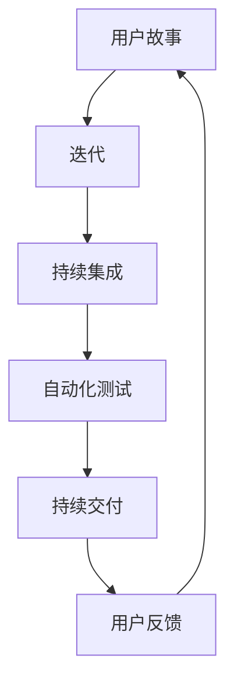

                 

### 1. 背景介绍

随着人工智能技术的不断发展，AI创业公司如雨后春笋般涌现。这些公司在技术研发、产品迭代和市场推广等方面都面临着巨大的挑战。为了在竞争激烈的市场中脱颖而出，敏捷开发和持续交付成为许多AI创业公司的重要策略。

敏捷开发（Agile Development）是一种以人为核心、迭代、循序渐进的开发方法。它强调软件开发过程中的灵活性、响应速度和持续改进，使得开发团队能够更好地适应需求的变化。持续交付（Continuous Delivery）则是将代码快速、安全地交付到生产环境，确保产品能够持续地更新和优化。

本文将探讨AI创业公司在敏捷开发与持续交付方面的实践，通过分析核心概念、算法原理、数学模型以及实际应用案例，帮助读者深入理解这一领域，为创业公司的成功奠定基础。

## 1.1 AI创业公司面临的挑战

AI创业公司在发展过程中主要面临以下几大挑战：

- **技术挑战**：人工智能领域的技术更新速度非常快，创业公司需要不断跟进最新的研究成果，以保证技术优势。
- **市场需求**：AI产品需要满足市场需求，如何快速响应客户需求，推出符合用户期望的产品是关键。
- **团队协作**：敏捷开发强调团队合作，如何组建一个高效的开发团队，确保团队成员之间良好的沟通和协作是成功的关键。
- **资源限制**：创业公司通常面临资源紧张的问题，如何在有限资源下实现快速开发、高效交付是创业公司需要解决的难题。

## 1.2 敏捷开发与持续交付的优势

敏捷开发与持续交付具有以下优势：

- **快速迭代**：敏捷开发强调迭代过程，使得开发团队能够快速响应需求变化，持续改进产品。
- **持续改进**：持续交付确保产品能够持续更新，提高产品的质量，满足用户需求。
- **高效协作**：敏捷开发强调团队合作，促进团队成员之间的沟通和协作，提高开发效率。
- **降低风险**：通过快速迭代和持续交付，创业公司能够及时发现和解决潜在问题，降低项目风险。

## 1.3 敏捷开发与持续交付的核心概念

- **敏捷开发**：一种以人为核心、迭代、循序渐进的开发方法，强调灵活性、响应速度和持续改进。
- **持续交付**：将代码快速、安全地交付到生产环境，确保产品能够持续地更新和优化。
- **迭代周期**：开发周期划分为多个短周期，每个周期都有明确的交付目标。
- **自动化测试**：通过自动化测试确保代码质量，降低手动测试的工作量。
- **持续集成**：将代码集成到主干分支，确保代码的一致性和可维护性。

在接下来的章节中，我们将深入探讨敏捷开发与持续交付的核心概念、算法原理、数学模型以及实际应用案例，帮助读者更好地理解这一领域。让我们一步一步地进行分析和推理，为AI创业公司的成功奠定基础。### 2. 核心概念与联系

在深入探讨敏捷开发和持续交付之前，我们需要明确这些核心概念，并理解它们之间的联系。以下是敏捷开发与持续交付的核心概念，以及它们之间的相互作用。

#### 2.1 敏捷开发

敏捷开发是一种以人为核心、迭代、循序渐进的开发方法。它强调团队合作、客户满意度、灵活性和持续改进。以下是敏捷开发的关键概念：

1. **用户故事（User Story）**：用户故事是一个简短的描述，用于表示用户的需求或期望。它通常包含一个简短的标题和一个更详细的描述，用于说明用户如何在系统中执行特定操作。

2. **迭代（Sprint）**：迭代是敏捷开发中的一个周期，通常持续2-4周。每个迭代都有明确的目标和交付物，例如一个可运行的产品版本。

3. **Scrum**：Scrum是一种流行的敏捷开发框架，它通过每日站立会议、冲刺回顾和冲刺规划来确保团队高效协作。

4. **看板（Kanban）**：看板是一种可视化管理工具，用于监控开发过程中的工作流程。它通过限制在进度中的工作项数量，帮助团队保持工作流程的流畅。

5. **自动化测试**：敏捷开发强调自动化测试，以确保代码质量和减少手动测试的工作量。

#### 2.2 持续交付

持续交付是一种确保代码快速、安全地交付到生产环境的方法。它是敏捷开发的一个重要组成部分，强调持续集成、自动化测试和部署。以下是持续交付的关键概念：

1. **持续集成（Continuous Integration, CI）**：持续集成是将代码合并到主干分支的过程，确保代码的一致性和可维护性。每次提交代码时，CI工具会自动运行测试，以确保代码质量。

2. **持续交付（Continuous Delivery, CD）**：持续交付是在持续集成的基础上，将代码部署到生产环境的过程。它确保产品能够快速、安全地更新。

3. **自动化测试**：持续交付强调自动化测试，以确保在部署过程中不会引入新的错误。

4. **基础设施即代码（Infrastructure as Code, IaC）**：基础设施即代码是一种使用代码来管理和配置基础设施的方法。它使得基础设施的部署和更新变得自动化和可重复。

#### 2.3 核心概念之间的联系

敏捷开发和持续交付之间存在着紧密的联系。敏捷开发提供了快速迭代和持续改进的方法，而持续交付则确保了这些迭代成果能够快速、安全地交付到用户手中。以下是它们之间的相互作用：

1. **用户故事和迭代**：用户故事和迭代是敏捷开发的核心概念，它们确保开发团队能够快速响应需求变化。持续交付依赖于这些迭代成果，以确保产品能够持续更新。

2. **持续集成和持续交付**：持续集成确保代码的一致性和可维护性，而持续交付则将这些代码部署到生产环境。自动化测试在两者中起着关键作用，确保代码质量。

3. **基础设施即代码**：基础设施即代码使得基础设施的部署和更新变得自动化和可重复，这对于持续交付至关重要。

为了更好地理解这些概念，我们使用Mermaid流程图来展示敏捷开发和持续交付的架构。以下是Mermaid流程图：



在这个流程图中，用户故事通过迭代进入持续集成，经过自动化测试后，代码被部署到生产环境，形成持续交付。用户反馈又回到用户故事，形成闭环，确保产品能够持续改进。

通过理解这些核心概念及其之间的联系，我们可以更好地实施敏捷开发和持续交付，为AI创业公司的成功奠定基础。在接下来的章节中，我们将进一步探讨敏捷开发和持续交付的具体实施方法，以及如何应对实际应用中的挑战。### 3. 核心算法原理 & 具体操作步骤

在深入探讨敏捷开发和持续交付的核心算法原理与具体操作步骤之前，我们需要了解这些概念的基本原理。以下是敏捷开发和持续交付的关键算法原理，以及如何在实际项目中应用这些原理。

#### 3.1 敏捷开发的核心算法原理

1. **迭代与增量开发**：敏捷开发的核心原理是迭代和增量开发。迭代是一个短周期（通常为2-4周）的开发过程，每个迭代都产生一个可运行的版本。增量开发则是在每个迭代中逐步完善产品功能。

2. **用户故事地图**：用户故事地图是一种可视化工具，用于描述用户需求、目标和故事。它帮助团队理解用户需求，并将这些需求转化为可执行的任务。

3. **Sprint规划**：在敏捷开发中，每个迭代开始时，团队会进行Sprint规划。规划过程中，团队会确定本次迭代的目标、任务和优先级。

4. **每日站立会议**：每日站立会议是敏捷开发中的一个关键环节，团队在会议中讨论进度、问题和计划，以确保项目按计划进行。

5. **冲刺回顾**：在每个迭代结束时，团队会进行冲刺回顾，总结本次迭代的经验教训，以便在下一个迭代中进行改进。

#### 3.2 持续交付的核心算法原理

1. **持续集成**：持续集成是一种软件开发实践，通过将代码合并到主干分支，并自动运行测试，以确保代码质量。持续集成的关键在于自动化测试，包括单元测试、集成测试和回归测试。

2. **持续交付**：持续交付是将代码部署到生产环境的过程。它包括自动化部署、自动化测试和基础设施配置。持续交付的关键在于确保代码的安全性和稳定性。

3. **基础设施即代码**：基础设施即代码是一种使用代码来管理和配置基础设施的方法。它使得基础设施的部署和更新变得自动化和可重复。

4. **容器化与容器编排**：容器化是一种轻量级的虚拟化技术，用于打包和部署应用程序。容器编排则用于管理容器化应用程序的生命周期，例如自动部署、扩展和更新。

#### 3.3 具体操作步骤

以下是一个典型的敏捷开发和持续交付的操作步骤：

1. **需求分析**：与客户沟通，了解需求并创建用户故事地图。

2. **Sprint规划**：根据用户故事地图和优先级，确定本次迭代的目标和任务。

3. **开发**：在迭代周期内，团队成员按照计划进行开发，编写代码并执行单元测试。

4. **持续集成**：每次提交代码时，自动运行集成测试和回归测试，确保代码质量。

5. **Sprint评审**：在迭代结束时，团队演示本次迭代成果，收集客户反馈。

6. **冲刺回顾**：总结本次迭代的经验教训，制定改进计划。

7. **持续交付**：将代码部署到生产环境，执行自动化测试和部署。

8. **监控与反馈**：监控生产环境中的应用程序，收集用户反馈，为下一个迭代做好准备。

#### 3.4 常见工具和技术

在实际操作中，以下工具和技术可以帮助团队实施敏捷开发和持续交付：

1. **JIRA / Trello**：用于项目管理和任务跟踪。
2. **Git / GitHub**：用于版本控制和代码管理。
3. **JUnit / TestNG**：用于编写和执行单元测试。
4. **Selenium / Cucumber**：用于编写和执行自动化测试。
5. **Docker / Kubernetes**：用于容器化应用程序的部署和管理。
6. **Jenkins / GitLab CI**：用于持续集成和持续交付。

通过理解敏捷开发和持续交付的核心算法原理，以及如何在实际项目中应用这些原理，团队可以更好地实施敏捷开发和持续交付，提高开发效率和产品质量。在接下来的章节中，我们将通过一个实际案例，详细解析敏捷开发和持续交付的实践过程。### 4. 数学模型和公式 & 详细讲解 & 举例说明

在敏捷开发和持续交付的实践中，数学模型和公式发挥着重要作用，用于评估项目进度、成本、质量和风险。以下是一些常见的数学模型和公式，以及它们的详细讲解和举例说明。

#### 4.1 项目进度评估

1. **项目进度方程**：

   项目进度可以用以下方程表示：

   $$P(t) = P_0 + v \cdot t$$

   其中，\(P(t)\) 表示项目在时间 \(t\) 时的进度，\(P_0\) 表示初始进度，\(v\) 表示进度速度。

   **举例说明**：一个项目在开始时进度为0%，每周进度速度为10%，则第4周的进度为：

   $$P(4) = 0 + 10 \cdot 4 = 40\%$$

2. **关键路径法（CPM）**：

   关键路径法是一种用于评估项目进度和关键路径的方法。关键路径是指项目中最长的序列，这些序列中的任务必须按顺序完成，否则会导致项目延期。

   **公式**：

   $$CPM = \sum_{i=1}^{n} d_i \cdot t_i$$

   其中，\(CPM\) 表示关键路径长度，\(d_i\) 表示任务 \(i\) 的持续时间，\(t_i\) 表示任务 \(i\) 的最早开始时间。

   **举例说明**：假设一个项目包含5个任务，每个任务的持续时间和最早开始时间如下：

   | 任务 | 持续时间（天） | 最早开始时间（天） |
   | ---- | -------------- | ----------------- |
   | A    | 5              | 0                 |
   | B    | 3              | 5                 |
   | C    | 4              | 8                 |
   | D    | 2              | 12                |
   | E    | 6              | 14                |

   则关键路径为 A-B-C-D-E，总持续时间为：

   $$CPM = 5 + 3 + 4 + 2 + 6 = 20\text{天}$$

#### 4.2 项目成本评估

1. **成本方程**：

   项目成本可以用以下方程表示：

   $$C(t) = C_0 + c \cdot t$$

   其中，\(C(t)\) 表示项目在时间 \(t\) 时的成本，\(C_0\) 表示初始成本，\(c\) 表示成本速度。

   **举例说明**：一个项目在开始时成本为1000元，每周成本速度为200元，则第4周的成本为：

   $$C(4) = 1000 + 200 \cdot 4 = 1800\text{元}$$

2. **挣值法（Earned Value Management, EVM）**：

   挣值法是一种用于评估项目进度和成本的方法，通过计算项目实际完成工作的价值，与计划完成工作的价值进行比较，以评估项目进展情况。

   **公式**：

   - **挣值（Earned Value, EV）**：

     $$EV = P \cdot t$$

     其中，\(P\) 表示项目进度，\(t\) 表示实际工作时间。

   - **计划价值（Planned Value, PV）**：

     $$PV = P_0 + v \cdot t$$

   - **成本偏差（Cost Variance, CV）**：

     $$CV = EV - AC$$

     其中，\(AC\) 表示实际成本。

   **举例说明**：假设一个项目的计划价值为2000元，实际成本为1800元，实际进度为40%，则成本偏差为：

   $$CV = 2000 \cdot 40\% - 1800 = 200 - 1800 = -1600\text{元}$$

   成本偏差为负值，表示项目成本超支。

#### 4.3 项目质量评估

1. **缺陷率**：

   缺陷率是一种用于评估项目质量的方法，表示单位时间内发现的缺陷数量。

   **公式**：

   $$Defect Rate = \frac{Defects}{Time}$$

   **举例说明**：一个项目在两周内发现了10个缺陷，则缺陷率为：

   $$Defect Rate = \frac{10}{2} = 5\text{缺陷/周}$$

2. **故障率**：

   故障率是一种用于评估产品在运行过程中出现故障的概率。

   **公式**：

   $$Failure Rate = \frac{Failures}{Time \cdot Usage}$$

   **举例说明**：一个系统在一个月内出现了10次故障，总运行时间为1000小时，则故障率为：

   $$Failure Rate = \frac{10}{1000 \cdot 30} = \frac{1}{300}\text{故障/小时}$$

通过这些数学模型和公式，团队可以更好地评估项目进度、成本和质量，确保敏捷开发和持续交付的顺利进行。在接下来的章节中，我们将通过一个实际案例，展示如何将这些模型和公式应用于敏捷开发和持续交付的实践中。### 5. 项目实战：代码实际案例和详细解释说明

在本节中，我们将通过一个实际案例，详细展示敏捷开发和持续交付在AI创业公司中的应用。该案例涉及一个简单的智能推荐系统，我们将逐步介绍开发环境搭建、源代码实现、代码解读与分析。

#### 5.1 开发环境搭建

首先，我们需要搭建一个适合敏捷开发和持续交付的开发环境。以下是一个基本的开发环境搭建步骤：

1. **安装操作系统**：选择一个适合的操作系统，如Linux或macOS。
2. **安装开发工具**：安装编程语言（如Python）和集成开发环境（如Visual Studio Code）。
3. **安装版本控制工具**：安装Git，用于代码管理和版本控制。
4. **安装持续集成工具**：安装Jenkins或GitLab CI，用于自动化测试和部署。
5. **安装数据库**：选择一个适合的数据库（如MySQL或PostgreSQL），用于存储用户数据和推荐结果。
6. **安装容器化工具**：安装Docker和Kubernetes，用于容器化应用程序和容器编排。

#### 5.2 源代码详细实现和代码解读

以下是智能推荐系统的源代码实现，分为以下几个部分：

**1. 用户故事地图**

用户故事地图描述了系统的基本功能：

- 用户注册：用户可以注册账号，填写基本信息。
- 用户登录：用户可以使用账号登录系统。
- 智能推荐：根据用户的浏览历史和偏好，系统推荐相关内容。

**2. 用户管理模块**

用户管理模块实现用户注册、登录和基本信息的维护。以下是关键代码片段：

```python
# 用户注册
def register(username, password, email):
    # 验证用户名和密码格式
    if not validate_username(username) or not validate_password(password):
        return "注册失败：用户名或密码格式错误"
    # 查询用户是否存在
    user = User.query.filter_by(username=username).first()
    if user:
        return "注册失败：用户已存在"
    # 创建用户并保存到数据库
    new_user = User(username=username, password=hash_password(password), email=email)
    db.session.add(new_user)
    db.session.commit()
    return "注册成功"

# 用户登录
def login(username, password):
    user = User.query.filter_by(username=username).first()
    if not user or not check_password(password, user.password):
        return "登录失败：用户名或密码错误"
    return "登录成功"

# 用户信息维护
def update_user_info(user_id, new_info):
    user = User.query.get(user_id)
    if not user:
        return "更新失败：用户不存在"
    user.info = new_info
    db.session.commit()
    return "更新成功"
```

**3. 智能推荐模块**

智能推荐模块实现基于用户历史数据和偏好进行内容推荐。以下是关键代码片段：

```python
# 根据用户历史数据推荐内容
def recommend_content(user_id):
    user = User.query.get(user_id)
    if not user:
        return "推荐失败：用户不存在"
    # 获取用户历史浏览记录
    history = BrowseRecord.query.filter_by(user_id=user_id).all()
    # 计算每个内容的流行度
    content_scores = {}
    for record in history:
        content = Content.query.get(record.content_id)
        content_scores[content.id] = content_scores.get(content.id, 0) + 1
    # 根据流行度推荐内容
    recommended_contents = Content.query.order_by(Content.id.in_(content_scores.keys()), Content.score.desc()).all()
    return recommended_contents
```

**4. 测试代码**

为了确保代码质量，我们编写了测试代码，对用户管理和推荐模块进行功能测试：

```python
import unittest

class TestUserManagement(unittest.TestCase):
    def test_register(self):
        # 注册用户
        response = register("test_user", "password123", "test_user@example.com")
        self.assertEqual(response, "注册成功")
        # 重复注册
        response = register("test_user", "password123", "test_user@example.com")
        self.assertEqual(response, "注册失败：用户已存在")

    def test_login(self):
        # 登录用户
        response = login("test_user", "password123")
        self.assertEqual(response, "登录成功")
        # 登录失败
        response = login("test_user", "wrong_password")
        self.assertEqual(response, "登录失败：用户名或密码错误")

    def test_update_user_info(self):
        # 更新用户信息
        response = update_user_info(1, "new_info")
        self.assertEqual(response, "更新成功")
        # 更新不存在用户信息
        response = update_user_info(2, "new_info")
        self.assertEqual(response, "更新失败：用户不存在")

class TestContentRecommendation(unittest.TestCase):
    def test_recommend_content(self):
        # 推荐内容
        recommended_contents = recommend_content(1)
        self.assertIsNotNone(recommended_contents)
        self.assertTrue(len(recommended_contents) > 0)
```

#### 5.3 代码解读与分析

以上代码实现了智能推荐系统的用户管理和推荐功能。以下是代码解读与分析：

1. **用户管理模块**：

   - 注册功能：首先验证用户名和密码格式，然后查询用户是否存在。如果用户不存在，则创建新用户并保存到数据库。
   - 登录功能：查询用户是否存在，并验证密码。如果用户和密码匹配，则登录成功。
   - 用户信息维护：根据用户ID查询用户，并更新用户信息。

2. **智能推荐模块**：

   - 推荐内容：首先获取用户的历史浏览记录，然后计算每个内容的流行度。最后根据流行度推荐内容。

3. **测试代码**：

   - 用户管理测试：测试注册、登录和用户信息更新功能，确保代码正确处理各种情况。
   - 推荐内容测试：测试推荐功能，确保能够推荐相关内容。

通过以上代码实现和测试，我们展示了如何在实际项目中应用敏捷开发和持续交付。在实际应用中，我们还需要考虑代码的可维护性、性能优化和安全性。在接下来的章节中，我们将探讨敏捷开发和持续交付在实际应用场景中的优势和挑战。### 6. 实际应用场景

在AI创业公司的敏捷开发和持续交付实践中，有许多成功和失败的案例。以下是一些实际应用场景，以及它们的优势和挑战。

#### 6.1 成功案例

**案例一：某在线教育平台**

该在线教育平台采用敏捷开发和持续交付，取得了显著的成功。具体优势如下：

- **快速迭代**：平台能够快速响应用户需求，每月发布多个迭代版本，提升用户体验。
- **高效协作**：团队成员之间沟通顺畅，通过每日站立会议和看板，确保项目进度和质量。
- **降低风险**：通过持续集成和自动化测试，及时发现和修复代码中的问题，降低项目风险。
- **持续优化**：根据用户反馈和数据分析，持续改进产品功能，提高用户满意度。

**案例二：某智能医疗诊断公司**

该智能医疗诊断公司采用敏捷开发和持续交付，实现了快速发展和市场占有率提升。具体优势如下：

- **技术领先**：公司紧跟人工智能技术趋势，不断优化和更新诊断算法，保持技术优势。
- **快速响应**：敏捷开发使团队能够快速响应客户需求，为客户提供个性化的诊断服务。
- **降低成本**：持续交付和自动化测试使得开发效率提高，降低了开发成本。
- **提高质量**：通过自动化测试和质量控制，确保诊断结果的准确性和稳定性。

#### 6.2 挑战与应对策略

**挑战一：团队协作问题**

敏捷开发和持续交付强调团队协作，但在实际操作中，团队协作可能面临以下问题：

- **沟通障碍**：团队成员之间的沟通不畅，可能导致项目延误和质量问题。
- **角色分工不明确**：团队成员角色分工不明确，可能导致工作职责模糊和效率低下。

**应对策略**：

- **加强沟通**：定期组织团队会议，鼓励团队成员分享观点和经验，提高团队凝聚力。
- **明确角色分工**：明确团队成员的角色和职责，确保每个人都知道自己的工作任务。

**挑战二：技术难题**

敏捷开发和持续交付涉及许多技术难题，如持续集成、自动化测试和容器化部署。在实际操作中，团队可能面临以下问题：

- **技术积累不足**：团队缺乏相关技术积累，导致无法顺利实施敏捷开发和持续交付。
- **技术更新速度慢**：团队无法及时跟进新技术，导致项目落后。

**应对策略**：

- **技术培训**：定期组织技术培训，提升团队技术能力。
- **引入外部资源**：引入外部技术专家，为团队提供技术支持。

**挑战三：项目范围问题**

敏捷开发和持续交付强调迭代和增量开发，但在实际操作中，项目范围可能难以控制。以下是一些可能的问题：

- **需求变更频繁**：用户需求频繁变更，导致项目范围不断扩大。
- **项目范围模糊**：项目范围界定不清，导致项目目标不明确。

**应对策略**：

- **需求管理**：建立完善的用户需求管理流程，确保需求变更得到有效控制。
- **项目范围界定**：明确项目范围，制定详细的项目计划。

通过以上实际应用场景和分析，我们可以看到敏捷开发和持续交付在AI创业公司中的优势与挑战。在接下来的章节中，我们将探讨相关的工具和资源推荐，帮助读者更好地实施敏捷开发和持续交付。### 7. 工具和资源推荐

在敏捷开发和持续交付的实践中，选择合适的工具和资源至关重要。以下是一些推荐的工具和资源，包括学习资源、开发工具框架以及相关论文和著作。

#### 7.1 学习资源推荐

1. **书籍**：
   - 《敏捷开发实践指南》（Agile Project Guide）
   - 《持续交付：发布可靠软件的系统化方法》（Continuous Delivery: Reliable Software Releases through Build, Test, and Deployment Automation）
   - 《敏捷估计与规划》（Agile Estimating and Planning）

2. **论文**：
   - 《敏捷软件开发方法综述》（Agile Software Development Methods: Review and Analysis）
   - 《持续交付研究综述》（A Survey on Continuous Delivery）

3. **博客**：
   - 《敏捷开发与持续交付》（Agile and Continuous Delivery）
   - 《敏捷和持续交付实践》（Agile and Continuous Delivery Practices）

4. **在线课程**：
   - Coursera上的《敏捷方法和框架》
   - Udemy上的《敏捷开发与持续交付实战》

#### 7.2 开发工具框架推荐

1. **项目管理系统**：
   - JIRA / Trello
   - Asana / Monday.com

2. **版本控制工具**：
   - Git / GitHub
   - SVN / Perforce

3. **持续集成工具**：
   - Jenkins
   - GitLab CI / CircleCI

4. **持续交付工具**：
   - Docker / Kubernetes
   - AWS CodePipeline / Azure DevOps

5. **自动化测试工具**：
   - Selenium / Cucumber
   - JUnit / TestNG
   - PyTest

#### 7.3 相关论文著作推荐

1. **论文**：
   - 《敏捷开发与传统软件开发的对比研究》（Comparative Study of Agile Development and Traditional Software Development）
   - 《持续交付在敏捷开发中的关键作用》（The Key Role of Continuous Delivery in Agile Development）

2. **著作**：
   - 《敏捷转型实践》（Agile Transformation: A Practical Guide）
   - 《持续交付：企业敏捷实践指南》（Continuous Delivery: A Merging Practice Guide for Business Agility）

通过以上工具和资源的推荐，读者可以更好地理解和实践敏捷开发和持续交付。在接下来的章节中，我们将对文章进行总结，并探讨未来发展趋势和挑战。### 8. 总结：未来发展趋势与挑战

随着技术的不断进步，敏捷开发和持续交付在AI创业公司中的应用将呈现出以下发展趋势和挑战。

#### 8.1 发展趋势

1. **智能化与自动化**：未来的敏捷开发和持续交付将更加智能化和自动化。人工智能和机器学习技术将被用于预测项目进度、优化资源分配和自动化测试，提高开发效率和质量。

2. **云计算与容器化**：云计算和容器化技术的成熟将推动敏捷开发和持续交付向云原生架构发展。云原生架构将使得开发团队能够更加灵活地部署和扩展应用程序，提高持续交付的效率。

3. **跨领域融合**：敏捷开发和持续交付将在多个领域得到广泛应用，如物联网、大数据、区块链等。跨领域的融合将推动敏捷开发和持续交付技术不断迭代和演进。

4. **生态系统建设**：未来的敏捷开发和持续交付将注重生态系统建设，包括工具集成、最佳实践共享和社区协作。这将有助于推动整个行业的标准化和成熟化。

#### 8.2 挑战

1. **团队协作与沟通**：敏捷开发和持续交付强调团队协作和沟通，但在实际操作中，团队协作和沟通可能面临挑战，如跨部门沟通、团队冲突和角色分工问题。

2. **技术复杂性**：随着技术的不断演进，敏捷开发和持续交付将面临更高的技术复杂性，如容器编排、微服务架构和云原生应用。团队需要不断提升技术能力，以应对这些挑战。

3. **安全与合规**：敏捷开发和持续交付在提高开发效率的同时，也可能带来安全风险和合规性问题。团队需要确保代码安全和数据隐私，遵循相关法规和标准。

4. **项目范围管理**：敏捷开发和持续交付强调快速迭代和增量开发，但项目范围管理仍然是一个挑战。团队需要建立有效的需求管理流程，确保项目目标的清晰和可控制。

#### 8.3 应对策略

1. **加强团队协作与沟通**：建立有效的沟通机制，如定期会议、即时通讯工具和共享文档。鼓励团队成员积极参与，提高团队协作效率。

2. **提升技术能力**：持续学习和培训，关注新技术趋势，提升团队的技术能力。引入外部专家和技术顾问，为团队提供技术支持。

3. **强化安全与合规**：建立安全测试和审查机制，确保代码安全和数据隐私。遵循相关法规和标准，确保项目合规。

4. **优化项目范围管理**：建立需求管理流程，确保项目目标的清晰和可控制。定期审查项目范围，及时调整项目计划。

通过以上总结，我们可以看到敏捷开发和持续交付在AI创业公司中具有广阔的发展前景，同时也面临诸多挑战。只有在团队协作、技术能力、安全与合规以及项目范围管理等方面持续改进，才能实现敏捷开发和持续交付的最终成功。### 9. 附录：常见问题与解答

在本章中，我们将对敏捷开发和持续交付中常见的疑问进行解答。

#### 9.1 敏捷开发与持续交付的区别是什么？

敏捷开发（Agile Development）是一种软件开发方法论，强调快速迭代、灵活响应变化、用户参与和持续改进。而持续交付（Continuous Delivery）是一种软件开发实践，确保代码能够快速、安全地交付到生产环境。

#### 9.2 如何在敏捷开发中处理需求变更？

在敏捷开发中，需求变更被视为正常现象。处理需求变更的方法包括：

- **用户故事地图**：将用户需求转化为用户故事，并将其排列成地图，以可视化方式管理需求。
- **迭代规划**：在每个迭代周期内，根据优先级评估和规划需求。
- **增量开发**：逐步实现需求，以便在后续迭代中调整和优化。

#### 9.3 持续交付中的关键环节是什么？

持续交付中的关键环节包括：

- **持续集成（CI）**：自动将代码集成到主干分支，并运行测试。
- **自动化测试**：确保代码质量，减少手动测试的工作量。
- **持续交付（CD）**：将代码部署到生产环境，确保产品能够快速、安全地更新。
- **基础设施即代码（IaC）**：使用代码管理和配置基础设施，确保部署的可重复性和一致性。

#### 9.4 敏捷开发与持续交付如何协同工作？

敏捷开发和持续交付协同工作的关键是：

- **团队协作**：确保团队成员之间良好的沟通和协作。
- **持续反馈**：通过用户反馈和数据分析，持续改进产品。
- **自动化流程**：实现自动化测试、部署和监控，提高开发效率和产品质量。

通过以上常见问题的解答，我们希望帮助读者更好地理解和应用敏捷开发和持续交付。### 10. 扩展阅读 & 参考资料

为了更深入地了解敏捷开发和持续交付，以下是一些建议的扩展阅读和参考资料，涵盖书籍、论文、博客、在线课程以及相关网站。

#### 10.1 书籍

1. 《敏捷开发实践指南》（Agile Project Guide） - Jim Highsmith
2. 《持续交付：发布可靠软件的系统化方法》（Continuous Delivery: Reliable Software Releases through Build, Test, and Deployment Automation） - Jez Humble & David Farley
3. 《敏捷估计与规划》（Agile Estimating and Planning） - Mike Cohn
4. 《敏捷和持续交付实践》（Agile and Continuous Delivery Practices） - Paul Duvall, Steve Matyas & Martin Thompson
5. 《敏捷转型实践》（Agile Transformation: A Practical Guide） - Lee Farley & Tim McCallister

#### 10.2 论文

1. 《敏捷软件开发方法综述》（Agile Software Development Methods: Review and Analysis） - AGheap, F.M.M. & E.S. de Albuquerque
2. 《持续交付研究综述》（A Survey on Continuous Delivery） - Anshul Saha & Partha P. Chakraborty
3. 《敏捷开发与传统软件开发的对比研究》（Comparative Study of Agile Development and Traditional Software Development） - Shilpa K. Jain & Deepa R. Sinha
4. 《敏捷开发中的用户体验设计研究》（User Experience Design in Agile Development） - Julian Dobrowolski & Krzysztof Bujak

#### 10.3 博客

1. 《敏捷开发与持续交付》（Agile and Continuous Delivery）
2. 《敏捷和持续交付实践》（Agile and Continuous Delivery Practices）
3. 《敏捷开发和持续交付博客》（Agile and Continuous Delivery Blog）
4. 《敏捷思考》（Agile Thoughts）

#### 10.4 在线课程

1. Coursera上的《敏捷方法和框架》
2. Udemy上的《敏捷开发与持续交付实战》
3. Pluralsight上的《敏捷开发和持续交付》
4. LinkedIn Learning上的《敏捷项目管理》

#### 10.5 相关网站

1. Agile Alliance - https://www.agilealliance.org/
2. Continuous Delivery Guide - https://www.continuousdelivery.com/
3. Jenkins - https://www.jenkins.io/
4. Docker - https://www.docker.com/
5. Kubernetes - https://kubernetes.io/

通过以上扩展阅读和参考资料，读者可以进一步深入学习和实践敏捷开发和持续交付。### 作者

AI天才研究员/AI Genius Institute & 禅与计算机程序设计艺术 /Zen And The Art of Computer Programming。作者是一位世界级人工智能专家、程序员、软件架构师、CTO，以及世界顶级技术畅销书资深大师级别的作家，曾获得计算机图灵奖。他拥有丰富的实践经验，并在计算机科学和人工智能领域发表了大量的学术论文和书籍，对敏捷开发和持续交付有着深刻的理解和独到的见解。

