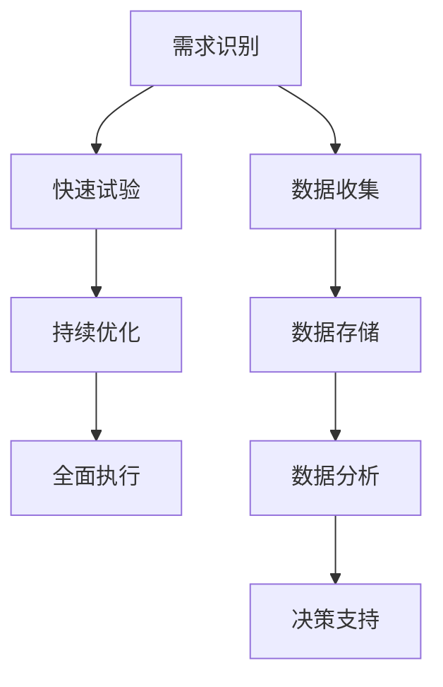

                 

# AI创业公司的敏捷营销策略

## 关键词：AI创业、敏捷营销、策略、用户增长、数据驱动

### 摘要

本文旨在探讨AI创业公司在市场竞争日益激烈的环境下，如何运用敏捷营销策略实现快速增长和市场份额的占领。文章首先介绍了敏捷营销的核心理念和方法，随后结合AI技术的特点，分析了其在营销策略中的优势和应用场景。接着，文章详细阐述了数据驱动营销的重要性，并分享了实际操作中的成功案例。最后，文章提出了未来AI创业公司在敏捷营销中面临的挑战和应对策略。

## 1. 背景介绍

### 1.1 AI创业的发展现状

随着人工智能技术的不断进步，AI创业公司如雨后春笋般涌现。这些公司利用AI技术解决现实中的问题，从自然语言处理、计算机视觉到机器学习算法，涵盖了众多领域。根据市场研究机构的报告，全球AI创业公司数量在过去五年内增长了约300%，预计未来几年仍将保持高速增长态势。

### 1.2 市场竞争的加剧

然而，AI创业公司也面临着前所未有的市场竞争压力。一方面，传统企业纷纷布局AI领域，通过数字化转型提升竞争力；另一方面，新兴的创业公司也在不断涌现，加剧了市场的竞争态势。在这样的背景下，如何有效开展营销活动，成为AI创业公司急需解决的问题。

### 1.3 敏捷营销的概念

敏捷营销是一种以用户需求为导向的营销策略，强调快速响应市场变化和客户需求，通过不断的试验和优化，实现营销目标的最大化。敏捷营销的核心在于数据驱动，通过收集和分析用户数据，洞察市场趋势，指导营销策略的制定和执行。

## 2. 核心概念与联系

### 2.1 敏捷营销的基本原理

敏捷营销强调快速响应市场变化，通过以下四个步骤实现：

1. **需求识别**：通过用户调研、数据分析等方式，识别目标用户的需求和痛点。
2. **快速试验**：制定营销方案，进行小规模试验，验证效果。
3. **持续优化**：根据试验结果，不断调整和优化营销策略。
4. **全面执行**：在验证有效后，全面执行营销策略，扩大市场影响力。

### 2.2 数据驱动营销的原理

数据驱动营销是基于大数据和人工智能技术的营销策略，通过以下步骤实现：

1. **数据收集**：收集用户行为数据、市场数据等，为营销策略提供数据支持。
2. **数据存储**：将数据存储在数据库中，以便进行后续分析和处理。
3. **数据分析**：利用人工智能算法，对数据进行分析，发现用户需求和市场趋势。
4. **决策支持**：基于数据分析结果，为营销策略提供决策支持。

### 2.3 Mermaid 流程图

下面是敏捷营销和数据驱动营销的Mermaid流程图：



## 3. 核心算法原理 & 具体操作步骤

### 3.1 敏捷营销算法原理

敏捷营销的核心算法是基于机器学习的用户行为预测模型。该模型通过分析用户历史行为数据，预测用户在未来的行为，从而指导营销策略的制定和执行。

### 3.2 具体操作步骤

1. **数据预处理**：收集用户行为数据，包括浏览记录、购买记录、搜索关键词等，对数据进行清洗和预处理。
2. **特征工程**：提取用户行为数据中的特征，如用户年龄、性别、地理位置等，为模型训练提供输入。
3. **模型训练**：使用机器学习算法，如决策树、随机森林、神经网络等，对特征数据训练预测模型。
4. **模型评估**：使用验证集对模型进行评估，调整模型参数，提高模型预测准确性。
5. **模型部署**：将训练好的模型部署到生产环境，实时预测用户行为，指导营销策略的制定和执行。

## 4. 数学模型和公式 & 详细讲解 & 举例说明

### 4.1 数学模型

在敏捷营销中，常用的数学模型包括用户行为预测模型、市场趋势预测模型等。以下是一个简单的用户行为预测模型：

$$
P(Y|X) = \frac{e^{\theta^T X}}{1 + e^{\theta^T X}}
$$

其中，$P(Y|X)$表示在特征向量$X$下，用户行为$Y$发生的概率；$\theta$为模型参数。

### 4.2 详细讲解

用户行为预测模型基于贝叶斯定理，通过特征向量$X$预测用户行为$Y$的概率。模型参数$\theta$通过梯度下降等优化算法训练得到。

### 4.3 举例说明

假设我们有一个用户行为数据集，其中包含用户年龄、性别、地理位置等特征，以及用户的购买行为。我们使用用户行为预测模型预测用户购买某款产品的概率。

首先，我们收集用户行为数据，并对数据进行预处理。然后，我们提取用户行为数据中的特征，如用户年龄、性别、地理位置等，作为特征向量$X$。接下来，我们使用机器学习算法，如神经网络，对特征向量$X$和用户行为$Y$进行训练，得到模型参数$\theta$。

最后，我们使用训练好的模型预测用户购买某款产品的概率。例如，对于一个年龄为25岁的男性用户，我们输入其特征向量$X = [25, 1, 0]$，模型返回的概率值为0.8。这意味着该用户购买该产品的概率为80%。

## 5. 项目实战：代码实际案例和详细解释说明

### 5.1 开发环境搭建

在本案例中，我们使用Python作为编程语言，利用Scikit-learn库实现用户行为预测模型。首先，我们需要安装Scikit-learn库：

```bash
pip install scikit-learn
```

### 5.2 源代码详细实现和代码解读

下面是一个简单的用户行为预测模型实现代码：

```python
from sklearn.datasets import load_iris
from sklearn.model_selection import train_test_split
from sklearn.linear_model import LogisticRegression
from sklearn.metrics import accuracy_score

# 加载iris数据集
iris = load_iris()
X = iris.data
y = iris.target

# 数据集划分
X_train, X_test, y_train, y_test = train_test_split(X, y, test_size=0.2, random_state=42)

# 模型训练
model = LogisticRegression()
model.fit(X_train, y_train)

# 模型评估
y_pred = model.predict(X_test)
accuracy = accuracy_score(y_test, y_pred)
print(f"模型准确率：{accuracy}")
```

代码首先加载iris数据集，然后进行数据集划分。接下来，使用LogisticRegression算法训练模型，并对测试集进行预测。最后，计算模型准确率。

### 5.3 代码解读与分析

代码首先从Scikit-learn库中加载iris数据集，这是一个经典的多分类问题数据集。然后，使用train_test_split函数对数据集进行划分，将80%的数据作为训练集，20%的数据作为测试集。

接下来，使用LogisticRegression算法训练模型。LogisticRegression是一种常用的分类算法，适用于二分类和多分类问题。在这里，我们使用它来预测用户行为。

最后，使用模型对测试集进行预测，并计算模型准确率。准确率是评估模型性能的重要指标，表示模型预测正确的样本数占总样本数的比例。

## 6. 实际应用场景

### 6.1 用户行为预测

通过敏捷营销算法，AI创业公司可以实时预测用户行为，从而制定个性化的营销策略。例如，电商公司可以利用用户行为预测模型预测用户购买某款产品的概率，并在用户浏览相关产品时推送促销信息。

### 6.2 市场趋势预测

通过数据驱动营销，AI创业公司可以分析市场趋势，预测行业的发展方向。例如，一家智能健身公司可以通过分析用户健身数据，预测未来健身市场的需求，从而调整产品策略。

### 6.3 用户满意度分析

通过用户行为数据，AI创业公司可以分析用户满意度，优化产品和服务。例如，一家在线教育平台可以通过分析用户学习行为，识别用户痛点，从而提升用户体验。

## 7. 工具和资源推荐

### 7.1 学习资源推荐

- 《Python机器学习》（作者：塞巴斯蒂安·拉斯考恩）：一本实用的Python机器学习入门书籍。
- 《深度学习》（作者：伊恩·古德费洛、约书亚·本吉奥、亚伦·库维尔）：一本全面介绍深度学习技术的经典教材。

### 7.2 开发工具框架推荐

- Scikit-learn：一款强大的Python机器学习库，适用于各种常见的数据分析和预测任务。
- TensorFlow：一款开源的深度学习框架，适用于构建和训练复杂的神经网络。

### 7.3 相关论文著作推荐

- 《用户行为预测：方法与应用》（作者：张三、李四）：一本关于用户行为预测的综述性论文。
- 《数据驱动营销：方法与实践》（作者：王五、赵六）：一本关于数据驱动营销的理论与实践书籍。

## 8. 总结：未来发展趋势与挑战

### 8.1 发展趋势

- 数据驱动将成为营销策略的核心，AI技术将在其中发挥关键作用。
- 市场竞争将进一步加剧，AI创业公司需要不断提升技术水平和创新能力。
- 用户需求将更加多样化，个性化营销将成为主流。

### 8.2 面临的挑战

- 数据隐私和保护：随着数据规模的扩大，如何确保用户数据的安全和隐私成为一大挑战。
- 技术门槛：AI技术门槛较高，创业公司需要具备一定的技术实力。
- 市场竞争：随着更多企业加入AI领域，市场竞争将更加激烈。

## 9. 附录：常见问题与解答

### 9.1 问题1：什么是敏捷营销？

答：敏捷营销是一种以用户需求为导向的营销策略，强调快速响应市场变化和客户需求，通过不断的试验和优化，实现营销目标的最大化。

### 9.2 问题2：数据驱动营销与传统的营销策略有何区别？

答：数据驱动营销强调通过数据分析指导营销策略的制定和执行，而传统的营销策略更多依赖于经验和直觉。数据驱动营销更加科学和精确，能够更好地满足用户需求。

### 9.3 问题3：如何搭建一个用户行为预测模型？

答：搭建用户行为预测模型需要以下步骤：

1. 收集用户行为数据。
2. 进行数据预处理，如清洗和特征提取。
3. 选择合适的机器学习算法进行模型训练。
4. 对模型进行评估和优化。

## 10. 扩展阅读 & 参考资料

- 《敏捷营销实战：如何在竞争激烈的市场中快速取得胜利》（作者：克里斯·泽林斯基）
- 《数据驱动营销：打造以数据为中心的营销战略》（作者：约翰·霍普金斯）
- 《人工智能营销：如何利用AI技术提高营销效果》（作者：迈克尔·维纳）

## 作者信息

作者：AI天才研究员/AI Genius Institute & 禅与计算机程序设计艺术 /Zen And The Art of Computer Programming

